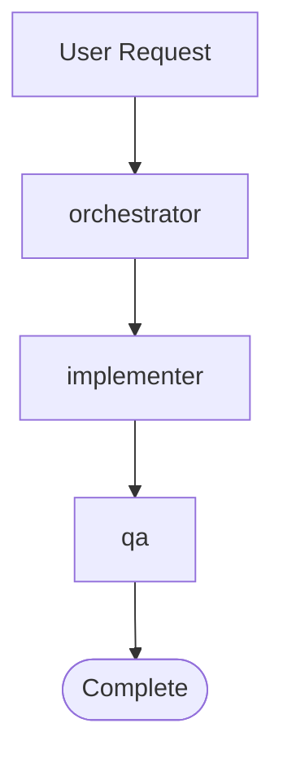
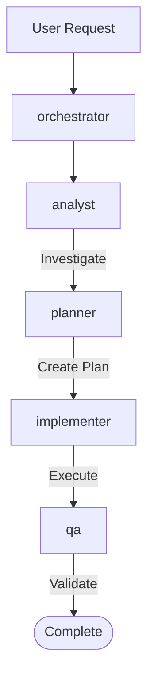
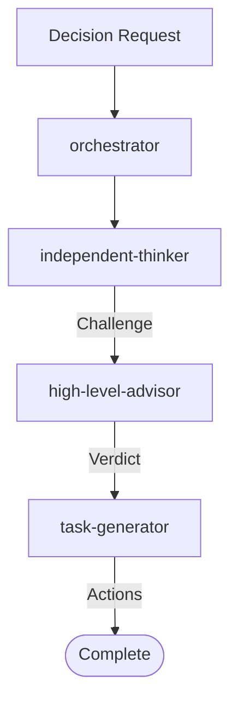
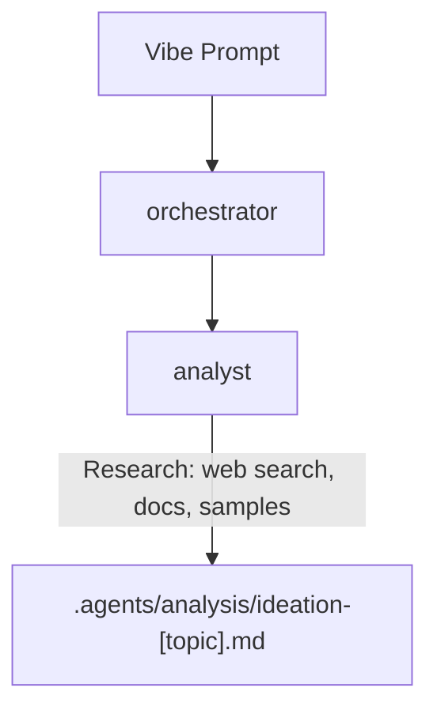
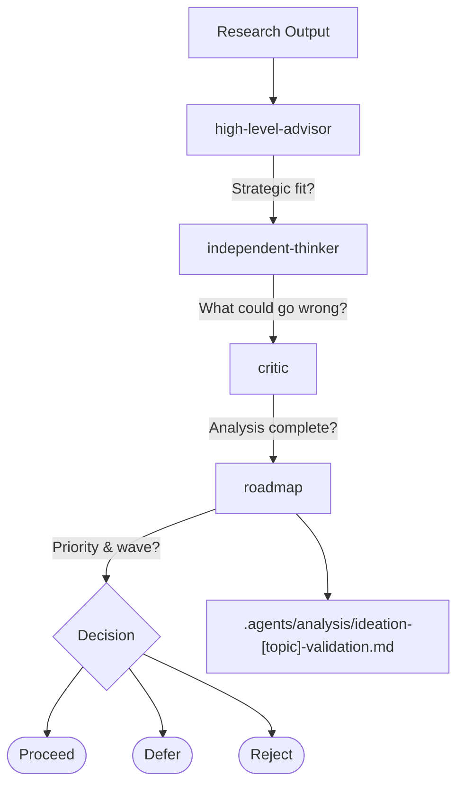
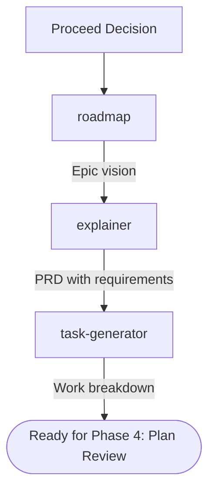
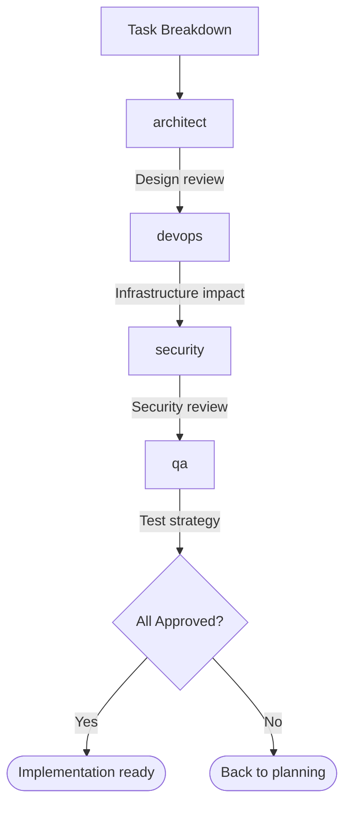
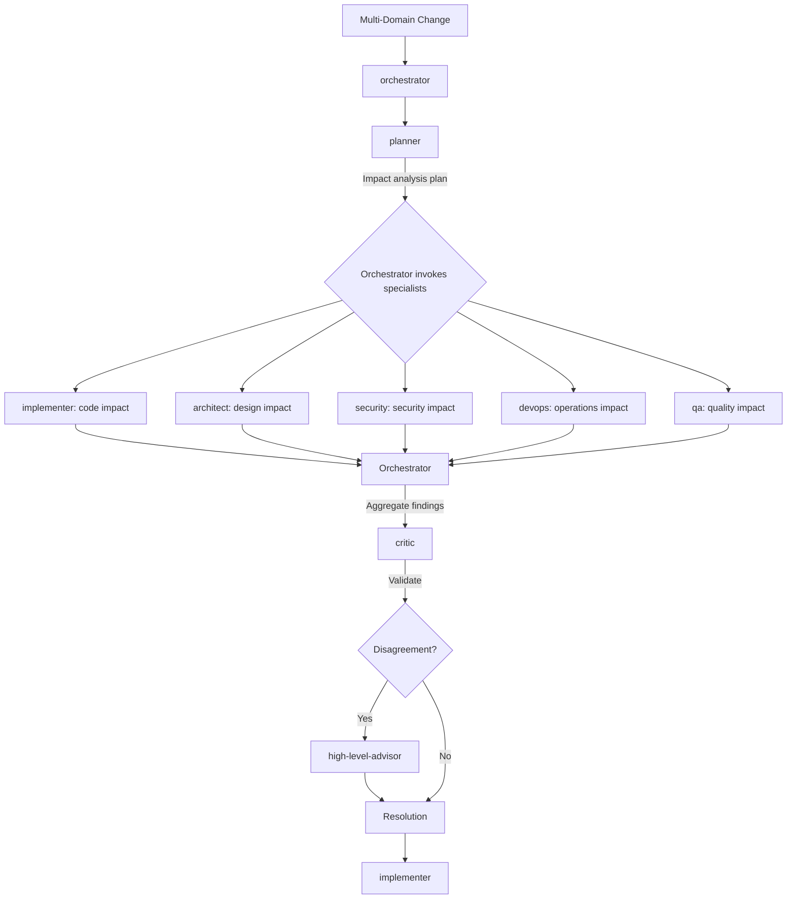
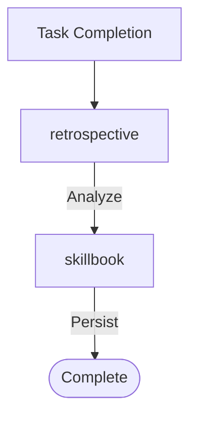
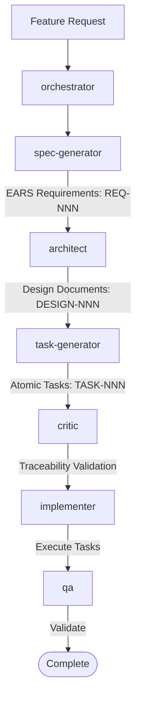

# Multi-Agent Orchestration System

## 1. Executive Summary

### Purpose

This multi-agent system coordinates specialized AI agents for software development tasks. Each agent has deep expertise in a specific domain, enabling high-quality outputs through division of labor and explicit quality gates.

### Key Benefits

| Benefit | Description |
|---------|-------------|
| **Specialization** | Each agent excels at one thing rather than being mediocre at many |
| **Quality Gates** | Critic and QA agents validate work before it proceeds |
| **Knowledge Persistence** | Memory system preserves learnings across sessions |
| **Clear Handoffs** | Explicit protocols prevent context loss between agents |
| **Traceability** | All decisions documented in `.agents/` directories |

### Quick Start

```python
# For complex tasks, start with orchestrator
Task(subagent_type="orchestrator", prompt="Implement user authentication feature")

# For specific domain work, invoke directly
Task(subagent_type="implementer", prompt="Fix null check in UserService.cs")
Task(subagent_type="analyst", prompt="Investigate API latency issues")
```

### Agent Count

This system includes **18 specialized agents** organized into 5 categories.

---

## 2. Agent Catalog

### 2.1 Coordination Agents

#### orchestrator

**File**: `src/claude/orchestrator.md`

**Role**: Central coordinator routing tasks to appropriate specialists

**Specialization**: Task analysis, agent selection, workflow management

**Input**:
- User request or task description
- Context from previous work (optional)

**Output**:
- Delegated work to appropriate agents
- Coordinated multi-agent workflows
- Final results aggregation

**Delegates To**: All agents (based on task analysis)

**Called By**: User (entry point), pr-comment-responder

**When to Use**:
- Complex multi-step tasks requiring multiple specialists
- When unsure which agent to use
- Tasks requiring coordination across domains

**Example Invocation**:
```text
@orchestrator Implement a rate limiting feature for the API endpoints.
Include security review and test coverage.
```

---

#### planner

**File**: `src/claude/planner.md`

**Role**: Creates milestones and work packages from epics and PRDs

**Specialization**: Task decomposition, dependency analysis, milestone definition

**Input**:
- Epic or PRD document
- Technical constraints
- Business requirements

**Output**:
- Milestone definitions with goals
- Work packages with dependencies
- Impact analysis requests to specialists

**Delegates To**: analyst, architect, qa, devops, security (for impact analysis)

**Called By**: orchestrator, roadmap

**When to Use**:
- Breaking down epics into implementable chunks
- Creating project milestones
- Understanding work dependencies

**Example Invocation**:
```text
@planner Break down EPIC-001 (User Authentication) into milestones
with clear acceptance criteria and dependencies.
```

---

#### task-generator

**File**: `src/claude/task-generator.md`

**Role**: Creates atomic tasks with acceptance criteria from milestones

**Specialization**: Task atomization, complexity estimation, sequencing

**Input**:
- Milestone or work package from planner
- PRD requirements

**Output**:
- Atomic task definitions (TASK-NNN format)
- Acceptance criteria per task
- Complexity estimates (XS/S/M/L/XL)
- Dependency graph

**Delegates To**: None (returns to orchestrator)

**Called By**: orchestrator, planner

**When to Use**:
- After PRD or milestone is created
- When breaking work into assignable units
- Generating implementation-ready task lists

**Example Invocation**:
```text
@task-generator Generate atomic tasks from the Authentication milestone.
Include complexity estimates and file impact.
```

---

### 2.2 Implementation Agents

#### implementer

**File**: `src/claude/implementer.md`

**Role**: Writes production-quality code following established patterns

**Specialization**: C#, .NET, test-driven development, SOLID principles

**Input**:
- Task specification with acceptance criteria
- Design decisions from architect
- Steering file context

**Output**:
- Implementation code
- Unit tests (100% coverage target)
- Documentation updates

**Delegates To**: None (returns to orchestrator)

**Called By**: orchestrator, planner

**When to Use**:
- Writing new code for defined tasks
- Fixing bugs with clear reproduction steps
- Refactoring with architect guidance

**Example Invocation**:
```text
@implementer Implement the GetUserPreferences method as specified in TASK-042.
Follow the design in ADR-015. Ensure 100% test coverage.
```

---

#### devops

**File**: `src/claude/devops.md`

**Role**: Designs CI/CD pipelines and deployment automation

**Specialization**: GitHub Actions, Azure Pipelines, MSBuild, infrastructure

**Input**:
- Pipeline requirements
- Deployment targets
- Infrastructure constraints

**Output**:
- Pipeline configurations (YAML)
- Build scripts
- Infrastructure documentation in `.agents/devops/`

**Delegates To**: None (returns to orchestrator)

**Called By**: orchestrator, planner

**When to Use**:
- Modifying `.github/workflows/`
- Configuring build systems
- Managing deployment processes

**Example Invocation**:
```text
@devops Create a GitHub Actions workflow for automated NuGet publishing
on release tags. Include security scanning.
```

---

#### security

**File**: `src/claude/security.md`

**Role**: Vulnerability assessment and threat modeling

**Specialization**: OWASP Top 10, STRIDE analysis, secure coding, CWE detection

**Input**:
- Code to review
- Feature design
- Change scope

**Output**:
- Threat models in `.agents/security/TM-NNN-*.md`
- Security reports in `.agents/security/SR-NNN-*.md`
- Post-Implementation Verification (PIV) reports

**Delegates To**: None (returns to orchestrator)

**Called By**: orchestrator, architect, devops

**When to Use**:
- Touching auth/authorization code
- Handling user data
- Adding external APIs
- Reviewing security-sensitive changes

**Example Invocation**:
```text
@security Review the OAuth implementation for vulnerabilities.
Create a threat model and identify required controls.
```

---

### 2.3 Quality Agents

#### critic

**File**: `src/claude/critic.md`

**Role**: Validates plans before implementation begins

**Specialization**: Plan review, risk identification, scope validation

**Input**:
- Planning artifacts (PRDs, task breakdowns)
- Acceptance criteria
- Business objectives

**Output**:
- Critique report in `.agents/critique/`
- Approval/rejection with rationale
- Specific improvement recommendations

**Delegates To**: None (returns to orchestrator)

**Called By**: orchestrator, planner

**When to Use**:
- After planning artifacts created
- Before implementation begins
- Validating scope and completeness

**Example Invocation**:
```text
@critic Review the implementation plan at .agents/planning/PLAN-auth.md
Validate scope, risks, and alignment with requirements.
```

---

#### qa

**File**: `src/claude/qa.md`

**Role**: Verifies implementation works correctly for users

**Specialization**: Test strategy, coverage validation, user scenario testing

**Input**:
- Implementation to verify
- Acceptance criteria
- Test requirements

**Output**:
- Test strategies in `.agents/qa/NNN-*-test-strategy.md`
- Test reports in `.agents/qa/NNN-*-test-report.md`
- Coverage analysis

**Delegates To**: None (returns to orchestrator)

**Called By**: orchestrator, implementer

**When to Use**:
- Immediately after implementer changes
- Verifying acceptance criteria
- Assessing test coverage

**Example Invocation**:
```text
@qa Verify the UserAuthentication implementation.
Run tests, check coverage, and validate user scenarios.
```

---

#### independent-thinker

**File**: `src/claude/independent-thinker.md`

**Role**: Challenges assumptions with evidence-based analysis

**Specialization**: Contrarian analysis, assumption testing, alternative viewpoints

**Input**:
- Decision or assumption to challenge
- Existing analysis or proposal
- Claims to fact-check

**Output**:
- Evidence-based challenge or validation
- Alternative perspectives with tradeoffs
- Uncertainty declarations

**Delegates To**: None (returns to orchestrator)

**Called By**: orchestrator, high-level-advisor

**When to Use**:
- Validating important decisions
- Challenging group consensus
- Needing devil's advocate perspective

**Example Invocation**:
```text
@independent-thinker Challenge the assumption that microservices
are the right architecture for this project. What alternatives
should we consider?
```

---

### 2.4 Design Agents

#### architect

**File**: `src/claude/architect.md`

**Role**: Maintains architectural coherence and technical governance

**Specialization**: ADRs, design patterns, system boundaries, impact analysis

**Input**:
- Design questions or proposals
- Technical change requests
- Cross-cutting concerns

**Output**:
- ADRs in `.agents/architecture/ADR-NNN-*.md`
- Design guidance
- Impact analysis

**Delegates To**: None (returns to orchestrator)

**Called By**: orchestrator, planner, roadmap

**When to Use**:
- Introducing new dependencies
- Changing system boundaries
- Making cross-cutting technical decisions

**Example Invocation**:
```text
@architect Design the caching layer for user sessions.
Document the decision in an ADR with tradeoff analysis.
```

---

#### analyst

**File**: `src/claude/analyst.md`

**Role**: Research and investigation specialist

**Specialization**: Root cause analysis, API research, requirements gathering, feature request evaluation

**Input**:
- Problem to investigate
- Feature request to evaluate
- Research topic

**Output**:
- Analysis reports in `.agents/analysis/`
- Root cause findings
- Requirements documentation
- Feature evaluation with RICE scoring

**Delegates To**: None (returns to orchestrator)

**Called By**: orchestrator, planner

**When to Use**:
- Investigating bugs (unclear cause)
- Evaluating feature requests
- Pre-implementation research
- Understanding external APIs

**Example Invocation**:
```text
@analyst Investigate why API responses are slow for large datasets.
Identify the bottleneck and recommend solutions.
```

---

#### explainer

**File**: `src/claude/explainer.md`

**Role**: Creates PRDs and technical documentation

**Specialization**: Product requirements, feature specs, junior-developer-friendly docs

**Input**:
- Feature concept or request
- Clarifying answers from user

**Output**:
- PRDs in `.agents/planning/PRD-*.md`
- Explainer documents
- Technical specifications

**Delegates To**: None (returns to orchestrator)

**Called By**: orchestrator, roadmap

**When to Use**:
- Creating feature specifications
- Documenting requirements
- Explaining complex features

**Example Invocation**:
```text
@explainer Create a PRD for the user notification system.
Ask clarifying questions before writing.
```

---

### 2.5 Strategy Agents

#### high-level-advisor

**File**: `src/claude/high-level-advisor.md`

**Role**: Brutally honest strategic advisor

**Specialization**: Ruthless triage, decision-making, priority conflicts

**Input**:
- Strategic decision or conflict
- Multi-agent disagreements
- Priority disputes

**Output**:
- Clear verdicts (do X, not options)
- Priority stack (P0/P1/P2/KILL)
- Continue/Pivot/Cut recommendations

**Delegates To**: None (returns to orchestrator)

**Called By**: orchestrator, roadmap

**When to Use**:
- Strategic impasses
- Conflicting agent recommendations
- Hard prioritization decisions
- Decision paralysis

**Example Invocation**:
```text
@high-level-advisor We're stuck between rewriting the auth system
or patching it. Team is split. Give us a verdict.
```

---

#### roadmap

**File**: `src/claude/roadmap.md`

**Role**: Strategic product owner defining WHAT and WHY

**Specialization**: Epic definition, RICE/KANO prioritization, product vision

**Input**:
- Feature vision or idea
- Business context
- User needs

**Output**:
- Epic definitions in `.agents/roadmap/`
- Roadmap updates
- Priority recommendations

**Delegates To**: None (returns to orchestrator)

**Called By**: orchestrator, high-level-advisor

**When to Use**:
- Defining new features
- Prioritizing backlog
- Validating work alignment with strategy

**Example Invocation**:
```text
@roadmap Define an epic for multi-tenant support.
Prioritize it against existing roadmap items.
```

---

#### retrospective

**File**: `src/claude/retrospective.md`

**Role**: Extracts learnings from execution

**Specialization**: Five Whys, Fishbone analysis, skill extraction

**Input**:
- Task or session to analyze
- Execution artifacts
- Feedback

**Output**:
- Retrospective reports in `.agents/retrospective/`
- Skill recommendations (ADD/UPDATE/TAG/REMOVE)
- Process improvements

**Delegates To**: skillbook (via orchestrator)

**Called By**: orchestrator

**When to Use**:
- After task completion
- After failures
- Session end
- Milestone completion

**Example Invocation**:
```text
@retrospective Analyze the authentication implementation session.
Extract learnings and recommend skill updates.
```

---

### 2.6 Support Agents

#### memory

**File**: `src/claude/memory.md`

**Role**: Cross-session context management

**Specialization**: Knowledge retrieval, context persistence, skill citation

**Input**:
- Context retrieval query
- Milestone summary to store

**Output**:
- Retrieved context
- Storage confirmation
- Skill citations

**Delegates To**: None (returns to orchestrator)

**Called By**: orchestrator (typically at session start/end)

**When to Use**:
- Session start for context retrieval
- Milestone completion for persistence
- Complex memory operations

**Example Invocation**:
```text
@memory Retrieve context about the authentication feature
implementation from previous sessions.
```

---

#### skillbook

**File**: `src/claude/skillbook.md`

**Role**: Manages learned strategies and patterns

**Specialization**: Skill storage, deduplication, quality gates

**Input**:
- Reflection with pattern, evidence, recommendation
- Skill update requests

**Output**:
- Skill entity creation/update
- Deduplication results
- Quality validation

**Delegates To**: None (returns to orchestrator)

**Called By**: orchestrator (after retrospective)

**When to Use**:
- After retrospective analysis
- Persisting proven strategies
- Removing harmful patterns

**Example Invocation**:
```text
@skillbook Add skill from retrospective:
## Pattern: Use /m:1 flag for CI builds
## Evidence: Reduced file locking errors by 100%
## Recommendation: ADD
```

---

#### pr-comment-responder

**File**: `src/claude/pr-comment-responder.md`

**Role**: Handles PR review comments

**Specialization**: Comment triage, reviewer communication, bot handling

**Input**:
- PR number
- Review comments to address

**Output**:
- Comment map in `.agents/pr-comments/PR-[N]/`
- Task lists
- Reply drafts

**Delegates To**: orchestrator (for analysis and implementation)

**Called By**: User (via /pr-comment-responder command)

**When to Use**:
- Responding to GitHub PR review comments
- Managing bot reviewer feedback
- Coordinating comment resolution

**Example Invocation**:
```text
@pr-comment-responder Address all review comments on PR #47.
Triage by priority and implement fixes.
```

---

## 3. Workflow Patterns

**Reference**: These workflows are the canonical patterns defined in `../../src/claude/orchestrator.md`. The orchestrator coordinates all agent delegation using a one-level-deep pattern (orchestrator → subagent → back to orchestrator).

### 3.1 Quick Fix Flow

For simple, well-defined fixes that can be explained in one sentence.



**Agents**: `orchestrator → implementer → qa`

**Use When**: 
- Single file changes
- Obvious bug fixes
- Typo fixes
- Simple null checks
- Style/formatting issues

**Triage Signal**: Can explain fix in one sentence

---

### 3.2 Standard Development Flow

For typical features requiring investigation and planning.



**Agents**: `orchestrator → analyst → planner → implementer → qa`

**Use When**:
- Need to investigate first
- 2-5 files affected
- Some complexity
- New functionality
- Performance concerns

**Triage Signal**: Cannot explain fix in one sentence; requires analysis

**Variations**:

- **Standard (lite)**: Skip planner for straightforward implementations after analysis
  - Bug fixes: `analyst → implementer → qa`
  - Documentation: `explainer → critic`

- **Standard (extended)**: Add architecture/security review
  - Multi-domain features: `analyst → architect → planner → critic → implementer → qa`
  - Security changes: `analyst → security → architect → critic → implementer → qa`
  - Infrastructure: `analyst → devops → security → critic → qa`

---

### 3.3 Strategic Decision Flow

For decisions about WHETHER to do something (not HOW).



**Agents**: `orchestrator → independent-thinker → high-level-advisor → task-generator`

**Use When**:
- "Should we do this?" questions
- Scope/priority conflicts
- Alternative approaches
- Architecture direction questions

**Triage Signal**: Question is about *whether*, not *how*

---

### 3.4 Ideation Flow

For exploring vague ideas and package requests.

**Trigger Detection**:
- Package/library URLs
- Vague scope: "we need to add", "what if we"
- Incomplete feature descriptions
- Exploratory requests

**Phase 1: Research & Discovery**



**Phase 2: Validation & Consensus**



**Phase 3: Epic & PRD Creation** (if Proceed)



**Phase 4: Plan Review** (all must approve)



**Full Sequence**: `analyst → high-level-advisor → independent-thinker → critic → roadmap → explainer → task-generator → architect → devops → security → qa`

**Defer Handling**: Create backlog entry at `.agents/roadmap/backlog.md` with resume conditions

**Reject Handling**: Document reasoning in validation file, report to user

---

### 3.5 Impact Analysis Flow

For multi-domain changes (3+ domains: code, architecture, security, ops, quality).

**Trigger Conditions**:
- Feature touches 3+ domains
- Security-sensitive areas (auth, data, external APIs)
- Breaking changes (API, schema)
- Infrastructure changes (CI/CD, deployment)
- High-risk changes (production-critical)



**Note**: Orchestrator executes each consultation and aggregates (subagents cannot delegate to each other)

**Disagree and Commit Protocol**:
1. All specialists present positions with data
2. Critic facilitates discussion
3. High-level-advisor makes final call if needed
4. All commit to execution once decided

---

### 3.6 Learning Extraction Flow

For capturing institutional knowledge.



**Agents**: `orchestrator → retrospective → skillbook`

**Use When**: After task completion, failures, session end

---

### 3.7 Spec Layer Workflow (Phase 1+)

For structured requirements management with 3-tier traceability.

**Note**: This workflow integrates with Standard Flow. Orchestrator coordinates all delegation. See `../../src/claude/orchestrator.md` for delegation patterns.



**Agents**: `orchestrator → spec-generator → architect → task-generator → critic → implementer → qa`

**Use When**: Formal requirements needed, regulatory compliance, complex features requiring traceability

**Traceability Chain**: `REQ-NNN → DESIGN-NNN → TASK-NNN`

**Validation**: Every TASK traces to DESIGN, every DESIGN traces to REQ

---

## 4. Routing Heuristics

### Request Pattern Matching

| Request Pattern | Primary Agent | Fallback | Notes |
|-----------------|---------------|----------|-------|
| "implement", "code", "fix", "add" | implementer | architect | Direct coding tasks |
| "test", "coverage", "qa", "verify" | qa | implementer | Quality verification |
| "design", "architecture", "ADR" | architect | planner | Design decisions |
| "investigate", "research", "why" | analyst | explainer | Root cause analysis |
| "review", "critique", "validate" | critic | independent-thinker | Plan validation |
| "deploy", "ci", "pipeline", "build" | devops | implementer | Infrastructure |
| "security", "vulnerability", "threat" | security | analyst | Security review |
| "document", "explain", "PRD" | explainer | analyst | Documentation |
| "plan", "break down", "milestone" | planner | task-generator | Work decomposition |
| "task", "atomic", "estimate" | task-generator | planner | Task generation |
| "prioritize", "roadmap", "epic" | roadmap | high-level-advisor | Product strategy |
| "decide", "verdict", "stuck" | high-level-advisor | independent-thinker | Strategic decisions |
| "learn", "retro", "what went wrong" | retrospective | analyst | Learning extraction |
| "PR comment", "review feedback" | pr-comment-responder | orchestrator | PR management |

### Agent Selection Matrix

| Task Type | Primary | Secondary | Validator |
|-----------|---------|-----------|-----------|
| New feature | architect | planner | critic |
| Bug fix | analyst | implementer | qa |
| Refactor | architect | implementer | critic |
| Documentation | explainer | analyst | - |
| Security review | security | analyst | critic |
| Performance | analyst | implementer | qa |
| CI/CD change | devops | implementer | security |

---

## 5. Memory and Handoff System

### 5.1 Session Handoff

#### HANDOFF.md Structure

At session end, create a handoff document:

```markdown
# Session Handoff

**Date**: YYYY-MM-DD
**Session ID**: [unique identifier]

## Work Completed
- [Task 1]: [Status]
- [Task 2]: [Status]

## Context for Next Session
- [Important context 1]
- [Important context 2]

## Pending Items
- [ ] [Incomplete task]

## Decisions Made
- [Decision 1]: [Rationale]

## Files Modified
- [path/to/file]: [Change type]
```

#### Session Log Location

`.agents/sessions/YYYY-MM-DD-[scope].md`

### 5.2 Memory Protocol

All agents access memory via cloudmcp-manager tools:

```python
# Search for context (before work)
mcp__cloudmcp-manager__memory-search_nodes
Query: "[topic] [keywords]"

# Store learnings (after work)
mcp__cloudmcp-manager__memory-add_observations
{
  "observations": [{
    "entityName": "[Entity-Name]",
    "contents": ["[Observation with source]"]
  }]
}

# Create new entities
mcp__cloudmcp-manager__memory-create_entities
{
  "entities": [{
    "name": "[Entity-Name]",
    "entityType": "[Type]",
    "observations": ["[Initial observations]"]
  }]
}
```

### 5.3 Skill Persistence

Skills extracted from retrospectives are stored with:

| Field | Description |
|-------|-------------|
| Statement | Atomic strategy (max 15 words) |
| Context | When to apply |
| Evidence | Specific execution reference |
| Atomicity | Quality score (70%+ required) |
| Tag | helpful / harmful / neutral |

### 5.4 Artifact Locations

| Directory | Purpose | Agent |
|-----------|---------|-------|
| `.agents/analysis/` | Research findings | analyst |
| `.agents/architecture/` | ADRs, design decisions | architect |
| `.agents/planning/` | PRDs, plans, tasks | planner, explainer |
| `.agents/critique/` | Plan reviews | critic |
| `.agents/qa/` | Test strategies, reports | qa |
| `.agents/retrospective/` | Learning extractions | retrospective |
| `.agents/roadmap/` | Epic definitions | roadmap |
| `.agents/devops/` | Pipeline configs | devops |
| `.agents/security/` | Threat models | security |
| `.agents/sessions/` | Session context | memory |
| `.agents/skills/` | Skill files | skillbook |
| `.agents/specs/requirements/` | EARS requirements (Phase 1+) | spec-generator |
| `.agents/specs/design/` | Design documents (Phase 1+) | architect |
| `.agents/specs/tasks/` | Atomic tasks (Phase 1+) | task-generator |
| `.agents/steering/` | Context-aware guidance (Phase 4+) | orchestrator |
| `.agents/governance/` | Naming, consistency protocols | all agents |

---

## 6. Parallel Execution

### 6.0 Overview

Parallel execution enables multiple agents to work simultaneously on independent tasks, reducing wall-clock time by 30-50% compared to sequential execution. This pattern was validated in Sessions 19-22 where parallel agent dispatch completed work in approximately 20 minutes versus an estimated 50 minutes for sequential execution.

**Key Benefit**: Time savings come from overlapping execution, not reduced work. Coordination overhead of 10-20% is expected.

### 6.1 When to Use Parallel Execution

#### Use Parallel Execution When

| Condition | Rationale |
|-----------|-----------|
| Tasks are independent | No shared state or dependencies between tasks |
| Tasks can complete in any order | Results do not feed into each other |
| Wall-clock time is priority | Faster completion outweighs token efficiency |
| Analyzing same artifact from different perspectives | Multiple agents reviewing same code/design |
| Tasks modify different files | No staging conflicts possible |

#### Use Sequential Execution When

| Condition | Rationale |
|-----------|-----------|
| Tasks have dependencies | Task B requires output from Task A |
| Shared state modifications | Same files edited (staging conflicts) |
| Cost optimization priority | Sequential uses fewer total tokens |
| Learning transfer valuable | Later tasks benefit from earlier findings |
| Rate limit concerns | Insufficient API budget for parallel calls |

### 6.2 Orchestrator Responsibilities

The orchestrator manages all parallel execution coordination (subagents cannot delegate to each other).

| Responsibility | Description | When |
|----------------|-------------|------|
| **Task Analysis** | Identify independent vs dependent tasks | Before dispatch |
| **Prerequisite Checks** | Verify rate limits, worktree availability | Before dispatch |
| **Agent Dispatch** | Spawn parallel agents with clear boundaries | Start of parallel phase |
| **Progress Monitoring** | Track completion status of each agent | During execution |
| **Result Collection** | Aggregate outputs from all parallel sessions | After all complete |
| **Conflict Resolution** | Handle any staging conflicts from parallel work | After collection |
| **Session Coordination** | Single atomic update after all sessions complete | After resolution |

### 6.3 Parallel Execution Pattern Template

#### Prerequisites Checklist

Before launching parallel agents, verify:

```markdown
## Parallel Execution Readiness

- [ ] Tasks are independent (no dependencies)
- [ ] No shared file modifications
- [ ] Rate limit checked (sufficient API budget)
- [ ] Worktree directories prepared (if needed)
- [ ] Orchestrator can aggregate results
- [ ] Session log created for coordination
```

#### Execution Steps

```text
1. Orchestrator creates task list with clear boundaries
2. Orchestrator verifies prerequisites (rate limit, independence)
3. Orchestrator dispatches N parallel agents
4. Each agent creates individual session log
5. Each agent writes results to designated output location
6. Orchestrator monitors completion (polling or callbacks)
7. Orchestrator aggregates results after all complete
8. Orchestrator resolves any conflicts
9. Orchestrator commits with all session IDs referenced
```

#### Rate Limit Pre-Check

Before launching parallel operations that make GitHub API calls:

```text
Required budget = num_agents x calls_per_agent
Available budget = remaining API calls

If Available < Required:
  - Reduce parallelism
  - Wait for reset
  - Fail fast with clear error

GraphQL limit (5000/hour) is separate from REST limit.
```

### 6.4 Worktree Isolation Pattern

When parallel agents need to modify files, use git worktrees to prevent conflicts.

#### Correct Pattern

```bash
# Create dedicated worktree directory
mkdir -p /path/to/repo-worktrees

# Create worktree with local tracking branch (avoids detached HEAD)
git fetch origin feature-branch
git worktree add -b pr-300 ../repo-worktrees/pr-300 origin/feature-branch

# Agent works in isolated directory
cd /path/to/repo-worktrees/pr-300
```

#### Why This Matters

| Issue | Problem | Solution |
|-------|---------|----------|
| Detached HEAD | Agents don't know their branch | Use `-b` flag to create tracking branch |
| Push complexity | Must specify remote explicitly | Local branch tracks remote automatically |
| Directory pollution | Worktrees scattered in home | Use dedicated parent directory |
| Cleanup difficulty | Hard to find all worktrees | Single parent makes cleanup simple |

#### Cleanup

```bash
# When done with parallel work
cd /path/to/main-repo
git worktree list          # See all worktrees
git worktree remove ../repo-worktrees/pr-300  # Remove specific
rm -rf /path/to/repo-worktrees  # Remove parent when all done
```

### 6.5 Sectioning Pattern

When subtasks are independent, document parallel execution:

```markdown
## Parallel Analysis

### Section A: Architecture Impact
Agent: architect
Status: In Progress

### Section B: Security Impact
Agent: security
Status: In Progress

### Section C: QA Impact
Agent: qa
Status: In Progress
```

### 6.6 Voting Pattern

For critical decisions, use redundant execution:

```markdown
## Voting Session

### Vote 1: independent-thinker
Recommendation: [A]
Confidence: [%]

### Vote 2: architect
Recommendation: [A]
Confidence: [%]

### Vote 3: analyst
Recommendation: [B]
Confidence: [%]

### Result
Majority: [A] (2/3)
```

### 6.7 Aggregation Strategies

| Strategy | Use When | Process |
|----------|----------|---------|
| **merge** | Non-conflicting outputs | Combine all results |
| **vote** | Conflicting recommendations | Select majority |
| **escalate** | Critical conflicts | Route to high-level-advisor |

### 6.8 Session Coordination Protocol

When running parallel agents, coordinate session logs:

#### Individual Agent Sessions

Each parallel agent creates its own session log:

```text
.agents/sessions/2025-12-29-session-19-parallel-pr-300.md
.agents/sessions/2025-12-29-session-20-parallel-pr-301.md
.agents/sessions/2025-12-29-session-21-parallel-pr-302.md
```

#### Orchestrator Aggregation

After all agents complete, orchestrator:

1. Reads all parallel session logs
2. Aggregates outcomes into summary
3. Updates Serena memory with cross-session context
4. Creates single commit referencing all session IDs

#### Commit Message Format

```text
docs: parallel execution of PRs #300, #301, #302

Sessions: 19, 20, 21
- PR #300: [outcome]
- PR #301: [outcome]
- PR #302: [outcome]
```

### 6.9 Example Scenarios

#### Example 1: Multi-PR Review (Sessions 19-22)

**Context**: Four PRs ready for independent review.

**Approach**: Parallel dispatch with worktree isolation.

```text
Orchestrator Assessment:
- 4 independent PRs (no shared files)
- Each PR modifiable without conflicts
- Rate limit: 4000 remaining (1000 per agent budget)

Dispatch:
- Agent 1 → PR #300 (worktree: pr-300)
- Agent 2 → PR #301 (worktree: pr-301)
- Agent 3 → PR #302 (worktree: pr-302)
- Agent 4 → PR #303 (worktree: pr-303)

Results:
- Wall-clock: 20 minutes
- Sequential estimate: 50 minutes
- Savings: 60%
```

#### Example 2: Impact Analysis

**Context**: Feature touches architecture, security, and operations.

**Approach**: Parallel specialist review.

```text
Orchestrator dispatches (no worktrees needed, read-only analysis):
- architect → Design impact analysis
- security → Threat assessment
- devops → Infrastructure impact
- qa → Test strategy

Aggregation:
- Merge non-conflicting findings
- Escalate architect-security conflict to high-level-advisor
```

#### Example 3: Documentation Updates

**Context**: Multiple independent documentation files need updates.

**Approach**: Parallel with file isolation.

```text
Files assigned (no overlap):
- Agent 1 → README.md
- Agent 2 → CONTRIBUTING.md
- Agent 3 → docs/setup.md

No worktrees needed (different files, same branch).
Commit after all complete.
```

### 6.10 Limitations and Constraints

| Limitation | Impact | Mitigation |
|------------|--------|------------|
| **Rate limit exhaustion** | All agents fail mid-execution | Pre-check and budget allocation |
| **Staging conflicts** | Merge failures when agents touch same files | Worktree isolation or file-level assignment |
| **Context loss** | Parallel agents don't share learnings | Post-aggregation synthesis |
| **Coordination overhead** | 10-20% time spent on dispatch/aggregation | Accept as cost of parallelism |
| **Error propagation** | One agent failure affects overall result | Independent error handling per agent |
| **Memory fragmentation** | Multiple session logs to consolidate | Orchestrator aggregation protocol |

### 6.11 Anti-Patterns to Avoid

| Anti-Pattern | Problem | Correct Approach |
|--------------|---------|------------------|
| Parallel agents editing same file | Merge conflicts, lost work | Assign exclusive file ownership |
| No rate limit check before dispatch | API exhaustion mid-execution | Calculate and verify budget first |
| Detached HEAD worktrees | Push confusion, lost commits | Use `-b` flag for tracking branches |
| No session coordination | Scattered context, incomplete handoffs | Orchestrator aggregates all results |
| Parallel for dependent tasks | Incorrect results, wasted work | Sequential execution for dependencies |

---

## 7. Steering System

### 7.1 Overview

The steering system provides context-aware guidance injection based on file patterns, implementing the Kiro pattern of glob-based inclusion. This reduces token usage by 30%+ while maintaining quality.

**Status**: Phase 0 (Foundation) complete, Phase 4 (Implementation) planned

### 7.2 Steering File Locations

Location: `.agents/steering/`

| File | Glob Pattern | Purpose | Priority |
|------|--------------|---------|----------|
| `csharp-patterns.md` | `**/*.cs` | C# coding standards | 8 |
| `security-practices.md` | `**/Auth/**`, `*.env*` | Security requirements | 10 |
| `agent-prompts.md` | `src/claude/**/*.md` | Agent prompt patterns | 9 |
| `testing-approach.md` | `**/*.test.*`, `**/*.spec.*` | Testing conventions | 7 |
| `documentation.md` | `**/*.md` (excluding agents) | Documentation standards | 5 |

### 7.3 How Steering Works

#### 1. Task Analysis

Orchestrator analyzes files affected by task:

```text
Task: Implement OAuth2 token endpoint
Files: src/Auth/Controllers/TokenController.cs
       src/Auth/Services/TokenService.cs
```

#### 2. Pattern Matching

Match file paths against steering glob patterns:

```yaml
csharp-patterns.md → **/*.cs ✓ MATCH
security-practices.md → **/Auth/** ✓ MATCH
testing-approach.md → **/*.test.* ✗ NO MATCH
```

#### 3. Context Injection

Inject matched steering into agent prompt (prioritized by priority field).

#### 4. Token Savings

- **Without scoping**: All guidance (~10K tokens)
- **With scoping**: Only matched (~3K tokens)
- **Target savings**: 30%+

### 7.4 Injection Protocol

Orchestrator determines applicable steering:

1. Analyze task scope (files affected)
2. Match against steering glob patterns
3. Sort by priority (higher = more important)
4. Inject relevant steering into agent context
5. Respect token budget (prioritize most specific)

### 7.5 Implementation Timeline

| Phase | Status | Deliverable |
|-------|--------|-------------|
| Phase 0 | ✅ Complete | Directory structure, placeholders |
| Phase 4 | 📋 Planned | Content creation, injection logic |

---

## 8. Quality Gates

### 8.1 Critic Validation

Critic MUST review before implementation when:

- New architectural patterns introduced
- More than 5 files affected
- Security-sensitive changes
- Breaking changes to APIs

**Checklist**:
- [ ] Scope matches requirements
- [ ] Dependencies identified
- [ ] Risks documented
- [ ] Acceptance criteria testable
- [ ] Estimates reasonable

**Outcomes**: APPROVED / REJECTED / NEEDS WORK

### 8.2 QA Verification

QA validates after ALL implementer work:

| Check | Threshold |
|-------|-----------|
| New code coverage | ≥80% |
| All tests passing | 100% |
| User scenarios verified | All |
| No regressions | Confirmed |

### 8.3 Traceability Validation

Before completion:

- [ ] All tasks reference source requirements
- [ ] Implementation matches plan
- [ ] Tests cover acceptance criteria
- [ ] Documentation updated

---

## 9. Conflict Resolution

### 9.1 Agent Disagreement

When agents produce conflicting recommendations:

1. **Document Conflict**: Record both positions with evidence
2. **Escalate**: Route to high-level-advisor
3. **Verdict**: Advisor provides clear decision
4. **Document Rationale**: Record why decision was made

### 9.2 Scope Creep

Orchestrator enforces boundaries:

1. Compare current work against original scope
2. Flag additions not in requirements
3. Either: reject, or route to planner for scope update
4. Document decision

### 9.3 Blocked Tasks

When work cannot proceed:

```markdown
## Blocker Report

**Task**: [TASK-NNN]
**Blocker**: [Description]
**Type**: External / Technical / Missing Info

**Alternatives Attempted**:
1. [Alternative 1]: [Result]
2. [Alternative 2]: [Result]

**Recommendation**:
- [ ] Wait for [dependency]
- [ ] Pivot to [alternative task]
- [ ] Escalate to [agent/user]
```

---

## 10. Quick Reference Tables

### Workflow Selection

| Scenario | Workflow | Key Agents |
|----------|----------|------------|
| New feature from scratch | Ideation + Standard | architect, planner, implementer |
| Implement defined task | Quick Fix | implementer, qa |
| Investigate issue | Analysis | analyst, architect |
| Quality improvement | Standard | critic, qa |
| Strategic decision | Strategic | independent-thinker, high-level-advisor |
| Security review | Specialized | security, architect |
| Documentation | Specialized | explainer, analyst |
| PR comment response | PR Flow | pr-comment-responder, orchestrator |

### Agent Model Assignment

| Agent | Model | Rationale |
|-------|-------|-----------|
| orchestrator | sonnet | Fast routing decisions |
| implementer | sonnet | Balanced code generation |
| analyst | sonnet | Research efficiency |
| architect | sonnet | Design analysis |
| planner | sonnet | Planning speed |
| critic | sonnet | Review efficiency |
| qa | sonnet | Test validation |
| explainer | sonnet | Documentation |
| task-generator | sonnet | Task decomposition |
| high-level-advisor | opus | Strategic depth |
| independent-thinker | opus | Deep analysis |
| memory | sonnet | Simple operations |
| retrospective | sonnet | Learning extraction |
| skillbook | sonnet | Skill management |
| devops | sonnet | Infrastructure |
| roadmap | opus | Strategic vision |
| security | opus | Thorough review |
| pr-comment-responder | sonnet | Comment handling |

---

## 11. Extension Points

### 11.1 Adding New Agents

1. **Create Agent Prompt**: `src/claude/[agent-name].md`

```markdown
---
name: [agent-name]
description: [One-line description]
model: [sonnet/opus/haiku]
argument-hint: [Usage hint for users]
---
# [Agent Name] Agent

## Core Identity
[Role description]

## Claude Code Tools
[Available tools]

## Core Mission
[Primary purpose]

## Key Responsibilities
[Numbered list]

## Memory Protocol
[How to use cloudmcp-manager]

## Output Location
[Where artifacts are saved]

## Handoff Protocol
[How to return results]

## Execution Mindset
[Guiding principles]
```

2. **Register in AGENT-SYSTEM.md**: Add to Agent Catalog

3. **Update Routing**: Add patterns to routing heuristics

4. **Create Output Directory**: `mkdir .agents/[agent-name]/`

### 11.2 Adding Steering Files

1. **Create Steering File**: `.agents/steering/[domain].md`

```markdown
# [Domain] Steering

## Scope
Glob pattern: `[pattern]`

## Guidelines
[Domain-specific guidance]

## Anti-Patterns
[What to avoid]

## Examples
[Good and bad examples]
```

2. **Register Pattern**: Add to Steering File Locations table

### 11.3 Adding Workflows

1. **Document Workflow**:

```markdown
### [Workflow Name] Flow

**Purpose**: [What this workflow accomplishes]

**Agents**: `agent1 → agent2 → agent3`

**Use When**: [Trigger conditions]

**Diagram**:
[ASCII or Mermaid diagram]
```

2. **Update Workflow Selection Table**

3. **Add Routing Rules**: Update orchestrator patterns if needed

---

## 12. Appendix

### A. Entity Naming Conventions

| Type | Pattern | Example |
|------|---------|---------|
| Feature | `Feature-[Name]` | `Feature-Authentication` |
| Module | `Module-[Name]` | `Module-Identity` |
| Decision | `ADR-[Number]` | `ADR-001` |
| Pattern | `Pattern-[Name]` | `Pattern-StrategyTax` |
| Problem | `Problem-[Name]` | `Problem-CachingRace` |
| Solution | `Solution-[Name]` | `Solution-LockingCache` |
| Skill | `Skill-[Category]-[Number]` | `Skill-Build-001` |
| Epic | `EPIC-[Number]-[name]` | `EPIC-001-authentication` |

### B. Relation Types

| Relation | Meaning |
|----------|---------|
| `implemented_in` | Feature in module |
| `depends_on` | Entity requires another |
| `replaces` | New replaces old |
| `supersedes` | Newer version |
| `related_to` | General association |
| `blocked_by` | Progress blocked |
| `solved_by` | Problem has solution |
| `derived_from` | Skill from learning |

### C. Skill Categories

| Category | Description |
|----------|-------------|
| Build | Compilation patterns |
| Test | Testing strategies |
| Debug | Debugging techniques |
| Design | Architecture patterns |
| Perf | Performance optimization |
| Process | Workflow improvements |
| Tool | Tool-specific knowledge |

### D. Priority Definitions

| Priority | Meaning | Action |
|----------|---------|--------|
| P0 | Critical | Do today |
| P1 | Important | Do this week |
| P2 | Nice to have | Do eventually |
| KILL | Waste | Stop doing |

---

*Last updated: 2025-12-29 | Version 2.1*
