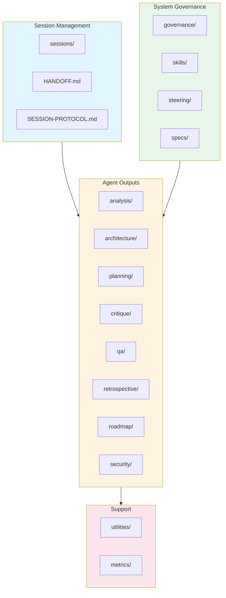
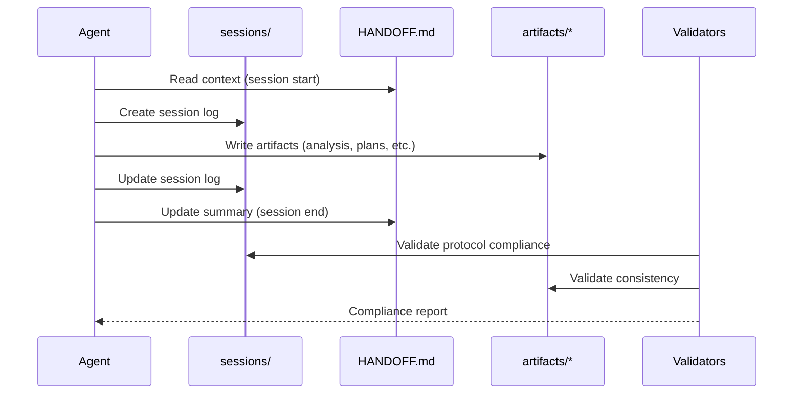
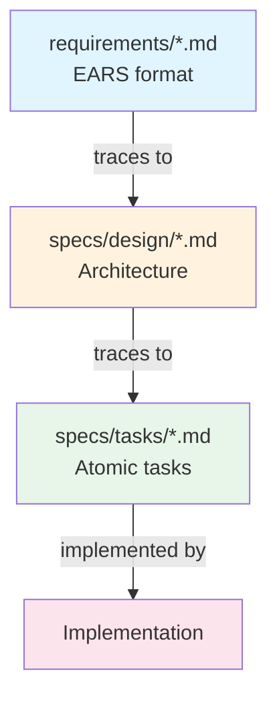

# Agent Artifacts System

This document describes the automated actors and artifact management system in the `.agents/` directory.

## Overview

The `.agents/` directory is the central repository for all agent-generated artifacts, session management, and governance documentation. It serves as the persistent knowledge base across agent sessions.

## Architecture

## Directory Catalog

### Session Management

| Directory/File | Purpose | Automated Actor |
|----------------|---------|-----------------|
| `sessions/` | Session logs (YYYY-MM-DD-session-NN.md) | All agents |
| `HANDOFF.md` | Cross-session context bridge | All agents (on session end) |
| `SESSION-PROTOCOL.md` | RFC 2119 protocol requirements | Validation scripts |
| `AGENT-SYSTEM.md` | System documentation | Architect/Orchestrator |

### Agent Output Directories

| Directory | Primary Agent | Output Types |
|-----------|---------------|--------------|
| `analysis/` | analyst | Research findings, CVAs, impact assessments |
| `architecture/` | architect | ADRs only (no review documents) |
| `planning/` | planner | PRDs, milestones, task breakdowns |
| `critique/` | critic | Plan reviews, ADR reviews, approval/rejection |
| `qa/` | qa | Test strategies, test reports |
| `retrospective/` | retrospective | Session retrospectives, skill extractions |
| `roadmap/` | roadmap | Epics, prioritization, product roadmap |
| `security/` | security | Threat models, security reviews |

### Governance

| Directory | Purpose |
|-----------|---------|
| `governance/` | Naming conventions, consistency protocols |
| `specs/` | EARS requirements, design docs, task specs |
| `steering/` | Context-aware guidance files |
| `skills/` | Learned skills and strategies |

---

## Automated Actors

### Session Protocol Validator

**Role**: Enforces RFC 2119 session protocol compliance

| Attribute | Value |
|-----------|-------|
| **Script** | `scripts/Validate-SessionProtocol.ps1` |
| **Trigger** | CI on `.agents/**` changes, manual |
| **Input** | Session logs, HANDOFF.md |
| **Output** | Compliance report |

**Validations**:

| Check | RFC Level | Description |
|-------|-----------|-------------|
| Serena initialization | MUST | Evidence in session log |
| HANDOFF.md read | MUST | Content referenced |
| Session log created | MUST | File exists with naming |
| HANDOFF.md updated | MUST | Modified before close |
| Markdown lint | MUST | Clean lint |

---

### Consistency Validator

**Role**: Cross-document consistency enforcement

| Attribute | Value |
|-----------|-------|
| **Script** | `scripts/Validate-Consistency.ps1` |
| **Trigger** | CI, manual |
| **Input** | `.agents/` artifacts |
| **Output** | Consistency report |

**Validations**:

- Naming convention compliance
- Cross-reference integrity
- Requirement coverage

---

### Planning Artifacts Validator

**Role**: Planning document consistency checker

| Attribute | Value |
|-----------|-------|
| **Script** | `build/scripts/Validate-PlanningArtifacts.ps1` |
| **Trigger** | CI on `.agents/planning/**` |
| **Input** | PRDs, task breakdowns |
| **Output** | Validation report |

**Checks**:

- Effort estimate divergence
- Orphan specialist conditions
- Missing task coverage

---

## Data Flow

## Artifact Naming Conventions

Source: `governance/naming-conventions.md`

| Artifact Type | Pattern | Example |
|---------------|---------|---------|
| Session Log | `YYYY-MM-DD-session-NN-description.md` | `2025-12-18-session-24-docs.md` |
| ADR | `ADR-NNN-kebab-title.md` | `ADR-001-database-selection.md` |
| PRD | `PRD-feature-name.md` | `PRD-oauth-integration.md` |
| Plan | `NNN-feature-plan.md` | `001-authentication-plan.md` |
| Analysis | `NNN-topic-analysis.md` | `001-copilot-cli-analysis.md` |
| Critique | `NNN-feature-critique.md` | `001-auth-plan-critique.md` |
| Test Report | `NNN-feature-test-report.md` | `001-auth-test-report.md` |
| Retrospective | `YYYY-MM-DD-topic.md` | `2025-12-18-session-failures.md` |
| Threat Model | `TM-NNN-component.md` | `TM-001-auth-flow.md` |
| Requirement | `REQ-NNN-title.md` | `REQ-001-user-login.md` |
| Task | `TASK-EPIC-NNN-MM` | `TASK-001-03` |

## Traceability Chain

## Memory Integration

Source: `skill-usage-mandatory` memory

**Knowledge Sources**:

| Source | Location | Purpose |
|--------|----------|---------|
| Serena memories | `.serena/memories/` | Technical patterns, skills |
| HANDOFF.md | `.agents/HANDOFF.md` | Session context |
| Session logs | `.agents/sessions/` | Decision history |
| Skills | `.agents/skills/` | Learned strategies |

**Agent Memory Protocol**:

1. Session start: Read HANDOFF.md, query Serena memories
2. During work: Reference prior decisions
3. Session end: Update HANDOFF.md, store learnings

## Security Considerations

| Control | Description |
|---------|-------------|
| Path validation | Artifacts validated to stay within `.agents/` |
| No credentials | No secrets stored in artifacts |
| Review required | All artifact changes go through PR review |

## Error Handling

| Scenario | Behavior |
|----------|----------|
| Missing session log | Validation fails (MUST violation) |
| HANDOFF.md not updated | Validation warning |
| Naming convention violation | Consistency check fails |
| Orphan artifact | Logged for manual review |

## Monitoring

| Check | Workflow | Trigger |
|-------|----------|---------|
| Session protocol | `ai-session-protocol.yml` | PR to `.agents/**` |
| Planning consistency | `validate-planning-artifacts.yml` | PR to `.agents/planning/**` |
| Spec validation | `ai-spec-validation.yml` | PR to `.agents/specs/**` |

## Related Documentation

- [SESSION-PROTOCOL.md](SESSION-PROTOCOL.md) - Canonical protocol reference
- [AGENT-SYSTEM.md](AGENT-SYSTEM.md) - Full system documentation
- [governance/naming-conventions.md](governance/naming-conventions.md) - Naming rules
- [Root AGENTS.md](../AGENTS.md) - Agent usage instructions
