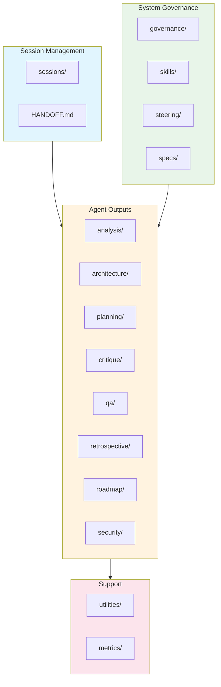
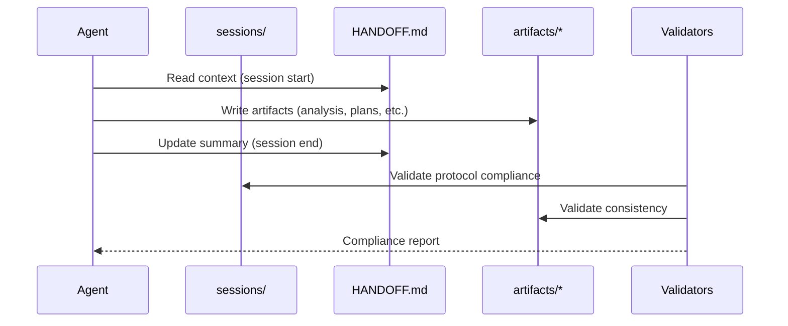
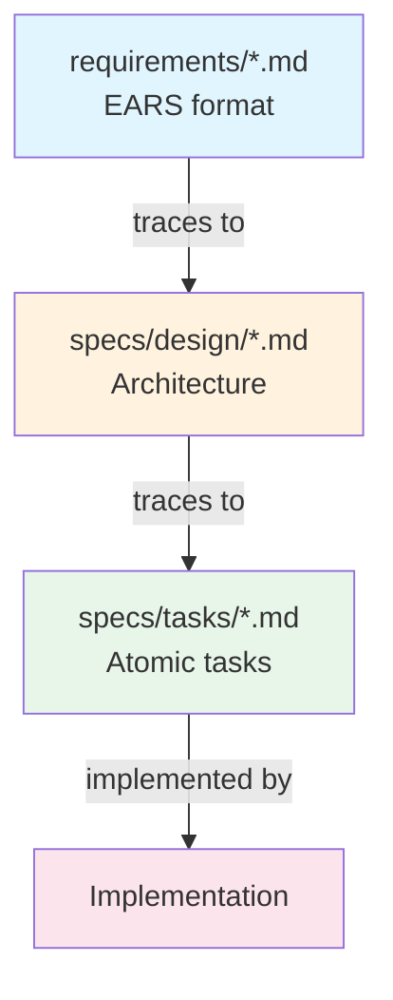

# Agent Artifacts System

This document describes the automated actors and artifact management system in the `.agents/` directory.

## Overview

The `.agents/` directory is the central repository for all agent-generated artifacts, session management, and governance documentation. It serves as the persistent knowledge base across agent sessions.

## Architecture

```mermaid
flowchart TD
    subgraph Sessions["Session Management"]
        SL[sessions/]
        HP[HANDOFF.md]
    end

    subgraph Artifacts["Agent Outputs"]
        AN[analysis/]
        AR[architecture/]
        PL[planning/]
        CR[critique/]
        QA[qa/]
        RT[retrospective/]
        RM[roadmap/]
        SC[security/]
    end

    subgraph Governance["System Governance"]
        GV[governance/]
        SK[skills/]
        ST[steering/]
        SS[specs/]
    end

    subgraph Utilities["Support"]
        UT[utilities/]
        MT[metrics/]
    end

    Sessions --> Artifacts
    Governance --> Artifacts
    Artifacts --> Utilities

    style Sessions fill:#e1f5fe
    style Artifacts fill:#fff3e0
    style Governance fill:#e8f5e9
    style Utilities fill:#fce4ec
```

## Directory Catalog

### Session Management

| Directory/File | Purpose | Automated Actor |
|----------------|---------|-----------------|
| `sessions/` | Historical JSON logs (creation discontinued) and per-issue handoffs | Per-issue handoffs: all agents |
| `HANDOFF.md` | Cross-session context bridge | All agents (on session end) |
| `AGENT-SYSTEM.md` | System documentation | Architect/Orchestrator |

### Agent Output Directories

| Directory | Primary Agent | Output Types |
|-----------|---------------|--------------|
| `analysis/` | analyst | Research findings, CVAs, impact assessments |
| `architecture/` | architect | ADRs only (no review documents) |
| `planning/` | milestone-planner | PRDs, milestones, task breakdowns |
| `critique/` | critic | Plan reviews, ADR reviews, approval/rejection |
| `qa/` | qa | Test strategies, test reports |
| `retrospective/` | retrospective | Session retrospectives, skill extractions |
| `roadmap/` | roadmap | Epics, prioritization, product roadmap |
| `security/` | security | Threat models, security reviews |

### Governance

| Directory | Purpose |
|-----------|---------|
| `governance/` | Naming conventions, consistency protocols |
| `specs/` | EARS requirements, design docs, task specs |
| `steering/` | Context-aware guidance files |
| `skills/` | Learned skills and strategies |

---

## Automated Actors

### Session Log Validator

**Role**: Validates a session log when one is staged; creation is discontinued
(`.claude/rules/session-logs.md` MUST 1)

| Attribute | Value |
|-----------|-------|
| **Script** | `scripts/validate_session_json.py`, wrapped by the `session-policy` pre-commit hook (`scripts/validation/git_hook_policy.py session`) |
| **Trigger** | `session-policy` pre-commit hook (validate-if-present), manual |
| **Input** | Staged session log, if any |
| **Output** | Compliance report |

**Validations** (run only when a session log is staged):

| Check | Behavior | Description |
|-------|----------|-------------|
| No log staged | Pass | Gate returns 0 (`check_sessions` passes with no session paths) |
| Schema valid | Blocks commit | A malformed staged log fails `session-policy` |
| `endingCommit` reachable | Warns | Unreachable recorded SHA warns; it does not block |

---

### Consistency Validator

**Role**: Cross-document consistency enforcement

| Attribute | Value |
|-----------|-------|
| **Script** | `scripts/Validate-Consistency.ps1` |
| **Trigger** | CI, manual |
| **Input** | `.agents/` artifacts |
| **Output** | Consistency report |

**Validations**:

- Naming convention compliance
- Cross-reference integrity
- Requirement coverage

---

### Planning Artifacts Validator

**Role**: Planning document consistency checker

| Attribute | Value |
|-----------|-------|
| **Script** | `build/scripts/Validate-PlanningArtifacts.ps1` |
| **Trigger** | CI on `.agents/planning/**` |
| **Input** | PRDs, task breakdowns |
| **Output** | Validation report |

**Checks**:

- Effort estimate divergence
- Orphan specialist conditions
- Missing task coverage

---

## Data Flow

```mermaid
sequenceDiagram
    participant Agent
    participant Session as sessions/
    participant Handoff as HANDOFF.md
    participant Output as artifacts/*
    participant Validation as Validators

    Agent->>Handoff: Read context (session start)
    Agent->>Output: Write artifacts (analysis, plans, etc.)
    Agent->>Handoff: Update summary (session end)

    Validation->>Session: Validate protocol compliance
    Validation->>Output: Validate consistency
    Validation-->>Agent: Compliance report
```

## Artifact Naming Conventions

Source: `governance/naming-conventions.md`

| Artifact Type | Pattern | Example |
|---------------|---------|---------|
| Session Log | `YYYY-MM-DD-session-NN-description.json` | `2025-12-18-session-24-docs.json` |
| ADR | `ADR-NNN-kebab-title.md` | `ADR-001-database-selection.md` |
| PRD | `PRD-feature-name.md` | `PRD-oauth-integration.md` |
| Plan | `NNN-feature-plan.md` | `001-authentication-plan.md` |
| Analysis | `NNN-topic-analysis.md` | `001-copilot-cli-analysis.md` |
| Critique | `NNN-feature-critique.md` | `001-auth-plan-critique.md` |
| Test Report | `NNN-feature-test-report.md` | `001-auth-test-report.md` |
| Retrospective | `YYYY-MM-DD-topic.md` | `2025-12-18-session-failures.md` |
| Threat Model | `TM-NNN-component.md` | `TM-001-auth-flow.md` |
| Requirement | `REQ-NNN-title.md` | `REQ-001-user-login.md` |
| Task | `TASK-EPIC-NNN-MM` | `TASK-001-03` |

## Traceability Chain

```mermaid
flowchart TD
    REQ[requirements/*.md<br>EARS format]
    DES[specs/design/*.md<br>Architecture]
    TSK[specs/tasks/*.md<br>Atomic tasks]
    IMP[Implementation]

    REQ -->|traces to| DES
    DES -->|traces to| TSK
    TSK -->|implemented by| IMP

    style REQ fill:#e1f5fe
    style DES fill:#fff3e0
    style TSK fill:#e8f5e9
    style IMP fill:#fce4ec
```

## Memory Integration

Source: `skill-usage-mandatory` memory

**Knowledge Sources**:

| Source | Location | Purpose |
|--------|----------|---------|
| Serena memories | `.serena/memories/` | Technical patterns, skills |
| HANDOFF.md | `.agents/HANDOFF.md` | Session context |
| Session logs (historical only) | `.agents/sessions/*.json` | Past decision history; creation discontinued |
| Per-issue handoffs | `.agents/sessions/handoffs/` | Active cross-session continuity |
| Skills | `.agents/skills/` | Learned strategies |

**Agent Memory Protocol**:

1. Session start: Read HANDOFF.md, query Serena memories
2. During work: Reference prior decisions
3. Session end: Update HANDOFF.md, store learnings

## Security Considerations

| Control | Description |
|---------|-------------|
| Path validation | Artifacts validated to stay within `.agents/` |
| No credentials | No secrets stored in artifacts |
| Review required | All artifact changes go through PR review |

## Error Handling

| Scenario | Behavior |
|----------|----------|
| Missing session log | No error; session log creation is discontinued |
| HANDOFF.md not updated | Validation warning |
| Naming convention violation | Consistency check fails |
| Orphan artifact | Logged for manual review |

## Monitoring

| Check | Workflow | Trigger |
|-------|----------|---------|
| Planning consistency | `validate-planning-artifacts.yml` | PR to `.agents/planning/**` |
| Spec validation | `ai-spec-validation.yml` | PR to `.agents/specs/**` |

## Related Documentation

- [AGENT-SYSTEM.md](AGENT-SYSTEM.md) - Full system documentation
- [governance/naming-conventions.md](governance/naming-conventions.md) - Naming rules
- [Root AGENTS.md](../AGENTS.md) - Agent usage instructions
