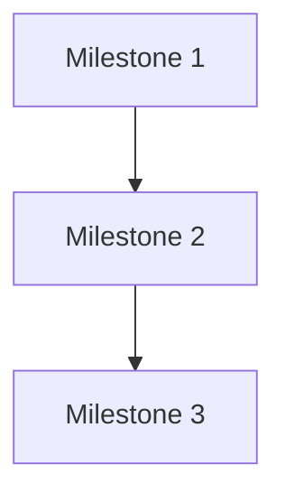

# Personality Profile Integration Analysis

## Objective

Analyze integration points between the user's personality profile, communication rules, and formatting constraints with the existing 18-agent system. Identify natural fits, conflicts, and specific recommendations for each agent.

## Scope

This analysis covers:

- Personality Profile (OODA loop, agency/legacy risk pattern)
- 9 Communication Rules
- Formatting Constraints
- Document Structure Requirements
- Technical Context (PowerShell, SOLID, KISS, etc.)
- Prioritization Frameworks (RICE, KANO, Eisenhower, Rumsfeld)

## Context

The existing agent system consists of 18 specialized agents, each with defined responsibilities, tools, and output formats. The personality profile represents the user's preferred interaction style and technical standards.

## Approach

1. Map each personality element to relevant agents
2. Identify natural alignment (already compatible)
3. Identify conflicts requiring resolution
4. Provide specific integration recommendations per agent

---

## Section 1: Personality Profile Integration

### 1.1 OODA Loop (Observe, Orient, Decide, Act)

The OODA loop decision model maps naturally to the agent workflow pattern.

| OODA Phase | Agent Alignment | Current Support | Integration Gap |
|------------|-----------------|-----------------|-----------------|
| **Observe** | analyst, memory | Strong | None |
| **Orient** | architect, roadmap, independent-thinker | Strong | None |
| **Decide** | high-level-advisor, critic, planner | Strong | None |
| **Act** | implementer, devops, qa | Strong | None |

**Analysis**: The existing agent system already implements OODA implicitly through its workflow patterns. The standard sequence (analyst -> architect -> planner -> critic -> implementer -> qa) mirrors OODA exactly.

**Recommendation**: No structural changes needed. Add explicit OODA terminology to the orchestrator prompt to reinforce this pattern. Specifically, add a "Current OODA Phase" indicator in task classification outputs.

### 1.2 Agency/Legacy Risk Pattern

This risk pattern focuses on maintaining control and avoiding technical debt accumulation.

| Risk Concern | Agent Responsibility | Current Handling |
|--------------|---------------------|------------------|
| Losing control of decisions | critic, independent-thinker | Partially addressed |
| Accumulating tech debt | architect, qa | Addressed in ADRs |
| Vendor lock-in | architect, security | Not explicit |
| Irreversible changes | critic, planner | Implicit |

**Agents Requiring Updates**:

1. **architect**: Add explicit vendor lock-in assessment to ADR template
2. **critic**: Add "Reversibility Assessment" section to review checklist
3. **planner**: Add "Exit Strategy" field to milestone definitions
4. **security**: Add dependency risk scoring for vendor dependencies

**Recommendation**: Create a new review checklist item in critic.md:

```markdown
### Reversibility Assessment
- [ ] Changes can be rolled back without data loss
- [ ] No new vendor lock-in introduced
- [ ] Exit strategy documented if adding external dependency
- [ ] Legacy system impact assessed
```

---

## Section 2: Communication Rules Mapping

### Rule 1: "Treat me as an expert"

| Agent | Current Audience Level | Recommended Change |
|-------|----------------------|-------------------|
| explainer | Junior developers | **Conflict** - needs dual-mode |
| analyst | Expert-level | Aligned |
| architect | Expert-level | Aligned |
| implementer | Expert-level | Aligned |
| high-level-advisor | Expert-level | Aligned |
| independent-thinker | Expert-level | Aligned |
| all others | Variable | Add explicit expert-mode flag |

**Conflict Analysis**: The explainer agent is explicitly designed for "junior developers" and "Grade 9 reading level." This directly conflicts with "treat me as an expert."

**Resolution Options**:

1. **Option A (Recommended)**: Add audience selector parameter to explainer
   - `--audience expert`: Omit basic explanations, use technical terminology
   - `--audience junior` (default): Current behavior for PRDs shared with junior devs

2. **Option B**: Create separate "technical-explainer" agent for expert-level docs

3. **Option C**: Remove junior-developer targeting from explainer entirely

**Recommendation**: Implement Option A. Add to explainer.md:

```markdown
## Audience Mode

**Default**: Junior developer (Grade 9 reading level)

**Expert Mode**: When user is the audience (not downstream developers):
- Use technical terminology without explanation
- Skip foundational concepts
- Focus on nuances and edge cases
- Reference industry standards by name
```

### Rule 2: "Grade 9 reading level"

**Note**: This rule appears to conflict with Rule 1. Clarification needed: Does Grade 9 reading level apply to:

- (A) Documentation produced for others (PRDs, explainers) - Consistent with Rule 1
- (B) All agent communication - Conflicts with Rule 1

**Assumption**: Grade 9 applies to artifacts, not conversation. Experts can read simple writing.

| Agent | Document Output | Recommendation |
|-------|----------------|----------------|
| explainer | PRDs, user docs | Apply Grade 9 |
| planner | Plans, milestones | Apply Grade 9 |
| roadmap | Epics, vision | Apply Grade 9 |
| architect | ADRs | Mixed - technical terms OK, structure simple |
| qa | Test strategies | Apply Grade 9 |
| retrospective | Learning extractions | Apply Grade 9 |

**Recommendation**: Add global formatting directive to all document-producing agents:

```markdown
## Writing Standards

- Sentence length: Max 20 words average
- Paragraph length: Max 4 sentences
- Jargon: Define on first use or link to glossary
- Structure: Headers every 3-5 paragraphs
```

### Rule 3: "Ask clarifying questions"

| Agent | Current Question Behavior | Gap |
|-------|--------------------------|-----|
| explainer | Explicitly asks questions first | Aligned |
| analyst | Proactive research, questions implicit | Add explicit question phase |
| planner | Assumes scope from epic | Add clarification gate |
| orchestrator | Routes immediately | Add triage question option |

**Recommendation**: Add to orchestrator.md under Phase 0 (Triage):

```markdown
### Clarification Gate

Before routing, assess if clarification is needed:

- [ ] Is the scope unambiguous?
- [ ] Are success criteria defined?
- [ ] Are constraints clear?

If ANY are unclear and cannot be inferred from context, ASK before routing.
```

### Rule 4: "No sycophancy"

| Agent | Current Behavior | Alignment |
|-------|-----------------|-----------|
| high-level-advisor | Explicitly anti-sycophantic | **Fully Aligned** |
| independent-thinker | Explicitly skeptical | **Fully Aligned** |
| critic | Constructive but direct | Aligned |
| all others | Not specified | Add directive |

**Analysis**: Two agents (high-level-advisor, independent-thinker) already embody this principle as core identity. The system design naturally reduces sycophancy through role separation.

**Recommendation**: Add global directive to all agent prompts:

```markdown
## Anti-Sycophancy Directive

- Never validate without evidence
- State disagreements directly
- Avoid phrases: "Great question", "Good idea", "Interesting point"
- Replace validation with action: "Yes" -> "Proceeding with X"
```

### Rule 5: "Direct feedback"

| Agent | Current Directness | Change Needed |
|-------|-------------------|---------------|
| critic | Direct (verdict: APPROVED/NEEDS REVISION) | Aligned |
| high-level-advisor | Brutally direct | Aligned |
| qa | Direct (PASS/FAIL) | Aligned |
| analyst | Neutral researcher tone | Add conclusion statements |
| architect | Technical but hedged | Add clearer verdicts |

**Recommendation**: Add to analyst.md:

```markdown
## Conclusion Format

Every analysis must end with:
- **Verdict**: [Proceed / Defer / Investigate further]
- **Confidence**: [High / Medium / Low]
- **Rationale**: [One sentence]
```

### Rule 6: "First principles thinking"

The provided framework:

1. Question (What problem are we solving?)
2. Delete (Remove unnecessary steps)
3. Simplify/Optimize (Make remaining steps efficient)
4. Speed up (Accelerate critical path)
5. Automate (Remove human intervention)

| Agent | First Principles Application | Current Support |
|-------|------------------------------|-----------------|
| independent-thinker | Questions assumptions | Strong |
| architect | Simplifies design | Implicit |
| implementer | SOLID, DRY, YAGNI | Strong alignment |
| devops | Automates workflows | Strong |
| planner | Sequences work | Add optimization focus |

**Recommendation**: Add to planner.md under Planning Principles:

```markdown
### First Principles Checklist

Before finalizing plan:
- [ ] **Question**: Is each milestone solving the actual problem?
- [ ] **Delete**: Remove any milestone that doesn't directly contribute
- [ ] **Simplify**: Can any milestone be merged or reduced?
- [ ] **Speed up**: Is critical path optimized?
- [ ] **Automate**: Are manual steps flagged for future automation?
```

### Rule 7: "Active voice"

This is a formatting rule applicable to all agents.

| Agent Type | Current Voice | Change Scope |
|------------|---------------|--------------|
| All agents | Mixed | Add style directive |

**Recommendation**: Add to global agent template:

```markdown
## Writing Style

Use active voice:
- Good: "The implementer writes tests"
- Bad: "Tests are written by the implementer"

Use imperative for instructions:
- Good: "Validate the input"
- Bad: "The input should be validated"
```

### Rule 8: "Use diagrams (mermaid)"

| Agent | Current Diagram Support | Gap |
|-------|------------------------|-----|
| roadmap | Mermaid dependency graphs | Aligned |
| planner | None explicit | Add sequence diagrams |
| architect | Referenced but not mandated | Make mandatory for ADRs |
| analyst | None | Add for complex findings |
| devops | None | Add pipeline flow diagrams |

**Recommendation**: Add diagram requirements to specific agents:

**architect.md**:
```markdown
### ADR Diagram Requirements

Every ADR MUST include at least one:
- Component diagram (system context)
- Sequence diagram (interaction flow)
- Or data flow diagram (if data-focused)

Use mermaid syntax. Keep diagrams under 15 nodes.
```

**planner.md**:
```markdown
### Plan Visualization

Complex plans (3+ milestones) MUST include:


```

### Rule 9: "Understand how the answer affects me"

This relates to impact assessment and personalization.

| Agent | Impact Awareness | Current Support |
|-------|-----------------|-----------------|
| planner | Risk assessment | Partial |
| architect | Consequence analysis | In ADRs |
| high-level-advisor | Direct impact statements | Strong |
| security | Blast radius analysis | Strong |

**Recommendation**: Add "User Impact Statement" requirement to key outputs:

```markdown
## User Impact Statement

Every significant recommendation must include:
- **What changes for you**: [Direct impact]
- **Effort required**: [Your time commitment]
- **Risk if ignored**: [Consequence]
```

---

## Section 3: Formatting Constraints

### 3.1 Prohibited Elements

| Constraint | Agents Affected | Current Status | Action Required |
|------------|-----------------|----------------|-----------------|
| No em dashes | All | Not enforced | Add to style guide |
| No emojis | orchestrator, qa | Uses emojis (check marks, X) | Replace with text |
| No asterisks for emphasis | All | Uses `**bold**` | Keep for markdown structure |
| No hashtags | N/A (not social media) | Not applicable | None |
| No marketing language | explainer, roadmap | Potential issue | Add anti-marketing directive |
| No AI filler phrases | All | Not specified | Add prohibited phrase list |

**Note on Asterisks**: Markdown requires asterisks for formatting. Interpret this constraint as "no asterisks in plain text for emphasis" rather than eliminating markdown formatting.

**Recommendation**: Create global formatting guide:

```markdown
## Prohibited Patterns

### Phrases to Avoid
- "I'd be happy to..."
- "Great question!"
- "Let me help you with..."
- "I understand that..."
- "Of course!"
- "Certainly!"
- "Absolutely!"

### Formatting
- No em dashes (use commas or parentheses instead)
- No emojis in formal outputs
- Replace "X" and check marks with [PASS]/[FAIL] text
```

### 3.2 Required Elements

| Requirement | Implementation |
|-------------|---------------|
| Short sentences | Max 20 words guideline |
| Replace adjectives with data | Add to QA, analyst output formats |

**Recommendation**: Add to analyst.md and qa.md:

```markdown
## Evidence-Based Language

Replace adjective phrases with data:
- Bad: "significantly improved performance"
- Good: "reduced latency by 340ms (45% improvement)"

- Bad: "the code is complex"
- Good: "cyclomatic complexity of 23 (threshold: 10)"
```

---

## Section 4: Document Structure Requirements

The requested structure:

1. Objective/scope
2. Context
3. Approach
4. Data/analysis
5. Results
6. Discussion
7. Recommendations
8. Conclusion
9. Appendices/citations

### Alignment Analysis

| Document Type | Current Structure | Gap |
|---------------|-------------------|-----|
| Analyst reports | Partial match | Add explicit sections |
| ADRs (architect) | Different (MADR format) | Keep MADR, it's industry standard |
| Plans (planner) | Different structure | Adapt to planning needs |
| PRDs (explainer) | Product-focused | Keep current, fits purpose |
| Test reports (qa) | Execution-focused | Keep current |
| Retrospectives | Phased structure | Keep current, fits purpose |

**Analysis**: The requested structure is appropriate for analysis/research documents but not universally applicable. ADRs follow MADR 4.0 (industry standard). PRDs follow product management conventions.

**Recommendation**: Apply structure to analyst outputs only:

```markdown
## Analysis Document Structure

All analysis documents MUST follow this structure:

1. **Objective & Scope**: What question are we answering?
2. **Context**: Background and current state
3. **Approach**: Methodology used
4. **Data/Analysis**: Evidence gathered
5. **Results**: Findings (facts only)
6. **Discussion**: Interpretation of results
7. **Recommendations**: Specific actions
8. **Conclusion**: Summary statement
9. **Appendices**: Supporting data, citations
```

---

## Section 5: Technical Context Integration

### 5.1 PowerShell Primary Stack

| Agent | Current Shell Support | Gap |
|-------|----------------------|-----|
| devops | Generic bash examples | Add PowerShell equivalents |
| implementer | dotnet CLI focus | Aligned (PowerShell compatible) |
| pr-comment-responder | Uses pwsh scripts | **Fully Aligned** |
| analyst | Bash examples | Add PowerShell preference |

**Recommendation**: Add to devops.md:

```markdown
## Shell Preference

**Primary**: PowerShell Core (pwsh) for cross-platform compatibility
**Secondary**: Bash for CI environments that require it

When providing examples, show PowerShell first:

```powershell
# PowerShell (preferred)
Get-ChildItem -Recurse -Filter "*.cs" | ForEach-Object { ... }
```

```bash
# Bash (alternative)
find . -name "*.cs" -exec ...
```
```

### 5.2 SOLID, KISS, DRY, YAGNI, 12-Factor

| Principle | Current Agent Support | Coverage |
|-----------|----------------------|----------|
| SOLID | implementer (strong) | Complete |
| KISS | Implicit in architect | Add explicit |
| DRY | implementer (non-redundancy) | Complete |
| YAGNI | implementer | Complete |
| 12-Factor | Not mentioned | Add to devops |

**Recommendation**: Add to devops.md:

```markdown
## 12-Factor App Principles

When designing infrastructure:
- Config in environment variables (Factor III)
- Backing services as attached resources (Factor IV)
- Build, release, run stages separated (Factor V)
- Stateless processes (Factor VI)
- Dev/prod parity (Factor X)
```

### 5.3 Code Quality Standards

| Standard | Current Enforcement | Agent |
|----------|---------------------|-------|
| Methods under 60 lines | implementer | Mentioned |
| Cyclomatic complexity <= 10 | implementer | Mentioned |
| Low nesting | Not explicit | Add to implementer |
| Testable code | qa, implementer | Strong |

**Recommendation**: Already well-covered in implementer.md. Add to qa.md for verification:

```markdown
## Code Quality Gates

During test strategy review, verify:
- [ ] No methods exceed 60 lines
- [ ] Cyclomatic complexity <= 10
- [ ] Nesting depth <= 3 levels
- [ ] All public methods have corresponding tests
```

---

## Section 6: Prioritization Framework Integration

### Current Framework Support

| Framework | Agent | Current Status |
|-----------|-------|----------------|
| RICE | roadmap | **Fully Implemented** |
| KANO | roadmap | **Fully Implemented** |
| Weighted scoring | roadmap | Implicit in RICE |
| Eisenhower | roadmap | **Fully Implemented** |
| Rumsfeld | roadmap | **Fully Implemented** |

**Analysis**: The roadmap agent already implements all requested prioritization frameworks. This is a strong alignment point.

**Recommendation**: No changes needed. The roadmap.md already contains detailed framework usage with assumptions documented.

---

## Section 7: Conflicts and Resolutions

### Conflict 1: Expert vs Junior Audience (High Priority)

**Conflict**: Communication Rule 1 ("Treat me as expert") vs explainer design ("junior developers")

**Resolution**: Add audience mode parameter to explainer. Default remains junior for downstream artifacts, but user-facing communication uses expert mode.

### Conflict 2: Grade 9 Reading vs Technical Precision (Medium Priority)

**Conflict**: Simple writing requirement vs need for technical accuracy in architect/security outputs

**Resolution**: Apply Grade 9 to structure (short sentences, clear headers) but allow technical terminology. Define terms on first use.

### Conflict 3: No Emojis vs Status Indicators (Low Priority)

**Conflict**: No emoji rule vs current use of check marks and X for pass/fail in qa.md and orchestrator.md

**Resolution**: Replace emoji indicators with text:
- Replace check marks with [PASS] or [DONE]
- Replace X with [FAIL] or [BLOCKED]
- Replace eyes emoji with [ACKNOWLEDGED]

### Conflict 4: Diagram Mandate vs Agent Simplicity (Low Priority)

**Conflict**: Mandatory mermaid diagrams could over-complicate simple outputs

**Resolution**: Make diagrams conditional:
- Required for: ADRs, complex plans (3+ milestones), system-level analysis
- Optional for: Simple bug fixes, single-file changes, quick fixes

---

## Section 8: Agent-Specific Recommendations

### orchestrator.md

| Change | Priority | Effort |
|--------|----------|--------|
| Add OODA phase indicator to task classification | Medium | Low |
| Add clarification gate before routing | High | Medium |
| Replace emoji status indicators with text | Low | Low |
| Add anti-sycophancy directive | Medium | Low |

### implementer.md

| Change | Priority | Effort |
|--------|----------|--------|
| Add nesting depth limit (<=3) | Medium | Low |
| Already aligned with SOLID/DRY/YAGNI | N/A | None |

### analyst.md

| Change | Priority | Effort |
|--------|----------|--------|
| Apply full document structure (Section 4) | High | Medium |
| Add explicit verdict/conclusion requirement | High | Low |
| Add PowerShell preference for examples | Low | Low |
| Add evidence-based language requirement | Medium | Low |

### architect.md

| Change | Priority | Effort |
|--------|----------|--------|
| Add reversibility assessment to review | High | Low |
| Add vendor lock-in section to ADR template | High | Medium |
| Mandate mermaid diagrams in ADRs | Medium | Low |

### planner.md

| Change | Priority | Effort |
|--------|----------|--------|
| Add first principles checklist | Medium | Low |
| Add exit strategy field to milestones | Medium | Low |
| Add mermaid dependency diagrams for complex plans | Low | Low |

### critic.md

| Change | Priority | Effort |
|--------|----------|--------|
| Add reversibility assessment checklist | High | Low |
| Add anti-sycophancy directive | Medium | Low |

### qa.md

| Change | Priority | Effort |
|--------|----------|--------|
| Replace emoji indicators with text | Low | Low |
| Add code quality gates verification | Medium | Low |
| Add evidence-based language requirement | Low | Low |

### security.md

| Change | Priority | Effort |
|--------|----------|--------|
| Add dependency risk scoring | Medium | Medium |
| Already has blast radius analysis | N/A | None |

### devops.md

| Change | Priority | Effort |
|--------|----------|--------|
| Add PowerShell-first examples | Medium | Medium |
| Add 12-factor principles reference | Medium | Low |
| Add pipeline flow diagrams requirement | Low | Low |

### explainer.md

| Change | Priority | Effort |
|--------|----------|--------|
| Add audience mode parameter (expert/junior) | High | Medium |
| Add anti-marketing language directive | Medium | Low |

### high-level-advisor.md

| Change | Priority | Effort |
|--------|----------|--------|
| Already fully aligned with communication rules | N/A | None |

### independent-thinker.md

| Change | Priority | Effort |
|--------|----------|--------|
| Already fully aligned with communication rules | N/A | None |
| Already rejects AI tropes explicitly | N/A | None |

### memory.md

| Change | Priority | Effort |
|--------|----------|--------|
| No significant changes needed | N/A | None |

### roadmap.md

| Change | Priority | Effort |
|--------|----------|--------|
| Already implements all prioritization frameworks | N/A | None |
| Add anti-marketing language for epic descriptions | Low | Low |

### skillbook.md

| Change | Priority | Effort |
|--------|----------|--------|
| No significant changes needed | N/A | None |

### task-generator.md

| Change | Priority | Effort |
|--------|----------|--------|
| No significant changes needed | N/A | None |

### retrospective.md

| Change | Priority | Effort |
|--------|----------|--------|
| No significant changes needed | N/A | None |

### pr-comment-responder.md

| Change | Priority | Effort |
|--------|----------|--------|
| Already uses PowerShell scripts | N/A | None |
| Replace emoji acknowledgments with text | Low | Low |

---

## Section 9: Implementation Approach

### Phase 1: Global Directives (Week 1)

Create a shared style guide that all agents reference:

1. Anti-sycophancy directive
2. Active voice requirement
3. Prohibited phrases list
4. Evidence-based language requirement
5. Emoji replacement guide

### Phase 2: High-Priority Agent Updates (Week 2)

1. explainer.md: Add audience mode
2. analyst.md: Apply document structure
3. architect.md: Add reversibility and vendor lock-in
4. critic.md: Add reversibility checklist
5. orchestrator.md: Add clarification gate

### Phase 3: Medium-Priority Updates (Week 3)

1. planner.md: Add first principles checklist
2. devops.md: Add PowerShell preference and 12-factor
3. qa.md: Add code quality gates

### Phase 4: Low-Priority Polish (Week 4)

1. Mermaid diagram requirements
2. Emoji replacements across all agents
3. Anti-marketing language in roadmap/explainer

---

## Section 10: Conclusion

The existing agent system shows strong alignment with the requested personality profile:

**Fully Aligned (No Changes)**:
- OODA loop workflow pattern
- RICE/KANO/Eisenhower/Rumsfeld frameworks (roadmap)
- Anti-sycophancy stance (high-level-advisor, independent-thinker)
- SOLID/DRY/YAGNI principles (implementer)
- First principles questioning (independent-thinker)

**Requires Adaptation**:
- Expert audience mode for explainer
- Document structure for analyst
- Reversibility assessments for architect/critic
- PowerShell preference for devops
- Global formatting directives

**Minor Adjustments**:
- Emoji-to-text replacements
- Diagram requirements
- Anti-marketing language

The personality profile integrates well with the system design. Most changes are additive rather than disruptive.

---

## Appendix A: Prohibited Phrases Reference

```text
"I'd be happy to..."
"Great question!"
"Excellent point!"
"Let me help you with..."
"I understand that..."
"Of course!"
"Certainly!"
"Absolutely!"
"I appreciate..."
"That's interesting..."
"I think..."
"In my opinion..."
"I believe..."
"It seems like..."
"kind of"
"sort of"
"basically"
```

## Appendix B: Emoji Replacement Map

| Current | Replacement |
|---------|-------------|
| check marks | [PASS], [DONE], [COMPLETE] |
| X | [FAIL], [BLOCKED], [INCOMPLETE] |
| eyes | [ACKNOWLEDGED], [REVIEWING] |
| warning | [WARNING], [CAUTION] |
| fire | [CRITICAL], [URGENT] |

## Appendix C: Agent Alignment Summary

| Agent | Alignment Score | Changes Required |
|-------|-----------------|------------------|
| orchestrator | 75% | Clarification gate, emoji removal |
| implementer | 95% | Nesting depth limit only |
| analyst | 60% | Document structure, verdicts |
| architect | 70% | Reversibility, vendor lock-in |
| planner | 75% | First principles checklist |
| critic | 80% | Reversibility assessment |
| qa | 85% | Emoji removal, quality gates |
| security | 90% | Dependency risk scoring |
| devops | 65% | PowerShell, 12-factor |
| explainer | 50% | Audience mode critical |
| high-level-advisor | 100% | None |
| independent-thinker | 100% | None |
| memory | 90% | None significant |
| roadmap | 95% | Anti-marketing only |
| skillbook | 90% | None significant |
| task-generator | 85% | None significant |
| retrospective | 90% | None significant |
| pr-comment-responder | 85% | Emoji removal |

---

*Analysis completed: 2025-12-18*
*Author: Orchestrator (analyst delegation)*
