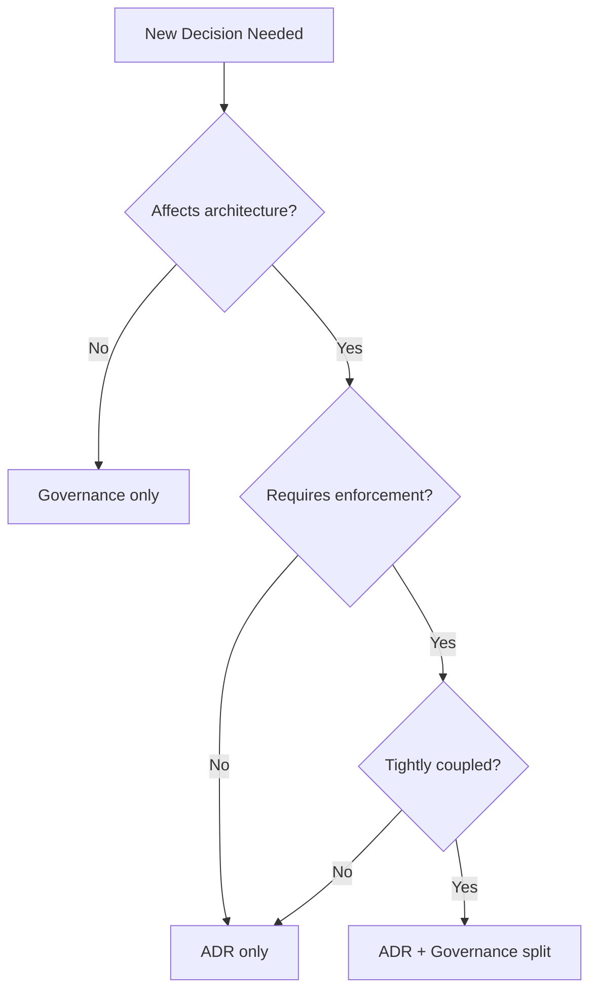

# ADR-022: Architecture vs Governance Decision Split Criteria

## Status

Proposed

## Date

2025-12-23

## Context

The "Any Decision Record" movement has expanded ADR usage from strictly architectural decisions to include design, process, tool selection, and governance decisions. This creates ambiguity about what belongs in `.agents/architecture/` vs `.agents/governance/`.

### The "Any Decision Record" Debate

**Broadening advocates** (MADR):
- MADR now stands for "Markdown **Any** Decision Records" (not "Architectural")
- Many significant decisions (design, process, tooling) benefit from ADR format
- Teams make managerial/organizational decisions requiring justification and trade-off analysis

**Focus advocates**:
- Mixing architectural and non-architectural decisions dilutes architectural clarity
- Better to create **separate records** for architectural vs operational decisions
- ADRs should focus on system structure, quality attributes, dependencies, interfaces

**Sources**:
- [ADR = Any Decision Record? Architecture, Design and Beyond](https://ozimmer.ch/practices/2021/04/23/AnyDecisionRecords.html)
- [MADR: Markdown Any Decision Records](https://adr.github.io/madr/)
- [Has Your Architectural Decision Record Lost Its Purpose? - InfoQ](https://www.infoq.com/articles/architectural-decision-record-purpose/)

### Current Codebase Pattern

Our codebase has **two** locations for decision documentation:

1. **`.agents/architecture/`** - ADRs with architectural significance
2. **`.agents/governance/`** - Operational policies, compliance requirements, standards

**Existing successful split**: ADR-024 + COST-GOVERNANCE.md
- **ADR-024**: Architectural decision (use ARM runners for 37.5% cost savings)
- **COST-GOVERNANCE.md**: Operational policy (compliance comments, exception process, monitoring)

**Emerging ambiguity**: ADR-021 bundles architectural decision + governance policy
- Model routing strategy (architectural)
- Evidence sufficiency rules (quality gates)
- Governance guardrails (MUST use explicit copilot-model)
- Security hardening (prompt injection, validation)
- Escalation criteria (operational triggers)
- Aggregator enforcement (branch protection rules)

This creates questions:
1. When should a decision be **ADR-only**?
2. When should it be **governance-only**?
3. When should it be **split** (ADR + governance)?

## Decision

Adopt a **hybrid approach** with explicit split criteria:

### 1. Decision Classification Matrix

Use this matrix to determine placement:

| Criteria | ADR (architecture/) | Governance (governance/) | Split (both) |
|----------|---------------------|--------------------------|--------------|
| **Primary concern** | System structure, quality attributes | Operational compliance, standards | Both |
| **Affects architecture** | Yes | No | Yes |
| **Requires enforcement** | Optional | Yes (MUST/SHALL) | Yes |
| **Change frequency** | Low (design-time) | Medium (policy updates) | Low (ADR), Medium (policy) |
| **Audience** | Architects, developers | All contributors, reviewers | Both |
| **Reversibility** | Design alternatives | Policy exceptions | Both |

### 2. Placement Rules

#### Use **ADR-only** when:

- Decision affects system structure, dependencies, interfaces, or quality attributes
- Decision is primarily **technical** (not operational)
- No ongoing compliance enforcement required
- Changes infrequently (locked at design time)

**Examples**:
- Database selection (architecture affects system structure)
- API design patterns (technical design choice)
- Security architecture (system design)

**Template**:
```markdown
# ADR-NNN: [Decision Title]

## Context
[Problem being addressed, architectural significance]

## Decision
[What was decided]

## Rationale
[Why this decision was made]

## Alternatives Considered
[Other options and why they were rejected]

## Consequences
Positive: [Benefits]
Negative: [Costs, risks, limitations]
```

---

#### Use **Governance-only** when:

- Decision is operational policy, standard, or process
- Does NOT affect system architecture or structure
- Requires ongoing compliance enforcement
- Changes frequently (policy updates)

**Examples**:
- Code review standards
- Naming conventions
- Test location standards
- Commit message format

**Template**:
```markdown
# [Policy Name]

## Overview
[What this policy governs]

## Policy
[MUST/SHALL/SHOULD statements]

## Compliance Requirements
[How to adhere to policy]

## Exception Process
[How to request deviations]

## Monitoring
[How compliance is verified]
```

---

#### Use **Split (ADR + Governance)** when:

- Decision has BOTH architectural significance AND operational enforcement requirements
- Decision affects system structure BUT requires ongoing compliance
- Policy derives from architectural decision but evolves independently

**Examples**:
- ADR-024 (runner selection) + COST-GOVERNANCE.md
- ADR-021 (model routing strategy) + AI-REVIEW-MODEL-POLICY.md (recommended split)

**Pattern**:

**ADR** (architecture/):
```markdown
# ADR-NNN: [Architectural Decision]

## Context
[Architectural problem]

## Decision
[Technical decision made]

## Rationale
[Why architecturally sound]

## Alternatives
[Technical alternatives considered]

## Consequences
[Architectural implications]

## See Also
- [Policy Name in governance/] - Operational enforcement
```

**Governance** (governance/):
```markdown
# [Policy Name]

## Overview
Based on [ADR-NNN](../architecture/ADR-NNN-title.md)

## Policy
[Compliance rules derived from ADR]

## Compliance Requirements
[How to implement ADR decision]

## Exception Process
[How to deviate from ADR]

## Monitoring
[How to verify adherence]
```

---

### 3. Decision Workflow



**Step-by-step**:

1. **Does it affect system structure, quality attributes, or architecture?**
   - **No** → Governance-only (e.g., naming-conventions.md)
   - **Yes** → Continue to step 2

2. **Does it require operational enforcement (MUST/SHALL compliance)?**
   - **No** → ADR-only (e.g., ADR-013: Agent Orchestration MCP)
   - **Yes** → Continue to step 3

3. **Are architectural decision and enforcement policy tightly coupled?**
   - **Yes** → Split (ADR + Governance) (e.g., ADR-024 + COST-GOVERNANCE)
   - **No** → ADR-only with operational notes

### 4. When to Split Existing ADRs

Trigger a split when:

1. **Enforcement burden increases**: ADR requires new compliance checks or monitoring
2. **Policy evolves independently**: Operational requirements change without re-debating architecture
3. **Exception process needed**: Teams need to request deviations from architectural decision
4. **Monitoring/auditing required**: Policy needs metrics, baselines, or review cadence

**Do NOT split retroactively** unless:
- Enforcement is blocking development
- Policy changes are frequent and creating ADR churn
- Compliance confusion exists

## Rationale

### Why Hybrid Approach?

1. **Preserves architectural focus**: ADRs remain focused on system structure and design
2. **Enables policy evolution**: Governance docs can be updated without re-opening architectural debate
3. **Improves discoverability**: Architects read architecture/, operators read governance/
4. **Reduces coupling**: Policy enforcement can change without invalidating architectural decision

### Why Not "Any Decision Record" Everywhere?

**Risk**: Dilutes architectural clarity
- Mixing process decisions with architectural decisions obscures system evolution
- ADR catalog becomes catch-all for "any significant decision"
- Harder to understand architectural trajectory

**Alternative**: Separate governance/ directory maintains ADR focus while capturing other important decisions

### Why Not Separate Everything?

**Risk**: Creates artificial separation for tightly coupled decisions
- ADR-014 (runner selection) and COST-GOVERNANCE are inseparable
- Splitting too aggressively creates navigation overhead
- Some decisions genuinely need both architectural rationale and operational enforcement

**Balance**: Use split pattern when both aspects exist

## Alternatives Considered

### Alternative 1: "Any Decision Record" Everywhere

**Approach**: Adopt MADR paradigm, put all significant decisions in architecture/ as ADRs

**Pros**:
- Single location for all important decisions
- Consistent format across decision types
- MADR community precedent

**Cons**:
- Architectural decisions lost in noise
- Policy updates require re-opening ADRs
- Violates "single decision" ADR criterion

**Why not chosen**: Dilutes architectural focus, creates governance churn

---

### Alternative 2: Strict ADR + Separate Policy Directory

**Approach**: Never mix. ADRs are strictly architectural. All policies in governance/.

**Pros**:
- Clear separation of concerns
- ADRs remain focused
- Policies evolve independently

**Cons**:
- Loses architectural context for policy
- Creates orphaned governance docs without rationale
- Harder to understand "why" behind policy

**Why not chosen**: Some decisions genuinely need both aspects documented together

---

### Alternative 3: Policy References in ADRs (No Governance Directory)

**Approach**: Include policy sections in ADRs, no separate governance directory

**Pros**:
- Single source of truth
- No navigation overhead
- Policy and rationale co-located

**Cons**:
- ADRs become living documents (violates immutability)
- Policy updates trigger ADR revisions
- Compliance enforcement mixed with architectural decision

**Why not chosen**: ADRs should be immutable; policies evolve

---

### Alternative 4: Tags/Metadata Instead of Directory Split

**Approach**: Single directory, use frontmatter tags (type: architecture, type: governance)

**Pros**:
- Flexible categorization
- Can tag decisions with multiple types
- Easier to reorganize

**Cons**:
- Requires tooling to filter by tag
- Less discoverable (can't just browse directory)
- Tag discipline required

**Why not chosen**: Directory structure is simpler and more discoverable

## Consequences

### Positive

1. **Architectural clarity**: ADRs remain focused on system design
2. **Policy agility**: Governance docs can evolve without architectural debate
3. **Clear ownership**: Architects own architecture/, all contributors own governance/
4. **Reduced churn**: Policy updates don't trigger ADR revisions
5. **Discoverability**: Two directories with clear purposes

### Negative

1. **Navigation overhead**: Must look in two places for related decisions
2. **Duplication risk**: Context may be repeated in ADR and governance doc
3. **Learning curve**: Contributors must understand when to use which directory
4. **Split judgment calls**: Some decisions are ambiguous (requires judgment)

### Neutral

1. **More files**: Split pattern creates 2 files instead of 1 (acceptable for clarity)
2. **Cross-references required**: ADR and governance doc must link to each other

## Implementation Guidance

### For New Decisions

1. **Use decision workflow** (Section 3) to classify
2. **Default to ADR-only** if enforcement is optional
3. **Use split pattern** if operational enforcement is REQUIRED
4. **Document cross-references** when splitting

### For Existing Decisions

1. **ADR-021**: Recommended to split (model routing strategy + AI-REVIEW-MODEL-POLICY.md)
2. **Other ADRs**: Leave as-is unless enforcement burden triggers split
3. **Governance docs**: Leave as-is (already correct placement)

### Template Locations

- **ADR template**: `.agents/architecture/ADR-TEMPLATE.md` (create)
- **Governance template**: `.agents/governance/POLICY-TEMPLATE.md` (create)

### Enforcement

- **Pre-commit hook**: Validate ADR numbering, check for split cross-references
- **Review checklist**: "Is this ADR-only or does it need governance split?"
- **Quarterly audit**: Review for ADRs that should be split

## Success Metrics

| Metric | Target | Measurement |
|--------|--------|-------------|
| Architectural ADR clarity | 100% architectural | % of ADRs affecting system structure |
| Governance policy completeness | 100% enforcement-focused | % of governance docs with compliance requirements |
| Cross-reference accuracy | 100% bidirectional | % of split decisions with mutual links |
| Decision placement disputes | <5% | % of PRs with classification debates |

## Related Decisions

- ADR-024: GitHub Actions Runner Selection (architecture) + COST-GOVERNANCE.md (governance) - Exemplar split pattern
- ADR-021: Model Routing Policy (currently bundled, candidate for split)
- Session 90: Multi-agent debate on ADR-021 exposed need for split criteria

## References

- [ADR = Any Decision Record? Architecture, Design and Beyond](https://ozimmer.ch/practices/2021/04/23/AnyDecisionRecords.html)
- [MADR: Markdown Any Decision Records](https://adr.github.io/madr/)
- [Has Your Architectural Decision Record Lost Its Purpose? - InfoQ](https://www.infoq.com/articles/architectural-decision-record-purpose/)
- Wikipedia: [Architectural Decision](https://en.wikipedia.org/wiki/Architectural_decision)
- Wikipedia: [Architecturally Significant Requirements](https://en.wikipedia.org/wiki/Architecturally_significant_requirements)
- Codebase: `.agents/architecture/` (ADR catalog)
- Codebase: `.agents/governance/` (governance policies)

---

## Appendix A: Real-World Examples

### Example 1: ADR-024 + COST-GOVERNANCE (Split Pattern)

**ADR-024** (architecture/):
- **Decision**: Use ARM runners for GitHub Actions
- **Rationale**: 37.5% cost savings ($0.008 → $0.005/min)
- **Alternatives**: x64, Windows, self-hosted
- **Consequences**: Cost reduction, ARM compatibility verification needed

**COST-GOVERNANCE.md** (governance/):
- **Policy**: "Workflows MUST use ubuntu-24.04-arm"
- **Compliance**: ADR-024 comment required in all workflows
- **Exceptions**: Document ARM incompatibility with evidence
- **Monitoring**: Monthly runner usage review

**Why split worked**: Architectural decision (runner selection) is immutable, but compliance enforcement (comment format, exception process) evolves independently.

---

### Example 2: naming-conventions.md (Governance-only)

**Content**:
- Session numbering: `YYYY-MM-DD-session-NN.md`
- ADR numbering: `ADR-NNN-kebab-case-title.md`
- Agent naming: `agent-name.md`

**Why governance-only**: No architectural significance. Pure operational standard for consistency.

---

### Example 3: ADR-021 Model Routing (Candidate for Split)

**Current**: Single ADR bundling architectural decision + governance policy

**Recommended split**:

**ADR-021** (architecture/):
- Decision: Route AI reviews to specialized models (gpt-5-mini, sonnet, opus, codex)
- Rationale: Minimize false PASS by matching model strengths to prompt type
- Alternatives: Opus-everywhere, Sonnet-everywhere, Codex-everywhere
- Consequences: 36% cost reduction, lower false PASS, operational complexity

**AI-REVIEW-MODEL-POLICY.md** (governance/):
- Policy: "Workflows MUST pass copilot-model explicitly"
- Compliance: Model routing matrix, CONTEXT_MODE header required
- Security: Prompt injection safeguards, circuit breaker rules
- Monitoring: Escalation rate <20%, cost delta <25%
- Exceptions: Fallback model unavailability process

**Why split recommended**: Architectural decision (model routing strategy) is stable, but operational enforcement (guardrails, security hardening, monitoring) will evolve.

---

## Appendix B: Decision Workflow Examples

### Case 1: New Linting Tool Selection

**Question**: Document choice of Prettier for markdown formatting?

**Workflow**:
1. Affects architecture? **No** (tooling choice, not system structure)
   → Governance-only

**Placement**: `.agents/governance/markdown-formatting-standards.md`

---

### Case 2: API Authentication Strategy

**Question**: Document choice of OAuth 2.0 + JWT for API auth?

**Workflow**:
1. Affects architecture? **Yes** (security architecture, API design)
2. Requires enforcement? **No** (design decision, not ongoing compliance)
   → ADR-only

**Placement**: `.agents/architecture/ADR-019-api-authentication-strategy.md`

---

### Case 3: Database Migration Strategy

**Question**: Document choice of blue-green deployment for DB migrations?

**Workflow**:
1. Affects architecture? **Yes** (deployment architecture)
2. Requires enforcement? **Yes** (all migrations MUST follow blue-green)
3. Tightly coupled? **Yes** (enforcement derives from architectural constraints)
   → Split

**Placement**:
- `.agents/architecture/ADR-020-database-migration-strategy.md`
- `.agents/governance/DATABASE-MIGRATION-POLICY.md`

---

## Appendix C: Templates

### ADR Template

```markdown
# ADR-NNN: [Title]

## Status

[Proposed | Accepted | Deprecated | Superseded by ADR-XXX]

## Date

YYYY-MM-DD

## Context

[Architectural problem or requirement being addressed]

## Decision

[What was decided]

## Rationale

[Why this decision was made]

## Alternatives Considered

| Alternative | Pros | Cons | Why Not Chosen |
|-------------|------|------|----------------|
| [Option 1]  | ...  | ...  | ...            |

## Consequences

### Positive
- [Benefit 1]
- [Benefit 2]

### Negative
- [Cost/risk 1]
- [Cost/risk 2]

## Related Decisions

- ADR-XXX: [Related decision]

## See Also

- [Governance policy if split] - Operational enforcement

## References

- [External sources]
```

### Governance Policy Template

```markdown
# [Policy Name]

## Overview

[What this policy governs]
[If derived from ADR: Based on [ADR-NNN](../architecture/ADR-NNN-title.md)]

## Policy

[MUST/SHALL/SHOULD statements using RFC 2119 keywords]

## Compliance Requirements

[How to adhere to policy]

## Exception Process

[How to request deviations, approval requirements]

## Monitoring

[Metrics tracked, review cadence, audit process]

## Best Practices

[Recommended approaches beyond minimum compliance]

## References

- [ADR-NNN](../architecture/ADR-NNN-title.md) - Architectural decision
- [External standards or documentation]
```
