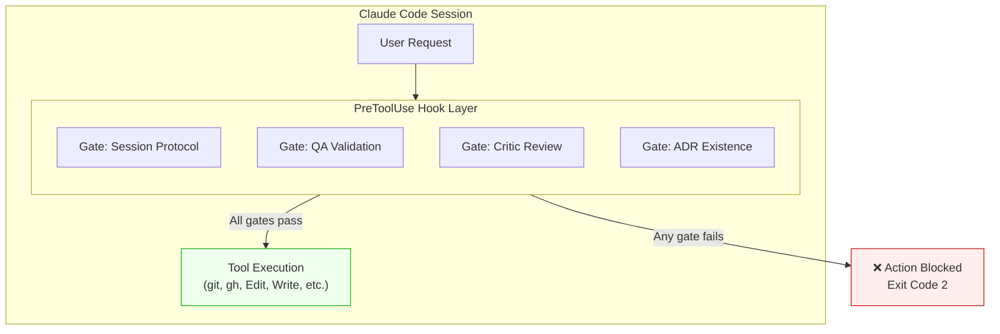
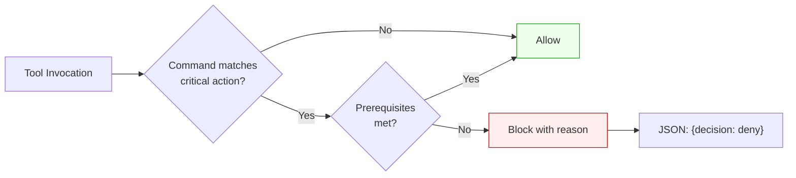
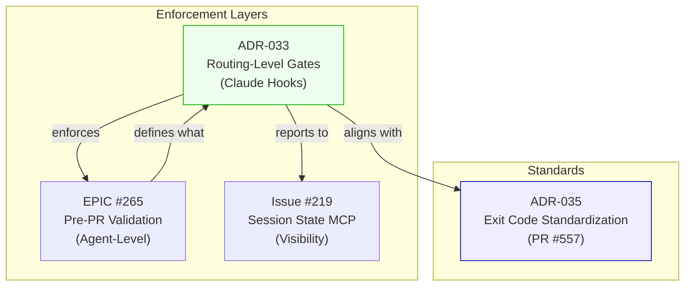

# ADR-033: Routing-Level Enforcement Gates

## Status

Accepted (amended 2026-07-19: the dedicated PreToolUse hook implementing Gates 2, 3, and 4 was retired as structurally dead. See the "Amendment (2026-07-19)" section below. Refs #3194, #3246, #3248.)

### Current-State Amendment (2026-08-16)

The committed session-log routing gate is retired. No session-start,
session-end, commit, push, or pull request action requires a log. A staged or
explicitly supplied JSON log still validates. The historical gate design below
remains as accepted decision history. This amendment supersedes every earlier
statement that Gate 1 requires a session log or session-log evidence.

## Date

2025-12-30

## Context

### Problem Statement

Agents bypass validation protocols when given autonomy. Evidence from PR #226 retrospective:

> "The agent interpreted this as permission to skip session protocol, bypass orchestrator coordination, make autonomous 'won't fix' decisions, merge without critic/QA validation."

The failure mode is **agent-level protocol bypass**, not skill-internal execution errors.

### Why ADR-032 Was Wrong

The original ADR-032 (Skill Phase Gates) proposed gates *within* skills. Multi-agent debate revealed this addresses the wrong abstraction layer:

| Layer | ADR-032 Addressed | Actual Failure Mode |
|-------|-------------------|---------------------|
| Skill-internal | Steps within a skill | Agent bypassed ALL skills |
| **Agent-routing** | ❌ Not addressed | **Agent skipped protocols entirely** |

### Philosophical Grounding

Two vexjoy principles inform this decision:

1. **"Everything Deterministic"**: LLMs should orchestrate deterministic programs, not interact directly with the environment
2. **"Do Router"**: "Over-routing is cheap. Under-routing compounds." Force routing to specialists before high-stakes actions

### Current Enforcement Gap

| Action | Current Enforcement | Failure Rate |
|--------|---------------------|--------------|
| `git commit` | Trust-based (protocol docs) | ~60% violation |
| `gh pr create` | Trust-based (protocol docs) | ~60% violation |
| `gh pr merge` | Trust-based (protocol docs) | Unknown |
| Session start | Documentation only | Frequently skipped |

## Decision

**Implement routing-level enforcement gates using Claude Code hooks.**

Gates operate at the **tool invocation layer**, blocking high-stakes actions until validation prerequisites are met.

### Gate Architecture


```mermaid
flowchart TB
    subgraph Claude["Claude Code Session"]
        direction TB
        Request["User Request"]

        subgraph Hooks["PreToolUse Hook Layer"]
            direction TB
            G1["Gate: Session Protocol"]
            G2["Gate: QA Validation"]
            G3["Gate: Critic Review"]
            G4["Gate: ADR Existence"]
        end

        Tools["Tool Execution<br/>(git, gh, Edit, Write, etc.)"]
    end

    Request --> Hooks
    Hooks -->|All gates pass| Tools
    Hooks -->|Any gate fails| Block["❌ Action Blocked<br/>Exit Code 2"]

    style Block fill:#fee,stroke:#c00
    style Tools fill:#efe,stroke:#0a0
```

### Gate Decision Flow


```mermaid
flowchart LR
    A[Tool Invocation] --> B{Command matches<br/>critical action?}
    B -->|No| C[Allow]
    B -->|Yes| D{Prerequisites<br/>met?}
    D -->|Yes| C
    D -->|No| E[Block with reason]

    E --> F["JSON: {decision: deny}"]

    style C fill:#efe,stroke:#0a0
    style E fill:#fee,stroke:#c00
```

### Enforcement Mechanism

Claude hooks provide **deterministic enforcement** via exit codes.

> **Note**: Claude hooks have their own exit code semantics that differ from [ADR-035 Exit Code Standardization](./ADR-035-exit-code-standardization.md). Hook scripts are exempt from ADR-035 because Claude Code defines these semantics.

**Claude Hook Exit Codes** (per Claude Code documentation):

| Exit Code | Hook Behavior | ADR-035 Equivalent |
|-----------|---------------|-------------------|
| 0 | Allow action / JSON decision | Success |
| 1 | Hook error (fail-open) | Logic Error |
| 2 | **Block action immediately** | *(Hook-specific)* |

**JSON Decision Mode** (preferred for gates):

Instead of exit code 2, hooks can output JSON with `decision: "deny"` and exit 0. This provides:

- Structured error messages
- Reason displayed to Claude
- Consistent with ADR-035 (exit 0 = success)

```json
{"decision": "deny", "reason": "SESSION PROTOCOL GATE: Create session log first."}
```

**Exit Code Mapping**:

| Gate Result | Method | Exit Code | ADR-035 Aligned? |
|-------------|--------|-----------|------------------|
| Allow | Exit 0 | 0 | Yes |
| Block (structured) | JSON + Exit 0 | 0 | Yes |
| Block (immediate) | Exit 2 | 2 | No (hook-specific) |
| Hook failure | Exit 1 | 1 | Yes |
| External error | Exit 3 | 3 | Yes |

### Gate Types

| Gate | Trigger Pattern | Prerequisite | Enforcement |
|------|-----------------|--------------|-------------|
| **Session Protocol** | `git commit`, `gh pr create` | Session log exists with required sections | Exit code 2 |
| **QA Validation** | `gh pr create` | `.agents/qa/` report exists | Retired 2026-07-19 (see Amendment) |
| **Critic Review** | `gh pr merge` | Critic agent invoked in transcript | Retired 2026-07-19 (see Amendment) |
| **ADR Existence** | `gh pr create --head feat/*` | ADR file exists for features | Retired 2026-07-19 (see Amendment) |
| **Retrospective** | `git push` | Retrospective evidence in session or file | Exit code 2 |

### Hook Configuration

```json
{
  "hooks": {
    "PreToolUse": [
      {
        "matcher": "Bash",
        "hooks": [
          {
            "type": "command",
            "command": "pwsh -NoProfile -File \"$CLAUDE_PROJECT_DIR\"/.claude/hooks/Invoke-RoutingGates.ps1",
            "timeout": 5
          }
        ]
      }
    ],
    "SessionStart": [
      {
        "hooks": [
          {
            "type": "command",
            "command": "pwsh -NoProfile -File \"$CLAUDE_PROJECT_DIR\"/.claude/hooks/Initialize-Session.ps1"
          }
        ]
      }
    ]
  }
}
```

### Gate Implementation (PowerShell)

Per ADR-005 (PowerShell-only scripting), hooks are implemented in PowerShell:

```powershell
#Requires -Version 7.0
<#
.SYNOPSIS
    Routing-level enforcement gates for Claude Code.
.DESCRIPTION
    Blocks high-stakes actions until validation prerequisites are met.
    Uses exit code 2 to block actions deterministically.
#>

# Read JSON input from stdin
$InputJson = $input | Out-String | ConvertFrom-Json
$Command = $InputJson.tool_input.command

function Get-TodaySessionLog {
    $SessionDir = ".agents/sessions"
    $Today = Get-Date -Format "yyyy-MM-dd"

    if (Test-Path $SessionDir) {
        $SessionLog = Get-ChildItem -Path $SessionDir -Filter "$Today*-session-*.md" |
                      Select-Object -First 1
        return $SessionLog
    }
    return $null
}

function Test-QAReport {
    $QADir = ".agents/qa"
    if (Test-Path $QADir) {
        return (Get-ChildItem -Path $QADir -Filter "*.md" | Measure-Object).Count -gt 0
    }
    return $false
}

# Gate 1: Session Protocol
$CriticalActions = @("git commit", "gh pr create")
$RequiresSessionLog = $CriticalActions | Where-Object { $Command -like "*$_*" }

if ($RequiresSessionLog) {
    $SessionLog = Get-TodaySessionLog
    if (-not $SessionLog) {
        $Output = @{
            decision = "deny"
            reason = "SESSION PROTOCOL GATE: Create session log first.`nPath: .agents/sessions/YYYY-MM-DD-session-NN.json"
        }
        $Output | ConvertTo-Json -Compress
        exit 0  # JSON output with deny decision
    }
}

# Gate 2: QA Validation (for PR creation)
if ($Command -like "*gh pr create*") {
    if (-not (Test-QAReport)) {
        $Output = @{
            decision = "deny"
            reason = "QA VALIDATION GATE: Run QA agent before PR.`nCommand: Task(subagent_type='qa', prompt='Verify changes')"
        }
        $Output | ConvertTo-Json -Compress
        exit 0  # JSON output with deny decision
    }
}

# All gates passed
exit 0
```

## Rationale

### Why Hooks Over Documentation

| Approach | Compliance Rate | Evidence |
|----------|-----------------|----------|
| Documentation-only | ~40% | Session 15: 5+ violations despite docs |
| Trust-based prompts | ~40% | PR #226: Agent ignored all protocols |
| **Hook enforcement** | ~100% | Exit code 2 cannot be bypassed |

### Why Routing-Level Over Skill-Level

The "Do Router" insight: **Force routing to specialists before high-stakes actions.**

| Approach | Addresses |
|----------|-----------|
| Skill-internal gates | Steps within already-invoked skill |
| **Routing-level gates** | Whether validation happens at all |

An agent that bypasses skills entirely (PR #226) would still be blocked by routing-level gates because the gate triggers on the *tool invocation*, not the skill invocation.

### Alternatives Considered

| Alternative | Pros | Cons | Why Not Chosen |
|-------------|------|------|----------------|
| Skill phase gates (ADR-032) | Addresses within-skill shortcuts | Wrong layer; agent can skip skills | Debate showed scope mismatch |
| Agent prompt enforcement | Zero infrastructure | Trust-based; fails under pressure | PR #226 proves this fails |
| CI-only enforcement | Catches after the fact | Doesn't prevent; reactive | Want proactive blocking |
| **Hook enforcement** | Deterministic; cannot bypass | Requires hook infrastructure | Best balance |

### Trade-offs

**Accepting:**

- Hook maintenance burden
- Potential for false positives blocking legitimate actions
- Need to handle fail-open vs fail-closed decisions

**Avoiding:**

- Protocol bypass failures (target: 0%)
- Premature PR creation without validation
- Commits without session tracking

## Reversibility Assessment

### Can hooks be disabled without side effects?

**Yes.** Remove the `hooks` section from `.claude/settings.local.json`. No code changes required. Immediate effect on next session.

### What happens if a gate unexpectedly blocks legitimate work?

**Workaround options:**

1. **Temporary disable**: Comment out specific gate in PowerShell script
2. **Fail-open mode**: Change `exit 2` to `exit 0` for specific gates
3. **Override flag**: Add environment variable check (e.g., `$env:SKIP_GATES`)

### Downgrade path (blocking → advisory)

Gates can be converted from blocking to advisory:

```powershell
# Blocking (current - JSON decision mode)
$Output = @{ decision = "deny"; reason = "Gate condition not met" }
$Output | ConvertTo-Json -Compress
exit 0  # JSON deny blocks action

# Advisory (downgrade)
Write-Warning "Gate condition not met: [reason]"
exit 0  # No JSON output = allows action with warning
```

### Vendor lock-in assessment

**Low risk.** Claude hooks are Claude-specific, but:

- PowerShell scripts are portable
- Gate logic is simple (file existence checks)
- Can be converted to pre-commit hooks if needed

## Consequences

### Positive

- **Deterministic enforcement**: Exit code 2 cannot be argued with
- **Visibility**: Block messages explain what's needed
- **Incremental**: Add gates one at a time
- **Complements EPIC #265**: Hooks enforce; #265 defines what to enforce

### Negative

- **Hook debugging complexity**: Failures may be opaque
- **False positives**: Overly strict gates block legitimate work
- **Maintenance**: Gate logic must evolve with protocol changes

### Neutral

- **No change to skill definitions**: Gates operate outside skills
- **Works with existing agents**: No agent prompt changes required
- **EPIC #265 independent**: Can deploy hooks before #265 completes

## Implementation Notes

### Skill Creation Guidance

For any gate-related skills created during implementation:

**RECOMMENDED**: Use the `skillcreator` skill for production-ready skill creation:

```text
SkillCreator: create a skill for [gate-specific purpose]
```

SkillCreator enforces:

- Timelessness score ≥7 (critical for enforcement infrastructure)
- Multi-agent synthesis panel approval
- Phase gates for multi-step workflows
- Self-verifying scripts for validation

**Reference**: [SKILL-CREATION-CRITERIA.md](../governance/SKILL-CREATION-CRITERIA.md)

### Phase 1: Foundation (This PR)

1. Create `.claude/hooks/` directory structure
2. Implement `Invoke-RoutingGates.ps1` with Session Protocol gate
3. Add hook configuration to `.claude/settings.local.json`
4. Test with deliberate violations

### Phase 2: QA Gate

1. Add QA validation gate to hook script
2. Define `.agents/qa/` report format requirement
3. Update QA agent to write reports to expected location

### Phase 3: Critic Gate

1. Add transcript parsing for critic invocation
2. Block PR merge without critic review evidence
3. Consider prompt-based hook for intelligent detection

### Phase 3.5: Retrospective Gate (Issue #618)

The previously implemented `invoke_retrospective_gate.py` enforced retrospective before push:

1. **Trigger**: `git push` commands
2. **Evidence Requirements** (any satisfies):
   - Retrospective section in session log (`## Retrospective`)
   - Retrospective file in `.agents/retrospective/` for today
   - Reference to retrospective file in session log
3. **Bypass Conditions**:
   - Documentation-only changes (auto-detected)
   - Trivial sessions (<10 minutes, single file change)
   - `SKIP_RETROSPECTIVE_GATE=true` environment variable
4. **Hook Configuration**: Added to `.claude/settings.json` under `Bash(git push*)` matcher

### Phase 4: "Do Router" Integration

1. Add keyword-based mandatory routing
2. Force `security` agent for `**/Auth/**` files
3. Force `architect` agent for `ADR-*.md` changes
4. Force `qa` agent before any PR action

### Metrics

| Metric | Baseline | Target | Measurement |
|--------|----------|--------|-------------|
| Protocol violations | ~60% | 0% | Hook block count |
| Session log compliance | Unknown | 100% | Session log existence |
| QA-less PRs | Unknown | 0% | Gate block count |

## Relationship to Other Work


```mermaid
flowchart TB
    subgraph Enforcement["Enforcement Layers"]
        direction TB
        ADR033["ADR-033<br/>Routing-Level Gates<br/>(Claude Hooks)"]
        EPIC265["EPIC #265<br/>Pre-PR Validation<br/>(Agent-Level)"]
        MCP219["Issue #219<br/>Session State MCP<br/>(Visibility)"]
    end

    subgraph Standards["Standards"]
        ADR035Exit["ADR-035<br/>Exit Code Standardization<br/>(PR #557)"]
    end

    ADR033 -->|enforces| EPIC265
    EPIC265 -->|defines what| ADR033
    ADR033 -->|reports to| MCP219
    ADR033 -->|aligns with| ADR035Exit

    style ADR033 fill:#efe,stroke:#0a0
    style ADR035Exit fill:#eef,stroke:#00a
```

### EPIC #265 (Pre-PR Validation)

- **EPIC #265**: Defines *what* validation is required (agent-level)
- **ADR-033**: Defines *how* validation is enforced (hook-level)
- **Status**: PR #562 completing Issue #258 will complete #265

### Original Skill Phase Gates Proposal

- **Superseded**: Original proposal addressed wrong layer (skill-internal vs routing-level)
- **Learnings preserved**: "Structure + iteration" insight applies to routing gates
- **Governance docs retained**: SKILL-PHASE-GATES.md, SKILL-CREATION-CRITERIA.md remain useful
- **Note**: the ADR-032 number was reserved for Exit Code Standardization (PR #557) but reassigned; that decision published as ADR-035 and ADR-032 is EARS Requirements Syntax

### Session State MCP (Issue #219)

- **Complementary**: MCP could consume gate status
- **Future integration**: Hook → MCP → Dashboard visibility

## Amendment (2026-07-19): Gates 2, 3, and 4 Dedicated Hook Retired

PR #3246 (Refs #3194) deleted `invoke_routing_gates.py`, the PreToolUse hook that implemented Gates 2 (QA Validation), 3 (Critic Review), and 4 (ADR Existence) from the Gate Types table above. This amendment records that retirement; the code change already shipped. The original PowerShell design in this ADR (`Invoke-RoutingGates.ps1`) had been superseded by that Python hook, so no ADR text referenced the deleted path and the deletion orphaned no references.

### Why the hook was retired

The hook was structurally dead, enforcing nothing while costing startup and dispatch overhead:

- Its matcher fired only on raw `gh pr create` and `gh pr merge`. In the same PreToolUse event, the previously registered `invoke_skill_first_guard.py` already denied those raw commands and steered callers to the GitHub skill scripts, so the routing_gates matcher never reached a live command.
- Its deny path used the legacy exit-0 JSON payload, which the current harness ignores, so even on a match it could not block.

### What still enforces

- Gate 1 (Session Protocol) remains, enforced by the lefthook `session-policy`
  job on `.agents/**` changes. That job runs
  `scripts/validation/git_hook_policy.py session` during pre-commit and validates
  staged JSON session logs.
- The Retrospective gate (Phase 3.5) remains on `git push`, enforced by the
  lefthook `retrospective-policy` job.
- Architecture-change governance is enforced by the lefthook `adr-review-policy`
  job on ADR and session-protocol changes during pre-commit. It requires
  adr-review evidence in the current session log and a debate log that references
  the staged ADR IDs.

### Where the advisory intent went

Because the hook enforced nothing, its retirement removed no live enforcement. The advisory intents behind Gates 2, 3, and 4 are handled without a dedicated PreToolUse blocker:

- ADR existence and review: the lefthook `adr-review-policy` job blocks ADR-touching commits that lack adr-review evidence, and CI runs spec validation on pull requests.
- QA validation and critic review: these are advisory quality signals, not agentic-harness blockers. They are left to CI and to code review rather than a per-tool-call PreToolUse gate. This matches the hook ROI reduction program (epic #3197): a hook ships to customers only when it delivers blocking value that CI cannot.

### adr-review consensus

This retirement amendment was validated by the six-agent adr-review debate (architect, critic, independent-thinker, security, analyst, high-level-advisor). See the ADR-033 debate log under the architecture critique directory.

## References

- vexjoy: "Everything That Can Be Deterministic" - https://vexjoy.com/posts/everything-that-can-be-deterministic-should-be-my-claude-code-setup/
- vexjoy: "The Do Router" - https://vexjoy.com/posts/the-do-router/
- Claude Code Hooks: https://docs.anthropic.com/en/docs/claude-code/hooks
- Multi-agent debate: Session 100 (critic, independent-thinker, architect, security, analyst, high-level-advisor)
- EPIC #265: Pre-PR Validation System
- SkillCreator: `.claude/skills/skillcreator/SKILL.md` (for gate-related skills)

---

*ADR Version: 1.4*
*Created: 2025-12-30*
*Updated: 2026-02-20 - Added Retrospective Gate implementation (Issue #618)*
*Updated: 2026-07-19 - Recorded retirement of the Gates 2/3/4 dedicated PreToolUse hook (Issues #3194, #3246, #3248)*
*Note: the ADR-032 number was reserved for Exit Code Standardization (PR #557) but reassigned; that decision published as ADR-035 and ADR-032 is EARS Requirements Syntax*
