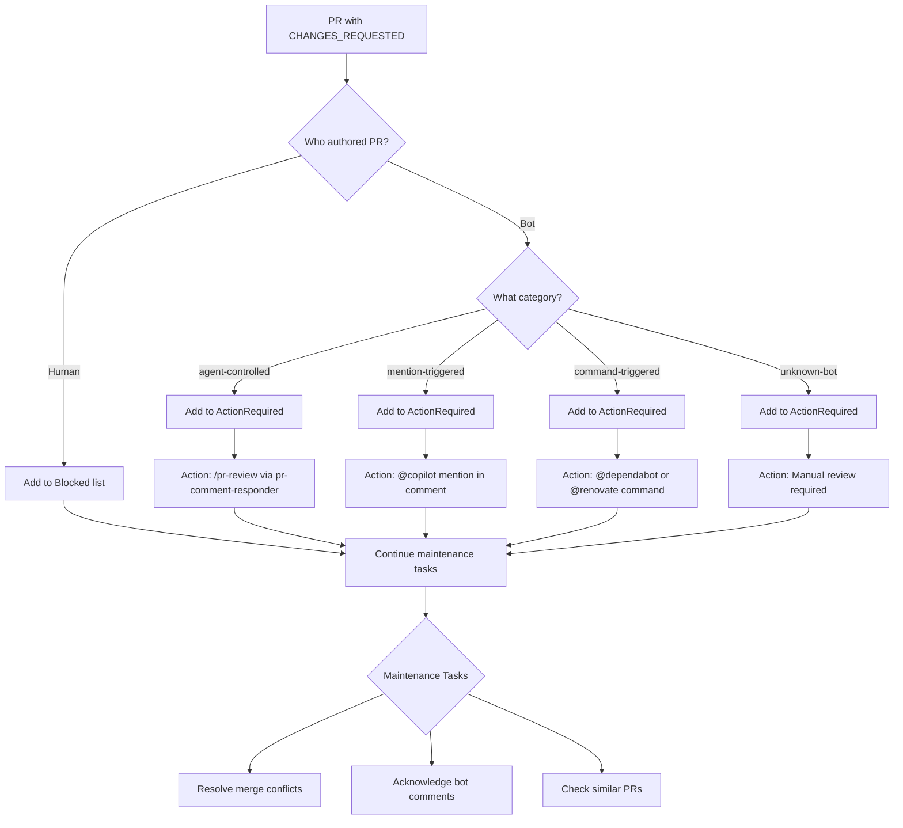
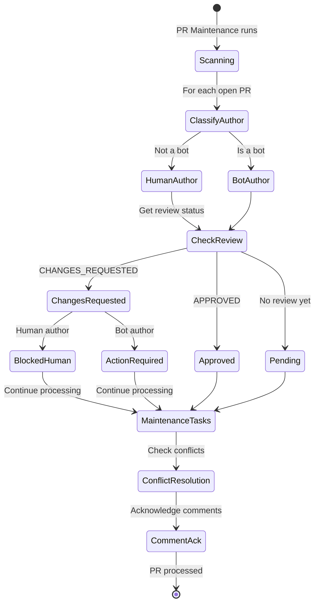

# Bot Author Feedback Protocol

## Overview

This document describes how the PR maintenance system handles CHANGES_REQUESTED feedback based on PR author type and bot category.

## Decision Flow



## Bot Categories

| Category | Pattern | Examples | Action |
|----------|---------|----------|--------|
| **agent-controlled** | `-bot$` suffix or `github-actions` | rjmurillo-bot, github-actions[bot] | `/pr-review` skill |
| **mention-triggered** | `copilot` prefix | copilot-swe-agent, copilot[bot] | `@copilot` mention |
| **command-triggered** | Known dependency bots | dependabot[bot], renovate[bot] | `@bot` commands |
| **unknown-bot** | Other `[bot]` suffix | Any unrecognized bot | Manual review |
| **human** | No bot patterns | rjmurillo, johndoe | Blocked - human action |

## State Machine



## Implementation

### Get-BotAuthorInfo Function

```powershell
$botInfo = Get-BotAuthorInfo -AuthorLogin $pr.author.login

# Returns hashtable:
# @{
#     IsBot    = $true/$false
#     Category = 'agent-controlled'|'mention-triggered'|'command-triggered'|'unknown-bot'|'human'
#     Action   = 'Description of required action'
#     Mention  = '@botname' or $null
# }
```

### Category Detection Logic

```powershell
# Mention-triggered bots (need @mention in comment)
$mentionTriggered = @{
    '^copilot-swe-agent$' = '@copilot'
    '^copilot\[bot\]$'    = '@copilot'
}

# Command-triggered bots (need specific @bot commands)
$commandTriggered = @{
    '^dependabot\[bot\]$' = '@dependabot'
    '^renovate\[bot\]$'   = '@renovate'
}

# Agent-controlled bots (can be addressed via /pr-review)
$agentControlled = @(
    '-bot$'                    # Custom bots with -bot suffix
    '^github-actions$'         # GitHub Actions account
    '^github-actions\[bot\]$'  # GitHub Actions bot
)
```

## Bot Mention Guidelines

> **Cost Warning**: Each @mention of a bot triggers an action that incurs cost and is subject to rate limits.

### When to Mention

- Only when feedback requires bot action
- Use prompts suitable for the least capable agent model
- Consider rate limits (see coderabbit comments on past PRs)

### When NOT to Mention

- Acknowledging receipt (use reaction instead)
- Providing final resolution (commit hash only)
- Informational responses

## Special Cases

### github-actions Account

The `github-actions` account runs workflows but **cannot respond to comments or mentions**. This complicates the protocol:

- PRs authored by github-actions with CHANGES_REQUESTED cannot be addressed via mention
- Recommendation: All accounts should use their own credentials
- Consider ADR for credential usage policy

### Maintenance Tasks Always Run

Regardless of CHANGES_REQUESTED status or author type, these tasks always execute:

| Task | Purpose |
|------|---------|
| Resolve merge conflicts | Keep PR mergeable |
| Acknowledge bot comments | Show engagement |
| Check similar PRs | Informational |

## Anti-Patterns

```powershell
# WRONG: Skip all processing for CHANGES_REQUESTED
if ($pr.reviewDecision -eq 'CHANGES_REQUESTED') { continue }

# WRONG: Treat all bots the same
if ($isBotAuthor) { Invoke-PRCommentResponder }  # copilot needs @mention!

# WRONG: Always mention reviewer
Post-Reply "@$reviewer fixed in abc123"  # Triggers unnecessary bot action
```

## Related Documents

- Memory: `pr-changes-requested-semantics` - Quick reference
- Memory: `cursor-bot-review-patterns` - 100% actionable signal
- Memory: `copilot-pr-review` - 21% signal, high false positive rate
- Memory: `coderabbit-config-strategy` - 66% noise, use path_instructions
- Script: `scripts/Invoke-PRMaintenance.ps1` - Implementation
