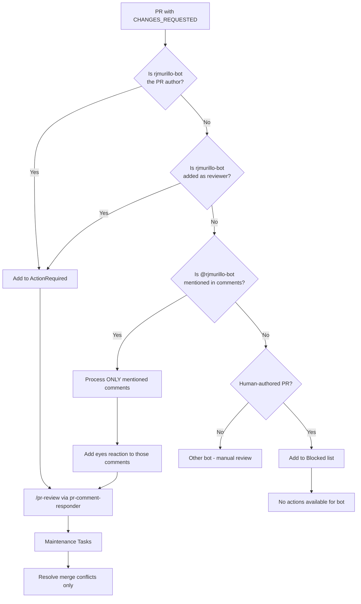
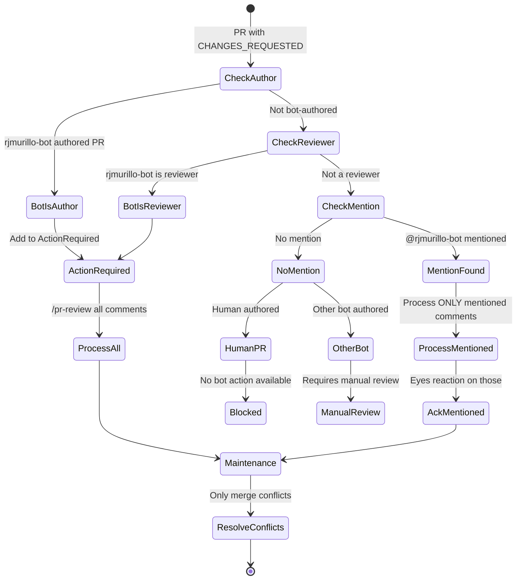

# Bot Author Feedback Protocol

## Overview

This document describes how the PR maintenance system handles CHANGES_REQUESTED feedback and when rjmurillo-bot takes action.

## Prerequisites

Before performing any work, rjmurillo-bot MUST:

1. Read `.agents/AGENTS.md`
2. Follow `.agents/SESSION-PROTOCOL.md`

## Decision Flow



## rjmurillo-bot Activation Triggers

rjmurillo-bot takes action in these scenarios:

| Trigger | Condition | Action |
|---------|-----------|--------|
| **PR Author** | PR opened by rjmurillo-bot | Add to ActionRequired, run /pr-review |
| **Reviewer** | rjmurillo-bot added as reviewer | Add to ActionRequired, run /pr-review |
| **Mention** | @rjmurillo-bot in comment | Process ONLY that comment |

### Blocked List

A PR is added to the Blocked list ONLY when:

- Human authored the PR, AND
- No action is directed toward @rjmurillo-bot (explicitly or implicitly)

## Comment Acknowledgment (Eyes Reaction)

The eyes reaction is a social indicator of engagement. Use it ONLY when rjmurillo-bot will take action on the item.

**When to add eyes reaction:**

- rjmurillo-bot is the PR author
- rjmurillo-bot is assigned as reviewer
- @rjmurillo-bot is explicitly mentioned in the comment

**When NOT to add eyes reaction:**

- Human-authored PR with no mention of rjmurillo-bot
- Comments on PRs where bot has no action to take

## Maintenance Tasks

Maintenance tasks are limited to **merge conflict resolution only**.

### Resolving Merge Conflicts

Before resolving conflicts, gather context:

```bash
# Get last 10 commits into main for context
git log --oneline -10 origin/main

# Additional context from open Issues and PRs as needed
gh issue list --state open --limit 10
gh pr list --state open --limit 10
```

Note: PR numbers are included in the git log for reference (e.g., `abc1234 fix: something (#123)`).

## State Machine



## Bot Categories

| Category | Examples | When rjmurillo-bot Acts |
|----------|----------|------------------------|
| **agent-controlled** | rjmurillo-bot | Author or reviewer of PR |
| **mention-triggered** | copilot-swe-agent | When @copilot mentioned (supplements agent-controlled) |
| **command-triggered** | dependabot[bot] | Uses @dependabot commands |
| **non-responsive** | github-actions[bot] | Cannot respond to mentions |
| **human** | rjmurillo | Only if @rjmurillo-bot mentioned |

## Anti-Patterns

```powershell
# WRONG: Add eyes to all comments
foreach ($comment in $allComments) { Add-Reaction -eyes }  # Only when taking action!

# WRONG: Process all comments when only mentioned
if ($mentionedOnce) { ProcessAllComments() }  # Only process where mentioned!

# WRONG: Include comment acknowledgment in maintenance
$maintenanceTasks = @('conflicts', 'comments')  # Only conflicts!

# WRONG: Skip session protocol
ProcessPR()  # Must read AGENTS.md and follow SESSION-PROTOCOL.md first!
```

## Related Documents

- `.agents/AGENTS.md` - Agent system instructions
- `.agents/SESSION-PROTOCOL.md` - Required session initialization
- Memory: `pr-changes-requested-semantics` - Quick reference
- Script: `scripts/Invoke-PRMaintenance.ps1` - Implementation
