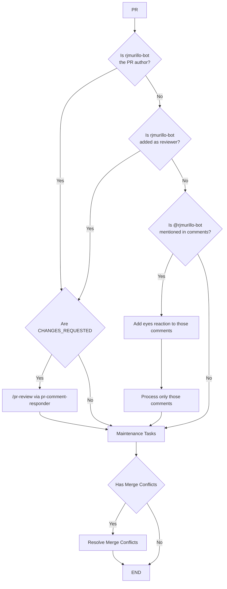
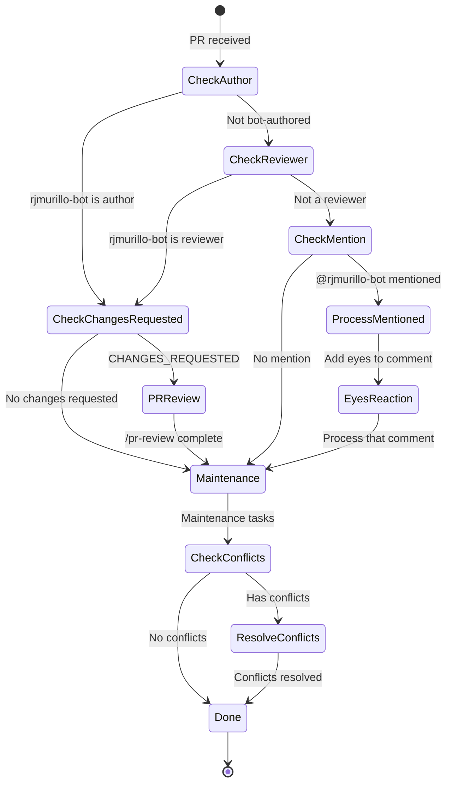

# Bot Author Feedback Protocol

## Overview

This document describes how the PR maintenance system handles CHANGES_REQUESTED feedback and when rjmurillo-bot takes action.

## Prerequisites

Before performing any work, rjmurillo-bot MUST:

1. Read `.agents/AGENTS.md`
2. Follow `.agents/SESSION-PROTOCOL.md`

## Decision Flow



## rjmurillo-bot Activation Triggers

rjmurillo-bot takes action in these scenarios:

| Trigger | Condition | CHANGES_REQUESTED? | Action |
|---------|-----------|-------------------|--------|
| **PR Author** | PR opened by rjmurillo-bot | Yes | /pr-review via pr-comment-responder |
| **PR Author** | PR opened by rjmurillo-bot | No | Maintenance only |
| **Reviewer** | rjmurillo-bot added as reviewer | Yes | /pr-review via pr-comment-responder |
| **Reviewer** | rjmurillo-bot added as reviewer | No | Maintenance only |
| **Mention** | @rjmurillo-bot in comment | N/A | Eyes reaction + process ONLY that comment |
| **None** | Not author, reviewer, or mentioned | N/A | Maintenance only |

## Comment Acknowledgment (Eyes Reaction)

The eyes reaction is a social indicator of engagement. Use it ONLY when rjmurillo-bot will take action on the item.

**When to add eyes reaction:**

- rjmurillo-bot is the PR author
- rjmurillo-bot is assigned as reviewer
- @rjmurillo-bot is explicitly mentioned in the comment

**When NOT to add eyes reaction:**

- Human-authored PR with no mention of rjmurillo-bot
- Comments on PRs where bot has no action to take

## Maintenance Tasks

Maintenance tasks are limited to **merge conflict resolution only**.

### Resolving Merge Conflicts

Before resolving conflicts, gather context:

```bash
# Get last 10 commits into main for context
git log --oneline -10 origin/main

# Additional context from open Issues and PRs as needed
gh issue list --state open --limit 10
gh pr list --state open --limit 10
```

Note: PR numbers are included in the git log for reference (e.g., `abc1234 fix: something (#123)`).

## State Machine



## PR Author Categories

How rjmurillo-bot responds based on who authored the PR:

| PR Author | rjmurillo-bot Role | Action |
|-----------|-------------------|--------|
| **rjmurillo-bot** | Author | /pr-review if CHANGES_REQUESTED, else maintenance |
| **rjmurillo-bot** | Reviewer | /pr-review if CHANGES_REQUESTED, else maintenance |
| **Human** | Mentioned | Eyes + process mentioned comments only |
| **Human** | Not involved | Maintenance only (conflict resolution) |
| **Other bot** | Mentioned | Eyes + process mentioned comments only |
| **Other bot** | Not involved | Maintenance only (conflict resolution) |

## Anti-Patterns

```powershell
# WRONG: Add eyes to all comments
foreach ($comment in $allComments) { Add-Reaction -eyes }
# RIGHT: Only add eyes when bot will take action on that comment

# WRONG: Run /pr-review when not author or reviewer
if ($mentioned) { Invoke-PRReview }
# RIGHT: If only mentioned, process ONLY the mentioned comments

# WRONG: Run /pr-review without CHANGES_REQUESTED
if ($isBotAuthor) { Invoke-PRReview }
# RIGHT: Only /pr-review when author/reviewer AND CHANGES_REQUESTED

# WRONG: Skip maintenance when not taking action
if (-not $shouldAct) { return }
# RIGHT: Always check for merge conflicts regardless of action

# WRONG: Skip session protocol
ProcessPR()
# RIGHT: Must read AGENTS.md and follow SESSION-PROTOCOL.md first
```

## Related Documents

- `.agents/AGENTS.md` - Agent system instructions
- `.agents/SESSION-PROTOCOL.md` - Required session initialization
- Memory: `pr-changes-requested-semantics` - Quick reference
- Script: `scripts/Invoke-PRMaintenance.ps1` - Implementation
