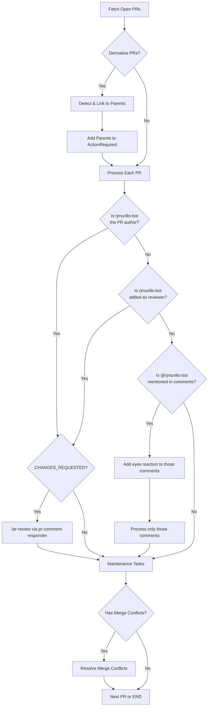
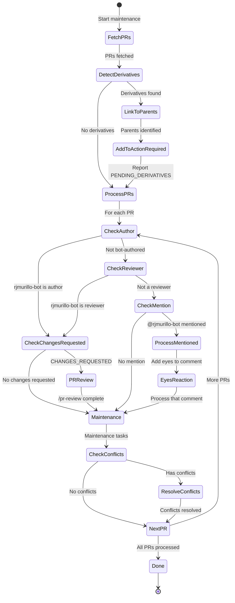

# Bot Author Feedback Protocol

## Overview

This document describes how the PR maintenance system handles CHANGES_REQUESTED feedback and when rjmurillo-bot takes action.

## Quick Start

### When to Use This Protocol

- **Scheduled (automated)**: GitHub Actions runs hourly - no manual action needed
- **Manual (on-demand)**: Run script when PRs need immediate attention

### Invocation

**Automated (Default)**:

GitHub Actions workflow: `.github/workflows/pr-maintenance.yml`

```bash
# Manual trigger via CLI
gh workflow run pr-maintenance.yml
```

**Manual Execution**:

```bash
# Process up to 20 PRs (default)
pwsh scripts/Invoke-PRMaintenance.ps1

# Process specific number
pwsh scripts/Invoke-PRMaintenance.ps1 -MaxPRs 5
```

**Agent Invocation** (responding to review comments):

```bash
# In Claude Code session - invoke pr-comment-responder skill
/pr-review 123

# Multiple PRs
/pr-review 123,456,789
```

### Invocation Decision Tree

Use this to determine which invocation method:

```mermaid
flowchart TD
    A[What is your goal?] --> B{Goal Type}
    B -->|Routine maintenance| C[Scheduled: hourly GitHub Actions]
    B -->|Check PR status now| D[Manual: pwsh scripts/Invoke-PRMaintenance.ps1]
    B -->|Address CHANGES_REQUESTED| E[Agent: /pr-review PR]
    B -->|Trigger from CI/CD| F[gh workflow run pr-maintenance.yml]

    G[Are you an agent responding to review comments?] --> H{Response}
    H -->|YES| I[/pr-review PR<br/>processes comments, implements fixes]
    H -->|NO| J[pwsh scripts/Invoke-PRMaintenance.ps1<br/>scans, reports, resolves conflicts]

    K[Do you need to implement code changes?] --> L{Changes Needed}
    L -->|YES| M[/pr-review<br/>agent modifies code]
    L -->|NO| N[Invoke-PRMaintenance.ps1<br/>script only reports]
```

## Prerequisites

### Session Protocol

Before performing any work, rjmurillo-bot MUST:

1. Read `.agents/AGENTS.md`
2. Follow `.agents/SESSION-PROTOCOL.md`

**Verification**: Check for session log at `.agents/sessions/YYYY-MM-DD-session-NN.md`

### Required Tools

| Tool | Version | Verify | Install |
|------|---------|--------|---------|
| PowerShell Core | 7.0+ | `pwsh --version` | <https://aka.ms/powershell> |
| GitHub CLI | Latest | `gh --version` | <https://cli.github.com> |
| Git | 2.23+ | `git --version` | <https://git-scm.com> |

### Required Permissions

- **Local execution**: GitHub CLI authenticated with push access (`gh auth status`)
- **GitHub Actions**: `GITHUB_TOKEN` with `repo`, `workflow`, `pull_requests:write`

## Decision Flow



## rjmurillo-bot Activation Triggers

rjmurillo-bot takes action in these scenarios:

| Trigger | Condition | CHANGES_REQUESTED? | Action |
|---------|-----------|-------------------|--------|
| **PR Author** | PR opened by rjmurillo-bot | Yes | /pr-review via pr-comment-responder |
| **PR Author** | PR opened by rjmurillo-bot | No | Maintenance only |
| **Reviewer** | rjmurillo-bot added as reviewer | Yes | /pr-review via pr-comment-responder |
| **Reviewer** | rjmurillo-bot added as reviewer | No | Maintenance only |
| **Reviewer on Copilot PR** | rjmurillo-bot reviews copilot-swe-agent PR | N/A | Synthesize bot feedback for @copilot |
| **Mention** | @rjmurillo-bot in comment | N/A | Eyes reaction + process ONLY that comment |
| **None** | Not author, reviewer, or mentioned | N/A | Maintenance only |

### Copilot Synthesis Workflow

When rjmurillo-bot is assigned as reviewer on a copilot-swe-agent PR, it synthesizes feedback from other review bots.

**Trigger Conditions:**

1. PR author matches `copilot` pattern (copilot-swe-agent)
2. rjmurillo-bot is a reviewer on the PR
3. Comments exist from other bots (coderabbitai, cursor[bot], gemini-code-assist)

**Workflow:**

1. Detect copilot-swe-agent authorship
2. Collect comments from other review bots (case-insensitive matching)
3. Generate synthesis prompt using `Invoke-CopilotSynthesis`
4. Post @copilot comment with grouped feedback links
5. Add PR to ActionRequired with reason `COPILOT_SYNTHESIS_NEEDED`

**Authority Boundary:**

Bot reviewer CANNOT directly modify mention-triggered PRs - must delegate via @copilot comment. This preserves the principle that copilot-swe-agent responds only to @copilot mentions.

**Synthesis Prompt Format:**

```text
@copilot Please address the following feedback on PR #N:

**coderabbitai** (X comments):
- [truncated comment text](link)

**cursor[bot]** (Y comments):
- [truncated comment text](link)

Please implement fixes for these issues and update the PR.
```

### Acceptance Criteria by Scenario

**Scenario 1: Bot Author with CHANGES_REQUESTED**

```text
GIVEN: PR authored by rjmurillo-bot with reviewDecision=CHANGES_REQUESTED
WHEN: Protocol executes
THEN:
  - All review comments have eyes reaction
  - /pr-review skill invoked
  - Each comment addressed with reply containing commit SHA or explanation
  - PR added to ActionRequired list
```

**Scenario 2: Bot Reviewer with CHANGES_REQUESTED**

```text
GIVEN: Human-authored PR with rjmurillo-bot as reviewer + CHANGES_REQUESTED
WHEN: Protocol executes
THEN:
  - All comments acknowledged with eyes
  - /pr-review skill invoked
  - PR added to ActionRequired list with Category='agent-controlled'
```

**Scenario 3: Bot Mentioned**

```text
GIVEN: Human-authored PR with @rjmurillo-bot in comment #2 (of 3 comments)
WHEN: Protocol executes
THEN:
  - Comment #2 has eyes reaction (mentioned)
  - Comments #1 and #3 have NO eyes reaction
  - PR added to ActionRequired with Reason='MENTION'
```

**Scenario 4: No Bot Involvement**

```text
GIVEN: Human-authored PR, bot not reviewer, not mentioned
WHEN: Protocol executes
THEN:
  - CommentsAcknowledged = 0
  - No ActionRequired entry
  - Only conflict resolution attempted
```

## Comment Acknowledgment (Eyes Reaction)

The eyes reaction is a social indicator of engagement. Use it ONLY when rjmurillo-bot will take action on the item.

**When to add eyes reaction:**

- rjmurillo-bot is the PR author -> add to ALL comments
- rjmurillo-bot is assigned as reviewer -> add to ALL comments
- @rjmurillo-bot is explicitly mentioned -> add ONLY to that comment

**When NOT to add eyes reaction:**

- Human-authored PR with no mention of rjmurillo-bot
- Comments on PRs where bot has no action to take

## Maintenance Tasks

Maintenance tasks are limited to **merge conflict resolution only**.

### Auto-Resolvable Conflicts

Files that can be auto-resolved with `--theirs` strategy:

- `.agents/HANDOFF.md`
- `.agents/sessions/*`

All other conflicts require manual resolution.

### Resolving Merge Conflicts

Before resolving conflicts, gather context:

```bash
# Get last 10 commits into main for context
git log --oneline -10 origin/main

# Additional context from open Issues and PRs as needed
gh issue list --state open --limit 10
gh pr list --state open --limit 10
```

Note: PR numbers are included in the git log for reference (e.g., `abc1234 fix: something (#123)`).

## Handoff: Script to Agent

The maintenance script identifies PRs needing action but does NOT address review comments automatically.

### Script Output Interpretation

```text
### PRs Requiring Action

| PR | Author | Category | Action |
|----|--------|----------|--------|
| #123 | rjmurillo-bot | agent-controlled | /pr-review via pr-comment-responder |

#### Recommended Actions

**Agent-controlled PRs**: Run `/pr-review 123`
```

### Next Steps After Script

1. **Note PR numbers** from "Run: /pr-review X,Y,Z" line in output
2. **Invoke pr-comment-responder skill** via Claude Code:

   ```bash
   /pr-review 123
   ```

3. **Agent addresses feedback** per `.agents/SESSION-PROTOCOL.md`
4. **Verify completion**: All comments have replies with commit SHAs

### What "Process Comments" Means

When the protocol says "process comments", the agent must:

1. Read each actionable comment
2. Implement requested changes (if valid)
3. Reply to comment with status: commit SHA if fixed, explanation if won't fix
4. Mark review thread as resolved (if applicable)

## State Machine



## PR Author Categories

How rjmurillo-bot responds based on who authored the PR:

| PR Author | rjmurillo-bot Role | Action |
|-----------|-------------------|--------|
| **rjmurillo-bot** | Author | /pr-review if CHANGES_REQUESTED, else maintenance |
| **rjmurillo-bot** | Reviewer | /pr-review if CHANGES_REQUESTED, else maintenance |
| **Human** | Mentioned | Eyes + process mentioned comments only |
| **Human** | Not involved | Maintenance only (conflict resolution) |
| **Other bot** | Mentioned | Eyes + process mentioned comments only |
| **Other bot** | Not involved | Maintenance only (conflict resolution) |

### Bot Categories

| Category | Examples | Behavior |
|----------|----------|----------|
| **agent-controlled** | rjmurillo-bot | Can run /pr-review directly |
| **mention-triggered** | copilot-swe-agent | Needs @copilot mention |
| **command-triggered** | dependabot[bot] | Needs @dependabot commands |
| **non-responsive** | github-actions[bot] | Cannot respond - blocked |
| **unknown-bot** | other[bot] | Review manually |
| **human** | rjmurillo | Only if @rjmurillo-bot mentioned |

## Derivative PRs

Bots like `copilot-swe-agent` may spawn derivative PRs based on review comments. These require special handling to avoid orphaned or conflicting changes.

### What is a Derivative PR?

A derivative PR is a PR created by a bot (typically `copilot-swe-agent`) that:

- **Targets a feature branch** (not `main`) - the parent PR's branch
- **Addresses a specific comment** from the parent PR's review
- **Example**: PR #437 targets `fix/400-pr-maintenance-visibility` (PR #402's branch)

### Detection

```text
GIVEN: PR with baseRefName != 'main' AND baseRefName != 'master'
WHEN: Author is a mention-triggered bot (Category == 'mention-triggered')
THEN: This is a derivative PR
```

**Implementation**: `Get-DerivativePRs` in `scripts/Invoke-PRMaintenance.ps1` checks:

1. `$pr.baseRefName` not in ('main', 'master')
2. `Get-BotAuthorInfo($author).Category -eq 'mention-triggered'`

**Note**: Only `mention-triggered` bots create derivatives. Agent-controlled bots (e.g., rjmurillo-bot) respond directly to their own PRs.

### Handling Workflow


### Risk: Race Condition

**Problem**: Parent PR may merge before derivative PR is reviewed.

**Scenario**:

1. PR #402 receives CHANGES_REQUESTED
2. `@copilot` spawns PR #437 targeting PR #402's branch
3. Reviewer approves PR #402 (not noticing derivative)
4. PR #402 merges
5. PR #437 becomes orphaned (base branch deleted)

**Mitigation**:

1. **Before merging parent PR**: Check for open derivative PRs targeting its branch
2. **Maintenance script enhancement**: Detect and report derivative PRs in ActionRequired
3. **Reviewer education**: Check for sub-PRs before final approval

### Script Integration

The maintenance script should:

1. Detect derivative PRs (baseRefName != main/master + bot author)
2. Link them to parent PRs in the summary output
3. Block parent PR merge if derivatives are pending

**Detection query**:

```bash
gh pr list --state open --json number,baseRefName,headRefName,author \
  --jq '.[] | select(.baseRefName != "main" and .baseRefName != "master")'
```

### Acceptance Criteria

**Scenario: Derivative PR from copilot-swe-agent**

```text
GIVEN: copilot-swe-agent creates PR targeting feature branch (not main)
WHEN: Protocol executes on parent PR
THEN:
  - Derivative PRs listed in parent's ActionRequired entry
  - Warning logged about pending derivative
  - Parent merge blocked until derivatives resolved
```

## Error Recovery

### Rate Limit Exceeded

**Symptom**: Script exits with "API rate limit too low"

**Recovery**:

1. Check reset time in log output
2. Wait until reset OR check: `gh api rate_limit`
3. Rerun script after reset

### Merge Conflict Resolution Failed

**Symptom**: PR status still CONFLICTING after run

**Cause**: Conflicts in non-auto-resolvable files

**Recovery**:

```bash
git checkout <pr-branch>
git merge main
# Resolve conflicts manually
git commit
git push
```

### Comment Acknowledgment Failed

**Symptom**: "Failed to add reaction to comment" in logs

**Cause**: API rate limit OR missing permissions

**Recovery**:

1. Check rate limit: `gh api rate_limit`
2. Verify token permissions: `gh auth status`
3. Manually add eyes reaction in GitHub UI OR rerun after reset

### /pr-review Failed Partway

**Symptom**: Some comments addressed, others not

**Recovery**:

1. Check which comments have replies
2. Re-run `/pr-review <PR>` - it will skip already-addressed comments
3. If persistent failure, address remaining comments manually

## Logs and Debugging

### Log Locations

- **Scheduled runs**: GitHub Actions > Run details > Download logs artifact
- **Local runs**: `.agents/logs/pr-maintenance.log`

### Reading Logs

```bash
# Tail latest local run
tail -f .agents/logs/pr-maintenance.log

# Filter errors only
grep '\[ERROR\]' .agents/logs/pr-maintenance.log

# Search for specific PR
grep 'PR #123' .agents/logs/pr-maintenance.log
```

### Exit Codes

| Code | Meaning | Workflow Status | Next Action |
|------|---------|-----------------|-------------|
| 0 | Success | Pass | Check summary for details |
| 1 | Reserved | N/A | Not currently used |
| 2 | Fatal error | Fail | Review logs at `.agents/logs/pr-maintenance.log` |

**Note**: Blocked PRs (CHANGES_REQUESTED) do NOT cause exit code 2. They are reported via summary and trigger the "Create alert issue" workflow step.

## Success Metrics

### Baseline (Normal Operation)

- **PRs processed**: 100% of open PRs (up to MaxPRs limit)
- **Comment acknowledgment rate**: >95%
- **Run duration**: <60s for 20 PRs

### Alert Thresholds

| Condition | Threshold | Investigation |
|-----------|-----------|---------------|
| Errors per run | >3 | Check API health, token permissions |
| Run duration | >120s | Check GitHub API latency |
| Zero actions | >24 hours | Verify scheduled workflow enabled |

## Anti-Patterns

```powershell
# WRONG: Add eyes to all comments
foreach ($comment in $allComments) { Add-Reaction -eyes }
# RIGHT: Only add eyes when bot will take action on that comment

# WRONG: Run /pr-review when not author or reviewer
if ($mentioned) { Invoke-PRReview }
# RIGHT: If only mentioned, process ONLY the mentioned comments

# WRONG: Run /pr-review without CHANGES_REQUESTED
if ($isBotAuthor) { Invoke-PRReview }
# RIGHT: Only /pr-review when author/reviewer AND CHANGES_REQUESTED

# WRONG: Skip maintenance when not taking action
if (-not $shouldAct) { return }
# RIGHT: Always check for merge conflicts regardless of action

# WRONG: Skip session protocol
ProcessPR()
# RIGHT: Must read AGENTS.md and follow SESSION-PROTOCOL.md first
```

## Glossary

| Term | Definition |
|------|------------|
| **ActionRequired** | A PR where rjmurillo-bot must take action (output by script) |
| **Blocked** | A PR blocked by human-authored CHANGES_REQUESTED (skip, report only) |
| **Process comment** | Read comment, implement fix, reply with commit SHA or explanation |
| **Maintenance** | Merge conflict resolution only |
| **Eyes reaction** | Social indicator that bot acknowledged and will address feedback |
| **reviewDecision** | GitHub API field: null, APPROVED, CHANGES_REQUESTED, REVIEW_REQUIRED |

## Related Documents

- `.agents/AGENTS.md` - Agent system instructions
- `.agents/SESSION-PROTOCOL.md` - Required session initialization
- Memory: `pr-changes-requested-semantics` - Quick reference
- Script: `scripts/Invoke-PRMaintenance.ps1` - Implementation
