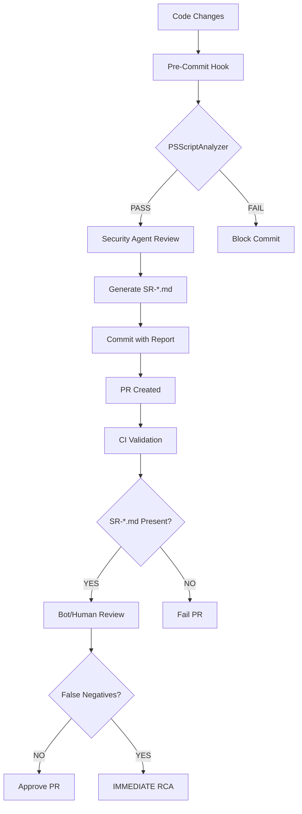

# Security Review Protocol

> **Status**: Canonical Source of Truth for security review process

## Purpose

Defines the security review workflow, false negative handling, and immediate feedback loop for security agent capability improvements.

## Security Review Workflow

### Standard Review Process



### Immediate Feedback Loop (CRITICAL)

**TRIGGER**: Bot or human reviewer identifying security false negative

**BLOCKING**: PR remains blocked until agent updated and re-review passes

**Timeline**: IMMEDIATE (not monthly batch)

**Process**:

1. **Detection**: External reviewer (Gemini, manual pentester) identifies vulnerability missed by security agent
2. **RCA Execution**: Run `Invoke-SecurityRetrospective.ps1 -PRNumber <PR> -ExternalReviewSource <Source>`
3. **Memory Storage**: False negative stored in BOTH Forgetful (semantic) and Serena (project) memory
4. **Prompt Update**: Update `src/claude/security.md` IMMEDIATELY with new detection pattern
5. **Benchmark Update**: Add new test case to `.agents/security/benchmarks/`
6. **Agent Re-test**: Validate agent now detects the vulnerability class
7. **PR Re-review**: Security agent reviews PR again with updated capabilities
8. **Merge Decision**: PR can merge only after clean re-review

## False Negative Severity

| Severity | Response Time | Escalation |
|----------|---------------|------------|
| **CRITICAL** | Immediate (same day) | Block all security reviews until fixed |
| **HIGH** | 24 hours | Block similar PRs (same file type/pattern) |
| **MEDIUM** | 1 week | Add to agent improvement backlog |
| **LOW** | 1 month | Document in lessons learned |

**Example**: CWE-22 path traversal missed in PR #752 = CRITICAL → immediate agent update required

## Memory Storage Requirements

All false negatives MUST be stored in BOTH memory systems:

### Forgetful Memory (Semantic Search)

**Purpose**: Enable pattern analysis and semantic queries like "find all PowerShell false negatives"

**Storage Format**:

```json
{
  "content": "Security false negative: CWE-22 path traversal in Export-ClaudeMemMemories.ps1:105",
  "importance": 10,
  "tags": ["false-negative", "security-agent", "cwe-22", "powershell"],
  "keywords": ["CWE-22", "path traversal", "Export-ClaudeMemMemories.ps1"]
}
```

**Error Handling**: If Forgetful unavailable, write to `.agents/security/false-negatives.json` (graceful degradation)

### Serena Memory (Project Context)

**Purpose**: Canonical audit trail and RCA documentation

**Storage Format**: `.serena/memories/security-false-negative-cwe-{id}-pr{number}.md`

**Error Handling**: If Serena unavailable, FAIL script (BLOCKING) - no partial memory storage allowed

## Worked Examples from PR #752

### Example 1: CWE-22 Path Traversal - False Negative

**What Security Agent Found**: LOW-001 - Path traversal risk in Import-ClaudeMemMemories.ps1 (symlink check)

**What Security Agent Missed**: CRITICAL - Path traversal in Export-ClaudeMemMemories.ps1:105 (`StartsWith` without normalization)

**Vulnerable Code**:

```powershell
# Export-ClaudeMemMemories.ps1:105
if (-not $OutputFile.StartsWith($MemoriesDir)) {
    Write-Warning "Output file should be in $MemoriesDir"
}
# WARNING ONLY - allows path traversal via .. sequences
```

**Why Missed**:

1. **Detection Gap**: Agent checked Import script but not Export script
2. **Pattern Recognition**: Agent did not recognize `StartsWith` without `GetFullPath()` as vulnerability
3. **Severity Miscalibration**: Flagged similar pattern as LOW in wrong file, missed CRITICAL in correct file

**How Checklist Prevents Recurrence**:

From PowerShell Security Checklist (M2):

```markdown
### Path Traversal Prevention (CWE-22)

- [ ] Use `[System.IO.Path]::GetFullPath()` to normalize paths before validation
- [ ] Never trust `StartsWith()` for path containment checks without normalization
- [ ] Validate resolved path is within allowed directory AFTER normalization
```

**RCA Actions Taken**:

1. ✅ Added CWE-22 to security.md CWE list (M1)
2. ✅ Added PowerShell path traversal checklist with `GetFullPath()` example (M2)
3. ✅ Created severity calibration criteria showing CWE-22 = CRITICAL (M3)
4. ✅ Added benchmark test case: `.agents/security/benchmarks/cwe-22-path-traversal.ps1` (M5)

---

### Example 2: CWE-77 Command Injection - False Negative

**What Security Agent Found**: MEDIUM-002 - Command injection via Query parameter validation

**What Security Agent Missed**: CRITICAL - Unquoted variables in external command at line 115

**Vulnerable Code**:

```powershell
# Export-ClaudeMemMemories.ps1:115
npx tsx $PluginScript $Query $OutputFile
# Unquoted variables allow shell metacharacter injection
```

**Why Missed**:

1. **Detection Gap**: Agent focused on parameter validation, not variable quoting
2. **Pattern Recognition**: Agent did not identify unquoted variables as command injection vector
3. **Severity Miscalibration**: Rated as MEDIUM instead of CRITICAL

**How Checklist Prevents Recurrence**:

From PowerShell Security Checklist (M2):

```markdown
### Command Injection Prevention (CWE-77, CWE-78)

- [ ] All variables in external commands are quoted (`"$Variable"` not `$Variable`)
- [ ] Check for unquoted variables in: `npx`, `node`, `python`, `git`, `gh`, `pwsh`, `bash`
```

**RCA Actions Taken**:

1. ✅ Added CWE-77 to security.md CWE list (M1)
2. ✅ Added PowerShell command injection checklist with quoting examples (M2)
3. ✅ Created severity calibration showing CWE-77 = CRITICAL (M3)
4. ✅ Added benchmark test case: `.agents/security/benchmarks/cwe-77-command-injection.ps1` (M5)

---

### Example 3: False Positive - Symlink Check Correctly Flagged

**What Security Agent Found**: LOW-001 - Path traversal risk via symlinks in Import script

**What External Review Said**: Not a vulnerability - symlink check is appropriate defense-in-depth

**Vulnerable Code**:

```powershell
# Import-ClaudeMemMemories.ps1:85
if ($item.Attributes -band [IO.FileAttributes]::ReparsePoint) {
    Write-Warning "Skipping symlink: $($item.Name)"
    continue
}
```

**Why This is NOT a False Negative**:

- Security agent correctly identified potential TOCTOU race condition with symlinks
- External review confirmed this is defense-in-depth (good practice), not vulnerability
- Severity appropriately rated as LOW (informational finding)

**Documentation**: When security agent flags non-vulnerability, document acceptance:

```markdown
## False Positive Acceptance

**Finding**: LOW-001 - Symlink check flagged as TOCTOU risk

**Justification**: Symlink check is defense-in-depth measure, not vulnerability.
Local CLI environment has limited TOCTOU exploitation risk.

**Action**: Accept finding as informational. No code change required.

**Reviewer**: [Name]
**Date**: [YYYY-MM-DD]
```

## Pre-Commit Hook Integration

**File**: `.githooks/pre-commit`

**Requirements**:

1. Run PSScriptAnalyzer on staged PowerShell files
2. Fail commit on CRITICAL or HIGH findings
3. Run security agent review on PowerShell files
4. Generate SR-{branch}-{timestamp}.md report
5. Stage security report for commit
6. Validate report exists and is non-empty

**Bypass Mechanism**:

- `git commit --no-verify` bypasses hook but triggers CI failure
- Manual bypass requires PR comment + `security-team-approved` label

## CI Validation

**File**: `.github/workflows/security-report-validator.yml`

**Requirements**:

1. Verify SR-*.md file present in PR
2. Fail PR if security report missing or empty
3. Post PR comment with actionable error message

**Error Message Template**:

```markdown
Security report missing or empty. Run pre-commit hook locally:

\`\`\`bash
git commit --no-verify  # ← This bypassed security validation
\`\`\`

Re-run security review:

\`\`\`bash
pwsh scripts/security/Invoke-PreCommitSecurityCheck.ps1
git add .agents/security/SR-*.md
git commit --amend --no-edit
\`\`\`
```

## Critical File Patterns

Security review REQUIRED for any changes to:

| Pattern | Rationale | Example |
|---------|-----------|---------|
| `**/Auth/**` | Authentication code | Login flows, OAuth handlers |
| `**/Security/**` | Security-specific code | Encryption, credential management |
| `*.env*` | Environment configuration | `.env`, `.env.local` |
| `.githooks/*` | Pre-commit security gates | Hook bypass could disable security |
| `**/secrets/**` | Secret storage paths | API keys, certificates |
| `*password*` | Password handling | Password hashing, validation |
| `**/token*` | Token generation/validation | JWT, OAuth tokens |
| `**/oauth/**` | OAuth flows | Authorization code, token exchange |
| `**/jwt/**` | JWT handling | Token signing, verification |

**Rationale**: These paths have CRITICAL security impact. Second-pass review required.

## Agent Capability Testing

**Benchmark Suite**: `.agents/security/benchmarks/`

**Purpose**: Validate security agent detection capabilities across CWE categories

**Requirements**:

- Minimum 10 test cases covering CWE-22, CWE-77, CWE-78, CWE-89, CWE-94
- Each test case has `# VULNERABLE:` and `# EXPECTED:` annotations
- Based on real-world vulnerabilities (PR #752, production incidents)
- Run before major agent prompt changes

**Execution**:

```bash
# Run security agent on benchmark suite
pwsh scripts/security/Test-SecurityAgentCapabilities.ps1

# Expected output:
# [PASS] CWE-22: Path traversal detected (5/5 test cases)
# [PASS] CWE-77: Command injection detected (5/5 test cases)
# [FAIL] CWE-94: Code injection missed (2/5 test cases) ← Indicates gap
```

## Maintenance

This protocol should be updated when:

- New vulnerability classes discovered in production
- Agent prompt structure changes significantly
- Memory storage systems updated (Forgetful, Serena)
- Pre-commit hook requirements change
- CI validation logic modified

**Last Updated**: 2026-01-15
**Canonical Source**: `.agents/governance/SECURITY-REVIEW-PROTOCOL.md`
**Related**: `.agents/governance/SECURITY-SEVERITY-CRITERIA.md`, `src/claude/security.md`
