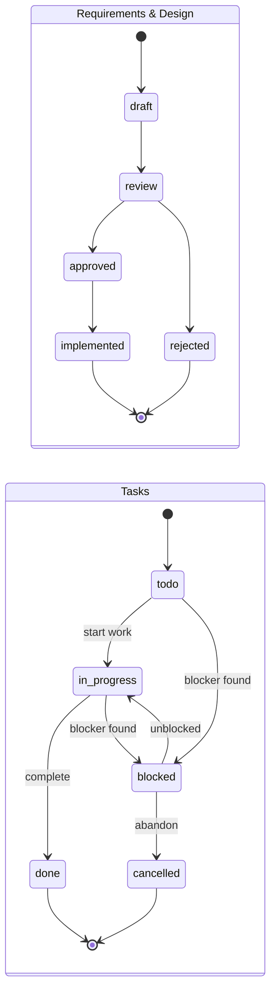
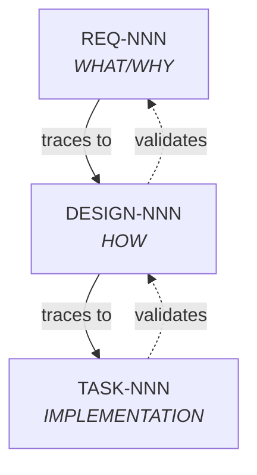

# Specification YAML Schema Definitions

> **Version**: 1.0.0
> **Created**: 2025-12-30
> **Status**: Active
> **References**: [ears-format.md](./ears-format.md), [enhancement-PROJECT-PLAN.md](../planning/enhancement-PROJECT-PLAN.md)

## Overview

This document defines the YAML front matter schemas for the 3-tier specification layer: Requirements, Design, and Tasks. These schemas enable automated validation and ensure consistency across specification documents.

## Common Fields

All spec types share these common fields:

| Field | Type | Required | Description |
|-------|------|----------|-------------|
| `type` | enum | Yes | Document type (`requirement`, `design`, `task`) |
| `id` | string | Yes | Unique identifier (pattern-specific) |
| `status` | enum | Yes | Lifecycle status |
| `priority` | enum | Yes | P0 (critical), P1 (high), P2 (normal) |
| `created` | date | Yes | Creation date (YYYY-MM-DD) |
| `updated` | date | Yes | Last update date (YYYY-MM-DD) |
| `related` | array | No | Links to related artifacts |
| `author` | string | No | Creator (agent name or human) |
| `tags` | array | No | Categorization tags |

### Status Values

| Type | Valid Statuses | Terminal States |
|------|----------------|-----------------|
| requirement | `draft`, `review`, `approved`, `implemented`, `rejected` | `implemented`, `rejected` |
| design | `draft`, `review`, `approved`, `implemented`, `rejected` | `implemented`, `rejected` |
| task | `todo`, `in-progress`, `blocked`, `done`, `cancelled` | `done`, `cancelled` |

### Status Transitions



---

## Requirement Schema (S-003)

**File Pattern**: `REQ-NNN-[kebab-case-name].md`
**Location**: `.agents/specs/requirements/`

### YAML Front Matter

```yaml
---
type: requirement
id: REQ-001
title: Short descriptive title
status: draft | review | approved | implemented | rejected
priority: P0 | P1 | P2
category: functional | non-functional | constraint
epic: EPIC-NNN           # Optional: parent epic
related:
  - REQ-000              # Parent requirements
  - DESIGN-001           # Forward traces (added when design created)
created: 2025-12-30
updated: 2025-12-30
author: spec-generator
tags:
  - authentication
  - security
---
```

### Field Definitions

| Field | Type | Required | Validation |
|-------|------|----------|------------|
| `type` | string | Yes | Must be `requirement` |
| `id` | string | Yes | Pattern: `REQ-\d{3}` |
| `title` | string | Yes | Max 80 characters |
| `status` | enum | Yes | See status values |
| `priority` | enum | Yes | `P0`, `P1`, `P2` |
| `category` | enum | Yes | `functional`, `non-functional`, `constraint` |
| `epic` | string | No | Pattern: `EPIC-\d{3}` |
| `related` | array | No | Valid artifact IDs |
| `created` | date | Yes | ISO 8601 date |
| `updated` | date | Yes | ISO 8601 date, >= created |
| `author` | string | No | Agent or human name |
| `tags` | array | No | Lowercase kebab-case strings |

### Category Definitions

| Category | Description | Example |
|----------|-------------|---------|
| `functional` | What the system does | "User can log in" |
| `non-functional` | Quality attributes | "Response time < 200ms" |
| `constraint` | Mandated conditions | "Must use PowerShell only" |

### Validation Rules

1. **ID Uniqueness**: No duplicate `REQ-NNN` across all requirement files
2. **EARS Compliance**: Body must contain EARS-format requirement statement
3. **Testability**: Must have acceptance criteria section
4. **Category Match**: Category should match requirement type

### Example

```yaml
---
type: requirement
id: REQ-001
title: Session State Persistence
status: approved
priority: P0
category: functional
related:
  - ADR-011
created: 2025-12-30
updated: 2025-12-30
author: spec-generator
tags:
  - session
  - persistence
---

# REQ-001: Session State Persistence

## Requirement Statement

WHEN a session phase transition occurs
THE SYSTEM SHALL persist the new state to Serena memory within 1 second
SO THAT session state survives MCP restarts and can be recovered

## Acceptance Criteria

- [ ] State persisted within 1 second of transition
- [ ] State recoverable after MCP restart
- [ ] Graceful fallback if Serena unavailable
```

---

## Design Schema (S-004)

**File Pattern**: `DESIGN-NNN-[kebab-case-name].md`
**Location**: `.agents/specs/design/`

### YAML Front Matter

```yaml
---
type: design
id: DESIGN-001
title: Short descriptive title
status: draft | review | approved | implemented | rejected
priority: P0 | P1 | P2
related:
  - REQ-001              # Required: traces back to requirements
  - REQ-002
  - TASK-001             # Forward traces (added when tasks created)
adr: ADR-011             # Optional: related ADR
created: 2025-12-30
updated: 2025-12-30
author: architect
tags:
  - mcp
  - state-machine
---
```

### Field Definitions

| Field | Type | Required | Validation |
|-------|------|----------|------------|
| `type` | string | Yes | Must be `design` |
| `id` | string | Yes | Pattern: `DESIGN-\d{3}` |
| `title` | string | Yes | Max 80 characters |
| `status` | enum | Yes | See status values |
| `priority` | enum | Yes | `P0`, `P1`, `P2` |
| `related` | array | **Yes** | Must include at least one `REQ-NNN` |
| `adr` | string | No | Pattern: `ADR-\d{3}` |
| `created` | date | Yes | ISO 8601 date |
| `updated` | date | Yes | ISO 8601 date, >= created |
| `author` | string | No | Agent or human name |
| `tags` | array | No | Lowercase kebab-case strings |

### Validation Rules

1. **ID Uniqueness**: No duplicate `DESIGN-NNN` across all design files
2. **Requirement Coverage**: `related` must include at least one valid `REQ-NNN`
3. **No Orphans**: Referenced requirements must exist
4. **Completeness**: Must have Design Overview, Component Details sections

### Required Sections

| Section | Purpose |
|---------|---------|
| Requirements Addressed | List of REQ-NNN with brief descriptions |
| Design Overview | High-level approach |
| Component Details | Detailed component descriptions |
| Technology Decisions | Key technology choices with rationale |
| Security Considerations | Security-relevant aspects |
| Testing Strategy | How design will be validated |

### Example

```yaml
---
type: design
id: DESIGN-001
title: Session State Machine Architecture
status: approved
priority: P0
related:
  - REQ-001
  - REQ-002
adr: ADR-011
created: 2025-12-30
updated: 2025-12-30
author: architect
tags:
  - session
  - state-machine
---

# DESIGN-001: Session State Machine Architecture

## Requirements Addressed

- REQ-001: Session state persistence
- REQ-002: Phase transition validation

## Design Overview

Implement a finite state machine tracking session phases...
```

---

## Task Schema (S-005)

**File Pattern**: `TASK-NNN-[kebab-case-name].md`
**Location**: `.agents/specs/tasks/`

### YAML Front Matter

```yaml
---
type: task
id: TASK-001
title: Short descriptive title
status: todo | in-progress | blocked | done | cancelled
priority: P0 | P1 | P2
complexity: XS | S | M | L | XL
estimate: 4h              # Hours or story points
related:
  - DESIGN-001           # Required: traces back to design
blocked_by:              # Optional: blocking tasks
  - TASK-000
blocks:                  # Optional: tasks this blocks
  - TASK-002
assignee: implementer    # Optional: assigned agent/person
created: 2025-12-30
updated: 2025-12-30
author: task-generator
tags:
  - mcp
  - typescript
---
```

### Field Definitions

| Field | Type | Required | Validation |
|-------|------|----------|------------|
| `type` | string | Yes | Must be `task` |
| `id` | string | Yes | Pattern: `TASK-\d{3}` |
| `title` | string | Yes | Max 80 characters |
| `status` | enum | Yes | `todo`, `in-progress`, `blocked`, `done`, `cancelled` |
| `priority` | enum | Yes | `P0`, `P1`, `P2` |
| `complexity` | enum | Yes | `XS`, `S`, `M`, `L`, `XL` |
| `estimate` | string | No | Hours (e.g., `4h`) or points (e.g., `5`) |
| `related` | array | **Yes** | Must include at least one `DESIGN-NNN` |
| `blocked_by` | array | No | Valid `TASK-NNN` IDs |
| `blocks` | array | No | Valid `TASK-NNN` IDs |
| `assignee` | string | No | Agent name or human |
| `created` | date | Yes | ISO 8601 date |
| `updated` | date | Yes | ISO 8601 date, >= created |
| `author` | string | No | Agent or human name |
| `tags` | array | No | Lowercase kebab-case strings |

### Complexity Definitions

| Size | Hours | Points | Description |
|------|-------|--------|-------------|
| `XS` | 1-2 | 1 | Trivial change, minimal risk |
| `S` | 2-4 | 2-3 | Simple change, well-understood |
| `M` | 4-8 | 5 | Moderate complexity, some unknowns |
| `L` | 8-16 | 8 | Complex change, multiple files |
| `XL` | 16+ | 13 | Very complex, consider splitting |

### Validation Rules

1. **ID Uniqueness**: No duplicate `TASK-NNN` across all task files
2. **Design Coverage**: `related` must include at least one valid `DESIGN-NNN`
3. **No Orphans**: Referenced designs must exist
4. **Atomicity**: Tasks should be completable in one session
5. **XL Warning**: XL tasks flagged for potential splitting
6. **Cycle Detection**: `blocked_by`/`blocks` must not create cycles

### Required Sections

| Section | Purpose |
|---------|---------|
| Design Context | Link to parent design with description |
| Objective | What this task accomplishes |
| Scope | In-scope and out-of-scope items |
| Acceptance Criteria | Testable completion criteria |
| Files Affected | New/modify/delete file list |

### Example

```yaml
---
type: task
id: TASK-001
title: Create MCP TypeScript Scaffold
status: todo
priority: P0
complexity: S
estimate: 2h
related:
  - DESIGN-001
blocks:
  - TASK-002
  - TASK-003
assignee: implementer
created: 2025-12-30
updated: 2025-12-30
author: task-generator
tags:
  - mcp
  - typescript
  - scaffold
---

# TASK-001: Create MCP TypeScript Scaffold

## Design Context

- DESIGN-001: Session State Machine Architecture

## Objective

Initialize the Session State MCP project structure...
```

---

## Traceability Matrix

The spec layer enforces a complete traceability chain:



### Validation Rules

| Rule | Description |
|------|-------------|
| **No Orphan Requirements** | Every REQ must have at least one DESIGN |
| **No Orphan Designs** | Every DESIGN must have at least one TASK |
| **Backward Traceability** | Every TASK must trace to DESIGN, DESIGN to REQ |
| **Status Consistency** | Child cannot be `done` if parent is `draft` |

### Cross-Reference Format

In `related` arrays, use the full artifact ID:

```yaml
related:
  - REQ-001        # Requirement
  - DESIGN-001     # Design
  - TASK-001       # Task
  - ADR-011        # Architecture Decision Record
  - EPIC-001       # Epic (from roadmap)
```

---

## Validation Script Interface

The `Validate-SpecSchemas.ps1` script (Phase 2) will validate:

```powershell
# Validate single file
Validate-SpecSchemas.ps1 -Path ".agents/specs/requirements/REQ-001-session-persistence.md"

# Validate all specs
Validate-SpecSchemas.ps1 -All

# Validate traceability
Validate-SpecSchemas.ps1 -Traceability

# Output
# ✓ REQ-001: Valid
# ✗ DESIGN-002: Missing required field 'related'
# ✗ TASK-003: References non-existent DESIGN-999
# ⚠ TASK-004: XL complexity - consider splitting
```

---

## References

- [EARS Format](./ears-format.md) - Requirement syntax
- [Naming Conventions](./naming-conventions.md) - File naming patterns
- [Consistency Protocol](./consistency-protocol.md) - Validation rules
- [Spec Layer README](../specs/README.md) - Overview
- [enhancement-PROJECT-PLAN.md](../planning/enhancement-PROJECT-PLAN.md) - Phase 1 tasks
