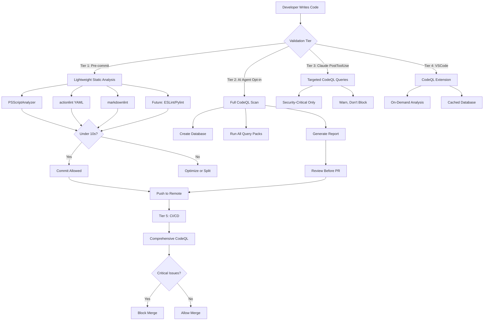

# CodeQL CLI Integration: Multi-Tier Security Analysis Strategy

# CodeQL CLI Integration Specification

## Executive Summary

This specification defines the integration of CodeQL CLI into the rjmurillo/ai-agents development workflow to shift security analysis left and reduce PR review cycles. The solution implements a **multi-tier validation strategy** that balances performance requirements (under 10 seconds for pre-commit) with comprehensive security analysis capabilities.

**Primary Goal**: Reduce PR review back-and-forth by catching security and code quality issues early in the development cycle.

**Performance Constraint**: Pre-commit hooks must complete in under 10 seconds, requiring lightweight tools for automatic validation and full CodeQL as an opt-in capability.

## Current State Analysis

### Repository Characteristics

**Languages Currently in Use**:

- PowerShell (.ps1, .psm1) - Primary scripting language
- GitHub Actions YAML - CI/CD workflows
- Markdown - Documentation

**Languages to Support (Future-Ready)**:

- TypeScript/JavaScript - When added to the repository
- Python - When added to the repository

**Existing Infrastructure**:

- Sophisticated pre-commit hook (file:.githooks/pre-commit) with 1578 lines of validation logic
- PSScriptAnalyzer integration for PowerShell
- Markdown linting with markdownlint-cli2
- Pester test gate
- GitHub Actions workflows for CI/CD
- Claude Code PostToolUse hooks for file validation
- Installation infrastructure (file:scripts/lib/Install-Common.psm1)

**Gaps Identified**:

- No CodeQL workflow or configuration
- No VSCode configuration directory
- No TypeScript/Python linting tools (not needed yet)
- No actionlint for GitHub Actions YAML validation

## Architecture Overview

### Multi-Tier Validation Strategy



### Configuration Consistency Principle

**Critical Requirement**: All tiers must use the **same CodeQL configuration file** to ensure consistent findings across environments.

**Configuration File Location**: .github/codeql/codeql-config.yml

**Shared By**:

- Local CodeQL CLI (AI agent scans)
- GitHub Actions CodeQL workflow
- VSCode CodeQL extension
- Claude Code PostToolUse hooks

## Tier 1: Pre-commit Hooks (Automatic, Fast)

### Objective

Provide fast feedback (under 10 seconds) using lightweight static analysis tools that catch common issues without the overhead of full CodeQL database creation.

### Implementation Strategy

**Extend Existing Pre-commit Hook** (file:.githooks/pre-commit):

The existing hook already has:

- Markdown linting (lines 104-243)
- PSScriptAnalyzer validation (lines 244-341)
- Security detection (lines 617-706)
- Bash enforcement (lines 617-706)

**New Additions**:

1. **actionlint for GitHub Actions YAML** (new section after line 341)
  - Validates workflow syntax
  - Checks for common mistakes
  - Validates action references
  - Non-blocking warnings for style issues
2. **Future: ESLint for TypeScript/JavaScript** (when files exist)
  - TypeScript compiler checks
  - ESLint rules
  - Import validation
3. **Future: Ruff/Pylint for Python** (when files exist)
  - Syntax validation
  - Import checks
  - Security patterns (bandit rules)

### Performance Budget


| Tool              | Target Time      | Current Status    |
| ----------------- | ---------------- | ----------------- |
| PSScriptAnalyzer  | 2-3 seconds      | ✅ Implemented     |
| markdownlint-cli2 | 1-2 seconds      | ✅ Implemented     |
| actionlint        | 1-2 seconds      | ⚠️ To be added    |
| ESLint (future)   | 2-3 seconds      | 📋 Planned        |
| Ruff (future)     | 1-2 seconds      | 📋 Planned        |
| **Total**         | **7-12 seconds** | **Within budget** |


### Integration Points

**Hook Location**: file:.githooks/pre-commit

**Installation**: Automatic via git config (already configured)

**Bypass Mechanism**: `git commit --no-verify` (discouraged, logged)

**Auto-fix Capability**: 

- Markdown: Yes (markdownlint-cli2 --fix)
- PowerShell: No (manual fixes required)
- YAML: No (manual fixes required)

## Tier 2: AI Agent Full CodeQL Scan (Opt-in, Comprehensive)

### Objective

Enable AI agents (Claude Code, GitHub Copilot, etc.) to run comprehensive CodeQL analysis before creating a PR, catching issues that would cause review back-and-forth.

### Implementation Strategy

**1. CodeQL CLI Installation Script**

**File**: scripts/Install-CodeQL.ps1

**Responsibilities**:

- Download CodeQL CLI bundle for the platform (Windows/Linux)
- Extract to `.tools/codeql/` directory (gitignored)
- Add to PATH for current session
- Verify installation with `codeql --version`
- Download CodeQL query packs for supported languages

**Cross-Platform Support**:

```powershell
# Detect platform
$IsWindows = $PSVersionTable.PSVersion.Major -ge 6 -and $IsWindows
$IsLinux = $PSVersionTable.PSVersion.Major -ge 6 -and $IsLinux

# Download appropriate bundle
$BundleUrl = if ($IsWindows) {
    "https://github.com/github/codeql-action/releases/latest/download/codeql-bundle-win64.tar.gz"
} else {
    "https://github.com/github/codeql-action/releases/latest/download/codeql-bundle-linux64.tar.gz"
}
```

**2. CodeQL Configuration File**

**File**: .github/codeql/codeql-config.yml

**Purpose**: Single source of truth for CodeQL analysis across all environments

**Structure**:

```yaml
name: "CodeQL Config for rjmurillo/ai-agents"

# Disable default queries to use only specified packs
disable-default-queries: false

# Query packs to run
packs:
  # PowerShell (when available)
  - codeql/powershell-queries
  
  # GitHub Actions
  - codeql/actions-queries
  
  # TypeScript/JavaScript (future)
  - codeql/javascript-queries:security-extended
  
  # Python (future)
  - codeql/python-queries:security-extended

# Paths to exclude from analysis
paths-ignore:
  - '**/test/**'
  - '**/tests/**'
  - '**/*.Tests.ps1'
  - '.agents/**'
  - 'artifacts/**'
  - 'node_modules/**'
  - '.venv/**'

# Paths to include (override excludes)
paths:
  - 'scripts/**'
  - 'build/**'
  - '.github/scripts/**'
  - '.github/workflows/**'
  - '.claude/skills/**'
  - 'src/**'
```

**3. Full Scan Script**

**File**: scripts/Invoke-CodeQLScan.ps1

**Usage**:

```powershell
# Full scan (all languages)
pwsh scripts/Invoke-CodeQLScan.ps1

# Specific language
pwsh scripts/Invoke-CodeQLScan.ps1 -Language powershell

# Staged files only (faster)
pwsh scripts/Invoke-CodeQLScan.ps1 -StagedOnly

# With SARIF output for VSCode
pwsh scripts/Invoke-CodeQLScan.ps1 -OutputFormat sarif
```

**Workflow**:

1. Check if CodeQL CLI is installed (call Install-CodeQL.ps1 if not)
2. Detect languages in repository (or use -Language parameter)
3. Create CodeQL database for each language
4. Run queries from configuration file
5. Generate report (markdown + SARIF)
6. Display results with severity highlighting
7. Exit with non-zero code if critical issues found

**Performance Characteristics**:

- Database creation: 30-120 seconds (depends on codebase size)
- Query execution: 10-60 seconds (depends on query packs)
- Total time: 1-3 minutes (acceptable for opt-in pre-PR scan)

**4. Claude Code Skill Integration**

**File**: .claude/skills/codeql-scan/SKILL.md

**Slash Command**: `/codeql-scan`

**Purpose**: Allow AI agents to invoke full CodeQL scan with natural language

**Example Usage**:

```
/codeql-scan
/codeql-scan powershell
/codeql-scan --staged-only
```

**Skill Script**: .claude/skills/codeql-scan/scripts/Invoke-CodeQLScanSkill.ps1

**Integration with Agent Workflow**:

- Implementer agent can invoke before creating PR
- QA agent can invoke as part of validation
- Orchestrator can suggest when security-sensitive changes detected

## Tier 3: Claude Code PostToolUse Hook (Automatic, Warn-only)

### Objective

Provide immediate feedback after file writes by running targeted CodeQL queries on changed files, without blocking the workflow.

### Implementation Strategy

**File**: .claude/hooks/PostToolUse/Invoke-CodeQLQuickScan.ps1

**Pattern**: Follow existing PostToolUse hook pattern (see file:.claude/hooks/PostToolUse/Invoke-MarkdownAutoLint.ps1)

**Workflow**:

1. Read JSON from stdin (hook input)
2. Extract file path from `tool_input.file_path`
3. Detect file language (PowerShell, YAML, TypeScript, Python)
4. Run targeted CodeQL queries (security-critical only)
5. Display warnings if issues found
6. Always exit 0 (non-blocking)

**Query Selection Strategy**:


| Language       | Queries to Run                          | Rationale              |
| -------------- | --------------------------------------- | ---------------------- |
| PowerShell     | Command injection, path traversal       | High-risk patterns     |
| YAML (Actions) | Script injection, secret exposure       | CI/CD security         |
| TypeScript     | XSS, SQL injection, prototype pollution | Web security           |
| Python         | Command injection, SQL injection        | Common vulnerabilities |


**Performance Optimization**:

- Use incremental database updates (if available)
- Cache database between scans
- Run only 5-10 critical queries (not full suite)
- Timeout after 30 seconds
- Skip if CodeQL CLI not installed (graceful degradation)

**Output Format**:

```
**CodeQL Quick Scan**: Found 2 potential issues in `scripts/Deploy.ps1`

⚠️ WARNING: Potential command injection at line 42
   Consider using -ArgumentList instead of string concatenation

⚠️ WARNING: Path traversal risk at line 67
   Validate user input before using in file paths

Run full scan: `pwsh scripts/Invoke-CodeQLScan.ps1 scripts/Deploy.ps1`
```

## Tier 4: VSCode Integration (Active, On-Demand)

### Objective

Provide IDE-integrated CodeQL analysis with on-demand execution and cached results.

### Implementation Strategy

**1. VSCode Extension Recommendations**

**File**: .vscode/extensions.json (to be created)

```json
{
  "recommendations": [
    "github.vscode-codeql",
    "ms-vscode.powershell",
    "github.vscode-github-actions"
  ]
}
```

**2. VSCode Tasks Configuration**

**File**: .vscode/tasks.json (to be created)

**Tasks to Define**:

1. **CodeQL: Full Scan**
  - Runs `Invoke-CodeQLScan.ps1`
  - Generates SARIF output
  - Displays results in Problems panel
2. **CodeQL: Scan Current File**
  - Runs CodeQL on active file only
  - Faster feedback for single-file changes
3. **CodeQL: Install CLI**
  - Runs `Install-CodeQL.ps1`
  - One-time setup task

**Example Task**:

```json
{
  "version": "2.0.0",
  "tasks": [
    {
      "label": "CodeQL: Full Scan",
      "type": "shell",
      "command": "pwsh",
      "args": [
        "-NoProfile",
        "-File",
        "${workspaceFolder}/scripts/Invoke-CodeQLScan.ps1",
        "-OutputFormat",
        "sarif"
      ],
      "problemMatcher": "$codeql",
      "group": {
        "kind": "test",
        "isDefault": false
      },
      "presentation": {
        "reveal": "always",
        "panel": "new"
      }
    }
  ]
}
```

**3. CodeQL Extension Configuration**

**File**: .vscode/settings.json (to be created)

```json
{
  "codeQL.cli.executablePath": "${workspaceFolder}/.tools/codeql/codeql",
  "codeQL.runningQueries.numberOfThreads": 4,
  "codeQL.runningQueries.memory": 4096,
  "codeQL.runningQueries.timeout": 300,
  "codeQL.resultsDisplay.pageSize": 100
}
```

**4. Database Management**

**Location**: `.tools/codeql-db/` (gitignored)

**Strategy**:

- Create database on first scan
- Reuse database for subsequent scans
- Invalidate database on significant changes (detected by git diff)
- Manual refresh via task: "CodeQL: Rebuild Database"

### User Experience

**First-Time Setup**:

1. Open repository in VSCode
2. VSCode prompts to install recommended extensions
3. User installs CodeQL extension
4. User runs task: "CodeQL: Install CLI"
5. User runs task: "CodeQL: Full Scan"
6. Results appear in Problems panel

**Ongoing Usage**:

1. Make code changes
2. Run task: "CodeQL: Scan Current File" (Ctrl+Shift+B)
3. Review findings in Problems panel
4. Fix issues
5. Re-run scan to verify

## Tier 5: CI/CD Integration (Automatic, Blocking)

### Objective

Run comprehensive CodeQL analysis on all PRs to catch issues before merge, using the same configuration as local tools.

### Implementation Strategy

**File**: .github/workflows/codeql-analysis.yml (to be created)

**Trigger Events**:

- `pull_request` (branches: main)
- `push` (branches: main)
- `schedule` (weekly scan of main branch)

**Workflow Structure**:

```yaml
name: CodeQL Security Analysis

on:
  pull_request:
    branches: [main]
  push:
    branches: [main]
  schedule:
    - cron: '0 6 * * 1'  # Weekly on Monday at 6 AM UTC

permissions:
  contents: read
  security-events: write
  pull-requests: write

jobs:
  analyze:
    name: Analyze (${{ matrix.language }})
    runs-on: ubuntu-24.04-arm  # ADR-032: ARM for cost optimization
    timeout-minutes: 30
    
    strategy:
      fail-fast: false
      matrix:
        language: [powershell, actions, python]
    
    steps:
      - name: Checkout repository
        uses: actions/checkout@34e114876b0b11c390a56381ad16ebd13914f8d5
      
      - name: Initialize CodeQL
        uses: github/codeql-action/init@v3
        with:
          languages: ${{ matrix.language }}
          config-file: .github/codeql/codeql-config.yml
      
      - name: Perform CodeQL Analysis
        uses: github/codeql-action/analyze@v3
        with:
          category: "/language:${{ matrix.language }}"
          output: sarif-results
          upload: true
```

**Key Features**:

1. **Matrix Strategy**: Analyze each language separately for parallelization
2. **Shared Configuration**: Uses .github/codeql/codeql-config.yml
3. **SARIF Upload**: Results uploaded to GitHub Security tab
4. **PR Comments**: Post summary of findings as PR comment
5. **Blocking**: Fail workflow if critical issues found

**Integration with Existing Workflows**:

The CodeQL workflow should be added to the required checks list in file:.github/workflows/pr-validation.yml:

```yaml
# Add to required checks
- name: Check Required Checks
  run: |
    # Existing checks...
    # Add: CodeQL Analysis
```

## Installation and Setup

### Automated Installation Script

**File**: scripts/Install-CodeQLIntegration.ps1

**Purpose**: One-command setup of entire CodeQL integration

**Usage**:

```powershell
# Full installation
pwsh scripts/Install-CodeQLIntegration.ps1

# Specific components
pwsh scripts/Install-CodeQLIntegration.ps1 -Components CLI,PreCommit,VSCode

# Dry run (show what would be installed)
pwsh scripts/Install-CodeQLIntegration.ps1 -WhatIf
```

**Installation Steps**:

1. Install CodeQL CLI (calls Install-CodeQL.ps1)
2. Create CodeQL configuration file
3. Update pre-commit hook with actionlint
4. Create VSCode configuration files
5. Create Claude Code skill and PostToolUse hook
6. Create GitHub Actions workflow
7. Update documentation
8. Run initial scan (optional)

**Verification**:

```powershell
# Verify installation
pwsh scripts/Test-CodeQLIntegration.ps1

# Expected output:
# ✅ CodeQL CLI installed: v2.15.3
# ✅ Configuration file exists: .github/codeql/codeql-config.yml
# ✅ Pre-commit hook updated
# ✅ VSCode configuration created
# ✅ Claude Code skill installed
# ✅ GitHub Actions workflow created
```

### Manual Installation Steps

For users who prefer manual setup or need to understand the process:

**1. Install CodeQL CLI**:

```bash
# Linux
wget https://github.com/github/codeql-action/releases/latest/download/codeql-bundle-linux64.tar.gz
tar -xzf codeql-bundle-linux64.tar.gz -C .tools/
export PATH="$PWD/.tools/codeql:$PATH"

# Windows (PowerShell)
Invoke-WebRequest -Uri "https://github.com/github/codeql-action/releases/latest/download/codeql-bundle-win64.tar.gz" -OutFile codeql-bundle.tar.gz
tar -xzf codeql-bundle.tar.gz -C .tools/
$env:PATH = "$PWD\.tools\codeql;$env:PATH"
```

**2. Create Configuration**:

```bash
mkdir -p .github/codeql
# Copy configuration from specification
```

**3. Update Pre-commit Hook**:

```bash
# Add actionlint section to .githooks/pre-commit
# See Tier 1 section for details
```

**4. Create VSCode Configuration**:

```bash
mkdir -p .vscode
# Create extensions.json, tasks.json, settings.json
# See Tier 4 section for details
```

**5. Create Claude Code Integration**:

```bash
mkdir -p .claude/skills/codeql-scan/scripts
mkdir -p .claude/hooks/PostToolUse
# Create skill and hook files
# See Tier 2 and Tier 3 sections for details
```

**6. Create GitHub Actions Workflow**:

```bash
# Create .github/workflows/codeql-analysis.yml
# See Tier 5 section for details
```

## Configuration Management

### Shared Configuration File

**Location**: .github/codeql/codeql-config.yml

**Versioning**: Committed to repository, tracked in git

**Update Process**:

1. Modify configuration file
2. Test locally: `pwsh scripts/Invoke-CodeQLScan.ps1`
3. Commit changes
4. CI will use updated configuration automatically

**Configuration Validation**:

**File**: scripts/Test-CodeQLConfig.ps1

**Purpose**: Validate configuration file syntax and query pack availability

**Usage**:

```powershell
pwsh scripts/Test-CodeQLConfig.ps1

# Expected output:
# ✅ Configuration file is valid YAML
# ✅ All query packs are available
# ✅ Path patterns are valid
# ⚠️ Query pack 'codeql/powershell-queries' not found (will be downloaded)
```

### Language-Specific Configuration

**PowerShell**:

- Query pack: `codeql/powershell-queries`
- Focus: Command injection, path traversal, credential exposure
- Severity threshold: Medium and above

**GitHub Actions**:

- Query pack: `codeql/actions-queries`
- Focus: Script injection, secret exposure, workflow security
- Severity threshold: Medium and above

**Python**:

- Query pack: `codeql/python-queries:security-extended`
- Focus: Command injection, SQL injection, path traversal
- Severity threshold: Medium and above

**TypeScript/JavaScript** (future):

- Query pack: `codeql/javascript-queries:security-extended`
- Focus: XSS, SQL injection, prototype pollution, CSRF
- Severity threshold: Medium and above

## Performance Optimization

### Database Caching Strategy

**Problem**: Creating CodeQL databases is slow (30-120 seconds)

**Solution**: Cache databases and reuse when possible

**Implementation**:

**Cache Location**: `.codeql/db/` (gitignored)

**Cache Invalidation Triggers**:

- Git HEAD changes (new commits)
- Configuration file changes
- Manual invalidation: `pwsh .codeql/scripts/Invoke-CodeQLScan.ps1 -RebuildDatabase`

**Cache Hit Rate Target**: 80% (most scans reuse existing database)

### Incremental Analysis

**GitHub's Incremental Analysis** (September 2025 feature):

- Analyzes only changed files
- Significantly faster than full analysis
- Designed for CI/CD workflows

**Applicability**:

- ✅ CI/CD workflows (Tier 5)
- ⚠️ Local scans (Tier 2) - requires investigation
- ❌ Pre-commit hooks (Tier 1) - too slow even with incremental

**Configuration** (when available):

```yaml
# In .github/workflows/codeql-analysis.yml
- name: Perform CodeQL Analysis
  uses: github/codeql-action/analyze@v3
  with:
    incremental: true  # Enable incremental analysis
```

### Query Optimization

**Strategy**: Run only necessary queries for each tier

**Tier 1 (Pre-commit)**: No CodeQL (too slow)

**Tier 2 (AI Agent)**: Full query suite (comprehensive)

**Tier 3 (PostToolUse)**: 5-10 critical queries only

**Tier 5 (CI/CD)**: Full query suite (comprehensive)

**Critical Queries** (for Tier 3):

- CWE-078: Command Injection
- CWE-079: Cross-Site Scripting (XSS)
- CWE-089: SQL Injection
- CWE-022: Path Traversal
- CWE-798: Hard-coded Credentials

## Error Handling and Graceful Degradation

### Failure Scenarios

**1. CodeQL CLI Not Installed**:

- **Tier 1**: Skip CodeQL checks (pre-commit still runs other tools)
- **Tier 2**: Prompt to install: `pwsh .codeql/scripts/Install-CodeQL.ps1`
- **Tier 3**: Skip PostToolUse hook (log warning)
- **Tier 4**: VSCode extension prompts to install
- **Tier 5**: CI downloads CodeQL automatically

**2. Database Creation Fails**:

- **Tier 2**: Display error, suggest checking logs
- **Tier 3**: Skip scan, log error
- **Tier 5**: Fail workflow, notify maintainers

**3. Query Execution Timeout**:

- **Tier 2**: Display partial results, suggest increasing timeout
- **Tier 3**: Skip remaining queries, display what completed
- **Tier 5**: Fail workflow if critical queries timeout

**4. Configuration File Invalid**:

- **All Tiers**: Validate configuration before running queries
- Display specific error (YAML syntax, missing query pack, etc.)
- Suggest running: `pwsh scripts/Test-CodeQLConfig.ps1`

### Logging and Diagnostics

**Log Location**: `.codeql/logs/` (gitignored)

**Log Files**:

- `codeql-scan-YYYY-MM-DD-HH-MM-SS.log` - Full scan logs
- `codeql-quick-scan-YYYY-MM-DD-HH-MM-SS.log` - PostToolUse hook logs
- `codeql-database-creation.log` - Database creation logs

**Diagnostic Command**:

```powershell
pwsh .codeql/scripts/Get-CodeQLDiagnostics.ps1

# Output:
# CodeQL CLI Version: 2.15.3
# Configuration File: Valid
# Database Status: Cached (created 2 hours ago)
# Last Scan: 30 minutes ago (0 issues found)
# Query Packs: 4 installed, 0 updates available
```

## Security Considerations

### Credential Management

**Problem**: CodeQL may need GitHub token for downloading query packs

**Solution**: Use GitHub CLI authentication (already configured)

**Implementation**:

```powershell
# In Install-CodeQL.ps1
if (-not (gh auth status 2>$null)) {
    Write-Warning "GitHub CLI not authenticated. Run: gh auth login"
    exit 1
}

# Use gh token for CodeQL
$env:GITHUB_TOKEN = gh auth token
```

### Query Pack Trust

**Problem**: Query packs are executable code

**Solution**: Only use official GitHub query packs

**Allowed Query Packs**:

- `codeql/powershell-queries` (official)
- `codeql/actions-queries` (official)
- `codeql/javascript-queries` (official)
- `codeql/python-queries` (official)

**Blocked**: Third-party query packs (unless explicitly approved)

### SARIF Output Security

**Problem**: SARIF files may contain sensitive information (file paths, code snippets)

**Solution**: 

- Add `.codeql/results/` to `.gitignore`
- Sanitize SARIF before uploading to external services
- Use GitHub's built-in SARIF upload (secure)

## Testing Strategy

### Unit Tests

**File**: tests/Install-CodeQL.Tests.ps1

**Coverage**:

- CodeQL CLI download and extraction
- Platform detection (Windows/Linux)
- PATH configuration
- Version verification

**File**: tests/Invoke-CodeQLScan.Tests.ps1

**Coverage**:

- Language detection
- Database creation
- Query execution
- Report generation
- Error handling

### Integration Tests

**File**: tests/CodeQL-Integration.Tests.ps1

**Coverage**:

- End-to-end scan workflow
- Configuration file loading
- Multi-language analysis
- SARIF output validation

### CI Testing

**Workflow**: .github/workflows/test-codeql-integration.yml

**Purpose**: Verify CodeQL integration works in CI environment

**Tests**:

1. Install CodeQL CLI
2. Create test database
3. Run sample queries
4. Validate SARIF output
5. Test configuration file

## Documentation

### User Documentation

**File**: docs/codeql-integration.md (to be created)

**Sections**:

1. Overview and Benefits
2. Installation Guide
3. Usage Examples
4. Troubleshooting
5. FAQ

### Developer Documentation

**File**: docs/codeql-architecture.md (to be created)

**Sections**:

1. Architecture Overview
2. Multi-Tier Strategy Rationale
3. Configuration Management
4. Performance Optimization
5. Extension Points

### ADR (Architecture Decision Record)

**File**: .agents/architecture/ADR-XXX-codeql-integration.md (to be created)

**Sections**:

1. Context: Why CodeQL integration is needed
2. Decision: Multi-tier strategy with shared configuration
3. Consequences: Performance trade-offs, maintenance burden
4. Alternatives Considered: Single-tier approach, third-party tools

## Rollout Plan

### Phase 1: Foundation (Week 1)

**Deliverables**:

- [ ] CodeQL CLI installation script (scripts/Install-CodeQL.ps1)
- [ ] Shared configuration file (.github/codeql/codeql-config.yml)
- [ ] Full scan script (scripts/Invoke-CodeQLScan.ps1)
- [ ] Unit tests for installation and scanning
- [ ] Documentation (installation guide)

**Success Criteria**:

- CodeQL CLI installs successfully on Windows and Linux
- Full scan completes in under 3 minutes
- Configuration file is valid and loads correctly

### Phase 2: CI/CD Integration (Week 2)

**Deliverables**:

- [ ] GitHub Actions workflow (.github/workflows/codeql-analysis.yml)
- [ ] SARIF upload to GitHub Security tab
- [ ] PR comment integration
- [ ] Required check configuration

**Success Criteria**:

- CodeQL workflow runs on all PRs
- Results appear in GitHub Security tab
- Critical issues block PR merge

### Phase 3: Local Development Tools (Week 3)

**Deliverables**:

- [ ] VSCode configuration (.vscode/extensions.json, tasks.json, settings.json)
- [ ] Claude Code skill (.claude/skills/codeql-scan/)
- [ ] Pre-commit hook updates (actionlint integration)
- [ ] Documentation (usage guide)

**Success Criteria**:

- VSCode tasks run successfully
- Claude Code skill invokes full scan
- Pre-commit hook completes in under 10 seconds

### Phase 4: Advanced Features (Week 4)

**Deliverables**:

- [ ] Claude Code PostToolUse hook (.claude/hooks/PostToolUse/Invoke-CodeQLQuickScan.ps1)
- [ ] Database caching implementation
- [ ] Performance optimization
- [ ] Comprehensive testing

**Success Criteria**:

- PostToolUse hook provides feedback within 30 seconds
- Database cache hit rate exceeds 80%
- All integration tests pass

## Maintenance and Evolution

### Query Pack Updates

**Frequency**: Monthly (automated via Dependabot)

**Process**:

1. Dependabot creates PR with query pack updates
2. CI runs CodeQL with new query packs
3. Review new findings
4. Merge if no regressions

### Configuration Updates

**Triggers**:

- New language added to repository
- New vulnerability patterns discovered
- Performance optimization opportunities

**Process**:

1. Update .github/codeql/codeql-config.yml
2. Test locally: `pwsh .codeql/scripts/Invoke-CodeQLScan.ps1`
3. Create PR with changes
4. CI validates configuration
5. Merge after review

### Metrics and Monitoring

**Key Metrics**:

- Scan duration (target: under 3 minutes for full scan)
- Database cache hit rate (target: 80%)
- False positive rate (target: under 10%)
- Issues found per scan (trend over time)
- Time to fix issues (from detection to resolution)

**Monitoring**:

- GitHub Actions workflow duration
- CodeQL CLI version
- Query pack versions
- Configuration file changes

## Success Criteria

### Quantitative Metrics

1. **Pre-commit Performance**: Under 10 seconds (95th percentile)
2. **Full Scan Performance**: Under 3 minutes (95th percentile)
3. **Database Cache Hit Rate**: Above 80%
4. **False Positive Rate**: Below 10%
5. **CI Workflow Duration**: Under 15 minutes (including CodeQL)

### Qualitative Metrics

1. **Developer Experience**: Positive feedback on speed and usefulness
2. **PR Review Efficiency**: Fewer security-related review comments
3. **Issue Detection**: Security issues caught before PR creation
4. **Configuration Consistency**: No discrepancies between local and CI findings

### Business Impact

1. **Reduced Review Cycles**: Fewer PR iterations due to security issues
2. **Faster Time to Merge**: Issues caught earlier in development
3. **Improved Security Posture**: More comprehensive security analysis
4. **Developer Productivity**: Fast feedback loops enable rapid iteration

## Risks and Mitigations

### Risk 1: Performance Degradation

**Description**: CodeQL scans slow down development workflow

**Likelihood**: Medium

**Impact**: High

**Mitigation**:

- Multi-tier strategy keeps pre-commit fast
- Database caching reduces scan time
- Incremental analysis (when available)
- Opt-in full scans (not mandatory)

### Risk 2: False Positives

**Description**: CodeQL reports issues that aren't real vulnerabilities

**Likelihood**: Medium

**Impact**: Medium

**Mitigation**:

- Tune query packs to reduce false positives
- Document common false positives
- Provide suppression mechanism
- Regular review of findings

### Risk 3: Configuration Drift

**Description**: Local and CI configurations diverge

**Likelihood**: Low

**Impact**: High

**Mitigation**:

- Single configuration file (.github/codeql/codeql-config.yml)
- Configuration validation in CI
- Documentation emphasizes shared config
- Automated tests verify consistency

### Risk 4: Maintenance Burden

**Description**: CodeQL integration requires ongoing maintenance

**Likelihood**: High

**Impact**: Medium

**Mitigation**:

- Automated query pack updates (Dependabot)
- Comprehensive documentation
- Clear ownership (DevOps team)
- Monitoring and alerting

## Appendix A: File Structure

```
rjmurillo/ai-agents/
├── .github/
│   ├── codeql/
│   │   └── codeql-config.yml          # Shared CodeQL configuration
│   └── workflows/
│       ├── codeql-analysis.yml        # CI/CD CodeQL workflow
│       └── test-codeql-integration.yml # Integration tests
├── .githooks/
│   └── pre-commit                      # Updated with actionlint
├── .vscode/
│   ├── extensions.json                 # Extension recommendations
│   ├── tasks.json                      # CodeQL tasks
│   └── settings.json                   # CodeQL extension config
├── .claude/
│   ├── skills/
│   │   └── codeql-scan/
│   │       ├── SKILL.md                # Skill definition
│   │       └── scripts/
│   │           └── Invoke-CodeQLScanSkill.ps1
│   └── hooks/
│       └── PostToolUse/
│           └── Invoke-CodeQLQuickScan.ps1
├── .codeql/                             # Gitignored
│   ├── cli/                             # CodeQL CLI installation
│   ├── db/                              # Cached databases
│   ├── results/                         # Scan results
│   └── logs/                            # Diagnostic logs
│   └── scripts/
│   |   ├── Install-CodeQL.ps1              # CLI installation
|   |   ├── Install-CodeQLIntegration.ps1   # Full integration setup
│   |   ├── Invoke-CodeQLScan.ps1           # Full scan script
│   |   ├── Get-CodeQLDiagnostics.ps1       # Diagnostic tool
│   |   ├── Test-CodeQLConfig.ps1           # Config validation
│   |   ├── Test-CodeQLIntegration.ps1      # Integration verification
│   └── tests/
│       ├── Install-CodeQL.Tests.ps1
│       ├── Invoke-CodeQLScan.Tests.ps1
│       └── CodeQL-Integration.Tests.ps1
└── docs/
    ├── codeql-integration.md           # User documentation
    └── codeql-architecture.md          # Developer documentation
```

## Appendix B: Command Reference

### Installation Commands

```powershell
# Install CodeQL CLI only
pwsh .codeql/scripts/Install-CodeQL.ps1

# Install full integration
pwsh .codeql/scripts/Install-CodeQLIntegration.ps1

# Install specific components
pwsh .codeql/scripts/Install-CodeQLIntegration.ps1 -Components CLI,PreCommit,VSCode

# Dry run
pwsh .codeql/scripts/Install-CodeQLIntegration.ps1 -WhatIf

# Verify installation
pwsh .codeql/scripts/Test-CodeQLIntegration.ps1
```

### Scanning Commands

```powershell
# Full scan (all languages)
pwsh .codeql/scripts/Invoke-CodeQLScan.ps1

# Specific language
pwsh .codeql/scripts/Invoke-CodeQLScan.ps1 -Language powershell

# Staged files only
pwsh .codeql/scripts/Invoke-CodeQLScan.ps1 -StagedOnly

# With SARIF output
pwsh .codeql/scripts/Invoke-CodeQLScan.ps1 -OutputFormat sarif

# Rebuild database
pwsh .codeql/scripts/Invoke-CodeQLScan.ps1 -RebuildDatabase
```

### Claude Code Commands

```bash
# Full scan via skill
/codeql-scan

# Specific language
/codeql-scan powershell

# Staged files only
/codeql-scan --staged-only
```

### VSCode Tasks

- **CodeQL: Full Scan** - Run comprehensive analysis
- **CodeQL: Scan Current File** - Analyze active file
- **CodeQL: Install CLI** - One-time setup
- **CodeQL: Rebuild Database** - Invalidate cache

### Diagnostic Commands

```powershell
# Get diagnostics
pwsh .codeql/scripts/Get-CodeQLDiagnostics.ps1

# Validate configuration
pwsh .codeql/scripts/Test-CodeQLConfig.ps1

# View logs
Get-Content .codeql/logs/codeql-scan-*.log -Tail 50
```

## Appendix C: Troubleshooting Guide

### Issue: CodeQL CLI Not Found

**Symptoms**: `codeql: command not found`

**Solution**:

```powershell
# Reinstall CodeQL CLI
pwsh .codeql/scripts/Install-CodeQL.ps1

# Verify installation
codeql --version

# Add to PATH manually (if needed)
$env:PATH = "$PWD\.codeql\cli;$env:PATH"
```

### Issue: Database Creation Fails

**Symptoms**: `Error: Failed to create database`

**Solution**:

```powershell
# Check logs
Get-Content .codeql/logs/codeql-database-creation.log

# Common causes:
# 1. Insufficient disk space (need 1-5 GB)
# 2. Unsupported language
# 3. Corrupted cache

# Fix: Rebuild database
pwsh .codeql/scripts/Invoke-CodeQLScan.ps1 -RebuildDatabase
```

### Issue: Scan Takes Too Long

**Symptoms**: Scan exceeds 5 minutes

**Solution**:

```powershell
# Check database cache
Test-Path .codeql/db/

# If cache exists but scan is slow:
# 1. Reduce query packs in configuration
# 2. Exclude large directories
# 3. Use -StagedOnly for faster scans

# Optimize configuration
# Edit .github/codeql/codeql-config.yml
# Add more paths to paths-ignore
```

### Issue: False Positives

**Symptoms**: CodeQL reports issues that aren't real vulnerabilities

**Solution**:

```powershell
# Suppress specific findings
# Add comment above code:
# codeql[powershell/command-injection]: False positive - input is validated

# Or update configuration to exclude query
# Edit .github/codeql/codeql-config.yml
# Add to queries-exclude
```

### Issue: Configuration Not Loading

**Symptoms**: `Error: Invalid configuration file`

**Solution**:

```powershell
# Validate configuration
pwsh .codeql/scripts/Test-CodeQLConfig.ps1

# Common issues:
# 1. YAML syntax error
# 2. Invalid query pack name
# 3. Invalid path pattern

# Fix syntax
# Use YAML validator: https://www.yamllint.com/
```

## Appendix D: Future Enhancements

### Short-Term (3-6 months)

1. **TypeScript/JavaScript Support**
  - Add ESLint to pre-commit hook
  - Configure TypeScript CodeQL queries
  - Update documentation
2. **Python Support**
  - Add Ruff to pre-commit hook
  - Configure Python CodeQL queries
  - Update documentation
3. **Custom Query Packs**
  - Create repository-specific queries
  - Focus on common patterns in codebase
  - Reduce false positives

### Medium-Term (6-12 months)

1. **Incremental Analysis**
  - Implement for local scans
  - Reduce scan time to under 1 minute
  - Improve developer experience
2. **AI-Powered Triage**
  - Use AI to prioritize findings
  - Suggest fixes automatically
  - Reduce manual review time
3. **Dashboard and Metrics**
  - Visualize security trends
  - Track time to fix
  - Monitor false positive rate

### Long-Term (12+ months)

1. **Custom Language Support**
  - Add support for domain-specific languages
  - Create custom extractors
  - Extend CodeQL capabilities
2. **Integration with Security Tools**
  - Connect to SIEM systems
  - Integrate with vulnerability management
  - Automate remediation workflows
3. **Machine Learning Enhancements**
  - Train models on repository-specific patterns
  - Improve accuracy over time
  - Reduce false positives further

---

**Document Version**: 1.0  
**Last Updated**: 2026-01-16  
**Author**: Traycer AI (Epic Mode)  
**Status**: Draft for Review