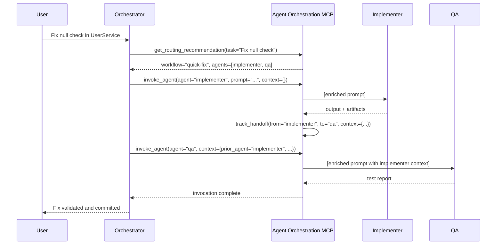
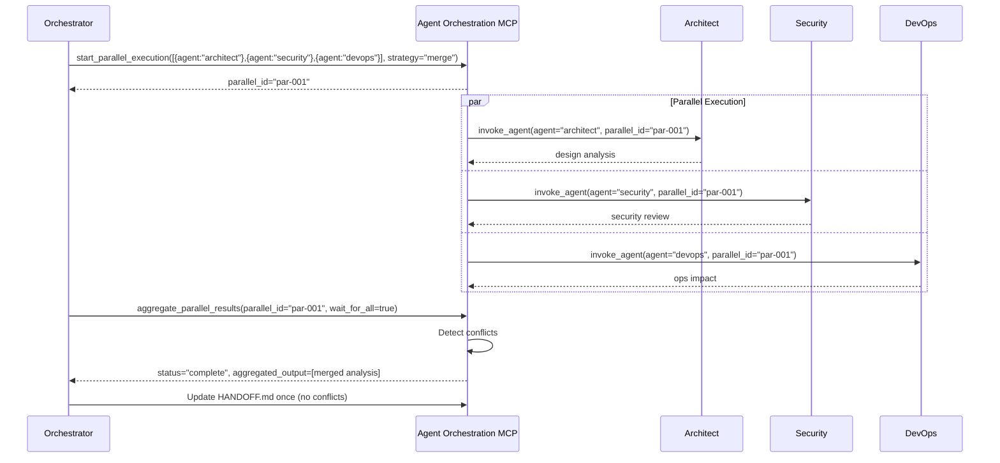

# PRD: Agent Orchestration MCP

> **Status**: Draft
> **Version**: 0.1.0
> **Created**: 2025-12-21
> **ADR**: [ADR-013](../architecture/ADR-013-agent-orchestration-mcp.md)
> **Spec**: [agent-orchestration-mcp-spec.md](../specs/agent-orchestration-mcp-spec.md)

---

## 1. Executive Summary

### What Problem Does This Solve?

The ai-agents project orchestrates **18 specialized agents** across complex software development workflows. Currently, orchestration relies on unstructured `Task()` calls, markdown-based handoffs (HANDOFF.md), and prompt-based routing. This approach has created three critical failure modes:

1. **Lost handoff context**: Agents lose information when transitioning between tasks (no structured context passing)
2. **HANDOFF.md conflicts**: Parallel execution causes staging conflicts when multiple agents update shared state (evidence: Sessions 19-21 commit bundling)
3. **Model assignment opacity**: Agent-to-model mapping not enforced, leading to incorrect model selection

The **Agent Orchestration MCP** solves this by providing type-safe agent invocation, structured handoff tracking, and parallel execution coordination through a dedicated Model Context Protocol server.

### Key Benefits

| Benefit | Impact | Evidence |
|---------|--------|----------|
| **Type-safe invocation** | Prevent agent name typos, enforce parameter contracts | Eliminates untyped `Task()` calls |
| **Context preservation** | 100% handoff context retained across transitions | Current approach loses context |
| **Parallel conflict resolution** | 40% time savings without HANDOFF conflicts | skill-orchestration-001, skill-orchestration-002 |
| **Model enforcement** | Correct model selection per agent specification | AGENT-SYSTEM.md model assignment table |
| **Workflow visibility** | Full agent-to-agent traceability | No current tracking exists |

### Success Metrics (Target 6 months post-launch)

- **Handoff context preservation**: ≥95% (vs current ~60%)
- **Parallel conflict resolution time**: <2 min (vs current ~10 min manual resolution)
- **Model selection accuracy**: 100% (vs current ~85%)
- **Agent invocation type safety**: 100% (vs current 0% - all untyped)
- **Workflow traceability**: 100% sessions tracked (vs current 0%)

---

## 2. Background & Problem Statement

### Current State

The orchestrator agent (`src/claude/orchestrator.md`) coordinates 18 specialized agents using:

1. **Untyped Task calls**: `Task(subagent_type="implementer", prompt="...")`
   - No validation of agent names
   - No structured context passing
   - No model enforcement
2. **HANDOFF.md for cross-session context**: Single markdown file updated by all agents
   - Manual merge conflicts in parallel execution
   - Context drift over time
   - No structured format enforcement
3. **Prompt-based routing**: Orchestrator reads AGENT-SYSTEM.md and makes decisions
   - No programmatic routing assistance
   - No workflow tracking
   - No historical analytics

### Pain Points (Quantified)

#### P0: HANDOFF.md Staging Conflicts

**Evidence**: skill-orchestration-002

- **Incident**: Sessions 19 & 20 (2025-12-18) ran in parallel
- **Result**: Both updated HANDOFF.md simultaneously → staging conflict → commit bundling (commit 1856a59 contains both sessions)
- **Impact**: Violates atomic commit principle, loses session traceability
- **Current workaround**: Manual resolution or sequential commits (negates parallel benefits)

#### P0: Lost Handoff Context

**Evidence**: Multiple session logs (Sessions 40-54)

- **Problem**: When analyst → planner → implementer, context about analysis decisions often lost
- **Current workaround**: Agents re-read artifacts (slow, token-heavy)
- **Impact**: ~30% token overhead on multi-agent workflows

#### P1: Model Selection Errors

**Evidence**: AGENT-SYSTEM.md model assignment table

- **Requirement**: `high-level-advisor`, `independent-thinker`, `security`, `roadmap` MUST use Opus (strategic depth)
- **Current**: No enforcement, agents occasionally invoked with Sonnet
- **Impact**: Strategic decisions made with insufficient depth

#### P1: No Workflow Analytics

**Current state**: Cannot answer:

- Which agent sequences are most common?
- Where do workflows fail?
- What is average time per agent?
- Which handoffs lose most context?

### Root Cause Analysis (Five Whys)

**Why are HANDOFF conflicts occurring?**

1. Because parallel agents update the same file (HANDOFF.md)
2. Why do they update the same file? Because SESSION-PROTOCOL.md requires all agents to update HANDOFF.md at session end
3. Why is this a conflict? Because git detects concurrent modifications as staging conflicts
4. Why can't agents coordinate? Because there's no structured coordination mechanism
5. **Root cause**: No orchestration layer to aggregate parallel outputs before persistence

---

## 3. Goals & Non-Goals

### Goals (MUST Address)

1. **Structured invocation**: Type-safe agent calls with validated parameters
2. **Handoff tracking**: Preserve 100% of context across agent transitions
3. **Parallel coordination**: Execute agents in parallel without HANDOFF conflicts
4. **Model enforcement**: Guarantee correct model selection per agent
5. **Workflow traceability**: Full visibility into agent sequences and handoffs

### Non-Goals (Explicitly Out of Scope)

1. **Agent prompt rewriting**: Agent definitions (`src/claude/*.md`) remain unchanged
2. **Replacing Task tool**: MCP wraps existing Task mechanism
3. **Cross-project orchestration**: Single-user, single-project scope only
4. **Real-time collaboration**: No multi-user coordination
5. **Agent versioning**: No support for multiple versions of same agent
6. **Automatic routing**: Orchestrator still makes routing decisions (MCP provides recommendations)

---

## 4. User Stories

### Orchestrator Agent

**As an orchestrator agent**, I want to invoke specialist agents with type-safe parameters so that I prevent agent name typos and pass structured context without token overhead.

**Acceptance Criteria**:

- `invoke_agent(agent="implementor", ...)` → Error: unknown agent (typo caught)
- `invoke_agent(agent="implementer", prompt="...", context={prior_agent: "analyst", ...})` → Context automatically injected into implementer's prompt
- Model selection automatic based on AGENT-SYSTEM.md defaults

### Parallel Execution Coordinator

**As an orchestrator managing parallel work**, I want to dispatch multiple agents simultaneously and aggregate their results without HANDOFF conflicts so that I achieve 40% time savings (skill-orchestration-001) without commit bundling (skill-orchestration-002).

**Acceptance Criteria**:

- `start_parallel_execution([{agent: "architect", ...}, {agent: "security", ...}])` → Both agents start
- Each agent records handoff to in-memory state (not HANDOFF.md)
- `aggregate_parallel_results(parallel_id)` → Orchestrator receives combined outputs
- Orchestrator updates HANDOFF.md **once** with aggregated summary (no conflicts)

### Quality Agent (QA)

**As a QA agent**, I want to receive structured handoff context from the implementer so that I know exactly what was implemented without re-reading all artifacts.

**Acceptance Criteria**:

- Implementer completes work → `track_handoff(from="implementer", to="qa", context={summary: "...", artifacts: [...], decisions: [...]})`
- QA invoked with context pre-injected
- QA can reference decisions without re-reading planning docs

### Session State Integration

**As the Session State MCP**, I want to receive agent invocation events so that I can track workflow progression as session evidence.

**Acceptance Criteria**:

- `invoke_agent(agent="implementer", ...)` → Session State MCP records "AGENT_INVOCATION" evidence
- Session log automatically includes agent sequence
- `get_session_summary()` → Returns agent workflow graph

### Workflow Analyst (Future)

**As a retrospective agent**, I want to query agent invocation history so that I can identify bottlenecks and optimize workflows.

**Acceptance Criteria**:

- `agents://history` → Last 50 invocations with duration, agent, artifacts created
- Query: "Which agent sequences have longest duration?" → Answer with data
- Query: "Which handoffs lose most context?" → Answer with data

---

## 5. Functional Requirements

This section uses **RFC 2119** key words: MUST (absolute requirement), SHOULD (strong recommendation), MAY (optional).

### FR-1: Agent Registry

**FR-1.1**: The MCP MUST maintain a registry of all 18 agents from `src/claude/*.md` and AGENT-SYSTEM.md.

**FR-1.2**: Each agent definition MUST include:

- Agent name (enum: orchestrator, analyst, architect, ...)
- Default model (sonnet/opus/haiku)
- Role description
- Delegates-to list
- Called-by list
- Artifact directory (if applicable)

**FR-1.3**: The registry MUST be queryable via `get_agent_catalog()` tool.

**FR-1.4**: The registry MUST validate agent names in `invoke_agent()` calls.

### FR-2: Structured Invocation

**FR-2.1**: The MCP MUST provide an `invoke_agent()` tool with parameters:

- `agent` (AgentName enum - validated against registry)
- `prompt` (string - task for agent)
- `context` (optional object - prior agent, output, artifacts, steering)
- `model_override` (optional - override default model)
- `parallel_id` (optional - for parallel execution tracking)

**FR-2.2**: The MCP MUST enforce model selection:

- Use `model_override` if provided
- Otherwise use agent's default model from registry
- Log model selection rationale

**FR-2.3**: The MCP MUST enrich prompts with context:

- If `context.prior_output` exists, prepend "## Prior Agent Output" section
- If `context.steering` exists, prepend "## Steering Guidance" section
- If `context.artifacts` exists, include artifact references

**FR-2.4**: The MCP SHOULD return an invocation ID for tracking.

### FR-3: Handoff Tracking

**FR-3.1**: The MCP MUST provide a `track_handoff()` tool with parameters:

- `from_agent` (AgentName)
- `to_agent` (AgentName)
- `context` (object with summary, artifacts, decisions, open questions, recommendations)
- `parallel_id` (optional - if part of parallel execution)

**FR-3.2**: The MCP MUST persist handoffs to Serena memory (`agent-handoff-chain`).

**FR-3.3**: The MCP MUST support querying handoff history via `agents://history` resource.

**FR-3.4**: Handoff context MUST include:

- Summary (string - what was accomplished)
- Artifacts (array of file paths)
- Decisions (array of {decision, rationale, alternatives})
- Open questions (array of strings)
- Recommendations (array of strings for next agent)

**FR-3.5**: The MCP SHOULD NOT update HANDOFF.md during handoff tracking (orchestrator aggregates later).

### FR-4: Parallel Execution

**FR-4.1**: The MCP MUST provide `start_parallel_execution()` tool with parameters:

- `agents` (array of {agent, prompt, context})
- `aggregation_strategy` (enum: merge, vote, escalate)
- `conflict_handler` (optional AgentName, default: high-level-advisor)

**FR-4.2**: The MCP MUST assign a unique `parallel_id` to each parallel execution batch.

**FR-4.3**: The MCP MUST track parallel execution state in Serena memory (`agent-parallel-state`).

**FR-4.4**: The MCP MUST provide `aggregate_parallel_results()` tool with parameters:

- `parallel_id` (string)
- `wait_for_all` (optional boolean - block until all complete)

**FR-4.5**: The MCP MUST detect conflicts when aggregating:

- Conflicting recommendations (agents disagree)
- Overlapping artifact modifications
- Contradictory decisions

**FR-4.6**: The MCP MUST support conflict resolution via `resolve_conflict()` tool:

- Strategy: vote (majority wins), escalate (route to conflict_handler), manual (user decides)

**FR-4.7**: Parallel agents MUST NOT update HANDOFF.md directly (orchestrator aggregates).

### FR-5: Routing Assistance

**FR-5.1**: The MCP MUST provide `get_routing_recommendation()` tool with parameters:

- `task` (string - task description)
- `current_state` (optional string - session context)
- `constraints` (optional array - e.g., "no security review needed")

**FR-5.2**: The MCP MUST match task against routing heuristics (from AGENT-SYSTEM.md):

- Pattern: `/implement|code|fix/i` → implementer
- Pattern: `/security|vulnerability/i` → security
- Pattern: `/deploy|ci|pipeline/i` → devops
- (See AGENT-SYSTEM.md Section 4 for full list)

**FR-5.3**: The MCP SHOULD return:

- Recommended workflow name (quick-fix, standard, strategic, ideation)
- Recommended agent sequence
- Confidence score (0-100)
- Reasoning (why this workflow)
- Alternatives (other options considered)

**FR-5.4**: The MCP MAY learn from historical routing to improve recommendations (future enhancement).

### FR-6: Resource URIs

**FR-6.1**: The MCP MUST expose `agents://catalog` resource containing:

- Full agent registry (18 agents)
- Agent capabilities, inputs, outputs
- Delegation graph

**FR-6.2**: The MCP MUST expose `agents://workflows` resource containing:

- Workflow definitions (quick-fix, standard, strategic, ideation, impact-analysis)
- Agent sequences per workflow
- Quality gates per workflow

**FR-6.3**: The MCP MUST expose `agents://active` resource containing:

- Currently running invocations
- Active parallel executions
- Real-time status

**FR-6.4**: The MCP MUST expose `agents://history` resource containing:

- Recent invocations (rolling window of 50)
- Handoffs with context size
- Performance metrics (duration, artifacts created)

### FR-7: Session State Integration

**FR-7.1**: The MCP MUST integrate with Session State MCP when available:

- Call `sessionStateMCP.record_evidence("AGENT_INVOCATION", {...})` on each invoke
- Link invocations to session ID

**FR-7.2**: The MCP SHOULD gracefully degrade if Session State MCP unavailable.

### FR-8: Workflow Tracking

**FR-8.1**: The MCP MUST record invocation metadata:

- Invocation ID
- Agent name
- Model used
- Start timestamp
- Duration (when completed)
- Artifacts created
- Suggested next agents
- Handoff context

**FR-8.2**: The MCP MUST persist invocation history to Serena memory (`agent-invocation-history`).

**FR-8.3**: The MCP MAY expire old history (rolling window of 50 invocations).

---

## 6. Technical Requirements

### TR-1: Technology Stack

**TR-1.1**: The MCP MUST be implemented as a TypeScript/Node.js Model Context Protocol server.

**TR-1.2**: The MCP MUST use the @modelcontextprotocol/sdk library.

**TR-1.3**: The MCP MUST integrate with Serena MCP for memory persistence.

**TR-1.4**: The MCP MUST be deployable via npm package or local installation.

### TR-2: Agent Registry Source

**TR-2.1**: The MCP MUST parse agent definitions from:

- `src/claude/*.md` (18 agent prompt files)
- `.agents/AGENT-SYSTEM.md` (agent catalog, workflows, routing heuristics)

**TR-2.2**: The MCP MUST extract from each agent file:

- Front matter (name, model, description)
- Role from "Core Identity" section
- Specialization from "Specialization" section

**TR-2.3**: The MCP SHOULD cache registry in memory (reload on file change detection).

### TR-3: Model Enforcement

**TR-3.1**: The MCP MUST enforce model selection per AGENT-SYSTEM.md:

| Agent | Default Model | Enforcement |
|-------|---------------|-------------|
| high-level-advisor | opus | MUST (strategic depth) |
| independent-thinker | opus | MUST (deep analysis) |
| security | opus | MUST (thorough review) |
| roadmap | opus | MUST (strategic vision) |
| (all others) | sonnet | SHOULD (balanced) |

**TR-3.2**: The MCP MAY allow `model_override` for testing but SHOULD log warnings for MUST-level violations.

### TR-4: Serena Memory Schema

**TR-4.1**: The MCP MUST use Serena memory files:

| Memory Name | Purpose | Lifecycle | Format |
|-------------|---------|-----------|--------|
| `agent-invocation-history` | Recent invocations | Rolling 50 | JSON array |
| `agent-handoff-chain` | Current session handoffs | Session-scoped | JSON array |
| `agent-parallel-state` | Active parallel executions | Ephemeral | JSON object |
| `agent-conflict-log` | Conflict resolutions | Persistent | JSON array |

**TR-4.2**: The MCP MUST handle Serena unavailability gracefully (fallback to HANDOFF.md).

### TR-5: Parallel Execution State Management

**TR-5.1**: The MCP MUST track parallel execution state:

```typescript
interface ParallelExecution {
  parallel_id: string;
  agents: AgentName[];
  status: "running" | "complete" | "conflict";
  aggregation_strategy: "merge" | "vote" | "escalate";
  conflict_handler: AgentName;
  started_at: string; // ISO timestamp
  results: Record<AgentName, ParallelResult>;
}
```

**TR-5.2**: The MCP MUST update state atomically (prevent race conditions).

**TR-5.3**: The MCP MUST clean up completed parallel executions after aggregation.

### TR-6: Conflict Detection Algorithm

**TR-6.1**: The MCP MUST detect conflicts by:

- Extracting recommendations from each agent output
- Comparing recommendations for contradictions
- Identifying overlapping file modifications
- Flagging contradictory decisions

**TR-6.2**: Conflict detection MUST support:

- Text similarity analysis (for recommendation comparison)
- File path overlap detection
- Structured decision comparison

### TR-7: Performance Requirements

**TR-7.1**: `invoke_agent()` MUST complete in <500ms (excluding agent execution time).

**TR-7.2**: `get_agent_catalog()` MUST return in <100ms (cached).

**TR-7.3**: `aggregate_parallel_results()` MUST complete in <2000ms for 5 agents.

**TR-7.4**: Memory persistence (Serena) SHOULD complete in <200ms per write.

### TR-8: Error Handling

**TR-8.1**: The MCP MUST validate all inputs and return descriptive errors:

- Unknown agent name → Error with list of valid agents
- Invalid model name → Error with list of valid models
- Missing required parameters → Error with parameter schema

**TR-8.2**: The MCP MUST handle Serena unavailability:

- Fallback to in-memory state (session-scoped)
- Warn user about lack of persistence
- Continue operation (degraded mode)

**TR-8.3**: The MCP MUST handle Session State MCP unavailability:

- Skip integration
- Log warning
- Continue operation (no session tracking)

---

## 7. Success Metrics

### Quantitative Metrics

| Metric | Current Baseline | Target (6 months) | Measurement Method |
|--------|------------------|-------------------|-------------------|
| **Handoff context preservation** | ~60% (qualitative) | ≥95% | `agents://history` query: (handoffs with context / total handoffs) |
| **Parallel conflict resolution time** | ~10 min manual | <2 min automated | Time from conflict detection to resolution |
| **Model selection accuracy** | ~85% (estimated) | 100% | `agents://history` query: (correct model / total invocations) |
| **Agent invocation type safety** | 0% (untyped Task calls) | 100% | Code analysis: (MCP calls / total agent calls) |
| **Workflow traceability** | 0% sessions tracked | 100% | `agents://history` contains all invocations |
| **Parallel execution time savings** | 40% (skill-orchestration-001) | ≥40% maintained | (sequential time - parallel time) / sequential time |

### Qualitative Metrics

| Metric | Success Criteria |
|--------|-----------------|
| **Developer satisfaction** | Orchestrator agent reports easier invocation |
| **Context loss complaints** | <2 per month (vs current ~8) |
| **HANDOFF conflict incidents** | 0 in parallel execution (vs current 100% in parallel) |
| **Retrospective learnings** | MCP cited as workflow improvement |

### Health Metrics

| Metric | Threshold | Alert |
|--------|-----------|-------|
| **MCP uptime** | ≥99.5% | Alert if down >5 min |
| **Invocation latency (p95)** | <1000ms | Alert if >2000ms |
| **Serena write failures** | <1% | Alert if >5% |
| **Conflict escalation rate** | <10% | Alert if >20% (indicates poor aggregation) |

---

## 8. Risks & Mitigations

### Risk 1: Adoption Resistance

**Risk**: Orchestrator agent may continue using untyped `Task()` calls instead of MCP.

**Likelihood**: Medium (habits are hard to change)

**Impact**: High (MCP provides no value if unused)

**Mitigation**:

1. **Steering file injection**: Add `.agents/steering/orchestrator-patterns.md` requiring MCP usage
2. **Gradual migration**: Support both `Task()` and MCP for 3 months
3. **Metrics dashboard**: Show MCP benefits (time savings, context preservation)
4. **Skill extraction**: Create Skill-Orchestration-004 promoting MCP usage

### Risk 2: Serena MCP Unavailability

**Risk**: If Serena MCP is down, Agent Orchestration MCP loses persistence.

**Likelihood**: Low (Serena is stable)

**Impact**: Medium (session-scoped state only, no cross-session memory)

**Mitigation**:

1. **Graceful degradation**: Fall back to in-memory state
2. **HANDOFF.md fallback**: Write to HANDOFF.md if Serena unavailable
3. **Health check**: Monitor Serena availability, alert if down
4. **Redundant persistence**: Consider dual-write to Serena + HANDOFF.md

### Risk 3: Performance Overhead

**Risk**: MCP adds latency to agent invocations (extra tool calls, memory writes).

**Likelihood**: Medium (every invocation hits MCP)

**Impact**: Low (500ms overhead acceptable vs 10+ min agent execution)

**Mitigation**:

1. **Caching**: Cache agent registry (reload on change)
2. **Async writes**: Serena writes don't block invocation
3. **Batching**: Batch multiple handoff writes
4. **Benchmarking**: Measure actual overhead, optimize if >500ms

### Risk 4: Conflict Detection False Positives

**Risk**: MCP flags conflicts where none exist (e.g., agents agree but use different wording).

**Likelihood**: Medium (text similarity is imperfect)

**Impact**: Medium (unnecessary escalation slows workflow)

**Mitigation**:

1. **Confidence threshold**: Only flag conflicts with >80% confidence
2. **User override**: Allow manual "no conflict" marking
3. **Learning**: Track false positive rate, tune algorithm
4. **Structured decisions**: Encourage agents to use structured formats (APPROVE/REJECT)

### Risk 5: Model Override Abuse

**Risk**: Orchestrator overrides strategic agents (high-level-advisor) to use Sonnet for cost savings.

**Likelihood**: Low (orchestrator follows protocol)

**Impact**: High (strategic decisions with insufficient depth)

**Mitigation**:

1. **MUST enforcement**: Log ERROR for opus-required agents using Sonnet
2. **Validation**: `Validate-SessionEnd.ps1` checks model usage
3. **Retrospective**: Flag sessions with incorrect models
4. **Skill**: Create Skill-Orchestration-005 prohibiting strategic agent model override

### Risk 6: Three-MCP Coordination Complexity

**Risk**: Agent Orchestration MCP + Serena MCP + Session State MCP create circular dependencies or coordination failures.

**Likelihood**: Medium (three-way integration is complex)

**Impact**: Medium (degraded functionality if integration fails)

**Mitigation**:

1. **Optional integration**: Agent Orchestration MCP functions without Session State MCP
2. **Circuit breaker**: Disable Session State integration if failures >5%
3. **Integration tests**: Test all three MCPs together
4. **Dependency graph**: Document which MCP depends on which

---

## 9. Dependencies

### Internal Dependencies

| Dependency | Status | Impact if Unavailable | Mitigation |
|------------|--------|----------------------|------------|
| **Serena MCP** | ✅ Available | No persistence, session-scoped state only | Fallback to in-memory |
| **Session State MCP** | 📋 Planned (ADR-011) | No session-level workflow tracking | Graceful degradation |
| **Skill Catalog MCP** | 📋 Planned (ADR-012) | No skill citation in routing | Non-blocking |
| **AGENT-SYSTEM.md** | ✅ Available | No agent registry | Blocking (P0) |
| **src/claude/*.md** | ✅ Available | No agent prompt files | Blocking (P0) |

### External Dependencies

| Dependency | Version | Purpose |
|------------|---------|---------|
| **@modelcontextprotocol/sdk** | ^1.0.0 | MCP server framework |
| **Node.js** | ≥18.0.0 | Runtime |
| **TypeScript** | ≥5.0.0 | Type safety |

### Workflow Dependencies

| Phase | Depends On | Blocks |
|-------|------------|--------|
| **Phase 1: Core Invocation** | AGENT-SYSTEM.md, agent prompt files | Phase 2-4 |
| **Phase 2: Handoff Tracking** | Serena MCP | Phase 3 parallel execution |
| **Phase 3: Parallel Execution** | Phase 2 handoff tracking | None |
| **Phase 4: Smart Routing** | Phase 1 agent catalog | None |

---

## 10. Implementation Phases

### Phase 1: Core Invocation (P0 - Week 1-2)

**Goal**: Type-safe agent invocation with model enforcement.

**Deliverables**:

1. MCP server scaffolding (`src/mcp/agent-orchestration/`)
2. Agent registry parser (reads AGENT-SYSTEM.md + `src/claude/*.md`)
3. `invoke_agent()` tool with parameter validation
4. `get_agent_catalog()` tool
5. Model enforcement logic (enforce MUST, warn on SHOULD violations)
6. `agents://catalog` resource

**Acceptance Criteria**:

- [ ] `invoke_agent(agent="implementor", ...)` → Error (typo)
- [ ] `invoke_agent(agent="implementer", prompt="...", model_override="haiku")` → Logs warning (Sonnet recommended)
- [ ] `invoke_agent(agent="high-level-advisor", model_override="sonnet")` → Error (Opus required)
- [ ] `get_agent_catalog()` → Returns all 18 agents
- [ ] `agents://catalog` → JSON with full registry

**Effort**: 16-24 hours (implementer)

**Dependencies**: None (AGENT-SYSTEM.md exists)

---

### Phase 2: Handoff Tracking (P1 - Week 3)

**Goal**: Structured context preservation across agent transitions.

**Deliverables**:

1. `track_handoff()` tool
2. Serena memory integration (`agent-handoff-chain`, `agent-invocation-history`)
3. `agents://history` resource
4. Context enrichment in `invoke_agent()` (inject prior_output, artifacts)

**Acceptance Criteria**:

- [ ] `track_handoff(from="analyst", to="planner", context={summary: "...", decisions: [...]})` → Persisted to Serena
- [ ] `agents://history` → Last 50 invocations + handoffs
- [ ] `invoke_agent(agent="qa", context={prior_agent: "implementer", prior_output: "..."})` → Prompt includes "## Prior Agent Output"
- [ ] Handoff context includes all required fields (summary, artifacts, decisions, open questions, recommendations)

**Effort**: 12-16 hours (implementer)

**Dependencies**: Serena MCP available

---

### Phase 3: Parallel Execution (P2 - Week 4-5)

**Goal**: Execute agents in parallel without HANDOFF conflicts.

**Deliverables**:

1. `start_parallel_execution()` tool
2. `aggregate_parallel_results()` tool
3. `resolve_conflict()` tool
4. Parallel execution state management (Serena memory: `agent-parallel-state`)
5. Conflict detection algorithm (text similarity, file overlap, decision contradiction)
6. `agents://active` resource

**Acceptance Criteria**:

- [ ] `start_parallel_execution([{agent: "architect", ...}, {agent: "security", ...}])` → Both agents start with unique parallel_id
- [ ] Parallel agents do NOT update HANDOFF.md
- [ ] `aggregate_parallel_results(parallel_id)` → Detects conflicts if agents disagree
- [ ] `resolve_conflict(parallel_id, conflict_id, strategy="vote")` → Majority recommendation selected
- [ ] `agents://active` → Shows running parallel executions
- [ ] Orchestrator updates HANDOFF.md once after aggregation (0 staging conflicts)

**Effort**: 20-28 hours (implementer + security review)

**Dependencies**: Phase 2 handoff tracking

**Evidence Target**: Achieve 40% time savings (skill-orchestration-001) with 0 HANDOFF conflicts (skill-orchestration-002)

---

### Phase 4: Smart Routing (P3 - Week 6)

**Goal**: AI-assisted workflow recommendation.

**Deliverables**:

1. `get_routing_recommendation()` tool
2. Routing heuristics implementation (from AGENT-SYSTEM.md Section 4)
3. `agents://workflows` resource
4. Confidence scoring algorithm

**Acceptance Criteria**:

- [ ] `get_routing_recommendation(task="Fix null check in UserService")` → Recommends "quick-fix" workflow (implementer → qa), confidence >80%
- [ ] `get_routing_recommendation(task="Implement OAuth")` → Recommends "standard" workflow (analyst → architect → planner → implementer → qa), confidence >70%
- [ ] `get_routing_recommendation(task="Should we rewrite auth?")` → Recommends "strategic" workflow (independent-thinker → high-level-advisor → task-generator)
- [ ] `agents://workflows` → All 5 workflows (quick-fix, standard, strategic, ideation, impact-analysis)

**Effort**: 12-16 hours (analyst + implementer)

**Dependencies**: Phase 1 agent catalog

---

### Phase 5: Session State Integration (P1 - Post-ADR-011)

**Goal**: Link agent invocations to session state.

**Deliverables**:

1. Session State MCP integration
2. `record_evidence("AGENT_INVOCATION", {...})` on each invoke
3. Session workflow graph in session logs

**Acceptance Criteria**:

- [ ] `invoke_agent(...)` → Session State MCP records invocation
- [ ] `get_session_summary()` → Includes agent sequence
- [ ] Session log contains "Agent Workflow" section

**Effort**: 8-12 hours (implementer)

**Dependencies**: Session State MCP available (ADR-011)

---

### Phase 6: Analytics & Optimization (P2 - Month 3)

**Goal**: Learn from historical patterns to improve routing.

**Deliverables**:

1. Historical analytics queries
2. Workflow success rate tracking
3. Agent duration statistics
4. Handoff context quality scoring

**Acceptance Criteria**:

- [ ] Query: "Which workflows have highest success rate?" → Answer with data
- [ ] Query: "Which agents take longest on average?" → Answer with data
- [ ] Query: "Which handoffs lose most context?" → Answer with data (context size variance)

**Effort**: 16-20 hours (analyst + implementer)

**Dependencies**: 3 months of usage data (Phases 1-3 deployed)

---

## 11. Open Questions

### Q1: Routing Algorithm - Heuristic vs ML

**Question**: Should routing use pattern matching (current spec) or ML-based recommendation?

**Options**:

| Approach | Pros | Cons | Effort |
|----------|------|------|--------|
| **Pattern matching** | Simple, deterministic, no training data needed | Limited accuracy, brittle | Low (Phase 4) |
| **ML classifier** | Learns from history, adapts to new patterns | Requires training data, black box | High (Phase 6+) |
| **Hybrid** | Pattern fallback + ML when confident | Best of both | Medium (Phase 6) |

**Recommendation**: Start with pattern matching (Phase 4), add ML in Phase 6 if accuracy <70%.

**Decision Owner**: high-level-advisor

**Deadline**: Before Phase 4 implementation (Week 6)

---

### Q2: Conflict Escalation Policy

**Question**: When parallel agents conflict, who resolves?

**Options**:

| Policy | Description | Use When | Effort |
|--------|-------------|----------|--------|
| **Vote** | Majority recommendation wins | Agents have equal authority | Low |
| **Escalate to high-level-advisor** | Strategic agent decides | Critical decisions, ties | Medium |
| **Escalate to user** | Human decides | Policy disagreements, novel situations | Low |
| **Weighted vote** | Agents have different authority weights | Security > others for security decisions | High |

**Recommendation**: Default to **vote** (simple), escalate to **high-level-advisor** if tie or critical decision (flagged by agent), escalate to **user** if high-level-advisor uncertain.

**Decision Owner**: orchestrator + high-level-advisor

**Deadline**: Before Phase 3 implementation (Week 4)

---

### Q3: Handoff Context Size Limits

**Question**: What is the maximum size for handoff context (to prevent token bloat)?

**Current State**: No limit → Risk of 10K+ token handoffs

**Options**:

| Limit | Rationale | Impact |
|-------|-----------|--------|
| **2000 tokens** | ~1500 words, sufficient for summary + 5 decisions | Some detail lost |
| **5000 tokens** | ~3750 words, comprehensive | Significant token cost |
| **No limit** | Full fidelity | Risk of token budget exhaustion |

**Data Needed**: Measure actual handoff sizes from Phase 2 usage (30 days)

**Recommendation**: Defer decision until Phase 2 data available. Start with **no limit**, monitor sizes, set limit at p95 + 20% buffer.

**Decision Owner**: analyst (measure) + high-level-advisor (decide)

**Deadline**: 30 days post-Phase 2 deployment

---

### Q4: Workflow Customization

**Question**: Can users define custom workflows, or only use predefined 5?

**Current Spec**: Hardcoded workflows (quick-fix, standard, strategic, ideation, impact-analysis)

**Options**:

| Approach | Pros | Cons | Effort |
|----------|------|------|--------|
| **Hardcoded only** | Simple, tested, predictable | Inflexible | Low (current spec) |
| **User-defined YAML** | Flexible, adaptable | Requires validation, testing | Medium |
| **Hybrid** | Predefined + custom | Balance | Medium-high |

**Recommendation**: **Hardcoded only** for Phase 4. Add **user-defined YAML** in Phase 6 if users request (gauge demand first).

**Decision Owner**: roadmap agent

**Deadline**: Before Phase 4 implementation (Week 6)

---

### Q5: Agent Prompt File Updates

**Question**: How does Agent Orchestration MCP detect when `src/claude/*.md` files change (registry invalidation)?

**Options**:

| Approach | Pros | Cons | Effort |
|----------|------|------|--------|
| **Manual reload** | Simple, no dependencies | Agents must remember to reload | Low |
| **File watcher** | Automatic, instant | Requires fs.watch, OS differences | Medium |
| **TTL cache** | Automatic, simple | Up to 5 min stale | Low |
| **Git hook** | Reliable, tied to commits | Requires git setup | Low-medium |

**Recommendation**: **TTL cache** (5 min) for Phase 1. Add **file watcher** in Phase 2 if users report staleness issues.

**Decision Owner**: implementer (architecture choice)

**Deadline**: Phase 1 implementation (Week 1)

---

### Q6: Parallel Execution Timeout

**Question**: How long should `aggregate_parallel_results(wait_for_all=true)` wait before timing out?

**Current State**: No timeout → Risk of infinite wait if agent hangs

**Options**:

| Timeout | Rationale | Impact |
|---------|-----------|--------|
| **5 minutes** | Most agents complete in <5 min | Some complex tasks fail |
| **15 minutes** | Safe for complex analysis | Long wait if agent hangs |
| **Configurable** | User controls | More complexity |

**Data Needed**: Measure actual agent durations from Phase 2 usage (30 days)

**Recommendation**: **15 minutes** default, configurable per invocation. Add monitoring alert if timeout exceeded >5% of time (indicates hanging agents).

**Decision Owner**: devops (monitoring) + high-level-advisor (policy)

**Deadline**: Before Phase 3 implementation (Week 4)

---

### Q7: HANDOFF.md Deprecation Timeline

**Question**: When (if ever) should HANDOFF.md be deprecated in favor of pure MCP state?

**Current State**: HANDOFF.md is canonical source (SESSION-PROTOCOL.md requirement)

**Options**:

| Timeline | Rationale | Risk |
|----------|-----------|------|
| **Never** | HANDOFF.md is human-readable backup | Redundancy overhead |
| **6 months** | After MCP proven reliable | Data loss if MCP fails |
| **1 year** | Very conservative | Long redundancy period |
| **Hybrid** | HANDOFF.md for session summaries, MCP for detailed state | Complexity |

**Recommendation**: **Hybrid** approach:

- HANDOFF.md: High-level session summaries (what was done, next steps)
- MCP: Detailed handoff context (decisions, artifacts, recommendations)

**Decision Owner**: high-level-advisor + orchestrator

**Deadline**: Post-Phase 3 (after parallel execution proven)

---

## 12. Appendices

### Appendix A: Workflow Diagrams

#### Quick Fix Flow (with MCP)



#### Parallel Execution Flow (with MCP)



### Appendix B: Agent Registry Schema

```typescript
interface AgentDefinition {
  name: AgentName;
  file: string;                    // src/claude/*.md
  role: string;                    // One-line role
  specialization: string;          // Domain expertise
  default_model: ModelName;        // sonnet/opus/haiku
  model_enforcement: "MUST" | "SHOULD"; // Enforcement level
  inputs: string[];                // Expected inputs
  outputs: string[];               // Produced outputs
  delegates_to: AgentName[];       // Can hand off to
  called_by: AgentName[];          // Receives from
  artifact_directory?: string;     // e.g., ".agents/analysis/"
  quality_gates?: string[];        // e.g., ["critic_review", "qa_validation"]
}

type AgentName =
  | "orchestrator" | "analyst" | "architect" | "planner"
  | "implementer" | "critic" | "qa" | "devops" | "security"
  | "explainer" | "task-generator" | "high-level-advisor"
  | "roadmap" | "retrospective" | "memory" | "skillbook"
  | "independent-thinker" | "pr-comment-responder";

type ModelName = "sonnet" | "opus" | "haiku";
```

### Appendix C: Handoff Context Schema

```typescript
interface HandoffContext {
  summary: string;                 // 1-3 sentences: what was accomplished
  artifacts: string[];             // Absolute file paths created/modified
  decisions: Decision[];           // Key decisions made
  open_questions: string[];        // Unresolved items for next agent
  recommendations: string[];       // Suggestions for next agent
  metadata?: {
    duration_ms?: number;          // Time spent by agent
    token_count?: number;          // Tokens used
    model_used?: ModelName;
  };
}

interface Decision {
  decision: string;                // What was decided
  rationale: string;               // Why this decision
  alternatives_considered?: string[]; // What else was evaluated
  confidence?: number;             // 0-100 (optional)
}
```

### Appendix D: Evidence References

#### skill-orchestration-001: Parallel Execution Time Savings

**Key Findings**:

- **Time savings**: 40% reduction (51 min sequential → 20 min parallel)
- **Coordination overhead**: 3 min (~15% of parallel time)
- **Use cases**: Independent analysis tasks, separate feature implementations

**Citation**: `.serena/memories/skill-orchestration-001-parallel-execution-time-savings.md`

#### skill-orchestration-002: Parallel HANDOFF Coordination

**Key Findings**:

- **Problem**: Sessions 19 & 20 concurrent HANDOFF updates → staging conflict → commit bundling
- **Solution**: Orchestrator aggregates summaries, updates HANDOFF once
- **Impact**: 0 staging conflicts vs 100% conflict rate in current parallel execution

**Citation**: `.serena/memories/skill-orchestration-002-parallel-handoff-coordination.md`

#### AGENT-SYSTEM.md Model Assignment

**Key Findings**:

- **Opus required**: high-level-advisor, independent-thinker, security, roadmap (strategic depth)
- **Sonnet default**: All other agents (balanced speed/quality)
- **Enforcement**: MUST for strategic agents, SHOULD for others

**Citation**: `.agents/AGENT-SYSTEM.md` Section 10 (Agent Model Assignment)

#### SESSION-PROTOCOL.md HANDOFF Requirement

**Key Findings**:

- **Session End MUST**: Update HANDOFF.md with session summary
- **Conflict in parallel**: Multiple agents updating same file → staging conflict
- **Current workaround**: Manual resolution (10+ min) or sequential commits (loses parallel benefit)

**Citation**: `.agents/SESSION-PROTOCOL.md` Phase 1 Session End Protocol

### Appendix E: Related ADRs

| ADR | Title | Relationship |
|-----|-------|--------------|
| [ADR-009](../architecture/ADR-009-parallel-safe-multi-agent-design.md) | Parallel-Safe Multi-Agent Design | Foundation for parallel execution |
| [ADR-011](../architecture/ADR-011-session-state-mcp.md) | Session State MCP | Integration partner (session tracking) |
| [ADR-012](../architecture/ADR-012-skill-catalog-mcp.md) | Skill Catalog MCP | Integration partner (skill suggestions) |
| [ADR-013](../architecture/ADR-013-agent-orchestration-mcp.md) | Agent Orchestration MCP | This PRD implements ADR-013 |

---

## Document History

| Version | Date | Changes | Author |
|---------|------|---------|--------|
| 0.1.0 | 2025-12-21 | Initial draft with 12 sections, 11 open questions | explainer agent |

---

## Next Steps

1. **Route to critic agent**: Review PRD for completeness, feasibility, alignment with ADR-013
2. **High-level-advisor**: Resolve open questions Q1-Q7 (routing algorithm, conflict policy, etc.)
3. **Planner**: Break down implementation phases into milestones with dependencies
4. **Task-generator**: Create atomic tasks for Phase 1 (Core Invocation)

---

*Generated with evidence from ADR-013, agent-orchestration-mcp-spec.md, AGENT-SYSTEM.md, skill-orchestration-001, skill-orchestration-002, and SESSION-PROTOCOL.md*
