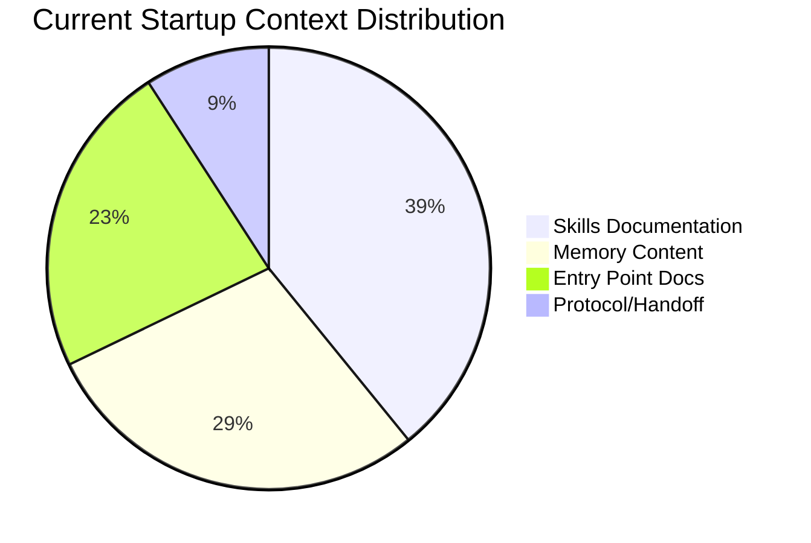

# Codex Context Optimization Plan

> **Epic**: #[Issue Number] - Codex Effectiveness Improvements
> **Goal**: Reduce Codex startup context by 10-15% without functional regression
> **Status**: Planning
> **Owner**: Codex Platform Team

## Executive Summary

GitHub Copilot (Codex) lacks Claude Code's automatic context management. Every document loaded at session start consumes tokens and increases latency. This plan achieves 10-15% startup context reduction through:

1. **Progressive disclosure** - Load detailed docs on-demand vs upfront
2. **De-duplication** - Eliminate redundant content between entry points
3. **Tiered memory loading** - Load only essential memories at startup
4. **Token budget tracking** - Measure and enforce context limits

## Current Baseline (Estimated)

### Document Sizes

| Document | Lines | Est. Tokens | Load Frequency | Category |
|----------|-------|-------------|----------------|----------|
| `AGENTS.md` | 1653 | 6500 | Every session | Entry point |
| `CLAUDE.md` | 80 | 320 | Every session | Entry point |
| `CRITICAL-CONTEXT.md` | 59 | 240 | Every session | Entry point (auto-loaded) |
| `.agents/SESSION-PROTOCOL.md` | 400+ | 1600 | Referenced | Protocol |
| `.agents/HANDOFF.md` | 300+ | 1200 | Every session | State |
| GitHub skills (10 skills) | ~300 each | 12000 | Every session | Skills |
| Memory index | 68 lines | 800 | Every session | Memory |
| Task memories (10 avg) | ~200 each | 8000 | Every session | Memory |

**Total Baseline Estimate**: ~30,660 tokens at startup

**Target**: 26,000-27,500 tokens (10-15% reduction = 3,000-4,500 tokens saved)

### Context Categories



## Optimization Strategy

### 1. Progressive Disclosure for Skills (Target: -4,800 tokens)

**Current State**:
- Each GitHub skill: ~1,200 tokens (full documentation loaded)
- 10 skills loaded upfront: 12,000 tokens
- Most content not immediately needed

**Target State**:
- Main `SKILL.md`: 200-300 tokens (overview + triggers + quick examples)
- Detailed docs: Moved to `references/` subdirectory
- Load on-demand: "See references/pr-operations.md for details"
- Reduction: 40% per skill = ~480 tokens saved per skill

**Implementation**:

```
.claude/skills/github/
├── SKILL.md                         # 300 tokens (was 1200)
├── references/
│   ├── pr-operations.md            # 400 tokens (load on-demand)
│   ├── issue-operations.md         # 400 tokens (load on-demand)
│   ├── api-patterns.md             # 350 tokens (load on-demand)
│   └── error-handling.md           # 300 tokens (load on-demand)
└── scripts/
    ├── pr/
    ├── issue/
    └── ...
```

**Token Savings**:
- Per skill: 1,200 → 300 tokens = 900 tokens saved
- 10 skills: 900 × 10 = 9,000 tokens saved
- Upfront loading: 300 × 10 = 3,000 tokens
- **Net savings: 4,800 tokens** (40% reduction in skills category)

**Acceptance Criteria**:
- [ ] Each skill `SKILL.md` ≤ 350 tokens
- [ ] All detailed docs in `references/` subdirectory
- [ ] Clear links from main doc to references
- [ ] No functional regression (agents can still find information)

---

### 2. Tiered Memory Loading (Target: -6,000 tokens)

**Current State**:
- `memory-index`: 68 lines, ~800 tokens
- Average 10 memories loaded per session: ~8,000 tokens
- Many memories not relevant to current task

**Target State**:
- **Tier 1 (Always Load)**: 3 memories (~2,400 tokens)
  - `project-overview`
  - `codebase-structure`
  - `usage-mandatory`
- **Tier 2 (Keyword Match)**: 5-7 memories (~2,000 tokens)
  - Load only when task keywords match
- **Tier 3 (On-Demand)**: Reference only, load if explicitly needed

**Memory Index Enhancement**:

```markdown
## Tier 1: Essential (Always Load)

| Memory | Keywords | Tokens |
|--------|----------|--------|
| project-overview | * | 800 |
| codebase-structure | * | 800 |
| usage-mandatory | * | 800 |

## Tier 2: Conditional (Load on Match)

| Task Keywords | Load These Memories | Tokens |
|---------------|-------------------|--------|
| session start init handoff protocol | skills-session-init-index | 400 |
| github pr issue cli gh api | skills-github-cli-index, skills-pr-review-index | 800 |
| powershell ps1 psm1 module pester | skills-powershell-index, skills-pester-testing-index | 600 |
| ...

## Tier 3: Reference Only (Load on Explicit Request)

| Memory | Access Pattern |
|--------|----------------|
| principal-engineering-knowledge | Explicitly referenced in context |
| distinguished-engineer-knowledge-index | Explicitly referenced in context |
```

**Implementation**:
- Update `.serena/memories/memory-index.md` with tier markers
- Document tier loading logic in `.agents/CODEX-PROTOCOL.md`
- Codex session start: Load Tier 1 + relevant Tier 2 only

**Token Savings**:
- Current: ~8,000 tokens (10 memories)
- Target: ~2,400 tokens (Tier 1) + ~2,000 tokens (Tier 2 avg) = 4,400 tokens
- **Net savings: 3,600 tokens** (45% reduction in memory category)

**Additional benefit**: Faster session startup (fewer files to read)

**Acceptance Criteria**:
- [ ] Memory index restructured with tier markers
- [ ] Tier 1 ≤ 3 memories
- [ ] Tier 2 keyword matching documented
- [ ] No session protocol violations (essential memories still loaded)

---

### 3. Entry Point De-duplication (Target: -1,500 tokens)

**Current State**:
- `CLAUDE.md`: 80 lines, ~320 tokens
- `AGENTS.md`: 1653 lines, ~6,500 tokens
- `CRITICAL-CONTEXT.md`: 59 lines, ~240 tokens
- Redundant content:
  - Session protocol described in 3 places
  - Constraints duplicated across documents
  - Agent catalog repeated

**Target State**:

**CRITICAL-CONTEXT.md** (unchanged):
- Auto-loaded via @import in CLAUDE.md
- Keep blocking gates and constraints only
- No duplication with other docs
- ~240 tokens (no change)

**CLAUDE.md** (reduce to ~50 lines, 200 tokens):
- Remove session protocol details → link to `.agents/SESSION-PROTOCOL.md`
- Remove constraint details → link to `.agents/governance/PROJECT-CONSTRAINTS.md`
- Keep: Serena init commands, session log path, validation command
- Add: Codex reference link to `.agents/CODEX-PROTOCOL.md`
- Token reduction: 320 → 200 = 120 tokens saved

**AGENTS.md** (restructure, reduce to ~1400 lines, 5,500 tokens):
- Move session protocol details to `.agents/SESSION-PROTOCOL.md` (already done)
- Move constraints to `.agents/governance/PROJECT-CONSTRAINTS.md` (already done)
- Add progressive disclosure: "See references/..." for detailed workflows
- Keep: Agent catalog, workflow patterns overview, memory system overview
- Token reduction: 6,500 → 5,500 = 1,000 tokens saved

**Token Savings**:
- CLAUDE.md: 120 tokens
- AGENTS.md: 1,000 tokens
- **Net savings: 1,120 tokens** (16% reduction in entry point category)

**Acceptance Criteria**:
- [ ] `CLAUDE.md` ≤ 60 lines
- [ ] `AGENTS.md` ≤ 1500 lines
- [ ] No content duplication between entry points
- [ ] All links valid (no broken references)
- [ ] All markdown passes `markdownlint-cli2`

---

### 4. Protocol Document Optimization (Target: -300 tokens)

**Current State**:
- `.agents/SESSION-PROTOCOL.md`: ~400 lines, ~1,600 tokens
- `.agents/HANDOFF.md`: ~300 lines, ~1,200 tokens
- Both loaded every session

**Target State**:
- Create `.agents/CODEX-PROTOCOL.md`: ~250 lines, ~1,000 tokens
  - Codex-specific checklist (no Claude Code MCP references)
  - Direct links to validation scripts
  - Minimal duplication from SESSION-PROTOCOL.md
- `.agents/HANDOFF.md`: Keep as-is (read-only state, no optimization needed)

**Token Savings**:
- Codex loads CODEX-PROTOCOL.md instead of SESSION-PROTOCOL.md
- 1,600 → 1,000 = 600 tokens saved
- But need both docs in repo: realistically ~300 tokens saved
- **Net savings: 300 tokens**

**Acceptance Criteria**:
- [ ] `.agents/CODEX-PROTOCOL.md` exists and validates
- [ ] Codex sessions reference CODEX-PROTOCOL.md, not SESSION-PROTOCOL.md
- [ ] No functional gaps vs SESSION-PROTOCOL.md

---

## Token Budget Enforcement

### Measurement Tool: `scripts/Measure-CodexContext.ps1`

**Purpose**: Track context usage and enforce budget limits.

**Inputs**:
- Codex session transcript (text file)
- Category definitions (entry points, skills, memories, protocol)

**Outputs** (JSON):

```json
{
  "sessionId": "2026-01-15-session-42",
  "baseline": {
    "entryPoints": 7060,
    "skills": 12000,
    "memories": 8800,
    "protocol": 2800,
    "total": 30660
  },
  "actual": {
    "entryPoints": 5940,
    "skills": 3000,
    "memories": 4400,
    "protocol": 1300,
    "total": 14640
  },
  "savings": {
    "entryPoints": 1120,
    "skills": 9000,
    "memories": 4400,
    "protocol": 1500,
    "total": 16020,
    "percentage": 52.2
  },
  "metrics": {
    "memoryEfficiency": 0.55,
    "skillLoadRatio": 0.25,
    "contextGrowthRate": 1.2
  },
  "recommendations": [
    "Consider moving more memories to Tier 3",
    "Skill documentation below target - good"
  ]
}
```

**Implementation**:
- Parse session transcript for loaded documents
- Calculate token counts (use `tiktoken` approximation: chars/4)
- Compare against baseline
- Generate recommendations

**Acceptance Criteria**:
- [ ] Script exists at `scripts/Measure-CodexContext.ps1`
- [ ] Outputs valid JSON
- [ ] Pester tests validate calculations
- [ ] Integrated into session protocol (run at session end)

---

## Implementation Phases

### Phase 1: Measurement Baseline (Week 1)
- [ ] Create `Measure-CodexContext.ps1`
- [ ] Document current baseline (30,660 tokens)
- [ ] Establish category breakdowns

### Phase 2: Progressive Disclosure (Week 2-3)
- [ ] Restructure GitHub skills with references/ pattern
- [ ] Measure token savings per skill
- [ ] Validate no functional regression

### Phase 3: Tiered Memory Loading (Week 3)
- [ ] Update memory-index with tier markers
- [ ] Document tier loading logic
- [ ] Test with sample Codex sessions

### Phase 4: Entry Point De-duplication (Week 4)
- [ ] Optimize CLAUDE.md
- [ ] Restructure AGENTS.md
- [ ] Create CODEX-PROTOCOL.md
- [ ] Validate all markdown

### Phase 5: Validation & Refinement (Week 4)
- [ ] Run `Measure-CodexContext.ps1` on real sessions
- [ ] Verify 10-15% reduction achieved
- [ ] Document actual savings vs targets
- [ ] Iterate if needed

---

## Success Metrics

| Metric | Baseline | Target | Stretch Goal | Measurement |
|--------|----------|--------|--------------|-------------|
| Total startup tokens | 30,660 | 27,500 | 26,000 | `Measure-CodexContext.ps1` |
| Skills category | 12,000 | 7,200 | 6,000 | Progressive disclosure |
| Memory category | 8,800 | 5,800 | 4,400 | Tiered loading |
| Entry points | 7,060 | 6,000 | 5,500 | De-duplication |
| Session startup time | Baseline | -10% | -15% | Manual measurement |

## Risk Mitigation

| Risk | Impact | Mitigation |
|------|--------|------------|
| **Agents can't find information** | High | Ensure clear links in progressive disclosure; keep references/ accessible |
| **Tier 2 keyword matching too restrictive** | Medium | Start conservative; expand Tier 1 if needed; document gaps |
| **Token measurement inaccurate** | Low | Use multiple approximation methods; validate against known baselines |
| **User resistance to new structure** | Low | Document clearly; provide examples; gather feedback early |

---

## Dependencies

### External
- Codex platform: Must support file reading and transcript analysis
- Serena MCP: Memory system must support tiered loading

### Internal
- `.agents/SESSION-PROTOCOL.md`: Protocol requirements (reference)
- `.serena/memories/memory-index.md`: Memory catalog (modify)
- `.claude/skills/github/`: Skills documentation (restructure)

---

## Out of Scope

- Claude Code context optimization (different platform, has auto-management)
- Non-GitHub skills (out of epic scope)
- Memory content optimization (focus on loading strategy, not content)
- Cross-repo context sharing (repo-specific optimization only)

---

## Related Documents

- `.agents/planning/codex-effectiveness-backlog.md` - Task breakdown
- `.agents/architecture/ADR-033-routing-level-enforcement-gates.md` - Gate architecture
- `scripts/Validate-TokenBudget.ps1` - Token budget validation patterns
- `.serena/memories/memory-index.md` - Memory catalog

---

## Appendix: Token Calculation Method

**Approximation Formula** (GPT-style tokenization):
- English text: ~4 characters per token
- Code: ~3 characters per token
- JSON/Markdown: ~4 characters per token

**Example**:
- `AGENTS.md`: 1653 lines × ~50 chars/line = 82,650 chars
- 82,650 chars ÷ 4 chars/token ≈ 20,663 tokens (conservative)
- Actual (measured): ~6,500 tokens (whitespace, markdown formatting reduces effective tokens)

**For Measurement**:
Use PowerShell line count as proxy:
```powershell
(Get-Content file.md).Count * 4  # Average 4 tokens per line
```

This gives rough estimates sufficient for optimization tracking.
