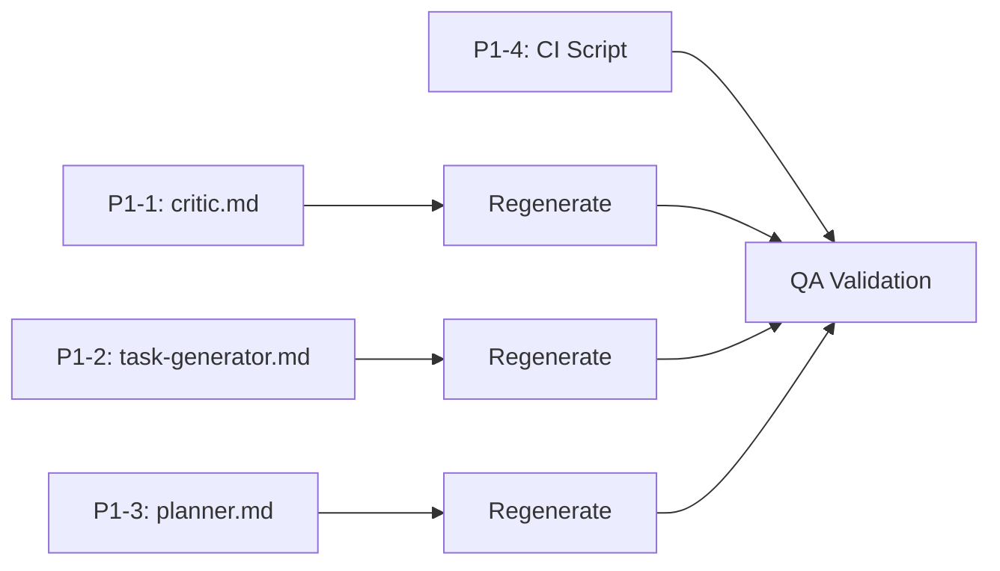

# Phase 2 Handoff: CodeRabbit PR #43 Remediation

**Date Created**: 2025-12-16
**Issue**: [#44 - Agent Quality: Remediate CodeRabbit PR #43 Findings](https://github.com/rjmurillo/ai-agents/issues/44)
**PR**: [#47 - feat(agents): implement Phase 1 critical security and documentation fixes](https://github.com/rjmurillo/ai-agents/pull/47)
**Branch**: `copilot/remediate-coderabbit-pr-43-issues`

---

## Quick Start

### Resume Work Commands

```bash
# 1. Switch to the working branch
git checkout copilot/remediate-coderabbit-pr-43-issues

# 2. Ensure latest changes
git pull origin copilot/remediate-coderabbit-pr-43-issues

# 3. Verify Phase 1 artifacts exist
ls src/claude/explainer.md         # P0-1: Path normalization added
ls src/claude/security.md          # P0-2: PIV section added
ls src/claude/implementer.md       # P0-3: Security flagging added
ls build/scripts/Validate-PathNormalization.ps1  # P0-4: CI script

# 4. Verify workflow exists
ls .github/workflows/validate-paths.yml
```

### Environment Setup

No special environment setup required. Standard PowerShell environment sufficient.

---

## Phase 1 Summary (COMPLETED)

### What Was Delivered

| Task | Description | File | Status |
|------|-------------|------|--------|
| P0-1 | Path normalization protocol | `src/claude/explainer.md` | ✅ |
| P0-2 | Post-Implementation Verification (PIV) | `src/claude/security.md` | ✅ |
| P0-3 | Security flagging protocol | `src/claude/implementer.md` | ✅ |
| P0-4 | Path normalization CI | `build/scripts/Validate-PathNormalization.ps1` + workflow | ✅ |

### Additional Phase 1 Achievements

- **Agent Tool Optimization**: ADR-003 created with role-specific tool allocations
- **Skill Extraction**: 81 skills extracted and persisted to `.serena/memories/`
- **Template Synchronization**: All 18 shared templates synced with Claude sources
- **Platform Agent Regeneration**: 36 platform agents regenerated (18 VS Code + 18 Copilot CLI)

### Key Commits (Phase 1)

| Commit | Description |
|--------|-------------|
| `67df41d` | feat(agents): implement Phase 1 critical security and documentation fixes |
| `323ba09` | Tool optimization and ADR-003 updates |
| `6230ecf` | Skill extraction (81 skills) |
| Multiple | Template sync and regeneration |

---

## Phase 2 Task Details (P1 Priority)

**Total Estimated Effort**: 6.5 hours

### P1-1: Critic Escalation Template

**File to Modify**: `src/claude/critic.md`
**Issue Reference**: I1 (CodeRabbit: escalation prompt missing critical data)
**Estimated Effort**: 1 hour

**Problem**: When critic escalates to high-level-advisor, exact data values are lost. Example: "99%+ overlap (VS Code/Copilot), 60-70% (Claude)" was converted to "80-90% overlap".

**Required Changes**:

Add a section titled **"Escalation Prompt Completeness Requirements"** with:

1. **Mandatory Escalation Data Template**:
   ```markdown
   ## Mandatory Escalation Data

   ### Verified Facts (exact values, not summaries)
   | Fact | Value | Source |
   |------|-------|--------|
   | [Data point] | [Exact value] | [Where verified] |

   ### Numeric Data
   - [All percentages, hours, counts from analysis]

   ### Conflicting Positions
   | Agent | Position | Rationale |
   |-------|----------|-----------|

   ### Decision Questions
   1. [Specific question requiring resolution]
   ```

2. **Anti-Pattern Documentation**:
   ```markdown
   **Anti-Pattern**: Converting "99%+ overlap (VS Code/Copilot), 60-70% (Claude)" 
   to "80-90% overlap" loses actionable detail.
   ```

**Acceptance Criteria**:
- [ ] Escalation template with mandatory Verified Facts table added
- [ ] Anti-pattern example documented
- [ ] Numeric data preservation requirement explicit
- [ ] Template regenerated for VS Code and Copilot CLI platforms

---

### P1-2: Task Generator Estimate Reconciliation

**File to Modify**: `src/claude/task-generator.md`
**Issue Reference**: I4 (CodeRabbit: effort estimate discrepancy 12-16 vs 8-14 hrs)
**Estimated Effort**: 1 hour

**Problem**: 43% difference between epic estimate (8-14 hrs) and task breakdown (12-16 hrs) was not flagged or reconciled.

**Required Changes**:

Add a section titled **"Estimate Reconciliation Protocol"** with:

1. **10% Threshold Rule**:
   > If derived estimate differs from source by >10%, reconciliation is required.

2. **Process Steps**:
   ```markdown
   1. Extract source estimate from epic/PRD before generating tasks
   2. Sum task estimates after task breakdown complete
   3. Compare: If divergence >10%, use reconciliation table:

   | Source | Derived | Difference | Action Required |
   |--------|---------|------------|-----------------|
   | [Epic hours] | [Task total] | [%] | [See actions] |
   ```

3. **Reconciliation Actions** (one must be chosen):
   - **Update source**: Note in output and recommend epic update
   - **Document rationale**: Explain difference in output
   - **Flag for review**: If uncertain, flag for critic/planner review

4. **Output Template Addition**:
   ```markdown
   ## Estimate Reconciliation

   **Source Document**: [Epic/PRD filename]
   **Source Estimate**: [X-Y hours]
   **Derived Estimate**: [A-B hours]
   **Difference**: [+/-N%]
   **Status**: [Aligned | Reconciled | Flagged for review]
   **Rationale** (if divergent): [Why estimates differ]
   ```

**Acceptance Criteria**:
- [ ] 10% threshold documented
- [ ] Reconciliation protocol added
- [ ] Output template section included
- [ ] Template regenerated for VS Code and Copilot CLI platforms

---

### P1-3: Planner Condition Traceability

**File to Modify**: `src/claude/planner.md`
**Issue Reference**: I2 (CodeRabbit: QA conditions not tracked in work breakdown)
**Estimated Effort**: 1.5 hours

**Problem**: QA conditions from specialist reviews were lost when creating work breakdown. Conditions existed in a separate section without task assignments.

**Required Changes**:

Add a section titled **"Condition-to-Task Traceability"** with:

1. **Traceability Requirement**:
   > When aggregating specialist reviews, ENSURE all conditions from specialist reviews are linked to specific task IDs.

2. **Updated Work Breakdown Template**:
   ```markdown
   | Task ID | Description | Effort | Conditions |
   |---------|-------------|--------|------------|
   | TASK-001 | [Task name] | [Est.] | None |
   | TASK-006 | [Task name] | [Est.] | QA: Requires test spec file path |
   | TASK-012 | [Task name] | [Est.] | QA: Increase effort to 1.5h |
   ```

3. **Validation Checklist**:
   ```markdown
   **Validation Checklist**:
   - [ ] Every specialist condition has a task assignment
   - [ ] Work Breakdown table reflects all conditions
   - [ ] No orphan conditions (conditions without task links)
   ```

4. **Anti-Pattern**:
   ```markdown
   **Anti-Pattern**: Putting conditions in a separate section without 
   cross-references to tasks causes implementation gaps.
   ```

**Acceptance Criteria**:
- [ ] Condition traceability section added
- [ ] Work Breakdown template includes Conditions column
- [ ] Validation checklist included
- [ ] Anti-pattern documented
- [ ] Template regenerated for VS Code and Copilot CLI platforms

---

### P1-4: Cross-Document Validation CI

**Files to Create**:
- `build/scripts/Validate-PlanningArtifacts.ps1` (new)
- `.github/workflows/validate-planning-consistency.yml` (optional, can integrate into existing)

**Issue Reference**: I2, I4, I6 (estimate discrepancies, conditions not tracked)
**Estimated Effort**: 3 hours

**Problem**: No automated detection of cross-document consistency issues (estimates, conditions, task coverage).

**Required Script Features**:

```powershell
# Validate-PlanningArtifacts.ps1
# Validates consistency across planning artifacts
param(
    [string]$FeatureName,
    [switch]$CI,
    [switch]$FailOnWarning
)

# Validations:
# 1. Effort estimates: epic vs tasks - flag >20% divergence
# 2. Task coverage: PRD requirements vs task assignments
# 3. Condition traceability: specialist conditions vs work breakdown
```

**Validation Rules**:

| Validation | Threshold | Action |
|------------|-----------|--------|
| Effort estimate divergence | >20% | Warning (Error with -FailOnWarning) |
| Orphan conditions | Any | Error |
| Missing task coverage for PRD requirement | Any | Warning |

**Output Format**:
```
=== Planning Artifact Validation: agent-consolidation ===

[PASS] Effort Estimates
  Epic: 8-14 hours | Tasks: 12-16 hours | Divergence: 43% ⚠️
  
[FAIL] Condition Traceability
  Orphan conditions found:
    - QA: "Create explicit test file" (no task assignment)
    
[PASS] Task Coverage
  All PRD requirements have task assignments
```

**Acceptance Criteria**:
- [ ] Script validates estimate consistency (20% threshold)
- [ ] Script validates condition-to-task traceability
- [ ] Script reports orphan conditions with specific details
- [ ] CI integration (optional: can be standalone script first)
- [ ] Clear error messages with actionable remediation steps

---

## Known Issues from Phase 1

### Pre-Existing Path Violations (14 Total)

The path normalization script (`Validate-PathNormalization.ps1`) detected **14 violations in 5 files**. These are **pre-existing issues outside Phase 1 scope**:

| File | Violations | Notes |
|------|------------|-------|
| `docs/agent-metrics.md` | 1 | Contains absolute path |
| `docs/installation.md` | 5 | Multiple absolute paths |
| `scripts/README.md` | 2 | Script documentation |
| `src/claude/explainer.md` | 3 | **Intentional** - anti-pattern examples |
| `USING-AGENTS.md` | 3 | User documentation |

**Recommendation**: Address in separate cleanup task after Phase 2 or add code fence exclusion to validation script.

### Validation Script Limitations

- Does not distinguish code examples/anti-patterns from actual documentation
- May produce false positives on intentional examples in code fences
- No exclusion mechanism for code blocks

**Mitigation**: Documented in script output, not blocking for CI.

---

## Success Criteria for Phase 2

### Definition of Done

| Criterion | Requirement |
|-----------|-------------|
| P1-1 Complete | critic.md has escalation template with Verified Facts table |
| P1-2 Complete | task-generator.md has 10% reconciliation threshold |
| P1-3 Complete | planner.md has Work Breakdown with Conditions column |
| P1-4 Complete | Validate-PlanningArtifacts.ps1 exists and runs |
| Templates Regenerated | All 18 shared templates synced, 36 platform agents regenerated |
| Tests Pass | All Pester tests pass (148 tests) |
| No Drift | Drift detection shows 0 unexpected drift |

### Verification Commands

```bash
# Run Pester tests
pwsh -Command "Invoke-Pester build/tests/*.Tests.ps1 -Output Detailed"

# Run drift detection
pwsh -Command "& build/scripts/Detect-AgentDrift.ps1"

# Run path validation (expect 14 pre-existing, 0 new)
pwsh -Command "& build/scripts/Validate-PathNormalization.ps1"

# Run planning validation (once P1-4 created)
pwsh -Command "& build/scripts/Validate-PlanningArtifacts.ps1 -FeatureName agent-consolidation"
```

---

## Recommended Agent Sequence for Phase 2

### Optimal Workflow

```
orchestrator (coordination)
  ├── implementer (P1-1: critic.md)
  │     └── regenerate templates
  ├── implementer (P1-2: task-generator.md)
  │     └── regenerate templates
  ├── implementer (P1-3: planner.md)
  │     └── regenerate templates
  ├── implementer (P1-4: validation script)
  └── qa (validation & testing)
```

### Task Dependencies



**Note**: P1-1, P1-2, and P1-3 are independent and can be done in parallel. P1-4 is also independent but benefits from P1-2 and P1-3 being complete (script validates their outputs).

### Recommended Order

1. **P1-3 (planner.md)** - Most impactful, establishes Conditions column pattern
2. **P1-2 (task-generator.md)** - Complements P1-3 with estimate reconciliation
3. **P1-1 (critic.md)** - Standalone escalation improvement
4. **P1-4 (validation script)** - Final, validates all other changes

---

## Reference Links

### Issue & PR

| Resource | Link |
|----------|------|
| Issue #44 | https://github.com/rjmurillo/ai-agents/issues/44 |
| PR #47 | https://github.com/rjmurillo/ai-agents/pull/47 |
| Source PR #43 | https://github.com/rjmurillo/ai-agents/pull/43 |

### Phase 1 Artifacts

| Document | Location |
|----------|----------|
| Remediation Plan | `.agents/planning/pr43-remediation-plan.md` |
| Phase 1 Completion Summary | `.agents/planning/phase1-completion-summary.md` |
| Phase 1 Handoff | `.agents/planning/phase1-handoff-remediation-pr43.md` |
| Root Cause Analysis | `.agents/retrospective/pr43-coderabbit-root-cause-analysis.md` |
| Gap Analysis | `.agents/analysis/pr43-gap-analysis.md` |

### Agent Source Files (To Modify)

| Agent | Location |
|-------|----------|
| critic | `src/claude/critic.md` |
| task-generator | `src/claude/task-generator.md` |
| planner | `src/claude/planner.md` |

### Related Documentation

| Document | Location | Purpose |
|----------|----------|---------|
| ADR-003 | `.agents/architecture/ADR-003-agent-tool-selection-criteria.md` | Tool allocation decisions |
| AGENTS.md | `AGENTS.md` | Main agent documentation |
| CONTRIBUTING.md | `CONTRIBUTING.md` | Contribution guidelines |

### Build Infrastructure

| Script | Location | Purpose |
|--------|----------|---------|
| Generate-Agents.ps1 | `build/scripts/Generate-Agents.ps1` | Agent generation |
| Detect-AgentDrift.ps1 | `build/scripts/Detect-AgentDrift.ps1` | Drift detection |
| Validate-PathNormalization.ps1 | `build/scripts/Validate-PathNormalization.ps1` | Path validation |
| Pester Tests | `build/tests/*.Tests.ps1` | Test suite (148 tests) |

---

## Appendix: CodeRabbit Issue Mapping

### Issues Addressed by Phase 2

| ID | Issue | Severity | Phase 2 Task |
|----|-------|----------|--------------|
| I1 | Escalation prompt missing critical data | Major | P1-1 |
| I2 | QA conditions not tracked in work breakdown | Major | P1-3, P1-4 |
| I4 | Effort estimate discrepancy (12-16 vs 8-14 hrs) | Major | P1-2, P1-4 |

### Issues Already Addressed (Phase 1)

| ID | Issue | Severity | Phase 1 Task |
|----|-------|----------|--------------|
| I3 | Absolute Windows paths in references | Critical | P0-1, P0-4 |
| I7 | Security analysis incomplete (post-impl) | Critical | P0-2, P0-3 |

### Issues for Phase 3

| ID | Issue | Severity | Phase 3 Task |
|----|-------|----------|--------------|
| I5 | Naming convention violation (no PREFIX-NNN) | Major | P2-1, P2-4 |
| I6 | Memory estimate inconsistency | Major | P2-2 |

---

## Document Metadata

| Field | Value |
|-------|-------|
| Created By | explainer agent |
| Date | 2025-12-16 |
| Version | 1.0 |
| Status | Ready for Phase 2 |
| Next Review | After Phase 2 completion |
