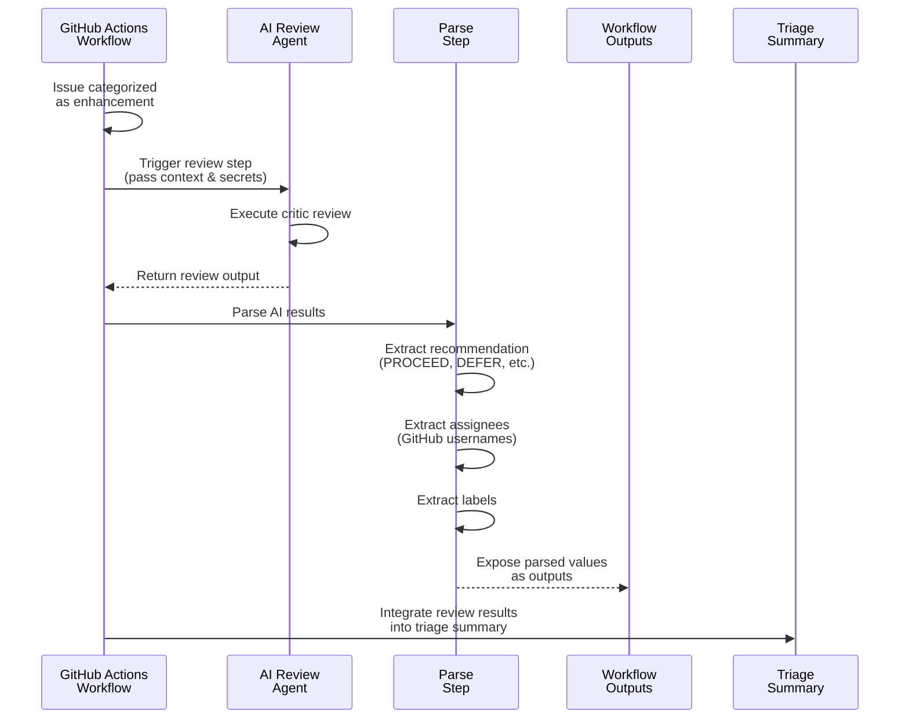

# docs: add feature request review workflow planning artifacts

## Summary

Add planning documents for AI-powered feature request review and GitHub Actions improvements.

## Documents Added

### Architecture

- **ADR-007**: Feature request review step for issues workflow
  - Defines automated feature request analysis
  - PRD generation triggers
  - Integration with AI agents

### Planning

- **Feature Review Workflow Changes**: Detailed workflow modifications
- **GitHub Actions Failures Remediation Plan**: Addressing workflow reliability

### Prompts

- **Issue Feature Review Prompt**: Template for AI-assisted feature review

## Purpose

These artifacts define the approach for:
- Automated feature request analysis before implementation
- PRD generation based on complexity thresholds
- GitHub Actions workflow improvements
- AI agent integration for issue processing

## Related

- Issue #92: Copilot context synthesis system
- Issue #88: Evidence of context injection working

---

🤖 Generated with [Claude Code](https://claude.com/claude-code)

---

## Files Changed (4 files)

| File | Additions | Deletions |
|------|-----------|-----------|| `.agents/architecture/ADR-007-feature-request-review-step.md` | +331 | -0 |
| `.agents/planning/feature-review-workflow-changes.md` | +425 | -0 |
| `.agents/planning/github-actions-failures-remediation-plan.md` | +359 | -0 |
| `.github/prompts/issue-feature-review.md` | +169 | -0 |

---

## Reviews

### Review by @gemini-code-assist - COMMENTED (12/20/2025 09:36:53)

## Code Review

This pull request introduces a new prompt file for an AI-powered feature request review workflow. The document is well-structured and comprehensive. My review focuses on ensuring adherence to the repository's Markdown style guide. I've provided a few suggestions to improve table formatting for better readability, which is a key point in your style guide.

### Review by @copilot-pull-request-reviewer - COMMENTED (12/20/2025 09:39:35)

## Pull request overview

This PR adds comprehensive planning artifacts for implementing an AI-powered feature request review capability and addressing GitHub Actions workflow failures. The documents establish the architectural foundation for automated feature evaluation integrated into the issue triage workflow.

### Key Changes

- **ADR-007**: Architectural decision to add a conditional feature review step using the critic agent, triggered only for enhancement issues
- **Feature review prompt**: Detailed template for AI-assisted feature evaluation with structured assessment criteria and transparency about data availability constraints
- **Implementation plan**: Specific workflow changes, PowerShell functions, and test cases required to implement the feature review capability

### Reviewed changes

Copilot reviewed 4 out of 4 changed files in this pull request and generated 6 comments.

| File | Description |
| ---- | ----------- |
| `.github/prompts/issue-feature-review.md` | New AI prompt template defining evaluation framework for feature requests with emphasis on evidence-based assessment and polite engagement |
| `.agents/architecture/ADR-007-feature-request-review-step.md` | Architecture decision record proposing conditional feature review step, comparing implementation options, and defining integration approach |
| `.agents/planning/feature-review-workflow-changes.md` | Detailed implementation specification including workflow YAML modifications, PowerShell parsing functions, and comprehensive Pester test cases |
| `.agents/planning/github-actions-failures-remediation-plan.md` | Analysis of recent CI failures categorized by root cause with prioritized remediation plan and methodology improvements |

---

## Comments

### Comment by @coderabbitai on 12/20/2025 09:53:46

<!-- This is an auto-generated comment: summarize by coderabbit.ai -->
<!-- This is an auto-generated comment: failure by coderabbit.ai -->

> [!CAUTION]
> ## Review failed
> 
> Failed to post review comments

<!-- end of auto-generated comment: failure by coderabbit.ai -->

<!-- walkthrough_start -->

📝 Walkthrough

## Walkthrough

Introduces a feature-request review step to the issue triage workflow. Adds ADR-007 documenting the design decision, a new review prompt template, PowerShell parsing functions for extracting AI review results, corresponding tests, and workflow integration planning documentation.

## Changes

| Cohort / File(s) | Summary |
|---|---|
| **Design & Planning Documentation**   `.agents/architecture/ADR-007-feature-request-review-step.md`, `.agents/planning/feature-review-workflow-changes.md`, `.agents/planning/github-actions-failures-remediation-plan.md` | Adds ADR-007 detailing the feature request review step decision, implementation guidance for Copilot CLI, and workflow integration points. Includes feature-review workflow planning with parsing strategy and remediation plan for existing GitHub Actions failures. |
| **Prompt Template**   `.github/prompts/issue-feature-review.md` | New markdown-based feature review prompt defining reviewer persona, evaluation workflow, strict output format with sections (Recommendation, Evaluation, Research Findings, etc.), and explicit UNKNOWN state handling. |
| **PowerShell Module & Tests**   `.github/workflows/common/AIReviewCommon.psm1`, `.github/workflows/common/AIReviewCommon.Tests.ps1` | Adds three new public functions: `Get-FeatureReviewRecommendation` (extracts or derives recommendation values), `Get-FeatureReviewAssignees` (parses GitHub usernames with bold formatting support), and `Get-FeatureReviewLabels` (extracts labels in multiple formats). Includes Pester test coverage for all functions. |

## Sequence Diagram

## Estimated code review effort

🎯 3 (Moderate) | ⏱️ ~20 minutes

- **PowerShell parsing functions**: Review logic for recommendation detection (keyword fallback to UNKNOWN), assignee extraction with bold formatting, and label parsing across multiple formats—straightforward but requires tracing all edge cases
- **Prompt structure & evaluation criteria**: Verify the review template enforces consistent output format and properly documents UNKNOWN state handling for missing information
- **Design alignment**: Cross-reference ADR-007 implementation guidance against actual workflow integration points and Copilot CLI adaptations mentioned in the planning document
- **Test coverage**: Confirm Pester tests cover explicit values, edge cases (e.g., "none suggested," backtick-wrapped labels), and error conditions

## Possibly related issues

- **Issue `#110`**: Directly implements the same Feature Request Review design, including ADR-007, prompt file, PowerShell parsing functions, tests, and workflow steps.

## Possibly related PRs

- **PR `#60`**: Modifies the same AIReviewCommon parsing surface—overlapping changes to functions, tests, and AI review workflow integration points.

## Suggested reviewers

- rjmurillo

<!-- walkthrough_end -->

<!-- pre_merge_checks_walkthrough_start -->

## Pre-merge checks and finishing touches

✅ Passed checks (3 passed)

|     Check name     | Status   | Explanation                                                                                                                                                       |
| :----------------: | :------- | :---------------------------------------------------------------------------------------------------------------------------------------------------------------- |
|     Title check    | ✅ Passed | Title follows conventional commit format with 'docs:' prefix and clearly describes the main change—adding planning documents for feature request review workflow. |
|  Description check | ✅ Passed | Description is directly related to the changeset, outlining the documents added, their purpose, and connections to related issues.                                |
| Docstring Coverage | ✅ Passed | No functions found in the changed files to evaluate docstring coverage. Skipping docstring coverage check.                                                        |

<!-- pre_merge_checks_walkthrough_end -->

<!-- finishing_touch_checkbox_start -->

✨ Finishing touches

🧪 Generate unit tests (beta)

- [ ] <!-- {"checkboxId": "f47ac10b-58cc-4372-a567-0e02b2c3d479", "radioGroupId": "utg-output-choice-group-unknown_comment_id"} -->   Create PR with unit tests
- [ ] <!-- {"checkboxId": "07f1e7d6-8a8e-4e23-9900-8731c2c87f58", "radioGroupId": "utg-output-choice-group-unknown_comment_id"} -->   Post copyable unit tests in a comment
- [ ] <!-- {"checkboxId": "6ba7b810-9dad-11d1-80b4-00c04fd430c8", "radioGroupId": "utg-output-choice-group-unknown_comment_id"} -->   Commit unit tests in branch `docs/planning-and-architecture`

<!-- finishing_touch_checkbox_end -->

<!-- tips_start -->

---

Comment `@coderabbitai help` to get the list of available commands and usage tips.

<!-- tips_end -->

<!-- internal state start -->

<!-- DwQgtGAEAqAWCWBnSTIEMB26CuAXA9mAOYCmGJATmriQCaQDG+Ats2bgFyQAOFk+AIwBWJBrngA3EsgEBPRvlqU0AgfFwA6NPEgQAfACgjoCEYDEZyAAUASpETZWaCrKPR1AGxJda+Boi40WnoAMxJqbAoSSCiAR2xpXBiSCXgSAHdIdPwKAGsQj3xM7g9MDHgMInQKcRC0MWRIAwA5RwFKLgBGABYAZkgmgFUbABkuWFxcbgCAehmidVhsAQ0mZhmKIWZI+A9Cme0wNFIMXEQZ7mw9mZ7+ocQOmK2dvcIBfCSmgGV8SIZogRUDAMWA+PznEplCpEI4YWhHCgg9SiXCRaKAJMIYM5SElAZgQVxmNosN9cBEAvxuGQBgYbCk0ulKBSAML4bi7D405lRah0dCcSAAJgADIKAKxgTqCsAi6DCgCcHF63Q4Ys6AC0jAARaQMCjwbjifAYDgGKAAQWCyEhGHKlXQcOqSJoYjRkF8DEc7GQIRykHNAEkwNwipQ+WEIlFkvFEslUhkHfQAOLqAASy39YngxuQUQ88BUu3U8ngzF4+CkbFOiA0ZsgWr8Xur6GCdFNAwtWpsYGFwoA7FwAGLhVFRuIJRBJKLxzKTkjcSC+vhIBzSLI5fKFTKAFAJ3SQQhU12g8CxeaER27x7HMGgPLJEEgADTWGxayAnZRGrC4fVEUgURBn0wegKhoIgqC/LJFn9AN0BOM5aw7SBh0jaI6RnSAAHUNwKIpIGZWBMFIa1SltaF3T8SBdyUMldmQbI8lwzJmEUeADwYahswwGsDCQlNcHTARMy/ZBB20Dw0WQOk2FoAtIKsUiqJbWgokQB56JwrdknzQt81weRgOSGS5K4xDdEgAM1ISZCLyjdCGWsCgWENJSaDLUoaEXP1AyONSkBoc9ULjBlaygKxIhDB4fH3Q90G4ct6lgLy+GPAgiQCxdbOiK9JwdW971QXhsz4AgUHckgqzJL9n1sN8PwgrjIAENAHnoY0FHKgAPYtIFwWBVNgfAPFoQDIH4wThK4jTGK00ty0rb0gMdQM4PYFBThIcDOPapcUCs6Jy3+PzKlCyA6Q8vkVwnLhLNXSAzHlQVIAAClZdlCiSJgNs6pJEFkU5YGkVA/rnZgAEpn1u6yzAADhhl6AFFUiUYFonwEIFG+pIKhELN2oY3JoTB2sDFZI48EGqJaBmJMyE/PkMA+bxqlqeozkTDrmHUHA+pyOh5jpiC+XSaDmVKbAlHwxQSAAbk57mKgYCSlHoMnzQpvn4QAIVkLgxePSWAHlLmQboNDFEn9GMcAoDINqMdSwh6rPTn2C4Xh+GEFFJDXOQFCUKhVHULQdCtkwoDgVBUEwHmncFl21kqrgqFnRwiRcJr5CYAOVDUTRtF0MBDGt0wDC0eDzmcZ0UTRGZzS7Ht+zACNRxIMActwdv6QyMA524DRmFoU0ACJR4MCwYOIeOMocJwM/RxhCMqaQjCgANTic2hsCO/0G97Ps91o/N7TQSByEyFvLxIGNcunBy+/W3rAb2u6fwLUh1xmooNHrXV9XaZAX0aA/WfEoBgSBGoqR9gBJa9BtgeHECUaIX0HwBz5GyESz4RZ9UgMbSCnQXqn3PpjWSX5bz2BoAuCoEh8CExPowfU4gGCrVOL1fAwUEyXzHNfCcZwwaL3wA8LALUn7ZVECwKsKs4oJRBD/L4VJwEHjXKBTaDV2ohlAsgCoojIAkG6pOci40MzmjxtxT+m4ijPkVsrciRCEzcGcA8LuGE+7PnLGWJIhQOKQV2ldNuXC253wyAPWgsDrChgoF8QGewwDNVajwRx5E8BFnENIH+loRpn3sU5Dxi5dgHWoElZ6GgFh9WWBcHJhpzh+ObllZxIVB4QyyZkKwESokkD2JAFiW8vCLmwMCSCtNO4oVbvZDIg4cmGzwJcbGWBAxjPSKyVgxoNDTGYJ0MJTAKCqRDHCciVhEiUF6okLRcyAwLKWSxDAGhoAnNWYgToP8rCqW9C2NAhptpYCINgeAtB8TRF2m9DkSRmQjADM+KILFUj2j0TQCgGByEECGnuKkcIyDgKPI6JWzg2KyFsRIcSKhelANhVg6Cp877xPcS5ScFBt6tyftQXRZZCIPgAF5rhDHpaI9RciM3SF4WgpBKrPhJT9WJLU+QpFvNgT5DDkT6jQM+Wl9K0RtWmXgF6URE520+RCz5t4SBAVMYgJphk9ElHgOApIgxmgAGlmiG0ws0ChvJ6KAywBUJc6VGqoEZkkKQ+oDxEpID/HUR9poWMyCCIia5SpkBDegPcslvF8kADgECybJBTpDfXAgBcAgofOZ8vpXiMnoH7BxAFyIL1UlcdmoF2G/CmHgZA+ZchiJ1XCOVhkWoPiIOQNJkAEaTiJUgQGyAm0zOSulUa0qJJypCFQNgBNRU5h4eitcz1IrqB9jMcgRBOJSD3SQPAVAPBmsdKfAl+Y/mQRBKIXI+ZJzpPzP2+i0F67dl7GKF6rTGSROiR4MAxo7z2D1AacQlR+GGU/Y3AAbC9PqFRnw0BHQIXpBMmKmo5lEMIURUa5g6S7MBECcw/0NoG28HgUPP1kiEB2Vok1rF4CQD1D4pB7j7VgXxG0tqQaqKfAJXdc0cNnJQqxwIbH2kw1pOg6hRrUqSEEd5VUuJhNQ/xsDaB6NDVkpULBCBelBBUtIB89ogUfXwmCyA+YuaqZzBzW9p80AEt2LpHqP5MCIErei2QJMjB1i+PAftqEJ0YwtTkAKFxlj5mYewHda5+kxuXvQZ6jN/Zty8FIDwPAYtWv9FYWCyXiLrR/IobedBiZNCgM0BMHomz2YwDMA8Rngg7oc84aI/rdGdRDDUewwWEWt0QHLdLlx0P5ZURQOoO9/3RG6WxNIbUUqthAsIrIaB5B9SZcVtcej/LkXNIV+wkQZtpKMMO8Q6U+TZzERhfcS4BSpmC7AAwo9h6r1LuXb0FxSJ2iIM1upQT0hgBk0UMAu2ayDxHmPCePlnYzzTs4eQC9IdGAyT6IH3do3vPc6k5ApU+oHT++RMHmQ/agU3tvaEpo6zmmaaJwtVDvzPxWn43qiqP5k8ZUkN+f4mRZA9Q6F+1lUCpqIDkeAHL6AiLIEvf4Ir1o0LoQJhnK1gfoFMS9cDTCWG4Gg46Bxx0qh5mlawsVSnHQPD1CQBCdOGeVrM1UB+pUpssaSOr7HyQHAINnT9KgWZ7Taokbq6q6A/L9pINIMJpR2geB9DknRK1J2avNb1wR5EifMHD/wDV7Ndq+HSNxH84Rs99x4mvXjaisALwCYz2tvvSvsKJxz9+0RZ7p1kBJpWEtbEM7rxrpymQe0KD2O8h86Hog0XEsga3kFZLedKHi+0LeQhXByxrlPmh7fEL/ZQdpnTulXGiM9eZ2PLkrLWZ0fh2Ckp9SiAdPLzC18DKmmwhJAFoie4wlvgIvFzJDJgAjJogLJ0idq3pcTRQujsw2AIzMiGwACyCBCMzQWo5o0AAYhsLq16E4v6NghszICMCMWoz4WoCMg4CMNgz4sBAAioMAjF8NAAAPoIwABqAYZBzQhBz4zQRBWoXwTBsBXwCM5oNgzIqYpBcBYKvB/CfoAcPsCeLAmMwCqI5C7asgDEI0ZKOCtqDqTqLqIidQewzUDAuQZkUAgBwBUQCy5oEeA6FIsKAe7MicaAvc84zgLsRiQk2ADw8KaAbAih2eMcthXGUerah4yq2A8UkW5E7ww0061AmmhkS8tAx8VQaajM5AJ2/Oc4tAGgea/+FhtuQBWUCyIwKgHSDh/ubMraFR8ei4iep85Rce4R5AkR0RNQsRvKTCuQoOVA8UfIhkkI2i3q1Ao0UQo4/2TGEirhDwlaLsT62+UArI2y0guyemVQGmyAp+5y5+EiKytyk4NY0w1+yU6AnSxCju5EL+Jqq6ga5EFqsW3MwerAoeU0QEdhUePWnmpiMedR3xTham60PeGxuiQqyCkqFe/oWAEW/Wsk2q4gHGDgORPifoLeR+vS8a6eDwOi9+XxxCNxIkp05onq5UlUcq96phixOGQ0HgJhuQMwV2HSsUNoZxLekOJME85glg5oCCn4b+hOtGogpQ1eYWPWfWGUfo42sWuipwCWiAq81gT+fSr+7UxmbYkAAABpYaUdjmASHl2l+JqY/C1tEJqWfjOBftclfpqXWOFBNs/klpBOqUPFqTqahDYZ8dIMaSMfklqRaQyFafcusraWFMqYSY1C6VwNqcUVYSQGUXUYgD6dxn6eabsZafsdaYgCGXacqbCUkGAiKXKlEbehqZqQjOnjUGAAgeVl4AgRVO0BQMmXkr0mmRcpmcGZ0Maa7pJhLN4IUW6bGbqTOPqa8YaVxLaUhDGcMsOQyCEYNmEZOeZNOSUR6djs0ZUbaQYJdqWAnNLIzg9pFlwPWbJI4G9mPGaF9scD9jaP9vMIsMsEcCas3OJJJF3MZJ8sGKRCEjDh9nDkGAjnyB3sjvwBjGjgYOvGVlvDvKfMxlEGxj7EZHJnKqyfVpVGcV4ZNA5nULsJJD/HAF1pwn6UoMfCONIIEDCZ1KIMkkiUjvPBjDhRJFGOLpLtHofOJHyFSBQO3P0nlHeOpGcQeBxoxW6CxfqJuqwbeL8ryGNNPHyOaBXM+BZpyKyJLAskpWyMClLKCQpewM+CtLYJADQbKnpPIEmDJRWdzKpdEFrNgEQM+PIqIGAAQGAAGGSewHKpJTep8k0k5B8BDseDicBeJaNGnpatanklRe+jgiOqiLOsjBumEuWJFIMSaj/AGLMiCUeDwPqJLuINLpFTwIpM9FYMKIAMgEVggoTS9x7EFJjClABYZx4QIIkVKGpYzJWR5qOm/WiQu5qGQEMQSAuQyQCwc4FAz4/qa4+MsAWclAtEWAdKZiDgDA/wdAdAYSbAvMvghQRAJYZYTkC0zYpUC+/GPyiASUbMiFEgNYkACAk4kuHEOW11P8nm3EaQrCIlqk+Fz8qFjYlUgCxoNunkd1BA+oj13uQ0ySDmz0oaRAGgEKm008jUC8kIuA3qeu2GhkTapFyAl1xoia5e7+xmqkhGRIFQ5Efi2xsN8NPW6gEO+5KRaRj8rSk4rl+0ly7A9yGyXSxo6gku9oXhYARICKpA9AZOoVWKhQTu9gCiYA160lkEB60wVWGV5xiA7C2ci22VlK4Yr5UYN4/FqAm1g021+Au1HMn6HUlq/yyQeGG6o0t+FCdKroVM9g3s2FfoNVVqeqvU7VpFYS+oiAw1vapmlU/m48PJfJop7+LehZHhIkoF4pkW6CfA0p+W8W+OipzQ7C+Z/MadzCt2sp4g+OWQYYykKdPNdGS2j8SGyAdGIQ31yCS8H80cFEno5JPi+So27CEZxooqpQakEmcKZ2z4UpypR2sEXGoWpd+tUddAJMO5129AhdGuh5NQXAz2RAr272n2YARgJSD5AgFSzkZwMwNSQmwOP555f5PJAFcl9AwVKOYFzdK8dYkFVOMFDO6cuQheGAEq8SA+XuimjJFUqNPKSQB9ZSR9im1S+0tSqE9SwSg8jdLZU+MU5AuNlFXFU42ORyXF6tCKq6WMNmpY6gnyoVXSda8AvclCuiOBcq3Oz0vK/KgqRAiu/SAcI6eyK+z8Hcoq9ViqdDMqPtDwHgIQXcDwVcgM9Aua7xyQ4BPtPapiia5AP0TOpqYSp8tKVqSQW+CRSQjtc+b+z0cAmAw1AAmr8A5XRV3kOvQ2HnSJI4iElIOBUBsaNMZb1TmNQeImORAX3ZAF8HZcRBlCYiJCrUkGQEuDvCqi7XyE5pAKkA4LeNsWSJPqNAIOvrbiQ0cQbmtllcgN8r8h1WxZgOIMGIkZQNxGEvEFJfpIvA+jdQRcoWtKgEoKEfQKVFw38hQLJByq3teY5qIKRn/USCroJVlNGLwqNNYr3jCr1k8Tavao6s6rdcBEzekELl6jkD6u1EbSuLYpepFXyOY+aAgSMDMN/b/WAG2tEG5GA2cTsmujxAFnDlHeQzHUKditHQvLnctrlg6UXfKVnTnZWZKancqYXRnWkPRGXQtkonkTAHdYvLGspLjQzmhR5V+CA+5DJaaS9Fc0UBgDfosE2gCzKRPROiVLIFSC8xPAgZgGxLGK470iSflByhQBdgYkvRlged1QKCefAGeTvZecXOHLKfbLHFPOQELMvQaQKCnCdnPPIH7LdoHHnCHIXIYOK8wAwNwEwRbkwSOv1lbAYAAN7/7DwBGIDXnDxcDDyuPcNEDIAABkomRylJj6/kL08QVquQxqZCk+YMAAOhgKG1AN9tWDMEVfUBVGtLuJ+pg/QDaDIB0saFUBw0cpG6fYQs48iHE5AJiIm3LLeeRJiCm1VqyBgAeBQNnrBvvKg3tI/Nm5XHm9AW6IZC3qW/aB6M29eVG923DQMOG45CfQkjgp60pFECGDwJQF3DO6wV8NpSQDMMpUpvBKg7jVGBUCOnsHyKVJA0sEff2+zM9Du2SHu3wD4XGoRPrnLIe+UjA0291i3t084Mm3O9O+wiezZn4HKruDVfIA+9A5UqfefVjjOCElBJ0u0OtLu4KjMNe+Wlts/Comismx5OjX6FCtENzAe6UkewcBXPwHwEwO9P5ee87UScg8O3/VLORyCtZmwCxBnG6+e1RpjLSsSOzLuGu1ZrBOOPAKpLO9xV+3Bxex5JGZelgAAH4zCrCaUfSXN6v03VvBYaBCAENnFKy/C0C6vcBC03j/hyxECFDNQ5Y/vsedKoCAi0LUjPRQzRBmDdBihVU/wIzcRujc6E3bY4OgbtTMc5CyCruKcqXWadYifzvfuOiYusIIHMhWCYwHhDuQAjvYRfzpAzDW4TFrNwhM27gt7EKYVhNv4+e3sJJqSM4W5ZeiATHIDbC5TXtjRpjGImpu1A3bHdaiCDSJMyrSB5PoA0K/I2bhDjPZe26nKlQ7UjaJMNUhDyBlc7Ycc6cSz6eGci1HJSm9psLtpmIRfjedw2thA/ypd0d74AYdI5YYnRButbFKRfQ1t1vpmBkdlX5J01AE7PyXGJL2i91mLPQVkSnVm1kkD1nMCNmQAllngDcBkZBBmHEIQnEKCBqffRDumjJ6m+OSJyrRvo8gHY7zmR5ri49Dlrkzgbn1EcTqRyxkAOBRjMgCf9LIAHJjVsnjp3N3K0fLE5j+S+b2D3huRGRuNHK7hidRM5A7x6iCKIBfnUDo0/soK8/AjyCpCnzAczBkfAr01KCIPpAhJyxsQOgGTwQvngL2jtCESpA5CIqwokfe67IT4pIwsz08qrYa8v2hKyl0/II5BPNOsxto07ObvVDRBQ8ZTPR+hCA+G1AGQkRy87PAYYB3hVandQAIHk1Eg5Y2vlD1OesE7sKLVnxFBcDPSnHUnq8nvnAczq8wMzDPjPRVVJdCfZ4tvRvwkoisXID7aTj1+9D8KAcM5WBLvXfvcZR/dJs87WCHIlQnIh85XSB6UvTdD99SWlnmJMTqMURF9JBFSsIHc1jDyPiWscQOJqB6QwtBPKt2uQDDzc9YwDiQCpgdLTBdLvJJr5h4jzyp28qDMIpsBE1Sx7+9NMsJxEnwWQ3whkCYuJQ4xRFnKhANfrF0axs8mUH/KgC4G7xSYqgt2ZuI2HiS4YwwBGO3s7ByzbNa2nyDQKGxHbp8pe6tEIEkBGDhB4UXAJME5A4aYNEA/6aKklHRjsQCwOWagU5FoG4A64bKUSsaBoCnAEakxciAgC3pgBamplFmFai8CjRfWphHrP8AoBVJ1Mz8PHFth7q24WqzGLwJ5AcQlZDIhdG1uVBrCUC6OOoecJhHgCEwuAzyCsMUzrp/UsWjUAgOyH8AcwSUzYXaKfEwpfsHwoNAyI6BMHIBZAvwcPMNVkYdZ3gmqFvKEL5ouBAAmAQeD26Xg9qH6FiatwKBYbOjphTXZcB5yRxKCDghCHzgM84Q3qC1FyCz5t4F1erkZwpr7QFM6+KZicmfB4hgQ46BGl4EhKbJ9yTjFqn6GByzoEUE2e0EwDHzvBq8/g6WDcxSAdJ1+W4A/kfwGDDxfCgac0JMH/hQ0MA1/AANr/5th9g7gI4MJgfYBgAAXQMAABfEuFAH04GtxBsKJgnbC1ZAA= -->

<!-- internal state end -->

