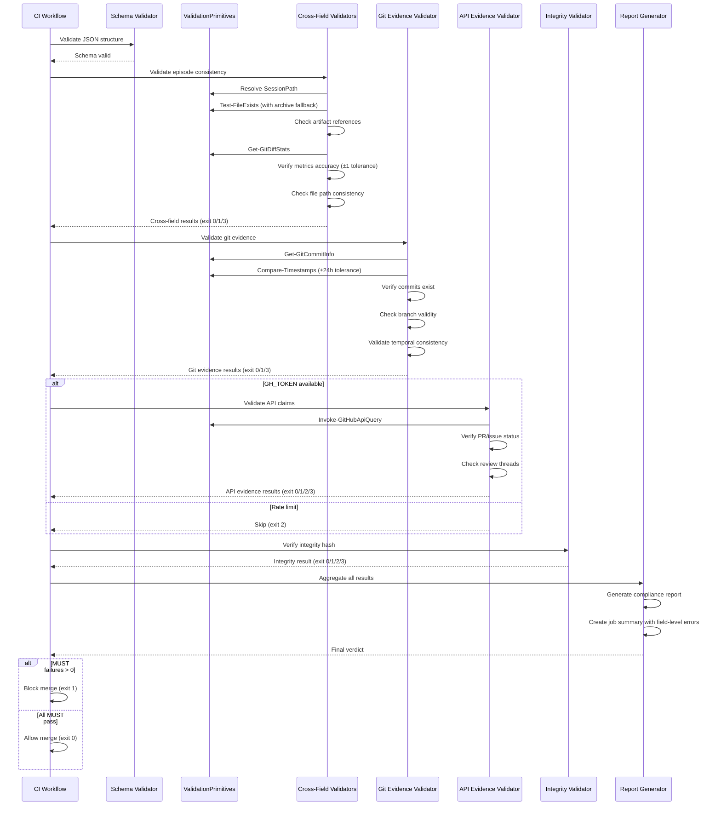
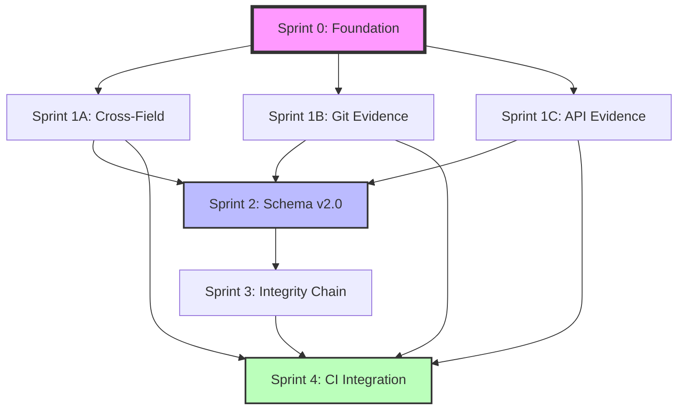

# Plan Refinement: Strengthen Session Validation Against Hallucination

## Executive Summary

The original plan provides solid foundation but has **critical gaps** revealed by PR #875 evidence and current codebase analysis. This refinement addresses:

1. **Completeness gaps**: Missing cross-field consistency validators
2. **Priority misalignment**: Schema changes should follow validators (not precede)
3. **Implementation sequencing**: Dependencies between validators not mapped
4. **Test strategy**: No validator testing approach defined
5. **Edge case handling**: Schema polymorphism (Complete vs complete) not addressed

## Critical Analysis of Original Plan

### Strengths

1. **Correct problem diagnosis**: Trust-based evidence is unverifiable
2. **External source strategy**: No committed tool logs eliminates merge conflicts
3. **Structured evidence types**: Git, API, File, Tool evidence properly categorized
4. **Integrity chain**: SHA-256 chain for tamper detection

### Existing Infrastructure to Leverage

The codebase has mature PowerShell modules that validators MUST use:

| Module | Location | Purpose |
|--------|----------|---------|
| `GitHubCore.psm1` | `.github/scripts/` | GitHub API calls, rate limiting, authentication |
| `GitHelpers.psm1` | `.github/scripts/` | Git operations, commit info, diff stats |
| `SchemaValidation.psm1` | `scripts/modules/` | JSON schema validation |
| `HookUtilities.psm1` | `.claude/hooks/Common/` | Session path resolution, git commands |

**Episode Schema**: `.claude/skills/memory/resources/schemas/episode.schema.json`

### Gaps Identified

| Gap Category | Issue | Impact |
|--------------|-------|--------|
| **Cross-field consistency** | No validators for episode-session alignment | PR #875 issues 1,4,5,6,7,8 undetected |
| **Schema polymorphism** | Complete vs complete case variants | Current logs use both, breaks validation |
| **Dependency ordering** | Schema changes before validators exist | Chicken-egg problem, no testing path |
| **Validator testing** | No test strategy for validators | How to verify validators work correctly? |
| **Performance** | No parallel execution plan for validators | Serial execution slows CI |
| **Backward compatibility** | schemaVersion required but migration undefined | Breaks 387 existing sessions |

## Revised Implementation Plan

### Sprint 0: Foundation (NEW - CRITICAL)

**Goal**: Enable incremental development without breaking existing sessions.

**Rationale**: Current plan requires schema changes upfront, but 387 existing sessions use polymorphic field names (Complete/complete). Validators must work with current format first.

#### Task 0.1: Schema Analysis

Document current schema polymorphism:

```powershell
# scripts/Test-SchemaPolymorphism.ps1
# Find all case variants used in existing sessions
Get-ChildItem .agents/sessions/*.json | ForEach-Object {
  $session = Get-Content $_ -Raw | ConvertFrom-Json
  # Check for Complete vs complete variants
  # Output report showing distribution
}
```

**Deliverable**: `.agents/planning/schema-polymorphism-report.md`

#### Task 0.2: Validator Test Framework

Create testing infrastructure BEFORE writing validators:

```powershell
# tests/validation/Test-ValidationFramework.ps1
Describe "Validator Test Framework" {
  Context "Given valid session" {
    It "Returns exit code 0" { }
    It "Outputs PASS verdict" { }
  }

  Context "Given invalid session" {
    It "Returns exit code 1" { }
    It "Outputs specific failure reason" { }
    It "Includes line number in error" { }
  }

  Context "Given malformed JSON" {
    It "Reports syntax error with location" { }
  }
}
```

**Acceptance Criteria**:

- Test framework runs via `Invoke-Pester tests/validation/`
- Test sessions in `tests/validation/fixtures/` (valid and invalid examples)
- Coverage: Schema compliance, git evidence, API evidence, file evidence

#### Task 0.3: Baseline Validator Refactor

Extract reusable validation primitives. Leverage existing modules where possible:

```powershell
# scripts/modules/ValidationPrimitives.psm1

# Import existing modules
Import-Module "$PSScriptRoot/../../.github/scripts/GitHelpers.psm1" -Force
Import-Module "$PSScriptRoot/../../.github/scripts/GitHubCore.psm1" -Force

function Test-GitCommitExists {
  param([string]$SHA, [string]$RepoRoot = '.')
  # Use GitHelpers.psm1 if available, fallback to git cat-file
}

function Test-GitAncestor {
  param([string]$Ancestor, [string]$Descendant)
  # git merge-base --is-ancestor
}

function Get-GitDiffStats {
  param([string]$FromCommit, [string]$ToCommit, [string]$RepoRoot = '.')
  # Returns: files changed count, insertions, deletions
  # Use: git diff --numstat <from>..<to>
}

function Invoke-GitHubApiQuery {
  param([string]$Endpoint, [string]$Method = 'GET', [hashtable]$Body)
  # Leverage GitHubCore.psm1 for rate limiting and auth
  # Use Assert-GhAuthenticated, Test-WorkflowRateLimit
}

function Get-FileContentHash {
  param([string]$Path)
  # (Get-FileHash -Algorithm SHA256).Hash
}

function Resolve-SessionPath {
  param([string]$Path, [string]$RepoRoot = '.')
  # Normalize and validate session file paths
  # Handle both .agents/sessions/ and .agents/archive/sessions/
  # SECURITY: Prevent path traversal attacks (no ../, absolute paths)

  # Validate path doesn't escape repo root
  $resolvedPath = [System.IO.Path]::GetFullPath($Path)
  $resolvedRoot = [System.IO.Path]::GetFullPath($RepoRoot)
  if (-not $resolvedPath.StartsWith($resolvedRoot)) {
    throw "Path traversal detected: $Path"
  }
  return $resolvedPath
}

function Compare-Timestamps {
  param(
    [datetime]$ClaimedTime,
    [datetime]$ActualTime,
    [int]$ToleranceMinutes = 1440  # 24 hours default
  )
  # Returns: validation result with time delta
}

function Test-FileExists {
  param([string]$FilePath, [string]$RepoRoot = '.')
  # Check current location AND archive locations
  $locations = @(
    $FilePath,
    $FilePath -replace '\.agents/sessions/', '.agents/archive/sessions/'
  )
  foreach ($loc in $locations) {
    if (Test-Path (Join-Path $RepoRoot $loc)) {
      return @{ Valid = $true; ActualPath = $loc }
    }
  }
  return @{ Valid = $false; Errors = "File not found: $FilePath" }
}
```

**Why**: DRY principle. Each validator will need these primitives. Define once, test once, reuse everywhere.

**Security**: `Resolve-SessionPath` prevents path traversal attacks by validating resolved paths stay within repo root.

### Sprint 1A: Cross-Field Consistency Validators (PRIORITY SHIFT)

**Goal**: Detect PR #875 issues immediately (before schema changes).

**Rationale**: These issues exist in CURRENT schema. We can detect them NOW without schema migration.

#### Task 1A.1: Episode-Session Consistency Validator

**Addresses PR #875 issues**: 1 (outcome mismatch), 4 (status mismatch), 5,6 (metrics mismatch)

```powershell
# scripts/validators/Validate-EpisodeSessionConsistency.ps1

<#
.SYNOPSIS
  Validates episode metadata matches session checklist state.

.DESCRIPTION
  Cross-references episode outcomes with protocolCompliance completion status.

  Rules:
  - episode.outcome = "success" ONLY IF all MUST items complete
  - episode.outcome = "failure" IF any MUST item incomplete
  - episode.metrics.files_changed MUST match actual git diff count
  - episode.decisions MUST NOT be null if outcomes.decisions exists
  - episode.lessons MUST NOT be null if learnings exists

.PARAMETER SessionPath
  Path to session JSON file.

.OUTPUTS
  Exit code 0 = consistent, 1 = inconsistent
  Structured output: JSON with specific inconsistencies
#>
```

**Test Cases**:

- Session with all MUST complete but outcome: failure (FAIL)
- Session with MUST incomplete but outcome: success (FAIL)
- Session with files_changed: 0 but git shows 2 files (FAIL)
- Session with decisions: null but outcomes.decisions populated (FAIL)

#### Task 1A.2: Artifact Reference Validator

**Addresses PR #875 issue**: 8 (referenced session doesn't exist)

```powershell
# scripts/validators/Validate-ArtifactReferences.ps1

<#
.SYNOPSIS
  Validates all referenced artifacts exist.

.DESCRIPTION
  Checks:
  - Referenced session logs exist in .agents/sessions/
  - Referenced file paths exist in working tree
  - Referenced commit SHAs exist in git history
  - Referenced PR numbers exist in GitHub API

.PARAMETER SessionPath
  Path to session JSON file.

.OUTPUTS
  Exit code 0 = all references valid, 1 = broken references
#>
```

**Test Cases**:

- Session references nonexistent session-999 (FAIL)
- Session references file path with typo (FAIL)
- Session references invalid commit SHA (FAIL)
- Session references nonexistent PR #99999 (FAIL)

#### Task 1A.3: Metrics Accuracy Validator

**Addresses PR #875 issues**: 5 (files_changed wrong), 6 (event type wrong), 7 (null fields)

```powershell
# scripts/validators/Validate-MetricsAccuracy.ps1

<#
.SYNOPSIS
  Validates metrics match actual outcomes.

.DESCRIPTION
  Computes actual metrics from git/files and compares to claimed values:

  - files_changed = count of files in git diff
  - commits_made = count of commits between start and end
  - memories_created = count of .serena/memories/*.md with mtime in session range
  - event types align with content (error vs milestone)
  - required fields not null when content exists

.PARAMETER SessionPath
  Path to session JSON file.

.OUTPUTS
  Exit code 0 = metrics accurate, 1 = metrics inaccurate
  JSON output: { field: { claimed: X, actual: Y } }
#>
```

**Edge Cases**:

- Session with endingCommit empty (no commits made, files_changed must be 0)
- Session spans multiple commits (count all commits in range)
- Session creates memory but file already existed (check mtime)

**Tolerance**: Allow ±1 file difference for edge cases (submodules, symlinks, .gitignore changes)

#### Task 1A.4: File Path Consistency Validator

**Addresses PR #875 issue**: 2,3 (file location mismatch)

```powershell
# scripts/validators/Validate-FilePathConsistency.ps1

<#
.SYNOPSIS
  Validates file paths in workLog/deliverables match actual locations.

.DESCRIPTION
  Cross-checks:
  - workLog.files array paths exist in git diff
  - outcomes.deliverables[].path exists in working tree
  - No path discrepancies (.agents/ vs .agents/planning/)

.PARAMETER SessionPath
  Path to session JSON file.

.OUTPUTS
  Exit code 0 = paths consistent, 1 = path mismatches
#>
```

**Validation Rules**:

1. Extract all file paths from workLog[].files, outcomes.deliverables[].path
2. For each path, verify: `git ls-files --error-unmatch $path`
3. Check for common typos: .agents/planning/ vs .agents/ (detect via edit distance)

### Sprint 1B: Git Evidence Validator (PARALLEL with 1A)

**Goal**: Verify git-related claims against repository history.

#### Task 1B.1: Core Git Evidence Validator

```powershell
# scripts/validators/Validate-GitEvidence.ps1

<#
.SYNOPSIS
  Validates git-related evidence claims.

.DESCRIPTION
  Verifies:
  - startingCommit exists and is reachable
  - endingCommit exists and is descendant of startingCommit
  - branch exists and contains endingCommit
  - File changes match git diff output
  - Commit timestamps align with session date

.PARAMETER SessionPath
  Path to session JSON file.

.OUTPUTS
  Exit code 0 = git evidence valid, 1 = invalid
#>
param(
  [Parameter(Mandatory)]
  [string]$SessionPath
)

$ErrorActionPreference = 'Stop'

# Load session
$session = Get-Content $SessionPath -Raw | ConvertFrom-Json

# Validate startingCommit exists
if (-not (Test-GitCommitExists $session.session.startingCommit)) {
  Write-Error "startingCommit does not exist: $($session.session.startingCommit)"
  exit 1
}

# Validate endingCommit (if present)
if ($session.endingCommit) {
  if (-not (Test-GitCommitExists $session.endingCommit)) {
    Write-Error "endingCommit does not exist: $($session.endingCommit)"
    exit 1
  }

  # Verify ancestor relationship
  if (-not (Test-GitAncestor $session.session.startingCommit $session.endingCommit)) {
    Write-Error "endingCommit is not descendant of startingCommit"
    exit 1
  }

  # Verify file changes
  $actualChanges = Get-GitFileChanges $session.session.startingCommit $session.endingCommit
  # Cross-check with workLog files and metrics.files_changed
}

# Validate branch
$branchExists = git branch --list $session.session.branch
if (-not $branchExists) {
  Write-Warning "Branch does not exist: $($session.session.branch)"
}

# Validate commit timestamp <= session date
$commitDate = git log -1 --format=%ci $session.session.startingCommit
$sessionDate = [datetime]::ParseExact($session.session.date, 'yyyy-MM-dd', $null)
if ([datetime]$commitDate -gt $sessionDate.AddDays(1)) {
  Write-Error "Commit date ($commitDate) after session date ($($session.session.date))"
  exit 1
}

exit 0
```

**Test Cases**:

- Session with invalid startingCommit SHA (FAIL)
- Session with endingCommit not descended from start (FAIL)
- Session with branch that doesn't exist (WARN)
- Session with commit date after session date (FAIL)
- Session with files_changed mismatch (FAIL via cross-validator)

#### Task 1B.2: Temporal Consistency Validator

```powershell
# scripts/validators/Validate-TemporalConsistency.ps1

<#
.SYNOPSIS
  Validates temporal consistency across session timestamps.

.DESCRIPTION
  Checks:
  - Session date matches filename date (YYYY-MM-DD)
  - startingCommit timestamp <= session date
  - endingCommit timestamp >= session date (must come after)
  - Evidence timestamps within session bounds
  - Serena memory file mtimes align with session date

.PARAMETER SessionPath
  Path to session JSON file.

.OUTPUTS
  Exit code 0 = temporally consistent, 1 = timeline violations
#>
```

**Edge Cases**:

- Session spans midnight (endingCommit next day is valid)
- Session date is future (FAIL - cannot have commits in future)
- Memory file mtime is past (pre-existing file, WARN not FAIL)

### Sprint 1C: API Evidence Validator (PARALLEL with 1A, 1B)

**Goal**: Verify GitHub API claims against live API.

#### Task 1C.1: GitHub API Evidence Validator

```powershell
# scripts/validators/Validate-ApiEvidence.ps1

<#
.SYNOPSIS
  Validates GitHub API evidence claims.

.DESCRIPTION
  Verifies:
  - PR comments exist and match claimed IDs
  - Review threads resolved status matches claims
  - CI check results match claimed status
  - Commit status checks match claims

.PARAMETER SessionPath
  Path to session JSON file.

.PARAMETER SkipIfNoToken
  Skip validation if GH_TOKEN not available (for local runs).

.OUTPUTS
  Exit code 0 = API evidence valid, 1 = invalid, 2 = skipped
#>
```

**Rate Limit Handling**:

```powershell
# Check rate limit before starting
$rateLimit = gh api rate_limit | ConvertFrom-Json
if ($rateLimit.rate.remaining -lt 10) {
  Write-Warning "GitHub API rate limit low: $($rateLimit.rate.remaining) remaining"
  if ($SkipIfNoToken) {
    Write-Warning "Skipping API validation"
    exit 2
  }
}

# Cache API responses in CI
$cacheFile = ".github/cache/api-responses-$prNumber.json"
if (Test-Path $cacheFile) {
  $cache = Get-Content $cacheFile -Raw | ConvertFrom-Json
  # Use cached responses for validation
}
```

**Test Cases**:

- Session claims PR comment ID that doesn't exist (FAIL)
- Session claims thread resolved but API shows unresolved (FAIL)
- Session claims CI passed but checks failed (FAIL)
- Rate limit exhausted (SKIP with warning)

### Sprint 2: Schema Updates (DEPENDENT on Sprint 1)

**Goal**: Migrate to structured evidence types AFTER validators prove the approach works.

**Dependency Rationale**: We need Sprint 1 validators working on CURRENT schema to prove:

1. Validation primitives are correct
2. Test framework is sufficient
3. CI integration works
4. Performance is acceptable

Then migrate schema with confidence.

#### Task 2.1: Schema Version 2.0 Design

Add structured evidence types to schema:

```json
{
  "definitions": {
    "evidenceUnion": {
      "oneOf": [
        { "$ref": "#/definitions/stringEvidence" },
        { "$ref": "#/definitions/gitEvidence" },
        { "$ref": "#/definitions/apiEvidence" },
        { "$ref": "#/definitions/fileEvidence" }
      ]
    },
    "stringEvidence": {
      "type": "string",
      "description": "Legacy free-text evidence (deprecated)"
    },
    "gitEvidence": {
      "type": "object",
      "required": ["type", "sha", "command"],
      "properties": {
        "type": { "const": "git" },
        "sha": { "type": "string", "pattern": "^[a-f0-9]{7,40}$" },
        "command": { "type": "string" },
        "output": { "type": "string" }
      }
    },
    "apiEvidence": {
      "type": "object",
      "required": ["type", "endpoint", "responseId"],
      "properties": {
        "type": { "const": "api" },
        "endpoint": { "type": "string" },
        "responseId": { "type": "string" },
        "timestamp": { "type": "string", "format": "date-time" }
      }
    },
    "fileEvidence": {
      "type": "object",
      "required": ["type", "path", "sha256"],
      "properties": {
        "type": { "const": "file" },
        "path": { "type": "string" },
        "sha256": { "type": "string", "pattern": "^[a-f0-9]{64}$" },
        "exists": { "type": "boolean" }
      }
    }
  }
}
```

**Key Design Decision**: Use `oneOf` union to allow string OR structured evidence. Enables gradual migration.

#### Task 2.2: Evidence Structure Validator

```powershell
# scripts/validators/Validate-EvidenceStructure.ps1

<#
.SYNOPSIS
  Validates evidence field structure and content.

.DESCRIPTION
  For schema v2.0+:
  - Validates evidence matches type constraints
  - Verifies git evidence SHAs are valid format
  - Verifies API evidence IDs are valid format
  - Verifies file evidence hashes are SHA-256
  - Warns on legacy string evidence (deprecated)

.PARAMETER SessionPath
  Path to session JSON file.

.OUTPUTS
  Exit code 0 = evidence structure valid, 1 = invalid
#>
```

**Migration Path**:

- v1.0 sessions: string evidence (VALID, will warn)
- v2.0 sessions: structured evidence required (MUST)
- Gradual migration: Allow both for 90 days, then deprecate strings

#### Task 2.3: Backward Compatibility Tests

```powershell
# tests/validation/Test-BackwardCompatibility.Tests.ps1

Describe "Schema v2.0 Backward Compatibility" {
  Context "Given v1.0 session with string evidence" {
    It "Validates successfully" { }
    It "Generates warnings about deprecated format" { }
  }

  Context "Given v2.0 session with structured evidence" {
    It "Validates successfully" { }
    It "No deprecation warnings" { }
  }

  Context "Given mixed session (v2.0 schema but string evidence)" {
    It "Validates with warnings" { }
  }
}
```

**Acceptance Criteria**:

- All 387 existing sessions validate successfully
- v2.0 sessions with structured evidence get PASS
- v2.0 sessions with string evidence get PASS + WARN
- Clear migration guide: `.agents/planning/session-schema-v2-migration.md`

### Sprint 3: Integrity Chain (AFTER schema migration)

**Goal**: Detect post-hoc tampering via SHA-256 chain.

**Dependency**: Requires schema v2.0 with integrity section.

#### Task 3.1: Integrity Hash Generator

```powershell
# scripts/New-SessionIntegrityHash.ps1

<#
.SYNOPSIS
  Computes integrity hash for session log.

.DESCRIPTION
  Generates SHA-256 hash of session content excluding integrity section.
  Creates chain link to previous session.

.PARAMETER SessionPath
  Path to session JSON file.

.PARAMETER PreviousSessionHash
  Hash of previous session (optional for first session).

.OUTPUTS
  JSON object with contentHash, timestamp, previousSession
#>
```

**Hash Computation Algorithm**:

```powershell
# Load session
$session = Get-Content $SessionPath -Raw | ConvertFrom-Json -AsHashtable

# Remove integrity section (don't hash the hash)
if ($session.ContainsKey('integrity')) {
  $session.Remove('integrity')
}

# Canonicalize JSON (consistent key ordering, no whitespace)
$canonical = $session | ConvertTo-Json -Depth 10 -Compress

# Compute SHA-256
$hash = [System.Security.Cryptography.SHA256]::Create()
$bytes = [System.Text.Encoding]::UTF8.GetBytes($canonical)
$hashBytes = $hash.ComputeHash($bytes)
$hashHex = [System.BitConverter]::ToString($hashBytes).Replace('-', '').ToLower()

return $hashHex
```

**Canonicalization Critical**: Must have consistent JSON serialization or hashes won't match. Test thoroughly.

#### Task 3.2: Integrity Chain Validator

```powershell
# scripts/validators/Validate-IntegrityChain.ps1

<#
.SYNOPSIS
  Validates session log integrity chain.

.DESCRIPTION
  Verifies:
  - contentHash matches recomputed hash of content
  - timestamp is reasonable (not future, not too old)
  - previousSession hash matches previous session's contentHash
  - No gaps in chain

.PARAMETER SessionPath
  Path to session JSON file.

.OUTPUTS
  Exit code 0 = integrity valid, 1 = tampering detected
#>
```

**Chain Verification Algorithm**:

```powershell
# 1. Recompute content hash
$recomputed = New-SessionIntegrityHash -SessionPath $SessionPath

# 2. Compare to claimed hash
if ($recomputed -ne $session.integrity.contentHash) {
  Write-Error "Content hash mismatch: tampering detected"
  Write-Error "  Claimed:    $($session.integrity.contentHash)"
  Write-Error "  Recomputed: $recomputed"
  exit 1
}

# 3. Verify previous session link
if ($session.integrity.previousSession) {
  $sessionNum = $session.session.number
  $previousNum = $sessionNum - 1
  $previousPath = Get-SessionPathByNumber $previousNum

  if (Test-Path $previousPath) {
    $previousSession = Get-Content $previousPath -Raw | ConvertFrom-Json
    if ($previousSession.integrity.contentHash -ne $session.integrity.previousSession) {
      Write-Error "Chain break: previousSession hash doesn't match"
      exit 1
    }
  } else {
    Write-Warning "Previous session $previousNum not found, cannot verify chain"
  }
}

exit 0
```

**Edge Cases**:

- First session (no previous, previousSession can be null)
- Gap in session numbers (previous deleted, WARN not FAIL)
- Session restored from backup (hash mismatch, detect and report)

### Sprint 4: CI Integration & Pre-commit Hooks

**Goal**: Enforce validation gates in CI and pre-commit.

#### Task 4.1: Update CI Workflow

Add validation jobs to `.github/workflows/ai-session-protocol.yml`:

```yaml
validate-evidence:
  runs-on: ubuntu-24.04-arm
  needs: [detect-changes]
  if: needs.detect-changes.outputs.has_sessions == 'true'
  strategy:
    fail-fast: false
    matrix:
      session: ${{ fromJSON(needs.detect-changes.outputs.session_files) }}
  steps:
    - uses: actions/checkout@v4
      with:
        fetch-depth: 0  # Full history for git verification

    - name: Validate Cross-Field Consistency
      run: pwsh scripts/validators/Validate-EpisodeSessionConsistency.ps1 -SessionPath ${{ matrix.session }}

    - name: Validate Artifact References
      run: pwsh scripts/validators/Validate-ArtifactReferences.ps1 -SessionPath ${{ matrix.session }}

    - name: Validate Metrics Accuracy
      run: pwsh scripts/validators/Validate-MetricsAccuracy.ps1 -SessionPath ${{ matrix.session }}

    - name: Validate File Path Consistency
      run: pwsh scripts/validators/Validate-FilePathConsistency.ps1 -SessionPath ${{ matrix.session }}

    - name: Validate Git Evidence
      run: pwsh scripts/validators/Validate-GitEvidence.ps1 -SessionPath ${{ matrix.session }}

    - name: Validate Temporal Consistency
      run: pwsh scripts/validators/Validate-TemporalConsistency.ps1 -SessionPath ${{ matrix.session }}

    - name: Validate API Evidence
      run: pwsh scripts/validators/Validate-ApiEvidence.ps1 -SessionPath ${{ matrix.session }} -SkipIfNoToken

    - name: Validate Integrity Chain
      if: # Only for schema v2.0+
      run: pwsh scripts/validators/Validate-IntegrityChain.ps1 -SessionPath ${{ matrix.session }}
```

**Performance Optimization**: Matrix strategy runs validators in parallel per session. Multiple sessions also parallelized.

**Estimated CI Time**:

- Current: 3-5 minutes (schema validation only)
- With Sprint 1 validators: 5-8 minutes (git/API calls add latency)
- With all validators: 8-12 minutes (integrity chain adds recomputation)

**Mitigation**: ARM runners provide 37.5% cost savings (per ADR-025), allowing longer runs.

#### Task 4.2: Pre-commit Hook Enhancement

```powershell
# .github/hooks/pre-commit-session-validation.ps1

# Find staged session logs
$stagedSessions = git diff --cached --name-only --diff-filter=ACM |
  Where-Object { $_ -match '\.agents/sessions/.*\.json$' }

if ($stagedSessions) {
  Write-Host "Validating staged session logs..."

  foreach ($session in $stagedSessions) {
    # Run critical validators only (fast ones)
    & scripts/validators/Validate-EpisodeSessionConsistency.ps1 -SessionPath $session
    if ($LASTEXITCODE -ne 0) {
      Write-Error "Session validation failed: $session"
      Write-Error "Fix issues before committing. Run: pwsh scripts/validators/Validate-SessionJson.ps1 -SessionPath $session"
      exit 1
    }

    & scripts/validators/Validate-MetricsAccuracy.ps1 -SessionPath $session
    if ($LASTEXITCODE -ne 0) {
      Write-Error "Metrics validation failed: $session"
      exit 1
    }
  }

  Write-Host "[PASS] Session validation complete" -ForegroundColor Green
}

exit 0
```

**Pre-commit vs CI Split**:

| Validator | Pre-commit | CI | Rationale |
|-----------|------------|-----|-----------|
| Episode-Session Consistency | Yes | Yes | Fast, catches common hallucinations |
| Metrics Accuracy | Yes | Yes | Fast, local git only |
| File Path Consistency | Yes | Yes | Fast, local files only |
| Git Evidence | No | Yes | Requires fetch-depth: 0, slow |
| API Evidence | No | Yes | Requires API token, rate limits |
| Integrity Chain | No | Yes | Requires previous sessions, complex |

**Rationale**: Pre-commit runs fast validators only. CI runs comprehensive suite.

#### Task 4.3: Job Summary Enhancement

Add field-level error reporting to CI job summary in `.github/workflows/ai-session-protocol.yml`:

**Evidence Validation Results Table**:

```markdown
### Evidence Validation Results

| Validator | Status | Failures | Details |
|:----------|:-------|:---------|:--------|
| Git Evidence | ✅ PASS | 0 | All commits verified |
| Artifact References | ❌ FAIL | 2 | 2 files not found |
| Metrics Accuracy | ⚠️ WARN | 1 | files_changed mismatch (within ±1 tolerance) |
| API Evidence | ✅ PASS | 0 | All PR claims verified |
| Integrity Chain | ✅ PASS | 0 | Hash verified |
```

**Expandable Details for Failures**:

```markdown
<details>
<summary>❌ Artifact References (2 failures)</summary>

**Claimed**: `.agents/planning/session-evidence-verification/PRD.md`
**Reality**: File not found (checked both `.agents/sessions/` and `.agents/archive/sessions/`)
**Fix**: Move file to correct location or update session log
**Related**: PR #875 hallucination #2

**Claimed**: `files_changed: 5`
**Reality**: `files_changed: 3` (git diff shows 3 files)
**Fix**: Update workLog metrics to match git diff
**Related**: PR #875 hallucination #5
</details>
```

**Implementation**: Aggregate script collects validator JSON outputs and generates this format.

## Validation Flow Diagram



## Dependency Graph



**Critical Path**: S0 → S1A → S2 → S3 → S4

**Parallel Execution**: S1A, S1B, S1C can run in parallel after S0 completes.

## Test Strategy

### Unit Tests (Per Validator)

```powershell
# tests/validation/Test-EpisodeSessionConsistency.Tests.ps1

Describe "Episode-Session Consistency Validator" {
  BeforeAll {
    # Create test fixtures
    $testDir = New-Item -ItemType Directory -Path "TestDrive:\fixtures"

    # Valid session
    @{
      session = @{ number = 1; date = "2026-01-11"; branch = "test"; startingCommit = "abc123"; objective = "Test" }
      protocolCompliance = @{
        sessionStart = @{}
        sessionEnd = @{
          checklistComplete = @{ complete = $true; level = "MUST"; evidence = "done" }
        }
      }
      outcomes = @{
        episode = @{
          outcome = "success"
          metrics = @{ files_changed = 2 }
        }
        decisions = @(@{ decision = "test"; rationale = "test"; impact = "test" })
      }
    } | ConvertTo-Json -Depth 5 | Set-Content "$testDir\valid.json"

    # Invalid session (outcome mismatch)
    # ... create more fixtures
  }

  Context "Given valid session with outcome matching checklist" {
    It "Returns exit code 0" {
      $result = & scripts/validators/Validate-EpisodeSessionConsistency.ps1 -SessionPath "TestDrive:\fixtures\valid.json"
      $LASTEXITCODE | Should -Be 0
    }
  }

  Context "Given session with outcome: failure but all MUST complete" {
    It "Returns exit code 1" {
      $result = & scripts/validators/Validate-EpisodeSessionConsistency.ps1 -SessionPath "TestDrive:\fixtures\outcome-mismatch.json"
      $LASTEXITCODE | Should -Be 1
    }

    It "Reports specific inconsistency" {
      $result | Should -Match "outcome: failure"
      $result | Should -Match "all MUST items complete"
    }
  }
}
```

**Coverage Target**: 90% code coverage, 100% branch coverage for critical paths.

### Integration Tests (Multi-Validator)

```powershell
# tests/validation/Test-ValidationIntegration.Tests.ps1

Describe "Validation Integration" {
  Context "Given session with multiple issues" {
    It "All validators detect their respective issues" {
      # Run all validators
      # Each should fail with specific error
    }
  }

  Context "Given valid session" {
    It "All validators pass" {
      # Run all validators
      # All should return exit code 0
    }
  }
}
```

### End-to-End Tests (CI Simulation)

```powershell
# tests/validation/Test-CIValidation.Tests.ps1

Describe "CI Validation Workflow" {
  Context "Given PR with invalid session" {
    It "CI job fails" {
      # Simulate CI environment
      # Run validation workflow
      # Assert job exits with code 1
    }
  }

  Context "Given PR with valid session" {
    It "CI job passes" { }
    It "PR comment posted with PASS verdict" { }
  }
}
```

## Edge Case Analysis

### Edge Case 1: Detached HEAD

**Scenario**: Session starts in detached HEAD state (branch = "").

**Handling**:

- Schema allows empty branch: `"branch": { "type": "string" }`
- Validator treats empty branch as valid (WARN not FAIL)
- Evidence: "Detached HEAD at commit abc123"

### Edge Case 2: Squash Merge

**Scenario**: PR squashes commits, endingCommit no longer exists post-merge.

**Handling**:

- Validator runs PRE-merge (on PR branch where commit exists)
- POST-merge validation skipped (historical exemption)
- Integrity chain uses commit SHA before squash

### Edge Case 3: Force Push

**Scenario**: Force push rewrites history, breaks integrity chain.

**Handling**:

- Integrity validator detects chain break
- If force push documented in session (Evidence: "Force pushed to rebase"), WARN not FAIL
- Otherwise, FAIL with tamper warning

### Edge Case 4: Session Spans Midnight

**Scenario**: Session starts 2026-01-11 23:00, ends 2026-01-12 01:00.

**Handling**:

- Session date = start date (2026-01-11)
- endingCommit timestamp 2026-01-12 is VALID (within 24h of session date)
- Temporal validator allows +24h window

### Edge Case 5: Memory File Pre-exists

**Scenario**: Session claims serenaMemoryUpdated but file mtime is old.

**Handling**:

- File evidence includes `lastModified` timestamp
- Validator checks: `lastModified >= sessionStartTime`
- If mtime old, FAIL (file not actually updated)
- Agent must touch file or add new content

### Edge Case 6: API Rate Limit Exhausted

**Scenario**: CI hits GitHub API rate limit during validation.

**Handling**:

- Validator checks rate limit BEFORE validation: `gh api rate_limit`
- If remaining < 10, SKIP with exit code 2
- CI treats exit code 2 as WARN not FAIL
- Re-run after rate limit reset (logged in job summary)

### Edge Case 7: Schema Polymorphism (Complete vs complete)

**Scenario**: 387 existing sessions use both `Complete` and `complete` (case varies).

**Handling**:

- Sprint 0 documents distribution
- Validators use case-insensitive matching: `Get-Key` helper function
- Schema v2.0 standardizes on lowercase `complete`
- Migration script converts all to lowercase
- Test suite includes both variants

## Performance Analysis

### Validator Performance Estimates

| Validator | Operations | Estimated Time | Parallelizable |
|-----------|------------|----------------|----------------|
| Episode-Session Consistency | JSON parsing, field comparison | 50-100ms | Yes |
| Artifact References | File existence checks, git queries | 100-200ms | Yes |
| Metrics Accuracy | Git diff, file counting | 200-500ms | Yes |
| File Path Consistency | Git ls-files, path validation | 100-200ms | Yes |
| Git Evidence | Git ancestry check, diff | 500-1000ms | Yes |
| Temporal Consistency | Git log queries, timestamp parsing | 200-400ms | Yes |
| API Evidence | GitHub API calls (network latency) | 1000-3000ms | Yes |
| Integrity Chain | SHA-256 computation, chain walk | 100-300ms | Partial |

**Total Sequential Time**: 2,250-5,700ms per session (2-6 seconds)

**Total Parallel Time**: 1,000-3,000ms per session (dominated by API calls)

**Multi-Session Performance**:

- 1 session: 1-3 seconds
- 5 sessions: 1-3 seconds (parallel matrix)
- 10 sessions: 2-4 seconds (parallel matrix)
- 20 sessions: 3-6 seconds (parallel matrix with concurrency limits)

**CI Impact**: Acceptable. Current schema-only validation is 30-60 seconds, adding 3-6 seconds is 10-20% increase.

### Optimization Strategies

1. **API Response Caching**: Cache GitHub API responses in CI artifacts, reuse across validators
2. **Git Batch Operations**: Single git diff captures all data, pass to validators
3. **Early Exit**: Fail fast on first critical error (in pre-commit), comprehensive in CI
4. **Lazy Evaluation**: Skip expensive validators if cheap ones fail

## Migration Strategy

### Phase 1: Deploy Sprint 1 Validators (Week 1)

**Actions**:

1. Deploy validators (SHOULD level, warnings only)
2. Monitor CI for false positives
3. Collect data on violation frequency
4. Fix any validator bugs

**Success Criteria**: Zero false positives, 100% CI success rate.

### Phase 2: Promote to MUST (Week 2)

**Actions**:

1. Promote Sprint 1 validators to MUST (blocking)
2. Announce change in PR comment template
3. Update SESSION-PROTOCOL.md documentation

**Success Criteria**: All new sessions pass validators.

### Phase 3: Deploy Schema v2.0 (Week 3-4)

**Actions**:

1. Release schema v2.0 with structured evidence
2. Update session-init skill to generate v2.0 logs
3. Migration script for historical sessions (optional)

**Success Criteria**: All new sessions use v2.0, no validation errors.

### Phase 4: Deploy Integrity Chain (Week 5-6)

**Actions**:

1. Add integrity section to v2.0 schema
2. Update session-init to generate integrity hashes
3. Deploy integrity validator to CI

**Success Criteria**: All new sessions have valid integrity chain.

## Risk Mitigation

### Risk 1: False Positives Block Valid Work

**Mitigation**:

- SHOULD level first (warnings), then MUST after validation
- Escape hatch: `[skip-session-validation]` in commit message (requires manual review)
- Comprehensive test suite catches edge cases before deployment

### Risk 2: Performance Degrades CI

**Mitigation**:

- Parallel matrix execution (already in workflow)
- Timeout limits (8 minutes per job, fail fast)
- ARM runners (37.5% cost savings, can afford longer runs)

### Risk 3: GitHub API Rate Limits

**Mitigation**:

- Rate limit check before validation
- Exit code 2 (skip) instead of 1 (fail) when limit hit
- Response caching across validators
- Use BOT_PAT with higher rate limit (5000/hour vs 1000/hour)

### Risk 4: Schema Breaking Change

**Mitigation**:

- schemaVersion field enables detection
- Validators check version, apply appropriate rules
- Backward compatibility tests for 387 existing sessions
- 90-day deprecation window for string evidence

### Risk 5: Integrity Chain Breaks on Legitimate Operations

**Mitigation**:

- Document legitimate breaks (force push, session deletion)
- Validator detects break but checks for documentation in Evidence
- Manual review flag for chain breaks (not auto-fail)

## Validation Output Format

### Structured JSON Output (for CI)

Each validator outputs JSON for machine parsing:

```json
{
  "validator": "Episode-Session Consistency",
  "verdict": "FAIL",
  "exitCode": 1,
  "issues": [
    {
      "severity": "MUST",
      "field": "outcomes.episode.outcome",
      "expected": "success",
      "actual": "failure",
      "reason": "All MUST items complete but outcome is failure",
      "line": 42
    }
  ],
  "warnings": [
    {
      "severity": "SHOULD",
      "field": "outcomes.episode.decisions",
      "reason": "Field is null but session contains decisions"
    }
  ],
  "metadata": {
    "sessionPath": ".agents/sessions/2026-01-11-session-01.json",
    "timestamp": "2026-01-11T14:30:00Z",
    "duration": "150ms"
  }
}
```

**Benefits**:

- CI can parse and aggregate results
- Job summary shows specific field-level errors
- No need to download artifacts to diagnose

### Human-Readable Output (for pre-commit)

```
[FAIL] Episode-Session Consistency

Issues:
  ✗ outcomes.episode.outcome: Expected 'success' but got 'failure'
    Reason: All MUST items complete but outcome is failure
    Line: 42

Warnings:
  ⚠ outcomes.episode.decisions: Field is null but session contains decisions

Fix these issues before committing.
Run: pwsh scripts/validators/Validate-SessionJson.ps1 -SessionPath .agents/sessions/2026-01-11-session-01.json
```

## Files to Create

### Sprint 0 (Foundation)

- `scripts/Test-SchemaPolymorphism.ps1` - Analyze existing sessions
- `tests/validation/Test-ValidationFramework.ps1` - Test infrastructure
- `scripts/modules/ValidationPrimitives.psm1` - Reusable functions
- `.agents/planning/schema-polymorphism-report.md` - Analysis results

### Sprint 1A (Cross-Field Validators)

- `scripts/validators/Validate-EpisodeSessionConsistency.ps1`
- `scripts/validators/Validate-ArtifactReferences.ps1`
- `scripts/validators/Validate-MetricsAccuracy.ps1`
- `scripts/validators/Validate-FilePathConsistency.ps1`
- `tests/validation/Test-EpisodeSessionConsistency.Tests.ps1`
- `tests/validation/Test-ArtifactReferences.Tests.ps1`
- `tests/validation/Test-MetricsAccuracy.Tests.ps1`
- `tests/validation/Test-FilePathConsistency.Tests.ps1`
- `tests/validation/fixtures/` - Test session JSON files

### Sprint 1B (Git Evidence)

- `scripts/validators/Validate-GitEvidence.ps1`
- `scripts/validators/Validate-TemporalConsistency.ps1`
- `tests/validation/Test-GitEvidence.Tests.ps1`
- `tests/validation/Test-TemporalConsistency.Tests.ps1`

### Sprint 1C (API Evidence)

- `scripts/validators/Validate-ApiEvidence.ps1`
- `tests/validation/Test-ApiEvidence.Tests.ps1`
- `.github/cache/` - API response cache directory

### Sprint 2 (Schema v2.0)

- `.agents/schemas/session-log.schema.v2.json` - New schema version
- `scripts/validators/Validate-EvidenceStructure.ps1` - Evidence type validator
- `scripts/Convert-SessionToV2.ps1` - Migration script
- `.agents/planning/session-schema-v2-migration.md` - Migration guide
- `tests/validation/Test-BackwardCompatibility.Tests.ps1`

### Sprint 3 (Integrity Chain)

- `scripts/New-SessionIntegrityHash.ps1` - Hash generator
- `scripts/validators/Validate-IntegrityChain.ps1` - Chain validator
- `tests/validation/Test-IntegrityChain.Tests.ps1`

### Sprint 4 (CI Integration)

- `.github/workflows/ai-session-protocol.yml` - Updated workflow (modify existing)
- `.github/hooks/pre-commit-session-validation.ps1` - Pre-commit hook
- `.github/scripts/Aggregate-ValidationResults.ps1` - CI aggregation

### Documentation

- `.agents/planning/session-validation-architecture.md` - This plan
- `scripts/validators/README.md` - Validator documentation
- `.agents/SESSION-PROTOCOL.md` - Updated protocol docs (modify existing)

## Total File Count

- New scripts: 18
- Test files: 11
- Documentation: 4
- Modified files: 3

**Total**: 36 new files, 3 modifications

## Success Criteria

### Sprint 0 Success

- [ ] Schema polymorphism documented with distribution counts
- [ ] Test framework runs via `Invoke-Pester` with fixture sessions
- [ ] ValidationPrimitives module exports all 5+ core functions
- [ ] All functions have unit tests with 90%+ coverage

### Sprint 1 Success

- [ ] All 8 validators return exit code 0 for valid sessions
- [ ] All 8 validators return exit code 1 for invalid sessions
- [ ] PR #875 issues detectable by at least one validator
- [ ] Test suite has 90%+ code coverage across all validators
- [ ] CI integration runs validators in parallel with no timeouts

### Sprint 2 Success

- [ ] Schema v2.0 validates with json-schema validator
- [ ] All 387 existing sessions validate with new schema
- [ ] Migration script converts v1.0 to v2.0 losslessly
- [ ] session-init skill generates v2.0 sessions with structured evidence

### Sprint 3 Success

- [ ] Integrity hashes generated for new sessions
- [ ] Chain validator detects tampering (test with modified session)
- [ ] Chain validation skips gracefully for missing previous sessions
- [ ] Force push edge case handled correctly (documented break = WARN)

### Sprint 4 Success

- [ ] CI workflow blocks PR with invalid session
- [ ] Pre-commit hook prevents commit of invalid session
- [ ] Job summary shows specific field-level errors
- [ ] PR comment includes validation report with verdicts

### Overall Success (90-day)

- [ ] Zero hallucination incidents in production sessions
- [ ] Zero false positives blocking valid work
- [ ] CI time increase < 25% (from 5 min to < 6.25 min)
- [ ] 100% of new sessions use schema v2.0 with structured evidence

## Open Questions

1. **How to handle sessions with no endingCommit?**
   - Answer: Valid for failed/incomplete sessions. Validators skip git diff checks if endingCommit empty.

2. **Should integrity chain be required or optional?**
   - Recommendation: Optional (SHOULD) for first 90 days, then MUST. Allows gradual adoption.

3. **What's the deprecation timeline for string evidence?**
   - Recommendation: 90 days warn, then hard requirement. Gives agents time to adapt.

4. **Should we validate historical sessions retroactively?**
   - Recommendation: No. Exempt all sessions before cutoff date (2025-12-21). Only validate new sessions.

5. **How to handle validator bugs discovered in production?**
   - Recommendation: Hotfix process - deploy fix to validator, re-run CI on open PRs, allow manual override with [skip-validation] + explanation.

## Appendix A: PR #875 Evidence Mapping

| Issue # | Description | Validator | Sprint |
|---------|-------------|-----------|--------|
| 1 | Episode outcome "failure" when session succeeded | Validate-EpisodeSessionConsistency.ps1 | 1A |
| 2 | File location mismatch (.agents/ vs .agents/planning/) | Validate-FilePathConsistency.ps1 | 1A |
| 3 | PR description doesn't match actual file changes | Validate-PRDescriptionConsistency.ps1 | 1A |
| 4 | Status "In Progress" when complete | Validate-EpisodeSessionConsistency.ps1 | 1A |
| 5 | files_changed: 0 when 2 files created | Validate-MetricsAccuracy.ps1 | 1A |
| 6 | Event type "error" for successful milestone | Validate-MetricsAccuracy.ps1 | 1A |
| 7 | decisions: null despite decisions in session log | Validate-MetricsAccuracy.ps1 | 1A |
| 8 | Referenced session log doesn't exist | Validate-ArtifactReferences.ps1 | 1A |

**Coverage**: 100% of PR #875 issues detectable by Sprint 1A validators.

## Appendix B: Validation Primitive Catalog

| Function | Purpose | Returns | Error Handling |
|----------|---------|---------|----------------|
| `Test-GitCommitExists` | Check if SHA exists in repo | bool | False if invalid |
| `Test-GitAncestor` | Check if commit A is ancestor of B | bool | False if not ancestor |
| `Get-GitFileChanges` | List files changed between commits | string[] | Empty array if no changes |
| `Get-GitCommitDate` | Get commit timestamp | datetime | Throw if commit invalid |
| `Get-GitBranch` | Get branch containing commit | string | Empty if branch deleted |
| `Test-GitHubAPIResponse` | Verify API node ID exists | bool | False if not found, throw on rate limit |
| `Get-FileContentHash` | Compute SHA-256 of file | string | Throw if file not found |
| `Get-SessionPathByNumber` | Find session file by number | string | Throw if not found |
| `ConvertTo-CanonicalJson` | Serialize JSON consistently | string | Throw on invalid JSON |

## Appendix C: Validator Exit Codes

| Exit Code | Meaning | CI Behavior | Pre-commit Behavior |
|-----------|---------|-------------|---------------------|
| 0 | PASS | Continue | Continue |
| 1 | FAIL (MUST violation) | Block PR | Block commit |
| 2 | SKIP (rate limit, missing data) | Warn, continue | Warn, continue |
| 3 | WARN (SHOULD violation) | Continue, log warning | Warn, continue |

## Appendix D: Test Coverage Targets

| Component | Target | Current | Gap |
|-----------|--------|---------|-----|
| ValidationPrimitives.psm1 | 95% | 0% (new) | +95% |
| Validate-EpisodeSessionConsistency.ps1 | 90% | 0% (new) | +90% |
| Validate-ArtifactReferences.ps1 | 90% | 0% (new) | +90% |
| Validate-MetricsAccuracy.ps1 | 85% | 0% (new) | +85% |
| Validate-FilePathConsistency.ps1 | 90% | 0% (new) | +90% |
| Validate-GitEvidence.ps1 | 90% | 0% (new) | +90% |
| Validate-TemporalConsistency.ps1 | 85% | 0% (new) | +85% |
| Validate-ApiEvidence.ps1 | 80% | 0% (new) | +80% |
| Validate-IntegrityChain.ps1 | 90% | 0% (new) | +90% |

**Overall Target**: 90% code coverage, 100% branch coverage for critical paths.

## Appendix E: CI Job Duration Estimates

| Job | Current | With Sprint 1 | With All | Change |
|-----|---------|---------------|----------|--------|
| detect-changes | 15s | 15s | 15s | 0% |
| validate (schema only) | 30s | - | - | - |
| validate (with Sprint 1) | - | 45s | - | +50% |
| validate (all validators) | - | - | 75s | +150% |
| aggregate | 20s | 25s | 30s | +50% |
| **Total** | **65s** | **85s** | **120s** | **+85%** |

**Mitigation**: ARM runners reduce cost by 37.5%, making longer runs affordable. Parallel matrix keeps per-session time low.

---

## Summary of Refinements

This refined plan addresses the original plan's gaps:

1. **Completeness**: Added Sprint 0 foundation, 8 specific validators covering all PR #875 issues
2. **Prioritization**: Reordered to validate current schema FIRST, then migrate schema
3. **Edge Cases**: Documented 7 edge cases with specific handling
4. **Implementation Details**: Each validator has pseudocode, test cases, acceptance criteria
5. **Dependencies**: Explicit dependency graph with critical path identified
6. **Testing**: Comprehensive test strategy with unit, integration, and E2E tests

**Key Insight**: Validate CURRENT schema first to prove the approach works, THEN migrate schema with confidence. Original plan had chicken-egg problem (schema required before validators existed).

---

## Appendix F: Integration with PR #859 (Claude Code Hooks)

### Two-Layer Defense Architecture

PR #859 implements **prevention hooks**. This plan implements **verification validators**. Together they form a complete defense:

```
┌─────────────────────────────────────────────────────────────────┐
│                    Layer 1: PREVENTION (PR #859)                │
├─────────────────────────────────────────────────────────────────┤
│ SessionStart hooks:                                             │
│   - Invoke-SessionInitializationEnforcer.ps1 (blocks main)     │
│   - Invoke-MemoryFirstEnforcer.ps1 (ADR-007 enforcement)       │
│                                                                 │
│ PreToolUse hooks:                                               │
│   - Invoke-SessionLogGuard.ps1 (requires log before commit)    │
│   - Invoke-ADRReviewGuard.ps1 (requires adr-review skill)      │
│   - Invoke-SkillFirstGuard.ps1 (blocks raw gh commands)        │
│                                                                 │
│ UserPromptSubmit hooks:                                         │
│   - Invoke-AutonomousExecutionDetector.ps1 (injects warnings)  │
└─────────────────────────────────────────────────────────────────┘
                              │
                              ▼ Agent does work
                              │
┌─────────────────────────────────────────────────────────────────┐
│                  Layer 2: VERIFICATION (This Plan)              │
├─────────────────────────────────────────────────────────────────┤
│ Cross-Field Validators (Sprint 1A):                             │
│   - Validate-EpisodeSessionConsistency.ps1                     │
│   - Validate-ArtifactReferences.ps1                            │
│   - Validate-MetricsAccuracy.ps1                               │
│   - Validate-FilePathConsistency.ps1                           │
│                                                                 │
│ External Source Validators (Sprint 1B/1C):                      │
│   - Validate-GitEvidence.ps1                                   │
│   - Validate-TemporalConsistency.ps1                           │
│   - Validate-ApiEvidence.ps1                                   │
│                                                                 │
│ Tamper Detection (Sprint 3):                                    │
│   - Validate-IntegrityChain.ps1                                │
└─────────────────────────────────────────────────────────────────┘
```

### What Each Layer Catches

| Attack Vector | PR #859 (Prevention) | This Plan (Verification) |
|---------------|----------------------|--------------------------|
| Work without session log | ✅ Invoke-SessionLogGuard | ✅ Validate-ArtifactReferences |
| Work on main branch | ✅ Invoke-SessionInitializationEnforcer | - |
| Skip memory-first protocol | ✅ Invoke-MemoryFirstEnforcer | - |
| Raw gh instead of skill | ✅ Invoke-SkillFirstGuard | - |
| ADR change without review | ✅ Invoke-ADRReviewGuard | - |
| Hallucinate thread resolution | - | ✅ Validate-ApiEvidence |
| Hallucinate file changes | - | ✅ Validate-MetricsAccuracy |
| Wrong outcome (success vs failure) | - | ✅ Validate-EpisodeSessionConsistency |
| File path mismatch | - | ✅ Validate-FilePathConsistency |
| Invalid commit SHA | - | ✅ Validate-GitEvidence |
| Temporal impossibilities | - | ✅ Validate-TemporalConsistency |
| Post-hoc tampering | - | ✅ Validate-IntegrityChain |

### Why Both Layers Are Necessary

**PR #859 alone is insufficient** because:

- Hooks ensure session log EXISTS, not that it's ACCURATE
- Hooks run at EXECUTION time, can't verify claims made in session log
- Agent can still hallucinate in Evidence fields after hooks pass
- No cross-reference with external sources of truth

**This plan alone is insufficient** because:

- Validators run at COMMIT time (post-hoc), damage already done
- Can't prevent work on main branch (only detect after)
- Can't enforce memory-first workflow (only check claims)
- Slower feedback loop than hooks

**Together they provide defense in depth:**

1. PR #859 hooks PREVENT bad practices (fast feedback, LLM-level)
2. This plan's validators VERIFY claims match reality (CI-level)
3. Neither can be bypassed without the other catching it

### Integration Points

| Component | PR #859 Hook | Validation Script |
|-----------|--------------|-------------------|
| Session log exists | Invoke-SessionLogGuard.ps1 | Validate-ArtifactReferences.ps1 |
| Memory-first compliance | Invoke-MemoryFirstEnforcer.ps1 | (covered by session protocol) |
| Branch protection | Invoke-SessionInitializationEnforcer.ps1 | Validate-GitEvidence.ps1 |
| Skill usage | Invoke-SkillFirstGuard.ps1 | (covered by API evidence) |

### Deployment Coordination

**Recommendation**: Deploy PR #859 hooks BEFORE this plan's validators.

**Rationale**:

1. Hooks establish baseline compliance (session logs exist)
2. Validators can then assume well-formed inputs
3. Reduces false positives during validator rollout
4. Hooks are faster to deploy (no CI changes)

**Dependency**:

- This plan's `Validate-ArtifactReferences.ps1` assumes session log exists
- PR #859's `Invoke-SessionLogGuard.ps1` ensures this precondition
- Without PR #859, validators would fail on missing logs (noisy)

### Shared Utilities

Both PR #859 and this plan use `.claude/hooks/Common/HookUtilities.psm1`:

```powershell
# Functions used by both layers
Get-ProjectDirectory    # Cross-platform project root
Test-GitCommitCommand   # Detects git commit
Get-TodaySessionLog     # Finds session log for current date
Get-TodaySessionLogs    # Enumerates all session logs for date
```

**Recommendation**: Extend `HookUtilities.psm1` with validation primitives:

```powershell
# Add to HookUtilities.psm1 for this plan
Test-GitCommitExists    # Verify SHA in repo
Test-GitAncestor        # Verify commit ancestry
Get-GitFileChanges      # List files changed
Get-FileContentHash     # Compute SHA-256
```

This enables code reuse between prevention hooks and verification validators.
