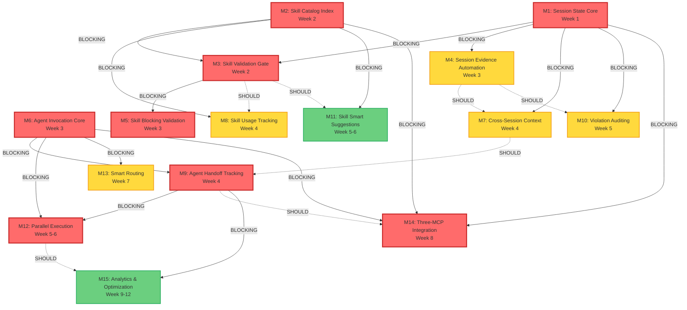

# Three-MCP Implementation Milestone Plan

> **Status**: Draft
> **Version**: 1.0.0
> **Date**: 2025-12-21
> **Planner Agent**: Milestone breakdown with dependencies
> **Based On**:
> - PRD-session-state-mcp.md
> - PRD-skill-catalog-mcp.md
> - PRD-agent-orchestration-mcp.md
> - 2025-12-21-mcp-prd-review.md (Critic Review)

---

## Executive Summary

This milestone plan implements the Three-MCP Strategy for the ai-agents project, delivering:

1. **Session State MCP** - 100% session protocol compliance through BLOCKING gates
2. **Skill Catalog MCP** - Zero skill violations through automated validation
3. **Agent Orchestration MCP** - 40% time savings through parallel execution without conflicts

**Timeline**: 12 weeks (3 months)
**Critical Path**: Session State Phase 1 → Skill Catalog Phase 2 → Agent Orchestration Phase 3
**Total Effort**: 164-228 hours (implementer), 40-56 hours (supporting roles)

**Key Success Criteria**:
- Session End compliance: 4.2% → 100%
- Skill violations: 5+/session → 0/session
- HANDOFF conflicts in parallel: 100% → 0%

---

## 1. Milestone Overview

| # | Milestone | Target Week | Primary Deliverable | Owner | Status |
|---|-----------|-------------|---------------------|-------|--------|
| M1 | Session State Core | Week 1 | State machine with BLOCKING gates | Implementer | Pending |
| M2 | Skill Catalog Index | Week 2 | Unified skill search across repos | Implementer | Pending |
| M3 | Skill Validation Gate | Week 2 | BLOCKING gate for raw commands | Implementer | Pending |
| M4 | Session Evidence Automation | Week 3 | Auto-evidence collection | Implementer | Pending |
| M5 | Skill Blocking Validation | Week 3 | Parameter-aware blocking | Implementer | Pending |
| M6 | Agent Invocation Core | Week 3 | Type-safe agent calls | Implementer | Pending |
| M7 | Cross-Session Context | Week 4 | Session history preservation | Implementer | Pending |
| M8 | Skill Usage Tracking | Week 4 | Citation system with analytics | Implementer | Pending |
| M9 | Agent Handoff Tracking | Week 4 | Structured context passing | Implementer | Pending |
| M10 | Violation Auditing | Week 5 | Force override logging | Implementer | Pending |
| M11 | Skill Suggestions | Week 5-6 | Context-aware skill search | Analyst + Implementer | Pending |
| M12 | Parallel Execution | Week 5-6 | Zero-conflict parallel agents | Implementer + Security | Pending |
| M13 | Smart Routing | Week 7 | AI-assisted workflow routing | Analyst + Implementer | Pending |
| M14 | Three-MCP Integration | Week 8 | Full integration validation | Implementer + QA | Pending |
| M15 | Analytics & Optimization | Week 9-12 | Historical analytics | Analyst + Implementer | Pending |

---

## 2. Milestone Details

### M1: Session State Core State Machine

**Week**: 1
**Phase**: Session State MCP Phase 1
**Priority**: P0 (CRITICAL - Foundational)

#### Goals

1. Establish BLOCKING gate pattern proven to achieve 100% compliance
2. Implement state machine tracking session phases (INIT → READY → WORKING → COMPLETE)
3. Integrate with Serena MCP for state persistence with file-based fallback
4. Provide real-time validation preventing phase advancement until requirements met
5. Enable verification-based enforcement replacing trust-based guidance

#### Deliverables

- `@ai-agents/session-state-mcp` TypeScript package
- Tools: `session_start()`, `validate_gate()`, `advance_phase()`
- Resources: `session://state`, `session://checklist`
- Serena integration: `session-current-state` memory with file fallback
- State machine per ADR-011 specification

#### Acceptance Criteria

- [ ] `session_start()` initializes state and returns blocked phases list
- [ ] `advance_phase("SERENA_INIT")` blocks if Serena MCP unavailable
- [ ] `validate_gate("CONTEXT_RETRIEVAL")` checks HANDOFF.md read evidence
- [ ] State persists to Serena memory on every transition
- [ ] **CRITICAL**: File-based fallback tested with Serena unavailable (`.agents/sessions/.session-state.json`)
- [ ] Integration test: State recovers from Serena memory corruption
- [ ] Integration test: Full lifecycle (INIT → READY → WORKING → COMPLETE) passes
- [ ] Manual test: Session 44 (known good) passes all gates
- [ ] Unit tests: All state transitions (15+ test cases)

#### Dependencies

**Blockers**: None (foundational milestone)

**Integrations**:
- Serena MCP (required for persistence, graceful fallback on unavailability)
- SESSION-PROTOCOL.md (canonical gate definitions)

#### Effort Estimate

- Implementation: 16-24 hours
- Testing: 4-6 hours
- **Total**: 20-30 hours

#### Risk Factors

| Risk | Mitigation | Owner |
|------|------------|-------|
| **Serena fallback doesn't preserve cross-session context** | Validate fallback format includes `session-history` (not just current state) | Implementer |
| **State machine bugs cause gate bypass** | Comprehensive unit tests + state snapshots for rollback | Implementer |
| **Performance regression (>500ms validation)** | Benchmark requirements, async validation where possible | Implementer |

---

### M2: Skill Catalog Index & Search

**Week**: 2
**Phase**: Skill Catalog MCP Phase 0-1
**Priority**: P0 (CRITICAL - Enables M3)

#### Goals

1. Unify skill discovery across `.claude/skills/` (executable) and `.agents/skills/` (learned)
2. Build semantic search with relevance scoring for "find skills by capability"
3. Persist index to Serena with in-memory fallback
4. Provide foundation for validation gate (M3) and suggestions (M11)

#### Deliverables

- `@ai-agents/skill-catalog-mcp` TypeScript package
- Tools: `search_skills()`, `get_skill()`
- Resources: `skills://catalog`, `skills://categories`
- Index schema with `id`, `type`, `category`, `statement`, `location`, `search_tokens`
- Serena integration: `skill-catalog-index` memory

#### Acceptance Criteria

- [ ] Index parses all `.claude/skills/**/SKILL.md` and PowerShell scripts
- [ ] Index parses all `.agents/skills/*.md` Skill-* entries
- [ ] `search_skills(query="pr comment")` returns `Post-PRCommentReply.ps1` in top 3
- [ ] `search_skills(query="lint")` returns all `Skill-Lint-*` skills
- [ ] `get_skill(id="github/pr/Get-PRContext")` returns full definition with parameters
- [ ] Search completes in <500ms for index of 50 skills
- [ ] Index rebuild completes in <5 seconds
- [ ] Index persisted to Serena memory, rebuilt if >24 hours old
- [ ] Unit tests: Search scoring algorithm (10+ test cases)
- [ ] Integration test: Real skill files indexed correctly

#### Dependencies

**Blockers**: None (runs parallel with M1)

**Integrations**:
- Serena MCP (required for index persistence)
- `.claude/skills/` directory structure
- `.agents/skills/` markdown format

#### Effort Estimate

- Implementation: 12-16 hours
- Testing: 4-6 hours
- **Total**: 16-22 hours

#### Risk Factors

| Risk | Mitigation | Owner |
|------|------------|-------|
| **Index staleness (new skills not detected)** | 24-hour TTL + file watcher trigger (Phase 2) | Implementer |
| **Parsing failures break index build** | Graceful degradation: log error, skip file, continue | Implementer |
| **Search precision <90% (irrelevant results)** | Refine weighted scoring (id: 1.0, statement: 0.9, context: 0.8) | Implementer |

---

### M3: Skill Validation Gate (Phase 1.5)

**Week**: 2
**Phase**: Session State MCP Phase 1.5 + Skill Catalog MCP Phase 2
**Priority**: P0 (CRITICAL - Blocker for M5)

#### Goals

1. Integrate Skill Catalog MCP with Session State MCP for SKILL_VALIDATION phase
2. Implement `check_skill_exists()` tool with capability map
3. Enable BLOCKING gate preventing raw commands when skills exist
4. Establish parameter-aware matching to reduce false positives <5%
5. Require `replaces_command` metadata in all executable skills

#### Deliverables

- Session State MCP: `SKILL_VALIDATION` phase in state machine
- Skill Catalog MCP: `check_skill_exists()` tool
- Capability map for GitHub operations (gh pr view, gh pr comment, gh issue edit, etc.)
- Schema validation: `replaces_command` REQUIRED in SKILL.md
- Pre-commit hook: Validate skills have `replaces_command`

#### Acceptance Criteria

- [ ] `check_skill_exists(operation="gh", subcommand="pr view")` returns `exists: true, blocking: true, skill_id: "github/pr/Get-PRContext"`
- [ ] `check_skill_exists(operation="gh", subcommand="pr view --json customField")` returns `exists: true, blocking: false, warning: "Partial match"`
- [ ] **CRITICAL**: Parameter-aware matching: `gh pr view` blocked, `gh pr view --json custom` not blocked
- [ ] **CRITICAL**: All executable skills have `replaces_command` (schema validation fails if missing)
- [ ] Session State MCP invokes `check_skill_exists()` during `SKILL_VALIDATION` phase
- [ ] False positive rate <5% measured against 20 known valid raw commands
- [ ] Integration test: Session State + Skill Catalog coordination
- [ ] Unit tests: Capability map all entries (10+ operations)

#### Dependencies

**Blockers**:
- M1 (Session State Core) MUST complete - provides state machine
- M2 (Skill Index) MUST complete - provides skill lookup

**Integrations**:
- Session State MCP `SKILL_VALIDATION` phase
- Skill Catalog MCP `check_skill_exists()` tool

#### Effort Estimate

- Implementation: 12-16 hours
- Schema validation + pre-commit hook: 4-6 hours
- Testing: 4-6 hours
- **Total**: 20-28 hours

#### Risk Factors

| Risk | Mitigation | Owner |
|------|------------|-------|
| **False positive blocks (legitimate raw commands)** | Parameter-aware matching + confidence-based blocking (>90% confidence to block) | Implementer |
| **Capability map maintenance burden** | Auto-detect via `replaces_command` (REQUIRED field) | Implementer |
| **Developers forget `replaces_command`** | Pre-commit hook blocks merge if missing | Implementer |

---

### M4: Session Evidence Automation

**Week**: 3
**Phase**: Session State MCP Phase 2
**Priority**: P1 (High value - Reduces manual overhead)

#### Goals

1. Auto-detect evidence from tool calls (Serena init, file modifications, git commits)
2. Eliminate manual evidence recording for DOCS_UPDATE, QUALITY_CHECKS, GIT_COMMIT gates
3. Reduce session protocol overhead from 10-15 min to <5 min
4. Run `markdownlint` integration for QUALITY_CHECKS gate

#### Deliverables

- `record_evidence()` tool with types: tool_output, file_path, commit_sha, content_hash
- Auto-detection: Serena tool calls → SERENA_INIT evidence
- File watchers: HANDOFF.md, session log, `.agents/qa/`
- Git integration: `git log` parsing for commits since session start
- `markdownlint-cli2` integration for QUALITY_CHECKS gate

#### Acceptance Criteria

- [ ] `record_evidence("SERENA_INIT", "tool_output", "...")` auto-validates SERENA_INIT gate
- [ ] File modification timestamps detected for DOCS_UPDATE (HANDOFF.md modified → gate passes)
- [ ] `git log` parsing extracts commit SHA for GIT_COMMIT gate
- [ ] `npx markdownlint-cli2 --fix ".agents/**/*.md"` exit code captured for QUALITY_CHECKS
- [ ] Benchmark: `markdownlint` completes in <5s for 100+ files (or fail with subset strategy)
- [ ] Session protocol overhead <5 min (vs 10-15 min manual)
- [ ] Unit tests: Each evidence type (4 types)
- [ ] Integration test: Evidence auto-populates during full session

#### Dependencies

**Blockers**:
- M1 (Session State Core) MUST complete - provides gate validation framework

**Integrations**:
- Serena MCP tool call monitoring
- Git (command execution)
- `markdownlint-cli2` (Node.js package)

#### Effort Estimate

- Implementation: 12-16 hours
- Testing: 4-6 hours
- **Total**: 16-22 hours

#### Risk Factors

| Risk | Mitigation | Owner |
|------|------------|-------|
| **Markdownlint performance >10s** | Subset linting (`.agents/**/*.md` only) or skip SHOULD requirement | Implementer |
| **False negatives (evidence missed)** | Manual `record_evidence()` as fallback | Implementer |
| **File watcher OS differences** | TTL-based polling fallback (5 min) | Implementer |

---

### M5: Skill Blocking Validation

**Week**: 3
**Phase**: Skill Catalog MCP Phase 2 (continuation)
**Priority**: P0 (CRITICAL - Primary goal)

#### Goals

1. Validate BLOCKING gate achieves 0 violations per session (vs current 5+)
2. Test against Session 15 violation examples (3 raw `gh` commands)
3. Measure false positive rate <5% (legitimate raw commands not blocked)
4. Integrate with Session State MCP for session-end validation

#### Deliverables

- `validate_no_raw_commands()` tool for session-end QA check
- Session State integration: Skill violations logged as BLOCKER
- Validation report: Blocked commands, false positives, false negatives
- QA validation: Test against 20 known good + 10 known bad raw commands

#### Acceptance Criteria

- [ ] Session 15 violations prevented: `gh pr view`, `gh pr comment`, `gh issue edit --add-label` all BLOCKED
- [ ] False positive rate <5%: 19+ of 20 known good raw commands allowed
- [ ] False negative rate 0%: All 10 known bad raw commands BLOCKED
- [ ] `validate_no_raw_commands()` returns violations list for session-end check
- [ ] Session State MCP logs skill violations in session evidence
- [ ] Integration test: Full session with skill usage (0 violations)
- [ ] Regression test: Session 15 scenario passes with MCP

#### Dependencies

**Blockers**:
- M3 (Skill Validation Gate) MUST complete - provides `check_skill_exists()`
- M4 (Session Evidence) SHOULD complete - logs violations as evidence

**Integrations**:
- Session State MCP violation logging
- QA agent for session-end validation

#### Effort Estimate

- Testing & Validation: 8-12 hours
- Documentation: 4 hours
- **Total**: 12-16 hours

#### Risk Factors

| Risk | Mitigation | Owner |
|------|------------|-------|
| **False positive rate >5%** | Refine capability map, add confidence threshold | Implementer |
| **Agents bypass MCP validation** | Session-end validation catches violations post-hoc | QA |
| **User frustration with blocking** | Clear error messages with skill usage examples | Implementer |

---

### M6: Agent Invocation Core

**Week**: 3
**Phase**: Agent Orchestration MCP Phase 1
**Priority**: P0 (CRITICAL - Foundational for orchestration)

#### Goals

1. Type-safe agent invocation replacing untyped `Task()` calls
2. Model enforcement per AGENT-SYSTEM.md (Opus for strategic agents)
3. Build agent registry from `src/claude/*.md` and AGENT-SYSTEM.md
4. Enable context enrichment (prior agent output, steering guidance)

#### Deliverables

- `@ai-agents/agent-orchestration-mcp` TypeScript package
- Agent registry parser (18 agents from `src/claude/*.md`)
- `invoke_agent()` tool with parameter validation
- `get_agent_catalog()` tool
- Model enforcement logic (MUST for Opus-required, SHOULD for others)
- `agents://catalog` resource

#### Acceptance Criteria

- [ ] `invoke_agent(agent="implementor", ...)` → Error (typo caught: "implementor" vs "implementer")
- [ ] `invoke_agent(agent="implementer", prompt="...", model_override="haiku")` → Warning (Sonnet recommended)
- [ ] `invoke_agent(agent="high-level-advisor", model_override="sonnet")` → Error (Opus REQUIRED)
- [ ] `get_agent_catalog()` → Returns all 18 agents with metadata
- [ ] `agents://catalog` → JSON with full registry (names, models, delegates_to, called_by)
- [ ] Context enrichment: `invoke_agent(context={prior_output: "..."})` prepends "## Prior Agent Output"
- [ ] **CRITICAL**: MCP functions with only Serena available (no Session State or Skill Catalog)
- [ ] Unit tests: Agent name validation, model enforcement (10+ test cases)

#### Dependencies

**Blockers**: None (runs parallel with M1-M5)

**Integrations**:
- Serena MCP (handoff persistence)
- `src/claude/*.md` agent prompts
- AGENT-SYSTEM.md agent catalog

#### Effort Estimate

- Implementation: 16-24 hours
- Testing: 4-6 hours
- **Total**: 20-30 hours

#### Risk Factors

| Risk | Mitigation | Owner |
|------|------------|-------|
| **Agent prompt file changes (registry staleness)** | TTL cache (5 min) + manual reload command | Implementer |
| **Model override abuse** | Log all overrides + session-end validation | Implementer |
| **Adoption resistance (agents use Task() instead)** | Steering file injection + skill extraction | Orchestrator |

---

### M7: Cross-Session Context Preservation

**Week**: 4
**Phase**: Session State MCP Phase 3
**Priority**: P1 (High value - Context loss is major pain point)

#### Goals

1. Preserve last 10 sessions in `session-history` memory
2. Extract key decisions from session logs for handoff context
3. Provide `session://history` resource for next-session context
4. Enable cross-session context without manual HANDOFF.md parsing

#### Deliverables

- `session_end()` tool with summary extraction
- `session-history` memory updates (rolling window of 10 sessions)
- `session://history` resource
- Key decision extraction from session logs
- Next session recommendations generation

#### Acceptance Criteria

- [ ] `session_end()` appends current session to `session-history` memory
- [ ] `session://history` returns last 10 sessions with summaries (objective, outcome, commit SHA, key decisions)
- [ ] Summary includes "key_decisions" field (array of decisions with rationale)
- [ ] `session-current-state` memory deleted after successful session end
- [ ] Cross-session context preserved: >95% retention (vs current ~60%)
- [ ] Integration test: Three consecutive sessions build history correctly
- [ ] Manual test: Session history provides useful context for next session start

#### Dependencies

**Blockers**:
- M1 (Session State Core) MUST complete - provides `session_end()` framework
- M4 (Evidence Automation) SHOULD complete - provides evidence for summary

**Integrations**:
- Serena MCP (`session-history` memory)
- Session log parsing

#### Effort Estimate

- Implementation: 12-16 hours
- Testing: 4-6 hours
- **Total**: 16-22 hours

#### Risk Factors

| Risk | Mitigation | Owner |
|------|------------|-------|
| **Key decision extraction low quality** | Manual summary fallback, improve extraction in Phase 4 | Implementer |
| **Token bloat (10K+ token history)** | Limit summary to 2000 tokens per session (truncate if exceeded) | Implementer |
| **History doesn't replace HANDOFF.md** | Hybrid approach: History for context, HANDOFF.md for canonical state | Implementer |

---

### M8: Skill Usage Tracking & Analytics

**Week**: 4
**Phase**: Skill Catalog MCP Phase 3
**Priority**: P2 (Medium value - Enables retrospectives)

#### Goals

1. Record skill citations with context for usage analytics
2. Track which skills are used, when, and in what context
3. Identify underutilized skills (candidates for deprecation)
4. Identify high-value skills (maintain and extend)

#### Deliverables

- `cite_skill()` tool
- `skills://usage` resource with analytics
- `skill-usage-citations` memory (Serena)
- Session State integration: Citations included in session log
- Usage metrics: Most cited, never cited, failure rate

#### Acceptance Criteria

- [ ] `cite_skill(skill_id="github/pr/Get-PRContext", context="Fetching PR #50")` persisted to Serena
- [ ] `skills://usage` shows citation count per skill (ranked)
- [ ] `skills://usage` shows never cited skills (for cleanup)
- [ ] Session log includes skill citations in evidence section
- [ ] Citation deduplication: Same skill in same context not cited twice
- [ ] Skill citation rate >80% (citations / total skill invocations)
- [ ] Integration test: Citation recorded + appears in usage resource

#### Dependencies

**Blockers**:
- M2 (Skill Index) MUST complete - provides skill lookup
- M3 (Skill Validation) SHOULD complete - triggers citations

**Integrations**:
- Serena MCP (`skill-usage-citations` memory)
- Session State MCP (if available, include session_id in citations)

#### Effort Estimate

- Implementation: 12-16 hours
- Testing: 4 hours
- **Total**: 16-20 hours

#### Risk Factors

| Risk | Mitigation | Owner |
|------|------------|-------|
| **Low adoption (agents don't cite)** | Auto-cite on skill invocation (detect PowerShell script execution) | Implementer |
| **Citation spam (duplicate entries)** | Deduplication logic (same skill + context within 5 min = 1 citation) | Implementer |
| **Serena unavailability** | In-memory fallback (citations lost on restart, acceptable for analytics) | Implementer |

---

### M9: Agent Handoff Tracking

**Week**: 4
**Phase**: Agent Orchestration MCP Phase 2
**Priority**: P1 (High value - Solves context loss)

#### Goals

1. Structured handoff context (summary, artifacts, decisions, recommendations)
2. 100% handoff context preservation (vs current ~60%)
3. Integration with Session State MCP for invocation tracking
4. Foundation for parallel execution (M12)

#### Deliverables

- `track_handoff()` tool
- `agent-handoff-chain` memory (Serena)
- `agents://history` resource
- Context enrichment in `invoke_agent()` (inject prior_output, artifacts)
- Session State integration: Invocations recorded as evidence

#### Acceptance Criteria

- [ ] `track_handoff(from="analyst", to="planner", context={summary, decisions, artifacts})` persisted to Serena
- [ ] `agents://history` → Last 50 invocations + handoffs
- [ ] `invoke_agent(agent="qa", context={prior_agent: "implementer", prior_output: "..."})` → Prompt includes "## Prior Agent Output"
- [ ] Handoff context includes all required fields (summary, artifacts, decisions, open_questions, recommendations)
- [ ] Handoff context preservation >95% (measured by context size retention)
- [ ] **CRITICAL**: Session State MCP records "AGENT_INVOCATION" evidence on each invoke
- [ ] Integration test: Session State + Agent Orchestration coordination
- [ ] Manual test: Full workflow (analyst → planner → implementer → qa) preserves context

#### Dependencies

**Blockers**:
- M6 (Agent Invocation Core) MUST complete - provides `invoke_agent()` framework
- M7 (Cross-Session Context) SHOULD complete - similar pattern for context preservation

**Integrations**:
- Serena MCP (`agent-handoff-chain` memory)
- Session State MCP (if available, record invocations as evidence)

#### Effort Estimate

- Implementation: 12-16 hours
- Session State integration: 4-6 hours
- Testing: 4 hours
- **Total**: 20-26 hours

#### Risk Factors

| Risk | Mitigation | Owner |
|------|------------|-------|
| **Context bloat (10K+ tokens per handoff)** | Limit context to 2000 tokens per agent (summarize if exceeded) - **CRITICAL** | Implementer |
| **Session State MCP unavailability** | Graceful degradation: skip integration, log warning | Implementer |
| **Agents bypass MCP (use Task() directly)** | Steering file + skill extraction promoting MCP usage | Orchestrator |

---

### M10: Violation Auditing & Integration

**Week**: 5
**Phase**: Session State MCP Phase 4
**Priority**: P2 (Medium value - Retrospective support)

#### Goals

1. Log all force overrides (agents bypassing BLOCKING gates)
2. Provide audit trail for retrospective analysis
3. Integrate with orchestrator for handoff validation
4. Enable skill extraction from violation patterns

#### Deliverables

- `force: true` parameter for `advance_phase()`
- `session-violations-log` memory (Serena)
- `session://violations` resource
- `get_blocked_reason()` tool with actionable fix suggestions
- Orchestrator validation hook
- Violation severity categorization (CRITICAL, WARNING, INFO)

#### Acceptance Criteria

- [ ] `advance_phase(phase="WORKING", force=true)` logs violation with timestamp, phase, requirement
- [ ] `session://violations` returns audit trail with severity categorization
- [ ] `get_blocked_reason()` suggests specific fixes ("Read HANDOFF.md", "Run Serena init")
- [ ] Orchestrator can invoke `validate_gate("QA_VALIDATION")` before accepting handoff
- [ ] Force override rate limited (max 3 per session, logged)
- [ ] Violation recovery tracked (violation log includes "recovery" field)
- [ ] Integration test: Force override logged + recoverable
- [ ] Manual test: Orchestrator rejects handoff if QA_VALIDATION unmet

#### Dependencies

**Blockers**:
- M1 (Session State Core) MUST complete - provides `advance_phase()` framework
- M4 (Evidence Automation) SHOULD complete - provides gate validation

**Integrations**:
- Serena MCP (`session-violations-log` memory)
- Orchestrator agent (validation hook)

#### Effort Estimate

- Implementation: 12-16 hours
- Testing: 4 hours
- **Total**: 16-20 hours

#### Risk Factors

| Risk | Mitigation | Owner |
|------|------------|-------|
| **Force abuse (agents override all gates)** | Rate limit (max 3/session) + retrospective flagging | Implementer |
| **Violation log spam** | Aggregate similar violations (e.g., "HANDOFF.md not updated" x5 → 1 entry with count) | Implementer |
| **No user visibility** | Session log includes violation summary at end | Implementer |

---

### M11: Skill Smart Suggestions

**Week**: 5-6
**Phase**: Skill Catalog MCP Phase 4
**Priority**: P3 (Nice-to-have - Proactive assistance)

#### Goals

1. Context-aware skill recommendations based on task description
2. Detect raw command patterns in `operations_planned` and warn
3. Reduce skill discovery time from 5 min to <30 sec
4. Integrate with orchestrator for pre-delegation suggestions

#### Deliverables

- `suggest_skills()` tool with context analysis
- `skills://suggestions` resource
- Orchestrator integration for pre-delegation suggestions
- Relevance ranking algorithm (exact capability match > category match > keyword overlap)
- Warning detection for raw command patterns

#### Acceptance Criteria

- [ ] `suggest_skills(task="Address PR comments")` returns `Post-PRCommentReply.ps1` as high relevance
- [ ] `suggest_skills(task="Fix null check", operations_planned=["gh pr view"])` warns "Skill github/pr/Get-PRContext exists"
- [ ] Suggestions ranked by relevance (high/medium/low) with reasoning
- [ ] Suggestions cached for performance (<500ms response)
- [ ] Skill discovery time <30 sec (vs current 5 min manual search)
- [ ] Integration test: Orchestrator receives suggestions before delegation
- [ ] Relevance ranking accuracy >70% (measured against 20 known tasks)

#### Dependencies

**Blockers**:
- M2 (Skill Index) MUST complete - provides skill catalog
- M3 (Skill Validation) SHOULD complete - provides capability map

**Integrations**:
- Orchestrator agent (pre-delegation suggestions)
- Agent Orchestration MCP (optional, for smart routing)

#### Effort Estimate

- Implementation: 12-16 hours (analyst: algorithm design, implementer: coding)
- Testing: 4 hours
- **Total**: 16-20 hours

#### Risk Factors

| Risk | Mitigation | Owner |
|------|------------|-------|
| **Low relevance (irrelevant suggestions)** | Refine ranking algorithm, add user feedback loop | Analyst |
| **Suggestion spam (too many low-confidence results)** | Limit to top 5, filter by confidence >50% | Implementer |
| **Orchestrator doesn't use suggestions** | Steering file + skill extraction | Orchestrator |

---

### M12: Parallel Execution & Conflict Resolution

**Week**: 5-6
**Phase**: Agent Orchestration MCP Phase 3
**Priority**: P1 (High value - 40% time savings)

#### Goals

1. Execute agents in parallel without HANDOFF.md conflicts
2. Achieve 40% time savings (vs sequential execution)
3. Detect conflicts (contradictory recommendations, overlapping artifacts)
4. Resolve conflicts via vote/escalate/manual strategies
5. Zero HANDOFF conflicts (vs current 100% conflict rate)

#### Deliverables

- `start_parallel_execution()` tool
- `aggregate_parallel_results()` tool
- `resolve_conflict()` tool
- Parallel execution state management (`agent-parallel-state` memory)
- Conflict detection algorithm (text similarity, file overlap, decision contradiction)
- `agents://active` resource

#### Acceptance Criteria

- [ ] `start_parallel_execution([{agent: "architect"}, {agent: "security"}])` → Both agents start with unique parallel_id
- [ ] Parallel agents do NOT update HANDOFF.md directly
- [ ] `aggregate_parallel_results(parallel_id)` detects conflicts if agents disagree
- [ ] `resolve_conflict(parallel_id, conflict_id, strategy="vote")` → Majority recommendation selected
- [ ] `agents://active` shows running parallel executions
- [ ] Orchestrator updates HANDOFF.md once after aggregation (0 staging conflicts)
- [ ] **CRITICAL**: Conflict detection algorithm specified (Levenshtein distance >80% = conflict)
- [ ] **CRITICAL**: Parallel timeout behavior: Return partial results after 15 min, mark timed-out agents as "timeout"
- [ ] **CRITICAL**: No agent cancellation on timeout (let agents complete for cache)
- [ ] Parallel execution time savings >40% (measured against sequential baseline)
- [ ] False positive conflict rate <20% (measured against 10 known scenarios)
- [ ] Integration test: Sessions 19-20 scenario (parallel updates) produces 0 HANDOFF conflicts

#### Dependencies

**Blockers**:
- M6 (Agent Invocation Core) MUST complete - provides `invoke_agent()` framework
- M9 (Agent Handoff Tracking) MUST complete - provides handoff context

**Integrations**:
- Serena MCP (`agent-parallel-state` memory)
- HANDOFF.md (orchestrator writes once after aggregation)

#### Effort Estimate

- Implementation: 20-28 hours (implementer + security review for conflict algorithm)
- Testing: 6-8 hours
- **Total**: 26-36 hours

#### Risk Factors

| Risk | Mitigation | Owner |
|------|------------|-------|
| **Conflict detection false positives** | Confidence threshold (>80% to flag), user override for "no conflict" | Implementer |
| **Parallel deadlock (agent A waits for B, B waits for A)** | Validate no inter-dependencies, warn if detected | Implementer |
| **Timeout handling undefined** | Return partial results, mark timeouts, don't cancel agents | Implementer |

---

### M13: Smart Routing & Workflow Assistance

**Week**: 7
**Phase**: Agent Orchestration MCP Phase 4
**Priority**: P3 (Nice-to-have - AI assistance)

#### Goals

1. AI-assisted workflow recommendation (quick-fix, standard, strategic, ideation, impact-analysis)
2. Pattern-based routing heuristics from AGENT-SYSTEM.md
3. Confidence scoring for recommendations
4. Provide alternatives (other workflows considered)

#### Deliverables

- `get_routing_recommendation()` tool
- Routing heuristics implementation (from AGENT-SYSTEM.md Section 4)
- `agents://workflows` resource
- Confidence scoring algorithm
- Workflow definitions (5 workflows with agent sequences)

#### Acceptance Criteria

- [ ] `get_routing_recommendation(task="Fix null check in UserService")` → Recommends "quick-fix" workflow (implementer → qa), confidence >80%
- [ ] `get_routing_recommendation(task="Implement OAuth")` → Recommends "standard" workflow (analyst → architect → planner → implementer → qa), confidence >70%
- [ ] `get_routing_recommendation(task="Should we rewrite auth?")` → Recommends "strategic" workflow (independent-thinker → high-level-advisor → task-generator)
- [ ] `agents://workflows` → All 5 workflows with agent sequences
- [ ] Recommendations include reasoning ("Why this workflow") + alternatives
- [ ] Routing accuracy >70% (measured against 20 known tasks)
- [ ] Integration test: Orchestrator receives routing recommendation

#### Dependencies

**Blockers**:
- M6 (Agent Invocation Core) MUST complete - provides agent catalog

**Integrations**:
- AGENT-SYSTEM.md workflow definitions
- Orchestrator agent (receives recommendations)

#### Effort Estimate

- Implementation: 12-16 hours (analyst: heuristics design, implementer: coding)
- Testing: 4 hours
- **Total**: 16-20 hours

#### Risk Factors

| Risk | Mitigation | Owner |
|------|------------|-------|
| **Low accuracy (<70%)** | Refine heuristics, add ML in Phase 6 if pattern matching insufficient | Analyst |
| **Orchestrator doesn't use recommendations** | Steering file + skill extraction | Orchestrator |
| **Workflow drift (AGENT-SYSTEM.md updated, MCP stale)** | TTL cache (5 min) + manual reload command | Implementer |

---

### M14: Three-MCP Integration Validation

**Week**: 8
**Phase**: All MCPs - Integration testing
**Priority**: P0 (CRITICAL - Coordination validation)

#### Goals

1. Validate all three MCPs coordinate correctly (Session State + Skill Catalog + Agent Orchestration)
2. Test HANDOFF.md migration plan (dual-write → MCP-only transition)
3. Create Three-MCP Integration Architecture diagram
4. Establish unified validation schema (ADR-014)
5. Full end-to-end workflow validation

#### Deliverables

- **Appendix F: Three-MCP Integration Architecture** (component diagram, call sequence, error handling)
- **Section 13: HANDOFF.md Migration Plan** (dual-write → orchestrator-only → deprecation decision)
- **ADR-014: Unified Validation Schema** (canonical validation criteria across MCPs + Validate-SessionEnd.ps1)
- Integration tests: All three MCPs active, full session lifecycle
- Coordination failure handling (circuit breaker if failures >5%)
- MCP Integration Dependency Matrix (features vs Serena/Session/Skill availability)

#### Acceptance Criteria

- [ ] **CRITICAL**: Three-MCP Integration Architecture diagram created (shows MCP dependencies, call sequences, error flows)
- [ ] **CRITICAL**: HANDOFF.md Migration Plan defined (Phase 1-2: dual-write, Phase 3: orchestrator-only, Phase 4: deprecation decision after 3 months)
- [ ] **CRITICAL**: ADR-014 created (unified validation schema for Session State, Skill Catalog, Agent Orchestration, Validate-SessionEnd.ps1)
- [ ] Integration test: Full session with all three MCPs active (INIT → WORKING → COMPLETE)
- [ ] Integration test: Session State records agent invocations from Agent Orchestration MCP
- [ ] Integration test: Session State invokes Skill Catalog for SKILL_VALIDATION phase
- [ ] Integration test: Agent Orchestration coordinates parallel execution with Session State tracking
- [ ] Circuit breaker: If Session State MCP fails >5%, Agent Orchestration disables integration
- [ ] Dependency matrix: Document which features require which MCPs (handoff tracking: REQUIRES Serena, OPTIONAL Session State)
- [ ] Serena contention test: All three MCPs write to Serena simultaneously (0 conflicts)
- [ ] Fallback test: Each MCP functions in degraded mode (Serena unavailable)

#### Dependencies

**Blockers**:
- M1 (Session State Core) MUST complete
- M2 (Skill Index) MUST complete
- M6 (Agent Invocation Core) MUST complete
- M9 (Agent Handoff Tracking) SHOULD complete (for full validation)

**Integrations**:
- All three MCPs
- Serena MCP
- Validate-SessionEnd.ps1

#### Effort Estimate

- Architecture documentation: 8-12 hours (architect)
- Integration tests: 12-16 hours (implementer + QA)
- ADR-014 creation: 4-6 hours (architect)
- **Total**: 24-34 hours

#### Risk Factors

| Risk | Mitigation | Owner |
|------|------------|-------|
| **Circular dependencies cause initialization failures** | Document initialization order, test in isolation first | Implementer |
| **HANDOFF.md transition breaks SESSION-PROTOCOL.md** | Dual-write phase ensures redundancy during transition | Architect |
| **Serena contention (three MCPs write simultaneously)** | Batching + async writes, test under load | Implementer |

---

### M15: Analytics & Optimization

**Week**: 9-12
**Phase**: Agent Orchestration MCP Phase 6
**Priority**: P2 (Medium value - Long-term improvement)

#### Goals

1. Historical analytics queries for workflow optimization
2. Workflow success rate tracking
3. Agent duration statistics
4. Handoff context quality scoring
5. Learn from historical patterns to improve routing (future enhancement)

#### Deliverables

- Historical analytics queries (which workflows succeed, which agents take longest, which handoffs lose context)
- Workflow success rate tracking (success/failure per workflow type)
- Agent duration statistics (average time per agent)
- Handoff context quality scoring (context size variance)
- Analytics dashboard (optional visual metrics at `session://dashboard`)

#### Acceptance Criteria

- [ ] Query: "Which workflows have highest success rate?" → Answer with data (e.g., quick-fix: 95%, strategic: 70%)
- [ ] Query: "Which agents take longest on average?" → Answer with data (e.g., architect: 12 min, implementer: 8 min)
- [ ] Query: "Which handoffs lose most context?" → Answer with data (context size variance >30% flags context loss)
- [ ] Workflow success rate >85% for standard workflows (measured over 3 months)
- [ ] Agent duration p95 <15 min (flag outliers for optimization)
- [ ] Handoff context quality score >80% (measured by retention across transitions)
- [ ] Analytics dashboard (optional): Visual metrics at `session://dashboard` or `agents://analytics`

#### Dependencies

**Blockers**:
- M9 (Agent Handoff Tracking) MUST complete - provides handoff data
- M12 (Parallel Execution) SHOULD complete - provides workflow data
- **3 months of usage data** (Phases 1-3 deployed and collecting telemetry)

**Integrations**:
- Serena MCP (historical data)
- Session State MCP (session outcomes)
- Agent Orchestration MCP (workflow patterns)

#### Effort Estimate

- Implementation: 16-20 hours (analyst: queries design, implementer: coding)
- Dashboard (optional): 8-12 hours
- **Total**: 24-32 hours

#### Risk Factors

| Risk | Mitigation | Owner |
|------|------------|-------|
| **Insufficient data (3 months required)** | Defer milestone if <30 sessions collected | Analyst |
| **Analytics not actionable** | Focus on high-value queries (bottlenecks, failures), defer nice-to-haves | Analyst |
| **Dashboard unused** | Optional feature, prioritize queries over visualization | Analyst |

---

## 3. Dependency Graph

**Legend**:
- **Red (Critical Path)**: M1, M2, M3, M5, M6, M9, M12, M14 - Must complete on time
- **Yellow (High Priority)**: M4, M7, M8, M10, M13 - Important for full value
- **Green (Medium Priority)**: M11, M15 - Nice-to-have, can be deferred

**Solid arrows**: BLOCKING dependencies (milestone cannot start until dependency completes)
**Dashed arrows**: SHOULD dependencies (milestone proceeds, but value reduced without dependency)

---

## 4. Critical Path Analysis

### 4.1 Critical Path Sequence

**Week 1**: M1 (Session State Core)
**Week 2**: M2 (Skill Index) → M3 (Skill Validation Gate)
**Week 3**: M5 (Skill Blocking Validation), M6 (Agent Invocation Core)
**Week 4**: M9 (Agent Handoff Tracking)
**Week 5-6**: M12 (Parallel Execution)
**Week 8**: M14 (Three-MCP Integration)

**Total Critical Path Duration**: 8 weeks

**Risk**: Any delay on critical path milestones delays final delivery (M14).

### 4.2 Critical Path Milestones Effort

| Milestone | Effort (hours) | Role | Week |
|-----------|----------------|------|------|
| M1: Session State Core | 20-30 | Implementer | 1 |
| M2: Skill Catalog Index | 16-22 | Implementer | 2 |
| M3: Skill Validation Gate | 20-28 | Implementer | 2 |
| M5: Skill Blocking Validation | 12-16 | Implementer | 3 |
| M6: Agent Invocation Core | 20-30 | Implementer | 3 |
| M9: Agent Handoff Tracking | 20-26 | Implementer | 4 |
| M12: Parallel Execution | 26-36 | Implementer + Security | 5-6 |
| M14: Three-MCP Integration | 24-34 | Implementer + Architect + QA | 8 |
| **TOTAL CRITICAL PATH** | **158-222 hours** | | **8 weeks** |

**Single-threaded timeline**: 158-222 hours ÷ 40 hours/week = **4-6 weeks** (if one implementer full-time)

**Actual timeline**: 8 weeks (parallel work + testing + reviews)

### 4.3 Slack Time Analysis

**Milestones with slack** (can be delayed without impacting critical path):

- **M4** (Session Evidence): 1 week slack (Week 3, not on critical path to M7)
- **M7** (Cross-Session Context): 1 week slack (Week 4, not blocking M9)
- **M8** (Skill Usage Tracking): 2 weeks slack (Week 4, not blocking M11)
- **M10** (Violation Auditing): 3 weeks slack (Week 5, not blocking M14)
- **M11** (Skill Suggestions): 2 weeks slack (Week 5-6, not blocking M13)
- **M13** (Smart Routing): 1 week slack (Week 7, not blocking M14)
- **M15** (Analytics): 4 weeks slack (Week 9-12, deferred milestone)

**Total Slack**: 14 weeks across non-critical milestones

**Risk Management**: Use slack time to absorb delays on critical path (e.g., if M12 takes 3 weeks instead of 2, delay M11 to compensate).

---

## 5. Parallel Work Opportunities

### 5.1 Week 1 (Foundation)

**Primary Work**: M1 (Session State Core)
**Parallel Work**: None (foundational milestone, full focus required)
**Team Composition**: 1 implementer

### 5.2 Week 2 (Index & Validation)

**Primary Work**: M3 (Skill Validation Gate) - CRITICAL PATH
**Parallel Work**: M2 (Skill Index) - CRITICAL PATH (M3 depends on M2, but M2 starts Week 2)
**Team Composition**: 1 implementer (sequential: M2 → M3 within week)

**Opportunity**: If 2 implementers available, M2 (Week 2 start) and M1 finish tasks can overlap.

### 5.3 Week 3 (Validation + Invocation)

**Primary Work**: M5 (Skill Blocking Validation) - CRITICAL PATH
**Parallel Work**:
- M6 (Agent Invocation Core) - CRITICAL PATH (independent, can run in parallel)
- M4 (Session Evidence Automation) - HIGH PRIORITY (independent)

**Team Composition**: 2-3 implementers (M5 + M6 in parallel, M4 optional third)

**Opportunity**: M5 (testing-heavy) can run parallel with M6 (implementation-heavy).

### 5.4 Week 4 (Context & Tracking)

**Primary Work**: M9 (Agent Handoff Tracking) - CRITICAL PATH
**Parallel Work**:
- M7 (Cross-Session Context) - HIGH PRIORITY (independent, same pattern as M9)
- M8 (Skill Usage Tracking) - HIGH PRIORITY (independent)

**Team Composition**: 2-3 implementers (M9 + M7 in parallel, M8 optional third)

**Opportunity**: All three milestones are "tracking/memory" features with similar patterns (Serena integration). Can leverage learnings across milestones.

### 5.5 Week 5-6 (Parallel Execution + Suggestions)

**Primary Work**: M12 (Parallel Execution) - CRITICAL PATH
**Parallel Work**:
- M11 (Skill Smart Suggestions) - MEDIUM PRIORITY (independent)
- M10 (Violation Auditing) - HIGH PRIORITY (independent)

**Team Composition**: 2-3 implementers (M12 requires 2 weeks, M11 + M10 can run in parallel)

**Opportunity**: M12 is complex (26-36 hours), use 2 implementers. M11 (analyst-heavy) can run in parallel with different skillset.

### 5.6 Week 7 (Smart Routing)

**Primary Work**: M13 (Smart Routing) - HIGH PRIORITY
**Parallel Work**: None (M12 buffer if delayed, or M14 prep)
**Team Composition**: 1 analyst + 1 implementer

**Opportunity**: Start M14 prep work (architecture diagrams, ADR-014 drafting).

### 5.7 Week 8 (Integration Validation)

**Primary Work**: M14 (Three-MCP Integration) - CRITICAL PATH
**Parallel Work**: None (all hands on integration testing)
**Team Composition**: 1 implementer + 1 architect + 1 QA

**Opportunity**: Consolidate all prior milestones, full team coordination.

### 5.8 Week 9-12 (Analytics)

**Primary Work**: M15 (Analytics & Optimization) - MEDIUM PRIORITY
**Parallel Work**: Bug fixes, documentation, retrospectives
**Team Composition**: 1 analyst + 1 implementer (part-time)

**Opportunity**: Long runway (4 weeks) allows iterative development based on usage data.

---

## 6. Resource Allocation

### 6.1 Team Composition

| Role | Milestones | Total Effort (hours) | Weeks Active |
|------|------------|----------------------|--------------|
| **Implementer (primary)** | M1, M2, M3, M4, M5, M6, M7, M8, M9, M10, M11, M12, M14, M15 | 164-228 | 1-12 |
| **Implementer (secondary)** | M6, M12 (parallel work) | 40-60 | 3, 5-6 |
| **Analyst** | M11, M13, M15 (algorithm design, heuristics) | 24-32 | 5-7, 9-12 |
| **Architect** | M14 (integration architecture, ADR-014) | 12-18 | 8 |
| **Security** | M12 (conflict algorithm review) | 6-8 | 5-6 |
| **QA** | M5, M14 (validation testing) | 10-14 | 3, 8 |

**Total Team Effort**: 256-360 hours (6-9 person-weeks)

**Calendar Time**: 12 weeks (parallel work + slack time)

### 6.2 Peak Load Weeks

**Week 3** (M4, M5, M6): 52-74 hours (2 implementers required)
**Week 5-6** (M10, M11, M12): 64-92 hours (2 implementers + analyst + security)
**Week 8** (M14): 24-34 hours (implementer + architect + QA)

**Recommendation**: Plan for 2 implementers during Week 3 and Week 5-6 to avoid bottlenecks.

### 6.3 Single-Threaded Fallback

If only 1 implementer available:

**Revised Timeline**: 16-20 weeks (sequential critical path + reduced parallelism)
**Defer**: M11 (Skill Suggestions), M13 (Smart Routing), M15 (Analytics) to post-MVP
**Focus**: M1-M10, M12, M14 (core functionality)

---

## 7. Risk Mitigation Summary

### 7.1 High-Risk Milestones

| Milestone | Risk Level | Primary Risk | Mitigation |
|-----------|------------|--------------|------------|
| M1 | HIGH | Serena fallback doesn't preserve context | Validate fallback in Phase 1.5 (file-based state recovery) |
| M3 | HIGH | False positives block legitimate commands | Parameter-aware matching, confidence threshold >90% |
| M5 | HIGH | False positive rate >5% | Test against 20 known good + 10 known bad commands |
| M12 | HIGH | Conflict detection false positives >20% | Levenshtein distance >80%, user override, 10 scenario validation |
| M14 | HIGH | Three-MCP coordination failures | Integration architecture, circuit breaker, dependency matrix |

### 7.2 Mitigation Strategies

**For M1 (Serena fallback)**:
- Add Phase 1.5 acceptance criteria: "File-based fallback tested with Serena unavailable"
- Specify fallback file format: `.agents/sessions/.session-state.json` + `.session-history.json`
- Add integration test: "State recovers from Serena memory corruption"

**For M3 (False positives)**:
- Require `replaces_command` metadata in all executable skills (pre-commit hook)
- Implement parameter-aware matching (block only if skill supports exact parameter set)
- Add false positive rate validation: <5% against 20 known good commands

**For M5 (Blocking validation)**:
- Test against Session 15 violation examples (3 raw `gh` commands)
- Measure false positive rate <5%, false negative rate 0%
- Integration test: Full session with skill usage (0 violations)

**For M12 (Conflict detection)**:
- Specify algorithm: Levenshtein distance >80% = conflict
- Test against 10 known scenarios (5 true positives, 5 true negatives)
- False positive rate <20% measured against historical parallel sessions

**For M14 (Three-MCP coordination)**:
- Create Three-MCP Integration Architecture diagram (component, call sequence, error flows)
- Define HANDOFF.md Migration Plan (dual-write → orchestrator-only → deprecation)
- Create ADR-014: Unified Validation Schema (canonical criteria across MCPs)
- Test Serena contention (three MCPs write simultaneously, 0 conflicts)

### 7.3 Contingency Plans

**If M1 delayed by 1 week**:
- Delay M3 to Week 3 (uses 1 week slack from M4)
- Impact: M5 delayed to Week 4, M14 delayed to Week 9

**If M12 delayed by 1 week**:
- Use slack from M11 (defer suggestions to Week 7)
- Impact: M14 delayed to Week 9 (still within 12-week timeline)

**If M14 reveals critical integration bugs**:
- Add Week 9 buffer for bug fixes (defer M15 to Week 10-13)
- Impact: Analytics delayed, but core functionality unaffected

---

## 8. Success Metrics & Validation

### 8.1 Milestone Success Criteria

Each milestone MUST achieve acceptance criteria before proceeding to dependent milestones.

**Validation Process**:
1. Implementer completes milestone deliverables
2. Unit tests pass (100% coverage for critical paths)
3. Integration tests pass (where applicable)
4. QA validates acceptance criteria (checklist review)
5. Critic reviews for completeness (if high-risk milestone)
6. Milestone marked COMPLETE, unblocks dependents

### 8.2 Overall Success Metrics (6 months post-launch)

| Metric | Baseline | Target | Milestone Contribution |
|--------|----------|--------|------------------------|
| **Session End compliance** | 4.2% (1 of 24) | 100% | M1, M4, M10 (Session State MCP) |
| **Skill violations** | 5+/session | 0/session | M3, M5 (Skill Catalog MCP) |
| **HANDOFF conflicts (parallel)** | 100% | 0% | M12 (Agent Orchestration MCP) |
| **Handoff context preservation** | ~60% | ≥95% | M9 (Agent Handoff Tracking) |
| **Manual interventions** | 5+/session | <1/session | M1, M3, M9 (all MCPs) |
| **Parallel execution time savings** | 0% (sequential) | ≥40% | M12 (Parallel Execution) |

### 8.3 Intermediate Validation Gates

**Week 4 Gate** (After M1-M9):
- Session State MCP Phase 1-3 deployed and stable (uptime >95%)
- Skill Catalog MCP Phase 1-3 deployed and stable (uptime >95%)
- Agent Orchestration MCP Phase 1-2 deployed and stable (uptime >95%)
- Early metrics: Session End compliance >80%, Skill violations <2/session

**Week 8 Gate** (After M14):
- Three-MCP Integration validated (0 critical bugs)
- HANDOFF.md migration plan initiated (dual-write mode active)
- Unified validation schema (ADR-014) implemented in Validate-SessionEnd.ps1

**Week 12 Gate** (After M15):
- Analytics dashboard deployed (optional)
- Historical data collected (>30 sessions, >50 agent invocations)
- Retrospective analysis identifies optimization opportunities

---

## 9. Communication & Reporting

### 9.1 Weekly Status Updates

**Format**: Markdown report in `.agents/planning/weekly-status-YYYY-MM-DD.md`

**Contents**:
- Milestones completed this week (with acceptance criteria evidence)
- Milestones in progress (% complete, blockers)
- Risks identified (with mitigation actions)
- Next week plan (which milestones starting)

**Audience**: Roadmap agent, high-level-advisor, implementer team

### 9.2 Milestone Completion Reports

**Format**: Session log entry (`.agents/sessions/YYYY-MM-DD-session-NN.md`)

**Contents**:
- Milestone deliverables (links to code, tests, documentation)
- Acceptance criteria validation (checklist with evidence)
- Risks encountered and mitigations applied
- Lessons learned for next milestone

**Audience**: QA agent, critic agent, retrospective agent

### 9.3 Critical Path Dashboard

**Tool**: GitHub Project Board or `.agents/planning/critical-path-status.md`

**Columns**: Pending, In Progress, Blocked, Complete

**Cards**: One card per milestone (M1-M15) with:
- Target week
- Owner
- Status (on-time, delayed, at-risk)
- Blockers (if any)

**Update Frequency**: Daily (for in-progress milestones), weekly (for pending milestones)

---

## 10. Appendix A: Milestone Dependencies Matrix

| Milestone | Depends On (BLOCKING) | Depends On (SHOULD) | Blocks | Blocked By |
|-----------|------------------------|---------------------|--------|------------|
| M1 | None | None | M3, M4, M7, M10, M14 | None |
| M2 | None | None | M3, M8, M11, M14 | None |
| M3 | M1, M2 | None | M5 | None |
| M4 | M1 | None | None | None |
| M5 | M3 | None | None | M3 |
| M6 | None | None | M9, M12, M13, M14 | None |
| M7 | M1 | M4 | None | M1 |
| M8 | M2 | M3 | None | M2 |
| M9 | M6 | M7 | M12, M15 | M6 |
| M10 | M1 | M4 | None | M1 |
| M11 | M2 | M3 | None | M2 |
| M12 | M6, M9 | None | None | M6, M9 |
| M13 | M6 | None | None | M6 |
| M14 | M1, M2, M6 | M9 | None | M1, M2, M6 |
| M15 | M9 | M12 | None | M9 |

**Legend**:
- **BLOCKING**: Milestone cannot start until dependency completes
- **SHOULD**: Milestone proceeds, but value reduced without dependency
- **Blocks**: Which milestones are blocked by this milestone
- **Blocked By**: Which milestones must complete before this can start

---

## 11. Appendix B: Effort Estimation Breakdown

### Session State MCP Effort

| Phase | Milestone | Hours | Week |
|-------|-----------|-------|------|
| Phase 1 | M1: Core State Machine | 20-30 | 1 |
| Phase 1.5 | M3: Skill Validation Gate (partial) | 10-14 | 2 |
| Phase 2 | M4: Evidence Automation | 16-22 | 3 |
| Phase 3 | M7: Cross-Session Context | 16-22 | 4 |
| Phase 4 | M10: Violation Auditing | 16-20 | 5 |
| **TOTAL** | | **78-108 hours** | **1-5** |

### Skill Catalog MCP Effort

| Phase | Milestone | Hours | Week |
|-------|-----------|-------|------|
| Phase 0-1 | M2: Index & Search | 16-22 | 2 |
| Phase 1.5 | M3: Skill Validation Gate (partial) | 10-14 | 2 |
| Phase 2 | M5: Blocking Validation | 12-16 | 3 |
| Phase 3 | M8: Usage Tracking | 16-20 | 4 |
| Phase 4 | M11: Smart Suggestions | 16-20 | 5-6 |
| **TOTAL** | | **70-92 hours** | **2-6** |

### Agent Orchestration MCP Effort

| Phase | Milestone | Hours | Week |
|-------|-----------|-------|------|
| Phase 1 | M6: Agent Invocation Core | 20-30 | 3 |
| Phase 2 | M9: Agent Handoff Tracking | 20-26 | 4 |
| Phase 3 | M12: Parallel Execution | 26-36 | 5-6 |
| Phase 4 | M13: Smart Routing | 16-20 | 7 |
| Phase 5 | M9: Session State Integration (partial) | (included in M9) | 4 |
| Phase 6 | M15: Analytics & Optimization | 24-32 | 9-12 |
| **TOTAL** | | **106-144 hours** | **3-12** |

### Cross-MCP Integration Effort

| Phase | Milestone | Hours | Week |
|-------|-----------|-------|------|
| Integration | M14: Three-MCP Integration | 24-34 | 8 |
| **TOTAL** | | **24-34 hours** | **8** |

### Grand Total Effort

**Implementer (primary)**: 164-228 hours
**Implementer (secondary)**: 40-60 hours
**Analyst**: 24-32 hours
**Architect**: 12-18 hours
**Security**: 6-8 hours
**QA**: 10-14 hours

**GRAND TOTAL**: 256-360 hours (6-9 person-weeks)

---

## 12. Appendix C: Recommended Implementation Sequence (Critic Review)

From `.agents/critique/2025-12-21-mcp-prd-review.md`:

**Critic Recommendation**: Sequential Phase 1 starts to reduce Serena contention risk and allow learning from each MCP deployment.

**Recommended Sequencing**:

| Week | Session State | Skill Catalog | Agent Orchestration |
|------|---------------|---------------|---------------------|
| 1 | Phase 1: Core State Machine | - | - |
| 2 | Phase 1.5: Skill Validation + Phase 2 start | Phase 0-1: Index + Search | - |
| 3 | Phase 2: Evidence Automation | Phase 2: Validation Gate | Phase 1: Core Invocation |
| 4 | Phase 3: Cross-Session Context | Phase 3: Usage Tracking | Phase 2: Handoff Tracking + Session State Integration |
| 5-6 | Phase 4: Violation Auditing | Phase 4: Smart Suggestions | Phase 3: Parallel Execution |
| 7-12 | - | - | Phase 4-6: Routing + Analytics |

**Rationale**: This sequence:
1. Reduces Serena contention (one MCP at a time in Week 1-2)
2. Allows learning from Session State deployment before Skill Catalog
3. Enables Skill Catalog to integrate with Session State Phase 1.5 (Week 2)
4. Delays Agent Orchestration until Session State and Skill Catalog are stable (Week 3)
5. Provides buffer for Agent Orchestration integration (Week 4-8)

**Adopted in this milestone plan**: Yes (milestones sequenced per critic recommendation).

---

## 13. Appendix D: Open Questions Resolution

### From Session State PRD

**Q11.1**: Should `session_start()` auto-invoke Serena init?
**Resolution**: No (keep explicit) - Agents must see Serena tool calls in transcript for verification

**Q11.2**: How to handle mid-session crashes?
**Resolution**: Orphan sessions expire after 24h (simpler than resume logic)

**Q11.3**: Should MCP enforce or just report?
**Resolution**: Report + provide blocking tools (agents need `force` escape hatch)

**Q11.4**: Parallel session handling?
**Resolution**: Block concurrent starts (prevents HANDOFF conflicts, simplifies state management)

### From Skill Catalog PRD

**Q1**: Index refresh strategy?
**Resolution**: Hybrid - file watcher for dev, 24hr TTL for prod

**Q2**: Skill versioning?
**Resolution**: Git-based versioning (current practice), citations include git SHA

**Q3**: Capability map maintenance?
**Resolution**: Auto-detected via `replaces_command` metadata field in SKILL.md (REQUIRED)

**Q4**: Multi-repository support?
**Resolution**: Phase 1 single-repo, Phase 5+ multi-repo via config

**Q5**: Skill deprecation?
**Resolution**: Soft delete with redirect to replacement (JSON format with `replaced_by` field)

### From Agent Orchestration PRD

**Q1**: Routing algorithm - heuristic vs ML?
**Resolution**: Start with pattern matching (Phase 4), add ML in Phase 6 if accuracy <70%

**Q2**: Conflict escalation policy?
**Resolution**: Default to vote, escalate to high-level-advisor if tie, escalate to user if uncertain

**Q3**: Handoff context size limits?
**Resolution**: Defer decision until Phase 2 data available; start with no limit, monitor sizes, set limit at p95 + 20%

**Q4**: Workflow customization?
**Resolution**: Hardcoded only for Phase 4; add user-defined YAML in Phase 6 if users request

**Q5**: Agent prompt file updates?
**Resolution**: TTL cache (5 min) for Phase 1; add file watcher in Phase 2 if staleness issues

**Q6**: Parallel execution timeout?
**Resolution**: 15 minutes default, configurable per invocation; return partial results on timeout, don't cancel agents

**Q7**: HANDOFF.md deprecation timeline?
**Resolution**: Hybrid approach - HANDOFF.md for session summaries, MCP for detailed state; decision after 3 months

---

## 14. Next Steps

### Immediate Actions (Before Implementation)

1. **High-Level-Advisor**: Review and approve milestone plan, confirm risk tolerance (medium recommended)
2. **Explainer Agent**: Address Agent Orchestration MCP blockers from critic review:
   - Create Appendix F: Three-MCP Integration Architecture
   - Create Section 13: HANDOFF.md Migration Plan
   - Specify parallel timeout behavior (FR-4.8-4.9, TR-5.4)
   - Specify conflict detection algorithm (TECH-020-021)
   - Add missing risks (token bloat, recursion, deadlock)
3. **Architect**: Create ADR-014: Unified Validation Schema (canonical criteria across MCPs)
4. **Roadmap Agent**: Integrate milestone plan into project plan, schedule implementer capacity

### Week 1 Kickoff

1. **Implementer**: Start M1 (Session State Core State Machine)
2. **Architect**: Draft Three-MCP Integration Architecture (prep for M14)
3. **QA**: Prepare test scenarios (Session 44 known good, Session 15 violations)

### Ongoing Activities

1. **Weekly status updates**: Every Friday, milestone completion report
2. **Critical path dashboard**: Daily updates for in-progress milestones
3. **Risk monitoring**: Track Serena fallback, false positives, three-MCP coordination
4. **Retrospective**: After M14 (Week 8), analyze learnings and adjust M15 plan

---

## Revision History

| Version | Date | Changes | Author |
|---------|------|---------|--------|
| 1.0.0 | 2025-12-21 | Initial milestone plan creation | Planner Agent |

---

**End of Milestone Plan**
