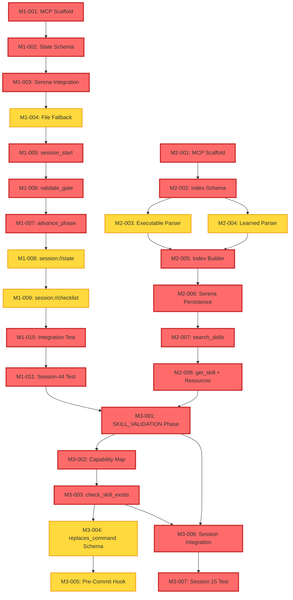

# Three-MCP Phase 1 Task List

> **Status**: Ready for Implementation
> **Version**: 1.1.0
> **Date**: 2025-12-21
> **Updated**: 2025-12-30 (Added GitHub issue references)
> **Phase**: Phase 1 (Milestones M1-M3)
> **Timeline**: Weeks 1-2
> **Based On**: three-mcp-milestone-plan.md
>
> **Parent Issues**:
>
> - [#219](https://github.com/rjmurillo/ai-agents/issues/219): Session State MCP
> - [#220](https://github.com/rjmurillo/ai-agents/issues/220): Skill Catalog MCP
> - [#221](https://github.com/rjmurillo/ai-agents/issues/221): Agent Orchestration MCP

---

## Overview

This document provides atomic, implementable tasks for Phase 1 of the Three-MCP implementation.

### Task Count by Milestone

| Milestone | Task Count | Effort Range | Priority |
|-----------|-----------|--------------|----------|
| M1: Session State Core | 11 tasks | 20-30 hours | P0 (CRITICAL) |
| M2: Skill Catalog Index | 8 tasks | 16-22 hours | P0 (CRITICAL) |
| M3: Skill Validation Gate | 7 tasks | 20-28 hours | P0 (CRITICAL) |
| **TOTAL PHASE 1** | **26 tasks** | **56-80 hours** | **P0** |

### Phase 1 Goals

1. **M1**: Establish BLOCKING gate pattern with state machine for session protocol
2. **M2**: Build unified skill discovery across executable and learned skills
3. **M3**: Integrate skill validation into session protocol with parameter-aware matching

---

## M1: Session State Core (Week 1)

**Milestone Objective**: Create state machine tracking session phases with BLOCKING gates, Serena integration, and file-based fallback.

**Total Effort**: 20-30 hours

---

### Task M1-001: Create MCP TypeScript Scaffold

**GitHub Issue**: [#582](https://github.com/rjmurillo/ai-agents/issues/582)
**Title**: Create TypeScript MCP server scaffold with SDK integration
**Milestone**: M1
**Effort**: 2h
**Priority**: P0

**Description**:
Initialize the Session State MCP project structure using the Model Context Protocol SDK. Set up TypeScript compilation, package.json with dependencies, and basic MCP server entrypoint that registers with Claude Code.

**Acceptance Criteria**:
- [ ] Package `@ai-agents/session-state-mcp` created in TypeScript
- [ ] MCP SDK v1.0+ installed and configured
- [ ] TypeScript compilation works (`npm run build`)
- [ ] MCP server starts and registers with Claude Code
- [ ] Basic health check tool/resource responds

**Files to Create/Modify**:
- `packages/session-state-mcp/package.json`
- `packages/session-state-mcp/tsconfig.json`
- `packages/session-state-mcp/src/index.ts`
- `packages/session-state-mcp/README.md`

**Dependencies**:
- None (foundational task)

---

### Task M1-002: Define State Machine Schema

**GitHub Issue**: [#583](https://github.com/rjmurillo/ai-agents/issues/583)
**Title**: Define state machine schema and phase transitions
**Milestone**: M1
**Effort**: 2h
**Priority**: P0

**Description**:
Create TypeScript interfaces for session state machine per ADR-011. Define state phases (INIT, READY, WORKING, COMPLETE), transitions, gate requirements, and evidence types.

**Acceptance Criteria**:
- [ ] `SessionState` interface includes current_phase, completed_phases, blocked_phases, evidence
- [ ] `SessionPhase` enum defines INIT, READY, WORKING, COMPLETE
- [ ] `GateRequirement` interface defines gate_id, phase, level (MUST/SHOULD), validation_fn
- [ ] State transitions validated (only INIT → READY → WORKING → COMPLETE allowed)
- [ ] Schema validates against SESSION-PROTOCOL.md structure

**Files to Create/Modify**:
- `packages/session-state-mcp/src/types/state.ts`
- `packages/session-state-mcp/src/types/gates.ts`
- `packages/session-state-mcp/src/constants/transitions.ts`

**Dependencies**:
- M1-001 (requires MCP scaffold)

---

### Task M1-003: Implement Serena Integration Layer

**GitHub Issue**: [#584](https://github.com/rjmurillo/ai-agents/issues/584)
**Title**: Implement Serena MCP integration for state persistence
**Milestone**: M1
**Effort**: 3h
**Priority**: P0

**Description**:
Create abstraction layer for Serena memory operations (write_memory, read_memory, edit_memory). Implement state persistence to `session-current-state` memory with graceful degradation if Serena unavailable.

**Acceptance Criteria**:
- [ ] `SerenaClient` class wraps Serena MCP tool calls
- [ ] `persistState()` writes to `session-current-state` memory
- [ ] `restoreState()` reads from `session-current-state` memory
- [ ] `updateState()` uses `edit_memory()` for incremental updates
- [ ] Serena unavailability detected and logged (no crash)
- [ ] Unit test: Mock Serena tool calls

**Files to Create/Modify**:
- `packages/session-state-mcp/src/integrations/serena.ts`
- `packages/session-state-mcp/src/integrations/serena.test.ts`

**Dependencies**:
- M1-002 (requires state schema)

---

### Task M1-004: Implement File-Based Fallback

**Title**: Implement file-based state fallback when Serena unavailable
**Milestone**: M1
**Effort**: 2h
**Priority**: P0

**Description**:
Create file-based persistence fallback writing to `.agents/sessions/.session-state.json`. Ensure state recovery works from file if Serena memory corrupted or unavailable.

**Acceptance Criteria**:
- [ ] `FileBackupClient` class writes to `.agents/sessions/.session-state.json`
- [ ] Fallback activated automatically when Serena unavailable
- [ ] State recovery reads from file if Serena memory missing
- [ ] Integration test: Serena unavailable scenario works
- [ ] Integration test: State recovers from Serena memory corruption

**Files to Create/Modify**:
- `packages/session-state-mcp/src/integrations/file-backup.ts`
- `packages/session-state-mcp/src/integrations/file-backup.test.ts`

**Dependencies**:
- M1-003 (requires Serena integration to test fallback)

---

### Task M1-005: Implement session_start Tool

**Title**: Implement session_start tool initializing state machine
**Milestone**: M1
**Effort**: 3h
**Priority**: P0

**Description**:
Create `session_start()` MCP tool that initializes session state, creates session ID, checks Serena MCP availability, and returns list of blocked phases. Tool must prevent concurrent session starts.

**Acceptance Criteria**:
- [ ] Tool registered in MCP server
- [ ] `session_start()` initializes state with INIT phase
- [ ] Returns `blocked_until` list showing unsatisfied BLOCKING gates
- [ ] Rejects start if another session active (prevents HANDOFF conflicts)
- [ ] State persisted to Serena on successful start
- [ ] Unit test: Concurrent start rejection

**Files to Create/Modify**:
- `packages/session-state-mcp/src/tools/session-start.ts`
- `packages/session-state-mcp/src/tools/session-start.test.ts`

**Dependencies**:
- M1-004 (requires persistence layer)

---

### Task M1-006: Implement validate_gate Tool

**Title**: Implement validate_gate tool for gate requirement checking
**Milestone**: M1
**Effort**: 3h
**Priority**: P0

**Description**:
Create `validate_gate()` tool that checks if specific gate requirements met. Implement validation functions for SERENA_INIT (check Serena MCP available) and CONTEXT_RETRIEVAL (check HANDOFF.md read evidence).

**Acceptance Criteria**:
- [ ] Tool accepts `gate_id` parameter (SERENA_INIT, CONTEXT_RETRIEVAL, etc.)
- [ ] Returns `{ passed: boolean, message: string, evidence: any }`
- [ ] SERENA_INIT validation checks Serena MCP availability
- [ ] CONTEXT_RETRIEVAL validation checks HANDOFF.md read timestamp
- [ ] Validation completes in <500ms for local checks
- [ ] Unit test: All gate validation functions

**Files to Create/Modify**:
- `packages/session-state-mcp/src/tools/validate-gate.ts`
- `packages/session-state-mcp/src/validators/gates.ts`
- `packages/session-state-mcp/src/tools/validate-gate.test.ts`

**Dependencies**:
- M1-005 (requires session state initialization)

---

### Task M1-007: Implement advance_phase Tool

**Title**: Implement advance_phase tool with BLOCKING gate checks
**Milestone**: M1
**Effort**: 3h
**Priority**: P0

**Description**:
Create `advance_phase()` tool that validates all BLOCKING gates for target phase before advancing. Tool must block advancement if requirements unmet and return specific blocked reasons.

**Acceptance Criteria**:
- [ ] Tool accepts `phase` parameter (READY, WORKING, COMPLETE)
- [ ] Validates all BLOCKING gates for target phase
- [ ] Returns `{ success: false, blocked_by: [...] }` if gates unmet
- [ ] Returns `{ success: true }` if all gates passed
- [ ] State transition persisted to Serena on success
- [ ] Unit test: Blocked advancement with specific reasons
- [ ] Unit test: Successful advancement with all gates passed

**Files to Create/Modify**:
- `packages/session-state-mcp/src/tools/advance-phase.ts`
- `packages/session-state-mcp/src/tools/advance-phase.test.ts`

**Dependencies**:
- M1-006 (requires gate validation)

---

### Task M1-008: Implement session://state Resource

**Title**: Implement session://state resource returning current state
**Milestone**: M1
**Effort**: 2h
**Priority**: P0

**Description**:
Create `session://state` MCP resource that returns current session state JSON (phase, completed phases, blocked phases, evidence). Must return in <100ms.

**Acceptance Criteria**:
- [ ] Resource registered in MCP server
- [ ] Returns current state as JSON
- [ ] Includes current_phase, completed_phases, blocked_phases, evidence
- [ ] Response time <100ms (benchmark verified)
- [ ] Unit test: State resource returns correct format

**Files to Create/Modify**:
- `packages/session-state-mcp/src/resources/state.ts`
- `packages/session-state-mcp/src/resources/state.test.ts`

**Dependencies**:
- M1-007 (requires state transitions working)

---

### Task M1-009: Implement session://checklist Resource

**Title**: Implement session://checklist resource with protocol requirements
**Milestone**: M1
**Effort**: 2h
**Priority**: P0

**Description**:
Create `session://checklist` resource that returns checklist of all gates with completion status. Format matches SESSION-PROTOCOL.md checklist structure for human readability.

**Acceptance Criteria**:
- [ ] Resource returns markdown checklist format
- [ ] Each gate shows `[x]` if complete, `[ ]` if incomplete
- [ ] Includes MUST/SHOULD/MAY requirement levels
- [ ] Checklist matches SESSION-PROTOCOL.md structure
- [ ] Unit test: Checklist format validation

**Files to Create/Modify**:
- `packages/session-state-mcp/src/resources/checklist.ts`
- `packages/session-state-mcp/src/resources/checklist.test.ts`

**Dependencies**:
- M1-008 (similar resource pattern)

---

### Task M1-010: Integration Test - Full Session Lifecycle

**Title**: Create integration test for complete session lifecycle
**Milestone**: M1
**Effort**: 2h
**Priority**: P0

**Description**:
Build end-to-end integration test simulating full session lifecycle (INIT → READY → WORKING → COMPLETE). Validate all state transitions, gate checks, and persistence operations work together.

**Acceptance Criteria**:
- [ ] Test initializes session via `session_start()`
- [ ] Test validates SERENA_INIT gate blocks advancement
- [ ] Test advances through all phases successfully
- [ ] Test verifies state persisted to Serena at each transition
- [ ] Test verifies file fallback if Serena unavailable
- [ ] Integration test passes with real MCP server instance

**Files to Create/Modify**:
- `packages/session-state-mcp/tests/integration/lifecycle.test.ts`
- `packages/session-state-mcp/tests/fixtures/mock-serena.ts`

**Dependencies**:
- M1-009 (requires all tools/resources implemented)

---

### Task M1-011: Manual Test - Session 44 Validation

**Title**: Validate known-good Session 44 passes all gates
**Milestone**: M1
**Effort**: 1h
**Priority**: P0

**Description**:
Run Session State MCP against Session 44 (2025-12-20, known 100% compliant session) and verify all gates pass. Document any discrepancies between MCP validation and manual checklist.

**Acceptance Criteria**:
- [ ] Session 44 log analyzed for gate evidence
- [ ] All BLOCKING gates marked complete in MCP
- [ ] MCP checklist matches manual Session 44 checklist
- [ ] No false negatives (gates marked incomplete when actually complete)
- [ ] Test results documented in milestone completion report

**Files to Create/Modify**:
- `packages/session-state-mcp/tests/manual/session-44-validation.md`

**Dependencies**:
- M1-010 (requires working MCP implementation)

---

## M2: Skill Catalog Index (Week 2)

**Milestone Objective**: Build unified skill index across `.claude/skills/` and `.agents/skills/`, implement semantic search, and persist to Serena.

**Total Effort**: 16-22 hours

---

### Task M2-001: Create Skill Catalog MCP Scaffold

**Title**: Create TypeScript MCP server scaffold for Skill Catalog
**Milestone**: M2
**Effort**: 2h
**Priority**: P0

**Description**:
Initialize Skill Catalog MCP project structure using MCP SDK. Set up TypeScript compilation, dependencies, and basic MCP server registration. Similar to M1-001 but for Skill Catalog.

**Acceptance Criteria**:
- [ ] Package `@ai-agents/skill-catalog-mcp` created in TypeScript
- [ ] MCP SDK v1.0+ installed
- [ ] TypeScript compilation works
- [ ] MCP server starts and registers with Claude Code
- [ ] Basic health check responds

**Files to Create/Modify**:
- `packages/skill-catalog-mcp/package.json`
- `packages/skill-catalog-mcp/tsconfig.json`
- `packages/skill-catalog-mcp/src/index.ts`
- `packages/skill-catalog-mcp/README.md`

**Dependencies**:
- None (runs parallel with M1)

---

### Task M2-002: Define Skill Index Schema

**Title**: Define skill index schema and data structures
**Milestone**: M2
**Effort**: 2h
**Priority**: P0

**Description**:
Create TypeScript interfaces for skill catalog index. Define skill types (executable vs learned), required/optional fields, and search token structure per PRD specification.

**Acceptance Criteria**:
- [ ] `SkillIndex` interface with id, type, category, statement, location, search_tokens
- [ ] `ExecutableSkill` interface extends with parameters, script_path
- [ ] `LearnedSkill` interface extends with atomicity, evidence, impact
- [ ] `SkillType` enum: executable, learned
- [ ] Schema validation functions for required fields

**Files to Create/Modify**:
- `packages/skill-catalog-mcp/src/types/skill.ts`
- `packages/skill-catalog-mcp/src/types/index.ts`
- `packages/skill-catalog-mcp/src/validation/schema.ts`

**Dependencies**:
- M2-001 (requires MCP scaffold)

---

### Task M2-003: Implement Executable Skill Parser

**Title**: Implement parser for .claude/skills/ executable skills
**Milestone**: M2
**Effort**: 3h
**Priority**: P0

**Description**:
Create parser that reads SKILL.md files and PowerShell scripts from `.claude/skills/` directory. Extract metadata, parameters from PowerShell param() blocks, and synopsis from comment-based help.

**Acceptance Criteria**:
- [ ] Parser reads all `.claude/skills/**/SKILL.md` files
- [ ] Parser extracts name, description, allowed-tools from SKILL.md frontmatter
- [ ] Parser reads associated PowerShell scripts
- [ ] Parser extracts parameters from PowerShell `param()` blocks
- [ ] Parser extracts synopsis from comment-based help
- [ ] Unit test: Parse Get-PRContext.ps1 correctly

**Files to Create/Modify**:
- `packages/skill-catalog-mcp/src/parsers/executable-skill.ts`
- `packages/skill-catalog-mcp/src/parsers/executable-skill.test.ts`

**Dependencies**:
- M2-002 (requires schema definition)

---

### Task M2-004: Implement Learned Skill Parser

**Title**: Implement parser for .agents/skills/ learned skills
**Milestone**: M2
**Effort**: 2h
**Priority**: P0

**Description**:
Create parser that reads `.agents/skills/*.md` files and extracts individual Skill-* entries. Parse YAML-like structure for id, statement, context, evidence, atomicity, and tags.

**Acceptance Criteria**:
- [ ] Parser reads all `.agents/skills/*.md` files
- [ ] Parser identifies individual Skill-* sections
- [ ] Parser extracts statement, context, atomicity, evidence, impact, tags
- [ ] Parser handles missing optional fields gracefully
- [ ] Unit test: Parse Skill-Lint-001 correctly

**Files to Create/Modify**:
- `packages/skill-catalog-mcp/src/parsers/learned-skill.ts`
- `packages/skill-catalog-mcp/src/parsers/learned-skill.test.ts`

**Dependencies**:
- M2-002 (requires schema definition)

---

### Task M2-005: Implement Index Builder

**Title**: Implement index builder combining all skill sources
**Milestone**: M2
**Effort**: 3h
**Priority**: P0

**Description**:
Create index builder that orchestrates executable and learned skill parsers, combines results into unified index, detects duplicates, and tokenizes search fields. Must complete rebuild in <5 seconds for 50 skills.

**Acceptance Criteria**:
- [ ] `buildIndex()` invokes all parsers
- [ ] Combines results into single `SkillIndex[]`
- [ ] Tokenizes search fields (splits on whitespace, CamelCase, hyphens)
- [ ] Detects and errors on duplicate skill IDs
- [ ] Rebuild completes in <5 seconds (benchmark)
- [ ] Unit test: Index deduplication, tokenization

**Files to Create/Modify**:
- `packages/skill-catalog-mcp/src/index/builder.ts`
- `packages/skill-catalog-mcp/src/index/tokenizer.ts`
- `packages/skill-catalog-mcp/src/index/builder.test.ts`

**Dependencies**:
- M2-003, M2-004 (requires both parsers)

---

### Task M2-006: Implement Serena Persistence

**Title**: Implement Serena integration for index persistence
**Milestone**: M2
**Effort**: 2h
**Priority**: P0

**Description**:
Integrate with Serena MCP to persist index to `skill-catalog-index` memory. Implement staleness detection (24hr TTL or file modification check) and rebuild triggers.

**Acceptance Criteria**:
- [ ] Index written to Serena memory `skill-catalog-index` as JSON
- [ ] Index restored from Serena memory on MCP start
- [ ] Staleness detected if memory >24 hours old
- [ ] Staleness detected if skill file modified since index built
- [ ] Rebuild triggered automatically when stale
- [ ] Unit test: Staleness detection logic

**Files to Create/Modify**:
- `packages/skill-catalog-mcp/src/integrations/serena.ts`
- `packages/skill-catalog-mcp/src/integrations/serena.test.ts`

**Dependencies**:
- M2-005 (requires index builder)

---

### Task M2-007: Implement search_skills Tool

**Title**: Implement search_skills tool with relevance scoring
**Milestone**: M2
**Effort**: 3h
**Priority**: P0

**Description**:
Create `search_skills()` tool with weighted field scoring (id: 1.0, statement: 0.9, context: 0.8, tags: 0.7, evidence: 0.5). Implement filtering by category, type, and capability. Search must complete in <500ms.

**Acceptance Criteria**:
- [ ] Tool accepts `query`, `category`, `type`, `limit` parameters
- [ ] Weighted field scoring implemented per PRD
- [ ] Results ranked by relevance (0-100 score)
- [ ] Default limit 10 results
- [ ] Search completes in <500ms (benchmark)
- [ ] Unit test: Search scoring algorithm (10+ test cases)

**Files to Create/Modify**:
- `packages/skill-catalog-mcp/src/tools/search-skills.ts`
- `packages/skill-catalog-mcp/src/search/scorer.ts`
- `packages/skill-catalog-mcp/src/tools/search-skills.test.ts`

**Dependencies**:
- M2-006 (requires persisted index)

---

### Task M2-008: Implement get_skill Tool and Resources

**Title**: Implement get_skill tool and skills:// resources
**Milestone**: M2
**Effort**: 2h
**Priority**: P0

**Description**:
Create `get_skill()` tool for full skill retrieval by ID. Implement `skills://catalog` and `skills://categories` resources. All operations must return in <100ms.

**Acceptance Criteria**:
- [ ] `get_skill(id)` returns full skill definition
- [ ] Tool returns error if skill ID not found
- [ ] `skills://catalog` resource returns full index JSON
- [ ] `skills://categories` resource returns category hierarchy with counts
- [ ] All resources respond in <100ms (benchmark)
- [ ] Unit test: Retrieval by ID, error handling

**Files to Create/Modify**:
- `packages/skill-catalog-mcp/src/tools/get-skill.ts`
- `packages/skill-catalog-mcp/src/resources/catalog.ts`
- `packages/skill-catalog-mcp/src/resources/categories.ts`
- `packages/skill-catalog-mcp/src/tools/get-skill.test.ts`

**Dependencies**:
- M2-007 (similar tool pattern)

---

## M3: Skill Validation Gate (Week 2)

**Milestone Objective**: Integrate Skill Catalog with Session State for SKILL_VALIDATION phase, implement parameter-aware blocking, and require replaces_command metadata.

**Total Effort**: 20-28 hours

---

### Task M3-001: Add SKILL_VALIDATION Phase to Session State

**Title**: Add SKILL_VALIDATION phase to Session State MCP state machine
**Milestone**: M3
**Effort**: 2h
**Priority**: P0

**Description**:
Extend Session State MCP state machine to include SKILL_VALIDATION phase between CONTEXT_RETRIEVAL and SESSION_LOG phases. Update phase transitions and gate definitions.

**Acceptance Criteria**:
- [ ] `SessionPhase` enum includes SKILL_VALIDATION
- [ ] Transition CONTEXT_RETRIEVAL → SKILL_VALIDATION → SESSION_LOG validated
- [ ] SKILL_VALIDATION gate registered as BLOCKING
- [ ] Phase visible in `session://checklist` resource
- [ ] Unit test: SKILL_VALIDATION phase transitions

**Files to Create/Modify**:
- `packages/session-state-mcp/src/types/state.ts` (update enum)
- `packages/session-state-mcp/src/constants/transitions.ts` (update transitions)
- `packages/session-state-mcp/src/validators/gates.ts` (add SKILL_VALIDATION gate)

**Dependencies**:
- M1-011 (requires Session State MCP complete)
- M2-008 (requires Skill Catalog MCP complete)

---

### Task M3-002: Define Capability Map Schema

**Title**: Define capability map schema for GitHub operations
**Milestone**: M3
**Effort**: 2h
**Priority**: P0

**Description**:
Create capability map data structure mapping raw commands (gh pr view, gh pr comment) to skill IDs. Define parameter-aware matching rules to reduce false positives.

**Acceptance Criteria**:
- [ ] `CapabilityMap` interface with operation, subcommand, skill_id, blocking, params
- [ ] Initial map for GitHub operations (gh pr view, gh pr comment, gh issue edit)
- [ ] Parameter-aware matching rules defined (exact params required for blocking)
- [ ] Map stored as JSON configuration file
- [ ] Unit test: Map lookup by operation+subcommand

**Files to Create/Modify**:
- `packages/skill-catalog-mcp/src/types/capability-map.ts`
- `packages/skill-catalog-mcp/src/config/capability-map.json`
- `packages/skill-catalog-mcp/src/validation/capability-map.test.ts`

**Dependencies**:
- M3-001 (requires SKILL_VALIDATION phase defined)

---

### Task M3-003: Implement check_skill_exists Tool

**Title**: Implement check_skill_exists tool with parameter-aware matching
**Milestone**: M3
**Effort**: 4h
**Priority**: P0

**Description**:
Create `check_skill_exists()` tool that validates if skill exists for given operation. Implement parameter-aware matching (block exact matches, warn partial matches). Support gh, git, npm, pwsh operations.

**Acceptance Criteria**:
- [ ] Tool accepts `operation`, `subcommand`, `params` parameters
- [ ] Returns `{ exists: boolean, blocking: boolean, message: string, skill_id: string, usage_example: string }`
- [ ] Exact match blocking: `gh pr view` → `blocking: true`
- [ ] Partial match warning: `gh pr view --json custom` → `blocking: false, warning: "Partial match"`
- [ ] False positive rate <5% measured against 20 known good commands
- [ ] Unit test: All capability map entries (10+ operations)

**Files to Create/Modify**:
- `packages/skill-catalog-mcp/src/tools/check-skill-exists.ts`
- `packages/skill-catalog-mcp/src/validation/parameter-matcher.ts`
- `packages/skill-catalog-mcp/src/tools/check-skill-exists.test.ts`

**Dependencies**:
- M3-002 (requires capability map)

---

### Task M3-004: Add replaces_command Metadata Requirement

**Title**: Add replaces_command metadata field requirement to SKILL.md schema
**Milestone**: M3
**Effort**: 2h
**Priority**: P0

**Description**:
Update SKILL.md schema to require `replaces_command` metadata field. Document field format (operation, subcommand, params). Update existing skills to include field.

**Acceptance Criteria**:
- [ ] SKILL.md schema updated with `replaces_command` REQUIRED field
- [ ] Field format documented (YAML frontmatter)
- [ ] Example SKILL.md files updated (Get-PRContext.ps1, Post-PRCommentReply.ps1)
- [ ] Schema validation rejects SKILL.md without `replaces_command`
- [ ] Documentation updated in `.claude/skills/README.md`

**Files to Create/Modify**:
- `.claude/skills/SKILL-SCHEMA.md`
- `.claude/skills/github/SKILL.md` (update examples)
- `.claude/skills/README.md` (documentation)
- `packages/skill-catalog-mcp/src/validation/schema.ts` (validation)

**Dependencies**:
- M3-003 (requires capability map understanding)

---

### Task M3-005: Create Pre-Commit Hook for Skill Validation

**Title**: Create pre-commit hook validating replaces_command presence
**Milestone**: M3
**Effort**: 3h
**Priority**: P0

**Description**:
Implement pre-commit hook that validates all SKILL.md files have `replaces_command` field. Hook blocks commit if field missing. Integrate with existing pre-commit configuration.

**Acceptance Criteria**:
- [ ] Hook script validates all `.claude/skills/**/SKILL.md` files
- [ ] Hook fails if `replaces_command` field missing
- [ ] Hook provides clear error message with file path
- [ ] Hook integrated into `.pre-commit-config.yaml` or `.husky/`
- [ ] Hook tested with valid and invalid SKILL.md files

**Files to Create/Modify**:
- `scripts/hooks/validate-skill-metadata.ps1`
- `.pre-commit-config.yaml` or `.husky/pre-commit`
- `scripts/hooks/validate-skill-metadata.test.ps1` (Pester tests)

**Dependencies**:
- M3-004 (requires schema definition)

---

### Task M3-006: Integrate Skill Validation with Session State

**Title**: Integrate check_skill_exists into Session State SKILL_VALIDATION phase
**Milestone**: M3
**Effort**: 3h
**Priority**: P0

**Description**:
Update Session State MCP to invoke Skill Catalog `check_skill_exists()` during SKILL_VALIDATION phase. Store validation results in session evidence. Block phase advancement if violations detected.

**Acceptance Criteria**:
- [ ] Session State MCP invokes `check_skill_exists()` during SKILL_VALIDATION
- [ ] Validation results stored in session evidence
- [ ] `advance_phase(READY)` blocks if skill violations detected
- [ ] Session State provides violation details in blocked_by message
- [ ] Integration test: Session State + Skill Catalog coordination

**Files to Create/Modify**:
- `packages/session-state-mcp/src/validators/skill-validation.ts`
- `packages/session-state-mcp/src/integrations/skill-catalog.ts`
- `packages/session-state-mcp/tests/integration/skill-validation.test.ts`

**Dependencies**:
- M3-003 (requires check_skill_exists tool)
- M3-001 (requires SKILL_VALIDATION phase)

---

### Task M3-007: Validation Test Against Session 15 Violations

**Title**: Validate blocking gate prevents Session 15 violation patterns
**Milestone**: M3
**Effort**: 4h
**Priority**: P0

**Description**:
Create comprehensive test suite validating that capability map blocks all Session 15 violations (3 raw gh commands). Measure false positive rate against 20 known good commands and false negative rate against 10 known bad commands.

**Acceptance Criteria**:
- [ ] Test blocks `gh pr view` (Session 15 violation 1)
- [ ] Test blocks `gh pr comment` (Session 15 violation 2)
- [ ] Test blocks `gh issue edit --add-label` (Session 15 violation 3)
- [ ] False positive rate <5% (19+ of 20 known good commands allowed)
- [ ] False negative rate 0% (all 10 known bad commands blocked)
- [ ] Test results documented in milestone completion report

**Files to Create/Modify**:
- `packages/skill-catalog-mcp/tests/regression/session-15-violations.test.ts`
- `packages/skill-catalog-mcp/tests/fixtures/known-good-commands.json`
- `packages/skill-catalog-mcp/tests/fixtures/known-bad-commands.json`
- `.agents/planning/three-mcp-phase1-test-results.md` (report)

**Dependencies**:
- M3-006 (requires full integration)

---

## Dependency Graph

---

## Suggested Execution Order

### Week 1: M1 Session State Core

**Days 1-2** (Foundation):
1. M1-001: MCP Scaffold (2h)
2. M1-002: State Schema (2h)
3. M1-003: Serena Integration (3h)
4. M1-004: File Fallback (2h)

**Days 3-4** (Core Tools):
5. M1-005: session_start (3h)
6. M1-006: validate_gate (3h)
7. M1-007: advance_phase (3h)

**Day 5** (Resources & Testing):
8. M1-008: session://state (2h)
9. M1-009: session://checklist (2h)
10. M1-010: Integration Test (2h)
11. M1-011: Session 44 Test (1h)

**Total Week 1**: 25 hours

---

### Week 2: M2 Skill Catalog + M3 Validation Gate

**Days 1-2** (Skill Catalog Foundation):
1. M2-001: MCP Scaffold (2h) - **Parallel with M1 Week 1**
2. M2-002: Index Schema (2h)
3. M2-003: Executable Parser (3h)
4. M2-004: Learned Parser (2h)

**Day 3** (Index & Search):
5. M2-005: Index Builder (3h)
6. M2-006: Serena Persistence (2h)
7. M2-007: search_skills (3h)

**Day 4** (Skill Catalog Complete + M3 Start):
8. M2-008: get_skill + Resources (2h)
9. M3-001: SKILL_VALIDATION Phase (2h)
10. M3-002: Capability Map (2h)

**Day 5** (M3 Integration):
11. M3-003: check_skill_exists (4h)
12. M3-004: replaces_command Schema (2h)

**Days 6-7** (M3 Complete):
13. M3-005: Pre-Commit Hook (3h)
14. M3-006: Session Integration (3h)
15. M3-007: Session 15 Test (4h)

**Total Week 2**: 31 hours (M2: 19h, M3: 20h)

---

## Success Criteria Summary

### M1 Success Criteria
- [ ] All 11 tasks completed
- [ ] `session_start()` initializes state, returns blocked phases
- [ ] `advance_phase("READY")` blocks if SERENA_INIT unmet
- [ ] `validate_gate("CONTEXT_RETRIEVAL")` checks HANDOFF.md evidence
- [ ] State persists to Serena on every transition
- [ ] File-based fallback tested with Serena unavailable
- [ ] Integration test: Full lifecycle INIT → COMPLETE passes
- [ ] Manual test: Session 44 passes all gates
- [ ] Unit tests: 15+ test cases for state transitions

### M2 Success Criteria
- [ ] All 8 tasks completed
- [ ] Index parses all `.claude/skills/**/SKILL.md` and scripts
- [ ] Index parses all `.agents/skills/*.md` Skill-* entries
- [ ] `search_skills(query="pr comment")` returns Post-PRCommentReply.ps1 in top 3
- [ ] `search_skills(query="lint")` returns all Skill-Lint-* skills
- [ ] `get_skill(id="github/pr/Get-PRContext")` returns full definition
- [ ] Search completes in <500ms
- [ ] Index rebuild completes in <5 seconds
- [ ] Index persisted to Serena, rebuilt if >24 hours old
- [ ] Unit tests: 10+ test cases for search scoring

### M3 Success Criteria
- [ ] All 7 tasks completed
- [ ] `check_skill_exists(operation="gh", subcommand="pr view")` returns blocking: true
- [ ] Parameter-aware matching: `gh pr view` blocked, `gh pr view --json custom` not blocked
- [ ] All executable skills have `replaces_command` (validated by pre-commit hook)
- [ ] Session State invokes `check_skill_exists()` during SKILL_VALIDATION phase
- [ ] False positive rate <5% (19+ of 20 known good commands)
- [ ] False negative rate 0% (10 of 10 known bad commands blocked)
- [ ] Session 15 violations prevented (3 raw gh commands blocked)
- [ ] Unit tests: 10+ capability map entries validated

---

## Risk Mitigation

### Risk: Serena Fallback Complexity (M1)
**Mitigation**: M1-004 explicitly tests file-based fallback with Serena unavailable scenario

### Risk: Index Staleness (M2)
**Mitigation**: M2-006 implements 24hr TTL + file modification detection

### Risk: False Positives Blocking (M3)
**Mitigation**: M3-003 parameter-aware matching + M3-007 measures false positive rate <5%

### Risk: Schema Validation Enforcement (M3)
**Mitigation**: M3-005 pre-commit hook blocks merge if `replaces_command` missing

---

## Deliverables Checklist

At end of Phase 1, the following must be complete:

### Code Deliverables
- [ ] `@ai-agents/session-state-mcp` package (TypeScript)
- [ ] `@ai-agents/skill-catalog-mcp` package (TypeScript)
- [ ] Session State MCP tools: session_start, validate_gate, advance_phase
- [ ] Session State MCP resources: session://state, session://checklist
- [ ] Skill Catalog MCP tools: search_skills, get_skill, check_skill_exists
- [ ] Skill Catalog MCP resources: skills://catalog, skills://categories
- [ ] Serena integrations for both MCPs
- [ ] File-based fallback for Session State
- [ ] Pre-commit hook for skill metadata validation

### Test Deliverables
- [ ] Unit tests for all tools (30+ test cases)
- [ ] Integration tests for MCP coordination (5+ scenarios)
- [ ] Regression test against Session 15 violations
- [ ] Manual validation against Session 44
- [ ] Performance benchmarks (search <500ms, resources <100ms, rebuild <5s)

### Documentation Deliverables
- [ ] Updated SKILL.md schema with replaces_command requirement
- [ ] capability-map.json documentation
- [ ] Phase 1 test results report
- [ ] Milestone completion reports (M1, M2, M3)

---

## Appendix: Task Estimation Methodology

**Effort Estimates Based On**:
- TypeScript MCP development experience
- Similar tool/resource implementation patterns
- Testing overhead (unit + integration)
- Documentation requirements

**Effort Ranges**:
- 1-2h: Simple tool/resource, clear requirements
- 2-3h: Medium complexity, some integration
- 3-4h: Complex logic, multiple integrations
- 4h+: Testing-heavy, validation-critical

**Total Phase 1 Effort**:
- **Minimum**: 56 hours (optimistic, all tasks at low end)
- **Expected**: 68 hours (realistic, mix of low/high estimates)
- **Maximum**: 80 hours (pessimistic, all tasks at high end)

**Single Implementer Timeline**: 56-80 hours ÷ 40 hours/week = **1.4-2 weeks**
**Actual Timeline**: 2 weeks (allows for reviews, testing, slack)

---

**End of Phase 1 Task List**

---

## Revision History

| Version | Date | Changes | Author |
|---------|------|---------|--------|
| 1.0.0 | 2025-12-21 | Initial Phase 1 task list creation | Task Generator Agent |
