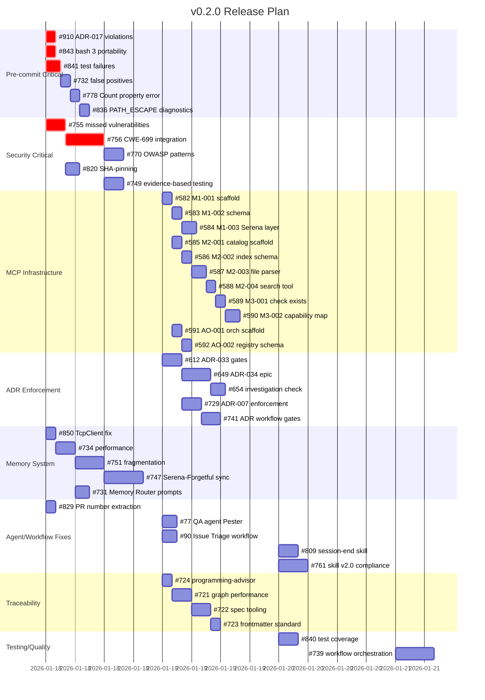

# v0.2.0 Release Plan

## Overview

This plan outlines the work required for the v0.2.0 release. The release focuses on stability, security hardening, and infrastructure improvements to create a polished experience for external evaluators.

**Total Open Issues**: 47 (21 P0 blockers, 26 P1 important)
**Target Audience**: External evaluators assessing the agent system
**Success Criteria**: No broken workflows, no visible bugs, professional appearance

## Issue Summary

### P0 Blockers (21 issues)

These MUST be resolved before release.

| # | Title | Category |
|---|-------|----------|
| 265 | [EPIC] Pre-PR Validation System | Validation |
| 324 | [EPIC] 10x Velocity Improvement: Shift-Left Validation | Validation |
| 582 | M1-001: Create MCP TypeScript Scaffold | MCP Infrastructure |
| 583 | M1-002: Define State Machine Schema | MCP Infrastructure |
| 584 | M1-003: Implement Serena Integration Layer | MCP Infrastructure |
| 585 | M2-001: Create Skill Catalog MCP Scaffold | MCP Infrastructure |
| 586 | M2-002: Define Skill Index Schema | MCP Infrastructure |
| 587 | M2-003: Implement Skill File Parser | MCP Infrastructure |
| 588 | M2-004: Implement search_skills Tool | MCP Infrastructure |
| 589 | M3-001: Implement check_skill_exists Tool | MCP Infrastructure |
| 590 | M3-002: Create Capability Map for GitHub Operations | MCP Infrastructure |
| 591 | AO-001: Create Agent Orchestration MCP Scaffold | MCP Infrastructure |
| 592 | AO-002: Define Agent Registry Schema | MCP Infrastructure |
| 612 | Phase 1: Core ADR-033 Gates | ADR Enforcement |
| 649 | Epic: ADR-034 Investigation Session QA Exemption | ADR Enforcement |
| 654 | Task: Add investigation-only evidence pattern check | ADR Enforcement |
| 729 | ADR-007 Bulletproof Enforcement | ADR Enforcement |
| 741 | Epic: ADR Workflow Enforcement and Quality Gates | ADR Enforcement |
| 755 | [CRITICAL] Security Agent Missed Two Vulnerabilities | Security |
| 756 | Epic: Security Agent Detection Gaps Remediation | Security |
| 829 | fix(agents): Add PR number extraction | Agent Fix |

### P1 Important (26 issues)

Should be resolved for a polished release.

| # | Title | Category |
|---|-------|----------|
| 77 | fix: QA agent cannot run Pester tests | Agent Fix |
| 90 | fix: AI Issue Triage workflow fails | Workflow Fix |
| 721 | feat(traceability): Graph performance optimization | Traceability |
| 722 | feat(traceability): Spec management tooling | Traceability |
| 723 | Standardize spec layer documentation frontmatter | Traceability |
| 724 | Consult programming-advisor on traceability graph | Traceability |
| 731 | Update agent prompts to use Memory Router | Memory |
| 732 | Pre-commit: False E_INVESTIGATION_HAS_IMPL errors | Pre-commit |
| 734 | MemoryRouter performance optimization | Memory |
| 739 | Epic: Workflow Orchestration Enhancement | Workflow |
| 747 | [Phase 2B] Serena-Forgetful Memory Sync | Memory |
| 749 | [Security] Evidence-Based Testing Philosophy | Security |
| 751 | Reconcile memory system fragmentation | Memory |
| 755 | [CRITICAL] Security Agent Missed Vulnerabilities | Security |
| 761 | Systematic skill updates for v2.0 compliance | Skills |
| 770 | feat(security): Add OWASP Agentic Top 10 patterns | Security |
| 778 | bug: Validate-Session.ps1 Count property error | Validation |
| 809 | feat: Create session-end skill | Skills |
| 820 | Formalize SHA-pinning requirement | Security |
| 829 | fix(agents): Add PR number extraction | Agent Fix |
| 836 | Improve E_PATH_ESCAPE error diagnostics | Validation |
| 840 | PR #830 Follow-up: Test Coverage | Testing |
| 841 | fix(tests): 3 pre-existing test failures | Testing |
| 843 | fix(pre-commit): bash 3 portability | Pre-commit |
| 850 | Fix TcpClient.ConnectAsync().Wait() pattern | Memory |
| 910 | Pre-commit hook adds ADR-017-violating sections | Pre-commit |

## Dependency Analysis

### Critical Path 1: Pre-commit Stability

These issues block developer workflow and must be fixed first.

```text
#910 (ADR-017 violations) ──┐
#843 (bash 3 portability) ──┼──> Pre-commit works reliably
#841 (test failures)      ──┤
#732 (false positives)    ──┘
```

### Critical Path 2: Security Remediation

Security issues have external visibility and reputational impact.

```text
#755 (missed vulnerabilities) ──> #756 (CWE-699 integration) ──> #770 (OWASP patterns)
                                          │
                                          └──> #820 (SHA-pinning)
                                          └──> #749 (evidence-based testing)
```

### Critical Path 3: MCP Infrastructure

Sequential scaffold dependencies.

```text
#582 (M1-001) ──> #583 (M1-002) ──> #584 (M1-003)
                          │
#585 (M2-001) ──> #586 (M2-002) ──> #587 (M2-003) ──> #588 (M2-004) ──> #589 (M3-001) ──> #590 (M3-002)
                          │
#591 (AO-001) ──> #592 (AO-002)
```

### Critical Path 4: ADR Enforcement

Governance infrastructure.

```text
#612 (ADR-033 gates) ──> #649 (ADR-034 epic) ──> #654 (investigation check)
         │
         └──> #729 (ADR-007 enforcement)
         └──> #741 (ADR workflow gates)
```

### Critical Path 5: Memory System

Memory consolidation and performance.

```text
#850 (TcpClient fix) ──> #734 (performance) ──> #751 (fragmentation) ──> #747 (sync)
                                    │
                                    └──> #731 (Memory Router prompts)
```

## Gantt Chart



## Execution Order

### Phase 1: Stabilize Core (Day 1)

**Objective**: Make the system usable for developers.

1. **Pre-commit fixes** (parallel):
   - #910 - Fix ADR-017 violations in pre-commit hook
   - #843 - Fix bash 3 portability issues
   - #841 - Fix 3 pre-existing test failures
   - #850 - Fix TcpClient anti-pattern

2. **Critical agent fixes**:
   - #829 - Add PR number extraction
   - #755 - Document security agent gaps (RCA complete)

### Phase 2: Security Hardening (Day 1-2)

**Objective**: Address security gaps before external review.

3. **Security remediation**:
   - #756 - Implement CWE-699 framework (depends on #755)
   - #820 - Formalize SHA-pinning requirement
   - #770 - Add OWASP Agentic Top 10 patterns (depends on #756)
   - #749 - Apply evidence-based testing philosophy

### Phase 3: Validation Infrastructure (Day 2)

**Objective**: Improve validation reliability.

4. **Pre-commit improvements**:
   - #732 - Fix false E_INVESTIGATION_HAS_IMPL errors
   - #778 - Fix Validate-Session.ps1 Count property error
   - #836 - Improve E_PATH_ESCAPE diagnostics

5. **ADR enforcement**:
   - #612 - Implement ADR-033 gates
   - #729 - ADR-007 bulletproof enforcement (depends on #612)
   - #649 - ADR-034 investigation exemption (depends on #612)

### Phase 4: MCP Infrastructure (Day 2-3)

**Objective**: Build MCP scaffolding.

6. **Session State MCP** (sequential):
   - #582 → #583 → #584

7. **Skill Catalog MCP** (sequential):
   - #585 → #586 → #587 → #588 → #589 → #590

8. **Agent Orchestration MCP** (sequential):
   - #591 → #592

### Phase 5: Memory Consolidation (Day 2-3)

**Objective**: Unify memory systems.

9. **Memory improvements**:
   - #734 - MemoryRouter performance (depends on #850)
   - #731 - Update prompts for Memory Router (depends on #734)
   - #751 - Reconcile fragmentation (depends on #734)
   - #747 - Serena-Forgetful sync (depends on #751)

### Phase 6: Polish (Day 3-4)

**Objective**: Final improvements before release.

10. **Agent/workflow fixes**:
    - #77 - Fix QA agent Pester permissions
    - #90 - Fix AI Issue Triage workflow
    - #809 - Create session-end skill
    - #761 - Skill v2.0 compliance updates

11. **Traceability**:
    - #724 → #721 → #722 → #723

12. **Testing/Quality**:
    - #840 - Test coverage improvements
    - #739 - Workflow orchestration epic
    - #654 - Investigation-only check (depends on #649)
    - #741 - ADR workflow gates (depends on #729)

## Risk Assessment

| Risk | Impact | Mitigation |
|------|--------|------------|
| MCP infrastructure delays | High | Can defer to v0.3.0 if not critical for evaluation |
| Security remediation incomplete | Critical | Prioritize #755, #756, #820 as minimum |
| Pre-commit still broken | High | Phase 1 issues are parallel and must complete first |
| Memory system instability | Medium | #850 is quick fix, rest can be incremental |

## Definition of Done

Before declaring v0.2.0 ready:

- [ ] All P0 issues closed or explicitly deferred with justification
- [ ] Pre-commit hook runs without errors on clean repo
- [ ] Security agent detects CWE-22 and CWE-77 patterns
- [ ] Session validation passes on new sessions
- [ ] No workflow failures in CI on main branch
- [ ] README and CLAUDE.md accurate and up-to-date

## Notes for Executing Agent

1. **Start with Phase 1** - Pre-commit stability is critical for all other work
2. **Security is non-negotiable** - #755 and #756 must be addressed before external review
3. **MCP work can be deferred** - If time-constrained, MCP scaffolding (#582-592) can move to v0.3.0
4. **Check issue descriptions** - Each issue has detailed acceptance criteria in its body
5. **Use skills when available** - Check `.claude/skills/github/` before writing custom code
6. **Follow session protocol** - Create session logs per `.agents/SESSION-PROTOCOL.md`

## References

- [GitHub Milestone](https://github.com/rjmurillo/ai-agents/milestone/1)
- [P0 Issues Query](https://github.com/rjmurillo/ai-agents/issues?q=is%3Aissue+state%3Aopen+label%3Apriority%3AP0+milestone%3A0.2.0)
- [P1 Issues Query](https://github.com/rjmurillo/ai-agents/issues?q=is%3Aissue+state%3Aopen+label%3Apriority%3AP1+milestone%3A0.2.0)
- [Session Protocol](./../SESSION-PROTOCOL.md)
- [Agent System](./../AGENT-SYSTEM.md)
