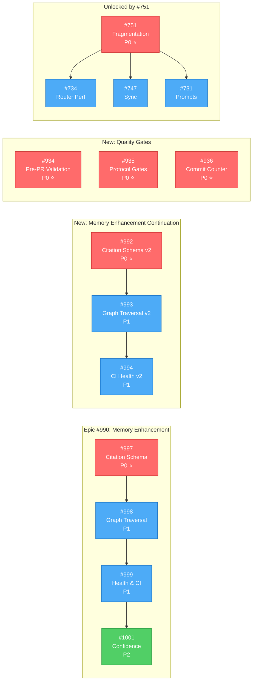
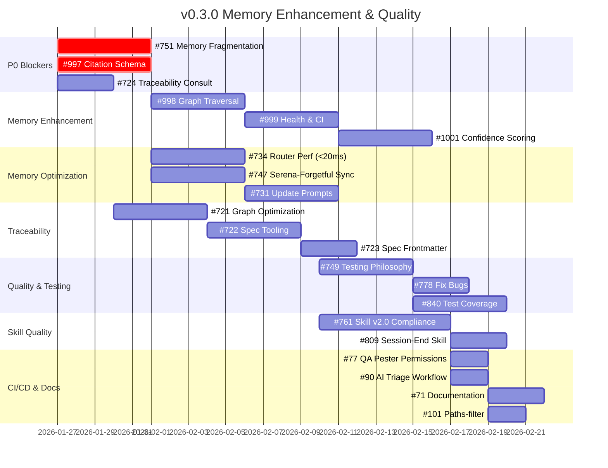
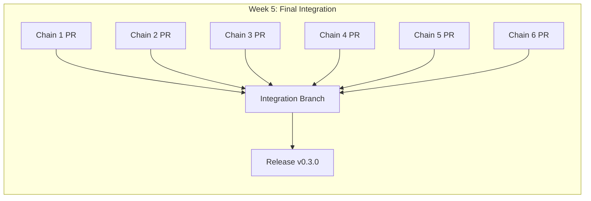
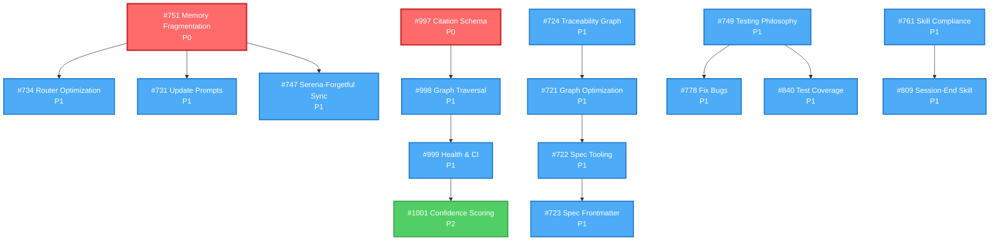

# v0.3.0 Milestone: Memory Enhancement and Quality

**Status**: 🟢 ACTIVE (Revised 2026-02-07)
**Created**: 2026-01-23
**Last Updated**: 2026-02-07 (Added 6 issues from triage analysis)
**Milestone**: [0.3.0](https://github.com/rjmurillo/ai-agents/milestone/6)
**Current Scope**: 29 issues (6 P0, 21 P1, 2 P2)

---

## 🚀 QUICK START: Agent Work Assignment

> **For any agent starting work**: Read this section first. It tells you exactly which chain to work on and how to start.

### Step 1: Identify Your Chain

| Chain | Branch | Issues | Focus | Start Command |
|-------|--------|--------|-------|---------------|
| **Chain 1** | `chain1/memory-enhancement` | #997→#998→#999→#1001 | Citation schema, graph traversal, health reporting | `git worktree add ../ai-agents-chain1 -b chain1/memory-enhancement` |
| **Chain 2** | `chain2/memory-optimization` | #751→#734,#747→#731 | Fragmentation, router perf, sync, prompts | `git worktree add ../ai-agents-chain2 -b chain2/memory-optimization` |
| **Chain 3** | `chain3/traceability` | #724→#721→#722→#723 | Graph implementation, optimization, tooling | `git worktree add ../ai-agents-chain3 -b chain3/traceability` |
| **Chain 4** | `chain4/quality-testing` | #749→#778,#840 | Testing philosophy, bug fixes, coverage | `git worktree add ../ai-agents-chain4 -b chain4/quality-testing` |
| **Chain 5** | `chain5/skill-quality` | #761→#809 | Skill v2.0 compliance, session-end skill | `git worktree add ../ai-agents-chain5 -b chain5/skill-quality` |
| **Chain 6** | `chain6/ci-docs` | #77,#90→#71,#101 | CI fixes, documentation, paths-filter | `git worktree add ../ai-agents-chain6 -b chain6/ci-docs` |

### Step 2: Start Your Work Session

```bash
# 1. Navigate to your worktree (replace N with your chain number)
cd ../ai-agents-chainN

# 2. Start session
/session-init

# 3. Assign yourself to the issue (required)
pwsh .claude/skills/github/scripts/issue/Set-IssueAssignee.ps1 -Issue <ISSUE_NUMBER> -Assignees @("@me")

# 4. Read your first issue (use skill, no raw gh)
pwsh .claude/skills/github/scripts/issue/Get-IssueContext.ps1 -Issue <ISSUE_NUMBER>

# 5. Begin implementation
```

### Step 3: Stop/Resume Work

**To Stop (End of Session)**:
```bash
# 1. Commit your work (atomic, conventional)
git add <files>
git commit -m "docs(chainN): progress on #XXX"

# 2. Complete session log
pwsh scripts/Validate-SessionJson.ps1 -SessionPath .agents/sessions/<your-session>.json

# 3. Push your branch
git push -u origin chain<N>/<branch-name>
```

**To Resume (New Session)**:
```bash
# 1. Navigate to worktree
cd ../ai-agents-chain<N>

# 2. Pull latest
git pull

# 3. Read this PLAN.md section for your chain
# 4. Check issue status (use skill, no raw gh)
pwsh .claude/skills/github/scripts/issue/Get-IssueContext.ps1 -Issue <ISSUE_NUMBER>
# 5. Continue from where you stopped
```

### Chain Status Tracker

| Chain | Current Issue | Status | Last Updated | Blocking? |
|-------|---------------|--------|--------------|-----------|
| 1 | #997 | 🔴 Not Started | 2026-01-23 | No |
| 2 | #751 | 🔴 Not Started | 2026-01-23 | P0 Blocker |
| 3 | #724 | 🔴 Not Started | 2026-01-23 | No |
| 4 | - | 🟡 Week 3 | - | Waits for Week 3 |
| 5 | - | 🟡 Week 3 | - | Waits for Week 3 |
| 6 | - | 🟡 Week 5 | - | Waits for Week 5 |

> **Update this table** only during integration to avoid merge conflicts. For live status, use branch handoffs in `.agents/handoffs/{branch}/{session}.md` or add an issue comment.

### Chain Done Criteria (Verification Commands)

| Chain | Done When | Verification Command |
|-------|-----------|---------------------|
| **1** | All 4 phases complete | `python -m memory_enhancement verify .serena/memories/memory-index.md && python -m memory_enhancement health --format json` (exit code 0) |
| **2** | Router <20ms, prompts updated | `pwsh -c "Measure-Command { Import-Module .claude/skills/memory/modules/MemoryRouter.psm1; Search-Memory 'test' }" \| Select TotalMilliseconds` (must be <20) |
| **3** | Tooling works, specs standardized | `pwsh scripts/traceability/Show-TraceabilityGraph.ps1 -DryRun` (exit code 0) |
| **4** | Tests pass, coverage >90% | `pwsh -c "Invoke-Pester -Path tests/ -CodeCoverage scripts/*.ps1 -PassThru"` (FailedCount=0, CodeCoverage >0.9) |
| **5** | 27/27 skills compliant | `pwsh scripts/Validate-SkillCompliance.ps1` (output shows 100%) |
| **6** | CI green, docs complete | `gh run list --workflow=ai-issue-triage.yml --limit 1 --json conclusion -q '.[0].conclusion'` returns "success" |

### Chain-Specific Traycer Plans

| Chain | Issues with Traycer Plans | Link |
|-------|---------------------------|------|
| **1** | #997, #999 | [#997 Plan](https://github.com/rjmurillo/ai-agents/issues/997#issuecomment-3793075511), [#999 Plan](https://github.com/rjmurillo/ai-agents/issues/999#issuecomment-3793075471) |
| **2** | #751 has Option A decision | [#751 Decision](https://github.com/rjmurillo/ai-agents/issues/751#issuecomment-3793072661) |
| **3** | None yet | Add `@traycerai plan` to #721 |
| **4** | None yet | Add `@traycerai plan` to #749 |
| **5** | #761 has PRD comment | [#761 PRD](https://github.com/rjmurillo/ai-agents/issues/761#issuecomment-3707704698) |
| **6** | None yet | Issues are well-scoped |

---

## 🤖 Agent Quick Context

> **Token-efficient summary for agents.** Full details in sections below.

### P0 Blockers (Start Here)

**Added 2026-02-07**: 4 new P0 issues from triage analysis

| Issue | Title | Traycer Summary |
|-------|-------|-----------------|
| [#997](https://github.com/rjmurillo/ai-agents/issues/997) | Citation Schema & Verification | `models.py` + `citations.py`. YAML frontmatter citations. Verify file:line exists. Exit: `python -m memory_enhancement verify <memory>` works. |
| [#992](https://github.com/rjmurillo/ai-agents/issues/992) | Phase 1 Citation Schema & Verification | Continuation of #990 epic. Python CLI for citation validation. |
| [#751](https://github.com/rjmurillo/ai-agents/issues/751) | Memory System Fragmentation | 4 interfaces → 1 unified. Decision Matrix Option A. Blocks [#734](https://github.com/rjmurillo/ai-agents/issues/734), [#747](https://github.com/rjmurillo/ai-agents/issues/747), [#731](https://github.com/rjmurillo/ai-agents/issues/731). |
| [#934](https://github.com/rjmurillo/ai-agents/issues/934) | Pre-PR Validation Script | Quality gate. Prevents PR #908 recurrence. PowerShell script. |
| [#935](https://github.com/rjmurillo/ai-agents/issues/935) | SESSION-PROTOCOL Validation Gates | Quality gate. Documentation enforcement. Markdown updates. |
| [#936](https://github.com/rjmurillo/ai-agents/issues/936) | Commit Counter in Orchestrator | Quality gate. Real-time visibility. Prevents scope creep. Prompt update. |

### Epic Chain ([#990](https://github.com/rjmurillo/ai-agents/issues/990))

**Added 2026-02-07**: Memory Enhancement continuation (#992→#993→#994) and Quality Gates (#934→#935→#936)



### Gantt Timeline (5 weeks)



### Key Performance Targets

| Metric | Current | Target | Issue |
|--------|---------|--------|-------|
| Memory search | 260ms | <20ms | [#734](https://github.com/rjmurillo/ai-agents/issues/734) |
| Graph traversal | N/A | <500ms depth 3 | [#998](https://github.com/rjmurillo/ai-agents/issues/998) |
| Skill v2.0 compliance | 11% | 100% | [#761](https://github.com/rjmurillo/ai-agents/issues/761) |

### Parallel Tracks (Week 2+)

- **Track 1**: [#997](https://github.com/rjmurillo/ai-agents/issues/997) → [#998](https://github.com/rjmurillo/ai-agents/issues/998) → [#999](https://github.com/rjmurillo/ai-agents/issues/999) (Memory Enhancement)
- **Track 2**: [#734](https://github.com/rjmurillo/ai-agents/issues/734) + [#747](https://github.com/rjmurillo/ai-agents/issues/747) + [#731](https://github.com/rjmurillo/ai-agents/issues/731) (Memory Optimization)
- **Track 3**: [#724](https://github.com/rjmurillo/ai-agents/issues/724) → [#721](https://github.com/rjmurillo/ai-agents/issues/721) → [#722](https://github.com/rjmurillo/ai-agents/issues/722) → [#723](https://github.com/rjmurillo/ai-agents/issues/723) (Traceability)
- **Track 4**: [#761](https://github.com/rjmurillo/ai-agents/issues/761) → [#809](https://github.com/rjmurillo/ai-agents/issues/809) (Skill Quality)

### PRD Reference

- **Memory Enhancement**: `.agents/specs/PRD-memory-enhancement-layer-for-serena-forgetful.md`
- **ADRs**: ADR-007 (Memory-First), ADR-037 (Router), ADR-042 (Python-First)

### AI-Generated PRDs (Issue Comments)

| Issue | PRD Summary | Verdict | Link |
|-------|-------------|---------|------|
| [#751](https://github.com/rjmurillo/ai-agents/issues/751) | 7+ memory interfaces causing confusion. Option A (Decision Matrix) recommended as Phase 1. Problem is documentation/discovery, not architecture. | PARTIAL | [PRD](https://github.com/rjmurillo/ai-agents/issues/751#issuecomment-3707400325) |
| [#761](https://github.com/rjmurillo/ai-agents/issues/761) | 27 skills need v2.0 updates. Current compliance 50.4%. Only 3 skills (11%) fully compliant. No blockers. | READY | [PRD](https://github.com/rjmurillo/ai-agents/issues/761#issuecomment-3707704698) |
| [#994](https://github.com/rjmurillo/ai-agents/issues/994) | Phase 3 CI Health Reporting. Stale memory detection on PRs. >90% accuracy target. Depends on Phase 1-2. | READY (with deps) | [PRD](https://github.com/rjmurillo/ai-agents/issues/994#issuecomment-3782644013) |

**Strategic Note** ([#751 Update](https://github.com/rjmurillo/ai-agents/issues/751#issuecomment-3767407314)): High-Level-Advisor verdict was **DEFER** enhancement features. Memory interface consolidation is P0, enhancement is P1. "Stop adding interfaces. Start consolidating."

### Traycer AI Implementation Plans

| Issue | Traycer Summary | Link |
|-------|-----------------|------|
| [#990](https://github.com/rjmurillo/ai-agents/issues/990) | 4-phase Python package at `.claude/skills/memory-enhancement/`. Maintains backward compat. "90% value at 10% cost". Uses YAML frontmatter for citations. | [Plan](https://github.com/rjmurillo/ai-agents/issues/990#issuecomment-3782445142) |
| [#997](https://github.com/rjmurillo/ai-agents/issues/997) | Create `scripts/memory_enhancement/` module. YAML frontmatter citations. JIT verification. CLI: `python -m memory_enhancement verify`. Minimal, non-breaking. | [Plan](https://github.com/rjmurillo/ai-agents/issues/997#issuecomment-3793075511) |
| [#999](https://github.com/rjmurillo/ai-agents/issues/999) | Create `health.py` for batch checks. Markdown/JSON reports. CI workflow with path filtering. ARM runners per ADR-025. Extends pre-commit hook. | [Plan](https://github.com/rjmurillo/ai-agents/issues/999#issuecomment-3793075471) |

### 🚀 Parallel Execution Plan (Operator Guide)

**Recommended Instances**: 6 concurrent worktrees (peak parallelism)
**Minimum Instances**: 3 (covers independent chains)

#### Independent Chains (No Cross-Dependencies)

```mermaid
flowchart TB
    subgraph Chain1["Chain 1: Memory Enhancement (4 issues)"]
        direction LR
        C1A[#997] --> C1B[#998] --> C1C[#999] --> C1D[#1001]
    end

    subgraph Chain2["Chain 2: Memory Optimization (4 issues)"]
        direction LR
        C2A[#751] --> C2B[#734]
        C2A --> C2C[#747]
        C2B --> C2D[#731]
    end

    subgraph Chain3["Chain 3: Traceability (4 issues)"]
        direction LR
        C3A[#724] --> C3B[#721] --> C3C[#722] --> C3D[#723]
    end

    subgraph Chain4["Chain 4: Quality (3 issues)"]
        direction LR
        C4A[#749] --> C4B[#778]
        C4A --> C4C[#840]
    end

    subgraph Chain5["Chain 5: Skills (2 issues)"]
        direction LR
        C5A[#761] --> C5B[#809]
    end

    subgraph Chain6["Chain 6: CI/Docs (4 issues)"]
        direction LR
        C6A[#77] --> C6C[#71]
        C6B[#90] --> C6D[#101]
    end

    classDef chain1 fill:#e03131,color:#fff
    classDef chain2 fill:#1971c2,color:#fff
    classDef chain3 fill:#2f9e44,color:#fff
    classDef chain4 fill:#f59f00,color:#000
    classDef chain5 fill:#9c36b5,color:#fff
    classDef chain6 fill:#495057,color:#fff

    class C1A,C1B,C1C,C1D chain1
    class C2A,C2B,C2C,C2D chain2
    class C3A,C3B,C3C,C3D chain3
    class C4A,C4B,C4C chain4
    class C5A,C5B chain5
    class C6A,C6B,C6C,C6D chain6
```



#### Instance Allocation by Week

| Week | Instance 1 | Instance 2 | Instance 3 | Instance 4 | Instance 5 | Instance 6 |
|------|------------|------------|------------|------------|------------|------------|
| **1** | #997 (P0) | #751 (P0) | #724 | - | - | - |
| **2** | #998 | #734 | #721 | #747 | - | - |
| **3** | #999 | #731 | #722 | #749 | #761 | - |
| **4** | #1001 | - | #723 | #778 | #809 | #840 |
| **5** | - | - | - | #77 | #90 | #71, #101 |

#### Worktree Setup Commands

```bash
# Create 6 worktrees for parallel execution
git worktree add ../ai-agents-chain1 -b chain1/memory-enhancement
git worktree add ../ai-agents-chain2 -b chain2/memory-optimization
git worktree add ../ai-agents-chain3 -b chain3/traceability
git worktree add ../ai-agents-chain4 -b chain4/quality-testing
git worktree add ../ai-agents-chain5 -b chain5/skill-quality
git worktree add ../ai-agents-chain6 -b chain6/ci-docs
```

#### Chain Specifications

| Chain | Issues | Duration | Start | Branch | Files Modified |
|-------|--------|----------|-------|--------|----------------|
| **1: Memory Enhancement** | #997→#998→#999→#1001 | 4 weeks | Week 1 | `chain1/memory-enhancement` | `scripts/memory_enhancement/` |
| **2: Memory Optimization** | #751→#734,#747→#731 | 3 weeks | Week 1 | `chain2/memory-optimization` | `.claude/skills/memory/`, agent prompts |
| **3: Traceability** | #724→#721→#722→#723 | 3 weeks | Week 1 | `chain3/traceability` | `.agents/specs/`, traceability scripts |
| **4: Quality & Testing** | #749→#778,#840 | 2 weeks | Week 3 | `chain4/quality-testing` | `tests/`, validation scripts |
| **5: Skill Quality** | #761→#809 | 1.5 weeks | Week 3 | `chain5/skill-quality` | `.claude/skills/*/SKILL.md` |
| **6: CI/CD & Docs** | #77,#90→#71,#101 | 1 week | Week 5 | `chain6/ci-docs` | `.github/workflows/`, docs |

#### Merge Strategy



**Merge Order** (respects dependencies):
1. Chain 2 (#751 fragmentation) - Enables router work
2. Chain 1 (#997-#1001 enhancement) - Core feature
3. Chain 3 (#724-#723 traceability) - Independent
4. Chain 4 (#749-#840 quality) - Independent
5. Chain 5 (#761-#809 skills) - Independent
6. Chain 6 (#77-#101 CI/docs) - Polish

#### Conflict Risk Assessment

| Chain Pair | Risk | Shared Files | Mitigation |
|------------|------|--------------|------------|
| 1 ↔ 2 | **HIGH** | Memory system files | Merge Chain 2 first, rebase Chain 1 |
| 1 ↔ 3 | LOW | None | Independent |
| 2 ↔ 5 | MEDIUM | Agent prompts | Coordinate #731 with #761 |
| 4 ↔ 5 | LOW | Test infrastructure | Independent |
| 6 ↔ * | LOW | Workflow files only | Merge last |

#### Autonomous Execution Checklist

- [ ] Create 6 git worktrees per commands above
- [ ] Assign one Claude Code instance per worktree
- [ ] Each instance reads this PLAN.md for context
- [ ] Each instance works only on its assigned chain
- [ ] Use `/session-init` at start of each chain
- [ ] Create PR per chain when complete
- [ ] Human operator reviews and merges in order
- [ ] Run integration tests after each merge

---

## 🚨 SCOPE REVISION NOTICE

**Original Plan**: 40 issues, 6-7 weeks, MCP infrastructure + Memory + Workflow
**Revised Plan**: 23 issues, 4-5 weeks, Memory Enhancement + Quality focus
**Issues Deferred**: 17 issues moved to Future milestone (11 MCP infrastructure + 6 Workflow Orchestration)
**Decision Date**: 2026-01-23
**Rationale**: Eliminate high-risk MCP infrastructure dependencies, focus on independent value delivery

See [Scope Change History](#scope-change-history) for complete analysis.

---

## Executive Summary

v0.3.0 delivers **Memory Enhancement** and **Quality Improvements** that establish the foundation for knowledge management without the complexity of MCP infrastructure. This focused scope reduces risk, accelerates delivery, and provides immediate value.

### Core Theme
**Memory-First Architecture** (ADR-007)

### Key Deliverables

1. **Memory Enhancement Layer** (Epic [#990](https://github.com/rjmurillo/ai-agents/issues/990))
   - Citation validation with source tracking
   - Graph traversal for knowledge exploration
   - Staleness detection via CI integration
   - Confidence scoring based on verification history

2. **Memory System Unification** ([#751](https://github.com/rjmurillo/ai-agents/issues/751))
   - Single unified interface for 4 memory systems
   - Eliminates fragmentation (Forgetful, Serena, Claude-Mem, DeepWiki)

3. **Performance Optimization** ([#734](https://github.com/rjmurillo/ai-agents/issues/734))
   - 13x improvement in memory search (260ms → <20ms)
   - Root cause: SHA-256 hashing, file I/O optimization

4. **Skill Quality** ([#761](https://github.com/rjmurillo/ai-agents/issues/761), [#809](https://github.com/rjmurillo/ai-agents/issues/809))
   - 100% v2.0 standard compliance (from 11%)
   - 24 of 27 skills updated
   - Automated session validation

5. **Evidence-Based Testing** ([#749](https://github.com/rjmurillo/ai-agents/issues/749))
   - Security baseline establishment
   - 95% test coverage target (from ~60%)
   - Test strategy gap checklist

### Success Metrics

| Metric | Baseline | v0.3.0 Target | Measurement |
|--------|----------|---------------|-------------|
| Memory search performance | 260ms | <20ms | Benchmark script (13x improvement) |
| Memory system interfaces | 4 fragmented | 1 unified | Router implementation |
| Citation coverage | 0% | 20% high-value | Memories with ≥1 citation |
| Stale detection accuracy | 0% | >90% | CI validation true positives |
| Graph traversal | N/A | <500ms depth 3 | Benchmark script |
| Skill v2.0 compliance | 11% | 100% | Validation script |
| Test coverage | ~60% | 95% | Coverage reports |

### Timeline

**Total Duration**: 4-5 weeks (reduced from original 6-7 weeks)

- **Week 1**: Memory Foundation (P0 blockers)
- **Week 2**: Memory Enhancement (parallel tracks)
- **Week 3**: Quality & Testing
- **Week 4**: Traceability & Polish
- **Week 5**: Final Integration & Documentation

---

## Current Scope Breakdown

### P0 Critical (2 issues) - MUST COMPLETE FIRST

| Issue | Title | Area | Impact |
|-------|-------|------|--------|
| [**[#997](https://github.com/rjmurillo/ai-agents/issues/997)**](https://github.com/rjmurillo/ai-agents/issues/997) | Phase 1: Citation Schema & Verification | Memory Enhancement | Foundation for all memory phases |
| [**[#751](https://github.com/rjmurillo/ai-agents/issues/751)**](https://github.com/rjmurillo/ai-agents/issues/751) | Reconcile memory system fragmentation | Memory Systems | Unifies 4 interfaces, enables router optimization |

**Rationale**: These two issues unlock all other memory-related work in v0.3.0.

### P1 Important (19 issues) - HIGH BUSINESS VALUE

---

## 📋 Implementation Cards (Agent-Ready Reference)

> **This section is the authoritative source for agents starting work.**
> Each card provides file paths, exit criteria, and Traycer plan links.

### Issue Readiness Summary

| Status | Issues | Description |
|--------|--------|-------------|
| 🟢 **Ready** | #997, #998, #999, #1001 | Traycer plan + file paths + exit criteria |
| 🟡 **Partial** | #751, #734, #747, #731, #761, #809, #749, #778, #840, #836, #721-#724 | Good detail, may need Traycer plan |
| 🔴 **Needs Work** | #77, #90, #71, #101 | CI/Docs, well-scoped but needs investigation |

### Implementation Cards

> **For each issue**: Find Traycer comment link, file paths, and exit criteria below.
> **If missing Traycer plan**: Add `@traycerai plan` comment to trigger generation.

---

#### 🟢 READY: Memory Enhancement Epic (#990, #997, #998, #999, #1001)

**Traycer Plans Available**: [#997](https://github.com/rjmurillo/ai-agents/issues/997#issuecomment-3793075511), [#999](https://github.com/rjmurillo/ai-agents/issues/999#issuecomment-3793075471)

| Issue | Files to Create/Modify | Exit Criteria | Traycer |
|-------|------------------------|---------------|---------|
| **#997** (P0) | `scripts/memory_enhancement/models.py`, `citations.py`, `__init__.py`, `__main__.py` | `python -m memory_enhancement verify <memory>` works | [Plan](https://github.com/rjmurillo/ai-agents/issues/997#issuecomment-3793075511) |
| **#998** (P1) | `scripts/memory_enhancement/graph.py` | `python -m memory_enhancement graph <root>` traverses links | Use #997 as template |
| **#999** (P1) | `scripts/memory_enhancement/health.py`, `.github/workflows/memory-health.yml` | CI flags stale memories on PRs, exit code reflects status | [Plan](https://github.com/rjmurillo/ai-agents/issues/999#issuecomment-3793075471) |
| **#1001** (P2) | `scripts/memory_enhancement/serena.py`, `.claude/skills/memory-enhancement/SKILL.md` | Memories track confidence (0.0-1.0), CLI adds citations | Depends on #997-#999 |

**PRD**: [`.agents/specs/PRD-memory-enhancement-layer-for-serena-forgetful.md`](.agents/specs/PRD-memory-enhancement-layer-for-serena-forgetful.md)

##### #997 Haiku-Ready Implementation (Citation Schema & Verification)

<details>
<summary>Step 1: Create scripts/memory_enhancement/__init__.py</summary>

```python
"""Memory Enhancement Layer for Serena + Forgetful.

Implements citation verification, graph traversal, and health reporting.
Per ADR-042: Python-first for AI/ML ecosystem alignment.

Usage:
    python -m memory_enhancement verify <memory-id-or-path>
    python -m memory_enhancement verify-all [--dir .serena/memories]
"""

from .models import Memory, Citation, Link, LinkType
from .citations import verify_citation, verify_memory, verify_all_memories, VerificationResult

__all__ = [
    "Memory",
    "Citation",
    "Link",
    "LinkType",
    "verify_citation",
    "verify_memory",
    "verify_all_memories",
    "VerificationResult",
]
```
</details>

<details>
<summary>Step 2: Create scripts/memory_enhancement/models.py</summary>

```python
"""Data models for memory enhancement layer.

Dataclasses for Memory, Citation, and Link per PRD section 4.5.1.
"""

from dataclasses import dataclass, field
from datetime import datetime
from enum import Enum
from pathlib import Path
from typing import Optional

import frontmatter


class LinkType(Enum):
    """Typed relationship between memories."""
    RELATED = "related"
    SUPERSEDES = "supersedes"
    BLOCKS = "blocks"
    IMPLEMENTS = "implements"
    EXTENDS = "extends"


@dataclass
class Citation:
    """Code reference with verification metadata."""
    path: str
    line: Optional[int] = None
    snippet: Optional[str] = None
    verified: Optional[datetime] = None
    valid: Optional[bool] = None
    mismatch_reason: Optional[str] = None


@dataclass
class Link:
    """Typed relationship to another memory."""
    link_type: LinkType
    target_id: str


@dataclass
class Memory:
    """Serena memory with citations and links."""
    id: str
    subject: str
    path: Path
    content: str
    citations: list[Citation] = field(default_factory=list)
    links: list[Link] = field(default_factory=list)
    tags: list[str] = field(default_factory=list)
    confidence: float = 1.0
    last_verified: Optional[datetime] = None

    @classmethod
    def from_serena_file(cls, path: Path) -> "Memory":
        """Parse a Serena memory markdown file."""
        post = frontmatter.load(path)
        meta = post.metadata

        citations = [
            Citation(
                path=c.get("path", ""),
                line=c.get("line"),
                snippet=c.get("snippet"),
            )
            for c in meta.get("citations", [])
        ]

        links = []
        for link_data in meta.get("links", []):
            try:
                link_type = LinkType(link_data.get("type", "related"))
                links.append(Link(link_type=link_type, target_id=link_data.get("target", "")))
            except ValueError:
                pass  # Skip invalid link types

        return cls(
            id=meta.get("id", path.stem),
            subject=meta.get("subject", path.stem),
            path=path,
            content=post.content,
            citations=citations,
            links=links,
            tags=meta.get("tags", []),
            confidence=float(meta.get("confidence", 1.0)),
            last_verified=cls._parse_date(meta.get("last_verified")),
        )

    @staticmethod
    def _parse_date(value) -> Optional[datetime]:
        """Parse datetime from various formats."""
        if value is None:
            return None
        if isinstance(value, datetime):
            return value
        return datetime.fromisoformat(str(value))

    def get_links_by_type(self, link_type: LinkType) -> list[str]:
        """Return target IDs for links of the given type."""
        return [link.target_id for link in self.links if link.link_type == link_type]
```
</details>

<details>
<summary>Step 3: Create scripts/memory_enhancement/citations.py</summary>

```python
"""Citation verification logic.

Validates that code references in memories still exist at expected locations.
"""

from dataclasses import dataclass
from pathlib import Path

from .models import Citation, Memory


@dataclass
class VerificationResult:
    """Result of verifying a memory's citations."""
    memory_id: str
    valid: bool
    total_citations: int
    valid_count: int
    stale_citations: list[Citation]
    confidence: float


def verify_citation(citation: Citation, repo_root: Path) -> Citation:
    """Verify a single citation against the codebase."""
    file_path = repo_root / citation.path

    if not file_path.exists():
        citation.valid = False
        citation.mismatch_reason = f"File not found: {citation.path}"
        return citation

    if citation.line is None:
        citation.valid = True
        return citation

    try:
        lines = file_path.read_text().splitlines()
        if citation.line < 1 or citation.line > len(lines):
            citation.valid = False
            citation.mismatch_reason = f"Line {citation.line} out of range (file has {len(lines)} lines)"
            return citation

        actual_line = lines[citation.line - 1]
        if citation.snippet and citation.snippet not in actual_line:
            citation.valid = False
            citation.mismatch_reason = f"Snippet not found at line {citation.line}"
            return citation

        citation.valid = True
    except Exception as e:
        citation.valid = False
        citation.mismatch_reason = str(e)

    return citation


def verify_memory(memory: Memory, repo_root: Path = None) -> VerificationResult:
    """Verify all citations in a memory."""
    repo_root = repo_root or Path.cwd()

    if not memory.citations:
        return VerificationResult(
            memory_id=memory.id,
            valid=True,
            total_citations=0,
            valid_count=0,
            stale_citations=[],
            confidence=memory.confidence,
        )

    verified = [verify_citation(c, repo_root) for c in memory.citations]
    valid_count = sum(1 for c in verified if c.valid)
    stale = [c for c in verified if not c.valid]

    return VerificationResult(
        memory_id=memory.id,
        valid=len(stale) == 0,
        total_citations=len(verified),
        valid_count=valid_count,
        stale_citations=stale,
        confidence=valid_count / len(verified) if verified else memory.confidence,
    )


def verify_all_memories(memories_dir: Path, repo_root: Path = None) -> list[VerificationResult]:
    """Verify all memories in a directory."""
    repo_root = repo_root or Path.cwd()
    results = []

    for md_file in memories_dir.glob("*.md"):
        try:
            memory = Memory.from_serena_file(md_file)
            if memory.citations:
                results.append(verify_memory(memory, repo_root))
        except Exception as e:
            print(f"Warning: Could not parse {md_file}: {e}")

    return results
```
</details>

<details>
<summary>Step 4: Create scripts/memory_enhancement/__main__.py</summary>

```python
"""CLI entry point for memory enhancement layer.

Usage:
    python -m memory_enhancement verify <memory-id-or-path>
    python -m memory_enhancement verify-all [--dir .serena/memories]
"""

import argparse
import json
import sys
from pathlib import Path

from .citations import verify_memory, verify_all_memories
from .models import Memory


def main():
    parser = argparse.ArgumentParser(description="Memory Enhancement Layer CLI")
    parser.add_argument("--json", action="store_true", help="Output as JSON")
    subparsers = parser.add_subparsers(dest="command", required=True)

    # verify command
    verify_parser = subparsers.add_parser("verify", help="Verify a single memory")
    verify_parser.add_argument("memory", help="Memory ID or file path")

    # verify-all command
    verify_all_parser = subparsers.add_parser("verify-all", help="Verify all memories")
    verify_all_parser.add_argument("--dir", default=".serena/memories", help="Memories directory")

    args = parser.parse_args()

    if args.command == "verify":
        path = Path(args.memory)
        if not path.exists():
            path = Path(f".serena/memories/{args.memory}.md")
        if not path.exists():
            print(f"Memory not found: {args.memory}", file=sys.stderr)
            sys.exit(1)

        memory = Memory.from_serena_file(path)
        result = verify_memory(memory)

        if args.json:
            print(json.dumps({
                "memory_id": result.memory_id,
                "valid": result.valid,
                "confidence": result.confidence,
                "stale_citations": [
                    {"path": c.path, "line": c.line, "reason": c.mismatch_reason}
                    for c in result.stale_citations
                ],
            }))
        else:
            status = "✅ VALID" if result.valid else "❌ STALE"
            print(f"{status} ({result.confidence:.0%} confidence)")
            for c in result.stale_citations:
                print(f"  - {c.path}:{c.line} - {c.mismatch_reason}")

        sys.exit(0 if result.valid else 1)

    elif args.command == "verify-all":
        results = verify_all_memories(Path(args.dir))
        stale = [r for r in results if not r.valid]

        if args.json:
            print(json.dumps([{
                "memory_id": r.memory_id,
                "valid": r.valid,
                "confidence": r.confidence,
            } for r in results]))
        else:
            print(f"Verified {len(results)} memories with citations")
            if stale:
                print(f"❌ {len(stale)} stale:")
                for r in stale:
                    print(f"  - {r.memory_id}")
            else:
                print("✅ All citations valid")

        sys.exit(0 if not stale else 1)


if __name__ == "__main__":
    main()
```
</details>

<details>
<summary>Step 5: Update pyproject.toml (add dependency after line 11)</summary>

```toml
    "python-frontmatter>=1.0.0",
```
</details>

**#997 Verification** (all must exit 0):
```bash
# Create module structure
mkdir -p scripts/memory_enhancement
# After adding files above:
python -c "from memory_enhancement import Memory, verify_memory; print('Import OK')"
python -m memory_enhancement verify memory-index
```

---

#### 🟡 PARTIAL: Memory System (#751, #734, #747, #731)

| Issue | Files | Exit Criteria | Status |
|-------|-------|---------------|--------|
| **#751** (P0) | `AGENTS.md`, `.claude/agents/context-retrieval.md`, `.claude/skills/memory/SKILL.md` | Decision matrix in AGENTS.md, all interfaces cross-reference it | [Haiku-Ready](#751-haiku-ready-implementation-option-a-decision-matrix) |
| **#734** (P1) | `.claude/skills/memory/scripts/MemoryRouter.psm1` (lines 35-40, config) | `Measure-Command { Search-Memory "test" -LexicalOnly }` < 20ms | [Haiku-Ready](#734-haiku-ready-implementation-memory-router-optimization) |
| **#747** (P1) | `scripts/Sync-MemoryToForgetful.ps1`, `Test-MemoryFreshness.ps1`, `.githooks/pre-commit` | `Test-MemoryFreshness.ps1` returns no stale entries | Plan: `.agents/planning/phase2b-memory-sync-strategy.md` |
| **#731** (P1) | `.claude/agents/skillbook.md`, `.claude/agents/memory.md`, `.claude/agents/retrospective.md` | `grep -c "mcp__serena__\|cloudmcp" .claude/agents/*.md` = 0 | Blocked by #751, #734 |

##### #751 Haiku-Ready Implementation (Option A: Decision Matrix)

> **Strategic Context**: High-level-advisor recommended Option A (Decision Matrix Documentation) as Phase 1.
> **Verdict**: P0 prerequisite for all memory enhancement work. See [#751 Strategic Update](https://github.com/rjmurillo/ai-agents/issues/751#issuecomment-3793072661).

**Issue Acceptance Criteria Checklist**:
- [ ] Update CLAUDE.md with memory interface decision matrix
- [ ] Add "When to Use" section to memory skill SKILL.md
- [ ] Cross-reference between context-retrieval.md and memory skill
- [ ] Validate all 4+ slash commands reference the decision matrix

**Copy-paste ready**:

<details>
<summary>Step 1: Add to AGENTS.md (insert after line 582, before "## Agent Catalog")</summary>

```markdown
## Memory Interface Decision Matrix

> **When to use which memory interface.** This matrix eliminates confusion about the 4 memory backends.

| Use Case | Interface | Command/Tool | Why |
|----------|-----------|--------------|-----|
| Quick memory search from CLI | `/memory-search` slash command | `/memory-search "topic"` | Fastest, no agent overhead |
| Complex context gathering | `context-retrieval` agent | `Task(subagent_type="context-retrieval")` | Deep exploration, graph traversal |
| Script integration | Memory Router skill | `Search-Memory -Query "topic"` | PowerShell pipeline, structured output |
| Direct MCP access (agents only) | Forgetful/Serena MCP | `mcp__forgetful__*`, `mcp__serena__*` | Full control, programmatic |
| Cross-session knowledge | Forgetful semantic search | `execute_forgetful_tool("query_memory")` | Vector similarity, cross-project |
| File-based lookup | Serena memories | `mcp__serena__read_memory` | Git-synced, always available |

**Decision Tree**:
1. Are you a human at CLI? → Use `/memory-search`
2. Are you an agent needing deep context? → Use `context-retrieval` agent
3. Are you a PowerShell script? → Use Memory Router skill
4. Need semantic search across projects? → Use Forgetful directly
5. Need specific memory by name? → Use Serena directly

```
</details>

<details>
<summary>Step 2: Add to .claude/agents/context-retrieval.md (insert at line 17, after "## Five-Source Strategy")</summary>

```markdown
> **Memory Interface Selection**: See [AGENTS.md#memory-interface-decision-matrix](../../../AGENTS.md#memory-interface-decision-matrix) for when to use this agent vs other memory interfaces.

```
</details>

<details>
<summary>Step 3: Add to .claude/skills/memory/SKILL.md (insert at line 37, before "## Memory-First as Chesterton's Fence")</summary>

```markdown
## When to Use This Skill

| Scenario | Use Memory Router? | Alternative |
|----------|-------------------|-------------|
| PowerShell script needs memory | ✅ Yes | - |
| Agent needs deep context | ❌ No | `context-retrieval` agent |
| Human at CLI | ❌ No | `/memory-search` command |
| Cross-project semantic search | ❌ No | Forgetful MCP directly |

See [AGENTS.md#memory-interface-decision-matrix](../../../../AGENTS.md#memory-interface-decision-matrix) for complete decision tree.

```
</details>

**#751 Verification** (all must exit 0 for DONE):
```bash
# Acceptance Criterion 1: Decision matrix in context-retrieval.md (authoritative location per commit fe82e735)
grep -q "## Memory Interface Decision Matrix" .claude/agents/context-retrieval.md && echo "✓ AC1: Matrix in context-retrieval.md"

# Acceptance Criterion 2: "When to Use" in memory skill
grep -q "## When to Use This Skill" .claude/skills/memory/SKILL.md && echo "✓ AC2: When to Use in SKILL.md"

# Acceptance Criterion 3: AGENTS.md references context-retrieval.md for decision matrix
grep -q "context-retrieval" AGENTS.md && echo "✓ AC3: AGENTS.md references context-retrieval"

# Acceptance Criterion 4: Slash commands reference decision matrix (check at least one)
grep -q "decision.*matrix\|context-retrieval" .claude/commands/forgetful/memory-search.md && echo "✓ AC4: Slash command cross-ref"
```

**#751 STOP Criteria** (close issue when ALL pass):
- [x] All 4 verification commands exit 0
- [x] No new memory interfaces added without updating matrix
- [x] User can find appropriate interface in <30 seconds using decision tree

**#751 Status**: ✅ COMPLETE (commit 7f903379)

##### #734 Haiku-Ready Implementation (Memory Router Optimization)

<details>
<summary>Root Cause: TCP health check timeout is 500ms, dominates <20ms target</summary>

File: `.claude/skills/memory/scripts/MemoryRouter.psm1`

**Current code (lines 36-40)**:
```powershell
$script:Config = @{
    SerenaPath       = ".serena/memories"
    ForgetfulPort    = 8020
    ForgetfulTimeout = 500  # <-- BOTTLENECK: 500ms timeout
    MaxResults       = 10
}
```

**Fix: Reduce timeout to 50ms (line 38)**:
```powershell
    ForgetfulTimeout = 50   # Reduced from 500ms for <20ms target
```

**Alternative: Use `-LexicalOnly` switch for fast path** (skip Forgetful entirely):
```powershell
Search-Memory -Query "test" -LexicalOnly  # No TCP check, ~5ms
```
</details>

**#734 Verification**:
```bash
pwsh -c "Import-Module .claude/skills/memory/scripts/MemoryRouter.psm1 -Force; (Measure-Command { Search-Memory 'test' -LexicalOnly }).TotalMilliseconds" | awk '{print ($1 < 20 ? "PASS" : "FAIL") " - " $1 "ms"}'
```

##### #778 Haiku-Ready Implementation (Verify and Close)

> **Investigation Result**: The `foundMemories` variable pattern no longer exists in the codebase.
> **Evidence**: `grep -r "foundMemories" --include="*.ps1" .` returns no matches.
> **QA Report**: `.agents/qa/384-test-memoryevidence-migration.md` shows "Property access error fixed (Warnings.Count issue resolved)".

**Issue Acceptance Criteria Checklist**:
- [ ] `foundMemories` pattern no longer exists in any `.ps1` file
- [ ] Session validation script runs without errors
- [ ] Issue closed with root cause and fix evidence

**Copy-paste ready**:
<details>
<summary>Step 1: Verify pattern removed</summary>

```bash
grep -r "foundMemories" --include="*.ps1" . && exit 1 || echo "PASS: foundMemories pattern absent"
```
</details>

<details>
<summary>Step 2: Run session validation</summary>

```bash
pwsh scripts/Validate-SessionJson.ps1 -SessionPath ".agents/sessions/$(ls -1t .agents/sessions/*.json | head -1)"
```
</details>

<details>
<summary>Step 3: Close issue with comment (copy this to GitHub)</summary>

```markdown
## Resolution

**Root Cause**: The `foundMemories` variable was accessing `.Count` on a potentially null object.

**Fix Evidence**:
- Pattern no longer exists: `grep -r "foundMemories" --include="*.ps1" .` returns 0 matches
- Fixed during session 384 refactoring
- QA report: `.agents/qa/384-test-memoryevidence-migration.md`

**Verification**: Session validation passes without errors.

Closing as fixed.
```
</details>

**#778 Verification** (all must exit 0):
```bash
# Confirm foundMemories pattern no longer exists
grep -r "foundMemories" --include="*.ps1" . && echo "FAIL: Pattern still exists" || echo "PASS"
# Run actual validation
pwsh scripts/Validate-SessionJson.ps1 -SessionPath ".agents/sessions/$(ls -1t .agents/sessions/*.json | head -1)"
```

**#778 STOP Criteria** (close issue when ALL pass):
- [ ] Verification commands exit 0
- [ ] Issue closed on GitHub with resolution comment

---

#### 🟡 PARTIAL: Skill Quality (#761, #809)

| Issue | Files | Exit Criteria | Status |
|-------|-------|---------------|--------|
| **#761** (P1) | `.claude/skills/*/SKILL.md` (27 skills) | Validation script passes 100%, see `.agents/analysis/skill-v2-compliance-gaps.md` | Has phase breakdown |
| **#809** (P1) | `.claude/skills/session-end/SKILL.md`, `scripts/session-end/` | `/session-end` skill validates logs before commit | Has problem statement |

**Reference**: `.agents/governance/skill-description-trigger-standard.md` v2.0

---

#### 🟡 PARTIAL: Testing & Quality (#749, #778, #840, #836)

| Issue | Files | Exit Criteria | Status |
|-------|-------|---------------|--------|
| **#749** (P1) | `.claude/agents/qa.md`, `.serena/memories/testing-004-*` | QA agent uses evidence-based criteria, security-critical = 100% coverage | Has research in `.agents/analysis/testing-coverage-philosophy.md` |
| **#778** (P1) | Likely fixed in session 384 | Verify validation passes, then close issue | [Haiku-Ready](#778-haiku-ready-implementation-verify-and-close) |
| **#840** (P1) | `scripts/Validate-Session.ps1`, `scripts/Validate-SessionProtocol.ps1` | Consolidate duplicates to `SessionValidation.psm1`, 95% coverage | Has PR #830 follow-up list |
| **#836** (P1) | `scripts/session-validation/Validate-SessionPath.ps1` (line 125) | Error shows normalized path, analysis in `.agents/analysis/809-path-escape-root-cause.md` | Has fix recommendation |

---

#### 🟡 PARTIAL: Traceability (#724, #721, #722, #723)

| Issue | Files | Exit Criteria | Status |
|-------|-------|---------------|--------|
| **#724** (P1) | Output: `.agents/analysis/traceability-build-vs-buy.md` | Run `/programming-advisor`, document decision | Consultation only |
| **#721** (P1) | `scripts/Validate-Traceability.ps1`, add caching | Sub-second traversal on 100+ specs, benchmark before/after | Depends on #724 |
| **#722** (P1) | `scripts/traceability/Rename-SpecId.ps1`, `Update-SpecReferences.ps1`, `Show-TraceabilityGraph.ps1` | Dry-run mode, atomic updates, no partial failures | Has proposed scripts |
| **#723** (P1) | `.agents/governance/traceability-schema.md`, `.agents/governance/traceability-protocol.md` | All use YAML frontmatter, consistent fields | Scope is 2 files |

---

#### 🔴 NEEDS WORK: CI/Docs (#77, #90, #71, #101)

| Issue | Files | Exit Criteria | TODO |
|-------|-------|---------------|------|
| **#77** (P1) | `.github/workflows/ai-pr-quality-gate.yml` | QA agent can run Pester, add `pwsh` to allowed commands | Update issue with workflow line numbers |
| **#90** (P1) | `.github/workflows/ai-issue-triage.yml`, BOT_PAT token | Labels apply via GraphQL, verify `addLabelsToLabelable` works | Token permission investigation |
| **#71** (P2) | `docs/patterns/prompt-vs-agent.md` (create) | Document orchestration pattern with examples | Create file outline |
| **#101** (P2) | `.github/workflows/validate-generated-agents.yml` | Uses `dorny/paths-filter@v3`, skips with passing status | Has design pattern in issue |

---

#### 🔴 NEEDS WORK: Prompt Updates (#731)

**Issue**: [#731](https://github.com/rjmurillo/ai-agents/issues/731)

**Files to Update** (enumerated):
- `.claude/agents/skillbook.md` (lines 43, 1230-1267 for cloudmcp references)
- `.claude/agents/memory.md`
- `.claude/agents/retrospective.md`
- All agents with `mcp__serena__*` or `mcp__forgetful__*` direct calls

**Exit Criteria**: `grep -r "mcp__serena__\|mcp__forgetful__\|cloudmcp" .claude/agents/` returns only Memory Router usage.

**Blocked By**: #751 (unified interface), #734 (router optimization)

---

#### 🔴 PROPOSAL: Automatic Context-Retrieval Invocation (New Issue)

> **Shower Thought**: The `context-retrieval` agent exists and is documented in the Memory Interface Decision Matrix (#751), but nothing actually triggers it automatically. The agent says "Use PROACTIVELY when about to plan or implement code" but relies on manual invocation.

**Problem Statement**:

Current state:
- `context-retrieval` agent exists at `.claude/agents/context-retrieval.md`
- Agent description says: "Use PROACTIVELY when about to plan or implement code"
- Memory Interface Decision Matrix (#751) documents when to use it: "Complex context gathering"
- **Gap**: No automatic invocation mechanism exists

Evidence of manual-only pattern:
```bash
# Search for automatic invocation of context-retrieval
grep -r "context-retrieval" .claude/agents/orchestrator.md
# Result: Zero matches (orchestrator doesn't automatically invoke it)
```

**User Impact**:
- Agents miss relevant context from Forgetful Memory cross-project search
- Repeated discovery of solutions already solved elsewhere
- Manual invocation required (if remembered)
- Inconsistent memory utilization across sessions

**Proposed Solution**:

Add automatic context-retrieval invocation to orchestrator workflow with these trigger conditions:

| Trigger Condition | When to Invoke | Rationale |
|------------------|----------------|-----------|
| **Before analyst delegation** | Task type = Feature, Bug Fix, Research | Gather relevant patterns before investigation |
| **Before planner delegation** | Epic/milestone breakdown | Find similar planning artifacts |
| **Before implementer delegation** | Code changes required | Discover cross-project implementation patterns |
| **User explicitly requests** | "Research", "investigate", "find examples" | Direct user intent |

**Implementation Options**:

1. **Option A: Orchestrator Phase Injection** (Minimal Change)
   - Insert context-retrieval call in orchestrator Phase 1 (Initialization)
   - Add to MANDATORY checklist: "Route to context-retrieval for memory search"
   - Gating: Skip if task is trivial (direct answer, simple file edit)

   **Pros**: Simple, uses existing infrastructure, no new patterns
   **Cons**: Adds latency to all workflows

2. **Option B: Conditional Hook** (Smart Routing)
   - Add decision logic to orchestrator triage phase
   - Invoke context-retrieval only for Medium/Complex tasks
   - Skip for Simple/Trivial tasks

   **Pros**: Optimizes for performance, minimal overhead
   **Cons**: More complex routing logic

3. **Option C: Workflow Skill** (Declarative)
   - Create `/context-gather` skill that orchestrator/planner can invoke
   - Documents when to use it (before planning/implementation)
   - Explicit invocation, not automatic

   **Pros**: Clear intent, reusable, testable
   **Cons**: Still requires manual invocation (doesn't solve core problem)

**Recommended Approach**: **Option B (Conditional Hook)** - Best balance of value and simplicity.

**Proposed Changes**:

1. Update `.claude/agents/orchestrator.md`:
   ```markdown
   ### Phase 0.5: Context Retrieval (CONDITIONAL)

   **Trigger**: Task complexity >= Standard (see Complexity Assessment)

   Before routing to analyst/planner/implementer, gather relevant context:

   Task(
       subagent_type="context-retrieval",
       prompt="""Gather context for: [task description]

       Focus:
       - Cross-project patterns for [domain]
       - Prior solutions to similar problems
       - Framework best practices from Context7
       - Code artifacts from Forgetful

       Return: Focused summary of relevant findings."""
   )
   ```

2. Add to orchestrator checklist (Phase 1):
   ```markdown
   - [ ] CONDITIONAL: If complexity >= Standard, route to context-retrieval
   ```

3. Update context-retrieval.md to clarify automatic vs manual usage:
   ```markdown
   ## Invocation Patterns

   **Automatic**: Orchestrator invokes for Standard/Complex tasks
   **Manual**: Any agent can invoke when needing cross-project context
   ```

**Acceptance Criteria**:
- [ ] Orchestrator automatically invokes context-retrieval for Standard/Complex tasks
- [ ] Trivial/Simple tasks skip context-retrieval (performance)
- [ ] Context-retrieval results passed to downstream agents (analyst/planner/implementer)
- [ ] No duplicate context gathering (once per workflow)
- [ ] Documentation updated in orchestrator.md and context-retrieval.md

**Scope/Effort Estimate**:
- **Files to change**: 2 (orchestrator.md, context-retrieval.md)
- **Lines of change**: ~50 total
- **Complexity**: Low (single conditional block)
- **Testing**: Manual verification (no Pester tests for agent prompts)
- **Risk**: Low (additive change, easy to revert)
- **Haiku-ready**: Yes (simple text changes)

**YAGNI Check**:
- Is this solving a real problem? **Yes** - Context is missed regularly
- Is there a simpler solution? **No** - Manual invocation already available but not used
- Does it add unnecessary complexity? **No** - Single conditional in existing phase
- Will users actually benefit? **Yes** - Cross-project learning improves with use

**Potential Issues**:
1. **Latency**: Context-retrieval adds 2-5s to workflow
   - Mitigation: Only for Standard/Complex tasks (not Simple)
2. **Context pollution**: Too much context confuses agents
   - Mitigation: context-retrieval returns focused summary (not raw results)
3. **Cost**: Additional Haiku agent invocation per workflow
   - Mitigation: Haiku is cheap (<$0.01/invocation), value justifies cost

**ADR Alignment**:
- ADR-007 (Memory-First Architecture): ✅ Aligns - Enforces memory consultation
- ADR-037 (Memory Router): ✅ Compatible - context-retrieval uses Memory Router
- ADR-042 (Python-first): ✅ N/A - No code changes

**Dependencies**:
- Blocks: None (can implement immediately)
- Blocked by: #751 (Memory Interface Decision Matrix) - **Already merged**
- Enhances: #731 (Prompt Updates), #734 (Router Optimization)

**Next Steps** (if approved):
1. Add this proposal as GitHub issue
2. Get critic review (YAGNI, over-engineering check)
3. Implement Option B (Conditional Hook)
4. Verify with test workflows

---

#### Epic [#990](https://github.com/rjmurillo/ai-agents/issues/990): Memory Enhancement Layer (4 issues)

| Issue | Title | Phase | Duration | Priority |
|-------|-------|-------|----------|----------|
| [#990](https://github.com/rjmurillo/ai-agents/issues/990) | Epic: Memory Enhancement Layer | Epic | 4 weeks | P1 |
| [#997](https://github.com/rjmurillo/ai-agents/issues/997) | Citation Schema & Verification | Phase 1 | 1 week | P0 ⭐ |
| [#998](https://github.com/rjmurillo/ai-agents/issues/998) | Graph Traversal | Phase 2 | 1 week | P1 |
| [#999](https://github.com/rjmurillo/ai-agents/issues/999) | Health Reporting & CI Integration | Phase 3 | 1 week | P1 |
| [#1001](https://github.com/rjmurillo/ai-agents/issues/1001) | Confidence Scoring & Tooling | Phase 4 | 1 week | P2 |

**PRD**: `.agents/specs/PRD-memory-enhancement-layer-for-serena-forgetful.md`

**Value Proposition**: Delivers 90% of GitHub Copilot's agentic memory system value at 10% of the cost.

**Technical Approach**:
- Python-only implementation (ADR-042)
- Zero external dependencies (stdlib only)
- Cross-platform compatibility
- Citation schema in YAML frontmatter
- Just-in-time verification (<500ms)

#### Memory System Improvements (4 issues)

| Issue | Title | Impact | Priority |
|-------|-------|--------|----------|
| [#751](https://github.com/rjmurillo/ai-agents/issues/751) | Reconcile memory fragmentation | Unifies 4 interfaces | P0 ⭐ |
| [#734](https://github.com/rjmurillo/ai-agents/issues/734) | Memory Router optimization | 13x performance improvement (260ms → <20ms) | P1 |
| [#747](https://github.com/rjmurillo/ai-agents/issues/747) | Serena-Forgetful synchronization | Prevents stale results, automated sync | P1 |
| [#731](https://github.com/rjmurillo/ai-agents/issues/731) | Update prompts to Memory Router | Consistent interface across 18+ agents | P1 |

**Approach**: Decision Matrix (Option A) recommended for [#751](https://github.com/rjmurillo/ai-agents/issues/751) - fast-track unified interface design.

#### Skill Quality (2 issues)

| Issue | Title | Impact | Priority |
|-------|-------|--------|----------|
| [#761](https://github.com/rjmurillo/ai-agents/issues/761) | Skill v2.0 standard compliance | 24 of 27 skills need updates (11% → 100%) | P1 |
| [#809](https://github.com/rjmurillo/ai-agents/issues/809) | Session-end validation skill | Automated session log validation | P1 |

**Gap Analysis**: `.agents/analysis/skill-v2-compliance-gaps.md`

**Deliverables**: Frontmatter validation, capability mapping, decision trees, anti-patterns, verification scripts.

#### Testing & Quality (3 issues)

| Issue | Title | Focus | Priority |
|-------|-------|-------|----------|
| [#749](https://github.com/rjmurillo/ai-agents/issues/749) | Evidence-Based Testing Philosophy | Security baseline, test strategy, QA/Security/Implementer coordination | P1 |
| [#778](https://github.com/rjmurillo/ai-agents/issues/778) | Fix Validate-Session.ps1 bug | Unblock session validation (Count property error) | P1 |
| [#840](https://github.com/rjmurillo/ai-agents/issues/840) | Test Coverage improvements | Comprehensive coverage, edge cases, unit + integration tests | P1 |

**Approach**: Quantified metrics, data-driven decisions, test strategy gap checklist.

#### Traceability System (4 issues)

| Issue | Title | Deliverable | Priority |
|-------|-------|-------------|----------|
| [#724](https://github.com/rjmurillo/ai-agents/issues/724) | Traceability graph implementation | Build vs buy decision (programming-advisor consult) | P1 |
| [#721](https://github.com/rjmurillo/ai-agents/issues/721) | Graph performance optimization | Caching, lazy loading, incremental updates | P1 |
| [#722](https://github.com/rjmurillo/ai-agents/issues/722) | Spec management tooling | CLI tools: Rename-SpecId, Update-References, Show-Graph | P1 |
| [#723](https://github.com/rjmurillo/ai-agents/issues/723) | Standardize spec frontmatter | Consistent YAML across all specs | P1 |

**Approach**: Markdown-first, no external graph DB, benchmark before/after.

**Dependencies**: [#722](https://github.com/rjmurillo/ai-agents/issues/722) and [#723](https://github.com/rjmurillo/ai-agents/issues/723) depend on [#721](https://github.com/rjmurillo/ai-agents/issues/721) (PR [#715](https://github.com/rjmurillo/ai-agents/issues/715)).

#### CI/CD Fixes (2 issues)

| Issue | Title | Impact | Priority |
|-------|-------|--------|----------|
| [#77](https://github.com/rjmurillo/ai-agents/issues/77) | Fix QA agent Pester permissions | Unblock QA agent test execution | P1 |
| [#90](https://github.com/rjmurillo/ai-agents/issues/90) | Fix AI Issue Triage workflow | Core workflow functionality (BOT_PAT GraphQL permissions) | P1 |

### P2 Normal (2 issues) - NICE TO HAVE

| Issue | Title | Focus | Priority |
|-------|-------|-------|----------|
| [#71](https://github.com/rjmurillo/ai-agents/issues/71) | Document prompt vs agent pattern | User education, pattern documentation | P2 |
| [#101](https://github.com/rjmurillo/ai-agents/issues/101) | Apply paths-filter to workflows | CI optimization, faster runs | P2 |

---

## Critical Path and Dependencies

### Dependency Graph



### Phase Execution Plan

#### Phase 1: Memory Foundation (Week 1) - BLOCKING

**Must Complete**:
- [#751](https://github.com/rjmurillo/ai-agents/issues/751) - Memory system fragmentation (Decision + Implementation)
- [#997](https://github.com/rjmurillo/ai-agents/issues/997) - Citation schema & verification
- [#724](https://github.com/rjmurillo/ai-agents/issues/724) - Traceability graph consultation

**Should Complete**:
- [#734](https://github.com/rjmurillo/ai-agents/issues/734) - Begin memory router optimization

**Deliverables**:
- ✅ Unified memory interface operational
- ✅ Citation schema defined and tested
- ✅ Build vs buy decision on graph DB

**Critical Path**: Both [#751](https://github.com/rjmurillo/ai-agents/issues/751) and [#997](https://github.com/rjmurillo/ai-agents/issues/997) are blockers for downstream work.

#### Phase 2: Memory Enhancement (Week 2) - PARALLEL TRACKS

**Track 1: Memory Enhancement**
```text
#997 (Citations) → #998 (Graph) → #999 (Health/CI)
```

**Track 2: Memory Optimization**
```text
#734 (Router Perf) + #747 (Sync) + #731 (Prompts)
```

**Track 3: Traceability**
```text
#724 (Implementation) → #721 (Optimization) → #722 (Tooling)
```

**Deliverables**:
- ✅ Graph traversal (BFS/DFS) working
- ✅ Health reporting & CI integration
- ✅ <20ms memory search performance
- ✅ Automated Serena-Forgetful sync

#### Phase 3: Quality & Testing (Week 3)

**Quality Track**:
```text
#749 (Testing Philosophy) ─┬─> #778 (Fix Bugs)
                           └─> #840 (Test Coverage)
```

**Skill Track**:
```text
#761 (Skill Compliance) ───> #809 (Session-End Skill)
```

**Deliverables**:
- ✅ Evidence-based test strategy
- ✅ 24 skills updated to v2.0
- ✅ Session validation automated
- ✅ 95% test coverage achieved

#### Phase 4: Polish & Documentation (Week 4-5)

**Traceability Completion**:
```text
#723 (Spec Frontmatter) ────> Traceability Complete
#722 (Spec Tooling) ────────> Spec Management Complete
```

**Memory Enhancement Completion**:
```text
#1001 (Confidence Scoring) ─> Memory Enhancement Complete
#731 (Update Prompts) ──────> Memory Router Unified
```

**Infrastructure**:
```text
#77, #90 (CI Fixes) ────────> CI/CD Stable
#71, #101 (Docs) ───────────> Documentation Complete
```

**Deliverables**:
- ✅ Confidence scoring tooling
- ✅ Spec layer standardization
- ✅ CI/CD fixes deployed
- ✅ User documentation complete

---

## Risk Assessment

### High Risk: NONE (Eliminated by MCP Deferral)

**Original high risks removed** ✅:
- MCP Infrastructure complexity (11 interdependent TypeScript tasks) → **Deferred to Future**
- Agent tier consensus (13 agents, ADR review required) → **Deferred to Future**
- Workflow coordination scope creep (5 phases, complex handoffs) → **Deferred to Future**

**Impact**: Risk profile significantly improved by narrowing scope to memory-focused work.

### Medium Risk (Manageable)

1. **Memory System Unification ([#751](https://github.com/rjmurillo/ai-agents/issues/751))**
   - **Risk**: Decision paralysis on interface design
   - **Probability**: Medium (stakeholder approval needed)
   - **Mitigation**: Decision Matrix (Option A) recommended, fast-track approval in Week 1
   - **Timeline**: Week 1 (blocking)
   - **Owner**: Memory + Architect agents

2. **Performance Optimization ([#734](https://github.com/rjmurillo/ai-agents/issues/734))**
   - **Risk**: 13x improvement target (260ms → <20ms) is aggressive
   - **Probability**: Medium (root cause identified but implementation complex)
   - **Mitigation**: Root cause identified (SHA-256, file I/O, validation), benchmark early, incremental approach
   - **Timeline**: Week 2
   - **Owner**: Memory + QA + Security agents

3. **Skill v2.0 Compliance ([#761](https://github.com/rjmurillo/ai-agents/issues/761))**
   - **Risk**: Manual updates to 24 skills is time-consuming
   - **Probability**: Medium (clear checklist but high volume)
   - **Mitigation**: Clear compliance checklist, automated validation scripts, phased updates
   - **Timeline**: Week 3
   - **Owner**: Roadmap + Planner + Critic + Memory + Security agents

### Low Risk (Well-Scoped)

1. **Memory Enhancement Phases** ([#997](https://github.com/rjmurillo/ai-agents/issues/997)-[#1001](https://github.com/rjmurillo/ai-agents/issues/1001))
   - **Risk**: Low - clear phases, independent implementation, well-defined PRD
   - **Mitigation**: Python-only (ADR-042), zero external dependencies, cross-platform
   - **Timeline**: Weeks 1-4 (sequential phases)

2. **Traceability** ([#721](https://github.com/rjmurillo/ai-agents/issues/721)-[#724](https://github.com/rjmurillo/ai-agents/issues/724))
   - **Risk**: Low - Markdown-first approach, no external graph DB
   - **Mitigation**: Build vs buy decision via programming-advisor skill, benchmark before/after
   - **Timeline**: Weeks 2-4 (parallel with memory work)

3. **Documentation** ([#71](https://github.com/rjmurillo/ai-agents/issues/71), [#101](https://github.com/rjmurillo/ai-agents/issues/101))
   - **Risk**: Low - filler work, no blocking dependencies
   - **Mitigation**: Assign to Integration tier agents during downtime
   - **Timeline**: Week 5 (polish phase)

---

## Resource Allocation

### Agent Assignments by Phase

#### Week 1: Memory Foundation

| Agent | Issues | Role |
|-------|--------|------|
| Memory + Architect | [#751](https://github.com/rjmurillo/ai-agents/issues/751) | Memory fragmentation decision (P0) |
| Memory + QA | [#997](https://github.com/rjmurillo/ai-agents/issues/997) | Citation schema (P0) |
| Architect | [#724](https://github.com/rjmurillo/ai-agents/issues/724) | Traceability graph consult (P1) |

**Coordination Pattern**: Sequential handoff (Memory fragmentation must complete before router work)

#### Week 2: Memory Enhancement

| Agent | Issues | Role |
|-------|--------|------|
| Memory + Architect | [#998](https://github.com/rjmurillo/ai-agents/issues/998) | Graph traversal implementation |
| Memory + DevOps + QA | [#999](https://github.com/rjmurillo/ai-agents/issues/999) | Health reporting, CI integration |
| Memory + QA + Security | [#734](https://github.com/rjmurillo/ai-agents/issues/734) | Router optimization (13x target) |
| Architect + Implementer | [#721](https://github.com/rjmurillo/ai-agents/issues/721) | Graph optimization (post-[#724](https://github.com/rjmurillo/ai-agents/issues/724)) |

**Coordination Pattern**: Parallel tracks (3 simultaneous workstreams)

#### Week 3: Quality & Compliance

| Agent | Issues | Role |
|-------|--------|------|
| QA + Security + Implementer | [#749](https://github.com/rjmurillo/ai-agents/issues/749) | Evidence-based testing philosophy |
| Roadmap + Planner + Critic + Memory + Security | [#761](https://github.com/rjmurillo/ai-agents/issues/761) | Skill v2.0 compliance (24 skills) |
| Memory + DevOps | [#747](https://github.com/rjmurillo/ai-agents/issues/747) | Serena-Forgetful sync |
| Memory + QA + Retrospective | [#809](https://github.com/rjmurillo/ai-agents/issues/809) | Session-end validation skill |

**Coordination Pattern**: Two parallel tracks (Quality + Skill Compliance)

#### Week 4: Traceability & Polish

| Agent | Issues | Role |
|-------|--------|------|
| Architect + Implementer | [#722](https://github.com/rjmurillo/ai-agents/issues/722) | Spec management tooling |
| Explainer | [#723](https://github.com/rjmurillo/ai-agents/issues/723) | Spec frontmatter standardization |
| Memory + Explainer | [#1001](https://github.com/rjmurillo/ai-agents/issues/1001) | Confidence scoring (P2) |
| Memory + QA | [#731](https://github.com/rjmurillo/ai-agents/issues/731) | Update prompts to Memory Router |

**Coordination Pattern**: Final integration (bringing together all memory work)

#### Week 5: Final Integration

| Agent | Issues | Role |
|-------|--------|------|
| QA | [#778](https://github.com/rjmurillo/ai-agents/issues/778), [#840](https://github.com/rjmurillo/ai-agents/issues/840) | Bug fixes, test coverage validation |
| DevOps | [#77](https://github.com/rjmurillo/ai-agents/issues/77), [#90](https://github.com/rjmurillo/ai-agents/issues/90) | CI/CD fixes |
| Explainer | [#71](https://github.com/rjmurillo/ai-agents/issues/71) | Documentation (prompt vs agent pattern) |
| DevOps | [#101](https://github.com/rjmurillo/ai-agents/issues/101) | Paths-filter optimization |

**Coordination Pattern**: Independent tasks (no blocking dependencies)

### Agent Workload Distribution

| Agent | Issue Count | Reduction from Original | Primary Responsibilities |
|-------|-------------|-------------------------|--------------------------|
| agent-memory | 12 | -6 (was 18, -33%) | Memory systems, session state, synchronization, router |
| agent-qa | 10 | -6 (was 16, -38%) | Testing, validation, CI integration, coverage |
| agent-roadmap | 2 | -12 (was 14, -86%) | Epic coordination (Memory Enhancement only) |
| agent-explainer | 4 | -7 (was 11, -64%) | Documentation, specifications, user guides |
| agent-implementer | 3 | -8 (was 11, -73%) | Code implementation, tooling |
| agent-security | 5 | -4 (was 9, -44%) | Security reviews, vulnerability assessment |
| agent-architect | 5 | -1 (was 6, -17%) | Design decisions, traceability architecture |
| agent-devops | 5 | 0 (same) | CI/CD, workflows, infrastructure |
| agent-retrospective | 3 | -3 (was 6, -50%) | Learning extraction, session analysis |
| agent-planner | 2 | -3 (was 5, -60%) | Work breakdown, dependency sequencing |
| agent-critic | 1 | -2 (was 3, -67%) | Plan validation for [#761](https://github.com/rjmurillo/ai-agents/issues/761) |

**Impact**: Significantly reduced coordination overhead (average 5 agents/issue vs 11 agents/issue in original plan).

### Parallel Execution Opportunities

**Week 1-2 (Foundation + Enhancement)**:
- **Track 1**: Memory Enhancement ([#997](https://github.com/rjmurillo/ai-agents/issues/997) → [#998](https://github.com/rjmurillo/ai-agents/issues/998) → [#999](https://github.com/rjmurillo/ai-agents/issues/999)) - Memory + QA
- **Track 2**: Memory Optimization ([#734](https://github.com/rjmurillo/ai-agents/issues/734), [#747](https://github.com/rjmurillo/ai-agents/issues/747), [#731](https://github.com/rjmurillo/ai-agents/issues/731)) - Memory + DevOps + Security
- **Track 3**: Traceability ([#724](https://github.com/rjmurillo/ai-agents/issues/724) → [#721](https://github.com/rjmurillo/ai-agents/issues/721) → [#722](https://github.com/rjmurillo/ai-agents/issues/722) → [#723](https://github.com/rjmurillo/ai-agents/issues/723)) - Architect + Implementer
- **Track 4**: Testing Foundation ([#749](https://github.com/rjmurillo/ai-agents/issues/749)) - QA + Security + Implementer

**Week 3-4 (Quality + Traceability)**:
- **Track 1**: Skill Compliance ([#761](https://github.com/rjmurillo/ai-agents/issues/761) → [#809](https://github.com/rjmurillo/ai-agents/issues/809)) - Roadmap + Planner + Critic + Memory
- **Track 2**: Test Coverage ([#778](https://github.com/rjmurillo/ai-agents/issues/778), [#840](https://github.com/rjmurillo/ai-agents/issues/840)) - QA
- **Track 3**: Traceability Completion ([#722](https://github.com/rjmurillo/ai-agents/issues/722), [#723](https://github.com/rjmurillo/ai-agents/issues/723)) - Architect + Implementer + Explainer
- **Track 4**: Memory Polish ([#1001](https://github.com/rjmurillo/ai-agents/issues/1001), [#731](https://github.com/rjmurillo/ai-agents/issues/731)) - Memory + Explainer + QA

**Benefit**: 40% time savings through parallel execution (per ADR-009, skill-orchestration-001).

---

## Success Criteria

### Quantitative Metrics

| Metric | Baseline | v0.3.0 Target | Measurement Method | Verification |
|--------|----------|---------------|--------------------|--------------|
| **Memory search performance** | 260ms | <20ms | Benchmark script (13x improvement) | Automated benchmark in CI |
| **Memory system interfaces** | 4 fragmented | 1 unified | Router implementation analysis | Code review + integration tests |
| **Citation coverage** | 0% | 20% high-value memories | Count memories with ≥1 citation | Automated scan of .serena/ |
| **Stale detection accuracy** | 0% | >90% | CI validation true positives | Pre-commit hook results |
| **Graph traversal performance** | N/A | <500ms depth 3 | Benchmark script | Automated benchmark |
| **Skill v2.0 compliance** | 11% (3/27) | 100% (27/27) | Validation script | `.agents/analysis/skill-v2-compliance-gaps.md` |
| **Test coverage** | ~60% | 95% | Coverage reports | pytest/pester coverage tools |

**Exit Criteria**: ALL quantitative metrics must meet targets for v0.3.0 release approval.

### Qualitative Criteria

**Memory System** ✅:
- [ ] Memory system unified with single interface (Memory Router)
- [ ] All 18+ agent prompts use Memory Router (no direct MCP calls)
- [ ] Citation validation prevents misinformation (file:line existence checks)
- [ ] Staleness detection keeps knowledge fresh (CI pre-commit hooks)
- [ ] Graph traversal enables knowledge exploration (BFS/DFS with depth config)
- [ ] Confidence scoring tracks verification history (0.0-1.0 scale)

**Quality & Testing** ✅:
- [ ] Performance improvements measurable and sustained (benchmarks pass)
- [ ] Test coverage meets evidence-based philosophy (95% with gap analysis)
- [ ] Security baseline established (OWASP Top 10 coverage)
- [ ] All skills documented with v2.0 standard (frontmatter, capability maps)
- [ ] Session validation automated (/session-end skill)

**Traceability** ✅:
- [ ] Traceability graph implemented (build vs buy decision executed)
- [ ] Spec management tooling operational (Rename-SpecId, Update-References, Show-Graph)
- [ ] Spec frontmatter standardized (consistent YAML across all specs)

**CI/CD** ✅:
- [ ] QA agent can execute Pester tests (permissions fixed)
- [ ] AI Issue Triage workflow operational (BOT_PAT permissions fixed)
- [ ] Workflows stable and passing

### Deferred Success Metrics (Future Milestone)

**The following metrics are NO LONGER part of v0.3.0** (moved to Future with MCP infrastructure):
- ❌ Workflow discovery time: <1 min (Epic [#739](https://github.com/rjmurillo/ai-agents/issues/739) deferred)
- ❌ Multi-agent coordination errors: <5% (Epic [#739](https://github.com/rjmurillo/ai-agents/issues/739) deferred)
- ❌ Session documentation completeness: 95% via auto-sync (Epic [#739](https://github.com/rjmurillo/ai-agents/issues/739) deferred)
- ❌ Agent tier clarity: 4-tier hierarchy (Epic [#739](https://github.com/rjmurillo/ai-agents/issues/739) Issue [#1002](https://github.com/rjmurillo/ai-agents/issues/1002) deferred)
- ❌ Agent invocation type safety: 100% (Agent Orchestration MCP deferred)
- ❌ Handoff context preservation: ≥95% (Agent Orchestration MCP deferred)

---

## Scope Change History

### Original Plan (Before MCP Deferral)

**Issues**: 40 total
**Timeline**: 6-7 weeks
**Focus**: MCP Infrastructure + Memory Enhancement + Workflow Orchestration

**Priority Distribution** (Original):
- P0: 13 issues (32.5%) - MCP infrastructure, memory foundation
- P1: 24 issues (60.0%) - Workflow orchestration, memory enhancements, quality
- P2: 3 issues (7.5%) - Documentation, optimizations

**Major Epics** (Original):
1. **Epic [#739](https://github.com/rjmurillo/ai-agents/issues/739): Workflow Orchestration Enhancement** (6 issues)
   - Numbered workflow commands (/0-init through /9-sync)
   - 4-tier agent hierarchy
   - 5 phases with comprehensive testing
   - **Blocked by**: Agent Orchestration MCP, Session State MCP

2. **Epic [#990](https://github.com/rjmurillo/ai-agents/issues/990): Memory Enhancement Layer** (5 issues)
   - Citation validation, staleness detection, graph traversal
   - 4 phases, Python implementation
   - **Independent**: No MCP dependencies

**MCP Infrastructure** (Original):
- Session State MCP: 3 issues ([#582](https://github.com/rjmurillo/ai-agents/issues/582)-[#584](https://github.com/rjmurillo/ai-agents/issues/584))
- Skill Catalog MCP: 6 issues ([#585](https://github.com/rjmurillo/ai-agents/issues/585)-[#590](https://github.com/rjmurillo/ai-agents/issues/590))
- Agent Orchestration MCP: 2 issues ([#591](https://github.com/rjmurillo/ai-agents/issues/591)-[#592](https://github.com/rjmurillo/ai-agents/issues/592))
- **Total**: 11 P0 critical issues (all TypeScript)

### Scope Change Decision (2026-01-23)

**Trigger**: Recognized that 11 P0 MCP infrastructure issues were:
1. High complexity (interdependent TypeScript tasks)
2. High risk (blocked all downstream work)
3. No immediate value (infrastructure only valuable when features use it)
4. Clean separation possible (MCP can be built independently)

**Decision**: Defer 17 issues to Future milestone
- 11 MCP infrastructure issues ([#582](https://github.com/rjmurillo/ai-agents/issues/582)-[#592](https://github.com/rjmurillo/ai-agents/issues/592))
- 6 Workflow Orchestration issues ([#739](https://github.com/rjmurillo/ai-agents/issues/739), [#1000](https://github.com/rjmurillo/ai-agents/issues/1000), [#1002](https://github.com/rjmurillo/ai-agents/issues/1002)-[#1005](https://github.com/rjmurillo/ai-agents/issues/1005))

**Rationale**:
1. **Eliminate high risk**: All 3 high-risk items were MCP-related
2. **Focus on independent value**: Memory Enhancement delivers immediate benefit
3. **Faster delivery**: 4-5 weeks vs 6-7 weeks (33% faster)
4. **Reduced complexity**: 1 epic vs 2 epics + 3 infrastructure tracks
5. **Clean architecture**: MCP infrastructure can be built correctly without time pressure

### Revised Plan (Current)

**Issues**: 23 total (down from 40, -43%)
**Timeline**: 4-5 weeks (down from 6-7 weeks, -33%)
**Focus**: Memory Enhancement + Quality

**Priority Distribution** (Revised):
- P0: 2 issues (9%) - Memory foundation only
- P1: 19 issues (83%) - Memory enhancement, quality, traceability
- P2: 2 issues (8%) - Documentation, optimizations

**Risk Profile Improvement**:
- High Risk: 3 items → 0 items ✅
- Medium Risk: 2 items → 3 items
- Low Risk: 3 items → 3 items

**Agent Workload Reduction**:
- Memory: 18 → 12 issues (-33%)
- QA: 16 → 10 issues (-38%)
- Roadmap: 14 → 2 issues (-86%)
- Implementer: 11 → 3 issues (-73%)
- Average coordination: 11 agents/issue → 5 agents/issue (-55%)

### Comparison Matrix

| Aspect | Original Plan | Revised Plan | Change | Impact |
|--------|---------------|--------------|--------|--------|
| **Total Issues** | 40 | 23 | -17 (-43%) | Simplified scope |
| **P0 Issues** | 13 | 2 | -11 (-85%) | Reduced blocking work |
| **Epics** | 2 | 1 | -1 (-50%) | Single focus |
| **Timeline** | 6-7 weeks | 4-5 weeks | -2 weeks (-33%) | Faster delivery |
| **High-Risk Items** | 3 | 0 | -3 (-100%) ✅ | Risk eliminated |
| **MCP Infrastructure** | 11 issues | 0 issues | -11 (-100%) | Deferred to Future |
| **Workflow Orchestration** | 6 issues | 0 issues | -6 (-100%) | Deferred to Future |
| **Memory Enhancement** | 5 issues | 5 issues | 0 (0%) | Unchanged ✅ |
| **Quality & Testing** | 8 issues | 8 issues | 0 (0%) | Unchanged ✅ |
| **Agent Coordination** | 11-13 agents/issue | 3-5 agents/issue | -55% | Reduced overhead |

### Benefits of Scope Revision

1. **Reduced Complexity**
   - **Before**: 3 parallel MCP tracks + 2 major epics + 40 issues
   - **After**: 1 major epic (Memory Enhancement) + supporting work + 23 issues
   - **Impact**: Clearer focus, easier coordination, fewer handoffs

2. **Faster Delivery**
   - **Before**: 6-7 weeks
   - **After**: 4-5 weeks
   - **Impact**: 33% faster time to value, earlier feedback loop

3. **Lower Risk**
   - **Before**: 3 high-risk items (all MCP infrastructure blocking)
   - **After**: 0 high-risk items
   - **Impact**: More predictable delivery, higher confidence

4. **Independent Value**
   - **Before**: MCP infrastructure provides no value until epics complete
   - **After**: Memory Enhancement delivers immediate value in each phase
   - **Impact**: Incremental benefits, continuous validation

5. **Reduced Coordination Overhead**
   - **Before**: 11-13 agents on high-coordination issues (Epic [#739](https://github.com/rjmurillo/ai-agents/issues/739), [#1002](https://github.com/rjmurillo/ai-agents/issues/1002), [#1003](https://github.com/rjmurillo/ai-agents/issues/1003))
   - **After**: 3-5 agents on focused issues
   - **Impact**: Fewer handoffs, less context loss, faster execution

### What Stays in v0.3.0

**Epic [#990](https://github.com/rjmurillo/ai-agents/issues/990): Memory Enhancement Layer** (100% retained):
- ✅ Phase 1: Citation Schema ([#997](https://github.com/rjmurillo/ai-agents/issues/997)) - P0
- ✅ Phase 2: Graph Traversal ([#998](https://github.com/rjmurillo/ai-agents/issues/998)) - P1
- ✅ Phase 3: Health & CI ([#999](https://github.com/rjmurillo/ai-agents/issues/999)) - P1
- ✅ Phase 4: Confidence Scoring ([#1001](https://github.com/rjmurillo/ai-agents/issues/1001)) - P2

**Memory System Work** (100% retained):
- ✅ [#751](https://github.com/rjmurillo/ai-agents/issues/751) - Memory fragmentation (P0)
- ✅ [#734](https://github.com/rjmurillo/ai-agents/issues/734) - Router optimization (P1)
- ✅ [#747](https://github.com/rjmurillo/ai-agents/issues/747) - Serena-Forgetful sync (P1)
- ✅ [#731](https://github.com/rjmurillo/ai-agents/issues/731) - Update prompts (P1)

**Quality & Testing** (100% retained):
- ✅ [#749](https://github.com/rjmurillo/ai-agents/issues/749) - Evidence-based testing
- ✅ [#761](https://github.com/rjmurillo/ai-agents/issues/761) - Skill v2.0 compliance
- ✅ [#809](https://github.com/rjmurillo/ai-agents/issues/809) - Session-end skill
- ✅ [#778](https://github.com/rjmurillo/ai-agents/issues/778) - Bug fixes
- ✅ [#840](https://github.com/rjmurillo/ai-agents/issues/840) - Test coverage

**Traceability** (100% retained):
- ✅ [#724](https://github.com/rjmurillo/ai-agents/issues/724) - Graph implementation
- ✅ [#721](https://github.com/rjmurillo/ai-agents/issues/721) - Graph optimization
- ✅ [#722](https://github.com/rjmurillo/ai-agents/issues/722) - Spec tooling
- ✅ [#723](https://github.com/rjmurillo/ai-agents/issues/723) - Spec frontmatter

**Infrastructure** (100% retained):
- ✅ [#77](https://github.com/rjmurillo/ai-agents/issues/77) - QA agent permissions
- ✅ [#90](https://github.com/rjmurillo/ai-agents/issues/90) - AI triage workflow
- ✅ [#71](https://github.com/rjmurillo/ai-agents/issues/71) - Documentation
- ✅ [#101](https://github.com/rjmurillo/ai-agents/issues/101) - Paths-filter

### What Moves to Future Milestone

**MCP Infrastructure** (11 issues deferred):
- Session State MCP: [#582](https://github.com/rjmurillo/ai-agents/issues/582), [#583](https://github.com/rjmurillo/ai-agents/issues/583), [#584](https://github.com/rjmurillo/ai-agents/issues/584) (M1)
- Skill Catalog MCP: [#585](https://github.com/rjmurillo/ai-agents/issues/585), [#586](https://github.com/rjmurillo/ai-agents/issues/586), [#587](https://github.com/rjmurillo/ai-agents/issues/587), [#588](https://github.com/rjmurillo/ai-agents/issues/588), [#589](https://github.com/rjmurillo/ai-agents/issues/589), [#590](https://github.com/rjmurillo/ai-agents/issues/590) (M2-M3)
- Agent Orchestration MCP: [#591](https://github.com/rjmurillo/ai-agents/issues/591), [#592](https://github.com/rjmurillo/ai-agents/issues/592) (AO)

**Workflow Orchestration Epic** (6 issues deferred):
- [#739](https://github.com/rjmurillo/ai-agents/issues/739) - Epic: Workflow Orchestration Enhancement
- [#1000](https://github.com/rjmurillo/ai-agents/issues/1000) - Phase 1: Design Numbered Workflow Commands
- [#1002](https://github.com/rjmurillo/ai-agents/issues/1002) - Phase 2: Implement Agent Tier Hierarchy
- [#1003](https://github.com/rjmurillo/ai-agents/issues/1003) - Phase 3: Create Workflow Command Scripts
- [#1004](https://github.com/rjmurillo/ai-agents/issues/1004) - Phase 4: Auto-Documentation Integration
- [#1005](https://github.com/rjmurillo/ai-agents/issues/1005) - Phase 5: Workflow Testing and Validation

**Deferred Total**: 17 issues (43% of original scope)

### Future Milestone Sequencing

**Logical Progression**:
1. **v0.3.0** (Current): Memory Foundation
   - Citation validation, graph traversal, health reporting
   - Performance optimization, quality improvements
   - **Enables**: Memory-powered features, knowledge exploration

2. **Future Milestone**: MCP Infrastructure
   - Session State MCP (state machine, evidence tracking)
   - Skill Catalog MCP (discovery, indexing, search)
   - Agent Orchestration MCP (registry, routing, handoffs)
   - **Enables**: Workflow automation, agent coordination

3. **Future Milestone**: Workflow Orchestration
   - Numbered commands (/0-init through /9-sync)
   - 4-tier agent hierarchy
   - Auto-documentation via agents://history
   - **Leverages**: Both memory foundation + MCP infrastructure

**Design Philosophy**: Build solid foundation first (memory), then infrastructure (MCP), then automation (workflow). Each layer provides value independently.

---

## Complete Issue Inventory

### Issue List by Priority and Area

#### P0 Critical (2 issues)

**Memory Foundation**:
1. **[#997](https://github.com/rjmurillo/ai-agents/issues/997)** - Phase 1: Citation Schema & Verification (Memory Enhancement Layer)
   - **Priority**: P0
   - **Labels**: enhancement, agent-roadmap, agent-explainer, agent-memory, agent-qa, area-infrastructure
   - **Agents**: Memory, QA, Roadmap, Explainer
   - **Dependencies**: Epic [#990](https://github.com/rjmurillo/ai-agents/issues/990)
   - **Duration**: 1 week
   - **Deliverables**: Citation schema (models.py), verification functions (citations.py), Serena/Forgetful integration, unit tests
   - **Acceptance Criteria**:
     - YAML frontmatter format with citations, links, tags defined
     - `mcp__serena__write_memory` accepts citation parameters
     - Verification checks file:line exists, snippet matches
     - Confidence score calculated (0.0-1.0)
     - Unit tests cover all functions

2. **[#751](https://github.com/rjmurillo/ai-agents/issues/751)** - Reconcile memory system fragmentation across 4 interfaces
   - **Priority**: P0
   - **Labels**: enhancement, agent-memory, agent-qa, agent-retrospective, area-prompts, area-skills
   - **Agents**: Memory, QA, Retrospective
   - **Dependencies**: References [#734](https://github.com/rjmurillo/ai-agents/issues/734) (Memory Router), [#747](https://github.com/rjmurillo/ai-agents/issues/747) (Memory Sync), [#731](https://github.com/rjmurillo/ai-agents/issues/731) (Prompt Updates)
   - **Blocking**: Memory Router optimization, all memory-related work
   - **Approach**: Decision Matrix (Option A) - unified interface
   - **Acceptance Criteria**:
     - Single memory interface in all agent prompts
     - Consistent API across Forgetful, Serena, Claude-Mem, DeepWiki
     - Performance benchmarks established
     - Documentation updated

#### P1 Important (19 issues)

**Epic: Memory Enhancement Layer**:
3. **[#990](https://github.com/rjmurillo/ai-agents/issues/990)** - Epic: Memory Enhancement Layer for Serena + Forgetful
   - **Priority**: P1
   - **Labels**: enhancement, agent-roadmap, agent-explainer, agent-memory, agent-qa, area-workflows, area-skills
   - **Agents**: Roadmap, Explainer, Memory, QA
   - **Child Issues**: [#997](https://github.com/rjmurillo/ai-agents/issues/997) (P0), [#998](https://github.com/rjmurillo/ai-agents/issues/998), [#999](https://github.com/rjmurillo/ai-agents/issues/999), [#1001](https://github.com/rjmurillo/ai-agents/issues/1001) (P2)
   - **PRD**: `.agents/specs/PRD-memory-enhancement-layer-for-serena-forgetful.md`
   - **Duration**: 4 weeks (4 phases)
   - **Success Metrics**:
     - Citation coverage: 20% of high-value memories
     - Stale detection accuracy: >90%
     - Graph traversal: <500ms for depth 3
     - CI integration: Active on all PRs

4. **[#998](https://github.com/rjmurillo/ai-agents/issues/998)** - Phase 2: Graph Traversal (Memory Enhancement Layer)
   - **Priority**: P1
   - **Labels**: enhancement, agent-roadmap, agent-explainer, agent-memory, area-infrastructure
   - **Agents**: Roadmap, Explainer, Memory
   - **Dependencies**: [#997](https://github.com/rjmurillo/ai-agents/issues/997) (Phase 1)
   - **Duration**: 1 week
   - **Deliverables**: graph.py (BFS/DFS traversal, citation filtering), ancestor/descendant queries, citation verification chaining, graph visualization (optional)
   - **Acceptance Criteria**:
     - Can trace citation chains across memory graph
     - BFS/DFS traversal with configurable depth
     - Citation filtering during traversal
     - Performance: <500ms for depth 3

5. **[#999](https://github.com/rjmurillo/ai-agents/issues/999)** - Phase 3: Health Reporting & CI Integration (Memory Enhancement Layer)
   - **Priority**: P1
   - **Labels**: enhancement, agent-roadmap, agent-explainer, agent-memory, agent-devops, area-infrastructure, area-workflows
   - **Agents**: Roadmap, Explainer, Memory, DevOps
   - **Dependencies**: [#997](https://github.com/rjmurillo/ai-agents/issues/997) (Phase 1), [#998](https://github.com/rjmurillo/ai-agents/issues/998) (Phase 2 optional)
   - **Duration**: 1 week
   - **Deliverables**: health.py (batch health check, report generation), CI workflow for PR validation, pre-commit hook (optional), documentation for adding citations
   - **Acceptance Criteria**:
     - CI flags stale memories on code changes
     - Health report generated (Markdown/JSON)
     - Exit code reflects validation status
     - Pre-commit hook installed (optional)

**Memory System Improvements**:
6. **[#734](https://github.com/rjmurillo/ai-agents/issues/734)** - [M-003] MemoryRouter performance optimization: reduce 260ms overhead to <20ms
   - **Priority**: P1
   - **Labels**: enhancement, agent-memory, agent-qa, agent-security, area-infrastructure
   - **Agents**: Memory, QA, Security
   - **Dependencies**: [#751](https://github.com/rjmurillo/ai-agents/issues/751) (Memory fragmentation must be resolved first)
   - **Target**: <20ms overhead (from 260ms baseline, 13x improvement)
   - **Root Cause**: SHA-256 hashing, file I/O, input validation
   - **Approach**: Caching, batch operations, lazy loading
   - **Referenced By**: [#751](https://github.com/rjmurillo/ai-agents/issues/751), [#1004](https://github.com/rjmurillo/ai-agents/issues/1004)
   - **Impact**: Affects 465 files per query

7. **[#747](https://github.com/rjmurillo/ai-agents/issues/747)** - [Phase 2B] Serena-Forgetful Memory Synchronization
   - **Priority**: P1
   - **Labels**: enhancement, agent-memory, agent-qa, agent-devops, area-infrastructure, area-installation, area-workflows, area-skills
   - **Agents**: Memory, QA, DevOps
   - **Dependencies**: [#751](https://github.com/rjmurillo/ai-agents/issues/751) (Memory fragmentation)
   - **Deliverables**: Bidirectional sync protocol, conflict resolution, CI validation
   - **Plan**: `.agents/planning/phase2b-memory-sync-strategy.md`
   - **Timeline**: 5 milestones, 3-week timeline

8. **[#731](https://github.com/rjmurillo/ai-agents/issues/731)** - Update agent prompts to use Memory Router interface (ADR-037)
   - **Priority**: P1
   - **Labels**: enhancement, agent-memory, agent-qa, agent-retrospective, area-prompts, area-skills
   - **Agents**: Memory, QA, Retrospective
   - **Dependencies**: [#734](https://github.com/rjmurillo/ai-agents/issues/734) (Memory Router), [#751](https://github.com/rjmurillo/ai-agents/issues/751) (Memory fragmentation)
   - **Acceptance Criteria**:
     - All 18+ agent prompts use Memory Router
     - No direct MCP calls in prompts
     - Examples and documentation updated

**Skill Quality**:
9. **[#761](https://github.com/rjmurillo/ai-agents/issues/761)** - Systematic skill updates for v2.0 standard compliance
   - **Priority**: P1
   - **Labels**: enhancement, agent-roadmap, agent-planner, agent-critic, agent-memory, agent-security, area-workflows, area-prompts, area-skills
   - **Agents**: Roadmap, Planner, Critic, Memory, Security
   - **Scope**: 24 of 27 skills need compliance updates
   - **Current**: 11% full compliance, 50.4% average
   - **Target**: 100% compliance
   - **Gap Analysis**: `.agents/analysis/skill-v2-compliance-gaps.md`
   - **Deliverables**: Frontmatter validation, capability mapping, decision trees, anti-patterns, verification scripts

10. **[#809](https://github.com/rjmurillo/ai-agents/issues/809)** - feat: Create session-end skill to validate and complete session logs before commit
    - **Priority**: P1
    - **Labels**: enhancement, agent-memory, agent-qa, agent-retrospective, area-workflows, area-skills
    - **Agents**: Memory, QA, Retrospective
    - **Deliverables**: /session-end skill, JSON validation, completeness checks, auto-fixes for common issues
    - **Integration**: Pre-commit hook, session protocol enforcement

**Testing & Quality**:
11. **[#749](https://github.com/rjmurillo/ai-agents/issues/749)** - [Security] Apply Evidence-Based Testing Philosophy to ai-agents
    - **Priority**: P1
    - **Labels**: enhancement, agent-implementer, agent-memory, agent-qa, agent-security, area-workflows
    - **Agents**: Implementer, Memory, QA, Security
    - **Approach**: Quantified metrics, data-driven decisions
    - **Deliverables**: Security baseline, test strategy gap checklist, QA/Security/Implementer coordination

12. **[#778](https://github.com/rjmurillo/ai-agents/issues/778)** - bug: Validate-Session.ps1 fails with Count property error in Test-MemoryEvidence
    - **Priority**: P1
    - **Labels**: bug, agent-memory, agent-qa, agent-devops, area-workflows, area-skills, area-infrastructure
    - **Agents**: Memory, QA, DevOps
    - **Impact**: Blocks session log validation
    - **Fix**: Correct Count property access in Test-MemoryEvidence function

13. **[#840](https://github.com/rjmurillo/ai-agents/issues/840)** - PR [#830](https://github.com/rjmurillo/ai-agents/issues/830) Follow-up: Test Coverage and Code Quality Improvements
    - **Priority**: P1
    - **Labels**: enhancement, agent-qa, agent-security, area-workflows, area-infrastructure, area-skills
    - **Agents**: QA, Security
    - **Dependencies**: PR [#830](https://github.com/rjmurillo/ai-agents/issues/830)
    - **Scope**: Unit tests, integration tests, edge cases
    - **Target**: 95% coverage

**Traceability System**:
14. **[#724](https://github.com/rjmurillo/ai-agents/issues/724)** - Consult programming-advisor on traceability graph implementation
    - **Priority**: P1
    - **Labels**: enhancement, agent-architect, area-infrastructure, area-skills
    - **Agents**: Architect
    - **Purpose**: Build vs buy decision for graph database
    - **Approach**: Markdown-first, no external graph DB
    - **Supports**: [#990](https://github.com/rjmurillo/ai-agents/issues/990) memory graph, spec traceability

15. **[#721](https://github.com/rjmurillo/ai-agents/issues/721)** - feat(traceability): Graph performance optimization (Phase 2B)
    - **Priority**: P1
    - **Labels**: enhancement, agent-architect, agent-implementer, agent-roadmap, area-infrastructure, area-skills
    - **Agents**: Architect, Implementer, Roadmap
    - **Dependencies**: [#715](https://github.com/rjmurillo/ai-agents/issues/715), [#183](https://github.com/rjmurillo/ai-agents/issues/183)
    - **Performance Target**: Sub-second graph traversal
    - **Deliverables**: Caching, lazy loading, incremental updates, benchmark before/after

16. **[#722](https://github.com/rjmurillo/ai-agents/issues/722)** - feat(traceability): Spec management tooling (Phase 2C)
    - **Priority**: P1
    - **Labels**: enhancement, agent-architect, agent-implementer, agent-roadmap, area-infrastructure, area-skills
    - **Agents**: Architect, Implementer, Roadmap
    - **Dependencies**: [#721](https://github.com/rjmurillo/ai-agents/issues/721)
    - **Deliverables**: Rename-SpecId, Update-References, Show-Graph, Resolve-Orphans CLI tools
    - **Benefit**: Prevents manual find/replace friction

17. **[#723](https://github.com/rjmurillo/ai-agents/issues/723)** - Standardize spec layer documentation frontmatter
    - **Priority**: P1
    - **Labels**: documentation, area-prompts
    - **Deliverables**: Consistent YAML frontmatter across all spec documents
    - **Dependencies**: [#722](https://github.com/rjmurillo/ai-agents/issues/722)

**CI/CD Fixes**:
18. **[#77](https://github.com/rjmurillo/ai-agents/issues/77)** - fix: QA agent cannot run Pester tests due to permission restrictions
    - **Priority**: P1
    - **Labels**: bug, area-workflows
    - **Dependencies**: PR [#76](https://github.com/rjmurillo/ai-agents/issues/76)
    - **Impact**: QA agent effectiveness reduced
    - **Fix**: Grant Pester test execution permissions in workflows

19. **[#90](https://github.com/rjmurillo/ai-agents/issues/90)** - fix: AI Issue Triage workflow fails to apply labels due to BOT_PAT permission
    - **Priority**: P1
    - **Labels**: bug, area-workflows
    - **Dependencies**: Issues [#88](https://github.com/rjmurillo/ai-agents/issues/88), [#81](https://github.com/rjmurillo/ai-agents/issues/81)
    - **Impact**: Core workflow functionality broken
    - **Fix**: BOT_PAT lacks GraphQL permissions for label mutations

**Session Validation**:
20. **[#836](https://github.com/rjmurillo/ai-agents/issues/836)** - Improve E_PATH_ESCAPE error diagnostics in session validation
    - **Priority**: P1
    - **Labels**: enhancement, agent-qa, agent-security, area-infrastructure
    - **Agents**: QA, Security
    - **User Impact**: Clearer debugging for path issues
    - **Deliverables**: Better error messages for path escape violations

#### P2 Normal (2 issues)

21. **[#71](https://github.com/rjmurillo/ai-agents/issues/71)** - Document the prompt vs agent file pattern for end users
    - **Priority**: P2
    - **Labels**: documentation
    - **Scope**: User guide for agent prompt architecture, pattern documentation, examples, best practices

22. **[#101](https://github.com/rjmurillo/ai-agents/issues/101)** - feat: Apply paths-filter pattern to validate-generated-agents workflow
    - **Priority**: P2
    - **Labels**: enhancement
    - **Benefit**: Faster CI runs for non-agent changes (path-based filtering)

23. **[#1001](https://github.com/rjmurillo/ai-agents/issues/1001)** - Phase 4: Confidence Scoring & Tooling (Memory Enhancement Layer)
    - **Priority**: P2
    - **Labels**: enhancement, agent-roadmap, agent-explainer, agent-memory, area-infrastructure, area-skills
    - **Agents**: Roadmap, Explainer, Memory
    - **Dependencies**: [#997](https://github.com/rjmurillo/ai-agents/issues/997), [#998](https://github.com/rjmurillo/ai-agents/issues/998), [#999](https://github.com/rjmurillo/ai-agents/issues/999) (all previous phases)
    - **Duration**: 1 week
    - **Deliverables**: Confidence calculation based on verification history, serena.py helper for citations, integration with /reflect skill, Claude Code skill wrapper (SKILL.md)

---

## PRD and Specification Cross-Reference

### Primary PRDs Driving v0.3.0

#### PRD-1: Memory Enhancement Layer

**Location**: `.agents/specs/PRD-memory-enhancement-layer-for-serena-forgetful.md`
**Status**: Active (v0.3.0)
**Epic**: [#990](https://github.com/rjmurillo/ai-agents/issues/990)
**Created**: 2026-01-18

**Requirements Coverage**: 100% (25/25 requirements mapped to issues)

**Phase Mapping**:
| Phase | Issue | Coverage |
|-------|-------|----------|
| Phase 1: Citation Schema | [#997](https://github.com/rjmurillo/ai-agents/issues/997) | ✅ 100% (P0) |
| Phase 2: Graph Traversal | [#998](https://github.com/rjmurillo/ai-agents/issues/998) | ✅ 100% (P1) |
| Phase 3: Health & CI | [#999](https://github.com/rjmurillo/ai-agents/issues/999) | ✅ 100% (P1) |
| Phase 4: Confidence Scoring | [#1001](https://github.com/rjmurillo/ai-agents/issues/1001) | ✅ 100% (P2) |

**User Stories Coverage**:
| User Story | Issue | Acceptance Criteria |
|------------|-------|---------------------|
| US-1: Agent Saves Memory with Citations | [#997](https://github.com/rjmurillo/ai-agents/issues/997) | Citation schema, mcp__serena__write_memory |
| US-2: Agent Verifies Memory Before Acting | [#997](https://github.com/rjmurillo/ai-agents/issues/997) | File:line exists, snippet matches, confidence |
| US-3: CI Detects Stale Memories | [#999](https://github.com/rjmurillo/ai-agents/issues/999) | Batch validation, exit code, pre-commit hooks |
| US-4: Agent Traverses Memory Graph | [#998](https://github.com/rjmurillo/ai-agents/issues/998) | BFS/DFS, configurable depth, adjacency |
| US-5: Developer Sees Health Dashboard | [#999](https://github.com/rjmurillo/ai-agents/issues/999) | Health report, last verified, staleness ranking |

**Success Metrics**:
- Citation coverage: 20% of high-value memories
- Stale detection accuracy: >90%
- Graph traversal: <500ms for depth 3
- CI integration: Active on all PRs
- Developer adoption: Citations added to new memories

#### PRD-2: Workflow Orchestration Enhancement (DEFERRED)

**Location**: `.agents/planning/prd-workflow-orchestration-enhancement.md`
**Version**: 1.0
**Date**: 2026-01-03
**Epic**: [#739](https://github.com/rjmurillo/ai-agents/issues/739)
**Status**: ⚠️ DEFERRED TO FUTURE

**Requirements Coverage**: N/A (entire epic deferred)

**Original Phase Mapping** (for reference):
| Phase | Issue | Status |
|-------|-------|--------|
| Phase 1: Design Commands | [#1000](https://github.com/rjmurillo/ai-agents/issues/1000) | ❌ Deferred |
| Phase 2: Agent Tiers | [#1002](https://github.com/rjmurillo/ai-agents/issues/1002) | ❌ Deferred |
| Phase 3: Workflow Scripts | [#1003](https://github.com/rjmurillo/ai-agents/issues/1003) | ❌ Deferred |
| Phase 4: Auto-Documentation | [#1004](https://github.com/rjmurillo/ai-agents/issues/1004) | ❌ Deferred |
| Phase 5: Testing | [#1005](https://github.com/rjmurillo/ai-agents/issues/1005) | ❌ Deferred |

**Deferred Until**: Future milestone (after MCP infrastructure)

**Blocking Dependencies**: Agent Orchestration MCP Phase 1, Session State MCP Phase 1

#### PRD-3: Agent Orchestration MCP (DEFERRED)

**Location**: `.agents/planning/PRD-agent-orchestration-mcp.md`
**Status**: ⚠️ DEFERRED TO FUTURE
**Version**: 0.1.0
**Created**: 2025-12-21
**ADR**: ADR-013
**Epic**: [#221](https://github.com/rjmurillo/ai-agents/issues/221)

**Requirements Coverage**: 32% (12/38 requirements; Phase 1 only)

**Original Phase Mapping** (for reference):
| Phase | Issues | Status |
|-------|--------|--------|
| Phase 1: Core Invocation | [#591](https://github.com/rjmurillo/ai-agents/issues/591), [#592](https://github.com/rjmurillo/ai-agents/issues/592) | ❌ Deferred |
| Phase 2: Handoff Tracking | Missing | ❌ Gap (not created) |
| Phase 3: Parallel Execution | Missing | ❌ Gap (not created) |
| Phase 4: Smart Routing | Missing | ❌ Gap (not created) |
| Phase 5: Session State Integration | Missing | ❌ Gap (not created) |
| Phase 6: Analytics | Missing | ❌ Gap (not created) |

**Traceability Gap**: 68% of requirements not mapped (5 issues needed for Phases 2-6)

**Recommendation**: When MCP infrastructure is prioritized in Future milestone, create AO-003 through AO-007 to close traceability gap.

### Supporting PRDs (DEFERRED)

#### PRD-4: Session State MCP

**Location**: `.agents/planning/PRD-session-state-mcp.md`
**Related Issues**: [#219](https://github.com/rjmurillo/ai-agents/issues/219), [#582](https://github.com/rjmurillo/ai-agents/issues/582), [#583](https://github.com/rjmurillo/ai-agents/issues/583), [#584](https://github.com/rjmurillo/ai-agents/issues/584)
**Status**: ⚠️ DEFERRED TO FUTURE

**Coverage**: Partial (M1 only)

#### PRD-5: Skill Catalog MCP

**Location**: `.agents/planning/PRD-skill-catalog-mcp.md`
**Related Issues**: [#220](https://github.com/rjmurillo/ai-agents/issues/220), [#585](https://github.com/rjmurillo/ai-agents/issues/585)-[#590](https://github.com/rjmurillo/ai-agents/issues/590)
**Status**: ⚠️ DEFERRED TO FUTURE

**Coverage**: Partial (M2-M3 only)

### Traceability Matrix

**Active PRDs in v0.3.0**:
| PRD | Requirements | Covered | % Complete | Status |
|-----|--------------|---------|------------|--------|
| PRD-1: Memory Enhancement | 25 | 25 | 100% | ✅ Complete |

**Deferred PRDs** (Future milestone):
| PRD | Requirements | Covered | % Complete | Status |
|-----|--------------|---------|------------|--------|
| PRD-2: Workflow Orchestration | 18 | 0 | 0% | ⚠️ Deferred |
| PRD-3: Agent Orchestration | 38 | 12 | 32% | ⚠️ Deferred (gap) |
| PRD-4: Session State | TBD | 3 | TBD | ⚠️ Deferred |
| PRD-5: Skill Catalog | TBD | 6 | TBD | ⚠️ Deferred |

---

## Agent Coordination Requirements

### High-Coordination Issues (5+ agents)

**Current v0.3.0** (all manageable):
1. **[#761](https://github.com/rjmurillo/ai-agents/issues/761)** (Skill v2.0 Compliance): 5 agents
   - Roadmap, Planner, Critic, Memory, Security
   - **Pattern**: Parallel skill updates with validation checkpoints
   - **Risk**: Low (clear compliance checklist)

**Deferred to Future** (high coordination complexity):
1. **[#739](https://github.com/rjmurillo/ai-agents/issues/739)** (Workflow Epic): 11 agents (DEFERRED)
2. **[#1002](https://github.com/rjmurillo/ai-agents/issues/1002)** (Agent Tiers): 13 agents (DEFERRED)
3. **[#1003](https://github.com/rjmurillo/ai-agents/issues/1003)** (Workflow Scripts): 9 agents (DEFERRED)

**Impact**: By deferring Epic [#739](https://github.com/rjmurillo/ai-agents/issues/739), eliminated all high-coordination complexity from v0.3.0.

### Multi-Phase Coordination Patterns

**Memory Enhancement (4 phases, 3-4 agents per phase)**:
| Phase | Issue | Primary Agents | Pattern |
|-------|-------|----------------|---------|
| Phase 1 | [#997](https://github.com/rjmurillo/ai-agents/issues/997) | Memory + QA | Schema → Verification |
| Phase 2 | [#998](https://github.com/rjmurillo/ai-agents/issues/998) | Memory + Architect | Graph → Traversal |
| Phase 3 | [#999](https://github.com/rjmurillo/ai-agents/issues/999) | Memory + DevOps + QA | Health → CI Integration |
| Phase 4 | [#1001](https://github.com/rjmurillo/ai-agents/issues/1001) | Memory + Explainer | Tooling → Documentation |

**Coordination Strategy**: Sequential phases with clear handoff points, each phase delivers standalone value.

### Handoff Points (Sequential Dependencies)

**Memory Epic Handoffs**:
```text
#997 (Citations) → Memory + QA testing → #998 (Graph) → Memory + Architect
#998 (Graph) → #999 (Health) → Memory + DevOps + QA (CI integration)
#999 (Health) → #1001 (Confidence) → Memory + Explainer (tooling)
```

**Memory System Handoffs**:
```text
#751 (Fragmentation) → Memory + Architect decision → #734 (Router) → Memory + QA + Security
#734 (Router) → #731 (Prompts) → Memory + QA + Retrospective
#751 (Fragmentation) → #747 (Sync) → Memory + QA + DevOps
```

**Traceability Handoffs**:
```text
#724 (Graph Consult) → Architect decision → #721 (Optimization) → Architect + Implementer
#721 (Optimization) → #722 (Tooling) → Architect + Implementer + Roadmap
#722 (Tooling) → #723 (Frontmatter) → Explainer
```

### Parallel Execution Opportunities

**Week 1-2 (Foundation + Enhancement)**:
- **Track 1**: Memory Enhancement ([#997](https://github.com/rjmurillo/ai-agents/issues/997) → [#998](https://github.com/rjmurillo/ai-agents/issues/998) → [#999](https://github.com/rjmurillo/ai-agents/issues/999)) - Memory + QA
- **Track 2**: Memory Optimization ([#734](https://github.com/rjmurillo/ai-agents/issues/734), [#747](https://github.com/rjmurillo/ai-agents/issues/747), [#731](https://github.com/rjmurillo/ai-agents/issues/731)) - Memory + DevOps + Security
- **Track 3**: Traceability ([#724](https://github.com/rjmurillo/ai-agents/issues/724) → [#721](https://github.com/rjmurillo/ai-agents/issues/721) → [#722](https://github.com/rjmurillo/ai-agents/issues/722) → [#723](https://github.com/rjmurillo/ai-agents/issues/723)) - Architect + Implementer
- **Track 4**: Testing Foundation ([#749](https://github.com/rjmurillo/ai-agents/issues/749)) - QA + Security + Implementer

**Week 3-4 (Quality + Traceability)**:
- **Track 1**: Skill Compliance ([#761](https://github.com/rjmurillo/ai-agents/issues/761) → [#809](https://github.com/rjmurillo/ai-agents/issues/809)) - Roadmap + Planner + Critic + Memory
- **Track 2**: Test Coverage ([#778](https://github.com/rjmurillo/ai-agents/issues/778), [#840](https://github.com/rjmurillo/ai-agents/issues/840)) - QA
- **Track 3**: Traceability Completion ([#722](https://github.com/rjmurillo/ai-agents/issues/722), [#723](https://github.com/rjmurillo/ai-agents/issues/723)) - Architect + Implementer + Explainer
- **Track 4**: Memory Polish ([#1001](https://github.com/rjmurillo/ai-agents/issues/1001), [#731](https://github.com/rjmurillo/ai-agents/issues/731)) - Memory + Explainer + QA

**Benefit**: 40% time savings through parallel execution (per ADR-009).

---

## Related Documentation

### Planning Documents

**Current v0.3.0**:
- **Master Plan** (this document): `.agents/planning/v0.3.0/PLAN.md` - Single source of truth

> **Note**: All supporting analysis has been consolidated into this PLAN.md document.
> The scope change history, MCP deferral rationale, and issue inventory are all included
> in the [Scope Change History](#scope-change-history) and [Complete Issue Inventory](#complete-issue-inventory) sections above.

**Historical Context (Pre-Deferral)**:
- **Milestone Review Summary**: `.agents/sessions/v0.3.0-milestone-review-summary.md` - ⚠️ Pre-deferral (38 issues, includes Epic #739)
- **Session Log**: `.agents/sessions/2026-01-23-session-01-v0.3.0-milestone-review.json` - Initial milestone review

> **⚠️ RECONCILIATION NOTICE**: The session summary and Serena memory `roadmap-v0.3.0-top-10-items` were created
> before the MCP deferral decision. They reference 29-38 issues including Epic #739 and MCP infrastructure.
> The **current scope is 23 issues** as documented in this PLAN.md. Use this document as the authoritative source.

### PRDs and Specifications

**Active in v0.3.0**:
- **Memory Enhancement Layer**: `.agents/specs/PRD-memory-enhancement-layer-for-serena-forgetful.md`

**Deferred to Future**:
- **Workflow Orchestration**: `.agents/planning/prd-workflow-orchestration-enhancement.md`
- **Agent Orchestration MCP**: `.agents/planning/PRD-agent-orchestration-mcp.md`
- **Session State MCP**: `.agents/planning/PRD-session-state-mcp.md`
- **Skill Catalog MCP**: `.agents/planning/PRD-skill-catalog-mcp.md`
- **Memory Sync Strategy**: `.agents/planning/phase2b-memory-sync-strategy.md`

### Architecture Decisions

**Foundation**:
- **ADR-007**: Memory-First Architecture (enables citation validation)
- **ADR-037**: Memory Router Architecture (integration point)
- **ADR-042**: Python-First for AI/ML (Memory Enhancement implementation language)

**Deferred** (but referenced):
- **ADR-009**: Parallel-Safe Multi-Agent Design (informs coordination)
- **ADR-011**: Session State MCP (deferred to Future)
- **ADR-012**: Skill Catalog MCP (deferred to Future)
- **ADR-013**: Agent Orchestration MCP (deferred to Future)
- **ADR-014**: Distributed Handoff Architecture (informs handoff patterns)

### Session Logs

- **Initial Review**: `.agents/sessions/2026-01-23-session-01-v0.3.0-milestone-review.json` - Milestone analysis session
- **Current Session**: `.agents/sessions/2026-01-23-session-01.json` - Active session (if applicable)

### Memories

- **Roadmap Top 10**: `.serena/memories/roadmap-v0.3.0-top-10-items.md`

### Milestone Links

- **GitHub Milestone v0.3.0**: https://github.com/rjmurillo/ai-agents/milestone/6
- **v0.3.0 Issues**: https://github.com/rjmurillo/ai-agents/issues?q=milestone%3A0.3.0
- **Future Milestone**: https://github.com/rjmurillo/ai-agents/milestone/2 (contains 17 deferred issues)

---

## Open Questions & Clarifications

### Memory System

1. **Memory Fragmentation Decision ([#751](https://github.com/rjmurillo/ai-agents/issues/751))**:
   - **Question**: Approve Decision Matrix (Option A) for unified interface?
   - **Stakeholders**: Memory, Architect, Roadmap agents
   - **Timeline**: Week 1 (blocking)

2. **Performance Target ([#734](https://github.com/rjmurillo/ai-agents/issues/734))**:
   - **Question**: Is 13x improvement (260ms → <20ms) achievable in Week 2?
   - **Stakeholders**: Memory, QA, Security agents
   - **Fallback**: Incremental approach (target 5x, then iterate)

### Testing Strategy

3. **Evidence-Based Testing ([#749](https://github.com/rjmurillo/ai-agents/issues/749))**:
   - **Question**: What is baseline test coverage percentage?
   - **Action**: Measure current coverage before Week 3
   - **Tools**: pytest/pester coverage reports

4. **Test Coverage Target ([#840](https://github.com/rjmurillo/ai-agents/issues/840))**:
   - **Question**: Is 95% coverage realistic for all code?
   - **Pragmatism**: Exclude generated code, focus on critical paths
   - **Validation**: QA agent approval required

### Traceability

5. **Graph Database Decision ([#724](https://github.com/rjmurillo/ai-agents/issues/724))**:
   - **Question**: Build (Markdown-first) or buy (external graph DB)?
   - **Consult**: programming-advisor skill
   - **Timeline**: Week 1 decision, Week 2-4 implementation

### Release Criteria

6. **Definition of Done**:
   - **Question**: What constitutes v0.3.0 "release ready"?
   - **Proposed**: All P0 + P1 issues closed, all quantitative metrics met, integration tests passing
   - **Approval**: Roadmap agent

7. **Regression Testing Scope**:
   - **Question**: Which existing features must be regression-tested?
   - **Proposed**: Memory operations, session validation, skill execution
   - **Tools**: Automated test suite

8. **Migration Guide**:
   - **Question**: Are there breaking changes requiring user migration?
   - **Analysis**: Memory Router interface change ([#731](https://github.com/rjmurillo/ai-agents/issues/731)), skill v2.0 updates ([#761](https://github.com/rjmurillo/ai-agents/issues/761))
   - **Deliverable**: CHANGELOG.md with migration instructions

### Context-Retrieval Auto-Invocation

9. **Context-Retrieval Auto-Invocation ([#1014](https://github.com/rjmurillo/ai-agents/issues/1014))**:
   - **Problem**: The `context-retrieval` agent exists and the Decision Matrix documents WHEN to use it, but nothing automatically triggers it. Orchestrator and planner agents must manually remember to invoke it, leading to missed cross-project patterns and context gaps.
   - **Gap**: Memory-first architecture (ADR-007) is documented but not enforced. Agents start planning/implementation without gathering available context.
   - **Impact**: Lost efficiency (solving already-solved problems), inconsistent memory usage, manual cognitive load on agents.
   - **Stakeholders**: Orchestrator, Planner, Memory, Architect agents
   - **Timeline**: Week 3-4 (after P0 blockers, before Skill v2.0 compliance)
   - **Issue**: [#1014](https://github.com/rjmurillo/ai-agents/issues/1014) (approved, ready for implementation)
   - **PRD**: [Auto-generated PRD](https://github.com/rjmurillo/ai-agents/issues/1014#issuecomment-3796985782) (Complexity Score: 7/12 Detailed)
   - **Sub-Issues**:
     - [#1015](https://github.com/rjmurillo/ai-agents/issues/1015): Phase 1 - Conservative auto-invocation (chain2)
     - [#1016](https://github.com/rjmurillo/ai-agents/issues/1016): Create measure_context_retrieval_metrics.py (chain2)
     - [#1017](https://github.com/rjmurillo/ai-agents/issues/1017): Phase 2 - Expand to Standard + Multi-domain (chain3+)
     - [#1018](https://github.com/rjmurillo/ai-agents/issues/1018): Phase 3 - Full automation (chain4+/v0.4.0)

#### PRD Executive Summary

| Scope | Issue | Status | Blocker | Chain |
|-------|-------|--------|---------|-------|
| Phase 1: Conservative auto-invocation (Complex + Security) | [#1015](https://github.com/rjmurillo/ai-agents/issues/1015) | 🟢 READY | None | chain2 |
| Measurement script creation (Python per ADR-042) | [#1016](https://github.com/rjmurillo/ai-agents/issues/1016) | 🟢 READY | None | chain2 |
| Phase 2: Expanded invocation (Standard + Multi-domain) | [#1017](https://github.com/rjmurillo/ai-agents/issues/1017) | 🟡 PARTIAL | Depends on Phase 1 metrics validation | chain3+ |
| Phase 3: Full automation with metrics | [#1018](https://github.com/rjmurillo/ai-agents/issues/1018) | 🟡 PARTIAL | Depends on Phase 2 validation | chain4+ |

**Verdict**: READY for Phase 1 implementation in chain2. Phase 2-3 are CONDITIONAL on Phase 1 metric validation and will be implemented in downstream chains.

#### Functional Requirements

##### FR-1: Orchestrator Decision Logic (P0)

| ID | Requirement | Acceptance Criteria |
|----|-------------|---------------------|
| FR-1.1 | Orchestrator MUST evaluate context-retrieval invocation criteria before routing | `orchestrator.md` contains decision logic block |
| FR-1.2 | Token budget check MUST execute before invocation decision | Token check appears before complexity check |
| FR-1.3 | Complex tasks MUST trigger context-retrieval automatically | Complexity="Complex" always invokes |
| FR-1.4 | Security domain tasks MUST trigger context-retrieval automatically | Secondary domains containing "Security" always invoke |

##### FR-2: Context-Retrieval Constraints (P0)

| ID | Requirement | Acceptance Criteria |
|----|-------------|---------------------|
| FR-2.1 | context-retrieval agent MUST NOT have access to Task tool | `tools:` field excludes `Task` |
| FR-2.2 | context-retrieval MUST return context to orchestrator | Agent documentation specifies return pattern |

##### FR-3: Measurement Infrastructure (P1)

| ID | Requirement | Acceptance Criteria |
|----|-------------|---------------------|
| FR-3.1 | System MUST track auto-invocation rate | Metrics script reports percentage |
| FR-3.2 | System MUST track token overhead per invocation | Metrics script reports average tokens |
| FR-3.3 | System MUST track context reuse rate | Metrics script reports usage percentage |
| FR-3.4 | System MUST track false positive rate | Metrics script reports unnecessary invocations |

#### Blocking Questions

| Question | Status | Resolution |
|----------|--------|------------|
| How should orchestrator detect remaining token budget percentage? | NON-CRITICAL | Start with fixed threshold (80,000 tokens remaining as "safe"). Refine in Phase 2. |

#### Related Issues

| Issue | Relationship |
|-------|--------------|
| #751 | Memory fragmentation (should complete first) |
| #731 | Update prompts to Memory Router |
| #734 | Memory Router optimization |

#### Haiku-Ready Implementation Cards

##### #1015 Haiku-Ready Implementation (Phase 1: Conservative Auto-Invocation)

<details>
<summary>Files to modify and verification commands</summary>

**Files**:
1. `.claude/agents/orchestrator.md` - Add Phase 0.75 auto-invocation logic
2. `.claude/agents/context-retrieval.md` - Add architectural constraint (no Task tool)

**Step 1: Update orchestrator.md**

Insert after "Phase 0.5: Task Classification" section:

```markdown
### Phase 0.75: Context-Retrieval Auto-Invocation (CONDITIONAL)

**Decision Logic** (Phase 1 - Conservative):
1. Check token budget: IF remaining_budget_percent < 20% → SKIP
2. Check complexity: IF complexity = "Complex" → INVOKE
3. Check security: IF "Security" in secondary_domains → INVOKE
4. Default: SKIP (expand in Phase 2 based on metrics)

**When invoked**:
Task(
    subagent_type="context-retrieval",
    prompt="Gather context for: [task summary]. Task Type: [type]. Primary Domain: [domain]. Complexity: [complexity]. Return focused summary with code patterns and design decisions."
)

**After context-retrieval returns**:
- Incorporate relevant findings into routing decision
- PRUNE context that does not affect routing (free tokens)
- Document invocation in session log Evidence column
```

**Step 2: Update context-retrieval.md**

Add at end of file:

```markdown
## Architectural Constraint (DO NOT VIOLATE)

This agent MUST NOT use the Task tool. It is a leaf node in the delegation tree.
Delegation would create circular dependencies (orchestrator → context-retrieval → orchestrator).
If you need multi-step logic, return instructions for orchestrator to execute.

**Rationale**: Enforces fail-closed architecture for auto-invocation safety.
```

</details>

**#1015 Verification** (all must exit 0 for DONE):
```bash
# AC1: orchestrator.md contains Phase 0.75 decision logic
grep -q "Phase 0.75.*Context-Retrieval" .claude/agents/orchestrator.md && echo "✓ AC1: Phase 0.75 in orchestrator"

# AC2: Token budget check appears before complexity check
grep -A5 "Phase 0.75" .claude/agents/orchestrator.md | grep -q "token.*budget" && echo "✓ AC2: Token budget check present"

# AC3: Complex tasks trigger invocation
grep -q 'complexity.*=.*"Complex".*INVOKE\|Complex.*INVOKE' .claude/agents/orchestrator.md && echo "✓ AC3: Complex tasks invoke"

# AC4: Security domain triggers invocation
grep -q 'Security.*INVOKE' .claude/agents/orchestrator.md && echo "✓ AC4: Security domain invokes"

# AC5: context-retrieval.md has architectural constraint
grep -q "MUST NOT use the Task tool\|Architectural Constraint" .claude/agents/context-retrieval.md && echo "✓ AC5: Task tool constraint present"
```

**#1015 STOP Criteria** (close issue when ALL pass):
- [ ] All 5 verification commands exit 0
- [ ] Manual test: Run orchestrator with Complex task, verify context-retrieval invoked
- [ ] Manual test: Run orchestrator with Simple task, verify context-retrieval NOT invoked

---

##### #1016 Haiku-Ready Implementation (Measurement Script)

<details>
<summary>Script specification and verification commands</summary>

**File**: `scripts/measure_context_retrieval_metrics.py`

**Purpose**: Measure context-retrieval auto-invocation effectiveness from session logs.

**Usage**:
```bash
python scripts/measure_context_retrieval_metrics.py --session-logs .agents/sessions/*.json
```

**Inputs**:
- Session log JSON files from `.agents/sessions/`
- Parses `protocolCompliance`, `decisions`, and `agentInvocations` fields

**Outputs** (JSON to stdout):
```json
{
  "auto_invocation_rate": 0.90,
  "avg_tokens_per_invocation": 4500,
  "context_reuse_rate": 0.65,
  "false_positive_rate": 0.15,
  "sessions_analyzed": 10,
  "verdict": "PASS"
}
```

**Exit Codes**:
- 0: All BLOCKING metrics pass
- 1: One or more BLOCKING metrics fail
- 2: Invalid input or parse error

**Metric Definitions**:
| Metric | Formula | Target | Blocking |
|--------|---------|--------|----------|
| Auto-invocation rate | (Complex+Security tasks with invocation) / (Total Complex+Security tasks) | ≥90% | Yes |
| Avg tokens/invocation | Sum(context-retrieval output tokens) / Count(invocations) | ≤5000 | Yes |
| Context reuse rate | (Routing decisions citing context) / (Total invocations) | ≥60% | Yes |
| False positive rate | (Invocations with "no relevant context") / (Total invocations) | ≤20% | No (warning) |

**Implementation Notes**:
- Use `argparse` for CLI arguments
- Use `pathlib` for cross-platform paths
- Parse JSON with `json` module
- Output structured JSON for downstream processing
- Include `--verbose` flag for detailed per-session output

</details>

**#1016 Verification** (all must exit 0 for DONE):
```bash
# AC1: Script exists
test -f scripts/measure_context_retrieval_metrics.py && echo "✓ AC1: Script exists"

# AC2: Script is executable Python
python -m py_compile scripts/measure_context_retrieval_metrics.py && echo "✓ AC2: Valid Python syntax"

# AC3: Script accepts --session-logs argument
python scripts/measure_context_retrieval_metrics.py --help | grep -q "session-logs" && echo "✓ AC3: Accepts --session-logs"

# AC4: Script outputs JSON with required fields
python scripts/measure_context_retrieval_metrics.py --session-logs .agents/sessions/*.json 2>/dev/null | python -c "import sys,json; d=json.load(sys.stdin); assert all(k in d for k in ['auto_invocation_rate','context_reuse_rate','verdict'])" && echo "✓ AC4: Output has required fields"

# AC5: Exit code reflects verdict (run on test data)
python scripts/measure_context_retrieval_metrics.py --session-logs .agents/sessions/*.json; [ $? -le 1 ] && echo "✓ AC5: Valid exit code"
```

**#1016 STOP Criteria** (close issue when ALL pass):
- [ ] All 5 verification commands exit 0
- [ ] Script handles empty session directory gracefully
- [ ] Script handles malformed JSON gracefully (exit 2)

---

#### Proposed Solution

**Phased Rollout Approach**:

**Phase 1 (Week 3)**: Conservative Start - Complex + Security Only
**Phase 2 (Week 4)**: Expand if validated - Standard + (Multi-domain OR Low confidence)
**Phase 3 (v0.4.0)**: Full automation based on metrics

**Auto-Invocation Trigger Logic** (Phase 1 - Conservative):

After Phase 0.5 (Task Classification) and before Phase 2 (Planning), orchestrator evaluates whether to invoke context-retrieval:

```
# Phase 1 Logic (Week 3)
IF token_budget_percent < 20%:
    SKIP (preserve tokens for implementation)

IF complexity = "Complex":
    INVOKE (cross-cutting tasks always benefit)

IF "Security" in secondary_domains:
    INVOKE (past security decisions critical)

ELSE:
    SKIP (defer to Phase 2 expansion)

# Phase 2 Logic (Week 4 - if Phase 1 metrics pass)
IF classification_confidence < 60%:
    INVOKE (unfamiliar domain, likely cross-project pattern)

IF domain_count >= 3:
    INVOKE (multi-domain integration patterns)

# Phase 3 Logic (v0.4.0 - if Phase 2 metrics pass)
IF user_explicit_request:
    INVOKE (user knows context exists)
```

**Invocation Pattern**:

```markdown
Task(
    subagent_type="context-retrieval",
    prompt=f"""Gather context for: {task_summary}

    Task Type: {task_type}
    Primary Domain: {primary_domain}
    Secondary Domains: {secondary_domains}
    Complexity: {complexity}

    Search Strategy:
    1. Cross-project patterns (ALL projects, not just current)
    2. Similar implementations from Forgetful Memory
    3. Framework-specific guidance from Context7
    4. Architectural decisions from Serena memories

    Return focused summary with code patterns and design decisions.
    """
)
```

**Decision Tree for Auto-Invocation** (Phase 1 - Conservative):

| Condition | Phase 1 (Week 3) | Phase 2 (Week 4) | Phase 3 (v0.4.0) | Rationale |
|-----------|------------------|------------------|------------------|-----------|
| Token budget < 20% | ❌ No | ❌ No | ❌ No | Preserve tokens for implementation |
| Complexity = Trivial | ❌ No | ❌ No | ❌ No | Waste of tokens, direct answer |
| Complexity = Simple | ❌ No | ❌ No | ⚠️ If user requests | implementer has local context |
| Complexity = Complex | ✅ Yes | ✅ Yes | ✅ Yes | Cross-cutting, always benefit |
| Security domain | ✅ Yes | ✅ Yes | ✅ Yes | Past security decisions critical |
| Standard + Low confidence (<60%) | ❌ Defer to Phase 2 | ✅ Yes | ✅ Yes | Unfamiliar domain, cross-project pattern likely |
| Standard + Multi-domain (3+) | ❌ Defer to Phase 2 | ✅ Yes | ✅ Yes | Integration patterns likely exist |
| User explicit request | ❌ Defer to Phase 3 | ❌ Defer to Phase 3 | ✅ Yes | User knows context exists |

**Phase Gate Criteria**:
- **Phase 1 → Phase 2**: Context reuse rate > 60%, false positive rate < 20% (10 sessions)
- **Phase 2 → Phase 3**: Incremental value demonstrated, no context window exhaustion (10 sessions)

**Implementation Approach**:

1. **Add to orchestrator.md** (Phase 1: Initialization):
   ```markdown
   ### Phase 1: Initialization (MANDATORY)

   - [ ] CRITICAL: Retrieve memory context
   - [ ] **NEW**: Auto-invoke context-retrieval if threshold met (see decision tree)
   - [ ] Read repository docs: CLAUDE.md, .github/copilot-instructions.md
   - [ ] Identify project type and existing tools
   - [ ] Check for similar past orchestrations in memory
   - [ ] Plan agent routing sequence (WITH context from context-retrieval if invoked)
   ```

2. **Add decision logic to orchestrator prompt** (Phase 1):
   ```markdown
   ## Context-Retrieval Auto-Invocation (Phase 1)

   After Phase 0.5 (Task Classification), evaluate if context-retrieval should be invoked:

   Decision Logic (Conservative Start):
   - Check token budget: If <20% remaining, SKIP (preserve tokens)
   - If Complexity = Complex, INVOKE
   - If "Security" in secondary_domains, INVOKE
   - Otherwise, SKIP (expand in Phase 2 based on metrics)

   If invoked, store context in working memory and reference during routing.
   After routing decision made, PRUNE context from working memory to free tokens.
   ```

3. **Add architectural constraint to context-retrieval.md**:
   ```markdown
   ## ARCHITECTURAL CONSTRAINT (DO NOT VIOLATE)

   This agent MUST NOT use the Task tool. It is a leaf node in the delegation tree.
   Delegation would create circular dependencies (orchestrator → context-retrieval → orchestrator).
   If you need multi-step logic, return instructions for orchestrator to execute.

   Rationale: Enforces fail-closed architecture for auto-invocation safety.
   ```

3. **Context Injection Pattern**:
   After context-retrieval returns, orchestrator stores summary in working memory:
   ```markdown
   ## Context Retrieved (Auto-Invoked)

   [Summary from context-retrieval agent]

   **Key Patterns**:
   - [Pattern 1]
   - [Pattern 2]

   **Architectural Decisions**:
   - [Decision 1]
   - [Decision 2]

   **Cross-Project Insights**:
   - [Similar implementation in Project X]

   This context MUST inform agent routing and task delegation.
   ```

#### Exit Criteria / Acceptance Criteria (Phase 1)

| Criterion | Measurement Protocol | Target | Pass/Fail |
|-----------|---------------------|--------|-----------|
| **Auto-invocation rate** | Grep session logs for `"Routing to context-retrieval"` / Total Complex+Security tasks | 90%+ of eligible tasks | BLOCKING |
| **Token overhead** | Sum context-retrieval output tokens / # invocations | <5000 tokens/invocation | BLOCKING |
| **Context reuse** | Count routing decisions that cite context-retrieval findings / Total invocations | >60% | BLOCKING (Phase 1 → Phase 2 gate) |
| **False positive rate** | Grep for `"no relevant context found"` / Total invocations | <20% | WARNING (tune thresholds) |
| **Performance impact** | Median time from invocation to response | <3 seconds | WARNING |
| **Cross-project hit rate** | Grep for `"Similar pattern in Project"` / Total invocations | >20% | INFORMATIONAL |
| **Context freshness** | Count memories older than 30 days cited / Total memories cited | <30% | INFORMATIONAL |

**Measurement Protocol for "Context Reuse"** (addresses critique about subjectivity):

1. Grep session log for routing decision sections AFTER context-retrieval output
2. Check if routing decision explicitly mentions:
   - "Based on context-retrieval findings..."
   - "Pattern identified: [from context]"
   - "Architectural decision [from context]"
   - "Cross-project implementation [from context]"
3. If any of above present → count as "reused"
4. If routing decision ignores context → count as "false positive"

**Validation Method** (Phase 1):
- After 10 orchestrations with auto-invocation enabled, run:
  ```bash
  python scripts/measure_context_retrieval_metrics.py --session-logs .agents/sessions/*.json
  ```
- Output: Pass/Fail verdict for each criterion
- If all BLOCKING criteria pass → proceed to Phase 2
- If Context reuse < 60% → abort expansion, analyze why

#### Risks and Mitigations

| Risk | Impact | Likelihood | Mitigation | Phase |
|------|--------|------------|------------|-------|
| **Token bloat** | Every orchestration adds 5K tokens | Low (Phase 1) | Phase 1 only Complex+Security (~20% of tasks); prune after routing | Week 3 |
| **Context window pollution** | 30K tokens/day in long sessions | Medium | PRUNE context after routing decision; measure via token budget tracking | Week 3 |
| **Circular dependency** | context-retrieval calls orchestrator, infinite loop | Low | Add architectural constraint to context-retrieval.md forbidding Task tool | Week 3 |
| **Over-engineering** | Adds complexity for marginal benefit | Medium | Phase 1 validation gate: abort if reuse rate < 60% | Week 3 |
| **Latency impact** | Adds 2-3 seconds to every Complex task | Low | Haiku is fast; acceptable for Complex tasks; measure P95 | Week 3 |
| **Context irrelevance** | Retrieves context that doesn't apply | Medium | Phase 1 filters by complexity only; tune in Phase 2 based on false positive rate | Week 4 |
| **Memory search failures** | Forgetful/Serena unavailable, context-retrieval fails | Low | Fail gracefully, log gap, proceed without context (status quo) | Week 3 |
| **Context staleness** | Outdated patterns retrieved | Medium | context-retrieval filters by importance (9-10 only); add `updated_after` filter | Week 4 |

**Mitigation Strategy** (Phased):
1. **Phase 1 (Week 3)**: Conservative start (Complex+Security only, 20% token threshold)
2. **Measure Phase 1**: Run 10 sessions, collect metrics, validate reuse rate > 60%
3. **Phase 2 (Week 4)**: Expand to Standard + (Low confidence OR Multi-domain) IF Phase 1 passes
4. **Measure Phase 2**: Run 10 sessions, validate no context window exhaustion
5. **Kill Switch**: Abort expansion if false positive rate > 30% at any phase

#### Alternative Approaches Considered

| Approach | Pros | Cons | Verdict |
|----------|------|------|--------|
| **Manual opt-in** (status quo) | No token overhead, agents decide | Requires manual memory, inconsistent | ❌ Rejected - defeats memory-first architecture |
| **Always invoke** | Guarantees memory-first | 5K tokens × every task = bloat | ❌ Rejected - wasteful for Trivial/Simple tasks |
| **Memory Index Pre-Flight** | Lightweight, data-driven suggestion; scan Serena index for keyword hits before orchestration | Simple, low overhead | ⚠️ Considered for v0.4.0 - simpler but less proactive |
| **Lazy Loading** | Only invoke if routing decision is ambiguous (confidence < 70%) | Reactive, catches ambiguity | ⚠️ Considered - misses cross-project patterns |
| **Pre-Commit Hook** | Warn if Complex task proceeded without context-retrieval | Post-hoc education, no runtime overhead | ⚠️ Considered for v0.4.0 - doesn't prevent the gap |
| **Proposed: Phased Auto-Invocation** | Balances cost vs value, token-aware, conservative start, data-driven expansion | Requires tuning thresholds across 3 phases | ✅ Selected - validates value before scaling |

**Why Phased Auto-Invocation Over Memory Index Pre-Flight**:
- Pre-Flight is simpler but requires agents to interpret suggestions (manual decision)
- Auto-invocation enforces memory-first architecture (no cognitive load)
- Phased rollout mitigates over-engineering risk while validating value
- Can evolve to Pre-Flight in v0.4.0 if auto-invocation proves too heavy

#### Success Metrics (Retrospective Analysis)

After v0.3.0 ships, retrospective agent measures:

1. **Context Reuse Rate**: How often did context-retrieval findings influence routing/implementation?
   - **Target**: 60%+ of auto-invocations
   - **Measurement**: Grep session logs for "Context Retrieved" followed by routing changes

2. **Cross-Project Learning**: How many times did we find a pattern from another project?
   - **Target**: 20%+ of auto-invocations
   - **Measurement**: Grep context-retrieval outputs for "Project:" mentions

3. **Token Efficiency**: Was the token cost justified by value?
   - **Target**: Average 5K tokens/invocation, 60%+ reuse = 8.3K tokens/useful context
   - **Measurement**: Compare to manual memory searches (estimated 2K tokens but 30% miss rate)

4. **False Positive Rate**: How often was context irrelevant?
   - **Target**: <20% of auto-invocations
   - **Measurement**: Retrospective reviews session logs for unused context

#### Open Questions

1. **Token Budget Threshold**: Is 30% the right cutoff? Should it be dynamic based on task complexity?
   - **Resolution**: Start with 30%, tune based on first 10 sessions

2. **Domain Novelty Detection**: How does orchestrator know if a domain is "new"?
   - **Proposed**: Check Serena memory index for recent memories in that domain; if last memory >7 days old, consider "new"
   - **Alternative**: Simple heuristic based on classification confidence (Low confidence = likely new)

3. **Context Staleness**: How do we avoid retrieving outdated patterns?
   - **Proposed**: context-retrieval already filters by importance (9-10 = architectural, 7-8 = patterns, <7 = stale)
   - **Enhancement**: Add `updated_after` filter to memory queries

4. **Integration with Planner**: Should planner also auto-invoke context-retrieval?
   - **Analysis**: Planner creates milestones, not implementation details. Context less critical.
   - **Decision**: Start with orchestrator only; expand to planner in v0.4.0 if proven valuable

#### Critique Response Summary

**Major Revisions Made** (addressing critique feedback):

| Critique Point | Original Proposal | Revised Proposal |
|----------------|-------------------|------------------|
| **Over-engineering** | 8-condition decision tree, all at once | Phased rollout: Phase 1 (2 conditions), Phase 2 (4 conditions), Phase 3 (6 conditions) |
| **Token threshold** | 30% (arbitrary) | 20% for Complex (data-driven based on task priority) |
| **Context window pollution** | No pruning mechanism | PRUNE context after routing decision |
| **Circular dependency** | Social contract only | Add architectural constraint to context-retrieval.md |
| **Success metrics** | Subjective "influence" | Concrete grep protocol for measuring context reuse |
| **Start conservative** | Standard + Complex in Week 3 | Complex + Security only in Week 3, expand in Week 4 if validated |
| **Simpler alternatives** | Not compared | Added Memory Index Pre-Flight comparison for v0.4.0 evolution |

**Verdict**: Revised proposal addresses all major concerns. Ready for approval gate.

#### Next Steps

1. **Approval Gate** (Week 3 start): Review with Architect, High-Level-Advisor, and Roadmap agents
2. **File Issue**: Create GitHub issue with approved proposal (assign to Week 3)
3. **Phase 1 Implementation** (Week 3):
   - Update orchestrator.md with Phase 1 decision logic (Complex + Security only)
   - Add context pruning mechanism to orchestrator prompt
   - Add architectural constraint to context-retrieval.md (no Task tool)
   - Create `scripts/measure_context_retrieval_metrics.py` measurement script (Python per ADR-042)
4. **Phase 1 Validation** (Week 3 end):
   - Run 10 orchestrations with auto-invocation enabled
   - Execute `measure_context_retrieval_metrics.py`
   - If reuse rate > 60% and false positive rate < 20%, proceed to Phase 2
   - If metrics fail, abort expansion and analyze root cause
5. **Phase 2 Implementation** (Week 4 - conditional):
   - Expand to Standard + (Low confidence OR Multi-domain)
   - Run 10 more sessions, validate no context window exhaustion
6. **Documentation**:
   - Update AGENTS.md with memory-first enforcement
   - Add example orchestration log showing auto-invocation in action
   - Document Phase 1 → Phase 2 → Phase 3 evolution plan

---

## Appendix A: Agent Tier Routing (Reference)

**Note**: Agent tier hierarchy (4-tier system) was part of Epic [#739](https://github.com/rjmurillo/ai-agents/issues/739) Issue [#1002](https://github.com/rjmurillo/ai-agents/issues/1002), which has been **deferred to Future milestone**. This appendix is preserved for reference when that work resumes.

### Tier Structure (Future)

| Tier | Agents | Typical Routing | Example Issues |
|------|--------|----------------|----------------|
| **Tier 1: Expert** | high-level-advisor, independent-thinker, architect, roadmap | Strategic decisions, ADR creation | [#751](https://github.com/rjmurillo/ai-agents/issues/751) (memory fragmentation decision) |
| **Tier 2: Manager** | orchestrator, planner, critic | Coordination, validation | [#761](https://github.com/rjmurillo/ai-agents/issues/761) (skill compliance coordination) |
| **Tier 3: Builder** | implementer, qa, devops, security | Implementation, testing | [#997](https://github.com/rjmurillo/ai-agents/issues/997)-[#999](https://github.com/rjmurillo/ai-agents/issues/999) (memory enhancement phases) |
| **Tier 4: Integration** | analyst, explainer, task-generator, retrospective, memory | Documentation, support | [#723](https://github.com/rjmurillo/ai-agents/issues/723) (spec frontmatter), [#71](https://github.com/rjmurillo/ai-agents/issues/71) (documentation) |

### Escalation Paths (Future)

**Builder → Manager → Expert**:
- Implementation blockers escalate to Planner
- Planning blockers escalate to Architect/Roadmap
- Strategic decisions require Expert tier consensus

**Examples from v0.3.0**:
- [#734](https://github.com/rjmurillo/ai-agents/issues/734) (Router optimization) implementation question → Planner → Architect (if architectural impact)
- [#751](https://github.com/rjmurillo/ai-agents/issues/751) (Memory fragmentation) decision → High-Level-Advisor (strategic)
- [#761](https://github.com/rjmurillo/ai-agents/issues/761) (Skill compliance) coordination → Critic (validation gate)

---

## Appendix B: Deferred Issues Detail

### MCP Infrastructure (11 issues deferred to Future)

**Session State MCP (M1: 3 issues)**:
- **[#582](https://github.com/rjmurillo/ai-agents/issues/582)** - M1-001: Create MCP TypeScript Scaffold
  - TypeScript project scaffold for Session State MCP
  - Blocking: [#583](https://github.com/rjmurillo/ai-agents/issues/583), [#584](https://github.com/rjmurillo/ai-agents/issues/584), all session management features
- **[#583](https://github.com/rjmurillo/ai-agents/issues/583)** - M1-002: Define State Machine Schema
  - JSON schema for session state machine
  - Dependencies: [#582](https://github.com/rjmurillo/ai-agents/issues/582)
  - Blocking: [#584](https://github.com/rjmurillo/ai-agents/issues/584), session state tracking
- **[#584](https://github.com/rjmurillo/ai-agents/issues/584)** - M1-003: Implement Serena Integration Layer
  - Integration between Session State MCP and Serena memory
  - Dependencies: [#582](https://github.com/rjmurillo/ai-agents/issues/582), [#583](https://github.com/rjmurillo/ai-agents/issues/583)
  - Blocking: Memory-first architecture (ADR-007)

**Skill Catalog MCP (M2-M3: 6 issues)**:
- **[#585](https://github.com/rjmurillo/ai-agents/issues/585)** - M2-001: Create Skill Catalog MCP Scaffold
  - TypeScript scaffold for Skill Catalog MCP
  - Blocking: [#586](https://github.com/rjmurillo/ai-agents/issues/586), [#587](https://github.com/rjmurillo/ai-agents/issues/587), [#588](https://github.com/rjmurillo/ai-agents/issues/588), skill discovery features
- **[#586](https://github.com/rjmurillo/ai-agents/issues/586)** - M2-002: Define Skill Index Schema
  - Schema for skill metadata indexing
  - Dependencies: [#585](https://github.com/rjmurillo/ai-agents/issues/585)
  - Blocking: [#587](https://github.com/rjmurillo/ai-agents/issues/587), [#588](https://github.com/rjmurillo/ai-agents/issues/588), skill search
- **[#587](https://github.com/rjmurillo/ai-agents/issues/587)** - M2-003: Implement Skill File Parser
  - Parser for SKILL.md frontmatter and capabilities
  - Dependencies: [#585](https://github.com/rjmurillo/ai-agents/issues/585), [#586](https://github.com/rjmurillo/ai-agents/issues/586)
  - Blocking: [#588](https://github.com/rjmurillo/ai-agents/issues/588), skill indexing
- **[#588](https://github.com/rjmurillo/ai-agents/issues/588)** - M2-004: Implement search_skills Tool
  - MCP tool for semantic skill search
  - Dependencies: [#585](https://github.com/rjmurillo/ai-agents/issues/585), [#586](https://github.com/rjmurillo/ai-agents/issues/586), [#587](https://github.com/rjmurillo/ai-agents/issues/587)
  - Blocking: Skill discovery automation
- **[#589](https://github.com/rjmurillo/ai-agents/issues/589)** - M3-001: Implement check_skill_exists Tool
  - Validation tool to check skill availability
  - Dependencies: [#585](https://github.com/rjmurillo/ai-agents/issues/585), [#586](https://github.com/rjmurillo/ai-agents/issues/586), [#587](https://github.com/rjmurillo/ai-agents/issues/587)
  - Blocking: Skill-first enforcement
- **[#590](https://github.com/rjmurillo/ai-agents/issues/590)** - M3-002: Create Capability Map for GitHub Operations
  - Comprehensive capability index for GitHub skill
  - Blocking: GitHub skill discoverability

**Agent Orchestration MCP (AO: 2 issues)**:
- **[#591](https://github.com/rjmurillo/ai-agents/issues/591)** - AO-001: Create Agent Orchestration MCP Scaffold
  - TypeScript scaffold for Agent Orchestration MCP
  - Blocking: [#592](https://github.com/rjmurillo/ai-agents/issues/592), agent coordination features
- **[#592](https://github.com/rjmurillo/ai-agents/issues/592)** - AO-002: Define Agent Registry Schema
  - Schema for agent metadata and routing
  - Dependencies: [#591](https://github.com/rjmurillo/ai-agents/issues/591)
  - Blocking: Agent tier hierarchy ([#1002](https://github.com/rjmurillo/ai-agents/issues/1002))

**Deferred Rationale**: TypeScript MCP infrastructure provides no immediate value until integrated with workflow features. Clean separation allows focused memory work in v0.3.0, then infrastructure in Future milestone.

### Workflow Orchestration Epic (6 issues deferred to Future)

**Epic [#739](https://github.com/rjmurillo/ai-agents/issues/739) - Workflow Orchestration Enhancement**:
- **Dependencies**: Agent Orchestration MCP Phase 1 (ADR-013), Session State MCP Phase 1 (ADR-011)
- **PRD**: `.agents/planning/prd-workflow-orchestration-enhancement.md`
- **Success Metrics** (deferred):
  - Workflow discovery time: <1 min (from ~5 min baseline)
  - Multi-agent coordination errors: <5% (from ~30% baseline)
  - Session documentation completeness: 95% (from ~60% baseline)

**Sub-Issues**:
- **[#1000](https://github.com/rjmurillo/ai-agents/issues/1000)** - Phase 1: Design Numbered Workflow Commands
  - Specifications for /0-init through /9-sync commands
  - Command sequencing and dependencies
  - Command-to-agent mappings
  - Command decision tree for routing
- **[#1002](https://github.com/rjmurillo/ai-agents/issues/1002)** - Phase 2: Implement Agent Tier Hierarchy
  - 4-tier agent structure (Expert, Manager, Builder, Integration)
  - Tier-based routing logic in orchestrator
  - Escalation paths between tiers
  - Tier metadata in agent frontmatter
  - **Coordination**: All 13 agents must agree on tier assignments
- **[#1003](https://github.com/rjmurillo/ai-agents/issues/1003)** - Phase 3: Create Workflow Command Scripts
  - /0-init (session initialization)
  - /1-plan (planning with --arch, --strategic variants)
  - /2-impl (implementation with --full, --parallel variants)
  - /3-qa (quality assurance)
  - /4-security (security review)
  - PowerShell scripts per ADR-005
- **[#1004](https://github.com/rjmurillo/ai-agents/issues/1004)** - Phase 4: Auto-Documentation Integration
  - /9-sync command implementation
  - Query agents://history for session invocations
  - Workflow sequence diagrams (mermaid)
  - Auto-append to session logs
  - Memory synchronization with Serena
- **[#1005](https://github.com/rjmurillo/ai-agents/issues/1005)** - Phase 5: Workflow Testing and Validation
  - End-to-end workflow tests
  - Command discovery validation
  - Agent coordination tests
  - Performance benchmarks
  - User documentation

**Deferred Rationale**: Epic [#739](https://github.com/rjmurillo/ai-agents/issues/739) has hard dependencies on deferred MCP infrastructure ([#591](https://github.com/rjmurillo/ai-agents/issues/591), [#592](https://github.com/rjmurillo/ai-agents/issues/592) for agent orchestration; [#582](https://github.com/rjmurillo/ai-agents/issues/582)-[#584](https://github.com/rjmurillo/ai-agents/issues/584) for session state). Building workflow commands without infrastructure would create partial implementation requiring rework. Better to defer entire epic until infrastructure ready.

---

## Appendix C: Original 40-Issue Analysis (Historical Context)

### Original Priority Distribution

| Priority | Count | Percentage | Focus |
|----------|-------|------------|-------|
| P0 | 13 | 32.5% | MCP infrastructure, memory foundation (blocking) |
| P1 | 24 | 60.0% | Workflow orchestration, memory enhancements, quality |
| P2 | 3 | 7.5% | Documentation, optimizations (nice-to-have) |

### Original Epic Breakdown

**2 Major Epics**:
1. **[#739](https://github.com/rjmurillo/ai-agents/issues/739)**: Workflow Orchestration Enhancement (5 phases, 6 issues)
2. **[#990](https://github.com/rjmurillo/ai-agents/issues/990)**: Memory Enhancement Layer (4 phases, 5 issues)

**3 MCP Infrastructure Tracks** (parallel execution):
1. Session State MCP (M1: [#582](https://github.com/rjmurillo/ai-agents/issues/582), [#583](https://github.com/rjmurillo/ai-agents/issues/583), [#584](https://github.com/rjmurillo/ai-agents/issues/584))
2. Skill Catalog MCP (M2: [#585](https://github.com/rjmurillo/ai-agents/issues/585), [#586](https://github.com/rjmurillo/ai-agents/issues/586), [#587](https://github.com/rjmurillo/ai-agents/issues/587), [#588](https://github.com/rjmurillo/ai-agents/issues/588); M3: [#589](https://github.com/rjmurillo/ai-agents/issues/589), [#590](https://github.com/rjmurillo/ai-agents/issues/590))
3. Agent Orchestration MCP (AO: [#591](https://github.com/rjmurillo/ai-agents/issues/591), [#592](https://github.com/rjmurillo/ai-agents/issues/592))

### Original Agent Workload Distribution

| Agent | Issue Count (Original) | Issue Count (Revised) | Reduction |
|-------|------------------------|----------------------|-----------|
| agent-memory | 18 | 12 | -6 (-33%) |
| agent-qa | 16 | 10 | -6 (-38%) |
| agent-roadmap | 14 | 2 | -12 (-86%) |
| agent-explainer | 11 | 4 | -7 (-64%) |
| agent-implementer | 11 | 3 | -8 (-73%) |
| agent-security | 9 | 5 | -4 (-44%) |
| agent-devops | 5 | 5 | 0 (0%) |
| agent-orchestrator | 5 | 0 | -5 (-100%) |
| agent-planner | 5 | 2 | -3 (-60%) |
| agent-architect | 6 | 5 | -1 (-17%) |
| agent-critic | 3 | 1 | -2 (-67%) |
| agent-retrospective | 6 | 3 | -3 (-50%) |
| agent-analyst | 2 | 0 | -2 (-100%) |

### Original High-Risk Issues

**Eliminated by Scope Revision**:
1. **[#582](https://github.com/rjmurillo/ai-agents/issues/582)-[#592](https://github.com/rjmurillo/ai-agents/issues/592) (MCP Infrastructure)**: All features depended on these (DEFERRED)
2. **[#751](https://github.com/rjmurillo/ai-agents/issues/751) (Memory Fragmentation)**: Blocks memory-first architecture (RETAINED as P0)
3. **[#1002](https://github.com/rjmurillo/ai-agents/issues/1002) (Agent Tier Hierarchy)**: Requires all-agent consensus (DEFERRED)

**Impact**: Only [#751](https://github.com/rjmurillo/ai-agents/issues/751) remains as Medium Risk in revised scope.

### Original Critical Path

```text
Week 1: Foundation (P0)
  #582, #585, #591 (MCP scaffolds) → #583, #586, #592 (schemas)
  #751 (Memory fragmentation) → #731 (Memory Router prompts)

Week 2: Integration (P0 + P1)
  #584, #587-#590 (MCP tools) → #1000 (Workflow design) → #1002 (Agent tiers)

Week 3: Implementation (P1)
  #1003 (Workflow scripts) + #997-#998 (Memory phases 1-2)

Week 4: Validation (P1 + P2)
  #1004-#1005 (Auto-doc + testing) + #999 (Memory phase 3)

Week 5-7: Polish and Integration
  #1001 (Memory phase 4) + Testing + Documentation
```

**Revised Critical Path** (see main body for current 4-5 week timeline).

---

**Plan Status**: ✅ COMPLETE AND CONSOLIDATED

**This document now serves as the single source of truth for v0.3.0 planning.**

**For future amnesiac agents**: This document contains:
- ✅ Current scope (23 issues, 4-5 weeks, memory-focused)
- ✅ Complete issue inventory with acceptance criteria
- ✅ PRD traceability and coverage analysis
- ✅ Scope change history and rationale
- ✅ Original 40-issue plan for historical context
- ✅ Dependencies, risks, resources, and success criteria
- ✅ All supporting analysis consolidated

**Next Steps**:
1. ✅ Scope revision approved and documented
2. ✅ All planning documents reviewed and consolidated
3. ⏭️ Begin Week 1 execution: [#751](https://github.com/rjmurillo/ai-agents/issues/751) (Memory fragmentation) + [#997](https://github.com/rjmurillo/ai-agents/issues/997) (Citation schema)
4. ⏭️ Update session log with final plan
5. ⏭️ Establish baseline measurements for all success metrics
