# v0.3.0 Milestone: Memory Enhancement and Quality

**Status**: 🟢 ACTIVE (Revised 2026-01-23)
**Created**: 2026-01-23
**Last Updated**: 2026-01-23 (Cross-references reconciled)
**Milestone**: [0.3.0](https://github.com/rjmurillo/ai-agents/milestone/6)
**Current Scope**: 23 issues (2 P0, 19 P1, 2 P2)

---

## 🚀 QUICK START: Agent Work Assignment

> **For any agent starting work**: Read this section first. It tells you exactly which chain to work on and how to start.

### Step 1: Identify Your Chain

| Chain | Branch | Issues | Focus | Start Command |
|-------|--------|--------|-------|---------------|
| **Chain 1** | `chain1/memory-enhancement` | #997→#998→#999→#1001 | Citation schema, graph traversal, health reporting | `git worktree add ../ai-agents-chain1 -b chain1/memory-enhancement` |
| **Chain 2** | `chain2/memory-optimization` | #751→#734,#747→#731 | Fragmentation, router perf, sync, prompts | `git worktree add ../ai-agents-chain2 -b chain2/memory-optimization` |
| **Chain 3** | `chain3/traceability` | #724→#721→#722→#723 | Graph implementation, optimization, tooling | `git worktree add ../ai-agents-chain3 -b chain3/traceability` |
| **Chain 4** | `chain4/quality-testing` | #749→#778,#840 | Testing philosophy, bug fixes, coverage | `git worktree add ../ai-agents-chain4 -b chain4/quality-testing` |
| **Chain 5** | `chain5/skill-quality` | #761→#809 | Skill v2.0 compliance, session-end skill | `git worktree add ../ai-agents-chain5 -b chain5/skill-quality` |
| **Chain 6** | `chain6/ci-docs` | #77,#90→#71,#101 | CI fixes, documentation, paths-filter | `git worktree add ../ai-agents-chain6 -b chain6/ci-docs` |

### Step 2: Start Your Work Session

```bash
# 1. Navigate to your worktree (replace N with your chain number)
cd ../ai-agents-chainN

# 2. Start session
/session-init

# 3. Read your first issue
gh issue view <ISSUE_NUMBER>

# 4. Begin implementation
```

### Step 3: Stop/Resume Work

**To Stop (End of Session)**:
```bash
# 1. Commit your work
git add . && git commit -m "WIP: [Chain N] Progress on #XXX"

# 2. Complete session log
pwsh scripts/Validate-SessionJson.ps1 -SessionPath .agents/sessions/<your-session>.json

# 3. Push your branch
git push -u origin chain<N>/<branch-name>
```

**To Resume (New Session)**:
```bash
# 1. Navigate to worktree
cd ../ai-agents-chain<N>

# 2. Pull latest
git pull

# 3. Read this PLAN.md section for your chain
# 4. Check issue status: gh issue view <ISSUE_NUMBER>
# 5. Continue from where you stopped
```

### Chain Status Tracker

| Chain | Current Issue | Status | Last Updated | Blocking? |
|-------|---------------|--------|--------------|-----------|
| 1 | #997 | 🔴 Not Started | 2026-01-23 | No |
| 2 | #751 | 🔴 Not Started | 2026-01-23 | P0 Blocker |
| 3 | #724 | 🔴 Not Started | 2026-01-23 | No |
| 4 | - | 🟡 Week 3 | - | Waits for Week 3 |
| 5 | - | 🟡 Week 3 | - | Waits for Week 3 |
| 6 | - | 🟡 Week 5 | - | Waits for Week 5 |

> **Update this table** when starting/completing issues to help other agents track progress.

---

## 🤖 Agent Quick Context

> **Token-efficient summary for agents.** Full details in sections below.

### P0 Blockers (Start Here)

| Issue | Title | Traycer Summary |
|-------|-------|-----------------|
| [#997](https://github.com/rjmurillo/ai-agents/issues/997) | Citation Schema & Verification | `models.py` + `citations.py`. YAML frontmatter citations. Verify file:line exists. Exit: `python -m memory_enhancement verify <memory>` works. |
| [#751](https://github.com/rjmurillo/ai-agents/issues/751) | Memory System Fragmentation | 4 interfaces → 1 unified. Decision Matrix Option A. Blocks [#734](https://github.com/rjmurillo/ai-agents/issues/734), [#747](https://github.com/rjmurillo/ai-agents/issues/747), [#731](https://github.com/rjmurillo/ai-agents/issues/731). |

### Epic Chain ([#990](https://github.com/rjmurillo/ai-agents/issues/990))

```mermaid
flowchart LR
    subgraph Epic #990: Memory Enhancement
        A[#997<br/>Citation Schema<br/>P0 ⭐] --> B[#998<br/>Graph Traversal<br/>P1]
        B --> C[#999<br/>Health & CI<br/>P1]
        C --> D[#1001<br/>Confidence<br/>P2]
    end

    subgraph Unlocked by #751
        E[#751<br/>Fragmentation<br/>P0 ⭐] --> F[#734<br/>Router Perf]
        E --> G[#747<br/>Sync]
        E --> H[#731<br/>Prompts]
    end

    classDef p0 fill:#ff6b6b,stroke:#c92a2a,color:#fff
    classDef p1 fill:#4dabf7,stroke:#1971c2,color:#fff
    classDef p2 fill:#51cf66,stroke:#2f9e44,color:#fff

    class A,E p0
    class B,C,F,G,H p1
    class D p2
```



### Gantt Timeline (5 weeks)


### Key Performance Targets

| Metric | Current | Target | Issue |
|--------|---------|--------|-------|
| Memory search | 260ms | <20ms | [#734](https://github.com/rjmurillo/ai-agents/issues/734) |
| Graph traversal | N/A | <500ms depth 3 | [#998](https://github.com/rjmurillo/ai-agents/issues/998) |
| Skill v2.0 compliance | 11% | 100% | [#761](https://github.com/rjmurillo/ai-agents/issues/761) |

### Parallel Tracks (Week 2+)

- **Track 1**: [#997](https://github.com/rjmurillo/ai-agents/issues/997) → [#998](https://github.com/rjmurillo/ai-agents/issues/998) → [#999](https://github.com/rjmurillo/ai-agents/issues/999) (Memory Enhancement)
- **Track 2**: [#734](https://github.com/rjmurillo/ai-agents/issues/734) + [#747](https://github.com/rjmurillo/ai-agents/issues/747) + [#731](https://github.com/rjmurillo/ai-agents/issues/731) (Memory Optimization)
- **Track 3**: [#724](https://github.com/rjmurillo/ai-agents/issues/724) → [#721](https://github.com/rjmurillo/ai-agents/issues/721) → [#722](https://github.com/rjmurillo/ai-agents/issues/722) → [#723](https://github.com/rjmurillo/ai-agents/issues/723) (Traceability)
- **Track 4**: [#761](https://github.com/rjmurillo/ai-agents/issues/761) → [#809](https://github.com/rjmurillo/ai-agents/issues/809) (Skill Quality)

### PRD Reference

- **Memory Enhancement**: `.agents/specs/PRD-memory-enhancement-layer-for-serena-forgetful.md`
- **ADRs**: ADR-007 (Memory-First), ADR-037 (Router), ADR-042 (Python-First)

### AI-Generated PRDs (Issue Comments)

| Issue | PRD Summary | Verdict | Link |
|-------|-------------|---------|------|
| [#751](https://github.com/rjmurillo/ai-agents/issues/751) | 7+ memory interfaces causing confusion. Option A (Decision Matrix) recommended as Phase 1. Problem is documentation/discovery, not architecture. | PARTIAL | [PRD](https://github.com/rjmurillo/ai-agents/issues/751#issuecomment-3707400325) |
| [#761](https://github.com/rjmurillo/ai-agents/issues/761) | 27 skills need v2.0 updates. Current compliance 50.4%. Only 3 skills (11%) fully compliant. No blockers. | READY | [PRD](https://github.com/rjmurillo/ai-agents/issues/761#issuecomment-3707704698) |
| [#994](https://github.com/rjmurillo/ai-agents/issues/994) | Phase 3 CI Health Reporting. Stale memory detection on PRs. >90% accuracy target. Depends on Phase 1-2. | READY (with deps) | [PRD](https://github.com/rjmurillo/ai-agents/issues/994#issuecomment-3782644013) |

**Strategic Note** ([#751 Update](https://github.com/rjmurillo/ai-agents/issues/751#issuecomment-3767407314)): High-Level-Advisor verdict was **DEFER** enhancement features. Memory interface consolidation is P0, enhancement is P1. "Stop adding interfaces. Start consolidating."

### Traycer AI Implementation Plans

| Issue | Traycer Summary | Link |
|-------|-----------------|------|
| [#990](https://github.com/rjmurillo/ai-agents/issues/990) | 4-phase Python package at `.claude/skills/memory-enhancement/`. Maintains backward compat. "90% value at 10% cost". Uses YAML frontmatter for citations. | [Plan](https://github.com/rjmurillo/ai-agents/issues/990#issuecomment-3782445142) |
| [#997](https://github.com/rjmurillo/ai-agents/issues/997) | Create `scripts/memory_enhancement/` module. YAML frontmatter citations. JIT verification. CLI: `python -m memory_enhancement verify`. Minimal, non-breaking. | [Plan](https://github.com/rjmurillo/ai-agents/issues/997#issuecomment-3793075511) |
| [#999](https://github.com/rjmurillo/ai-agents/issues/999) | Create `health.py` for batch checks. Markdown/JSON reports. CI workflow with path filtering. ARM runners per ADR-025. Extends pre-commit hook. | [Plan](https://github.com/rjmurillo/ai-agents/issues/999#issuecomment-3793075471) |

### 🚀 Parallel Execution Plan (Operator Guide)

**Recommended Instances**: 6 concurrent worktrees (peak parallelism)
**Minimum Instances**: 3 (covers independent chains)

#### Independent Chains (No Cross-Dependencies)


#### Instance Allocation by Week

| Week | Instance 1 | Instance 2 | Instance 3 | Instance 4 | Instance 5 | Instance 6 |
|------|------------|------------|------------|------------|------------|------------|
| **1** | #997 (P0) | #751 (P0) | #724 | - | - | - |
| **2** | #998 | #734 | #721 | #747 | - | - |
| **3** | #999 | #731 | #722 | #749 | #761 | - |
| **4** | #1001 | - | #723 | #778 | #809 | #840 |
| **5** | - | - | - | #77 | #90 | #71, #101 |

#### Worktree Setup Commands

```bash
# Create 6 worktrees for parallel execution
git worktree add ../ai-agents-chain1 -b chain1/memory-enhancement
git worktree add ../ai-agents-chain2 -b chain2/memory-optimization
git worktree add ../ai-agents-chain3 -b chain3/traceability
git worktree add ../ai-agents-chain4 -b chain4/quality-testing
git worktree add ../ai-agents-chain5 -b chain5/skill-quality
git worktree add ../ai-agents-chain6 -b chain6/ci-docs
```

#### Chain Specifications

| Chain | Issues | Duration | Start | Branch | Files Modified |
|-------|--------|----------|-------|--------|----------------|
| **1: Memory Enhancement** | #997→#998→#999→#1001 | 4 weeks | Week 1 | `chain1/memory-enhancement` | `scripts/memory_enhancement/` |
| **2: Memory Optimization** | #751→#734,#747→#731 | 3 weeks | Week 1 | `chain2/memory-optimization` | `.claude/skills/memory/`, agent prompts |
| **3: Traceability** | #724→#721→#722→#723 | 3 weeks | Week 1 | `chain3/traceability` | `.agents/specs/`, traceability scripts |
| **4: Quality & Testing** | #749→#778,#840 | 2 weeks | Week 3 | `chain4/quality-testing` | `tests/`, validation scripts |
| **5: Skill Quality** | #761→#809 | 1.5 weeks | Week 3 | `chain5/skill-quality` | `.claude/skills/*/SKILL.md` |
| **6: CI/CD & Docs** | #77,#90→#71,#101 | 1 week | Week 5 | `chain6/ci-docs` | `.github/workflows/`, docs |

#### Merge Strategy


**Merge Order** (respects dependencies):
1. Chain 2 (#751 fragmentation) - Enables router work
2. Chain 1 (#997-#1001 enhancement) - Core feature
3. Chain 3 (#724-#723 traceability) - Independent
4. Chain 4 (#749-#840 quality) - Independent
5. Chain 5 (#761-#809 skills) - Independent
6. Chain 6 (#77-#101 CI/docs) - Polish

#### Conflict Risk Assessment

| Chain Pair | Risk | Shared Files | Mitigation |
|------------|------|--------------|------------|
| 1 ↔ 2 | **HIGH** | Memory system files | Merge Chain 2 first, rebase Chain 1 |
| 1 ↔ 3 | LOW | None | Independent |
| 2 ↔ 5 | MEDIUM | Agent prompts | Coordinate #731 with #761 |
| 4 ↔ 5 | LOW | Test infrastructure | Independent |
| 6 ↔ * | LOW | Workflow files only | Merge last |

#### Autonomous Execution Checklist

- [ ] Create 6 git worktrees per commands above
- [ ] Assign one Claude Code instance per worktree
- [ ] Each instance reads this PLAN.md for context
- [ ] Each instance works only on its assigned chain
- [ ] Use `/session-init` at start of each chain
- [ ] Create PR per chain when complete
- [ ] Human operator reviews and merges in order
- [ ] Run integration tests after each merge

---

## 🚨 SCOPE REVISION NOTICE

**Original Plan**: 40 issues, 6-7 weeks, MCP infrastructure + Memory + Workflow
**Revised Plan**: 23 issues, 4-5 weeks, Memory Enhancement + Quality focus
**Issues Deferred**: 17 issues moved to Future milestone (11 MCP infrastructure + 6 Workflow Orchestration)
**Decision Date**: 2026-01-23
**Rationale**: Eliminate high-risk MCP infrastructure dependencies, focus on independent value delivery

See [Scope Change History](#scope-change-history) for complete analysis.

---

## Executive Summary

v0.3.0 delivers **Memory Enhancement** and **Quality Improvements** that establish the foundation for knowledge management without the complexity of MCP infrastructure. This focused scope reduces risk, accelerates delivery, and provides immediate value.

### Core Theme
**Memory-First Architecture** (ADR-007)

### Key Deliverables

1. **Memory Enhancement Layer** (Epic [#990](https://github.com/rjmurillo/ai-agents/issues/990))
   - Citation validation with source tracking
   - Graph traversal for knowledge exploration
   - Staleness detection via CI integration
   - Confidence scoring based on verification history

2. **Memory System Unification** ([#751](https://github.com/rjmurillo/ai-agents/issues/751))
   - Single unified interface for 4 memory systems
   - Eliminates fragmentation (Forgetful, Serena, Claude-Mem, DeepWiki)

3. **Performance Optimization** ([#734](https://github.com/rjmurillo/ai-agents/issues/734))
   - 13x improvement in memory search (260ms → <20ms)
   - Root cause: SHA-256 hashing, file I/O optimization

4. **Skill Quality** ([#761](https://github.com/rjmurillo/ai-agents/issues/761), [#809](https://github.com/rjmurillo/ai-agents/issues/809))
   - 100% v2.0 standard compliance (from 11%)
   - 24 of 27 skills updated
   - Automated session validation

5. **Evidence-Based Testing** ([#749](https://github.com/rjmurillo/ai-agents/issues/749))
   - Security baseline establishment
   - 95% test coverage target (from ~60%)
   - Test strategy gap checklist

### Success Metrics

| Metric | Baseline | v0.3.0 Target | Measurement |
|--------|----------|---------------|-------------|
| Memory search performance | 260ms | <20ms | Benchmark script (13x improvement) |
| Memory system interfaces | 4 fragmented | 1 unified | Router implementation |
| Citation coverage | 0% | 20% high-value | Memories with ≥1 citation |
| Stale detection accuracy | 0% | >90% | CI validation true positives |
| Graph traversal | N/A | <500ms depth 3 | Benchmark script |
| Skill v2.0 compliance | 11% | 100% | Validation script |
| Test coverage | ~60% | 95% | Coverage reports |

### Timeline

**Total Duration**: 4-5 weeks (reduced from original 6-7 weeks)

- **Week 1**: Memory Foundation (P0 blockers)
- **Week 2**: Memory Enhancement (parallel tracks)
- **Week 3**: Quality & Testing
- **Week 4**: Traceability & Polish
- **Week 5**: Final Integration & Documentation

---

## Current Scope Breakdown

### P0 Critical (2 issues) - MUST COMPLETE FIRST

| Issue | Title | Area | Impact |
|-------|-------|------|--------|
| [**[#997](https://github.com/rjmurillo/ai-agents/issues/997)**](https://github.com/rjmurillo/ai-agents/issues/997) | Phase 1: Citation Schema & Verification | Memory Enhancement | Foundation for all memory phases |
| [**[#751](https://github.com/rjmurillo/ai-agents/issues/751)**](https://github.com/rjmurillo/ai-agents/issues/751) | Reconcile memory system fragmentation | Memory Systems | Unifies 4 interfaces, enables router optimization |

**Rationale**: These two issues unlock all other memory-related work in v0.3.0.

### P1 Important (19 issues) - HIGH BUSINESS VALUE

#### Epic [#990](https://github.com/rjmurillo/ai-agents/issues/990): Memory Enhancement Layer (4 issues)

| Issue | Title | Phase | Duration | Priority |
|-------|-------|-------|----------|----------|
| [#990](https://github.com/rjmurillo/ai-agents/issues/990) | Epic: Memory Enhancement Layer | Epic | 4 weeks | P1 |
| [#997](https://github.com/rjmurillo/ai-agents/issues/997) | Citation Schema & Verification | Phase 1 | 1 week | P0 ⭐ |
| [#998](https://github.com/rjmurillo/ai-agents/issues/998) | Graph Traversal | Phase 2 | 1 week | P1 |
| [#999](https://github.com/rjmurillo/ai-agents/issues/999) | Health Reporting & CI Integration | Phase 3 | 1 week | P1 |
| [#1001](https://github.com/rjmurillo/ai-agents/issues/1001) | Confidence Scoring & Tooling | Phase 4 | 1 week | P2 |

**PRD**: `.agents/specs/PRD-memory-enhancement-layer-for-serena-forgetful.md`

**Value Proposition**: Delivers 90% of GitHub Copilot's agentic memory system value at 10% of the cost.

**Technical Approach**:
- Python-only implementation (ADR-042)
- Zero external dependencies (stdlib only)
- Cross-platform compatibility
- Citation schema in YAML frontmatter
- Just-in-time verification (<500ms)

#### Memory System Improvements (4 issues)

| Issue | Title | Impact | Priority |
|-------|-------|--------|----------|
| [#751](https://github.com/rjmurillo/ai-agents/issues/751) | Reconcile memory fragmentation | Unifies 4 interfaces | P0 ⭐ |
| [#734](https://github.com/rjmurillo/ai-agents/issues/734) | Memory Router optimization | 13x performance improvement (260ms → <20ms) | P1 |
| [#747](https://github.com/rjmurillo/ai-agents/issues/747) | Serena-Forgetful synchronization | Prevents stale results, automated sync | P1 |
| [#731](https://github.com/rjmurillo/ai-agents/issues/731) | Update prompts to Memory Router | Consistent interface across 18+ agents | P1 |

**Approach**: Decision Matrix (Option A) recommended for [#751](https://github.com/rjmurillo/ai-agents/issues/751) - fast-track unified interface design.

#### Skill Quality (2 issues)

| Issue | Title | Impact | Priority |
|-------|-------|--------|----------|
| [#761](https://github.com/rjmurillo/ai-agents/issues/761) | Skill v2.0 standard compliance | 24 of 27 skills need updates (11% → 100%) | P1 |
| [#809](https://github.com/rjmurillo/ai-agents/issues/809) | Session-end validation skill | Automated session log validation | P1 |

**Gap Analysis**: `.agents/analysis/skill-v2-compliance-gaps.md`

**Deliverables**: Frontmatter validation, capability mapping, decision trees, anti-patterns, verification scripts.

#### Testing & Quality (3 issues)

| Issue | Title | Focus | Priority |
|-------|-------|-------|----------|
| [#749](https://github.com/rjmurillo/ai-agents/issues/749) | Evidence-Based Testing Philosophy | Security baseline, test strategy, QA/Security/Implementer coordination | P1 |
| [#778](https://github.com/rjmurillo/ai-agents/issues/778) | Fix Validate-Session.ps1 bug | Unblock session validation (Count property error) | P1 |
| [#840](https://github.com/rjmurillo/ai-agents/issues/840) | Test Coverage improvements | Comprehensive coverage, edge cases, unit + integration tests | P1 |

**Approach**: Quantified metrics, data-driven decisions, test strategy gap checklist.

#### Traceability System (4 issues)

| Issue | Title | Deliverable | Priority |
|-------|-------|-------------|----------|
| [#724](https://github.com/rjmurillo/ai-agents/issues/724) | Traceability graph implementation | Build vs buy decision (programming-advisor consult) | P1 |
| [#721](https://github.com/rjmurillo/ai-agents/issues/721) | Graph performance optimization | Caching, lazy loading, incremental updates | P1 |
| [#722](https://github.com/rjmurillo/ai-agents/issues/722) | Spec management tooling | CLI tools: Rename-SpecId, Update-References, Show-Graph | P1 |
| [#723](https://github.com/rjmurillo/ai-agents/issues/723) | Standardize spec frontmatter | Consistent YAML across all specs | P1 |

**Approach**: Markdown-first, no external graph DB, benchmark before/after.

**Dependencies**: [#722](https://github.com/rjmurillo/ai-agents/issues/722) and [#723](https://github.com/rjmurillo/ai-agents/issues/723) depend on [#721](https://github.com/rjmurillo/ai-agents/issues/721) (PR [#715](https://github.com/rjmurillo/ai-agents/issues/715)).

#### CI/CD Fixes (2 issues)

| Issue | Title | Impact | Priority |
|-------|-------|--------|----------|
| [#77](https://github.com/rjmurillo/ai-agents/issues/77) | Fix QA agent Pester permissions | Unblock QA agent test execution | P1 |
| [#90](https://github.com/rjmurillo/ai-agents/issues/90) | Fix AI Issue Triage workflow | Core workflow functionality (BOT_PAT GraphQL permissions) | P1 |

### P2 Normal (2 issues) - NICE TO HAVE

| Issue | Title | Focus | Priority |
|-------|-------|-------|----------|
| [#71](https://github.com/rjmurillo/ai-agents/issues/71) | Document prompt vs agent pattern | User education, pattern documentation | P2 |
| [#101](https://github.com/rjmurillo/ai-agents/issues/101) | Apply paths-filter to workflows | CI optimization, faster runs | P2 |

---

## Critical Path and Dependencies

### Dependency Graph


### Phase Execution Plan

#### Phase 1: Memory Foundation (Week 1) - BLOCKING

**Must Complete**:
- [#751](https://github.com/rjmurillo/ai-agents/issues/751) - Memory system fragmentation (Decision + Implementation)
- [#997](https://github.com/rjmurillo/ai-agents/issues/997) - Citation schema & verification
- [#724](https://github.com/rjmurillo/ai-agents/issues/724) - Traceability graph consultation

**Should Complete**:
- [#734](https://github.com/rjmurillo/ai-agents/issues/734) - Begin memory router optimization

**Deliverables**:
- ✅ Unified memory interface operational
- ✅ Citation schema defined and tested
- ✅ Build vs buy decision on graph DB

**Critical Path**: Both [#751](https://github.com/rjmurillo/ai-agents/issues/751) and [#997](https://github.com/rjmurillo/ai-agents/issues/997) are blockers for downstream work.

#### Phase 2: Memory Enhancement (Week 2) - PARALLEL TRACKS

**Track 1: Memory Enhancement**
```text
#997 (Citations) → #998 (Graph) → #999 (Health/CI)
```

**Track 2: Memory Optimization**
```text
#734 (Router Perf) + #747 (Sync) + #731 (Prompts)
```

**Track 3: Traceability**
```text
#724 (Implementation) → #721 (Optimization) → #722 (Tooling)
```

**Deliverables**:
- ✅ Graph traversal (BFS/DFS) working
- ✅ Health reporting & CI integration
- ✅ <20ms memory search performance
- ✅ Automated Serena-Forgetful sync

#### Phase 3: Quality & Testing (Week 3)

**Quality Track**:
```text
#749 (Testing Philosophy) ─┬─> #778 (Fix Bugs)
                           └─> #840 (Test Coverage)
```

**Skill Track**:
```text
#761 (Skill Compliance) ───> #809 (Session-End Skill)
```

**Deliverables**:
- ✅ Evidence-based test strategy
- ✅ 24 skills updated to v2.0
- ✅ Session validation automated
- ✅ 95% test coverage achieved

#### Phase 4: Polish & Documentation (Week 4-5)

**Traceability Completion**:
```text
#723 (Spec Frontmatter) ────> Traceability Complete
#722 (Spec Tooling) ────────> Spec Management Complete
```

**Memory Enhancement Completion**:
```text
#1001 (Confidence Scoring) ─> Memory Enhancement Complete
#731 (Update Prompts) ──────> Memory Router Unified
```

**Infrastructure**:
```text
#77, #90 (CI Fixes) ────────> CI/CD Stable
#71, #101 (Docs) ───────────> Documentation Complete
```

**Deliverables**:
- ✅ Confidence scoring tooling
- ✅ Spec layer standardization
- ✅ CI/CD fixes deployed
- ✅ User documentation complete

---

## Risk Assessment

### High Risk: NONE (Eliminated by MCP Deferral)

**Original high risks removed** ✅:
- MCP Infrastructure complexity (11 interdependent TypeScript tasks) → **Deferred to Future**
- Agent tier consensus (13 agents, ADR review required) → **Deferred to Future**
- Workflow coordination scope creep (5 phases, complex handoffs) → **Deferred to Future**

**Impact**: Risk profile significantly improved by narrowing scope to memory-focused work.

### Medium Risk (Manageable)

1. **Memory System Unification ([#751](https://github.com/rjmurillo/ai-agents/issues/751))**
   - **Risk**: Decision paralysis on interface design
   - **Probability**: Medium (stakeholder approval needed)
   - **Mitigation**: Decision Matrix (Option A) recommended, fast-track approval in Week 1
   - **Timeline**: Week 1 (blocking)
   - **Owner**: Memory + Architect agents

2. **Performance Optimization ([#734](https://github.com/rjmurillo/ai-agents/issues/734))**
   - **Risk**: 13x improvement target (260ms → <20ms) is aggressive
   - **Probability**: Medium (root cause identified but implementation complex)
   - **Mitigation**: Root cause identified (SHA-256, file I/O, validation), benchmark early, incremental approach
   - **Timeline**: Week 2
   - **Owner**: Memory + QA + Security agents

3. **Skill v2.0 Compliance ([#761](https://github.com/rjmurillo/ai-agents/issues/761))**
   - **Risk**: Manual updates to 24 skills is time-consuming
   - **Probability**: Medium (clear checklist but high volume)
   - **Mitigation**: Clear compliance checklist, automated validation scripts, phased updates
   - **Timeline**: Week 3
   - **Owner**: Roadmap + Planner + Critic + Memory + Security agents

### Low Risk (Well-Scoped)

1. **Memory Enhancement Phases** ([#997](https://github.com/rjmurillo/ai-agents/issues/997)-[#1001](https://github.com/rjmurillo/ai-agents/issues/1001))
   - **Risk**: Low - clear phases, independent implementation, well-defined PRD
   - **Mitigation**: Python-only (ADR-042), zero external dependencies, cross-platform
   - **Timeline**: Weeks 1-4 (sequential phases)

2. **Traceability** ([#721](https://github.com/rjmurillo/ai-agents/issues/721)-[#724](https://github.com/rjmurillo/ai-agents/issues/724))
   - **Risk**: Low - Markdown-first approach, no external graph DB
   - **Mitigation**: Build vs buy decision via programming-advisor skill, benchmark before/after
   - **Timeline**: Weeks 2-4 (parallel with memory work)

3. **Documentation** ([#71](https://github.com/rjmurillo/ai-agents/issues/71), [#101](https://github.com/rjmurillo/ai-agents/issues/101))
   - **Risk**: Low - filler work, no blocking dependencies
   - **Mitigation**: Assign to Integration tier agents during downtime
   - **Timeline**: Week 5 (polish phase)

---

## Resource Allocation

### Agent Assignments by Phase

#### Week 1: Memory Foundation

| Agent | Issues | Role |
|-------|--------|------|
| Memory + Architect | [#751](https://github.com/rjmurillo/ai-agents/issues/751) | Memory fragmentation decision (P0) |
| Memory + QA | [#997](https://github.com/rjmurillo/ai-agents/issues/997) | Citation schema (P0) |
| Architect | [#724](https://github.com/rjmurillo/ai-agents/issues/724) | Traceability graph consult (P1) |

**Coordination Pattern**: Sequential handoff (Memory fragmentation must complete before router work)

#### Week 2: Memory Enhancement

| Agent | Issues | Role |
|-------|--------|------|
| Memory + Architect | [#998](https://github.com/rjmurillo/ai-agents/issues/998) | Graph traversal implementation |
| Memory + DevOps + QA | [#999](https://github.com/rjmurillo/ai-agents/issues/999) | Health reporting, CI integration |
| Memory + QA + Security | [#734](https://github.com/rjmurillo/ai-agents/issues/734) | Router optimization (13x target) |
| Architect + Implementer | [#721](https://github.com/rjmurillo/ai-agents/issues/721) | Graph optimization (post-[#724](https://github.com/rjmurillo/ai-agents/issues/724)) |

**Coordination Pattern**: Parallel tracks (3 simultaneous workstreams)

#### Week 3: Quality & Compliance

| Agent | Issues | Role |
|-------|--------|------|
| QA + Security + Implementer | [#749](https://github.com/rjmurillo/ai-agents/issues/749) | Evidence-based testing philosophy |
| Roadmap + Planner + Critic + Memory + Security | [#761](https://github.com/rjmurillo/ai-agents/issues/761) | Skill v2.0 compliance (24 skills) |
| Memory + DevOps | [#747](https://github.com/rjmurillo/ai-agents/issues/747) | Serena-Forgetful sync |
| Memory + QA + Retrospective | [#809](https://github.com/rjmurillo/ai-agents/issues/809) | Session-end validation skill |

**Coordination Pattern**: Two parallel tracks (Quality + Skill Compliance)

#### Week 4: Traceability & Polish

| Agent | Issues | Role |
|-------|--------|------|
| Architect + Implementer | [#722](https://github.com/rjmurillo/ai-agents/issues/722) | Spec management tooling |
| Explainer | [#723](https://github.com/rjmurillo/ai-agents/issues/723) | Spec frontmatter standardization |
| Memory + Explainer | [#1001](https://github.com/rjmurillo/ai-agents/issues/1001) | Confidence scoring (P2) |
| Memory + QA | [#731](https://github.com/rjmurillo/ai-agents/issues/731) | Update prompts to Memory Router |

**Coordination Pattern**: Final integration (bringing together all memory work)

#### Week 5: Final Integration

| Agent | Issues | Role |
|-------|--------|------|
| QA | [#778](https://github.com/rjmurillo/ai-agents/issues/778), [#840](https://github.com/rjmurillo/ai-agents/issues/840) | Bug fixes, test coverage validation |
| DevOps | [#77](https://github.com/rjmurillo/ai-agents/issues/77), [#90](https://github.com/rjmurillo/ai-agents/issues/90) | CI/CD fixes |
| Explainer | [#71](https://github.com/rjmurillo/ai-agents/issues/71) | Documentation (prompt vs agent pattern) |
| DevOps | [#101](https://github.com/rjmurillo/ai-agents/issues/101) | Paths-filter optimization |

**Coordination Pattern**: Independent tasks (no blocking dependencies)

### Agent Workload Distribution

| Agent | Issue Count | Reduction from Original | Primary Responsibilities |
|-------|-------------|-------------------------|--------------------------|
| agent-memory | 12 | -6 (was 18, -33%) | Memory systems, session state, synchronization, router |
| agent-qa | 10 | -6 (was 16, -38%) | Testing, validation, CI integration, coverage |
| agent-roadmap | 2 | -12 (was 14, -86%) | Epic coordination (Memory Enhancement only) |
| agent-explainer | 4 | -7 (was 11, -64%) | Documentation, specifications, user guides |
| agent-implementer | 3 | -8 (was 11, -73%) | Code implementation, tooling |
| agent-security | 5 | -4 (was 9, -44%) | Security reviews, vulnerability assessment |
| agent-architect | 5 | -1 (was 6, -17%) | Design decisions, traceability architecture |
| agent-devops | 5 | 0 (same) | CI/CD, workflows, infrastructure |
| agent-retrospective | 3 | -3 (was 6, -50%) | Learning extraction, session analysis |
| agent-planner | 2 | -3 (was 5, -60%) | Work breakdown, dependency sequencing |
| agent-critic | 1 | -2 (was 3, -67%) | Plan validation for [#761](https://github.com/rjmurillo/ai-agents/issues/761) |

**Impact**: Significantly reduced coordination overhead (average 5 agents/issue vs 11 agents/issue in original plan).

### Parallel Execution Opportunities

**Week 1-2 (Foundation + Enhancement)**:
- **Track 1**: Memory Enhancement ([#997](https://github.com/rjmurillo/ai-agents/issues/997) → [#998](https://github.com/rjmurillo/ai-agents/issues/998) → [#999](https://github.com/rjmurillo/ai-agents/issues/999)) - Memory + QA
- **Track 2**: Memory Optimization ([#734](https://github.com/rjmurillo/ai-agents/issues/734), [#747](https://github.com/rjmurillo/ai-agents/issues/747), [#731](https://github.com/rjmurillo/ai-agents/issues/731)) - Memory + DevOps + Security
- **Track 3**: Traceability ([#724](https://github.com/rjmurillo/ai-agents/issues/724) → [#721](https://github.com/rjmurillo/ai-agents/issues/721) → [#722](https://github.com/rjmurillo/ai-agents/issues/722) → [#723](https://github.com/rjmurillo/ai-agents/issues/723)) - Architect + Implementer
- **Track 4**: Testing Foundation ([#749](https://github.com/rjmurillo/ai-agents/issues/749)) - QA + Security + Implementer

**Week 3-4 (Quality + Traceability)**:
- **Track 1**: Skill Compliance ([#761](https://github.com/rjmurillo/ai-agents/issues/761) → [#809](https://github.com/rjmurillo/ai-agents/issues/809)) - Roadmap + Planner + Critic + Memory
- **Track 2**: Test Coverage ([#778](https://github.com/rjmurillo/ai-agents/issues/778), [#840](https://github.com/rjmurillo/ai-agents/issues/840)) - QA
- **Track 3**: Traceability Completion ([#722](https://github.com/rjmurillo/ai-agents/issues/722), [#723](https://github.com/rjmurillo/ai-agents/issues/723)) - Architect + Implementer + Explainer
- **Track 4**: Memory Polish ([#1001](https://github.com/rjmurillo/ai-agents/issues/1001), [#731](https://github.com/rjmurillo/ai-agents/issues/731)) - Memory + Explainer + QA

**Benefit**: 40% time savings through parallel execution (per ADR-009, skill-orchestration-001).

---

## Success Criteria

### Quantitative Metrics

| Metric | Baseline | v0.3.0 Target | Measurement Method | Verification |
|--------|----------|---------------|--------------------|--------------|
| **Memory search performance** | 260ms | <20ms | Benchmark script (13x improvement) | Automated benchmark in CI |
| **Memory system interfaces** | 4 fragmented | 1 unified | Router implementation analysis | Code review + integration tests |
| **Citation coverage** | 0% | 20% high-value memories | Count memories with ≥1 citation | Automated scan of .serena/ |
| **Stale detection accuracy** | 0% | >90% | CI validation true positives | Pre-commit hook results |
| **Graph traversal performance** | N/A | <500ms depth 3 | Benchmark script | Automated benchmark |
| **Skill v2.0 compliance** | 11% (3/27) | 100% (27/27) | Validation script | `.agents/analysis/skill-v2-compliance-gaps.md` |
| **Test coverage** | ~60% | 95% | Coverage reports | pytest/pester coverage tools |

**Exit Criteria**: ALL quantitative metrics must meet targets for v0.3.0 release approval.

### Qualitative Criteria

**Memory System** ✅:
- [ ] Memory system unified with single interface (Memory Router)
- [ ] All 18+ agent prompts use Memory Router (no direct MCP calls)
- [ ] Citation validation prevents misinformation (file:line existence checks)
- [ ] Staleness detection keeps knowledge fresh (CI pre-commit hooks)
- [ ] Graph traversal enables knowledge exploration (BFS/DFS with depth config)
- [ ] Confidence scoring tracks verification history (0.0-1.0 scale)

**Quality & Testing** ✅:
- [ ] Performance improvements measurable and sustained (benchmarks pass)
- [ ] Test coverage meets evidence-based philosophy (95% with gap analysis)
- [ ] Security baseline established (OWASP Top 10 coverage)
- [ ] All skills documented with v2.0 standard (frontmatter, capability maps)
- [ ] Session validation automated (/session-end skill)

**Traceability** ✅:
- [ ] Traceability graph implemented (build vs buy decision executed)
- [ ] Spec management tooling operational (Rename-SpecId, Update-References, Show-Graph)
- [ ] Spec frontmatter standardized (consistent YAML across all specs)

**CI/CD** ✅:
- [ ] QA agent can execute Pester tests (permissions fixed)
- [ ] AI Issue Triage workflow operational (BOT_PAT permissions fixed)
- [ ] Workflows stable and passing

### Deferred Success Metrics (Future Milestone)

**The following metrics are NO LONGER part of v0.3.0** (moved to Future with MCP infrastructure):
- ❌ Workflow discovery time: <1 min (Epic [#739](https://github.com/rjmurillo/ai-agents/issues/739) deferred)
- ❌ Multi-agent coordination errors: <5% (Epic [#739](https://github.com/rjmurillo/ai-agents/issues/739) deferred)
- ❌ Session documentation completeness: 95% via auto-sync (Epic [#739](https://github.com/rjmurillo/ai-agents/issues/739) deferred)
- ❌ Agent tier clarity: 4-tier hierarchy (Epic [#739](https://github.com/rjmurillo/ai-agents/issues/739) Issue [#1002](https://github.com/rjmurillo/ai-agents/issues/1002) deferred)
- ❌ Agent invocation type safety: 100% (Agent Orchestration MCP deferred)
- ❌ Handoff context preservation: ≥95% (Agent Orchestration MCP deferred)

---

## Scope Change History

### Original Plan (Before MCP Deferral)

**Issues**: 40 total
**Timeline**: 6-7 weeks
**Focus**: MCP Infrastructure + Memory Enhancement + Workflow Orchestration

**Priority Distribution** (Original):
- P0: 13 issues (32.5%) - MCP infrastructure, memory foundation
- P1: 24 issues (60.0%) - Workflow orchestration, memory enhancements, quality
- P2: 3 issues (7.5%) - Documentation, optimizations

**Major Epics** (Original):
1. **Epic [#739](https://github.com/rjmurillo/ai-agents/issues/739): Workflow Orchestration Enhancement** (6 issues)
   - Numbered workflow commands (/0-init through /9-sync)
   - 4-tier agent hierarchy
   - 5 phases with comprehensive testing
   - **Blocked by**: Agent Orchestration MCP, Session State MCP

2. **Epic [#990](https://github.com/rjmurillo/ai-agents/issues/990): Memory Enhancement Layer** (5 issues)
   - Citation validation, staleness detection, graph traversal
   - 4 phases, Python implementation
   - **Independent**: No MCP dependencies

**MCP Infrastructure** (Original):
- Session State MCP: 3 issues ([#582](https://github.com/rjmurillo/ai-agents/issues/582)-[#584](https://github.com/rjmurillo/ai-agents/issues/584))
- Skill Catalog MCP: 6 issues ([#585](https://github.com/rjmurillo/ai-agents/issues/585)-[#590](https://github.com/rjmurillo/ai-agents/issues/590))
- Agent Orchestration MCP: 2 issues ([#591](https://github.com/rjmurillo/ai-agents/issues/591)-[#592](https://github.com/rjmurillo/ai-agents/issues/592))
- **Total**: 11 P0 critical issues (all TypeScript)

### Scope Change Decision (2026-01-23)

**Trigger**: Recognized that 11 P0 MCP infrastructure issues were:
1. High complexity (interdependent TypeScript tasks)
2. High risk (blocked all downstream work)
3. No immediate value (infrastructure only valuable when features use it)
4. Clean separation possible (MCP can be built independently)

**Decision**: Defer 17 issues to Future milestone
- 11 MCP infrastructure issues ([#582](https://github.com/rjmurillo/ai-agents/issues/582)-[#592](https://github.com/rjmurillo/ai-agents/issues/592))
- 6 Workflow Orchestration issues ([#739](https://github.com/rjmurillo/ai-agents/issues/739), [#1000](https://github.com/rjmurillo/ai-agents/issues/1000), [#1002](https://github.com/rjmurillo/ai-agents/issues/1002)-[#1005](https://github.com/rjmurillo/ai-agents/issues/1005))

**Rationale**:
1. **Eliminate high risk**: All 3 high-risk items were MCP-related
2. **Focus on independent value**: Memory Enhancement delivers immediate benefit
3. **Faster delivery**: 4-5 weeks vs 6-7 weeks (33% faster)
4. **Reduced complexity**: 1 epic vs 2 epics + 3 infrastructure tracks
5. **Clean architecture**: MCP infrastructure can be built correctly without time pressure

### Revised Plan (Current)

**Issues**: 23 total (down from 40, -43%)
**Timeline**: 4-5 weeks (down from 6-7 weeks, -33%)
**Focus**: Memory Enhancement + Quality

**Priority Distribution** (Revised):
- P0: 2 issues (9%) - Memory foundation only
- P1: 19 issues (83%) - Memory enhancement, quality, traceability
- P2: 2 issues (8%) - Documentation, optimizations

**Risk Profile Improvement**:
- High Risk: 3 items → 0 items ✅
- Medium Risk: 2 items → 3 items
- Low Risk: 3 items → 3 items

**Agent Workload Reduction**:
- Memory: 18 → 12 issues (-33%)
- QA: 16 → 10 issues (-38%)
- Roadmap: 14 → 2 issues (-86%)
- Implementer: 11 → 3 issues (-73%)
- Average coordination: 11 agents/issue → 5 agents/issue (-55%)

### Comparison Matrix

| Aspect | Original Plan | Revised Plan | Change | Impact |
|--------|---------------|--------------|--------|--------|
| **Total Issues** | 40 | 23 | -17 (-43%) | Simplified scope |
| **P0 Issues** | 13 | 2 | -11 (-85%) | Reduced blocking work |
| **Epics** | 2 | 1 | -1 (-50%) | Single focus |
| **Timeline** | 6-7 weeks | 4-5 weeks | -2 weeks (-33%) | Faster delivery |
| **High-Risk Items** | 3 | 0 | -3 (-100%) ✅ | Risk eliminated |
| **MCP Infrastructure** | 11 issues | 0 issues | -11 (-100%) | Deferred to Future |
| **Workflow Orchestration** | 6 issues | 0 issues | -6 (-100%) | Deferred to Future |
| **Memory Enhancement** | 5 issues | 5 issues | 0 (0%) | Unchanged ✅ |
| **Quality & Testing** | 8 issues | 8 issues | 0 (0%) | Unchanged ✅ |
| **Agent Coordination** | 11-13 agents/issue | 3-5 agents/issue | -55% | Reduced overhead |

### Benefits of Scope Revision

1. **Reduced Complexity**
   - **Before**: 3 parallel MCP tracks + 2 major epics + 40 issues
   - **After**: 1 major epic (Memory Enhancement) + supporting work + 23 issues
   - **Impact**: Clearer focus, easier coordination, fewer handoffs

2. **Faster Delivery**
   - **Before**: 6-7 weeks
   - **After**: 4-5 weeks
   - **Impact**: 33% faster time to value, earlier feedback loop

3. **Lower Risk**
   - **Before**: 3 high-risk items (all MCP infrastructure blocking)
   - **After**: 0 high-risk items
   - **Impact**: More predictable delivery, higher confidence

4. **Independent Value**
   - **Before**: MCP infrastructure provides no value until epics complete
   - **After**: Memory Enhancement delivers immediate value in each phase
   - **Impact**: Incremental benefits, continuous validation

5. **Reduced Coordination Overhead**
   - **Before**: 11-13 agents on high-coordination issues (Epic [#739](https://github.com/rjmurillo/ai-agents/issues/739), [#1002](https://github.com/rjmurillo/ai-agents/issues/1002), [#1003](https://github.com/rjmurillo/ai-agents/issues/1003))
   - **After**: 3-5 agents on focused issues
   - **Impact**: Fewer handoffs, less context loss, faster execution

### What Stays in v0.3.0

**Epic [#990](https://github.com/rjmurillo/ai-agents/issues/990): Memory Enhancement Layer** (100% retained):
- ✅ Phase 1: Citation Schema ([#997](https://github.com/rjmurillo/ai-agents/issues/997)) - P0
- ✅ Phase 2: Graph Traversal ([#998](https://github.com/rjmurillo/ai-agents/issues/998)) - P1
- ✅ Phase 3: Health & CI ([#999](https://github.com/rjmurillo/ai-agents/issues/999)) - P1
- ✅ Phase 4: Confidence Scoring ([#1001](https://github.com/rjmurillo/ai-agents/issues/1001)) - P2

**Memory System Work** (100% retained):
- ✅ [#751](https://github.com/rjmurillo/ai-agents/issues/751) - Memory fragmentation (P0)
- ✅ [#734](https://github.com/rjmurillo/ai-agents/issues/734) - Router optimization (P1)
- ✅ [#747](https://github.com/rjmurillo/ai-agents/issues/747) - Serena-Forgetful sync (P1)
- ✅ [#731](https://github.com/rjmurillo/ai-agents/issues/731) - Update prompts (P1)

**Quality & Testing** (100% retained):
- ✅ [#749](https://github.com/rjmurillo/ai-agents/issues/749) - Evidence-based testing
- ✅ [#761](https://github.com/rjmurillo/ai-agents/issues/761) - Skill v2.0 compliance
- ✅ [#809](https://github.com/rjmurillo/ai-agents/issues/809) - Session-end skill
- ✅ [#778](https://github.com/rjmurillo/ai-agents/issues/778) - Bug fixes
- ✅ [#840](https://github.com/rjmurillo/ai-agents/issues/840) - Test coverage

**Traceability** (100% retained):
- ✅ [#724](https://github.com/rjmurillo/ai-agents/issues/724) - Graph implementation
- ✅ [#721](https://github.com/rjmurillo/ai-agents/issues/721) - Graph optimization
- ✅ [#722](https://github.com/rjmurillo/ai-agents/issues/722) - Spec tooling
- ✅ [#723](https://github.com/rjmurillo/ai-agents/issues/723) - Spec frontmatter

**Infrastructure** (100% retained):
- ✅ [#77](https://github.com/rjmurillo/ai-agents/issues/77) - QA agent permissions
- ✅ [#90](https://github.com/rjmurillo/ai-agents/issues/90) - AI triage workflow
- ✅ [#71](https://github.com/rjmurillo/ai-agents/issues/71) - Documentation
- ✅ [#101](https://github.com/rjmurillo/ai-agents/issues/101) - Paths-filter

### What Moves to Future Milestone

**MCP Infrastructure** (11 issues deferred):
- Session State MCP: [#582](https://github.com/rjmurillo/ai-agents/issues/582), [#583](https://github.com/rjmurillo/ai-agents/issues/583), [#584](https://github.com/rjmurillo/ai-agents/issues/584) (M1)
- Skill Catalog MCP: [#585](https://github.com/rjmurillo/ai-agents/issues/585), [#586](https://github.com/rjmurillo/ai-agents/issues/586), [#587](https://github.com/rjmurillo/ai-agents/issues/587), [#588](https://github.com/rjmurillo/ai-agents/issues/588), [#589](https://github.com/rjmurillo/ai-agents/issues/589), [#590](https://github.com/rjmurillo/ai-agents/issues/590) (M2-M3)
- Agent Orchestration MCP: [#591](https://github.com/rjmurillo/ai-agents/issues/591), [#592](https://github.com/rjmurillo/ai-agents/issues/592) (AO)

**Workflow Orchestration Epic** (6 issues deferred):
- [#739](https://github.com/rjmurillo/ai-agents/issues/739) - Epic: Workflow Orchestration Enhancement
- [#1000](https://github.com/rjmurillo/ai-agents/issues/1000) - Phase 1: Design Numbered Workflow Commands
- [#1002](https://github.com/rjmurillo/ai-agents/issues/1002) - Phase 2: Implement Agent Tier Hierarchy
- [#1003](https://github.com/rjmurillo/ai-agents/issues/1003) - Phase 3: Create Workflow Command Scripts
- [#1004](https://github.com/rjmurillo/ai-agents/issues/1004) - Phase 4: Auto-Documentation Integration
- [#1005](https://github.com/rjmurillo/ai-agents/issues/1005) - Phase 5: Workflow Testing and Validation

**Deferred Total**: 17 issues (43% of original scope)

### Future Milestone Sequencing

**Logical Progression**:
1. **v0.3.0** (Current): Memory Foundation
   - Citation validation, graph traversal, health reporting
   - Performance optimization, quality improvements
   - **Enables**: Memory-powered features, knowledge exploration

2. **Future Milestone**: MCP Infrastructure
   - Session State MCP (state machine, evidence tracking)
   - Skill Catalog MCP (discovery, indexing, search)
   - Agent Orchestration MCP (registry, routing, handoffs)
   - **Enables**: Workflow automation, agent coordination

3. **Future Milestone**: Workflow Orchestration
   - Numbered commands (/0-init through /9-sync)
   - 4-tier agent hierarchy
   - Auto-documentation via agents://history
   - **Leverages**: Both memory foundation + MCP infrastructure

**Design Philosophy**: Build solid foundation first (memory), then infrastructure (MCP), then automation (workflow). Each layer provides value independently.

---

## Complete Issue Inventory

### Issue List by Priority and Area

#### P0 Critical (2 issues)

**Memory Foundation**:
1. **[#997](https://github.com/rjmurillo/ai-agents/issues/997)** - Phase 1: Citation Schema & Verification (Memory Enhancement Layer)
   - **Priority**: P0
   - **Labels**: enhancement, agent-roadmap, agent-explainer, agent-memory, agent-qa, area-infrastructure
   - **Agents**: Memory, QA, Roadmap, Explainer
   - **Dependencies**: Epic [#990](https://github.com/rjmurillo/ai-agents/issues/990)
   - **Duration**: 1 week
   - **Deliverables**: Citation schema (models.py), verification functions (citations.py), Serena/Forgetful integration, unit tests
   - **Acceptance Criteria**:
     - YAML frontmatter format with citations, links, tags defined
     - `mcp__serena__write_memory` accepts citation parameters
     - Verification checks file:line exists, snippet matches
     - Confidence score calculated (0.0-1.0)
     - Unit tests cover all functions

2. **[#751](https://github.com/rjmurillo/ai-agents/issues/751)** - Reconcile memory system fragmentation across 4 interfaces
   - **Priority**: P0
   - **Labels**: enhancement, agent-memory, agent-qa, agent-retrospective, area-prompts, area-skills
   - **Agents**: Memory, QA, Retrospective
   - **Dependencies**: References [#734](https://github.com/rjmurillo/ai-agents/issues/734) (Memory Router), [#747](https://github.com/rjmurillo/ai-agents/issues/747) (Memory Sync), [#731](https://github.com/rjmurillo/ai-agents/issues/731) (Prompt Updates)
   - **Blocking**: Memory Router optimization, all memory-related work
   - **Approach**: Decision Matrix (Option A) - unified interface
   - **Acceptance Criteria**:
     - Single memory interface in all agent prompts
     - Consistent API across Forgetful, Serena, Claude-Mem, DeepWiki
     - Performance benchmarks established
     - Documentation updated

#### P1 Important (19 issues)

**Epic: Memory Enhancement Layer**:
3. **[#990](https://github.com/rjmurillo/ai-agents/issues/990)** - Epic: Memory Enhancement Layer for Serena + Forgetful
   - **Priority**: P1
   - **Labels**: enhancement, agent-roadmap, agent-explainer, agent-memory, agent-qa, area-workflows, area-skills
   - **Agents**: Roadmap, Explainer, Memory, QA
   - **Child Issues**: [#997](https://github.com/rjmurillo/ai-agents/issues/997) (P0), [#998](https://github.com/rjmurillo/ai-agents/issues/998), [#999](https://github.com/rjmurillo/ai-agents/issues/999), [#1001](https://github.com/rjmurillo/ai-agents/issues/1001) (P2)
   - **PRD**: `.agents/specs/PRD-memory-enhancement-layer-for-serena-forgetful.md`
   - **Duration**: 4 weeks (4 phases)
   - **Success Metrics**:
     - Citation coverage: 20% of high-value memories
     - Stale detection accuracy: >90%
     - Graph traversal: <500ms for depth 3
     - CI integration: Active on all PRs

4. **[#998](https://github.com/rjmurillo/ai-agents/issues/998)** - Phase 2: Graph Traversal (Memory Enhancement Layer)
   - **Priority**: P1
   - **Labels**: enhancement, agent-roadmap, agent-explainer, agent-memory, area-infrastructure
   - **Agents**: Roadmap, Explainer, Memory
   - **Dependencies**: [#997](https://github.com/rjmurillo/ai-agents/issues/997) (Phase 1)
   - **Duration**: 1 week
   - **Deliverables**: graph.py (BFS/DFS traversal, citation filtering), ancestor/descendant queries, citation verification chaining, graph visualization (optional)
   - **Acceptance Criteria**:
     - Can trace citation chains across memory graph
     - BFS/DFS traversal with configurable depth
     - Citation filtering during traversal
     - Performance: <500ms for depth 3

5. **[#999](https://github.com/rjmurillo/ai-agents/issues/999)** - Phase 3: Health Reporting & CI Integration (Memory Enhancement Layer)
   - **Priority**: P1
   - **Labels**: enhancement, agent-roadmap, agent-explainer, agent-memory, agent-devops, area-infrastructure, area-workflows
   - **Agents**: Roadmap, Explainer, Memory, DevOps
   - **Dependencies**: [#997](https://github.com/rjmurillo/ai-agents/issues/997) (Phase 1), [#998](https://github.com/rjmurillo/ai-agents/issues/998) (Phase 2 optional)
   - **Duration**: 1 week
   - **Deliverables**: health.py (batch health check, report generation), CI workflow for PR validation, pre-commit hook (optional), documentation for adding citations
   - **Acceptance Criteria**:
     - CI flags stale memories on code changes
     - Health report generated (Markdown/JSON)
     - Exit code reflects validation status
     - Pre-commit hook installed (optional)

**Memory System Improvements**:
6. **[#734](https://github.com/rjmurillo/ai-agents/issues/734)** - [M-003] MemoryRouter performance optimization: reduce 260ms overhead to <20ms
   - **Priority**: P1
   - **Labels**: enhancement, agent-memory, agent-qa, agent-security, area-infrastructure
   - **Agents**: Memory, QA, Security
   - **Dependencies**: [#751](https://github.com/rjmurillo/ai-agents/issues/751) (Memory fragmentation must be resolved first)
   - **Target**: <20ms overhead (from 260ms baseline, 13x improvement)
   - **Root Cause**: SHA-256 hashing, file I/O, input validation
   - **Approach**: Caching, batch operations, lazy loading
   - **Referenced By**: [#751](https://github.com/rjmurillo/ai-agents/issues/751), [#1004](https://github.com/rjmurillo/ai-agents/issues/1004)
   - **Impact**: Affects 465 files per query

7. **[#747](https://github.com/rjmurillo/ai-agents/issues/747)** - [Phase 2B] Serena-Forgetful Memory Synchronization
   - **Priority**: P1
   - **Labels**: enhancement, agent-memory, agent-qa, agent-devops, area-infrastructure, area-installation, area-workflows, area-skills
   - **Agents**: Memory, QA, DevOps
   - **Dependencies**: [#751](https://github.com/rjmurillo/ai-agents/issues/751) (Memory fragmentation)
   - **Deliverables**: Bidirectional sync protocol, conflict resolution, CI validation
   - **Plan**: `.agents/planning/phase2b-memory-sync-strategy.md`
   - **Timeline**: 5 milestones, 3-week timeline

8. **[#731](https://github.com/rjmurillo/ai-agents/issues/731)** - Update agent prompts to use Memory Router interface (ADR-037)
   - **Priority**: P1
   - **Labels**: enhancement, agent-memory, agent-qa, agent-retrospective, area-prompts, area-skills
   - **Agents**: Memory, QA, Retrospective
   - **Dependencies**: [#734](https://github.com/rjmurillo/ai-agents/issues/734) (Memory Router), [#751](https://github.com/rjmurillo/ai-agents/issues/751) (Memory fragmentation)
   - **Acceptance Criteria**:
     - All 18+ agent prompts use Memory Router
     - No direct MCP calls in prompts
     - Examples and documentation updated

**Skill Quality**:
9. **[#761](https://github.com/rjmurillo/ai-agents/issues/761)** - Systematic skill updates for v2.0 standard compliance
   - **Priority**: P1
   - **Labels**: enhancement, agent-roadmap, agent-planner, agent-critic, agent-memory, agent-security, area-workflows, area-prompts, area-skills
   - **Agents**: Roadmap, Planner, Critic, Memory, Security
   - **Scope**: 24 of 27 skills need compliance updates
   - **Current**: 11% full compliance, 50.4% average
   - **Target**: 100% compliance
   - **Gap Analysis**: `.agents/analysis/skill-v2-compliance-gaps.md`
   - **Deliverables**: Frontmatter validation, capability mapping, decision trees, anti-patterns, verification scripts

10. **[#809](https://github.com/rjmurillo/ai-agents/issues/809)** - feat: Create session-end skill to validate and complete session logs before commit
    - **Priority**: P1
    - **Labels**: enhancement, agent-memory, agent-qa, agent-retrospective, area-workflows, area-skills
    - **Agents**: Memory, QA, Retrospective
    - **Deliverables**: /session-end skill, JSON validation, completeness checks, auto-fixes for common issues
    - **Integration**: Pre-commit hook, session protocol enforcement

**Testing & Quality**:
11. **[#749](https://github.com/rjmurillo/ai-agents/issues/749)** - [Security] Apply Evidence-Based Testing Philosophy to ai-agents
    - **Priority**: P1
    - **Labels**: enhancement, agent-implementer, agent-memory, agent-qa, agent-security, area-workflows
    - **Agents**: Implementer, Memory, QA, Security
    - **Approach**: Quantified metrics, data-driven decisions
    - **Deliverables**: Security baseline, test strategy gap checklist, QA/Security/Implementer coordination

12. **[#778](https://github.com/rjmurillo/ai-agents/issues/778)** - bug: Validate-Session.ps1 fails with Count property error in Test-MemoryEvidence
    - **Priority**: P1
    - **Labels**: bug, agent-memory, agent-qa, agent-devops, area-workflows, area-skills, area-infrastructure
    - **Agents**: Memory, QA, DevOps
    - **Impact**: Blocks session log validation
    - **Fix**: Correct Count property access in Test-MemoryEvidence function

13. **[#840](https://github.com/rjmurillo/ai-agents/issues/840)** - PR [#830](https://github.com/rjmurillo/ai-agents/issues/830) Follow-up: Test Coverage and Code Quality Improvements
    - **Priority**: P1
    - **Labels**: enhancement, agent-qa, agent-security, area-workflows, area-infrastructure, area-skills
    - **Agents**: QA, Security
    - **Dependencies**: PR [#830](https://github.com/rjmurillo/ai-agents/issues/830)
    - **Scope**: Unit tests, integration tests, edge cases
    - **Target**: 95% coverage

**Traceability System**:
14. **[#724](https://github.com/rjmurillo/ai-agents/issues/724)** - Consult programming-advisor on traceability graph implementation
    - **Priority**: P1
    - **Labels**: enhancement, agent-architect, area-infrastructure, area-skills
    - **Agents**: Architect
    - **Purpose**: Build vs buy decision for graph database
    - **Approach**: Markdown-first, no external graph DB
    - **Supports**: [#990](https://github.com/rjmurillo/ai-agents/issues/990) memory graph, spec traceability

15. **[#721](https://github.com/rjmurillo/ai-agents/issues/721)** - feat(traceability): Graph performance optimization (Phase 2B)
    - **Priority**: P1
    - **Labels**: enhancement, agent-architect, agent-implementer, agent-roadmap, area-infrastructure, area-skills
    - **Agents**: Architect, Implementer, Roadmap
    - **Dependencies**: [#715](https://github.com/rjmurillo/ai-agents/issues/715), [#183](https://github.com/rjmurillo/ai-agents/issues/183)
    - **Performance Target**: Sub-second graph traversal
    - **Deliverables**: Caching, lazy loading, incremental updates, benchmark before/after

16. **[#722](https://github.com/rjmurillo/ai-agents/issues/722)** - feat(traceability): Spec management tooling (Phase 2C)
    - **Priority**: P1
    - **Labels**: enhancement, agent-architect, agent-implementer, agent-roadmap, area-infrastructure, area-skills
    - **Agents**: Architect, Implementer, Roadmap
    - **Dependencies**: [#721](https://github.com/rjmurillo/ai-agents/issues/721)
    - **Deliverables**: Rename-SpecId, Update-References, Show-Graph, Resolve-Orphans CLI tools
    - **Benefit**: Prevents manual find/replace friction

17. **[#723](https://github.com/rjmurillo/ai-agents/issues/723)** - Standardize spec layer documentation frontmatter
    - **Priority**: P1
    - **Labels**: documentation, area-prompts
    - **Deliverables**: Consistent YAML frontmatter across all spec documents
    - **Dependencies**: [#722](https://github.com/rjmurillo/ai-agents/issues/722)

**CI/CD Fixes**:
18. **[#77](https://github.com/rjmurillo/ai-agents/issues/77)** - fix: QA agent cannot run Pester tests due to permission restrictions
    - **Priority**: P1
    - **Labels**: bug, area-workflows
    - **Dependencies**: PR [#76](https://github.com/rjmurillo/ai-agents/issues/76)
    - **Impact**: QA agent effectiveness reduced
    - **Fix**: Grant Pester test execution permissions in workflows

19. **[#90](https://github.com/rjmurillo/ai-agents/issues/90)** - fix: AI Issue Triage workflow fails to apply labels due to BOT_PAT permission
    - **Priority**: P1
    - **Labels**: bug, area-workflows
    - **Dependencies**: Issues [#88](https://github.com/rjmurillo/ai-agents/issues/88), [#81](https://github.com/rjmurillo/ai-agents/issues/81)
    - **Impact**: Core workflow functionality broken
    - **Fix**: BOT_PAT lacks GraphQL permissions for label mutations

**Session Validation**:
20. **[#836](https://github.com/rjmurillo/ai-agents/issues/836)** - Improve E_PATH_ESCAPE error diagnostics in session validation
    - **Priority**: P1
    - **Labels**: enhancement, agent-qa, agent-security, area-infrastructure
    - **Agents**: QA, Security
    - **User Impact**: Clearer debugging for path issues
    - **Deliverables**: Better error messages for path escape violations

#### P2 Normal (2 issues)

21. **[#71](https://github.com/rjmurillo/ai-agents/issues/71)** - Document the prompt vs agent file pattern for end users
    - **Priority**: P2
    - **Labels**: documentation
    - **Scope**: User guide for agent prompt architecture, pattern documentation, examples, best practices

22. **[#101](https://github.com/rjmurillo/ai-agents/issues/101)** - feat: Apply paths-filter pattern to validate-generated-agents workflow
    - **Priority**: P2
    - **Labels**: enhancement
    - **Benefit**: Faster CI runs for non-agent changes (path-based filtering)

23. **[#1001](https://github.com/rjmurillo/ai-agents/issues/1001)** - Phase 4: Confidence Scoring & Tooling (Memory Enhancement Layer)
    - **Priority**: P2
    - **Labels**: enhancement, agent-roadmap, agent-explainer, agent-memory, area-infrastructure, area-skills
    - **Agents**: Roadmap, Explainer, Memory
    - **Dependencies**: [#997](https://github.com/rjmurillo/ai-agents/issues/997), [#998](https://github.com/rjmurillo/ai-agents/issues/998), [#999](https://github.com/rjmurillo/ai-agents/issues/999) (all previous phases)
    - **Duration**: 1 week
    - **Deliverables**: Confidence calculation based on verification history, serena.py helper for citations, integration with /reflect skill, Claude Code skill wrapper (SKILL.md)

---

## PRD and Specification Cross-Reference

### Primary PRDs Driving v0.3.0

#### PRD-1: Memory Enhancement Layer

**Location**: `.agents/specs/PRD-memory-enhancement-layer-for-serena-forgetful.md`
**Status**: Active (v0.3.0)
**Epic**: [#990](https://github.com/rjmurillo/ai-agents/issues/990)
**Created**: 2026-01-18

**Requirements Coverage**: 100% (25/25 requirements mapped to issues)

**Phase Mapping**:
| Phase | Issue | Coverage |
|-------|-------|----------|
| Phase 1: Citation Schema | [#997](https://github.com/rjmurillo/ai-agents/issues/997) | ✅ 100% (P0) |
| Phase 2: Graph Traversal | [#998](https://github.com/rjmurillo/ai-agents/issues/998) | ✅ 100% (P1) |
| Phase 3: Health & CI | [#999](https://github.com/rjmurillo/ai-agents/issues/999) | ✅ 100% (P1) |
| Phase 4: Confidence Scoring | [#1001](https://github.com/rjmurillo/ai-agents/issues/1001) | ✅ 100% (P2) |

**User Stories Coverage**:
| User Story | Issue | Acceptance Criteria |
|------------|-------|---------------------|
| US-1: Agent Saves Memory with Citations | [#997](https://github.com/rjmurillo/ai-agents/issues/997) | Citation schema, mcp__serena__write_memory |
| US-2: Agent Verifies Memory Before Acting | [#997](https://github.com/rjmurillo/ai-agents/issues/997) | File:line exists, snippet matches, confidence |
| US-3: CI Detects Stale Memories | [#999](https://github.com/rjmurillo/ai-agents/issues/999) | Batch validation, exit code, pre-commit hooks |
| US-4: Agent Traverses Memory Graph | [#998](https://github.com/rjmurillo/ai-agents/issues/998) | BFS/DFS, configurable depth, adjacency |
| US-5: Developer Sees Health Dashboard | [#999](https://github.com/rjmurillo/ai-agents/issues/999) | Health report, last verified, staleness ranking |

**Success Metrics**:
- Citation coverage: 20% of high-value memories
- Stale detection accuracy: >90%
- Graph traversal: <500ms for depth 3
- CI integration: Active on all PRs
- Developer adoption: Citations added to new memories

#### PRD-2: Workflow Orchestration Enhancement (DEFERRED)

**Location**: `.agents/planning/prd-workflow-orchestration-enhancement.md`
**Version**: 1.0
**Date**: 2026-01-03
**Epic**: [#739](https://github.com/rjmurillo/ai-agents/issues/739)
**Status**: ⚠️ DEFERRED TO FUTURE

**Requirements Coverage**: N/A (entire epic deferred)

**Original Phase Mapping** (for reference):
| Phase | Issue | Status |
|-------|-------|--------|
| Phase 1: Design Commands | [#1000](https://github.com/rjmurillo/ai-agents/issues/1000) | ❌ Deferred |
| Phase 2: Agent Tiers | [#1002](https://github.com/rjmurillo/ai-agents/issues/1002) | ❌ Deferred |
| Phase 3: Workflow Scripts | [#1003](https://github.com/rjmurillo/ai-agents/issues/1003) | ❌ Deferred |
| Phase 4: Auto-Documentation | [#1004](https://github.com/rjmurillo/ai-agents/issues/1004) | ❌ Deferred |
| Phase 5: Testing | [#1005](https://github.com/rjmurillo/ai-agents/issues/1005) | ❌ Deferred |

**Deferred Until**: Future milestone (after MCP infrastructure)

**Blocking Dependencies**: Agent Orchestration MCP Phase 1, Session State MCP Phase 1

#### PRD-3: Agent Orchestration MCP (DEFERRED)

**Location**: `.agents/planning/PRD-agent-orchestration-mcp.md`
**Status**: ⚠️ DEFERRED TO FUTURE
**Version**: 0.1.0
**Created**: 2025-12-21
**ADR**: ADR-013
**Epic**: [#221](https://github.com/rjmurillo/ai-agents/issues/221)

**Requirements Coverage**: 32% (12/38 requirements; Phase 1 only)

**Original Phase Mapping** (for reference):
| Phase | Issues | Status |
|-------|--------|--------|
| Phase 1: Core Invocation | [#591](https://github.com/rjmurillo/ai-agents/issues/591), [#592](https://github.com/rjmurillo/ai-agents/issues/592) | ❌ Deferred |
| Phase 2: Handoff Tracking | Missing | ❌ Gap (not created) |
| Phase 3: Parallel Execution | Missing | ❌ Gap (not created) |
| Phase 4: Smart Routing | Missing | ❌ Gap (not created) |
| Phase 5: Session State Integration | Missing | ❌ Gap (not created) |
| Phase 6: Analytics | Missing | ❌ Gap (not created) |

**Traceability Gap**: 68% of requirements not mapped (5 issues needed for Phases 2-6)

**Recommendation**: When MCP infrastructure is prioritized in Future milestone, create AO-003 through AO-007 to close traceability gap.

### Supporting PRDs (DEFERRED)

#### PRD-4: Session State MCP

**Location**: `.agents/planning/PRD-session-state-mcp.md`
**Related Issues**: [#219](https://github.com/rjmurillo/ai-agents/issues/219), [#582](https://github.com/rjmurillo/ai-agents/issues/582), [#583](https://github.com/rjmurillo/ai-agents/issues/583), [#584](https://github.com/rjmurillo/ai-agents/issues/584)
**Status**: ⚠️ DEFERRED TO FUTURE

**Coverage**: Partial (M1 only)

#### PRD-5: Skill Catalog MCP

**Location**: `.agents/planning/PRD-skill-catalog-mcp.md`
**Related Issues**: [#220](https://github.com/rjmurillo/ai-agents/issues/220), [#585](https://github.com/rjmurillo/ai-agents/issues/585)-[#590](https://github.com/rjmurillo/ai-agents/issues/590)
**Status**: ⚠️ DEFERRED TO FUTURE

**Coverage**: Partial (M2-M3 only)

### Traceability Matrix

**Active PRDs in v0.3.0**:
| PRD | Requirements | Covered | % Complete | Status |
|-----|--------------|---------|------------|--------|
| PRD-1: Memory Enhancement | 25 | 25 | 100% | ✅ Complete |

**Deferred PRDs** (Future milestone):
| PRD | Requirements | Covered | % Complete | Status |
|-----|--------------|---------|------------|--------|
| PRD-2: Workflow Orchestration | 18 | 0 | 0% | ⚠️ Deferred |
| PRD-3: Agent Orchestration | 38 | 12 | 32% | ⚠️ Deferred (gap) |
| PRD-4: Session State | TBD | 3 | TBD | ⚠️ Deferred |
| PRD-5: Skill Catalog | TBD | 6 | TBD | ⚠️ Deferred |

---

## Agent Coordination Requirements

### High-Coordination Issues (5+ agents)

**Current v0.3.0** (all manageable):
1. **[#761](https://github.com/rjmurillo/ai-agents/issues/761)** (Skill v2.0 Compliance): 5 agents
   - Roadmap, Planner, Critic, Memory, Security
   - **Pattern**: Parallel skill updates with validation checkpoints
   - **Risk**: Low (clear compliance checklist)

**Deferred to Future** (high coordination complexity):
1. **[#739](https://github.com/rjmurillo/ai-agents/issues/739)** (Workflow Epic): 11 agents (DEFERRED)
2. **[#1002](https://github.com/rjmurillo/ai-agents/issues/1002)** (Agent Tiers): 13 agents (DEFERRED)
3. **[#1003](https://github.com/rjmurillo/ai-agents/issues/1003)** (Workflow Scripts): 9 agents (DEFERRED)

**Impact**: By deferring Epic [#739](https://github.com/rjmurillo/ai-agents/issues/739), eliminated all high-coordination complexity from v0.3.0.

### Multi-Phase Coordination Patterns

**Memory Enhancement (4 phases, 3-4 agents per phase)**:
| Phase | Issue | Primary Agents | Pattern |
|-------|-------|----------------|---------|
| Phase 1 | [#997](https://github.com/rjmurillo/ai-agents/issues/997) | Memory + QA | Schema → Verification |
| Phase 2 | [#998](https://github.com/rjmurillo/ai-agents/issues/998) | Memory + Architect | Graph → Traversal |
| Phase 3 | [#999](https://github.com/rjmurillo/ai-agents/issues/999) | Memory + DevOps + QA | Health → CI Integration |
| Phase 4 | [#1001](https://github.com/rjmurillo/ai-agents/issues/1001) | Memory + Explainer | Tooling → Documentation |

**Coordination Strategy**: Sequential phases with clear handoff points, each phase delivers standalone value.

### Handoff Points (Sequential Dependencies)

**Memory Epic Handoffs**:
```text
#997 (Citations) → Memory + QA testing → #998 (Graph) → Memory + Architect
#998 (Graph) → #999 (Health) → Memory + DevOps + QA (CI integration)
#999 (Health) → #1001 (Confidence) → Memory + Explainer (tooling)
```

**Memory System Handoffs**:
```text
#751 (Fragmentation) → Memory + Architect decision → #734 (Router) → Memory + QA + Security
#734 (Router) → #731 (Prompts) → Memory + QA + Retrospective
#751 (Fragmentation) → #747 (Sync) → Memory + QA + DevOps
```

**Traceability Handoffs**:
```text
#724 (Graph Consult) → Architect decision → #721 (Optimization) → Architect + Implementer
#721 (Optimization) → #722 (Tooling) → Architect + Implementer + Roadmap
#722 (Tooling) → #723 (Frontmatter) → Explainer
```

### Parallel Execution Opportunities

**Week 1-2 (Foundation + Enhancement)**:
- **Track 1**: Memory Enhancement ([#997](https://github.com/rjmurillo/ai-agents/issues/997) → [#998](https://github.com/rjmurillo/ai-agents/issues/998) → [#999](https://github.com/rjmurillo/ai-agents/issues/999)) - Memory + QA
- **Track 2**: Memory Optimization ([#734](https://github.com/rjmurillo/ai-agents/issues/734), [#747](https://github.com/rjmurillo/ai-agents/issues/747), [#731](https://github.com/rjmurillo/ai-agents/issues/731)) - Memory + DevOps + Security
- **Track 3**: Traceability ([#724](https://github.com/rjmurillo/ai-agents/issues/724) → [#721](https://github.com/rjmurillo/ai-agents/issues/721) → [#722](https://github.com/rjmurillo/ai-agents/issues/722) → [#723](https://github.com/rjmurillo/ai-agents/issues/723)) - Architect + Implementer
- **Track 4**: Testing Foundation ([#749](https://github.com/rjmurillo/ai-agents/issues/749)) - QA + Security + Implementer

**Week 3-4 (Quality + Traceability)**:
- **Track 1**: Skill Compliance ([#761](https://github.com/rjmurillo/ai-agents/issues/761) → [#809](https://github.com/rjmurillo/ai-agents/issues/809)) - Roadmap + Planner + Critic + Memory
- **Track 2**: Test Coverage ([#778](https://github.com/rjmurillo/ai-agents/issues/778), [#840](https://github.com/rjmurillo/ai-agents/issues/840)) - QA
- **Track 3**: Traceability Completion ([#722](https://github.com/rjmurillo/ai-agents/issues/722), [#723](https://github.com/rjmurillo/ai-agents/issues/723)) - Architect + Implementer + Explainer
- **Track 4**: Memory Polish ([#1001](https://github.com/rjmurillo/ai-agents/issues/1001), [#731](https://github.com/rjmurillo/ai-agents/issues/731)) - Memory + Explainer + QA

**Benefit**: 40% time savings through parallel execution (per ADR-009).

---

## Related Documentation

### Planning Documents

**Current v0.3.0**:
- **Master Plan** (this document): `.agents/planning/v0.3.0/PLAN.md` - Single source of truth

> **Note**: All supporting analysis has been consolidated into this PLAN.md document.
> The scope change history, MCP deferral rationale, and issue inventory are all included
> in the [Scope Change History](#scope-change-history) and [Complete Issue Inventory](#complete-issue-inventory) sections above.

**Historical Context (Pre-Deferral)**:
- **Milestone Review Summary**: `.agents/sessions/v0.3.0-milestone-review-summary.md` - ⚠️ Pre-deferral (38 issues, includes Epic #739)
- **Session Log**: `.agents/sessions/2026-01-23-session-01-v0.3.0-milestone-review.json` - Initial milestone review

> **⚠️ RECONCILIATION NOTICE**: The session summary and Serena memory `roadmap-v0.3.0-top-10-items` were created
> before the MCP deferral decision. They reference 29-38 issues including Epic #739 and MCP infrastructure.
> The **current scope is 23 issues** as documented in this PLAN.md. Use this document as the authoritative source.

### PRDs and Specifications

**Active in v0.3.0**:
- **Memory Enhancement Layer**: `.agents/specs/PRD-memory-enhancement-layer-for-serena-forgetful.md`

**Deferred to Future**:
- **Workflow Orchestration**: `.agents/planning/prd-workflow-orchestration-enhancement.md`
- **Agent Orchestration MCP**: `.agents/planning/PRD-agent-orchestration-mcp.md`
- **Session State MCP**: `.agents/planning/PRD-session-state-mcp.md`
- **Skill Catalog MCP**: `.agents/planning/PRD-skill-catalog-mcp.md`
- **Memory Sync Strategy**: `.agents/planning/phase2b-memory-sync-strategy.md`

### Architecture Decisions

**Foundation**:
- **ADR-007**: Memory-First Architecture (enables citation validation)
- **ADR-037**: Memory Router Architecture (integration point)
- **ADR-042**: Python-First for AI/ML (Memory Enhancement implementation language)

**Deferred** (but referenced):
- **ADR-009**: Parallel-Safe Multi-Agent Design (informs coordination)
- **ADR-011**: Session State MCP (deferred to Future)
- **ADR-012**: Skill Catalog MCP (deferred to Future)
- **ADR-013**: Agent Orchestration MCP (deferred to Future)
- **ADR-014**: Distributed Handoff Architecture (informs handoff patterns)

### Session Logs

- **Initial Review**: `.agents/sessions/2026-01-23-session-01-v0.3.0-milestone-review.json` - Milestone analysis session
- **Current Session**: `.agents/sessions/2026-01-23-session-01.json` - Active session (if applicable)

### Memories

- **Roadmap Top 10**: `.serena/memories/roadmap-v0.3.0-top-10-items.md`

### Milestone Links

- **GitHub Milestone v0.3.0**: https://github.com/rmurillo21/ai-agents/milestone/6
- **v0.3.0 Issues**: https://github.com/rmurillo21/ai-agents/issues?q=milestone%3A0.3.0
- **Future Milestone**: https://github.com/rmurillo21/ai-agents/milestone/2 (contains 17 deferred issues)

---

## Open Questions & Clarifications

### Memory System

1. **Memory Fragmentation Decision ([#751](https://github.com/rjmurillo/ai-agents/issues/751))**:
   - **Question**: Approve Decision Matrix (Option A) for unified interface?
   - **Stakeholders**: Memory, Architect, Roadmap agents
   - **Timeline**: Week 1 (blocking)

2. **Performance Target ([#734](https://github.com/rjmurillo/ai-agents/issues/734))**:
   - **Question**: Is 13x improvement (260ms → <20ms) achievable in Week 2?
   - **Stakeholders**: Memory, QA, Security agents
   - **Fallback**: Incremental approach (target 5x, then iterate)

### Testing Strategy

3. **Evidence-Based Testing ([#749](https://github.com/rjmurillo/ai-agents/issues/749))**:
   - **Question**: What is baseline test coverage percentage?
   - **Action**: Measure current coverage before Week 3
   - **Tools**: pytest/pester coverage reports

4. **Test Coverage Target ([#840](https://github.com/rjmurillo/ai-agents/issues/840))**:
   - **Question**: Is 95% coverage realistic for all code?
   - **Pragmatism**: Exclude generated code, focus on critical paths
   - **Validation**: QA agent approval required

### Traceability

5. **Graph Database Decision ([#724](https://github.com/rjmurillo/ai-agents/issues/724))**:
   - **Question**: Build (Markdown-first) or buy (external graph DB)?
   - **Consult**: programming-advisor skill
   - **Timeline**: Week 1 decision, Week 2-4 implementation

### Release Criteria

6. **Definition of Done**:
   - **Question**: What constitutes v0.3.0 "release ready"?
   - **Proposed**: All P0 + P1 issues closed, all quantitative metrics met, integration tests passing
   - **Approval**: Roadmap agent

7. **Regression Testing Scope**:
   - **Question**: Which existing features must be regression-tested?
   - **Proposed**: Memory operations, session validation, skill execution
   - **Tools**: Automated test suite

8. **Migration Guide**:
   - **Question**: Are there breaking changes requiring user migration?
   - **Analysis**: Memory Router interface change ([#731](https://github.com/rjmurillo/ai-agents/issues/731)), skill v2.0 updates ([#761](https://github.com/rjmurillo/ai-agents/issues/761))
   - **Deliverable**: CHANGELOG.md with migration instructions

---

## Appendix A: Agent Tier Routing (Reference)

**Note**: Agent tier hierarchy (4-tier system) was part of Epic [#739](https://github.com/rjmurillo/ai-agents/issues/739) Issue [#1002](https://github.com/rjmurillo/ai-agents/issues/1002), which has been **deferred to Future milestone**. This appendix is preserved for reference when that work resumes.

### Tier Structure (Future)

| Tier | Agents | Typical Routing | Example Issues |
|------|--------|----------------|----------------|
| **Tier 1: Expert** | high-level-advisor, independent-thinker, architect, roadmap | Strategic decisions, ADR creation | [#751](https://github.com/rjmurillo/ai-agents/issues/751) (memory fragmentation decision) |
| **Tier 2: Manager** | orchestrator, planner, critic | Coordination, validation | [#761](https://github.com/rjmurillo/ai-agents/issues/761) (skill compliance coordination) |
| **Tier 3: Builder** | implementer, qa, devops, security | Implementation, testing | [#997](https://github.com/rjmurillo/ai-agents/issues/997)-[#999](https://github.com/rjmurillo/ai-agents/issues/999) (memory enhancement phases) |
| **Tier 4: Integration** | analyst, explainer, task-generator, retrospective, memory | Documentation, support | [#723](https://github.com/rjmurillo/ai-agents/issues/723) (spec frontmatter), [#71](https://github.com/rjmurillo/ai-agents/issues/71) (documentation) |

### Escalation Paths (Future)

**Builder → Manager → Expert**:
- Implementation blockers escalate to Planner
- Planning blockers escalate to Architect/Roadmap
- Strategic decisions require Expert tier consensus

**Examples from v0.3.0**:
- [#734](https://github.com/rjmurillo/ai-agents/issues/734) (Router optimization) implementation question → Planner → Architect (if architectural impact)
- [#751](https://github.com/rjmurillo/ai-agents/issues/751) (Memory fragmentation) decision → High-Level-Advisor (strategic)
- [#761](https://github.com/rjmurillo/ai-agents/issues/761) (Skill compliance) coordination → Critic (validation gate)

---

## Appendix B: Deferred Issues Detail

### MCP Infrastructure (11 issues deferred to Future)

**Session State MCP (M1: 3 issues)**:
- **[#582](https://github.com/rjmurillo/ai-agents/issues/582)** - M1-001: Create MCP TypeScript Scaffold
  - TypeScript project scaffold for Session State MCP
  - Blocking: [#583](https://github.com/rjmurillo/ai-agents/issues/583), [#584](https://github.com/rjmurillo/ai-agents/issues/584), all session management features
- **[#583](https://github.com/rjmurillo/ai-agents/issues/583)** - M1-002: Define State Machine Schema
  - JSON schema for session state machine
  - Dependencies: [#582](https://github.com/rjmurillo/ai-agents/issues/582)
  - Blocking: [#584](https://github.com/rjmurillo/ai-agents/issues/584), session state tracking
- **[#584](https://github.com/rjmurillo/ai-agents/issues/584)** - M1-003: Implement Serena Integration Layer
  - Integration between Session State MCP and Serena memory
  - Dependencies: [#582](https://github.com/rjmurillo/ai-agents/issues/582), [#583](https://github.com/rjmurillo/ai-agents/issues/583)
  - Blocking: Memory-first architecture (ADR-007)

**Skill Catalog MCP (M2-M3: 6 issues)**:
- **[#585](https://github.com/rjmurillo/ai-agents/issues/585)** - M2-001: Create Skill Catalog MCP Scaffold
  - TypeScript scaffold for Skill Catalog MCP
  - Blocking: [#586](https://github.com/rjmurillo/ai-agents/issues/586), [#587](https://github.com/rjmurillo/ai-agents/issues/587), [#588](https://github.com/rjmurillo/ai-agents/issues/588), skill discovery features
- **[#586](https://github.com/rjmurillo/ai-agents/issues/586)** - M2-002: Define Skill Index Schema
  - Schema for skill metadata indexing
  - Dependencies: [#585](https://github.com/rjmurillo/ai-agents/issues/585)
  - Blocking: [#587](https://github.com/rjmurillo/ai-agents/issues/587), [#588](https://github.com/rjmurillo/ai-agents/issues/588), skill search
- **[#587](https://github.com/rjmurillo/ai-agents/issues/587)** - M2-003: Implement Skill File Parser
  - Parser for SKILL.md frontmatter and capabilities
  - Dependencies: [#585](https://github.com/rjmurillo/ai-agents/issues/585), [#586](https://github.com/rjmurillo/ai-agents/issues/586)
  - Blocking: [#588](https://github.com/rjmurillo/ai-agents/issues/588), skill indexing
- **[#588](https://github.com/rjmurillo/ai-agents/issues/588)** - M2-004: Implement search_skills Tool
  - MCP tool for semantic skill search
  - Dependencies: [#585](https://github.com/rjmurillo/ai-agents/issues/585), [#586](https://github.com/rjmurillo/ai-agents/issues/586), [#587](https://github.com/rjmurillo/ai-agents/issues/587)
  - Blocking: Skill discovery automation
- **[#589](https://github.com/rjmurillo/ai-agents/issues/589)** - M3-001: Implement check_skill_exists Tool
  - Validation tool to check skill availability
  - Dependencies: [#585](https://github.com/rjmurillo/ai-agents/issues/585), [#586](https://github.com/rjmurillo/ai-agents/issues/586), [#587](https://github.com/rjmurillo/ai-agents/issues/587)
  - Blocking: Skill-first enforcement
- **[#590](https://github.com/rjmurillo/ai-agents/issues/590)** - M3-002: Create Capability Map for GitHub Operations
  - Comprehensive capability index for GitHub skill
  - Blocking: GitHub skill discoverability

**Agent Orchestration MCP (AO: 2 issues)**:
- **[#591](https://github.com/rjmurillo/ai-agents/issues/591)** - AO-001: Create Agent Orchestration MCP Scaffold
  - TypeScript scaffold for Agent Orchestration MCP
  - Blocking: [#592](https://github.com/rjmurillo/ai-agents/issues/592), agent coordination features
- **[#592](https://github.com/rjmurillo/ai-agents/issues/592)** - AO-002: Define Agent Registry Schema
  - Schema for agent metadata and routing
  - Dependencies: [#591](https://github.com/rjmurillo/ai-agents/issues/591)
  - Blocking: Agent tier hierarchy ([#1002](https://github.com/rjmurillo/ai-agents/issues/1002))

**Deferred Rationale**: TypeScript MCP infrastructure provides no immediate value until integrated with workflow features. Clean separation allows focused memory work in v0.3.0, then infrastructure in Future milestone.

### Workflow Orchestration Epic (6 issues deferred to Future)

**Epic [#739](https://github.com/rjmurillo/ai-agents/issues/739) - Workflow Orchestration Enhancement**:
- **Dependencies**: Agent Orchestration MCP Phase 1 (ADR-013), Session State MCP Phase 1 (ADR-011)
- **PRD**: `.agents/planning/prd-workflow-orchestration-enhancement.md`
- **Success Metrics** (deferred):
  - Workflow discovery time: <1 min (from ~5 min baseline)
  - Multi-agent coordination errors: <5% (from ~30% baseline)
  - Session documentation completeness: 95% (from ~60% baseline)

**Sub-Issues**:
- **[#1000](https://github.com/rjmurillo/ai-agents/issues/1000)** - Phase 1: Design Numbered Workflow Commands
  - Specifications for /0-init through /9-sync commands
  - Command sequencing and dependencies
  - Command-to-agent mappings
  - Command decision tree for routing
- **[#1002](https://github.com/rjmurillo/ai-agents/issues/1002)** - Phase 2: Implement Agent Tier Hierarchy
  - 4-tier agent structure (Expert, Manager, Builder, Integration)
  - Tier-based routing logic in orchestrator
  - Escalation paths between tiers
  - Tier metadata in agent frontmatter
  - **Coordination**: All 13 agents must agree on tier assignments
- **[#1003](https://github.com/rjmurillo/ai-agents/issues/1003)** - Phase 3: Create Workflow Command Scripts
  - /0-init (session initialization)
  - /1-plan (planning with --arch, --strategic variants)
  - /2-impl (implementation with --full, --parallel variants)
  - /3-qa (quality assurance)
  - /4-security (security review)
  - PowerShell scripts per ADR-005
- **[#1004](https://github.com/rjmurillo/ai-agents/issues/1004)** - Phase 4: Auto-Documentation Integration
  - /9-sync command implementation
  - Query agents://history for session invocations
  - Workflow sequence diagrams (mermaid)
  - Auto-append to session logs
  - Memory synchronization with Serena
- **[#1005](https://github.com/rjmurillo/ai-agents/issues/1005)** - Phase 5: Workflow Testing and Validation
  - End-to-end workflow tests
  - Command discovery validation
  - Agent coordination tests
  - Performance benchmarks
  - User documentation

**Deferred Rationale**: Epic [#739](https://github.com/rjmurillo/ai-agents/issues/739) has hard dependencies on deferred MCP infrastructure ([#591](https://github.com/rjmurillo/ai-agents/issues/591), [#592](https://github.com/rjmurillo/ai-agents/issues/592) for agent orchestration; [#582](https://github.com/rjmurillo/ai-agents/issues/582)-[#584](https://github.com/rjmurillo/ai-agents/issues/584) for session state). Building workflow commands without infrastructure would create partial implementation requiring rework. Better to defer entire epic until infrastructure ready.

---

## Appendix C: Original 40-Issue Analysis (Historical Context)

### Original Priority Distribution

| Priority | Count | Percentage | Focus |
|----------|-------|------------|-------|
| P0 | 13 | 32.5% | MCP infrastructure, memory foundation (blocking) |
| P1 | 24 | 60.0% | Workflow orchestration, memory enhancements, quality |
| P2 | 3 | 7.5% | Documentation, optimizations (nice-to-have) |

### Original Epic Breakdown

**2 Major Epics**:
1. **[#739](https://github.com/rjmurillo/ai-agents/issues/739)**: Workflow Orchestration Enhancement (5 phases, 6 issues)
2. **[#990](https://github.com/rjmurillo/ai-agents/issues/990)**: Memory Enhancement Layer (4 phases, 5 issues)

**3 MCP Infrastructure Tracks** (parallel execution):
1. Session State MCP (M1: [#582](https://github.com/rjmurillo/ai-agents/issues/582), [#583](https://github.com/rjmurillo/ai-agents/issues/583), [#584](https://github.com/rjmurillo/ai-agents/issues/584))
2. Skill Catalog MCP (M2: [#585](https://github.com/rjmurillo/ai-agents/issues/585), [#586](https://github.com/rjmurillo/ai-agents/issues/586), [#587](https://github.com/rjmurillo/ai-agents/issues/587), [#588](https://github.com/rjmurillo/ai-agents/issues/588); M3: [#589](https://github.com/rjmurillo/ai-agents/issues/589), [#590](https://github.com/rjmurillo/ai-agents/issues/590))
3. Agent Orchestration MCP (AO: [#591](https://github.com/rjmurillo/ai-agents/issues/591), [#592](https://github.com/rjmurillo/ai-agents/issues/592))

### Original Agent Workload Distribution

| Agent | Issue Count (Original) | Issue Count (Revised) | Reduction |
|-------|------------------------|----------------------|-----------|
| agent-memory | 18 | 12 | -6 (-33%) |
| agent-qa | 16 | 10 | -6 (-38%) |
| agent-roadmap | 14 | 2 | -12 (-86%) |
| agent-explainer | 11 | 4 | -7 (-64%) |
| agent-implementer | 11 | 3 | -8 (-73%) |
| agent-security | 9 | 5 | -4 (-44%) |
| agent-devops | 5 | 5 | 0 (0%) |
| agent-orchestrator | 5 | 0 | -5 (-100%) |
| agent-planner | 5 | 2 | -3 (-60%) |
| agent-architect | 6 | 5 | -1 (-17%) |
| agent-critic | 3 | 1 | -2 (-67%) |
| agent-retrospective | 6 | 3 | -3 (-50%) |
| agent-analyst | 2 | 0 | -2 (-100%) |

### Original High-Risk Issues

**Eliminated by Scope Revision**:
1. **[#582](https://github.com/rjmurillo/ai-agents/issues/582)-[#592](https://github.com/rjmurillo/ai-agents/issues/592) (MCP Infrastructure)**: All features depended on these (DEFERRED)
2. **[#751](https://github.com/rjmurillo/ai-agents/issues/751) (Memory Fragmentation)**: Blocks memory-first architecture (RETAINED as P0)
3. **[#1002](https://github.com/rjmurillo/ai-agents/issues/1002) (Agent Tier Hierarchy)**: Requires all-agent consensus (DEFERRED)

**Impact**: Only [#751](https://github.com/rjmurillo/ai-agents/issues/751) remains as Medium Risk in revised scope.

### Original Critical Path

```text
Week 1: Foundation (P0)
  #582, #585, #591 (MCP scaffolds) → #583, #586, #592 (schemas)
  #751 (Memory fragmentation) → #731 (Memory Router prompts)

Week 2: Integration (P0 + P1)
  #584, #587-#590 (MCP tools) → #1000 (Workflow design) → #1002 (Agent tiers)

Week 3: Implementation (P1)
  #1003 (Workflow scripts) + #997-#998 (Memory phases 1-2)

Week 4: Validation (P1 + P2)
  #1004-#1005 (Auto-doc + testing) + #999 (Memory phase 3)

Week 5-7: Polish and Integration
  #1001 (Memory phase 4) + Testing + Documentation
```

**Revised Critical Path** (see main body for current 4-5 week timeline).

---

**Plan Status**: ✅ COMPLETE AND CONSOLIDATED

**This document now serves as the single source of truth for v0.3.0 planning.**

**For future amnesiac agents**: This document contains:
- ✅ Current scope (23 issues, 4-5 weeks, memory-focused)
- ✅ Complete issue inventory with acceptance criteria
- ✅ PRD traceability and coverage analysis
- ✅ Scope change history and rationale
- ✅ Original 40-issue plan for historical context
- ✅ Dependencies, risks, resources, and success criteria
- ✅ All supporting analysis consolidated

**Next Steps**:
1. ✅ Scope revision approved and documented
2. ✅ All planning documents reviewed and consolidated
3. ⏭️ Begin Week 1 execution: [#751](https://github.com/rjmurillo/ai-agents/issues/751) (Memory fragmentation) + [#997](https://github.com/rjmurillo/ai-agents/issues/997) (Citation schema)
4. ⏭️ Update session log with final plan
5. ⏭️ Establish baseline measurements for all success metrics
