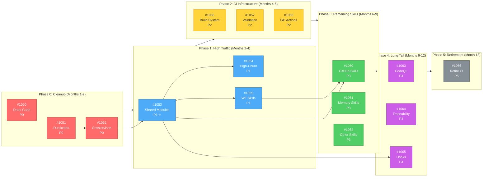
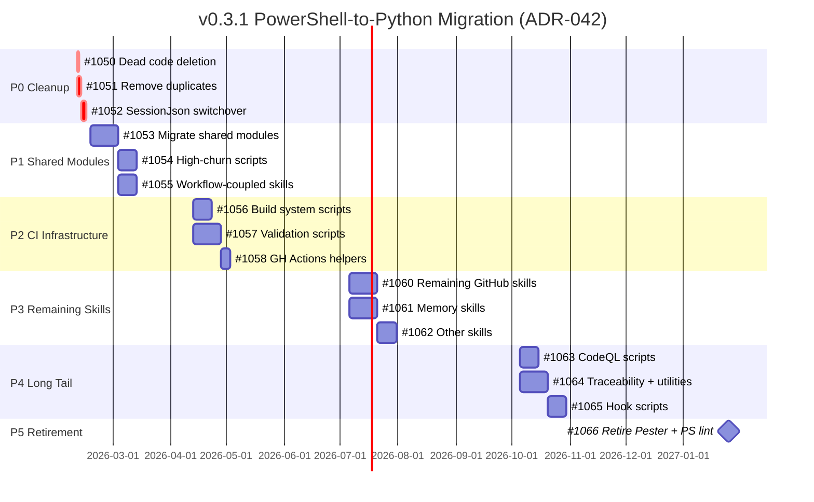
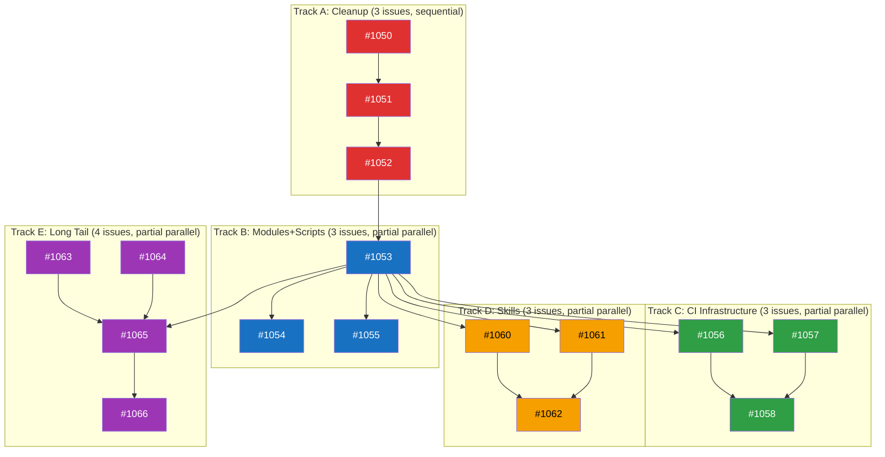
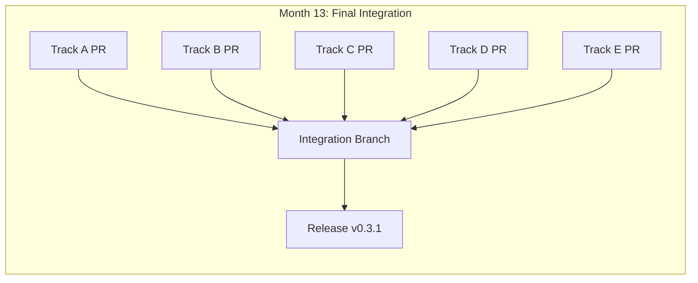

# v0.3.1 Milestone: PowerShell-to-Python Migration

**Status**: 🟡 PLANNING
**Created**: 2026-02-08
**Last Updated**: 2026-02-08
**Milestone**: [v0.3.1](https://github.com/rjmurillo/ai-agents/milestone/7)
**Epic**: [#1049](https://github.com/rjmurillo/ai-agents/issues/1049)
**Authority**: ADR-042 (Accepted 2026-01-17)
**Supersedes**: ADR-005 (PowerShell-Only Scripting, status: Superseded)
**Current Scope**: 16 issues (3 P0, 3 P1, 3 P2, 3 P3, 3 P4, 1 P5)

---

## 🚀 QUICK START: Agent Work Assignment

> **For any agent starting work**: Read this section first. It tells you exactly which track to work on and how to start.

### Step 1: Identify Your Track

| Track | Branch | Issues | Focus | Start Command |
|-------|--------|--------|-------|---------------|
| **Track A** | `track-a/cleanup` | #1050→#1051→#1052 | Dead code, duplicates, SessionJson | `git worktree add ../ai-agents-track-a -b track-a/cleanup` |
| **Track B** | `track-b/modules-scripts` | #1053→#1054,#1055 | Shared modules, high-churn scripts, workflow skills | `git worktree add ../ai-agents-track-b -b track-b/modules-scripts` |
| **Track C** | `track-c/ci-infra` | #1056,#1057→#1058 | Build system, validation, GH Actions | `git worktree add ../ai-agents-track-c -b track-c/ci-infra` |
| **Track D** | `track-d/skills` | #1060,#1061→#1062 | GitHub skills, memory skills, other skills | `git worktree add ../ai-agents-track-d -b track-d/skills` |
| **Track E** | `track-e/long-tail` | #1063,#1064→#1065→#1066 | CodeQL, traceability, hooks, retirement | `git worktree add ../ai-agents-track-e -b track-e/long-tail` |

### Step 2: Start Your Work Session

```bash
# 1. Navigate to your worktree (replace X with your track letter)
cd ../ai-agents-track-X

# 2. Start session
/session-init

# 3. Assign yourself to the issue (required)
pwsh .claude/skills/github/scripts/issue/Set-IssueAssignee.ps1 -Issue <ISSUE_NUMBER> -Assignees @("@me")

# 4. Read your first issue (use skill, no raw gh)
pwsh .claude/skills/github/scripts/issue/Get-IssueContext.ps1 -Issue <ISSUE_NUMBER>

# 5. Begin implementation
```

### Step 3: Stop/Resume Work

**To Stop (End of Session)**:
```bash
# 1. Commit your work (atomic, conventional)
git add <files>
git commit -m "feat(trackX): progress on #XXX"

# 2. Complete session log
pwsh scripts/Validate-SessionJson.ps1 -SessionPath .agents/sessions/<your-session>.json

# 3. Push your branch
git push -u origin track-X/<branch-name>
```

**To Resume (New Session)**:
```bash
# 1. Navigate to worktree
cd ../ai-agents-track-X

# 2. Pull latest
git pull

# 3. Read this PLAN.md section for your track
# 4. Check issue status (use skill, no raw gh)
pwsh .claude/skills/github/scripts/issue/Get-IssueContext.ps1 -Issue <ISSUE_NUMBER>
# 5. Continue from where you stopped
```

### Track Status Tracker

| Track | Current Issue | Status | Last Updated | Blocking? |
|-------|---------------|--------|--------------|-----------|
| A | #1050 | 🔴 Not Started | 2026-02-08 | No |
| B | #1053 | 🔴 Not Started | 2026-02-08 | Critical Path ⭐ |
| C | - | 🟡 Month 4 | - | Waits for Month 4 |
| D | - | 🟡 Month 7 | - | Waits for Month 7 |
| E | - | 🟡 Month 10 | - | Waits for Month 10 |

> **Update this table** only during integration to avoid merge conflicts. For live status, use branch handoffs in `.agents/handoffs/{branch}/{session}.md` or add an issue comment.

### Track Done Criteria (Verification Commands)

| Track | Done When | Verification Command |
|-------|-----------|---------------------|
| **A** | All cleanup complete | `git diff --name-only main...HEAD` shows 9 deleted .ps1 files + 6 deleted .Tests.ps1 files |
| **B** | Modules + scripts migrated | `pytest tests/ && python -m scripts.github_core --help` (exit code 0) |
| **C** | CI workflows updated | `gh workflow list --all \| grep -E "(pester\|powershell)"` shows 0 active workflows |
| **D** | All skills migrated | `find .claude/skills -name "*.ps1" -type f \| wc -l` returns 0 |
| **E** | Hooks + CodeQL migrated, Pester retired | `gh workflow view pester-tests` returns error (workflow deleted) |

### Track-Specific Dependencies

| Track | Depends On | Blocks | Rationale |
|-------|-----------|--------|-----------|
| **A** | None | Track B (#1052 → #1053) | SessionJson switchover needed before module migration |
| **B** | Track A (#1052) | Tracks C, D, E | Shared modules are critical path for all consumers |
| **C** | Track B (#1053) | None | Build/validation need migrated modules |
| **D** | Track B (#1053) | None | Skills need GitHubCore.psm1 → github_core.py |
| **E** | Track B (#1053), Track D (#1065 for hooks) | Track E (#1066) | Hooks need modules + skills completed |

---

## 🤖 Agent Quick Context

> **Token-efficient summary for agents.** Full details in sections below.

### P0 Blockers (Start Here)

| Issue | Title | Summary | Status |
|-------|-------|---------|--------|
| [#1050](https://github.com/rjmurillo/ai-agents/issues/1050) | Delete dead code | Remove 3 unused PS1 files (zero active references) | Track A |
| [#1051](https://github.com/rjmurillo/ai-agents/issues/1051) | Remove duplicates | Delete 5 PS1 files that have .py equivalents | Track A |
| [#1052](https://github.com/rjmurillo/ai-agents/issues/1052) | SessionJson switchover | Switch 148+ references from PS1 to Python | Track A |

### Dependency Flowchart



### Gantt Timeline (12 months)



### Parallel Tracks

- **Track A**: #1050 → #1051 → #1052 (P0 cleanup, sequential)
- **Track B**: #1053 → #1054 + #1055 (Modules unblock scripts + skills, parallel after module)
- **Track C**: #1056 + #1057 → #1058 (Build + validation, then GH Actions)
- **Track D**: #1060 + #1061 → #1062 (GitHub + memory skills, then other skills)
- **Track E**: #1063 + #1064 → #1065 → #1066 (Long tail, then retirement)

---

## Design Decisions

| Decision | Choice | Rationale |
|----------|--------|-----------|
| Deprecation period | None (delete immediately) | Internal tooling project, single consumer (AI agents) |
| Dead code | Delete before migrating | Reduces scope by ~3 scripts and associated tests |
| High-traffic skills | Promote to Phase 1 | Post-IssueComment.ps1 referenced by 7 workflows |
| Validate-SessionJson.ps1 | Include in Phase 0 | Python version exists with pytest coverage |
| Migration approach | Expand-contract per script | Add Python, verify, delete PS1 (no dual maintenance) |
| Module pattern | Python packages with `__init__.py` | Matches Python ecosystem conventions |
| Naming convention | snake_case for .py files | PEP 8 compliance (Verb-Noun.ps1 → verb_noun.py) |

---

## Current State

| Category | .ps1 (non-test) | .psm1 | .Tests.ps1 | .py (already migrated) |
|----------|-----------------|-------|------------|------------------------|
| `scripts/` | 24 | 2 | 8 | 7 |
| `.claude/skills/github/` | 23 | 1 | 10 | 0 |
| `.claude/skills/memory/` | 4 | 3 | 1 | 0 |
| `.claude/skills/` (other) | 12 | 0 | 2 | ~20 |
| `.claude/hooks/` | 13 | 1 | 0 | 1 |
| `.github/scripts/` | 2 | 3 | 3 | 0 |
| `build/` | 6 | 1 | 4 | 0 |
| `.codeql/scripts/` | 6 | 0 | 0 | 0 |
| Other | 8 | 3 | 5 | 0 |
| **Total** | **~142** | **14** | **~110** | **~28** |

### Already Migrated (Dual Existence - To Delete in P0)

| PowerShell (to delete) | Python (keep) | pytest (keep) |
|------------------------|---------------|---------------|
| `scripts/Detect-SkillViolation.ps1` | `scripts/detect_skill_violation.py` | `tests/test_detect_skill_violation.py` |
| `scripts/Check-SkillExists.ps1` | `scripts/check_skill_exists.py` | `tests/test_check_skill_exists.py` |
| `scripts/Validate-SessionJson.ps1` | `scripts/validate_session_json.py` | `tests/test_validate_session_json.py` |
| `.claude/skills/security-detection/detect-infrastructure.ps1` | `detect_infrastructure.py` | (in skill) |
| `.claude/skills/metrics/collect-metrics.ps1` | `collect_metrics.py` | (in skill) |
| `.claude/skills/fix-markdown-fences/fix_fences.ps1` | `fix_fences.py` | (in skill) |

---

## 🚨 CRITICAL PATH: Shared Modules (#1053)

**Why This Matters**: 5 shared modules block 50+ consumer scripts.

| Module | Lines | Consumers | Blocks Issues |
|--------|-------|-----------|---------------|
| `.github/scripts/AIReviewCommon.psm1` | 1312 | AI quality gate, issue triage, spec validation | #1054, #1056, #1057 |
| `.claude/skills/github/modules/GitHubCore.psm1` | 1394 | All 23 GitHub skill scripts | #1055, #1060 |
| `.github/scripts/PRMaintenanceModule.psm1` | ~200 | pr-maintenance workflow | #1054 |
| `.github/scripts/TestResultHelpers.psm1` | ~150 | Test workflows | #1056 |
| `.claude/hooks/Common/HookUtilities.psm1` | ~100 | All hook scripts | #1065 |

**Migration Strategy**:
1. Create Python package with matching API surface
2. Add pytest tests with ≥ Pester coverage
3. Update one consumer as proof-of-concept
4. Verify behavior matches (integration tests)
5. Update all consumers
6. Delete PowerShell module + tests

**Exit Criteria**: `python -c "from scripts.github_core import GitHubCore; print('OK')"` succeeds

---

## Phase 0: Cleanup (Immediate - Months 1-2)

### [#1050](https://github.com/rjmurillo/ai-agents/issues/1050) - Delete dead code

**Goals**: Remove 3 PowerShell scripts with zero active references. Reduce migration scope.

**Non-Goals**: Do not audit or delete scripts with any remaining callers. Do not migrate these to Python (they are dead code).

Scripts with zero active references (verified with `rg` across entire repo):

**Files to Delete**:
- [ ] `scripts/Fix-PR964-Validation.ps1`
- [ ] `.agents/benchmarks/test-parent-shell-impact.ps1`
- [ ] `.agents/retrospective/analyze-compliance.ps1`

**Pre-Deletion Verification**:
```bash
# Confirm zero references (must return empty)
rg "Fix-PR964-Validation" --type-not md
rg "test-parent-shell-impact" --type-not md
rg "analyze-compliance" --type-not md
```

**Verification**: `git grep -l "Fix-PR964-Validation\|test-parent-shell-impact\|analyze-compliance"` returns 0 results

**Done Criteria**:
- [ ] 3 .ps1 files deleted
- [ ] `rg "Fix-PR964-Validation|test-parent-shell-impact|analyze-compliance" --type-not md` returns 0 results
- [ ] CI passes (pester-tests.yml, powershell-lint.yml green)
- [ ] No Pester test files reference deleted scripts

### [#1051](https://github.com/rjmurillo/ai-agents/issues/1051) - Remove already-migrated duplicates

**Goals**: Delete PowerShell scripts that already have working Python equivalents. Eliminate dual maintenance.

**Non-Goals**: Do not migrate new scripts. Do not modify the Python equivalents. Do not update callers (that is #1052 for SessionJson).

**Files to Delete**:
- [ ] `scripts/Detect-SkillViolation.ps1` + `tests/Detect-SkillViolation.Tests.ps1`
- [ ] `scripts/Check-SkillExists.ps1` + `tests/Check-SkillExists.Tests.ps1`
- [ ] `scripts/Validate-SessionJson.ps1` + `tests/Validate-SessionJson.Tests.ps1`
- [ ] `.claude/skills/security-detection/detect-infrastructure.ps1` + tests
- [ ] `.claude/skills/metrics/collect-metrics.ps1` + tests
- [ ] `.claude/skills/fix-markdown-fences/fix_fences.ps1` + tests

**Verification Steps** (per script):
1. Run pytest for Python version: `pytest tests/test_<name>.py -v` (must pass)
2. Verify Python version is the active caller: `rg "<script_name>.py"` (must show callers)
3. Confirm PS1 has no unique callers: `rg "<script_name>.ps1"` (only self-references or docs)
4. Delete PS1 + Tests.ps1 files
5. Run CI: `pytest tests/ && ruff check scripts/` (must pass)

**Done Criteria**:
- [ ] 5 .ps1 files + 5 .Tests.ps1 files deleted (10 files total)
- [ ] `pytest tests/test_detect_skill_violation.py tests/test_check_skill_exists.py tests/test_validate_session_json.py -v` all pass
- [ ] `rg "Detect-SkillViolation.ps1|Check-SkillExists.ps1" --type-not md` returns 0 results
- [ ] pytest coverage for each script >= Pester baseline

### [#1052](https://github.com/rjmurillo/ai-agents/issues/1052) - Validate-SessionJson switchover

**Goals**: Switch all 148+ callers from `Validate-SessionJson.ps1` to `validate_session_json.py`. Achieve feature parity first, then update callers, then delete PS1.

**Non-Goals**: Do not rewrite the Python validation logic. Do not change session log schema. Do not modify other validation scripts.

**Known Gap (from Traycer analysis)**: The Python version is **missing investigation-only mode validation** (lines 161-244 in PowerShell version). This validates staged files against an allowlist when `SKIPPED: investigation-only` is claimed. This gap MUST be closed before switching callers.

**Phase 1: Achieve Feature Parity**:
- [ ] Port investigation-only detection: regex `(?i)SKIPPED:\s*investigation-only` in `protocolCompliance.sessionEnd` evidence
- [ ] Port allowlist patterns: `^\.agents/sessions/`, `^\.agents/analysis/`, `^\.agents/retrospective/`, `^\.serena/memories($|/)`, `^\.agents/security/`, `^\.agents/architecture/REVIEW-`, `^\.agents/critique/`, `^\.agents/memory/episodes/`
- [ ] Port staged files check: `git diff --cached --name-only` with error handling
- [ ] Add pytest tests for investigation-only mode
- [ ] Verify: `python -m scripts.validate_session_json <investigation-log>` matches PS1 output

**Phase 2: Output Compatibility Verification**:
- [ ] Run both versions on 5 passing session logs, diff output
- [ ] Run both versions on 3 failing session logs, diff output
- [ ] Run both versions on 1 investigation-only session log, diff output
- [ ] Verify exit codes match: 0=pass, 1=protocol violation, 2=usage error

**Affected Files** (~148+ references):
- `.github/workflows/ai-session-protocol.yml` (line ~169)
- `.agents/SESSION-PROTOCOL.md`
- `CLAUDE.md`
- `CRITICAL-CONTEXT.md`
- `SKILL-QUICK-REF.md`
- `.claude/skills/session-init/SKILL.md`
- `.claude/skills/session-log-fixer/SKILL.md`
- `.claude/skills/session-end/SKILL.md`
- Agent prompt files (orchestrator, implementer, qa, etc.)

**Phase 3: Caller Migration**:
- [ ] Update workflow: `pwsh scripts/Validate-SessionJson.ps1 -SessionPath` -> `python scripts/validate_session_json.py --session-path`
- [ ] Update all documentation references (batch find/replace)
- [ ] Update SKILL.md files for session skills
- [ ] Update agent prompt files
- [ ] Verify CI: `ai-session-protocol.yml` passes with Python version

**Phase 4: Cleanup**:
- [ ] Delete `scripts/Validate-SessionJson.ps1` + `tests/Validate-SessionJson.Tests.ps1` (handled in #1051)

**Verification**: `rg "Validate-SessionJson.ps1" --type-not md` returns 0 results

**Done Criteria**:
- [ ] Investigation-only mode ported with tests
- [ ] Output format identical for all test scenarios (pass, fail, investigation-only)
- [ ] 148+ references updated to Python version
- [ ] CI workflow `ai-session-protocol.yml` green with Python version
- [ ] `rg "Validate-SessionJson.ps1" --type-not md` returns 0 results

**Scope Reduction**: Phase 0 removes ~9 .ps1 files and ~6 .Tests.ps1 files from total scope.

---

## Phase 1: High-Traffic Scripts + Workflow-Coupled Skills (Months 2-4)

### [#1053](https://github.com/rjmurillo/ai-agents/issues/1053) - Shared modules (CRITICAL PATH ⭐)

**Goals**: Migrate 5 shared .psm1 modules to Python packages with matching API surfaces. Unblock all downstream issues.

**Non-Goals**: Do not migrate consumer scripts (that is #1054, #1055, #1060, #1065). Do not change module behavior or add features. Do not optimize algorithms during migration.

**Migration Order** (smallest first to establish patterns, then critical path):
1. `HookUtilities.psm1` (~100 lines, 4 functions) -- pattern establishment
2. `TestResultHelpers.psm1` (~150 lines, 1 function) -- simple, low risk
3. `PRMaintenanceModule.psm1` (~200 lines, 6 functions) -- moderate
4. `GitHubCore.psm1` (1394 lines, 21 functions) -- critical path, highest consumer count
5. `AIReviewCommon.psm1` (1312 lines, 24 functions) -- critical path, workflow-coupled

**Python Package Structure**:
```
scripts/
├── github_core/
│   ├── __init__.py          # Public API exports
│   ├── api.py               # GitHub API wrapper functions
│   ├── formatting.py        # Output formatting
│   └── validation.py        # Input validation
├── ai_review_common/
│   ├── __init__.py
│   ├── quality_gate.py
│   └── issue_triage.py
├── pr_maintenance/
│   ├── __init__.py
│   └── maintenance.py
├── test_result_helpers/
│   ├── __init__.py
│   └── helpers.py
└── hook_utilities/
    ├── __init__.py
    └── utilities.py
```

**pyproject.toml Updates Required**:
- Add to `tool.setuptools.packages.find.include`: `"scripts.github_core*"`, `"scripts.ai_review_common*"`, `"scripts.pr_maintenance*"`, `"scripts.test_result_helpers*"`, `"scripts.hook_utilities*"`
- Add to `tool.coverage.run.source`: new package paths
- Add dependency if needed: `tenacity>=8.0.0` (for `Invoke-WithRetry` replacement in AIReviewCommon)

#### Module 1: HookUtilities.psm1 (4 functions)

| PowerShell Function | Python Function | Module |
|---------------------|-----------------|--------|
| `Get-ProjectDirectory` | `get_project_directory()` | `hook_utilities/utilities.py` |
| `Test-GitCommitCommand` | `is_git_commit_command()` | `hook_utilities/utilities.py` |
| `Get-TodaySessionLog` | `get_today_session_log()` | `hook_utilities/utilities.py` |
| `Get-TodaySessionLogs` | `get_today_session_logs()` | `hook_utilities/utilities.py` |

**API Pattern**: Check `CLAUDE_PROJECT_DIR` env var, walk up for `.git`, regex match git commands, glob for session JSONs.

#### Module 2: TestResultHelpers.psm1 (1 function)

| PowerShell Function | Python Function | Module |
|---------------------|-----------------|--------|
| `New-SkippedTestResult` | `create_skipped_test_result()` | `test_result_helpers/helpers.py` |

#### Module 3: PRMaintenanceModule.psm1 (6 functions)

| PowerShell Function | Python Function | Module |
|---------------------|-----------------|--------|
| `Test-WorkflowRateLimit` | `check_workflow_rate_limit()` | `pr_maintenance/maintenance.py` |
| `Get-MaintenanceResults` | `get_maintenance_results()` | `pr_maintenance/maintenance.py` |
| `New-MaintenanceSummary` | `create_maintenance_summary()` | `pr_maintenance/maintenance.py` |
| `New-BlockedPRsAlertBody` | `create_blocked_prs_alert()` | `pr_maintenance/maintenance.py` |
| `New-WorkflowFailureAlertBody` | `create_workflow_failure_alert()` | `pr_maintenance/maintenance.py` |
| `Test-WorkflowEnvironment` | `check_workflow_environment()` | `pr_maintenance/maintenance.py` |

#### Module 4: GitHubCore.psm1 (21 functions)

| PowerShell Function | Python Function | Submodule |
|---------------------|-----------------|-----------|
| `Test-GitHubNameValid` | `is_github_name_valid()` | `validation.py` |
| `Test-SafeFilePath` | `is_safe_file_path()` | `validation.py` |
| `Assert-ValidBodyFile` | `assert_valid_body_file()` | `validation.py` |
| `Get-RepoInfo` | `get_repo_info()` | `api.py` |
| `Resolve-RepoParams` | `resolve_repo_params()` | `api.py` |
| `Test-GhAuthenticated` | `is_gh_authenticated()` | `api.py` |
| `Assert-GhAuthenticated` | `assert_gh_authenticated()` | `api.py` |
| `Write-ErrorAndExit` | `error_and_exit()` | `api.py` |
| `Invoke-GhApiPaginated` | `gh_api_paginated()` | `api.py` |
| `Invoke-GhGraphQL` | `gh_graphql()` | `api.py` |
| `Get-AllPRsWithComments` | `get_all_prs_with_comments()` | `api.py` |
| `Get-PriorityEmoji` | `get_priority_emoji()` | `formatting.py` |
| `Get-ReactionEmoji` | `get_reaction_emoji()` | `formatting.py` |
| `Get-IssueComments` | `get_issue_comments()` | `api.py` |
| `Update-IssueComment` | `update_issue_comment()` | `api.py` |
| `New-IssueComment` | `create_issue_comment()` | `api.py` |
| `Get-TrustedSourceComments` | `get_trusted_source_comments()` | `api.py` |
| `Get-BotAuthorsConfig` | `get_bot_authors_config()` | `api.py` |
| `Get-BotAuthors` | `get_bot_authors()` | `api.py` |
| `Get-UnresolvedReviewThreads` | `get_unresolved_review_threads()` | `api.py` |
| `Test-WorkflowRateLimit` | `check_workflow_rate_limit()` | `api.py` |

**Key Implementation Notes**:
- All `gh` CLI calls use `subprocess.run` with `check=True`
- Paginated API: use `--paginate` flag or implement cursor-based pagination
- GraphQL: use `gh api graphql -f query=...` pattern
- Bot authors config: parse `bot-authors.yml` with PyYAML (already a dependency)
- Validation functions return `bool`, assertion functions raise `SystemExit`

#### Module 5: AIReviewCommon.psm1 (24 functions)

| PowerShell Function | Python Function | Submodule |
|---------------------|-----------------|-----------|
| `Initialize-AIReview` | `initialize_ai_review()` | `quality_gate.py` |
| `Invoke-WithRetry` | `invoke_with_retry()` | `quality_gate.py` |
| `Get-Verdict` | `get_verdict()` | `quality_gate.py` |
| `Get-Labels` | `get_labels()` | `quality_gate.py` |
| `Get-Milestone` | `get_milestone()` | `quality_gate.py` |
| `Merge-Verdicts` | `merge_verdicts()` | `quality_gate.py` |
| `Get-FailureCategory` | `get_failure_category()` | `quality_gate.py` |
| `Format-CollapsibleSection` | `format_collapsible_section()` | `issue_triage.py` |
| `Format-VerdictAlert` | `format_verdict_alert()` | `issue_triage.py` |
| `Get-VerdictAlertType` | `get_verdict_alert_type()` | `issue_triage.py` |
| `Get-VerdictExitCode` | `get_verdict_exit_code()` | `issue_triage.py` |
| `Write-Log` | `write_log()` | `issue_triage.py` |
| `Write-LogError` | `write_log_error()` | `issue_triage.py` |
| `Assert-EnvironmentVariables` | `assert_environment_variables()` | `quality_gate.py` |
| `Get-PRChangedFiles` | `get_pr_changed_files()` | `quality_gate.py` |
| `ConvertTo-JsonEscaped` | `escape_json_string()` | `issue_triage.py` |
| `Format-MarkdownTableRow` | `format_markdown_table_row()` | `issue_triage.py` |
| `Get-VerdictEmoji` | `get_verdict_emoji()` | `issue_triage.py` |
| `Test-SpecValidationFailed` | `is_spec_validation_failed()` | `quality_gate.py` |
| `Get-LabelsFromAIOutput` | `get_labels_from_ai_output()` | `quality_gate.py` |
| `Get-MilestoneFromAIOutput` | `get_milestone_from_ai_output()` | `quality_gate.py` |
| `Get-WorkflowRunsByPR` | `get_workflow_runs_by_pr()` | `quality_gate.py` |
| `Test-RunsOverlap` | `check_runs_overlap()` | `quality_gate.py` |
| `Get-ConcurrencyGroupFromRun` | `get_concurrency_group_from_run()` | `quality_gate.py` |

**Key Implementation Notes**:
- `Invoke-WithRetry`: Replace with `tenacity.retry` decorator (exponential backoff)
- AI output parsing: regex extraction from LLM responses (JSON blocks, verdict strings)
- Environment variable assertions: raise `SystemExit` with descriptive messages
- GitHub Actions output: write to `$GITHUB_OUTPUT` file handle, not stdout

**Per-Module Checklist** (repeat for each of the 5 modules):
- [ ] Create Python package with `__init__.py` exporting public API
- [ ] Port all functions with type hints (see function tables above)
- [ ] Add pytest tests (coverage >= Pester baseline)
- [ ] Update 1 consumer as proof-of-concept
- [ ] Run integration test: call Python version from a consumer script
- [ ] Update remaining consumers
- [ ] Delete PowerShell module + Pester tests

**Done Criteria**:
- [ ] `python -c "from scripts.github_core import api, validation, formatting"` succeeds
- [ ] `python -c "from scripts.ai_review_common import quality_gate, issue_triage"` succeeds
- [ ] `python -c "from scripts.hook_utilities import utilities"` succeeds
- [ ] `python -c "from scripts.pr_maintenance import maintenance"` succeeds
- [ ] `python -c "from scripts.test_result_helpers import helpers"` succeeds
- [ ] All 56 functions ported (21 + 24 + 6 + 4 + 1)
- [ ] pytest coverage >= Pester for each module
- [ ] 1 consumer per module verified with Python import
- [ ] pyproject.toml updated with new packages

**Blocks**: #1054, #1055, #1060, #1065

### [#1054](https://github.com/rjmurillo/ai-agents/issues/1054) - High-churn scripts

**Goals**: Migrate 3 high-modification-frequency scripts to Python. Reduce ongoing PS1 maintenance cost for the most-edited files.

**Non-Goals**: Do not migrate low-churn scripts (handled in later phases). Do not refactor logic during migration.

| Script | Modifications (since Dec 2025) | Lines | Workflow | Python Target |
|--------|-------------------------------|-------|----------|---------------|
| `scripts/Invoke-PRMaintenance.ps1` | 12 | 849 | pr-maintenance | `scripts/invoke_pr_maintenance.py` |
| `.claude/skills/github/scripts/pr/Detect-CopilotFollowUpPR.ps1` | 10 | ~300 | (hook) | `.claude/skills/github/scripts/pr/detect_copilot_followup_pr.py` |
| `build/Generate-Agents.Common.psm1` | 6 | 589 | validate-generated-agents | `build/generate_agents_common.py` |

**Migration Priority**: By modification frequency (high churn = high maintenance cost)

**Per-Script Checklist**:
- [ ] Create Python equivalent with argparse CLI
- [ ] Import from migrated modules (`scripts.github_core`, `scripts.pr_maintenance`, etc.)
- [ ] Migrate Pester tests to pytest
- [ ] Run side-by-side comparison (same inputs, same outputs)
- [ ] Update workflow YAML to call Python version
- [ ] Verify CI green for 3 consecutive runs
- [ ] Delete PowerShell version + tests

**Done Criteria**:
- [ ] All 3 scripts have Python equivalents
- [ ] `python scripts/invoke_pr_maintenance.py --help` exits 0
- [ ] `pr-maintenance.yml` workflow passes with Python version
- [ ] `validate-generated-agents.yml` passes with Python version
- [ ] `rg "Invoke-PRMaintenance.ps1|Detect-CopilotFollowUpPR.ps1|Generate-Agents.Common.psm1" .github/workflows/` returns 0 results

**Depends on**: #1053 (modules)

### [#1055](https://github.com/rjmurillo/ai-agents/issues/1055) - Workflow-coupled GitHub skills

**Goals**: Migrate 5 GitHub skill scripts that are called directly from workflow YAML files. These are the highest-impact skill scripts because workflow breakage blocks all PRs.

**Non-Goals**: Do not migrate skills that are only called interactively by agents (that is #1060). Do not modify workflow logic beyond changing the script invocation.

| Script | Lines | Workflows | Priority | Python Target |
|--------|-------|-----------|----------|---------------|
| `Post-IssueComment.ps1` | ~200 | **7 workflows** | P1 (highest impact) | `post_issue_comment.py` |
| `Invoke-CopilotAssignment.ps1` | 736 | 3 workflows | P1 | `invoke_copilot_assignment.py` |
| `Set-ItemMilestone.ps1` | ~200 | 2 workflows | P1 | `set_item_milestone.py` |
| `Invoke-PRCommentProcessing.ps1` | ~300 | 1 workflow | P2 | `invoke_pr_comment_processing.py` |
| `Get-PRReviewComments.ps1` | 835 | (skill) | P2 | `get_pr_review_comments.py` |

**Migration Strategy** (per script):
1. Create `.claude/skills/github/scripts/{category}/<script_name>.py`
2. Import from `scripts.github_core` package (API, validation, formatting)
3. Add pytest tests in skill directory
4. Update workflow YAML to call `.py` version (`pwsh ...ps1` -> `python ...py`)
5. Verify CI green for 3 consecutive runs
6. Delete `.ps1` + `.Tests.ps1`

**Key Technical Notes**:
- `Post-IssueComment.ps1`: Port idempotency marker logic (HTML comment detection), upsert behavior, 403 permission handling
- `Invoke-CopilotAssignment.ps1`: Large script (736 lines), consider splitting into assignment logic + workflow formatting
- `Get-PRReviewComments.ps1`: Large script (835 lines), heavy GraphQL usage

**Done Criteria**:
- [ ] All 5 scripts have Python equivalents
- [ ] All 7 workflows using `Post-IssueComment.ps1` updated and green
- [ ] All 3 workflows using `Invoke-CopilotAssignment.ps1` updated and green
- [ ] `rg "Post-IssueComment.ps1|Invoke-CopilotAssignment.ps1|Set-ItemMilestone.ps1" .github/workflows/` returns 0 results
- [ ] pytest coverage >= Pester for each migrated script

**Depends on**: #1053 (GitHubCore module)

---

## Phase 2: CI Infrastructure (Months 4-6)

### [#1056](https://github.com/rjmurillo/ai-agents/issues/1056) - Build system

**Goals**: Migrate 6 build system scripts to Python. Enable retirement of PowerShell from the build pipeline.

**Non-Goals**: Do not retire `Invoke-PesterTests.ps1` yet (needed until Phase 5). Create Python wrapper that calls pytest instead.

| Script | Lines | Workflow |
|--------|-------|----------|
| `build/Generate-Agents.ps1` | ~200 | validate-generated-agents |
| `build/Generate-Skills.ps1` | ~200 | (build) |
| `build/scripts/Detect-AgentDrift.ps1` | ~300 | drift-detection |
| `build/scripts/Validate-PathNormalization.ps1` | ~200 | validate-paths |
| `build/scripts/Validate-PlanningArtifacts.ps1` | ~200 | validate-planning-artifacts |
| `build/scripts/Invoke-PesterTests.ps1` | 528 | pester-tests |

**Migration Order**: By dependency (Generate-Agents.ps1 first, Invoke-PesterTests.ps1 last)

**Python Package**:
```
build/
├── generator/
│   ├── __init__.py
│   ├── agents.py
│   └── skills.py
├── validation/
│   ├── drift.py
│   ├── paths.py
│   └── planning.py
└── pytest_runner.py
```

**Done Criteria**:
- [ ] All 6 scripts have Python equivalents in `build/` directory
- [ ] `validate-generated-agents.yml`, `drift-detection.yml`, `validate-paths.yml` green
- [ ] `python build/generator/agents.py --help` exits 0

### [#1057](https://github.com/rjmurillo/ai-agents/issues/1057) - Validation scripts

| Script | Lines | Workflow |
|--------|-------|----------|
| `scripts/Validate-PRDescription.ps1` | ~300 | pr-validation |
| `scripts/Validate-ActionSHAPinning.ps1` | ~200 | pr-validation |
| `scripts/Validate-Consistency.ps1` | 684 | (manual) |
| `scripts/Validate-PrePR.ps1` | 540 | (manual) |
| `scripts/Validate-TokenBudget.ps1` | ~200 | (manual) |
| `scripts/Validate-SkillFrontmatter.ps1` | 569 | slash-command-quality |
| `scripts/Validate-Traceability.ps1` | 599 | (manual) |
| `scripts/Validate-MemoryIndex.ps1` | 922 | memory-validation |

**Goals**: Migrate 8 validation scripts. Consolidate into `scripts/validation/` Python package.

**Non-Goals**: Do not add new validation rules during migration. Keep exit code contracts identical.

**Migration Priority**: Workflow scripts first (PR validation, memory validation, slash-command-quality), manual scripts second

**Python Package**:
```
scripts/validation/
├── __init__.py
├── pr_description.py
├── sha_pinning.py
├── consistency.py
├── pre_pr.py
├── token_budget.py
├── skill_frontmatter.py
├── traceability.py
└── memory_index.py
```

**Done Criteria**:
- [ ] All 8 scripts migrated to `scripts/validation/` package
- [ ] `pytest tests/test_validation_*.py -v` passes with >= 90% coverage
- [ ] `pr-validation.yml`, `memory-validation.yml`, `slash-command-quality.yml` green
- [ ] `rg "Validate-PRDescription.ps1|Validate-ActionSHAPinning.ps1" .github/workflows/` returns 0 results

### [#1058](https://github.com/rjmurillo/ai-agents/issues/1058) - GitHub Actions helpers

**Goals**: Migrate 3 GitHub Actions helper scripts used for rate limiting, metrics, and reviewer stats.

**Non-Goals**: Do not change metrics collection logic. Do not modify workflow scheduling.

| Script | Lines | Workflow | Python Target |
|--------|-------|----------|---------------|
| `.github/scripts/Test-RateLimitForWorkflow.ps1` | ~100 | pr-maintenance | `test_rate_limit.py` |
| `.github/scripts/Measure-WorkflowCoalescing.ps1` | 571 | workflow-coalescing-metrics | `measure_workflow_coalescing.py` |
| `scripts/Update-ReviewerSignalStats.ps1` | 709 | update-reviewer-stats | `update_reviewer_signal_stats.py` |

**Done Criteria**:
- [ ] All 3 scripts migrated
- [ ] `workflow-coalescing-metrics.yml` and `update-reviewer-stats.yml` green
- [ ] `rg "Test-RateLimitForWorkflow.ps1|Measure-WorkflowCoalescing.ps1|Update-ReviewerSignalStats.ps1" .github/workflows/` returns 0 results

**Depends on**: #1057 (validation scripts use rate limit checking)

### Workflow Updates (Phase 2)

| Workflow | Scripts to Migrate | Effort | Impact |
|----------|-------------------|--------|--------|
| `ai-pr-quality-gate.yml` | Post-IssueComment.ps1 | Low (done in P1) | High (7 workflows) |
| `ai-session-protocol.yml` | Validate-SessionJson.ps1 | Low (done in P0) | High (every PR) |
| `drift-detection.yml` | Detect-AgentDrift.ps1 | Low | Medium |
| `milestone-tracking.yml` | Set-ItemMilestone.ps1 | Low (done in P1) | Medium |
| `pester-tests.yml` | Invoke-PesterTests.ps1 | High (gradual retirement) | High |
| `powershell-lint.yml` | PSScriptAnalyzer | Retire (ruff covers Python) | Medium |
| `pr-maintenance.yml` | Invoke-PRMaintenance.ps1 | High | High |
| `pr-validation.yml` | Validate-PRDescription.ps1 | Medium | High |
| `slash-command-quality.yml` | Validate-SkillFrontmatter.ps1 | Low | Medium |
| `validate-generated-agents.yml` | Generate-Agents.ps1 | Medium | Medium |
| `validate-paths.yml` | Validate-PathNormalization.ps1 | Low | Low |
| `validate-planning-artifacts.yml` | Validate-PlanningArtifacts.ps1 | Low | Low |
| `workflow-coalescing-metrics.yml` | Measure-WorkflowCoalescing.ps1 | Medium | Low |

**Total Workflows Affected**: 13

---

## Phase 3: Remaining Skills (Months 6-9)

### [#1060](https://github.com/rjmurillo/ai-agents/issues/1060) - Remaining GitHub skills

**Goals**: Migrate all remaining GitHub skill scripts (agent-interactive, not workflow-coupled) to Python.

**Non-Goals**: Workflow-coupled skills are already done in #1055. Do not restructure skill directory layout.

| Directory | Remaining Scripts | Example |
|-----------|-------------------|---------|
| `.claude/skills/github/scripts/pr/` | ~9 scripts | Get-PRContext.ps1, Close-PR.ps1 |
| `.claude/skills/github/scripts/issue/` | ~5 scripts | Create-Issue.ps1, Close-Issue.ps1 |
| `.claude/skills/github/scripts/reactions/` | 1 script | Add-CommentReaction.ps1 |
| `.claude/skills/github/scripts/utils/` | 1 script | Format-MarkdownTable.ps1 |

**Total**: ~16 scripts

**Done Criteria**:
- [ ] `find .claude/skills/github/scripts -name "*.ps1" -type f | wc -l` returns 0
- [ ] All Python equivalents import from `scripts.github_core`
- [ ] SKILL.md files updated to reference Python scripts
- [ ] pytest coverage >= Pester for each migrated script

**Depends on**: #1053 (GitHubCore), #1055 (high-priority skills migrated first)

### [#1061](https://github.com/rjmurillo/ai-agents/issues/1061) - Memory skills

**Goals**: Migrate 7 memory skill scripts/modules to Python. Maintain memory search performance (<20ms).

**Non-Goals**: Do not change memory schema or storage format. Do not modify Serena/Forgetful integration points.

| Script | Lines | Notes |
|--------|-------|-------|
| `MemoryRouter.psm1` | 577 | Core routing module |
| `ReflexionMemory.psm1` | 996 | Largest module |
| `Search-Memory.ps1` | ~200 | CLI entry point |
| `Extract-SessionEpisode.ps1` | 530 | Session replay |
| `Measure-MemoryPerformance.ps1` | ~200 | Benchmarking |
| `Update-CausalGraph.ps1` | ~200 | Graph updates |
| `SchemaValidation.psm1` | ~200 | Validation logic |

**Python Package**:
```
.claude/skills/memory/
├── memory_router/
│   ├── __init__.py
│   ├── router.py
│   └── reflexion.py
├── scripts/
│   ├── search_memory.py
│   ├── extract_episode.py
│   ├── measure_performance.py
│   ├── update_causal_graph.py
│   └── validate_schema.py
└── tests/
```

**Done Criteria**:
- [ ] Memory CLI works: `python -m memory_router.search "test query"` returns results
- [ ] Performance: search completes in < 20ms (measured by `measure_performance.py`)
- [ ] Schema validation: `python -m memory_router.validate_schema` exit 0
- [ ] `jsonschema` dependency added to pyproject.toml

### [#1062](https://github.com/rjmurillo/ai-agents/issues/1062) - Session, merge-resolver, and other skills

**Goals**: Migrate remaining 11 skills (21 scripts total). Clear all non-GitHub, non-memory PS1 from skills directory.

**Non-Goals**: Do not restructure skill architecture. Do not change skill SKILL.md prompt content beyond updating script references.

**11 Skills with 1-4 scripts each**:
- session-init (1 script)
- session-end (1 script)
- session-log-fixer (2 scripts)
- merge-resolver (3 scripts)
- security-scan (2 scripts)
- doc-sync (1 script)
- adr-review (4 scripts)
- threat-modeling (1 script)
- codeql-scan (1 script)
- metrics (2 scripts)
- slashcommandcreator (3 scripts)

**Done Criteria**:
- [ ] All 21 scripts migrated to Python
- [ ] All skill SKILL.md files updated to reference Python scripts
- [ ] `find .claude/skills -name "*.ps1" -not -path "*/github/*" -not -path "*/memory/*" -type f | wc -l` returns 0
- [ ] pytest coverage >= Pester for each migrated script

**Depends on**: #1060, #1061 (GitHub + memory skills provide patterns)

---

## Phase 4: Long Tail (Months 9-12+)

### [#1063](https://github.com/rjmurillo/ai-agents/issues/1063) - CodeQL scripts

**Goals**: Migrate 6 CodeQL analysis scripts to Python. Maintain SARIF output format compatibility.

**Non-Goals**: Do not change CodeQL queries or analysis rules. Do not modify `.github/workflows/codeql-analysis.yml` beyond script references.

**6 scripts totaling ~3,068 lines**:
- `.codeql/scripts/Analyze-*.ps1` (6 files)

**Migration**: Create `.codeql/scripts/analyze/` Python package

**Done Criteria**:
- [ ] All 6 scripts migrated
- [ ] CodeQL analysis workflow green
- [ ] SARIF output format validated against existing schema

### [#1064](https://github.com/rjmurillo/ai-agents/issues/1064) - Traceability and utilities

**Goals**: Migrate 13 traceability and utility scripts to Python.

**Non-Goals**: Do not change traceability cache format. Do not add new utility functions.

**3 traceability scripts + 10 utility scripts**:
- `scripts/traceability/` (3 scripts)
- `scripts/utilities/` (10 scripts)

**Done Criteria**:
- [ ] All 13 scripts migrated
- [ ] `find scripts/traceability scripts/utilities -name "*.ps1" -type f | wc -l` returns 0
- [ ] Traceability graph generation works: `python scripts/traceability/show_graph.py --dry-run` exit 0

### [#1065](https://github.com/rjmurillo/ai-agents/issues/1065) - Hook scripts

**Goals**: Migrate 12 git hook scripts to Python. Maintain hook contract (input format, exit codes, timing).

**Non-Goals**: Do not change hook registration mechanism. Do not add new hooks. Do not modify `.claude/settings.json` hook configuration beyond script paths.

**Risk**: Hooks run on every commit/push. A broken hook blocks all developer workflow. Migrate one hook at a time with immediate rollback capability.

**12 hook scripts across 7 hook directories**:
- `.githooks/pre-commit` (5 hooks)
- `.githooks/pre-push` (3 hooks)
- `.githooks/post-commit` (2 hooks)
- `.githooks/commit-msg` (2 hooks)

**Done Criteria**:
- [ ] All 12 hooks call Python scripts
- [ ] `HookUtilities.psm1` deleted (migrated in #1053)
- [ ] `find .claude/hooks .githooks -name "*.ps1" -type f | wc -l` returns 0
- [ ] Manual verification: commit, push, and commit-msg hooks fire correctly

**Depends on**: #1053 (HookUtilities.psm1 -> hook_utilities.py)

---

## Phase 5: Retirement (Month 13)

### [#1066](https://github.com/rjmurillo/ai-agents/issues/1066) - Retire Pester and PSScriptAnalyzer CI

**Goals**: Delete Pester and PSScriptAnalyzer CI workflows. Remove all remaining PowerShell infrastructure. Verify zero PS1/PSM1 files remain.

**Non-Goals**: Do not remove PowerShell from GitHub Actions runner images (not our concern). Do not update external documentation or downstream consumers.

**Prerequisites**: ALL previous phases (0-4) must be complete. Gate 4-5 must pass.

**Workflows to Delete**:
- [ ] `.github/workflows/pester-tests.yml`
- [ ] `.github/workflows/powershell-lint.yml`

**Files to Delete**:
- [ ] `build/scripts/Invoke-PesterTests.ps1`
- [ ] `tests/TestUtilities.psm1`
- [ ] All `*.Tests.ps1` files (if any remain)

**Verification**:
```bash
# No PowerShell files remain
find . -name "*.ps1" -o -name "*.psm1" | wc -l  # Should return 0

# Pester workflow deleted
gh workflow view pester-tests  # Should error

# PSScriptAnalyzer workflow deleted
gh workflow view powershell-lint  # Should error
```

**Exit Criteria**: Zero PowerShell files in repository, CI passes without Pester/PSScriptAnalyzer

---

## Migration Checklist (per script)

No deprecation period. Delete PowerShell immediately after Python passes tests.

1. [ ] Create Python equivalent at matching location (`.ps1` → `.py`, snake_case)
2. [ ] Migrate Pester tests to pytest with equivalent coverage
3. [ ] Verify identical behavior: run both against same inputs
4. [ ] Update all callers (workflows, SKILL.md, other scripts)
5. [ ] Delete PowerShell version (`.ps1` and `.Tests.ps1`)
6. [ ] Update any CLAUDE.md / SKILL.md / SKILL-QUICK-REF.md references

## Naming Convention

| PowerShell | Python |
|-----------|--------|
| `Verb-Noun.ps1` | `verb_noun.py` (snake_case) |
| `Module.psm1` | `module.py` or `module/` package |
| `Noun.Tests.ps1` | `test_noun.py` |

---

## Dependencies and Risks

### Blocking Dependencies

| Dependency | Blocks | Issue |
|-----------|--------|-------|
| GitHubCore.psm1 | 23 GitHub skill scripts | #1053 |
| AIReviewCommon.psm1 | 3 AI quality gate workflows | #1053 |
| HookUtilities.psm1 | 12 hook scripts | #1053 |

### Risks

| Risk | Likelihood | Impact | Mitigation |
|------|-----------|--------|------------|
| Output format differences | Medium | High | Verify output compatibility before switching |
| Python 3.13 bugs | Low | Medium | Pin to 3.12 via `.python-version` |
| Workflow breakage | Medium | High | Expand-contract: add Python, verify, delete PS1 |
| Test coverage regression | Medium | Medium | Require pytest >= Pester before deletion |
| Module API changes | Medium | High | Maintain identical function signatures during migration |

---

## Success Metrics

| Metric | Target |
|--------|--------|
| PowerShell files remaining | 0 by end of migration |
| pytest coverage | >= Pester for each migrated script |
| CI failures during migration | 0 |
| Pester workflow | Retired (#1066) |
| PSScriptAnalyzer workflow | Retired (#1066) |
| Dual-maintenance period | 0 weeks (expand-contract, no overlap) |

---

## 🚀 Parallel Execution Plan (Operator Guide)

**Recommended Instances**: 5 concurrent worktrees (peak parallelism)
**Minimum Instances**: 2 (Track A + Track B cover critical path)

### Independent Tracks (Dependencies Managed)



### Instance Allocation by Month

| Month | Instance 1 | Instance 2 | Instance 3 | Instance 4 | Instance 5 |
|-------|------------|------------|------------|------------|------------|
| **1-2** | #1050→#1051→#1052 (Track A) | - | - | - | - |
| **2-4** | #1053 (Track B) | #1054 (Track B) | #1055 (Track B) | - | - |
| **4-6** | #1056 (Track C) | #1057 (Track C) | #1058 (Track C) | - | - |
| **6-9** | #1060 (Track D) | #1061 (Track D) | #1062 (Track D) | - | - |
| **9-12** | #1063 (Track E) | #1064 (Track E) | #1065 (Track E) | - | - |
| **13** | #1066 (Track E) | - | - | - | - |

### Worktree Setup Commands

```bash
# Create 5 worktrees for parallel execution
git worktree add ../ai-agents-track-a -b track-a/cleanup
git worktree add ../ai-agents-track-b -b track-b/modules-scripts
git worktree add ../ai-agents-track-c -b track-c/ci-infra
git worktree add ../ai-agents-track-d -b track-d/skills
git worktree add ../ai-agents-track-e -b track-e/long-tail
```

### Track Specifications

| Track | Issues | Duration | Start | Branch | Files Modified |
|-------|--------|----------|-------|--------|----------------|
| **A: Cleanup** | #1050→#1051→#1052 | 2 months | Month 1 | `track-a/cleanup` | Delete 15 files, update 148+ references |
| **B: Modules+Scripts** | #1053→#1054,#1055 | 2 months | Month 2 | `track-b/modules-scripts` | 5 modules + 8 scripts + 5 workflow skills |
| **C: CI Infrastructure** | #1056,#1057→#1058 | 2 months | Month 4 | `track-c/ci-infra` | 6 build + 8 validation + 3 GH Actions scripts |
| **D: Skills** | #1060,#1061→#1062 | 3 months | Month 6 | `track-d/skills` | 16 GitHub + 7 memory + 21 other skills |
| **E: Long Tail** | #1063,#1064→#1065→#1066 | 4 months | Month 9 | `track-e/long-tail` | 6 CodeQL + 13 utils + 12 hooks + CI retirement |

### Merge Strategy



**Merge Order** (respects dependencies):
1. Track A (#1050-#1052 cleanup) - Removes dead code, enables Track B
2. Track B (#1053-#1055 modules) - Critical path, unblocks all other tracks
3. Track C (#1056-#1058 CI) - Infrastructure, independent after Track B
4. Track D (#1060-#1062 skills) - Independent after Track B
5. Track E (#1063-#1066 long tail) - Final cleanup and retirement

### Conflict Risk Assessment

| Track Pair | Risk | Shared Files | Mitigation |
|------------|------|--------------|------------|
| A ↔ B | **MEDIUM** | SessionJson references | Merge Track A first, rebase Track B |
| B ↔ C | MEDIUM | AIReviewCommon consumers | Coordinate module migration timing |
| B ↔ D | **HIGH** | GitHubCore consumers | Merge Track B first, rebase Track D |
| B ↔ E | MEDIUM | HookUtilities consumers | Coordinate module migration timing |
| C ↔ D | LOW | None | Independent |
| C ↔ E | LOW | CI workflows (minimal overlap) | Independent |
| D ↔ E | LOW | Hook scripts (late in Track E) | Coordinate hook migration |

### Autonomous Execution Checklist

- [ ] Create 5 git worktrees per commands above
- [ ] Assign one Claude Code instance per worktree
- [ ] Each instance reads this PLAN.md for context
- [ ] Each instance works only on its assigned track
- [ ] Use `/session-init` at start of each track
- [ ] Create PR per track when complete
- [ ] Human operator reviews and merges in order
- [ ] Run integration tests after each merge

---

## Phase Transition Gates

Each phase transition requires explicit validation before starting the next phase. No phase begins until its predecessor passes all gates.

| Gate | From | To | Validation Command | Required Result |
|------|------|----|--------------------|-----------------|
| **Gate 0-1** | P0 Cleanup | P1 Shared Modules | `rg "\.ps1" scripts/Detect-SkillViolation scripts/Check-SkillExists scripts/Fix-PR964 2>/dev/null; echo $?` | Exit 1 (files not found) |
| **Gate 1-2** | P1 Modules | P2 CI Infrastructure | `python -c "from scripts.github_core import api; from scripts.ai_review_common import quality_gate"` | Exit 0 |
| **Gate 2-3** | P2 CI | P3 Skills | All CI workflows green for 5 consecutive PRs after migration | No regressions |
| **Gate 3-4** | P3 Skills | P4 Long Tail | `find .claude/skills -name "*.ps1" -type f \| wc -l` | Returns 0 |
| **Gate 4-5** | P4 Long Tail | P5 Retirement | `find . -name "*.ps1" -not -path "./.git/*" -type f \| wc -l` | Returns 0 |

**Gate Checklist** (apply at every transition):
- [ ] All issues in departing phase are closed
- [ ] pytest coverage >= Pester baseline for all migrated modules
- [ ] No open regressions in CI
- [ ] Track branch merged to main
- [ ] Integration test suite passes: `pytest tests/ -v` exit 0

---

## Rollback Procedure

If a migration fails mid-phase and cannot be fixed forward:

### Per-Script Rollback

1. Revert the commit that deleted the PS1 file: `git revert <sha>`
2. Revert the commit that updated workflow callers: `git revert <sha>`
3. Keep the Python version in place (do not delete, fix later)
4. Re-enable PS1 as active caller in workflow YAML
5. Open a bug issue tracking the Python version failure

### Per-Module Rollback (#1053 only)

Since modules have many consumers, a module rollback requires:

1. Revert all consumer updates to re-import from PS1 module
2. Revert the module deletion commit
3. Keep Python package in place for incremental fixing
4. Add both PS1 and Python to CI to prevent future regression

### Decision Criteria

| Severity | Action | Timeframe |
|----------|--------|-----------|
| Single script fails tests | Fix forward in same PR | Hours |
| Module migration breaks 3+ consumers | Rollback module, fix, retry | 1-2 days |
| CI pipeline broken for > 4 hours | Full phase rollback | Immediate |
| Output format incompatibility discovered post-merge | Rollback callers, fix Python, retry | 1 day |

---

## Python Dependency Manifest

New dependencies required per phase. All added to `pyproject.toml` `[project] dependencies` or `[project.optional-dependencies] dev`.

| Phase | Dependency | Version | Purpose | Required By |
|-------|-----------|---------|---------|-------------|
| P1 | `tenacity` | >= 8.0.0 | Retry with exponential backoff | AIReviewCommon `Invoke-WithRetry` |
| P1 | `PyYAML` | 6.0.3 | YAML parsing (already present) | GitHubCore `Get-BotAuthorsConfig` |
| P2 | `pydantic` | >= 2.0.0 | Schema validation for planning artifacts | `Validate-PlanningArtifacts` |
| P3 | `jsonschema` | >= 4.0.0 | Memory schema validation | `SchemaValidation.psm1` |

**Already Available** (no new install needed):
- `subprocess` (stdlib) -- `gh` CLI calls
- `pathlib` (stdlib) -- cross-platform paths
- `argparse` (stdlib) -- CLI interfaces
- `re` (stdlib) -- regex for output parsing
- `json` (stdlib) -- JSON handling
- `os` (stdlib) -- environment variables, file operations
- `pytest` (dev dependency) -- test framework
- `ruff` (dev dependency) -- linting (replaces PSScriptAnalyzer)

---

## Pester Coverage Baseline

Before deleting any PS1 file, capture Pester coverage as the minimum bar for pytest.

**Baseline Capture Command** (run once before Phase 0):
```bash
pwsh -c "
  \$result = Invoke-Pester -Path tests/ -CodeCoverage scripts/*.ps1 -PassThru
  \$result.CodeCoverage | Select-Object `
    @{N='TotalCommands';E={\$_.NumberOfCommandsAnalyzed}}, `
    @{N='ExecutedCommands';E={\$_.NumberOfCommandsExecuted}}, `
    @{N='MissedCommands';E={\$_.NumberOfCommandsMissed}}, `
    @{N='Coverage';E={[math]::Round(\$_.NumberOfCommandsExecuted / \$_.NumberOfCommandsAnalyzed * 100, 2)}}
"
```

**Store baseline**: Save output to `.agents/planning/v0.3.1/pester-coverage-baseline.json`

**Per-migration coverage rule**: `pytest --cov=<module> --cov-fail-under=<pester_baseline_percent>`

---

## ADR Status

- **ADR-005**: `Superseded` (correctly marked, no changes needed)
- **ADR-042**: `Accepted` (active, governs this migration)

---

## References

- [ADR-042: Python Migration Strategy](../../architecture/ADR-042-python-migration-strategy.md)
- [ADR-005: PowerShell-Only Scripting](../../architecture/ADR-005-powershell-only-scripting.md) (Superseded)
- [ADR-006: Thin Workflows, Testable Modules](../../architecture/ADR-006-thin-workflows-testable-modules.md) (still active)
- [Epic #1049](https://github.com/rjmurillo/ai-agents/issues/1049)
- [Milestone v0.3.1](https://github.com/rjmurillo/ai-agents/milestone/7)
- [Project Details](.agents/projects/v0.3.1/PowerShell-migration.md)
