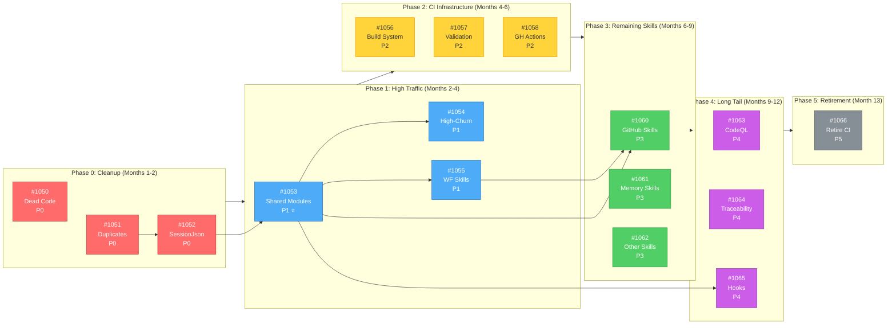
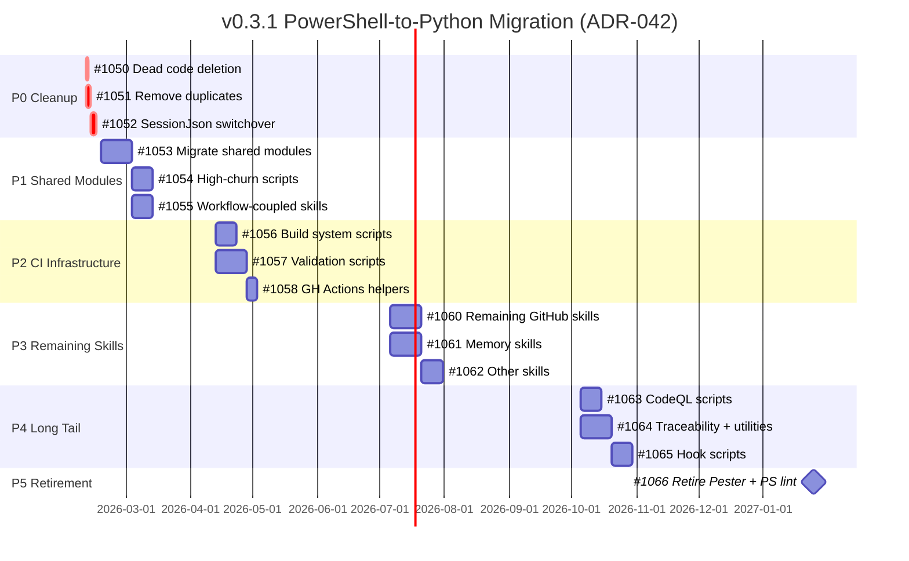
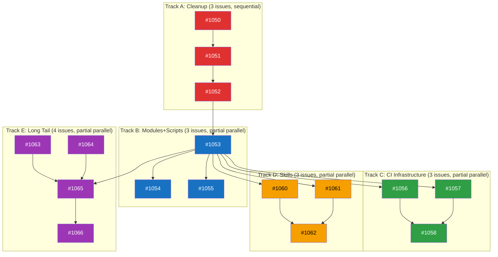
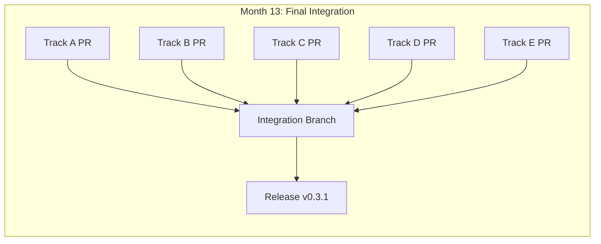

# v0.3.1 Milestone: PowerShell-to-Python Migration

**Status**: 🟡 PLANNING
**Created**: 2026-02-08
**Last Updated**: 2026-02-08
**Milestone**: [v0.3.1](https://github.com/rjmurillo/ai-agents/milestone/7)
**Epic**: [#1049](https://github.com/rjmurillo/ai-agents/issues/1049)
**Authority**: ADR-042 (Accepted 2026-01-17)
**Supersedes**: ADR-005 (PowerShell-Only Scripting, status: Superseded)
**Current Scope**: 16 issues (3 P0, 3 P1, 3 P2, 3 P3, 3 P4, 1 P5)

---

## 🚀 QUICK START: Agent Work Assignment

> **For any agent starting work**: Read this section first. It tells you exactly which track to work on and how to start.

### Step 1: Identify Your Track

| Track | Branch | Issues | Focus | Start Command |
|-------|--------|--------|-------|---------------|
| **Track A** | `track-a/cleanup` | #1050→#1051→#1052 | Dead code, duplicates, SessionJson | `git worktree add ../ai-agents-track-a -b track-a/cleanup` |
| **Track B** | `track-b/modules-scripts` | #1053→#1054,#1055 | Shared modules, high-churn scripts, workflow skills | `git worktree add ../ai-agents-track-b -b track-b/modules-scripts` |
| **Track C** | `track-c/ci-infra` | #1056,#1057→#1058 | Build system, validation, GH Actions | `git worktree add ../ai-agents-track-c -b track-c/ci-infra` |
| **Track D** | `track-d/skills` | #1060,#1061→#1062 | GitHub skills, memory skills, other skills | `git worktree add ../ai-agents-track-d -b track-d/skills` |
| **Track E** | `track-e/long-tail` | #1063,#1064→#1065→#1066 | CodeQL, traceability, hooks, retirement | `git worktree add ../ai-agents-track-e -b track-e/long-tail` |

### Step 2: Start Your Work Session

```bash
# 1. Navigate to your worktree (replace X with your track letter)
cd ../ai-agents-track-X

# 2. Start session
/session-init

# 3. Assign yourself to the issue (required)
pwsh .claude/skills/github/scripts/issue/Set-IssueAssignee.ps1 -Issue <ISSUE_NUMBER> -Assignees @("@me")

# 4. Read your first issue (use skill, no raw gh)
pwsh .claude/skills/github/scripts/issue/Get-IssueContext.ps1 -Issue <ISSUE_NUMBER>

# 5. Begin implementation
```

### Step 3: Stop/Resume Work

**To Stop (End of Session)**:
```bash
# 1. Commit your work (atomic, conventional)
git add <files>
git commit -m "feat(trackX): progress on #XXX"

# 2. Complete session log
pwsh scripts/Validate-SessionJson.ps1 -SessionPath .agents/sessions/<your-session>.json

# 3. Push your branch
git push -u origin track-X/<branch-name>
```

**To Resume (New Session)**:
```bash
# 1. Navigate to worktree
cd ../ai-agents-track-X

# 2. Pull latest
git pull

# 3. Read this PLAN.md section for your track
# 4. Check issue status (use skill, no raw gh)
pwsh .claude/skills/github/scripts/issue/Get-IssueContext.ps1 -Issue <ISSUE_NUMBER>
# 5. Continue from where you stopped
```

### Track Status Tracker

| Track | Current Issue | Status | Last Updated | Blocking? |
|-------|---------------|--------|--------------|-----------|
| A | #1050 | 🔴 Not Started | 2026-02-08 | No |
| B | #1053 | 🔴 Not Started | 2026-02-08 | Critical Path ⭐ |
| C | - | 🟡 Month 4 | - | Waits for Month 4 |
| D | - | 🟡 Month 7 | - | Waits for Month 7 |
| E | - | 🟡 Month 10 | - | Waits for Month 10 |

> **Update this table** only during integration to avoid merge conflicts. For live status, use branch handoffs in `.agents/handoffs/{branch}/{session}.md` or add an issue comment.

### Track Done Criteria (Verification Commands)

| Track | Done When | Verification Command |
|-------|-----------|---------------------|
| **A** | All cleanup complete | `git diff --name-only main...HEAD` shows 9 deleted .ps1 files + 6 deleted .Tests.ps1 files |
| **B** | Modules + scripts migrated | `pytest tests/ && python -m scripts.github_core --help` (exit code 0) |
| **C** | CI workflows updated | `gh workflow list --all \| grep -E "(pester\|powershell)"` shows 0 active workflows |
| **D** | All skills migrated | `find .claude/skills -name "*.ps1" -type f \| wc -l` returns 0 |
| **E** | Hooks + CodeQL migrated, Pester retired | `gh workflow view pester-tests` returns error (workflow deleted) |

### Track-Specific Dependencies

| Track | Depends On | Blocks | Rationale |
|-------|-----------|--------|-----------|
| **A** | None | Track B (#1052 → #1053) | SessionJson switchover needed before module migration |
| **B** | Track A (#1052) | Tracks C, D, E | Shared modules are critical path for all consumers |
| **C** | Track B (#1053) | None | Build/validation need migrated modules |
| **D** | Track B (#1053) | None | Skills need GitHubCore.psm1 → github_core.py |
| **E** | Track B (#1053), Track D (#1065 for hooks) | Track E (#1066) | Hooks need modules + skills completed |

---

## 🤖 Agent Quick Context

> **Token-efficient summary for agents.** Full details in sections below.

### P0 Blockers (Start Here)

| Issue | Title | Summary | Status |
|-------|-------|---------|--------|
| [#1050](https://github.com/rjmurillo/ai-agents/issues/1050) | Delete dead code | Remove 3 unused PS1 files (zero active references) | Track A |
| [#1051](https://github.com/rjmurillo/ai-agents/issues/1051) | Remove duplicates | Delete 5 PS1 files that have .py equivalents | Track A |
| [#1052](https://github.com/rjmurillo/ai-agents/issues/1052) | SessionJson switchover | Switch 148+ references from PS1 to Python | Track A |

### Dependency Flowchart



### Gantt Timeline (12 months)



### Parallel Tracks

- **Track A**: #1050 → #1051 → #1052 (P0 cleanup, sequential)
- **Track B**: #1053 → #1054 + #1055 (Modules unblock scripts + skills, parallel after module)
- **Track C**: #1056 + #1057 → #1058 (Build + validation, then GH Actions)
- **Track D**: #1060 + #1061 → #1062 (GitHub + memory skills, then other skills)
- **Track E**: #1063 + #1064 → #1065 → #1066 (Long tail, then retirement)

---

## Design Decisions

| Decision | Choice | Rationale |
|----------|--------|-----------|
| Deprecation period | None (delete immediately) | Internal tooling project, single consumer (AI agents) |
| Dead code | Delete before migrating | Reduces scope by ~3 scripts and associated tests |
| High-traffic skills | Promote to Phase 1 | Post-IssueComment.ps1 referenced by 7 workflows |
| Validate-SessionJson.ps1 | Include in Phase 0 | Python version exists with pytest coverage |
| Migration approach | Expand-contract per script | Add Python, verify, delete PS1 (no dual maintenance) |
| Module pattern | Python packages with `__init__.py` | Matches Python ecosystem conventions |
| Naming convention | snake_case for .py files | PEP 8 compliance (Verb-Noun.ps1 → verb_noun.py) |

---

## Current State

| Category | .ps1 (non-test) | .psm1 | .Tests.ps1 | .py (already migrated) |
|----------|-----------------|-------|------------|------------------------|
| `scripts/` | 24 | 2 | 8 | 7 |
| `.claude/skills/github/` | 23 | 1 | 10 | 0 |
| `.claude/skills/memory/` | 4 | 3 | 1 | 0 |
| `.claude/skills/` (other) | 12 | 0 | 2 | ~20 |
| `.claude/hooks/` | 13 | 1 | 0 | 1 |
| `.github/scripts/` | 2 | 3 | 3 | 0 |
| `build/` | 6 | 1 | 4 | 0 |
| `.codeql/scripts/` | 6 | 0 | 0 | 0 |
| Other | 8 | 3 | 5 | 0 |
| **Total** | **~142** | **14** | **~110** | **~28** |

### Already Migrated (Dual Existence - To Delete in P0)

| PowerShell (to delete) | Python (keep) | pytest (keep) |
|------------------------|---------------|---------------|
| `scripts/Detect-SkillViolation.ps1` | `scripts/detect_skill_violation.py` | `tests/test_detect_skill_violation.py` |
| `scripts/Check-SkillExists.ps1` | `scripts/check_skill_exists.py` | `tests/test_check_skill_exists.py` |
| `scripts/Validate-SessionJson.ps1` | `scripts/validate_session_json.py` | `tests/test_validate_session_json.py` |
| `.claude/skills/security-detection/detect-infrastructure.ps1` | `detect_infrastructure.py` | (in skill) |
| `.claude/skills/metrics/collect-metrics.ps1` | `collect_metrics.py` | (in skill) |
| `.claude/skills/fix-markdown-fences/fix_fences.ps1` | `fix_fences.py` | (in skill) |

---

## 🚨 CRITICAL PATH: Shared Modules (#1053)

**Why This Matters**: 5 shared modules block 50+ consumer scripts.

| Module | Lines | Consumers | Blocks Issues |
|--------|-------|-----------|---------------|
| `.github/scripts/AIReviewCommon.psm1` | 1312 | AI quality gate, issue triage, spec validation | #1054, #1056, #1057 |
| `.claude/skills/github/modules/GitHubCore.psm1` | 1394 | All 23 GitHub skill scripts | #1055, #1060 |
| `.github/scripts/PRMaintenanceModule.psm1` | ~200 | pr-maintenance workflow | #1054 |
| `.github/scripts/TestResultHelpers.psm1` | ~150 | Test workflows | #1056 |
| `.claude/hooks/Common/HookUtilities.psm1` | ~100 | All hook scripts | #1065 |

**Migration Strategy**:
1. Create Python package with matching API surface
2. Add pytest tests with ≥ Pester coverage
3. Update one consumer as proof-of-concept
4. Verify behavior matches (integration tests)
5. Update all consumers
6. Delete PowerShell module + tests

**Exit Criteria**: `python -c "from scripts.github_core import GitHubCore; print('OK')"` succeeds

---

## Phase 0: Cleanup (Immediate - Months 1-2)

### [#1050](https://github.com/rjmurillo/ai-agents/issues/1050) - Delete dead code

Scripts with zero active references (verified with `rg` across entire repo):

**Files to Delete**:
- [ ] `scripts/Fix-PR964-Validation.ps1`
- [ ] `.agents/benchmarks/test-parent-shell-impact.ps1`
- [ ] `.agents/retrospective/analyze-compliance.ps1`

**Verification**: `git grep -l "Fix-PR964-Validation\|test-parent-shell-impact\|analyze-compliance"` returns 0 results

**Exit Criteria**: 3 .ps1 files deleted, no references in codebase

### [#1051](https://github.com/rjmurillo/ai-agents/issues/1051) - Remove already-migrated duplicates

**Files to Delete**:
- [ ] `scripts/Detect-SkillViolation.ps1` + `tests/Detect-SkillViolation.Tests.ps1`
- [ ] `scripts/Check-SkillExists.ps1` + `tests/Check-SkillExists.Tests.ps1`
- [ ] `scripts/Validate-SessionJson.ps1` + `tests/Validate-SessionJson.Tests.ps1`
- [ ] `.claude/skills/security-detection/detect-infrastructure.ps1` + tests
- [ ] `.claude/skills/metrics/collect-metrics.ps1` + tests
- [ ] `.claude/skills/fix-markdown-fences/fix_fences.ps1` + tests

**Verification Steps**:
1. Run pytest for each Python version: `pytest tests/test_<name>.py -v`
2. Verify Python versions are active callers: `rg "<script_name>.py"`
3. Check no PS1 references remain: `rg "<script_name>.ps1"`
4. Delete PS1 + Tests.ps1 files

**Exit Criteria**: 5 .ps1 files + 5 .Tests.ps1 files deleted, pytest coverage ≥ Pester

### [#1052](https://github.com/rjmurillo/ai-agents/issues/1052) - Validate-SessionJson switchover

**Affected Files** (~148+ references):
- `.github/workflows/ai-session-protocol.yml`
- `.agents/SESSION-PROTOCOL.md`
- `CLAUDE.md`
- `CRITICAL-CONTEXT.md`
- `.claude/skills/session-init/SKILL.md`
- `.claude/skills/session-log-fixer/SKILL.md`
- Agent prompt files (orchestrator, implementer, etc.)

**Migration Checklist**:
- [ ] Compare output format: `pwsh scripts/Validate-SessionJson.ps1 -SessionPath <log>` vs `python -m scripts.validate_session_json <log>`
- [ ] Verify exit codes match (0=pass, 1=fail)
- [ ] Update workflow: Change `pwsh scripts/Validate-SessionJson.ps1` → `python -m scripts.validate_session_json`
- [ ] Update all documentation references
- [ ] Delete `scripts/Validate-SessionJson.ps1` + `tests/Validate-SessionJson.Tests.ps1`

**Verification**: `rg "Validate-SessionJson.ps1"` returns 0 results (only .py version remains)

**Exit Criteria**: 148+ references updated, CI workflow passes with Python version

**Scope Reduction**: Phase 0 removes ~9 .ps1 files and ~6 .Tests.ps1 files from total scope.

---

## Phase 1: High-Traffic Scripts + Workflow-Coupled Skills (Months 2-4)

### [#1053](https://github.com/rjmurillo/ai-agents/issues/1053) - Shared modules (CRITICAL PATH ⭐)

**Migration Order** (by consumer count):
1. `GitHubCore.psm1` (1394 lines, 23 consumers)
2. `AIReviewCommon.psm1` (1312 lines, 3 workflows)
3. `PRMaintenanceModule.psm1` (~200 lines, 1 workflow)
4. `TestResultHelpers.psm1` (~150 lines, test workflows)
5. `HookUtilities.psm1` (~100 lines, 12 hook scripts)

**Python Package Structure**:
```
scripts/
├── github_core/
│   ├── __init__.py          # Public API exports
│   ├── api.py               # GitHub API wrapper functions
│   ├── formatting.py        # Output formatting
│   └── validation.py        # Input validation
├── ai_review_common/
│   ├── __init__.py
│   ├── quality_gate.py
│   └── issue_triage.py
└── ...
```

**Per-Module Checklist**:
- [ ] Create Python package with `__init__.py`
- [ ] Migrate functions with type hints
- [ ] Add pytest tests (coverage ≥ Pester)
- [ ] Update 1 consumer as proof-of-concept
- [ ] Verify integration tests pass
- [ ] Update remaining consumers
- [ ] Delete PowerShell module + tests

**Exit Criteria**: `python -c "import scripts.github_core; import scripts.ai_review_common"` succeeds, all consumers updated

**Blocks**: #1054, #1055, #1060, #1065

### [#1054](https://github.com/rjmurillo/ai-agents/issues/1054) - High-churn scripts

| Script | Modifications (since Dec 2025) | Lines | Workflow |
|--------|-------------------------------|-------|----------|
| `scripts/Invoke-PRMaintenance.ps1` | 12 | 849 | pr-maintenance |
| `.claude/skills/github/scripts/pr/Detect-CopilotFollowUpPR.ps1` | 10 | ~300 | (hook) |
| `build/Generate-Agents.Common.psm1` | 6 | 589 | validate-generated-agents |

**Migration Priority**: By modification frequency (high churn = high maintenance cost)

**Per-Script Checklist**:
- [ ] Create `scripts/<script_name>.py` with argparse
- [ ] Migrate Pester tests to pytest
- [ ] Run side-by-side comparison (same inputs, same outputs)
- [ ] Update workflow YAML to call Python version
- [ ] Delete PowerShell version + tests

**Exit Criteria**: All 3 scripts migrated, workflows green with Python versions

**Depends on**: #1053 (modules)

### [#1055](https://github.com/rjmurillo/ai-agents/issues/1055) - Workflow-coupled GitHub skills

| Script | Lines | Workflows | Priority |
|--------|-------|-----------|----------|
| `Post-IssueComment.ps1` | ~200 | **7 workflows** | P1 (highest impact) |
| `Invoke-CopilotAssignment.ps1` | 736 | 3 workflows | P1 |
| `Set-ItemMilestone.ps1` | ~200 | 2 workflows | P1 |
| `Invoke-PRCommentProcessing.ps1` | ~300 | 1 workflow | P2 |
| `Get-PRReviewComments.ps1` | 835 | (skill) | P2 |

**Migration Strategy** (per script):
1. Create `.claude/skills/github/scripts/pr/<script_name>.py`
2. Import from `scripts.github_core` package
3. Add pytest tests in skill directory
4. Update workflow YAML to call `.py` version
5. Verify CI green for 3 consecutive runs
6. Delete `.ps1` + `.Tests.ps1`

**Exit Criteria**: `find .claude/skills/github/scripts -name "*.ps1" | wc -l` returns 0 for migrated scripts

**Depends on**: #1053 (GitHubCore module)

---

## Phase 2: CI Infrastructure (Months 4-6)

### [#1056](https://github.com/rjmurillo/ai-agents/issues/1056) - Build system

| Script | Lines | Workflow |
|--------|-------|----------|
| `build/Generate-Agents.ps1` | ~200 | validate-generated-agents |
| `build/Generate-Skills.ps1` | ~200 | (build) |
| `build/scripts/Detect-AgentDrift.ps1` | ~300 | drift-detection |
| `build/scripts/Validate-PathNormalization.ps1` | ~200 | validate-paths |
| `build/scripts/Validate-PlanningArtifacts.ps1` | ~200 | validate-planning-artifacts |
| `build/scripts/Invoke-PesterTests.ps1` | 528 | pester-tests |

**Migration Order**: By dependency (Generate-Agents.ps1 first, Invoke-PesterTests.ps1 last)

**Python Package**:
```
build/
├── generator/
│   ├── __init__.py
│   ├── agents.py
│   └── skills.py
├── validation/
│   ├── drift.py
│   ├── paths.py
│   └── planning.py
└── pytest_runner.py
```

**Exit Criteria**: All 6 scripts migrated, CI workflows green

### [#1057](https://github.com/rjmurillo/ai-agents/issues/1057) - Validation scripts

| Script | Lines | Workflow |
|--------|-------|----------|
| `scripts/Validate-PRDescription.ps1` | ~300 | pr-validation |
| `scripts/Validate-ActionSHAPinning.ps1` | ~200 | pr-validation |
| `scripts/Validate-Consistency.ps1` | 684 | (manual) |
| `scripts/Validate-PrePR.ps1` | 540 | (manual) |
| `scripts/Validate-TokenBudget.ps1` | ~200 | (manual) |
| `scripts/Validate-SkillFrontmatter.ps1` | 569 | slash-command-quality |
| `scripts/Validate-Traceability.ps1` | 599 | (manual) |
| `scripts/Validate-MemoryIndex.ps1` | 922 | memory-validation |

**Migration Priority**: Workflow scripts first (PR validation), manual scripts second

**Python Package**:
```
scripts/validation/
├── __init__.py
├── pr_description.py
├── sha_pinning.py
├── consistency.py
├── pre_pr.py
├── token_budget.py
├── skill_frontmatter.py
├── traceability.py
└── memory_index.py
```

**Exit Criteria**: All 8 scripts migrated, pytest coverage ≥90%

### [#1058](https://github.com/rjmurillo/ai-agents/issues/1058) - GitHub Actions helpers

| Script | Lines | Workflow |
|--------|-------|----------|
| `.github/scripts/Test-RateLimitForWorkflow.ps1` | ~100 | pr-maintenance |
| `.github/scripts/Measure-WorkflowCoalescing.ps1` | 571 | workflow-coalescing-metrics |
| `scripts/Update-ReviewerSignalStats.ps1` | 709 | update-reviewer-stats |

**Exit Criteria**: All 3 scripts migrated, workflow metrics green

**Depends on**: #1057 (validation scripts use rate limit checking)

### Workflow Updates (Phase 2)

| Workflow | Scripts to Migrate | Effort | Impact |
|----------|-------------------|--------|--------|
| `ai-pr-quality-gate.yml` | Post-IssueComment.ps1 | Low (done in P1) | High (7 workflows) |
| `ai-session-protocol.yml` | Validate-SessionJson.ps1 | Low (done in P0) | High (every PR) |
| `drift-detection.yml` | Detect-AgentDrift.ps1 | Low | Medium |
| `milestone-tracking.yml` | Set-ItemMilestone.ps1 | Low (done in P1) | Medium |
| `pester-tests.yml` | Invoke-PesterTests.ps1 | High (gradual retirement) | High |
| `powershell-lint.yml` | PSScriptAnalyzer | Retire (ruff covers Python) | Medium |
| `pr-maintenance.yml` | Invoke-PRMaintenance.ps1 | High | High |
| `pr-validation.yml` | Validate-PRDescription.ps1 | Medium | High |
| `slash-command-quality.yml` | Validate-SkillFrontmatter.ps1 | Low | Medium |
| `validate-generated-agents.yml` | Generate-Agents.ps1 | Medium | Medium |
| `validate-paths.yml` | Validate-PathNormalization.ps1 | Low | Low |
| `validate-planning-artifacts.yml` | Validate-PlanningArtifacts.ps1 | Low | Low |
| `workflow-coalescing-metrics.yml` | Measure-WorkflowCoalescing.ps1 | Medium | Low |

**Total Workflows Affected**: 13

---

## Phase 3: Remaining Skills (Months 6-9)

### [#1060](https://github.com/rjmurillo/ai-agents/issues/1060) - Remaining GitHub skills

| Directory | Remaining Scripts | Example |
|-----------|-------------------|---------|
| `.claude/skills/github/scripts/pr/` | ~9 scripts | Get-PRContext.ps1, Close-PR.ps1 |
| `.claude/skills/github/scripts/issue/` | ~5 scripts | Create-Issue.ps1, Close-Issue.ps1 |
| `.claude/skills/github/scripts/reactions/` | 1 script | Add-CommentReaction.ps1 |
| `.claude/skills/github/scripts/utils/` | 1 script | Format-MarkdownTable.ps1 |

**Total**: ~16 scripts

**Exit Criteria**: `find .claude/skills/github/scripts -name "*.ps1" | wc -l` returns 0

**Depends on**: #1053 (GitHubCore), #1055 (high-priority skills migrated first)

### [#1061](https://github.com/rjmurillo/ai-agents/issues/1061) - Memory skills

| Script | Lines | Notes |
|--------|-------|-------|
| `MemoryRouter.psm1` | 577 | Core routing module |
| `ReflexionMemory.psm1` | 996 | Largest module |
| `Search-Memory.ps1` | ~200 | CLI entry point |
| `Extract-SessionEpisode.ps1` | 530 | Session replay |
| `Measure-MemoryPerformance.ps1` | ~200 | Benchmarking |
| `Update-CausalGraph.ps1` | ~200 | Graph updates |
| `SchemaValidation.psm1` | ~200 | Validation logic |

**Python Package**:
```
.claude/skills/memory/
├── memory_router/
│   ├── __init__.py
│   ├── router.py
│   └── reflexion.py
├── scripts/
│   ├── search_memory.py
│   ├── extract_episode.py
│   ├── measure_performance.py
│   ├── update_causal_graph.py
│   └── validate_schema.py
└── tests/
```

**Exit Criteria**: Memory CLI works: `python -m memory_router.search "test query"` returns results

### [#1062](https://github.com/rjmurillo/ai-agents/issues/1062) - Session, merge-resolver, and other skills

**11 Skills with 1-4 scripts each**:
- session-init (1 script)
- session-end (1 script)
- session-log-fixer (2 scripts)
- merge-resolver (3 scripts)
- security-scan (2 scripts)
- doc-sync (1 script)
- adr-review (4 scripts)
- threat-modeling (1 script)
- codeql-scan (1 script)
- metrics (2 scripts)
- slashcommandcreator (3 scripts)

**Exit Criteria**: All 21 scripts migrated, skill SKILL.md files updated

**Depends on**: #1060, #1061 (GitHub + memory skills provide patterns)

---

## Phase 4: Long Tail (Months 9-12+)

### [#1063](https://github.com/rjmurillo/ai-agents/issues/1063) - CodeQL scripts

**6 scripts totaling ~3,068 lines**:
- `.codeql/scripts/Analyze-*.ps1` (6 files)

**Migration**: Create `.codeql/scripts/analyze/` Python package

**Exit Criteria**: CodeQL analysis runs with Python scripts

### [#1064](https://github.com/rjmurillo/ai-agents/issues/1064) - Traceability and utilities

**3 traceability scripts + 10 utility scripts**:
- `scripts/traceability/` (3 scripts)
- `scripts/utilities/` (10 scripts)

**Exit Criteria**: All 13 scripts migrated

### [#1065](https://github.com/rjmurillo/ai-agents/issues/1065) - Hook scripts

**12 hook scripts across 7 hook directories**:
- `.githooks/pre-commit` (5 hooks)
- `.githooks/pre-push` (3 hooks)
- `.githooks/post-commit` (2 hooks)
- `.githooks/commit-msg` (2 hooks)

**Exit Criteria**: Git hooks call Python scripts, HookUtilities.psm1 deleted

**Depends on**: #1053 (HookUtilities.psm1 → hook_utilities.py)

---

## Phase 5: Retirement (Month 13)

### [#1066](https://github.com/rjmurillo/ai-agents/issues/1066) - Retire Pester and PSScriptAnalyzer CI

**Workflows to Delete**:
- [ ] `.github/workflows/pester-tests.yml`
- [ ] `.github/workflows/powershell-lint.yml`

**Files to Delete**:
- [ ] `build/scripts/Invoke-PesterTests.ps1`
- [ ] `tests/TestUtilities.psm1`
- [ ] All `*.Tests.ps1` files (if any remain)

**Verification**:
```bash
# No PowerShell files remain
find . -name "*.ps1" -o -name "*.psm1" | wc -l  # Should return 0

# Pester workflow deleted
gh workflow view pester-tests  # Should error

# PSScriptAnalyzer workflow deleted
gh workflow view powershell-lint  # Should error
```

**Exit Criteria**: Zero PowerShell files in repository, CI passes without Pester/PSScriptAnalyzer

---

## Migration Checklist (per script)

No deprecation period. Delete PowerShell immediately after Python passes tests.

1. [ ] Create Python equivalent at matching location (`.ps1` → `.py`, snake_case)
2. [ ] Migrate Pester tests to pytest with equivalent coverage
3. [ ] Verify identical behavior: run both against same inputs
4. [ ] Update all callers (workflows, SKILL.md, other scripts)
5. [ ] Delete PowerShell version (`.ps1` and `.Tests.ps1`)
6. [ ] Update any CLAUDE.md / SKILL.md / SKILL-QUICK-REF.md references

## Naming Convention

| PowerShell | Python |
|-----------|--------|
| `Verb-Noun.ps1` | `verb_noun.py` (snake_case) |
| `Module.psm1` | `module.py` or `module/` package |
| `Noun.Tests.ps1` | `test_noun.py` |

---

## Dependencies and Risks

### Blocking Dependencies

| Dependency | Blocks | Issue |
|-----------|--------|-------|
| GitHubCore.psm1 | 23 GitHub skill scripts | #1053 |
| AIReviewCommon.psm1 | 3 AI quality gate workflows | #1053 |
| HookUtilities.psm1 | 12 hook scripts | #1053 |

### Risks

| Risk | Likelihood | Impact | Mitigation |
|------|-----------|--------|------------|
| Output format differences | Medium | High | Verify output compatibility before switching |
| Python 3.13 bugs | Low | Medium | Pin to 3.12 via `.python-version` |
| Workflow breakage | Medium | High | Expand-contract: add Python, verify, delete PS1 |
| Test coverage regression | Medium | Medium | Require pytest >= Pester before deletion |
| Module API changes | Medium | High | Maintain identical function signatures during migration |

---

## Success Metrics

| Metric | Target |
|--------|--------|
| PowerShell files remaining | 0 by end of migration |
| pytest coverage | >= Pester for each migrated script |
| CI failures during migration | 0 |
| Pester workflow | Retired (#1066) |
| PSScriptAnalyzer workflow | Retired (#1066) |
| Dual-maintenance period | 0 weeks (expand-contract, no overlap) |

---

## 🚀 Parallel Execution Plan (Operator Guide)

**Recommended Instances**: 5 concurrent worktrees (peak parallelism)
**Minimum Instances**: 2 (Track A + Track B cover critical path)

### Independent Tracks (Dependencies Managed)



### Instance Allocation by Month

| Month | Instance 1 | Instance 2 | Instance 3 | Instance 4 | Instance 5 |
|-------|------------|------------|------------|------------|------------|
| **1-2** | #1050→#1051→#1052 (Track A) | - | - | - | - |
| **2-4** | #1053 (Track B) | #1054 (Track B) | #1055 (Track B) | - | - |
| **4-6** | #1056 (Track C) | #1057 (Track C) | #1058 (Track C) | - | - |
| **6-9** | #1060 (Track D) | #1061 (Track D) | #1062 (Track D) | - | - |
| **9-12** | #1063 (Track E) | #1064 (Track E) | #1065 (Track E) | - | - |
| **13** | #1066 (Track E) | - | - | - | - |

### Worktree Setup Commands

```bash
# Create 5 worktrees for parallel execution
git worktree add ../ai-agents-track-a -b track-a/cleanup
git worktree add ../ai-agents-track-b -b track-b/modules-scripts
git worktree add ../ai-agents-track-c -b track-c/ci-infra
git worktree add ../ai-agents-track-d -b track-d/skills
git worktree add ../ai-agents-track-e -b track-e/long-tail
```

### Track Specifications

| Track | Issues | Duration | Start | Branch | Files Modified |
|-------|--------|----------|-------|--------|----------------|
| **A: Cleanup** | #1050→#1051→#1052 | 2 months | Month 1 | `track-a/cleanup` | Delete 15 files, update 148+ references |
| **B: Modules+Scripts** | #1053→#1054,#1055 | 2 months | Month 2 | `track-b/modules-scripts` | 5 modules + 8 scripts + 5 workflow skills |
| **C: CI Infrastructure** | #1056,#1057→#1058 | 2 months | Month 4 | `track-c/ci-infra` | 6 build + 8 validation + 3 GH Actions scripts |
| **D: Skills** | #1060,#1061→#1062 | 3 months | Month 6 | `track-d/skills` | 16 GitHub + 7 memory + 21 other skills |
| **E: Long Tail** | #1063,#1064→#1065→#1066 | 4 months | Month 9 | `track-e/long-tail` | 6 CodeQL + 13 utils + 12 hooks + CI retirement |

### Merge Strategy



**Merge Order** (respects dependencies):
1. Track A (#1050-#1052 cleanup) - Removes dead code, enables Track B
2. Track B (#1053-#1055 modules) - Critical path, unblocks all other tracks
3. Track C (#1056-#1058 CI) - Infrastructure, independent after Track B
4. Track D (#1060-#1062 skills) - Independent after Track B
5. Track E (#1063-#1066 long tail) - Final cleanup and retirement

### Conflict Risk Assessment

| Track Pair | Risk | Shared Files | Mitigation |
|------------|------|--------------|------------|
| A ↔ B | **MEDIUM** | SessionJson references | Merge Track A first, rebase Track B |
| B ↔ C | MEDIUM | AIReviewCommon consumers | Coordinate module migration timing |
| B ↔ D | **HIGH** | GitHubCore consumers | Merge Track B first, rebase Track D |
| B ↔ E | MEDIUM | HookUtilities consumers | Coordinate module migration timing |
| C ↔ D | LOW | None | Independent |
| C ↔ E | LOW | CI workflows (minimal overlap) | Independent |
| D ↔ E | LOW | Hook scripts (late in Track E) | Coordinate hook migration |

### Autonomous Execution Checklist

- [ ] Create 5 git worktrees per commands above
- [ ] Assign one Claude Code instance per worktree
- [ ] Each instance reads this PLAN.md for context
- [ ] Each instance works only on its assigned track
- [ ] Use `/session-init` at start of each track
- [ ] Create PR per track when complete
- [ ] Human operator reviews and merges in order
- [ ] Run integration tests after each merge

---

## ADR Status

- **ADR-005**: `Superseded` (correctly marked, no changes needed)
- **ADR-042**: `Accepted` (active, governs this migration)

---

## References

- [ADR-042: Python Migration Strategy](../../architecture/ADR-042-python-migration-strategy.md)
- [ADR-005: PowerShell-Only Scripting](../../architecture/ADR-005-powershell-only-scripting.md) (Superseded)
- [ADR-006: Thin Workflows, Testable Modules](../../architecture/ADR-006-thin-workflows-testable-modules.md) (still active)
- [Epic #1049](https://github.com/rjmurillo/ai-agents/issues/1049)
- [Milestone v0.3.1](https://github.com/rjmurillo/ai-agents/milestone/7)
- [Project Details](.agents/projects/v0.3.1/PowerShell-migration.md)
