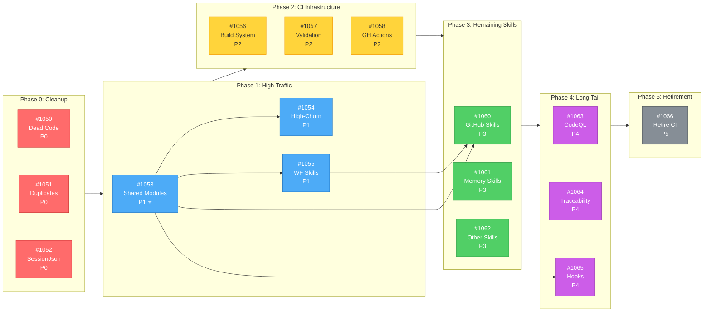
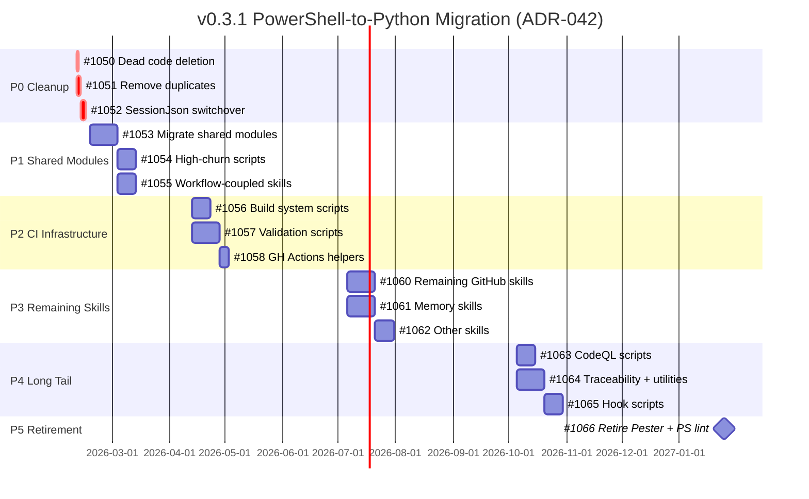

# v0.3.1 Milestone: PowerShell-to-Python Migration

**Status**: 🟢 ACTIVE
**Created**: 2026-02-07
**Last Updated**: 2026-02-07
**Milestone**: [v0.3.1](https://github.com/rjmurillo/ai-agents/milestone/7)
**Epic**: [#1049](https://github.com/rjmurillo/ai-agents/issues/1049)
**Authority**: ADR-042 (Accepted 2026-01-17)
**Supersedes**: ADR-005 (PowerShell-Only Scripting, status: Superseded)
**Current Scope**: 16 issues (3 P0, 3 P1, 3 P2, 3 P3, 3 P4, 1 P5)

---

## Agent Quick Context

> **Token-efficient summary for agents.** Full details in sections below.

### P0 (Start Here)

| Issue | Title | Summary |
|-------|-------|---------|
| [#1050](https://github.com/rjmurillo/ai-agents/issues/1050) | Delete dead code | Remove 3 unused PS1 files |
| [#1051](https://github.com/rjmurillo/ai-agents/issues/1051) | Remove duplicates | Delete 5 PS1 files that have .py equivalents |
| [#1052](https://github.com/rjmurillo/ai-agents/issues/1052) | SessionJson switchover | Switch 148+ references from PS1 to Python |

### Dependency Flowchart

### Gantt Timeline (12 months)

### Parallel Tracks

- **Track A**: #1050 -> #1051 -> #1052 (P0 cleanup, sequential)
- **Track B**: #1053 -> #1054 + #1055 (Modules unblock scripts + skills, parallel after module)
- **Track C**: #1056 + #1057 -> #1058 (Build + validation, then GH Actions)
- **Track D**: #1060 + #1061 -> #1062 (GitHub + memory skills, then other skills)
- **Track E**: #1063 + #1064 -> #1065 -> #1066 (Long tail, then retirement)

---

## Design Decisions

| Decision | Choice | Rationale |
|----------|--------|-----------|
| Deprecation period | None (delete immediately) | Internal tooling project, single consumer (AI agents) |
| Dead code | Delete before migrating | Reduces scope by ~3 scripts and associated tests |
| High-traffic skills | Promote to Phase 1 | Post-IssueComment.ps1 referenced by 7 workflows |
| Validate-SessionJson.ps1 | Include in Phase 0 | Python version exists with pytest coverage |

---

## Current State

| Category | .ps1 (non-test) | .psm1 | .Tests.ps1 | .py (already migrated) |
|----------|-----------------|-------|------------|------------------------|
| `scripts/` | 24 | 2 | 8 | 7 |
| `.claude/skills/github/` | 23 | 1 | 10 | 0 |
| `.claude/skills/memory/` | 4 | 3 | 1 | 0 |
| `.claude/skills/` (other) | 12 | 0 | 2 | ~20 |
| `.claude/hooks/` | 13 | 1 | 0 | 1 |
| `.github/scripts/` | 2 | 3 | 3 | 0 |
| `build/` | 6 | 1 | 4 | 0 |
| `.codeql/scripts/` | 6 | 0 | 0 | 0 |
| Other | 8 | 3 | 5 | 0 |
| **Total** | **~142** | **14** | **~110** | **~28** |

### Already Migrated (Dual Existence)

| PowerShell (to delete) | Python (keep) | pytest (keep) |
|------------------------|---------------|---------------|
| `scripts/Detect-SkillViolation.ps1` | `scripts/detect_skill_violation.py` | `tests/test_detect_skill_violation.py` |
| `scripts/Check-SkillExists.ps1` | `scripts/check_skill_exists.py` | `tests/test_check_skill_exists.py` |
| `scripts/Validate-SessionJson.ps1` | `scripts/validate_session_json.py` | `tests/test_validate_session_json.py` |
| `.claude/skills/security-detection/detect-infrastructure.ps1` | `detect_infrastructure.py` | (in skill) |
| `.claude/skills/metrics/collect-metrics.ps1` | `collect_metrics.py` | (in skill) |
| `.claude/skills/fix-markdown-fences/fix_fences.ps1` | `fix_fences.py` | (in skill) |

---

## Phase 0: Cleanup (Immediate)

### [#1050](https://github.com/rjmurillo/ai-agents/issues/1050) - Delete dead code

Scripts with zero active references:

- [ ] `scripts/Fix-PR964-Validation.ps1`
- [ ] `.agents/benchmarks/test-parent-shell-impact.ps1`
- [ ] `.agents/retrospective/analyze-compliance.ps1`

### [#1051](https://github.com/rjmurillo/ai-agents/issues/1051) - Remove already-migrated duplicates

- [ ] Verify Python versions are active callers
- [ ] Delete 5 PowerShell duplicates + their Pester tests

### [#1052](https://github.com/rjmurillo/ai-agents/issues/1052) - Validate-SessionJson switchover

- [ ] Compare output format compatibility
- [ ] Update `ai-session-protocol.yml` to call Python version
- [ ] Update SESSION-PROTOCOL.md, CLAUDE.md, CRITICAL-CONTEXT.md references
- [ ] Delete `scripts/Validate-SessionJson.ps1` + `tests/Validate-SessionJson.Tests.ps1`

**Scope reduction**: Phase 0 removes ~9 .ps1 files and ~6 .Tests.ps1 files.

---

## Phase 1: High-Traffic Scripts + Workflow-Coupled Skills (Months 1-3)

### [#1053](https://github.com/rjmurillo/ai-agents/issues/1053) - Shared modules (CRITICAL PATH)

| Module | Lines | Consumers |
|--------|-------|-----------|
| `.github/scripts/AIReviewCommon.psm1` | 1312 | AI quality gate, issue triage, spec validation |
| `.claude/skills/github/modules/GitHubCore.psm1` | 1394 | All 23 GitHub skill scripts |
| `.github/scripts/PRMaintenanceModule.psm1` | ~200 | pr-maintenance workflow |
| `.github/scripts/TestResultHelpers.psm1` | ~150 | Test workflows |
| `.claude/hooks/Common/HookUtilities.psm1` | ~100 | All hook scripts |

**Blocks**: #1054, #1055, #1060, #1065

### [#1054](https://github.com/rjmurillo/ai-agents/issues/1054) - High-churn scripts

| Script | Modifications (since Dec) | Lines | Workflow |
|--------|--------------------------|-------|----------|
| `scripts/Invoke-PRMaintenance.ps1` | 12 | 849 | pr-maintenance |
| `.claude/skills/github/scripts/pr/Detect-CopilotFollowUpPR.ps1` | 10 | ~300 | (hook) |
| `build/Generate-Agents.Common.psm1` | 6 | 589 | validate-generated-agents |

**Depends on**: #1053

### [#1055](https://github.com/rjmurillo/ai-agents/issues/1055) - Workflow-coupled GitHub skills

| Script | Lines | Workflows |
|--------|-------|-----------|
| `Post-IssueComment.ps1` | ~200 | **7 workflows** |
| `Invoke-CopilotAssignment.ps1` | 736 | 3 workflows |
| `Set-ItemMilestone.ps1` | ~200 | 2 workflows |
| `Invoke-PRCommentProcessing.ps1` | ~300 | 1 workflow |
| `Get-PRReviewComments.ps1` | 835 | (skill) |

**Depends on**: #1053

---

## Phase 2: CI Infrastructure (Months 3-6)

### [#1056](https://github.com/rjmurillo/ai-agents/issues/1056) - Build system

| Script | Lines | Workflow |
|--------|-------|----------|
| `build/Generate-Agents.ps1` | ~200 | validate-generated-agents |
| `build/Generate-Skills.ps1` | ~200 | (build) |
| `build/scripts/Detect-AgentDrift.ps1` | ~300 | drift-detection |
| `build/scripts/Validate-PathNormalization.ps1` | ~200 | validate-paths |
| `build/scripts/Validate-PlanningArtifacts.ps1` | ~200 | validate-planning-artifacts |
| `build/scripts/Invoke-PesterTests.ps1` | 528 | pester-tests |

### [#1057](https://github.com/rjmurillo/ai-agents/issues/1057) - Validation scripts

| Script | Lines | Workflow |
|--------|-------|----------|
| `scripts/Validate-PRDescription.ps1` | ~300 | pr-validation |
| `scripts/Validate-ActionSHAPinning.ps1` | ~200 | pr-validation |
| `scripts/Validate-Consistency.ps1` | 684 | (manual) |
| `scripts/Validate-PrePR.ps1` | 540 | (manual) |
| `scripts/Validate-TokenBudget.ps1` | ~200 | (manual) |
| `scripts/Validate-SkillFrontmatter.ps1` | 569 | slash-command-quality |
| `scripts/Validate-Traceability.ps1` | 599 | (manual) |
| `scripts/Validate-MemoryIndex.ps1` | 922 | memory-validation |

### [#1058](https://github.com/rjmurillo/ai-agents/issues/1058) - GitHub Actions helpers

| Script | Lines | Workflow |
|--------|-------|----------|
| `.github/scripts/Test-RateLimitForWorkflow.ps1` | ~100 | pr-maintenance |
| `.github/scripts/Measure-WorkflowCoalescing.ps1` | 571 | workflow-coalescing-metrics |
| `scripts/Update-ReviewerSignalStats.ps1` | 709 | update-reviewer-stats |

### Workflow Updates (Phase 2)

| Workflow | Scripts | Effort |
|----------|---------|--------|
| `ai-pr-quality-gate.yml` | Post-IssueComment.ps1 | Low (done in P1) |
| `ai-session-protocol.yml` | Validate-SessionJson.ps1 | Low (done in P0) |
| `drift-detection.yml` | Detect-AgentDrift.ps1 | Low |
| `milestone-tracking.yml` | Set-ItemMilestone.ps1 | Low (done in P1) |
| `pester-tests.yml` | Invoke-PesterTests.ps1 | High (gradual retirement) |
| `powershell-lint.yml` | PSScriptAnalyzer | Retire (ruff covers Python) |
| `pr-maintenance.yml` | Invoke-PRMaintenance.ps1 | High |
| `pr-validation.yml` | Validate-PRDescription.ps1 | Medium |
| `slash-command-quality.yml` | Validate-SlashCommand.ps1 | Low |
| `validate-generated-agents.yml` | Generate-Agents.ps1 | Medium |
| `validate-paths.yml` | Validate-PathNormalization.ps1 | Low |
| `validate-planning-artifacts.yml` | Validate-PlanningArtifacts.ps1 | Low |
| `workflow-coalescing-metrics.yml` | Measure-WorkflowCoalescing.ps1 | Medium |

---

## Phase 3: Remaining Skills (Months 6-9)

### [#1060](https://github.com/rjmurillo/ai-agents/issues/1060) - Remaining GitHub skills

| Directory | Remaining Scripts |
|-----------|-------------------|
| `.claude/skills/github/scripts/pr/` | ~9 scripts |
| `.claude/skills/github/scripts/issue/` | ~5 scripts |
| `.claude/skills/github/scripts/reactions/` | 1 script |
| `.claude/skills/github/scripts/utils/` | 1 script |

**Depends on**: #1053, #1055

### [#1061](https://github.com/rjmurillo/ai-agents/issues/1061) - Memory skills

| Script | Lines | Notes |
|--------|-------|-------|
| `MemoryRouter.psm1` | 577 | Core routing module |
| `ReflexionMemory.psm1` | 996 | Largest module |
| `Search-Memory.ps1` | ~200 | |
| `Extract-SessionEpisode.ps1` | 530 | |
| `Measure-MemoryPerformance.ps1` | ~200 | |
| `Update-CausalGraph.ps1` | ~200 | |
| `SchemaValidation.psm1` | ~200 | |

### [#1062](https://github.com/rjmurillo/ai-agents/issues/1062) - Session, merge-resolver, and other skills

11 skills with 1-4 scripts each.

---

## Phase 4: Long Tail (Months 9-12+)

### [#1063](https://github.com/rjmurillo/ai-agents/issues/1063) - CodeQL scripts

6 scripts totaling ~3,068 lines.

### [#1064](https://github.com/rjmurillo/ai-agents/issues/1064) - Traceability and utilities

3 traceability scripts + 10 utility scripts.

### [#1065](https://github.com/rjmurillo/ai-agents/issues/1065) - Hook scripts

12 hook scripts across 7 hook directories.
**Depends on**: #1053 (HookUtilities.psm1)

---

## Phase 5: Retirement

### [#1066](https://github.com/rjmurillo/ai-agents/issues/1066) - Retire Pester and PSScriptAnalyzer CI

- [ ] Remove `pester-tests.yml` workflow
- [ ] Remove `powershell-lint.yml` workflow
- [ ] Remove `build/scripts/Invoke-PesterTests.ps1`
- [ ] Remove `tests/TestUtilities.psm1`

---

## Migration Checklist (per script)

No deprecation period. Delete PowerShell immediately after Python passes tests.

1. [ ] Create Python equivalent at matching location (`.ps1` -> `.py`, snake_case)
2. [ ] Migrate Pester tests to pytest with equivalent coverage
3. [ ] Verify identical behavior: run both against same inputs
4. [ ] Update all callers (workflows, SKILL.md, other scripts)
5. [ ] Delete PowerShell version (`.ps1` and `.Tests.ps1`)
6. [ ] Update any CLAUDE.md / SKILL.md / SKILL-QUICK-REF.md references

## Naming Convention

| PowerShell | Python |
|-----------|--------|
| `Verb-Noun.ps1` | `verb_noun.py` (snake_case) |
| `Module.psm1` | `module.py` or `module/` package |
| `Noun.Tests.ps1` | `test_noun.py` |

---

## Dependencies and Risks

### Blocking Dependencies

| Dependency | Blocks | Issue |
|-----------|--------|-------|
| GitHubCore.psm1 | 23 GitHub skill scripts | #1053 |
| AIReviewCommon.psm1 | 3 AI quality gate workflows | #1053 |
| HookUtilities.psm1 | 12 hook scripts | #1053 |

### Risks

| Risk | Likelihood | Impact | Mitigation |
|------|-----------|--------|------------|
| Output format differences | Medium | High | Verify output compatibility before switching |
| Python 3.13 bugs | Low | Medium | Pin to 3.12 via `.python-version` |
| Workflow breakage | Medium | High | Expand-contract: add Python, verify, delete PS1 |
| Test coverage regression | Medium | Medium | Require pytest >= Pester before deletion |

---

## Success Metrics

| Metric | Target |
|--------|--------|
| PowerShell files remaining | 0 by end of migration |
| pytest coverage | >= Pester for each migrated script |
| CI failures during migration | 0 |
| Pester workflow | Retired (#1066) |
| PSScriptAnalyzer workflow | Retired (#1066) |

---

## ADR Status

- **ADR-005**: `Superseded` (correctly marked, no changes needed)
- **ADR-042**: `Accepted` (active, governs this migration)

---

## References

- [ADR-042: Python Migration Strategy](../../.agents/architecture/ADR-042-python-migration-strategy.md)
- [ADR-005: PowerShell-Only Scripting](../../.agents/architecture/ADR-005-powershell-only-scripting.md) (Superseded)
- [ADR-006: Thin Workflows, Testable Modules](../../.agents/architecture/ADR-006-thin-workflows-testable-modules.md) (still active)
- [Epic #1049](https://github.com/rjmurillo/ai-agents/issues/1049)
- [Milestone v0.3.1](https://github.com/rjmurillo/ai-agents/milestone/7)
