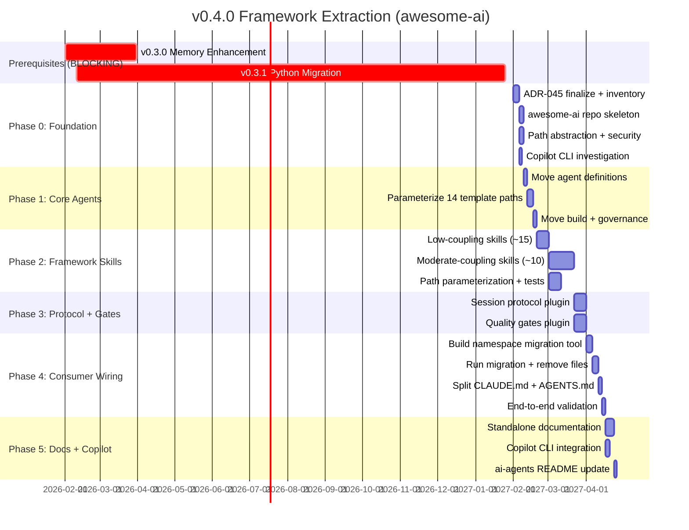

# v0.4.0 Milestone: Framework Extraction (awesome-ai)

**Status**: Proposed
**Created**: 2026-02-07
**Last Updated**: 2026-02-07
**Milestone**: [v0.4.0](https://github.com/rjmurillo/ai-agents/milestone/8)
**Epic**: [#1072](https://github.com/rjmurillo/ai-agents/issues/1072)
**Authority**: ADR-045 (Proposed)
**Prerequisites**: v0.3.0 (memory enhancement), v0.3.1 (PowerShell-to-Python migration)
**Earliest Execution Start**: Q1 2027 (after v0.3.1 P5 retirement completes 2027-01-25)

---

## Agent Quick Context

> **Token-efficient summary for agents.** Full details in sections below.

### Goal

Extract the reusable multi-agent framework from `rjmurillo/ai-agents` into a new repo `rjmurillo/awesome-ai`, published as a Claude Code plugin marketplace. `ai-agents` becomes a reference implementation that consumes `awesome-ai` as a plugin.

### Why

- Separation of concerns: framework infrastructure mixed with project-specific content
- Dog-fooding the Claude Code plugin marketplace format
- Enabling future sharing if external demand materializes
- v0.3.1 (Python migration) must complete first so all extracted code is Python

### Blocking Prerequisite

v0.3.1 is a 12-month migration ending January 2027 (16 open issues, 6 phases). **No v0.4.0 extraction work begins until v0.3.1 P5 (Pester/PSScriptAnalyzer retirement) completes.** Extracting PowerShell code only to re-migrate it as Python would double the effort.

### Phase Summary (30-40 sessions estimated)

| Phase | Sessions | Focus |
|-------|----------|-------|
| 0 | 2-3 | Foundation: ADR, repo creation, path contract, inventory verification |
| 1 | 4-5 | Extract core agents plugin (includes template path parameterization) |
| 2 | 8-10 | Extract framework skills plugin (Python versions from v0.3.1) |
| 3 | 6-8 | Extract session protocol + quality gates plugins (hook conversion) |
| 4 | 6-8 | Wire ai-agents as consumer (namespace migration across 1700+ files) |
| 5 | 4-5 | Documentation + Copilot CLI |
| **Total** | **30-39** | |

### Dependency Flowchart

```mermaid
flowchart LR
    subgraph prereq["Prerequisites (BLOCKING)"]
        V030[v0.3.0<br/>Memory]
        V031[v0.3.1<br/>Python Migration<br/>ends Jan 2027]
    end

    subgraph P0["Phase 0: Foundation"]
        A[ADR-045<br/>Finalize]
        B[Create awesome-ai<br/>repo skeleton]
        C[Path abstraction<br/>contract]
        D[Inventory<br/>verification]
    end

    subgraph P1["Phase 1: Core Agents"]
        E[Move 26 agent<br/>definitions]
        F[Parameterize 14<br/>template paths]
        G[Move build/gen<br/>system]
        H[Move governance<br/>templates]
    end

    subgraph P2["Phase 2: Framework Skills"]
        I[Low-coupling<br/>skills ~15]
        J[Moderate-coupling<br/>skills ~10]
        K[Parameterize paths<br/>+ migrate tests]
    end

    subgraph P3["Phase 3: Protocol + Gates"]
        L[Session protocol<br/>plugin]
        M[Quality gates<br/>plugin]
    end

    subgraph P4["Phase 4: Consumer Wiring"]
        N[Add marketplace<br/>to settings]
        O[Namespace migration<br/>script]
        P[Remove extracted<br/>files]
        Q[Split CLAUDE.md<br/>+ AGENTS.md]
    end

    subgraph P5["Phase 5: Docs + Copilot"]
        R[Standalone docs]
        S[README +<br/>quick start]
        T[Copilot CLI<br/>integration]
    end

    V030 --> V031
    V031 --> P0
    P0 --> P1
    P1 --> P2
    P2 --> P3
    P3 --> P4
    P4 --> P5

    classDef prereq_style fill:#e03131,stroke:#c92a2a,color:#fff
    classDef p0 fill:#ff6b6b,stroke:#c92a2a,color:#fff
    classDef p1 fill:#4dabf7,stroke:#1971c2,color:#fff
    classDef p2 fill:#ffd43b,stroke:#f59f00,color:#333
    classDef p3 fill:#51cf66,stroke:#2f9e44,color:#fff
    classDef p4 fill:#cc5de8,stroke:#9c36b5,color:#fff
    classDef p5 fill:#868e96,stroke:#495057,color:#fff

    class V030,V031 prereq_style
    class A,B,C,D p0
    class E,F,G,H p1
    class I,J,K p2
    class L,M p3
    class N,O,P,Q p4
    class R,S,T p5
```



### Parallel Tracks

- **Track A**: Phase 0 (foundation, sequential)
- **Track B**: Phase 1 (agents + template parameterization, then build + governance)
- **Track C**: Phase 2 (low-coupling skills, then moderate-coupling with parameterization)
- **Track D**: Phase 3 (protocol + gates, can parallelize the two plugins)
- **Track E**: Phase 4 (namespace migration script, then wiring, sequential)
- **Track F**: Phase 5 (docs, can parallelize standalone docs and Copilot CLI)

---

## Design Decisions

| Decision | Choice | Rationale |
|----------|--------|-----------|
| 4 plugins | core-agents, framework-skills, session-protocol, quality-gates | Balanced granularity: install what you need |
| Path abstraction | `${CLAUDE_PLUGIN_ROOT}` internal, env vars for consumer paths | Plugin cache isolation requires this |
| Path validation | `os.path.realpath()` + containment check | Prevent traversal attacks (CVSS 7.8) |
| Namespace | `/awesome-ai:skill-name` | Claude Code plugin marketplace requirement |
| Versioning | awesome-ai starts at v0.4.0 | Aligned with ai-agents milestone |
| Python-only | All extracted code is Python | v0.3.1 completes migration before extraction begins |
| Marketplace format | `.claude-plugin/marketplace.json` | Stable documented schema |
| SHA pinning | Consumers pin awesome-ai to specific SHA/tag | Supply chain security (CVSS 8.1) |

---

## Inventory Summary

> **Source**: Formal inventory audit of 168 files. See [adr-045-inventory-audit.md](../../analysis/adr-045-inventory-audit.md) for file-by-file classification.
>
> **Overall**: 55% framework, 8% domain, 37% hybrid. The 37% hybrid exceeds the 20% re-evaluation threshold in ADR-045, but extraction is justified because path parameterization is a one-time cost.

| Category | Total | Framework | Domain | Hybrid | FW% | D% | H% |
|----------|-------|-----------|--------|--------|-----|----|----|
| Agent Templates (18) | 18 | 0 | 0 | 18 | 0% | 0% | 100% |
| Skills (41) | 41 | 27 | 0 | 14 | 66% | 0% | 34% |
| Hooks (18) | 18 | 3 | 1 | 14 | 17% | 6% | 77% |
| Workflows (30) | 30 | 18 | 6 | 6 | 60% | 20% | 20% |
| Scripts (61) | 61 | 44 | 6 | 11 | 72% | 10% | 18% |
| **TOTAL** | **168** | **92** | **13** | **63** | **55%** | **8%** | **37%** |

### Path Parameterization Scope (63 files)

All 63 hybrid files require environment variable substitution before extraction. Priority order:

| Templates with `.agents/` paths | Count of references |
|--------------------------------|---------------------|
| pr-comment-responder.shared.md | 22 |
| orchestrator.shared.md | 17 |
| critic.shared.md | 12 |
| qa.shared.md | 8 |
| architect.shared.md | 7 |
| planner.shared.md | 6 |
| security.shared.md | 5 |
| roadmap.shared.md | 5 |
| task-generator.shared.md | 4 |
| implementer.shared.md | 4 |
| devops.shared.md | 3 |
| retrospective.shared.md | 2 |
| explainer.shared.md | 2 |
| analyst.shared.md | 2 |

Templates without `.agents/` paths (4): independent-thinker, high-level-advisor, skillbook, memory.
Note: Audit found ALL 18 templates are hybrid (even the 4 "clean" ones participate in the output path convention).

**Full parameterization breakdown by priority:**

| Priority | Category | Files | Rationale |
|----------|----------|-------|-----------|
| 1 | Agent templates | 18 | Consumer-facing interface, highest visibility |
| 2 | Hooks | 14 | Session protocol enforcement, broken paths = broken enforcement |
| 3 | Skills | 14 | Validation and output logic |
| 4 | Scripts | 11 | Utilities, less frequently called |
| 5 | Workflows | 6 | Least frequently changed |

### Classification Criteria

- **Framework**: Generic multi-agent infrastructure, zero project-specific references
- **Domain**: References `ai-agents` project by name, hard-codes `rjmurillo` username, or project-specific conventions
- **Hybrid**: Mostly framework but contains project-specific references (parameterizable)

### Inventory Verification (Phase 0 deliverable)

Before extraction begins, run `scripts/verify-framework-inventory.py` that:

1. Greps for hard-coded paths (`.agents/`, `.serena/`, project-specific terms)
2. Validates all framework-classified files have no domain references
3. Outputs classification report with violations
4. Produces file-by-file inventory with framework/domain/hybrid classification

---

## Phase 0: Foundation (2-3 sessions)

### Deliverables

1. **ADR-045 finalized**: Address all P0 review findings, achieve 6-agent consensus
2. **Inventory verification**: Run file-by-file audit, resolve classification disputes
3. **awesome-ai repo**: Create `rjmurillo/awesome-ai` with plugin marketplace skeleton
4. **Path abstraction contract**: Define env vars, validation utilities, containment checks
5. **Copilot CLI investigation**: Research github/awesome-copilot#629

### Blocking Gate

Phase 0 does NOT begin until:

- [ ] v0.3.1 P5 (Retire Pester + PSScriptAnalyzer) completes
- [ ] All PowerShell code targeted for extraction has been migrated to Python
- [ ] ADR-045 status is "Accepted" (all P0 issues resolved, 6-agent consensus)

### awesome-ai Repository Structure

```text
rjmurillo/awesome-ai/
  .claude-plugin/
    marketplace.json          # Marketplace catalog
  plugins/
    core-agents/
      .claude-plugin/
        plugin.json           # Plugin manifest
      agents/                 # 26 agent definitions
      templates/              # 18 shared templates (paths parameterized)
      build/                  # Generation system
      governance/             # Agent design principles
    framework-skills/
      .claude-plugin/
        plugin.json
      skills/                 # ~28 framework skills
      tests/                  # pytest coverage
    session-protocol/
      .claude-plugin/
        plugin.json
      hooks/                  # 12+ session lifecycle hooks (Python)
      skills/                 # 3 session skills
      templates/              # SESSION-PROTOCOL template
    quality-gates/
      .claude-plugin/
        plugin.json
      hooks/                  # 6 enforcement hooks (Python)
      actions/                # 4 composite actions
      prompts/                # 27 PR quality prompts
      workflows/              # CI workflow templates (SHA-pinned actions)
  docs/
    getting-started.md
    agent-catalog.md
    skill-reference.md
    architecture.md
    customization.md
    security.md               # Plugin security model
  README.md
  LICENSE
```

### marketplace.json Schema

```json
{
  "name": "awesome-ai",
  "description": "Multi-agent framework for Claude Code with specialized agents, skills, session protocol, and quality gates",
  "owner": {
    "name": "rjmurillo",
    "email": "noreply@github.com"
  },
  "plugins": [
    {
      "name": "core-agents",
      "description": "26 specialized agent definitions with templates and governance",
      "source": "./plugins/core-agents"
    },
    {
      "name": "framework-skills",
      "description": "28 reusable skills for development workflows",
      "source": "./plugins/framework-skills"
    },
    {
      "name": "session-protocol",
      "description": "Session lifecycle hooks and protocol enforcement",
      "source": "./plugins/session-protocol"
    },
    {
      "name": "quality-gates",
      "description": "PR quality enforcement, composite actions, and CI templates",
      "source": "./plugins/quality-gates"
    }
  ]
}
```

### Path Abstraction Contract

| Variable | Purpose | Default |
|----------|---------|---------|
| `${CLAUDE_PLUGIN_ROOT}` | Plugin installation directory | Set by Claude Code runtime |
| `AWESOME_AI_SESSIONS_DIR` | Consumer session log directory | `.agents/sessions` |
| `AWESOME_AI_HANDOFF_PATH` | Consumer handoff file | `.agents/HANDOFF.md` |
| `AWESOME_AI_ARCHITECTURE_DIR` | Consumer ADR directory | `.agents/architecture` |
| `AWESOME_AI_MEMORY_DIR` | Consumer memory directory | `.serena/memories` |

### Path Validation (Security)

All framework scripts that use consumer paths MUST:

```python
import os

def get_safe_path(env_var: str, default: str, project_root: str) -> str:
    """Resolve path with traversal protection."""
    raw = os.environ.get(env_var, default)
    resolved = os.path.realpath(os.path.join(project_root, raw))
    if not resolved.startswith(os.path.realpath(project_root)):
        raise ValueError(f"{env_var} resolves outside project: {resolved}")
    os.makedirs(resolved, exist_ok=True)
    return resolved
```

This prevents path traversal attacks (e.g., `AWESOME_AI_SESSIONS_DIR="../../.ssh"`).

---

## Phase 1: Extract Core Agents Plugin (4-5 sessions)

### What Moves

| Source | Destination | Count |
|--------|------------|-------|
| `templates/agents/*.shared.md` | `plugins/core-agents/templates/` | 18 |
| Generated agent definitions | `plugins/core-agents/agents/` | 26 |
| `build/generate_agents.py` (post v0.3.1) | `plugins/core-agents/build/` | 1 |
| `build/generate_agents_common.py` (post v0.3.1) | `plugins/core-agents/build/` | 1 |
| `.agents/governance/agent-*.md` templates | `plugins/core-agents/governance/` | ~4 |

### Template Path Parameterization (NEW, addresses P0-8)

14 of 18 templates have hard-coded output path directives like:

```markdown
Save to: .agents/analysis/NNN-[topic]-analysis.md
```

These must be parameterized to use the consumer's configured output directories. Options:

1. **Template variables**: `Save to: ${AWESOME_AI_OUTPUT_DIR}/analysis/...`
2. **Convention documentation**: Document that consumers configure output directories

This work was not in the original estimate. Added 2 sessions to Phase 1.

### Why This Is First

- **Low coupling**: Agent definitions and templates have no runtime dependencies on scripts, hooks, or skills
- **Path directives are output instructions**, not code imports. Parameterization is straightforward.
- **Immediate value**: Agents are the most commonly reused component

### Verification

- [ ] `claude plugin validate plugins/core-agents/` passes
- [ ] `build/generate_agents.py` produces identical output from new location
- [ ] All 26 agent definitions render correctly when installed as plugin
- [ ] No hard-coded `.agents/` paths remain in templates (grep verification)

---

## Phase 2: Extract Framework Skills Plugin (8-10 sessions)

### Why More Sessions Than Originally Estimated

The original estimate of 4-6 sessions did not account for:

1. All moderate-coupling skills depend on PowerShell modules being migrated to Python first (v0.3.1)
2. Path parameterization is needed for 10+ skills
3. The github skill alone has 40+ scripts (23 PowerShell + module) requiring post-migration extraction
4. The memory skill has 13 PowerShell files requiring post-migration extraction

### Low-Coupling Skills (first, ~15 skills)

Skills with no dependencies on shared modules or project-specific paths:

| Skill | Dependencies |
|-------|-------------|
| merge-resolver | git only |
| planner | none |
| SkillForge | none |
| analyze | none |
| threat-modeling | none |
| pre-mortem | none |
| cynefin-classifier | none |
| decision-critic | none |
| prompt-engineer | none |
| reflect | none |
| fix-markdown-fences | none |
| incoherence | none |
| slo-designer | none |
| chaos-experiment | none |
| steering-matcher | file globs only |

### Moderate-Coupling Skills (second, ~10 skills)

Skills that depend on shared modules or reference project paths. All require v0.3.1 Python versions:

| Skill | Dependency | v0.3.1 Blocker |
|-------|-----------|----------------|
| github | GitHubCore module (1394 lines PS1) | #1053 must complete |
| memory | MemoryRouter (577 lines PS1), Reflexion (996 lines PS1) | #1061 must complete |
| adr-review | Architecture directory | Parameterize path |
| session-init | Session protocol paths | Parameterize path |
| session-log-fixer | Session validation | Parameterize path |
| security-detection | Infrastructure file lists | Parameterize lists |
| metrics | Git history paths | Parameterize path |
| encode-repo-serena | Serena MCP | Parameterize |
| doc-sync | CLAUDE.md paths | Parameterize path |
| codeql-scan | CodeQL config | Parameterize path |

### Path Parameterization Pattern

```python
# Before (hard-coded):
SESSION_DIR = ".agents/sessions"

# After (parameterized with validation):
SESSION_DIR = get_safe_path("AWESOME_AI_SESSIONS_DIR", ".agents/sessions", PROJECT_ROOT)
```

### Verification

- [ ] Each skill passes its pytest suite from plugin location
- [ ] `/awesome-ai:skill-name` invocations work in a test project
- [ ] No hard-coded paths remain (grep sweep)

---

## Phase 3: Extract Session Protocol + Quality Gates Plugins (6-8 sessions)

### Why More Sessions Than Originally Estimated

The original estimate of 3-4 sessions did not account for:

1. All 12+ hooks invoke PowerShell scripts that must be Python post-v0.3.1
2. Hook format translation from `.claude/settings.json` to plugin `hooks.json` is non-trivial
3. CI workflow templates must have all GitHub Actions SHA-pinned (security requirement)
4. Quality gates plugin has 27 PR quality prompts requiring namespace updates

### Session Protocol Plugin

| Component | Source | Count |
|-----------|--------|-------|
| Session lifecycle hooks | `.claude/hooks/` (Python, post v0.3.1) | 12+ |
| Session skills | `.claude/skills/session*/` | 3 |
| hooks.json registration | Translated from `.claude/settings.json` | 1 |
| SESSION-PROTOCOL template | `.agents/SESSION-PROTOCOL.md` | 1 |
| Hook utilities module | `.claude/hooks/Common/` (Python, post v0.3.1) | 1 |

**Key challenge**: Translating hook registrations from `.claude/settings.json` format to plugin `hooks.json` format. The plugin hooks.json uses:

```json
{
  "hooks": {
    "PostToolUse": [
      {
        "matcher": "Write",
        "command": "${CLAUDE_PLUGIN_ROOT}/hooks/post-write.py"
      }
    ]
  }
}
```

### Quality Gates Plugin

| Component | Source | Count |
|-----------|--------|-------|
| Enforcement hooks | `.claude/hooks/` (quality-related, Python) | 6 |
| Composite actions | `.github/actions/` | 4 |
| PR quality prompts | `.agents/prompts/` or inline | 27 |
| CI workflow templates | `.github/workflows/` (framework, SHA-pinned) | ~5 |

**Security requirement**: All CI workflow templates MUST use SHA-pinned GitHub Actions, not mutable version tags. This aligns with PROJECT-CONSTRAINTS.md and addresses the security review finding (CVSS 7.4).

### Verification

- [ ] Session start/end lifecycle works through plugin hooks
- [ ] Quality gate hooks fire on correct events
- [ ] CI workflow templates use SHA-pinned actions only
- [ ] CI workflow templates are consumable via `uses:` or copy

---

## Phase 4: Wire ai-agents as Consumer (6-8 sessions)

### Why More Sessions Than Originally Estimated

The original estimate of 3-4 sessions did not account for:

1. Namespace migration across 1700+ files (agent templates, skill docs, CI workflows, CLAUDE.md references)
2. Need for automated migration tooling (not just grep sweep)
3. YAML frontmatter in SKILL.md files uses different parsing than markdown
4. Dynamic skill name references in string interpolation contexts

### Steps

1. **Build namespace migration script**: Automated tool that handles:
   - Markdown references: `/skill-name` to `/awesome-ai:skill-name`
   - YAML frontmatter references in SKILL.md files
   - String interpolation contexts in Python code
   - CI workflow references

2. **Add marketplace to settings.json**:

```json
{
  "extraKnownMarketplaces": {
    "awesome-ai": {
      "source": {
        "source": "github",
        "repo": "rjmurillo/awesome-ai",
        "ref": "v0.4.0"
      }
    }
  },
  "enabledPlugins": {
    "core-agents@awesome-ai": true,
    "framework-skills@awesome-ai": true,
    "session-protocol@awesome-ai": true,
    "quality-gates@awesome-ai": true
  }
}
```

3. **Remove extracted files** from ai-agents (expand-contract: verify plugin works, then remove)
4. **Update namespace references** using migration script
5. **Split CLAUDE.md**: Framework template (in awesome-ai) + project-specific (in ai-agents)
6. **Split AGENTS.md**: Framework reference (in awesome-ai) + project customization (in ai-agents)

### Namespace Migration

| Before | After |
|--------|-------|
| `/planner` | `/awesome-ai:planner` |
| `/analyze` | `/awesome-ai:analyze` |
| `/reflect` | `/awesome-ai:reflect` |
| `/merge-resolver` | `/awesome-ai:merge-resolver` |
| `/session-init` | `/awesome-ai:session-init` |
| `/github` | `/awesome-ai:github` |

### Verification

- [ ] Migration script handles all reference types (markdown, YAML, Python, workflows)
- [ ] `grep -rn '/skill-name'` confirms no bare skill references for extracted skills
- [ ] Full session lifecycle works (start, work, end, validate)
- [ ] All hooks fire through plugin registration
- [ ] No 404s or missing file errors

---

## Phase 5: Documentation + Copilot CLI (4-5 sessions)

### Standalone Documentation

| Document | Purpose | Audience |
|----------|---------|----------|
| `README.md` | Quick start, installation, overview | New users |
| `docs/getting-started.md` | Step-by-step setup guide | First-time adopters |
| `docs/agent-catalog.md` | All 26 agents with capabilities | Developers |
| `docs/skill-reference.md` | All skills with usage examples | Developers |
| `docs/architecture.md` | Plugin structure, design decisions | Contributors |
| `docs/customization.md` | How to extend, override, add project-specific | Power users |
| `docs/security.md` | Plugin security model, SHA pinning, path validation | All users |

### Copilot CLI Integration

Act on Phase 0 investigation findings from github/awesome-copilot#629:

- If Copilot CLI supports plugins: Add platform support
- If not: Document the gap and track the feature request

### ai-agents README Update

Update `rjmurillo/ai-agents` README to position as "reference implementation" consuming awesome-ai:

- Installation instructions pointing to awesome-ai
- Project-specific customization examples
- Link to awesome-ai for framework docs

### Verification

- [ ] `claude plugin validate .` passes in awesome-ai
- [ ] `claude plugin marketplace add rjmurillo/awesome-ai` works from a fresh project
- [ ] All documentation renders correctly on GitHub
- [ ] ai-agents README accurately describes the relationship

---

## Critical Files Reference

| File | Role in Plan |
|------|-------------|
| `.agents/analysis/claude-code-plugin-marketplaces.md` | Plugin format reference (session 1180 research) |
| `.agents/analysis/adr-045-inventory-audit.md` | File-by-file inventory verification |
| `.claude/settings.json` | Hook registrations to migrate to hooks.json |
| `templates/agents/orchestrator.shared.md` | Representative agent template pattern |
| `.claude/skills/github/modules/GitHubCore.psm1` | Most complex skill extraction (post v0.3.1: `.py`) |
| `.claude/hooks/Common/HookUtilities.psm1` | Shared hook utilities (post v0.3.1: `.py`) |
| `.agents/SESSION-PROTOCOL.md` | Session lifecycle rules to templatize |
| `CLAUDE.md` | Must split into framework + project-specific |
| `AGENTS.md` | Must split into framework + project-specific |

---

## Security Model

### Supply Chain

- Consumers MUST pin awesome-ai to a specific SHA or tag (not a mutable branch)
- Plugin updates require explicit consumer action: pull, review changes, update pin
- All CI workflow templates distributed with SHA-pinned GitHub Actions
- Future: adopt GitHub artifact attestation when available

### Hook Execution

- Plugin hooks run in consumer process context (same trust model as any Claude Code hook)
- This is a Claude Code platform limitation, not something awesome-ai can sandbox independently
- Consumers should review hook code before enabling, same as any third-party dependency
- If Claude Code adds hook permission capabilities in the future, adopt them

### Path Security

- All consumer path resolution uses `get_safe_path()` with traversal protection
- `os.path.realpath()` resolves symlinks before containment check
- Paths outside project root raise `ValueError` (fail-closed, never fail-silent)
- Directory creation is explicit (`os.makedirs(exist_ok=True)`) after validation

### Secret Handling

- Plugin hooks MUST NOT log environment variables
- Sensitive data filtering should be applied to hook stdout/stderr
- Future: integrate with Claude Code's secret masking if available

---

## Risks

| Risk | Likelihood | Impact | Mitigation |
|------|-----------|--------|------------|
| Plugin marketplace format evolves | Medium | High | Pin to documented schema, monitor changelogs, version lock |
| Hook path resolution in plugin cache | High | High | Env vars for consumer paths, `get_safe_path()`, test in Phase 0 |
| GitHub skill complexity (40+ scripts) | Medium | High | Extract module first, scripts incrementally, v0.3.1 must complete |
| Namespace migration misses references | Medium | Medium | Automated migration script, not manual grep sweep |
| v0.3.1 not complete when needed | Low | High | Hard prerequisite, plan does not execute early |
| Copilot CLI has no plugin support | Medium | Low | Document gap, track upstream, not a blocker |
| Consumer path defaults break | Medium | Medium | `get_safe_path()` validates and creates directories |
| Single maintainer capacity | High | Medium | v0.4.0 does not begin until v0.3.1 completes, avoiding concurrent work |
| Two-repo maintenance overhead | Medium | Medium | 2x CI/CD, 2x dependency management, cross-repo coordination |
| No external demand validated | High | Medium | Focus on separation-of-concerns value, not external adoption |

---

## Success Metrics

| Metric | Target |
|--------|--------|
| Plugins validated | 4/4 pass `claude plugin validate` |
| Framework files in ai-agents | 0 (all moved to awesome-ai) |
| Namespace references updated | 100% (migration script + grep confirms) |
| Session lifecycle | Works end-to-end through plugins |
| Test coverage | All pytest suites green in both repos |
| Documentation | 6 standalone docs + updated README |
| Time to install | < 2 minutes from fresh project |
| Path traversal tests | All pass (containment validation) |
| SHA pinning | 100% of workflow template actions pinned |

---

## Gantt Timeline



---

## Session Estimate Breakdown

| Phase | Sessions | Rationale |
|-------|----------|-----------|
| 0: Foundation | 2-3 | ADR finalization, inventory audit, repo skeleton, path contract |
| 1: Core Agents | 4-5 | 26 agents + 14 template path parameterizations + build system |
| 2: Framework Skills | 8-10 | 15 low-coupling (straightforward) + 10 moderate-coupling (post-v0.3.1 Python, path parameterization, module extraction) |
| 3: Protocol + Gates | 6-8 | 12+ hooks requiring format translation + 27 quality prompts + CI template SHA pinning |
| 4: Consumer Wiring | 6-8 | Namespace migration script + 1700+ file updates + CLAUDE.md/AGENTS.md split + E2E validation |
| 5: Docs + Copilot | 4-5 | 6 standalone docs + security doc + Copilot CLI + README update |
| **Total** | **30-39** | **Previous estimate of 15-22 was 50% underestimated** |

The increase from 15-22 to 30-39 sessions accounts for:

- Template path parameterization (14 templates, not originally scoped)
- PowerShell module extraction complexity (github: 40 scripts, memory: 13 files)
- Hook format translation (12+ hooks, all PowerShell-based until v0.3.1)
- Namespace migration automation (1700+ files, not just grep sweep)
- Security requirements (path validation, SHA pinning, supply chain)

---

## References

- [ADR-045: Framework Extraction via Plugin Marketplace](../../architecture/ADR-045-framework-extraction-via-plugin-marketplace.md)
- [Plugin Marketplace Research](../../analysis/claude-code-plugin-marketplaces.md)
- [v0.3.1 PowerShell Migration](../v0.3.1/PowerShell-migration.md)
- [ADR-045 Debate Log](../../critique/ADR-045-debate-log.md)
- [ADR-045 Security Review](../../security/ADR-045-framework-extraction-security-review.md)
- [ADR-045 Feasibility Analysis](../../analysis/adr-045-feasibility-analysis.md)
- [Claude Code Plugin Docs](https://code.claude.com/docs/en/plugins)
- [Claude Code Marketplace Docs](https://code.claude.com/docs/en/plugin-marketplaces)
