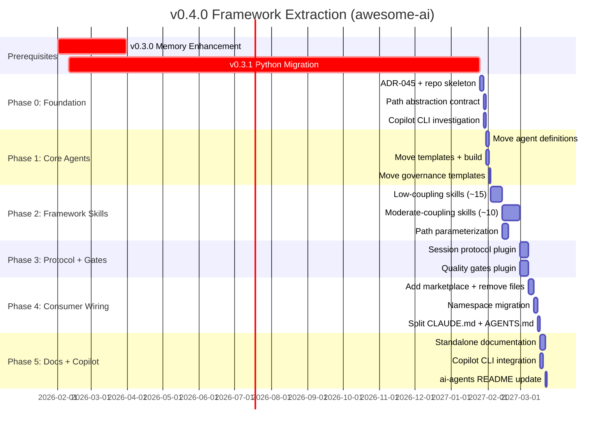

# v0.4.0 Milestone: Framework Extraction (awesome-ai)

**Status**: Proposed
**Created**: 2026-02-07
**Last Updated**: 2026-02-07
**Milestone**: [v0.4.0](https://github.com/rjmurillo/ai-agents/milestone/8)
**Epic**: [#1072](https://github.com/rjmurillo/ai-agents/issues/1072)
**Authority**: ADR-045 (Proposed)
**Prerequisites**: v0.3.0 (memory enhancement), v0.3.1 (PowerShell-to-Python migration)

---

## Agent Quick Context

> **Token-efficient summary for agents.** Full details in sections below.

### Goal

Extract the reusable multi-agent framework from `rjmurillo/ai-agents` into a new repo `rjmurillo/awesome-ai`, published as a Claude Code plugin marketplace. `ai-agents` becomes a reference implementation that consumes `awesome-ai` as a plugin.

### Why Now

- ~65% of the codebase is reusable framework, ~25% is project-specific, ~10% hybrid
- Sharing the framework requires separation; it cannot be consumed as a plugin today
- Claude Code plugin marketplace format is stable and documented
- v0.3.1 (Python migration) must complete first so all extracted code is Python

### Phase Summary

| Phase | Sessions | Focus |
|-------|----------|-------|
| 0 | 1-2 | Foundation: ADR, repo creation, path contract |
| 1 | 2-3 | Extract core agents plugin |
| 2 | 4-6 | Extract framework skills plugin |
| 3 | 3-4 | Extract session protocol + quality gates plugins |
| 4 | 3-4 | Wire ai-agents as consumer |
| 5 | 2-3 | Documentation + Copilot CLI |

### Dependency Flowchart

```mermaid
flowchart LR
    subgraph P0["Phase 0: Foundation"]
        A[ADR-045<br/>Decision Record]
        B[Create awesome-ai<br/>repo skeleton]
        C[Path abstraction<br/>contract]
        D[Copilot CLI<br/>investigation]
    end

    subgraph P1["Phase 1: Core Agents"]
        E[Move 26 agent<br/>definitions]
        F[Move 18 shared<br/>templates]
        G[Move build/gen<br/>system]
        H[Move governance<br/>templates]
    end

    subgraph P2["Phase 2: Framework Skills"]
        I[Low-coupling<br/>skills ~15]
        J[Moderate-coupling<br/>skills ~10]
        K[Parameterize paths<br/>+ migrate tests]
    end

    subgraph P3["Phase 3: Protocol + Gates"]
        L[Session protocol<br/>plugin]
        M[Quality gates<br/>plugin]
    end

    subgraph P4["Phase 4: Consumer Wiring"]
        N[Add marketplace<br/>to settings]
        O[Remove extracted<br/>files]
        P[Update namespace<br/>references]
        Q[Split CLAUDE.md<br/>+ AGENTS.md]
    end

    subgraph P5["Phase 5: Docs + Copilot"]
        R[Standalone docs]
        S[README +<br/>quick start]
        T[Copilot CLI<br/>integration]
    end

    P0 --> P1
    P1 --> P2
    P2 --> P3
    P3 --> P4
    P4 --> P5

    classDef p0 fill:#ff6b6b,stroke:#c92a2a,color:#fff
    classDef p1 fill:#4dabf7,stroke:#1971c2,color:#fff
    classDef p2 fill:#ffd43b,stroke:#f59f00,color:#333
    classDef p3 fill:#51cf66,stroke:#2f9e44,color:#fff
    classDef p4 fill:#cc5de8,stroke:#9c36b5,color:#fff
    classDef p5 fill:#868e96,stroke:#495057,color:#fff

    class A,B,C,D p0
    class E,F,G,H p1
    class I,J,K p2
    class L,M p3
    class N,O,P,Q p4
    class R,S,T p5
```



### Parallel Tracks

- **Track A**: Phase 0 (foundation, sequential)
- **Track B**: Phase 1 (agents extraction, can parallelize template + definition moves)
- **Track C**: Phase 2 (skills, low-coupling before moderate-coupling)
- **Track D**: Phase 3 (protocol + gates, can parallelize the two plugins)
- **Track E**: Phase 4 (wiring, sequential due to dependencies)
- **Track F**: Phase 5 (docs, can parallelize standalone docs and Copilot CLI)

---

## Design Decisions

| Decision | Choice | Rationale |
|----------|--------|-----------|
| 4 plugins | core-agents, framework-skills, session-protocol, quality-gates | Balanced granularity: install what you need |
| Path abstraction | `${CLAUDE_PLUGIN_ROOT}` internal, env vars for consumer paths | Plugin cache isolation requires this |
| Namespace | `/awesome-ai:skill-name` | Claude Code plugin marketplace requirement |
| Versioning | awesome-ai starts at v0.4.0 | Aligned with ai-agents milestone for single version truth during extraction |
| Python-only | All extracted code is Python | v0.3.1 completes migration before extraction begins |
| Marketplace format | `.claude-plugin/marketplace.json` | Stable documented schema |
| Repo name | `rjmurillo/awesome-ai` | Distinct from ai-agents, communicates intent |

---

## Inventory Summary

| Category | Framework | Domain-Specific | Hybrid |
|----------|-----------|-----------------|--------|
| Agents (26) | 100% | 0% | 0% |
| Skills (41) | 68% (28) | 32% (13) | 0% |
| Hooks (20) | 75% (15) | 10% (2) | 15% (3) |
| Workflows (30) | 70% (21) | 30% (9) | 0% |
| Scripts (25) | 75% (19) | 25% (6) | 0% |
| Templates (21) | 100% | 0% | 0% |

### Classification Criteria

- **Framework**: Generic multi-agent infrastructure, no project-specific references
- **Domain-Specific**: References ai-agents conventions, project-specific workflows, or hard-coded paths
- **Hybrid**: Mostly framework but contains 1-2 project-specific references (parameterizable)

---

## Phase 0: Foundation (1-2 sessions)

### Deliverables

1. **ADR-045**: Document the separation decision, plugin architecture, and path contract
2. **awesome-ai repo**: Create `rjmurillo/awesome-ai` with plugin marketplace skeleton
3. **Path abstraction contract**: Define env vars for consumer paths, `${CLAUDE_PLUGIN_ROOT}` for internal
4. **Copilot CLI investigation**: Research github/awesome-copilot#629 for marketplace/plugin support

### awesome-ai Repository Structure

```text
rjmurillo/awesome-ai/
  .claude-plugin/
    marketplace.json          # Marketplace catalog
  plugins/
    core-agents/
      .claude-plugin/
        plugin.json           # Plugin manifest
      agents/                 # 26 agent definitions
      templates/              # 18 shared templates
      build/                  # Generation system
      governance/             # Agent design principles
    framework-skills/
      .claude-plugin/
        plugin.json
      skills/                 # ~28 framework skills
      tests/                  # pytest coverage
    session-protocol/
      .claude-plugin/
        plugin.json
      hooks/                  # 12+ session lifecycle hooks
      skills/                 # 3 session skills
      templates/              # SESSION-PROTOCOL template
    quality-gates/
      .claude-plugin/
        plugin.json
      hooks/                  # 6 enforcement hooks
      actions/                # 4 composite actions
      prompts/                # 27 PR quality prompts
      workflows/              # CI workflow templates
  docs/
    getting-started.md
    agent-catalog.md
    skill-reference.md
    architecture.md
    customization.md
  README.md
  LICENSE
```

### marketplace.json Schema

```json
{
  "name": "awesome-ai",
  "description": "Multi-agent framework for Claude Code with specialized agents, skills, session protocol, and quality gates",
  "owner": {
    "name": "rjmurillo",
    "email": "noreply@github.com"
  },
  "plugins": [
    {
      "name": "core-agents",
      "description": "26 specialized agent definitions with templates and governance",
      "source": "./plugins/core-agents"
    },
    {
      "name": "framework-skills",
      "description": "28 reusable skills for development workflows",
      "source": "./plugins/framework-skills"
    },
    {
      "name": "session-protocol",
      "description": "Session lifecycle hooks and protocol enforcement",
      "source": "./plugins/session-protocol"
    },
    {
      "name": "quality-gates",
      "description": "PR quality enforcement, composite actions, and CI templates",
      "source": "./plugins/quality-gates"
    }
  ]
}
```

### Path Abstraction Contract

| Variable | Purpose | Default |
|----------|---------|---------|
| `${CLAUDE_PLUGIN_ROOT}` | Plugin installation directory | Set by Claude Code runtime |
| `AWESOME_AI_SESSIONS_DIR` | Consumer session log directory | `.agents/sessions` |
| `AWESOME_AI_HANDOFF_PATH` | Consumer handoff file | `.agents/HANDOFF.md` |
| `AWESOME_AI_ARCHITECTURE_DIR` | Consumer ADR directory | `.agents/architecture` |
| `AWESOME_AI_MEMORY_DIR` | Consumer memory directory | `.serena/memories` |

Scripts reference `${CLAUDE_PLUGIN_ROOT}` for internal paths (templates, modules) and env vars with defaults for consumer paths.

---

## Phase 1: Extract Core Agents Plugin (2-3 sessions)

### What Moves

| Source | Destination | Count |
|--------|------------|-------|
| `templates/agents/*.shared.md` | `plugins/core-agents/templates/` | 18 |
| Generated agent definitions | `plugins/core-agents/agents/` | 26 |
| `build/Generate-Agents.py` (post v0.3.1) | `plugins/core-agents/build/` | 1 |
| `build/Generate-Agents.Common.py` (post v0.3.1) | `plugins/core-agents/build/` | 1 |
| `.agents/governance/agent-*.md` templates | `plugins/core-agents/governance/` | ~4 |

### Why This Is First

- **Zero coupling**: Agent definitions and templates have no runtime dependencies on scripts, hooks, or skills
- **Cleanest extraction**: Copy, validate, remove originals
- **Immediate value**: Agents are the most commonly reused component

### Verification

- [ ] `claude plugin validate plugins/core-agents/` passes
- [ ] `build/Generate-Agents.py` produces identical output from new location
- [ ] All 26 agent definitions render correctly when installed as plugin

---

## Phase 2: Extract Framework Skills Plugin (4-6 sessions)

### Low-Coupling Skills (first, ~15 skills)

Skills with no dependencies on shared modules or project-specific paths:

| Skill | Lines | Dependencies |
|-------|-------|-------------|
| merge-resolver | ~200 | git only |
| planner | ~150 | none |
| SkillForge | ~300 | none |
| analyze | ~200 | none |
| threat-modeling | ~150 | none |
| pre-mortem | ~100 | none |
| cynefin-classifier | ~100 | none |
| decision-critic | ~150 | none |
| prompt-engineer | ~200 | none |
| reflect | ~150 | none |
| fix-markdown-fences | ~100 | none |
| incoherence | ~100 | none |
| slo-designer | ~100 | none |
| chaos-experiment | ~100 | none |
| steering-matcher | ~150 | file globs only |

### Moderate-Coupling Skills (second, ~10 skills)

Skills that depend on shared modules or reference project paths:

| Skill | Lines | Dependency | Migration |
|-------|-------|-----------|-----------|
| github | ~2000+ | GitHubCore module | Extract module first |
| memory | ~1500+ | MemoryRouter, Reflexion modules | Extract modules first |
| adr-review | ~200 | Architecture directory | Parameterize path |
| session-init | ~200 | Session protocol paths | Parameterize path |
| session-log-fixer | ~200 | Session validation | Parameterize path |
| security-detection | ~200 | Infrastructure file lists | Parameterize lists |
| metrics | ~200 | Git history paths | Parameterize path |
| encode-repo-serena | ~200 | Serena MCP | Parameterize |
| doc-sync | ~200 | CLAUDE.md paths | Parameterize path |
| codeql-scan | ~200 | CodeQL config | Parameterize path |

### Path Parameterization Pattern

Before (hard-coded):

```python
SESSION_DIR = ".agents/sessions"
```

After (parameterized):

```python
SESSION_DIR = os.environ.get("AWESOME_AI_SESSIONS_DIR", ".agents/sessions")
```

### Verification

- [ ] Each skill passes its pytest suite from plugin location
- [ ] `/awesome-ai:skill-name` invocations work in a test project
- [ ] No hard-coded paths remain (grep sweep)

---

## Phase 3: Extract Session Protocol + Quality Gates Plugins (3-4 sessions)

### Session Protocol Plugin

| Component | Source | Count |
|-----------|--------|-------|
| Session lifecycle hooks | `.claude/hooks/` | 12+ |
| Session skills | `.claude/skills/session*/` | 3 |
| hooks.json registration | `.claude/settings.json` extracts | 1 |
| SESSION-PROTOCOL template | `.agents/SESSION-PROTOCOL.md` | 1 |
| Hook utilities module | `.claude/hooks/Common/` | 1 |

**Key challenge**: Translating hook registrations from `.claude/settings.json` format to plugin `hooks.json` format. The plugin hooks.json uses:

```json
{
  "hooks": {
    "PostToolUse": [
      {
        "matcher": "Write",
        "command": "${CLAUDE_PLUGIN_ROOT}/hooks/post-write.py"
      }
    ]
  }
}
```

### Quality Gates Plugin

| Component | Source | Count |
|-----------|--------|-------|
| Enforcement hooks | `.claude/hooks/` (quality-related) | 6 |
| Composite actions | `.github/actions/` | 4 |
| PR quality prompts | `.agents/prompts/` or inline | 27 |
| CI workflow templates | `.github/workflows/` (framework) | ~5 |

### Verification

- [ ] Session start/end lifecycle works through plugin hooks
- [ ] Quality gate hooks fire on correct events
- [ ] CI workflow templates are consumable via `uses:` or copy

---

## Phase 4: Wire ai-agents as Consumer (3-4 sessions)

### Steps

1. **Add marketplace to settings.json**:

```json
{
  "extraKnownMarketplaces": {
    "awesome-ai": {
      "source": {
        "source": "github",
        "repo": "rjmurillo/awesome-ai",
        "ref": "v0.4.0"
      }
    }
  },
  "enabledPlugins": {
    "core-agents@awesome-ai": true,
    "framework-skills@awesome-ai": true,
    "session-protocol@awesome-ai": true,
    "quality-gates@awesome-ai": true
  }
}
```

2. **Remove extracted files** from ai-agents (files now in awesome-ai)
3. **Update namespace references**: `/skill-name` becomes `/awesome-ai:skill-name`
4. **Split CLAUDE.md**: Framework template (in awesome-ai) + project-specific (in ai-agents)
5. **Split AGENTS.md**: Framework reference (in awesome-ai) + project customization (in ai-agents)

### Namespace Migration

| Before | After |
|--------|-------|
| `/planner` | `/awesome-ai:planner` |
| `/analyze` | `/awesome-ai:analyze` |
| `/reflect` | `/awesome-ai:reflect` |
| `/merge-resolver` | `/awesome-ai:merge-resolver` |
| `/session-init` | `/awesome-ai:session-init` |
| `/github` | `/awesome-ai:github` |

### Verification

- [ ] `grep -r '/skill-name'` confirms no bare skill references for extracted skills
- [ ] Full session lifecycle works (start, work, end, validate)
- [ ] All hooks fire through plugin registration
- [ ] No 404s or missing file errors

---

## Phase 5: Documentation + Copilot CLI (2-3 sessions)

### Standalone Documentation

| Document | Purpose | Audience |
|----------|---------|----------|
| `README.md` | Quick start, installation, overview | New users |
| `docs/getting-started.md` | Step-by-step setup guide | First-time adopters |
| `docs/agent-catalog.md` | All 26 agents with capabilities | Developers |
| `docs/skill-reference.md` | All skills with usage examples | Developers |
| `docs/architecture.md` | Plugin structure, design decisions | Contributors |
| `docs/customization.md` | How to extend, override, add project-specific | Power users |

### Copilot CLI Integration

Act on Phase 0 investigation findings from github/awesome-copilot#629:

- If Copilot CLI supports plugins: Add platform support
- If not: Document the gap and track the feature request

### ai-agents README Update

Update `rjmurillo/ai-agents` README to position as "reference implementation" consuming awesome-ai:

- Installation instructions pointing to awesome-ai
- Project-specific customization examples
- Link to awesome-ai for framework docs

### Verification

- [ ] `claude plugin validate .` passes in awesome-ai
- [ ] `claude plugin marketplace add rjmurillo/awesome-ai` works from a fresh project
- [ ] All documentation renders correctly on GitHub
- [ ] ai-agents README accurately describes the relationship

---

## Critical Files Reference

| File | Role in Plan |
|------|-------------|
| `.agents/analysis/claude-code-plugin-marketplaces.md` | Plugin format reference (session 1180 research) |
| `.claude/settings.json` | Hook registrations to migrate to hooks.json |
| `templates/agents/orchestrator.shared.md` | Representative agent template pattern |
| `.claude/skills/github/modules/GitHubCore.psm1` | Most complex skill extraction (post v0.3.1: `.py`) |
| `.claude/hooks/Common/HookUtilities.psm1` | Shared hook utilities (post v0.3.1: `.py`) |
| `.agents/SESSION-PROTOCOL.md` | Session lifecycle rules to templatize |
| `CLAUDE.md` | Must split into framework + project-specific |
| `AGENTS.md` | Must split into framework + project-specific |

---

## Risks

| Risk | Likelihood | Impact | Mitigation |
|------|-----------|--------|------------|
| Plugin marketplace format evolves | Medium | High | Pin to documented schema, version lock awesome-ai |
| Hook path resolution in plugin cache | High | High | Env vars for consumer paths, test early in Phase 0 |
| GitHub skill complexity (23 scripts) | Medium | Medium | Extract GitHubCore module first, scripts incrementally |
| Namespace migration misses references | Medium | Medium | Automated grep sweep before deletion in Phase 4 |
| v0.3.1 not complete when needed | Low | High | Hard prerequisite, plan does not execute early |
| Copilot CLI has no plugin support | Medium | Low | Document gap, track upstream, not a blocker |
| Consumer path defaults break | Medium | Medium | Integration test suite validates all default paths |

---

## Success Metrics

| Metric | Target |
|--------|--------|
| Plugins validated | 4/4 pass `claude plugin validate` |
| Framework files in ai-agents | 0 (all moved to awesome-ai) |
| Namespace references updated | 100% (grep confirms) |
| Session lifecycle | Works end-to-end through plugins |
| Test coverage | All pytest suites green in both repos |
| Documentation | 5 standalone docs + updated README |
| Time to install | < 2 minutes from fresh project |

---

## Gantt Timeline



---

## References

- [ADR-045: Framework Extraction via Plugin Marketplace](.../../architecture/ADR-045-framework-extraction-via-plugin-marketplace.md)
- [Plugin Marketplace Research](../../analysis/claude-code-plugin-marketplaces.md)
- [v0.3.1 PowerShell Migration](../v0.3.1/PowerShell-migration.md)
- [Claude Code Plugin Docs](https://code.claude.com/docs/en/plugins)
- [Claude Code Marketplace Docs](https://code.claude.com/docs/en/plugin-marketplaces)
- [github/awesome-copilot#629](https://github.com/github/awesome-copilot/issues/629)
