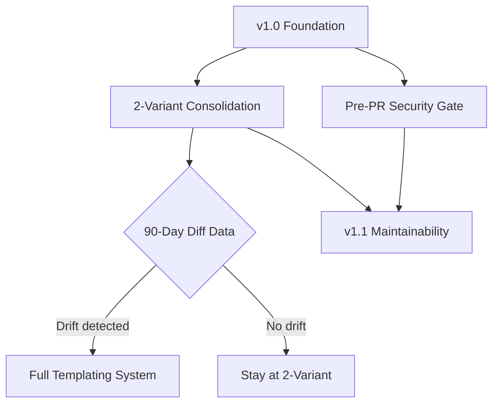

# Product Roadmap

## Master Product Objective

Enable development teams to adopt coordinated multi-agent AI workflows across VS Code, GitHub Copilot CLI, and Claude Code with minimal friction and maximum consistency.

## Vision Statement

A single-source agent system where developers contribute once and deploy everywhere, with platform-specific behaviors generated automatically.

---

## Current Release: v1.0 (Foundation)

### P0 - Critical (Must Have)

| Epic | User Value | Status |
|------|------------|--------|
| Unified Install Script | Users can install agents for any platform with a single command | Complete (PR #41) |
| Multi-Agent Impact Analysis | Planner coordinates cross-domain reviews before implementation | Complete (PR #40) |
| Agent Parity Across Platforms | All 18 agents available on Claude, VS Code, and Copilot CLI | Complete |

### P1 - Important (Should Have)

| Epic | User Value | Status |
|------|------------|--------|
| Pre-PR Security Gate | Infrastructure changes auto-route to security/devops review | Planned (PRD Complete) |
| CodeRabbit Optimization | Reduce CI noise from automated PR reviews | Complete (PR #32) |

### P2 - Nice to Have

| Epic | User Value | Status |
|------|------------|--------|
| Skill Management System | Agents learn and apply patterns across sessions | Partial |

---

## Next Release: v1.1 (Maintainability)

### Epic: 2-Variant Consolidation + Diff-Linting

**As a** repository maintainer
**I want** VS Code and Copilot CLI agents consolidated into a single source
**So that** I maintain 36 files instead of 54, reducing sync burden by 33%

#### KANO Classification

**Performance** - Directly improves maintainability satisfaction proportionally to effort invested.

Rationale: Users expect agent consistency across platforms. This reduces the maintenance burden that directly correlates with satisfaction. Not a must-be (system works without it) but clearly performance-enhancing.

#### RICE Score

| Factor | Value | Rationale |
|--------|-------|-----------|
| Reach | 3 users/quarter | Maintainers (1-3 active contributors) |
| Impact | 2 (High) | 33% file reduction, eliminates manual sync errors |
| Confidence | 80% | Clear implementation path, validated by CVA analysis |
| Effort | 0.5 person-months | 8-14 hours estimated |
| **Score** | **9.6** | (3 x 2 x 0.8) / 0.5 |

#### Rumsfeld Matrix Assessment

| Quadrant | Items |
|----------|-------|
| **Known Knowns** | VS Code and Copilot CLI share 99%+ content; only YAML frontmatter differs |
| **Known Unknowns** | Will semantic drift detection catch meaningful vs cosmetic differences? |
| **Unknown Unknowns** | Platform-specific edge cases we haven't encountered yet |
| **Unknown Knowns** | We may already have patterns that should differ but don't |

#### Assumptions (Validation Status)

| Type | Assumption | Status |
|------|------------|--------|
| Assumption | VS Code and Copilot CLI tools lists are functionally equivalent | Validated - minor naming differences only |
| Assumption | 90-day data collection sufficient to identify drift patterns | Untested |
| Known Unknown | Optimal diff-linting threshold for alerts | Needs calibration |

#### Success Criteria

- [ ] Single source generates both VS Code and Copilot CLI agents
- [ ] Build-time generation completes in < 5 seconds
- [ ] CI diff-lint job alerts on semantic drift (configurable threshold)
- [ ] 90-day data collection period establishes baseline drift patterns

#### Dependencies

- None blocking (builds on existing file structure)

#### Priority

**P1** - Important but not blocking core functionality

#### Target Release

v1.1

---

## Deferred: v1.2+ (Full Templating)

### Epic: Full Agent Templating System (LiquidJS)

**As a** contributor
**I want** to edit agents in a single canonical template
**So that** changes automatically propagate to all three platforms

#### Deferral Rationale

1. **2-Variant Consolidation is the 80/20 solution** - Gets 80% of the benefit (33% reduction) at 20% of the effort
2. **Data-driven decision** - 90-day diff-linting data will inform whether full templating is justified
3. **Reversible path** - Consolidation does not preclude templating later; it's a stepping stone
4. **Reduced risk** - Smaller change, easier to validate, less breaking

#### Conditions to Proceed to Full Templating

- [ ] Drift-linting shows Claude diverging from VS Code/Copilot variants
- [ ] Maintenance burden still significant after consolidation
- [ ] Contributor feedback requests single-source editing

#### Estimated Effort (If Needed)

20-31 hours (original CVA estimate)

---

## Backlog

### Future Consideration

| Epic | User Value | Priority | Notes |
|------|------------|----------|-------|
| Internationalization | Non-English agent instructions | P3 | No current demand |
| Agent Composition | Combine agents dynamically | P3 | Architecture TBD |
| Performance Metrics Dashboard | Track agent effectiveness | P2 | Requires telemetry |

---

## Dependencies



---

## Success Metrics

| Metric | Target | Current |
|--------|--------|---------|
| Agent file count | 36 (from 54) | 54 |
| Platform sync errors | 0 | Unknown |
| Contributor onboarding time | < 30 min | Unknown |
| CI security alerts pre-PR | > 80% caught | 0% (new) |

---

## Changelog

| Date | Change | Rationale |
|------|--------|-----------|
| 2025-12-15 | Created roadmap with v1.0, v1.1, deferred v1.2+ | Initial strategic planning |
| 2025-12-15 | Prioritized 2-Variant Consolidation over Full Templating | 80/20 rule; data-driven deferral |
| 2025-12-15 | Added Pre-PR Security Gate to v1.1 | Gap identified in PR #41 |

---

## Priority Assessment: 2-Variant Consolidation

### Summary

| Dimension | Assessment |
|-----------|------------|
| **Priority** | P1 (Important, Should Have) |
| **Wave** | Next Release (v1.1) |
| **Dependencies** | None blocking |
| **Strategic Fit** | High - stepping stone to full templating if needed |
| **Opportunity Cost** | Delays Pre-PR Security Gate by ~1 week if done first |

### Framework Analysis

#### Eisenhower Matrix

| | Urgent | Not Urgent |
|---|--------|------------|
| **Important** | Pre-PR Security Gate (process gap active) | 2-Variant Consolidation |
| **Not Important** | - | Full Templating |

**Recommendation**: Schedule 2-Variant Consolidation; Do Pre-PR Security Gate if security incidents continue.

#### Combined Prioritization

1. **Pre-PR Security Gate** - P1, addresses active process gap (CodeQL alert)
2. **2-Variant Consolidation** - P1, reduces maintenance burden, enables data collection
3. **Full Templating** - P2, deferred pending 90-day data

### Recommended Sequencing

```text
Week 1-2: Pre-PR Security Gate (Phase 1-2 from PRD)
Week 3: 2-Variant Consolidation (Phase 1)
Week 4: 2-Variant Consolidation (Phase 2) + Diff-Linting CI
```

### Opportunity Cost Analysis

If we do 2-Variant Consolidation now:

**What gets done:**
- 33% file reduction (54 -> 36)
- CI drift detection infrastructure
- Stepping stone toward templating

**What gets delayed:**
- Pre-PR Security Gate by ~1 week
- Any new feature work

**Recommendation**: Given the CodeQL alert in PR #41, prioritize Pre-PR Security Gate first (documentation-focused, ~1 day Phase 1), then proceed with 2-Variant Consolidation.

---

*Generated by Roadmap Agent*
