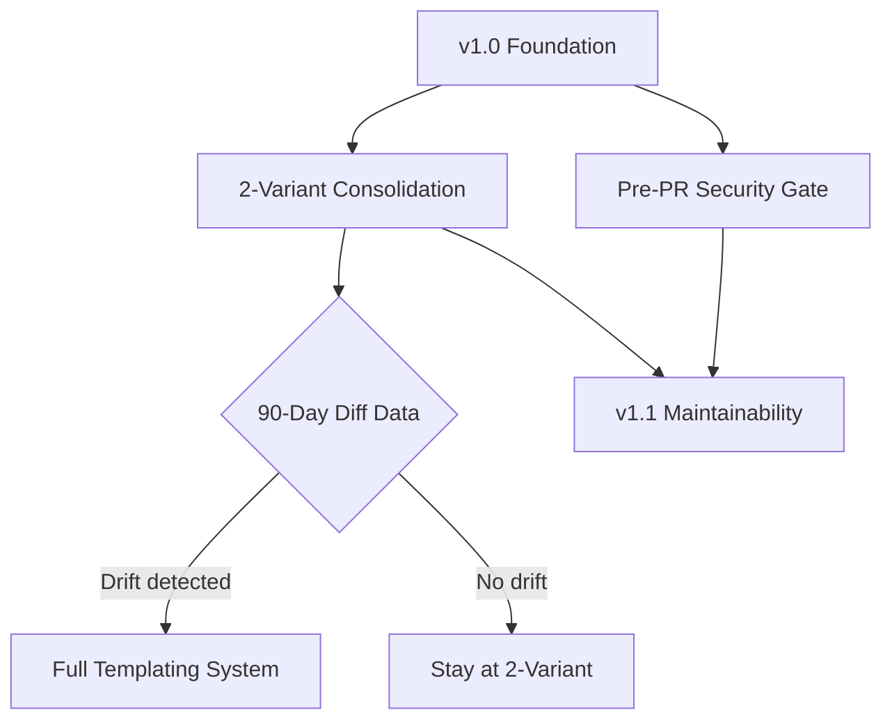

# Product Roadmap

## Master Product Objective

Enable development teams to adopt coordinated multi-agent AI workflows across VS Code, GitHub Copilot CLI, and Claude Code with minimal friction and maximum consistency.

## Vision Statement

A single-source agent system where developers contribute once and deploy everywhere, with platform-specific behaviors generated automatically.

---

## Platform Priority Hierarchy

> **Strategic Decision**: Platforms are prioritized based on capability, reach, and maintenance value.

| Priority | Platform | Investment Level | Rationale |
|----------|----------|-----------------|-----------|
| **P0** | Claude Code | Full investment | Most capable, largest context, semantic analysis, project-level MCP |
| **P1** | VS Code | Active development | IDE integration, workspace MCP config, broad adoption |
| **P2** | Copilot CLI | Maintenance only | Critical limitations make full investment unjustified |

### Copilot CLI De-Prioritization Decision

**Date**: 2025-12-17
**Decision**: De-prioritize Copilot CLI to P2 (Nice to Have)
**Status**: Active

**Critical Limitations Identified:**

1. **User-level MCP config only** - Cannot version-control or share MCP servers with team
2. **No Plan Mode** - Cannot perform multi-step reasoning workflows
3. **Limited context window** (8k-32k vs 200k+) - Cannot analyze large codebases
4. **No semantic code analysis** - Text-only search, no LSP integration
5. **No VS Code configuration reuse** - Despite shared branding, architecturally separate
6. **Known reliability issues** - User-level agent loading has documented bugs

**RICE Score**: 0.8 (vs Claude Code ~20+, VS Code ~10+)

**Investment Decision:**

- **DECLINED**: Adding Copilot CLI sync to `Sync-McpConfig.ps1`
  - Rationale: User-level config is a risk, not a feature; no team collaboration value
- **MAINTENANCE ONLY**: Existing Copilot CLI agents remain but receive no new features
- **NO PARITY REQUIREMENT**: New features may ship to Claude Code/VS Code only

**Removal Evaluation Criteria:**

Copilot CLI support will be considered for removal if ANY of these conditions occur:

| Criterion | Threshold |
|-----------|-----------|
| Maintenance burden | >10% of total development effort |
| User demand | Zero feature requests in 90 days |
| Platform viability | No GitHub improvements to critical gaps in 6 months |
| Adoption ratio | >90% users on Claude Code or VS Code |

**Reference**: `.agents/analysis/002-copilot-cli-limitations-assessment.md`

---

## Current Release: v1.0 (Foundation)

### P0 - Critical (Must Have)

| Epic | User Value | Status |
|------|------------|--------|
| Unified Install Script | Users can install agents for any platform with a single command | Complete (PR #41) |
| Multi-Agent Impact Analysis | Planner coordinates cross-domain reviews before implementation | Complete (PR #40) |
| Agent Parity Across Platforms | All 18 agents available on Claude, VS Code, and Copilot CLI | Complete |

### P1 - Important (Should Have)

| Epic | User Value | Status |
|------|------------|--------|
| Pre-PR Security Gate | Infrastructure changes auto-route to security/devops review | Planned (PRD Complete) |
| CodeRabbit Optimization | Reduce CI noise from automated PR reviews | Complete (PR #32) |

### P2 - Nice to Have

| Epic | User Value | Status |
|------|------------|--------|
| Skill Management System | Agents learn and apply patterns across sessions | Partial |

---

## Next Release: v1.1 (Maintainability)

### Epic: VS Code Consolidation + Diff-Linting

> **Scope Change**: Following Copilot CLI de-prioritization, this epic now focuses on VS Code as the primary secondary platform. Copilot CLI enters maintenance-only mode.

**As a** repository maintainer
**I want** VS Code agents derived from Claude Code source
**So that** I maintain fewer files and Claude Code innovations automatically propagate to VS Code

#### KANO Classification

**Performance** - Directly improves maintainability satisfaction proportionally to effort invested.

Rationale: Users expect agent consistency between Claude Code and VS Code. Copilot CLI is now maintenance-only and excluded from active consolidation.

#### RICE Score

| Factor | Value | Rationale |
|--------|-------|-----------|
| Reach | 3 users/quarter | Maintainers (1-3 active contributors) |
| Impact | 2 (High) | Simplified sync, eliminates manual errors |
| Confidence | 85% | Clear implementation path, reduced scope |
| Effort | 0.4 person-months | 6-10 hours (reduced from 8-14) |
| **Score** | **12.75** | (3 x 2 x 0.85) / 0.4 |

#### Rumsfeld Matrix Assessment

| Quadrant | Items |
|----------|-------|
| **Known Knowns** | VS Code agents closely mirror Claude Code; only YAML frontmatter differs |
| **Known Unknowns** | Will semantic drift detection catch meaningful vs cosmetic differences? |
| **Unknown Unknowns** | Platform-specific edge cases we haven't encountered yet |
| **Unknown Knowns** | We may already have patterns that should differ but don't |

#### Assumptions (Validation Status)

| Type | Assumption | Status |
|------|------------|--------|
| Assumption | VS Code tools lists are functionally equivalent to Claude Code | Validated - minor naming differences only |
| Assumption | 90-day data collection sufficient to identify drift patterns | Untested |
| Known Unknown | Optimal diff-linting threshold for alerts | Needs calibration |
| **NEW** | Copilot CLI can be excluded without user impact | High confidence (RICE 0.8) |

#### Success Criteria

- [ ] VS Code agents derive from Claude Code source with build-time frontmatter generation
- [ ] Build-time generation completes in < 5 seconds
- [ ] CI diff-lint job alerts on semantic drift (configurable threshold)
- [ ] 90-day data collection period establishes baseline drift patterns
- [ ] Copilot CLI agents frozen at current state (maintenance-only)

#### Copilot CLI Handling

| Action | Status |
|--------|--------|
| Active consolidation | **Excluded** (maintenance-only) |
| New feature parity | **Not required** |
| Bug fixes | As-needed basis only |
| Eventual deprecation | Per removal criteria in Platform Priority section |

#### Dependencies

- None blocking (builds on existing file structure)
- Dependent on: Platform Priority Hierarchy decision (complete)

#### Priority

**P1** - Important but not blocking core functionality

#### Target Release

v1.1

---

## Deferred: v1.2+ (Full Templating)

### Epic: Full Agent Templating System (LiquidJS)

**As a** contributor
**I want** to edit agents in a single canonical template
**So that** changes automatically propagate to all three platforms

#### Deferral Rationale

1. **2-Variant Consolidation is the 80/20 solution** - Gets 80% of the benefit (33% reduction) at 20% of the effort
2. **Data-driven decision** - 90-day diff-linting data will inform whether full templating is justified
3. **Reversible path** - Consolidation does not preclude templating later; it's a stepping stone
4. **Reduced risk** - Smaller change, easier to validate, less breaking

#### Conditions to Proceed to Full Templating

- [ ] Drift-linting shows Claude diverging from VS Code/Copilot variants
- [ ] Maintenance burden still significant after consolidation
- [ ] Contributor feedback requests single-source editing

#### Estimated Effort (If Needed)

20-31 hours (original CVA estimate)

---

## Backlog

### Future Consideration

| Epic | User Value | Priority | Notes |
|------|------------|----------|-------|
| Internationalization | Non-English agent instructions | P3 | No current demand |
| Agent Composition | Combine agents dynamically | P3 | Architecture TBD |
| Performance Metrics Dashboard | Track agent effectiveness | P2 | Requires telemetry |

---

## Dependencies



---

## Success Metrics

### Primary Metrics (Claude Code + VS Code)

| Metric | Target | Current | Notes |
|--------|--------|---------|-------|
| Claude Code agent completeness | 100% | 100% | All 18 agents |
| VS Code agent parity | 100% | 100% | Derives from Claude Code |
| Platform sync errors | 0 | Unknown | Between Claude Code and VS Code |
| Contributor onboarding time | < 30 min | Unknown | |
| CI security alerts pre-PR | > 80% caught | 0% (new) | |

### Secondary Metrics (Maintenance Only)

| Metric | Target | Current | Notes |
|--------|--------|---------|-------|
| Copilot CLI agent availability | Frozen | 18 | No new features |
| Copilot CLI maintenance effort | < 10% total | Unknown | Triggers removal review if exceeded |
| Copilot CLI user requests | Tracked | 0 | 90-day window for removal evaluation |

### Removed Metrics

| Metric | Reason for Removal |
|--------|-------------------|
| Agent file count (54 to 36) | Superseded by platform-specific tracking; Copilot CLI excluded from consolidation |

---

## Changelog

| Date | Change | Rationale |
|------|--------|-----------|
| 2025-12-15 | Created roadmap with v1.0, v1.1, deferred v1.2+ | Initial strategic planning |
| 2025-12-15 | Prioritized 2-Variant Consolidation over Full Templating | 80/20 rule; data-driven deferral |
| 2025-12-15 | Added Pre-PR Security Gate to v1.1 | Gap identified in PR #41 |
| 2025-12-17 | **Added Platform Priority Hierarchy** (Claude Code P0, VS Code P1, Copilot CLI P2) | Comprehensive limitations analysis; RICE score 0.8 vs 20+ |
| 2025-12-17 | **De-prioritized Copilot CLI to P2 (Maintenance Only)** | Critical gaps: user-level config, no Plan Mode, limited context, no semantic analysis |
| 2025-12-17 | **DECLINED Copilot CLI sync in Sync-McpConfig.ps1** | User-level config is a risk; no team collaboration value |
| 2025-12-17 | **Renamed epic to "VS Code Consolidation"** (from "2-Variant Consolidation") | Copilot CLI excluded from active consolidation; scope reduced |
| 2025-12-17 | **Added removal evaluation criteria** for Copilot CLI | 10% maintenance threshold, 90-day demand window, 6-month platform viability |
| 2025-12-17 | **Restructured Success Metrics** by platform priority | Primary (Claude Code + VS Code), Secondary (Copilot CLI maintenance) |

---

## Priority Assessment: VS Code Consolidation

> **Updated 2025-12-17**: Renamed from "2-Variant Consolidation" following Copilot CLI de-prioritization.

### Summary

| Dimension | Assessment |
|-----------|------------|
| **Priority** | P1 (Important, Should Have) |
| **Wave** | Next Release (v1.1) |
| **Dependencies** | Platform Priority Hierarchy decision (complete) |
| **Strategic Fit** | High - stepping stone to full templating if needed |
| **Scope Change** | Reduced: VS Code only (Copilot CLI maintenance-only) |
| **Opportunity Cost** | Delays Pre-PR Security Gate by ~1 week if done first |

### Framework Analysis

#### Eisenhower Matrix

| | Urgent | Not Urgent |
|---|--------|------------|
| **Important** | Pre-PR Security Gate (process gap active) | VS Code Consolidation |
| **Not Important** | - | Full Templating, Copilot CLI features |

**Recommendation**: Schedule VS Code Consolidation; Do Pre-PR Security Gate if security incidents continue. Copilot CLI features are explicitly NOT important.

#### Combined Prioritization

1. **Pre-PR Security Gate** - P1, addresses active process gap (CodeQL alert)
2. **VS Code Consolidation** - P1, reduces maintenance burden, enables data collection
3. **Full Templating** - P2, deferred pending 90-day data
4. **Copilot CLI features** - P2, maintenance-only, no new investment

### Recommended Sequencing

```text
Week 1-2: Pre-PR Security Gate (Phase 1-2 from PRD)
Week 3: VS Code Consolidation (Phase 1)
Week 4: VS Code Consolidation (Phase 2) + Diff-Linting CI
```

### Opportunity Cost Analysis

If we do VS Code Consolidation now:

**What gets done:**

- Simplified Claude Code to VS Code sync
- CI drift detection infrastructure
- Stepping stone toward templating
- Copilot CLI frozen (no effort spent)

**What gets delayed:**

- Pre-PR Security Gate by ~1 week
- Any new feature work

**What we explicitly do NOT do:**

- Copilot CLI sync in Sync-McpConfig.ps1
- Copilot CLI consolidation effort
- Copilot CLI feature parity

**Recommendation**: Given the CodeQL alert in PR #41, prioritize Pre-PR Security Gate first (documentation-focused, ~1 day Phase 1), then proceed with VS Code Consolidation.

---

*Generated by Roadmap Agent*
*Updated: 2025-12-17 with Copilot CLI de-prioritization*
