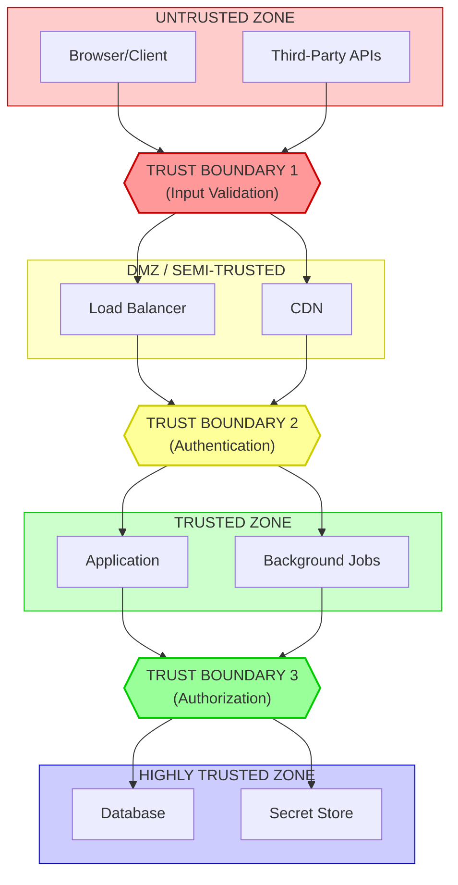
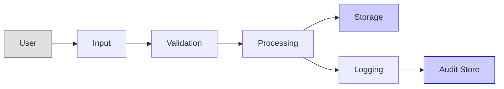

# Architecture Security Audit Template

## Purpose

This template guides security architecture reviews. Use it to evaluate privilege boundaries, trust zones, attack surfaces, and sensitive data flows in system designs.

---

## System Overview

### Basic Information

| Field | Value |
|-------|-------|
| System Name | [Name] |
| Review Date | [Date] |
| Reviewer | [Name/Agent] |
| Architecture Version | [Version] |
| Last Security Review | [Date or "Initial"] |

### System Description

[1-2 paragraph description of the system's purpose and main components]

---

## Privilege Boundary Analysis

### Identified Privilege Levels

| Level | Name | Description | Components |
|-------|------|-------------|------------|
| 0 | Anonymous | No authentication | Public endpoints |
| 1 | Authenticated | Basic user | User features |
| 2 | Privileged | Elevated access | Admin features |
| 3 | System | Full access | Internal services |

### Privilege Escalation Paths

| From Level | To Level | Legitimate Path | Risk Points |
|------------|----------|-----------------|-------------|
| 0 -> 1 | Login/Registration | Authentication | Brute force, credential stuffing |
| 1 -> 2 | Role assignment | Admin grants | Privilege abuse, IDOR |
| 2 -> 3 | N/A (should not exist) | - | Design flaw if exists |

### Privilege Boundary Violations

| Violation | Location | Severity | Remediation |
|-----------|----------|----------|-------------|
| [Description] | [Component] | High/Med/Low | [Fix] |

---

## Trust Boundary Map

### Trust Zones

### Boundary Controls

| Boundary | Controls Required | Current Status |
|----------|-------------------|----------------|
| 1 (Input) | Input validation, rate limiting | [ ] Implemented |
| 2 (Auth) | Authentication, TLS | [ ] Implemented |
| 3 (Authz) | Authorization, audit logging | [ ] Implemented |

---

## Attack Surface Analysis

### External Attack Surface

| Entry Point | Protocol | Authentication | Authorization | Threats |
|-------------|----------|----------------|---------------|---------|
| Public API | HTTPS | JWT | Role-based | Injection, DoS |
| Admin API | HTTPS | MFA + JWT | Admin only | Privilege escalation |
| Webhooks | HTTPS | Signature | N/A | Spoofing, replay |

### Internal Attack Surface

| Entry Point | Protocol | Authentication | Threats |
|-------------|----------|----------------|---------|
| Service-to-service | gRPC | mTLS | MITM, impersonation |
| Database | TCP | Connection string | SQL injection, data theft |
| Message queue | AMQP | Credentials | Message tampering |

### Attack Surface Reduction Recommendations

| Area | Current State | Recommendation | Priority |
|------|---------------|----------------|----------|
| [Area] | [Current] | [Recommendation] | P0/P1/P2 |

---

## Sensitive Data Flow Analysis

### Data Classification

| Data Type | Classification | Retention | Encryption |
|-----------|----------------|-----------|------------|
| User credentials | Critical | Until changed | At rest + in transit |
| PII (name, email) | Sensitive | Per policy | At rest + in transit |
| Payment info | Critical | Tokenized only | N/A (tokenized) |
| Session tokens | Critical | Session lifetime | In transit |
| Audit logs | Internal | 1 year | At rest |

### Data Flow Diagram

### Data Flow Risks

| Flow | Data | Risk | Control |
|------|------|------|---------|
| User -> App | Credentials | Interception | TLS 1.3 |
| App -> DB | PII | Unauthorized access | Encryption, RBAC |
| App -> Logs | Tokens | Exposure | PII filtering |

---

## Dependency Security

### Third-Party Dependencies

| Dependency | Version | Known CVEs | Last Updated |
|------------|---------|------------|--------------|
| [Package] | [Version] | [ ] None / [CVE-XXXX] | [Date] |

### Dependency Risk Matrix

| Risk Level | Criteria | Count |
|------------|----------|-------|
| Critical | CVE with exploit | 0 |
| High | CVE without exploit | 0 |
| Medium | Outdated (> 1 year) | 0 |
| Low | Maintenance mode | 0 |

---

## Security Controls Assessment

### Authentication

| Control | Status | Notes |
|---------|--------|-------|
| Password policy enforced | [ ] | Min 12 chars, complexity |
| MFA available | [ ] | TOTP or hardware key |
| Session management | [ ] | Secure cookies, timeout |
| Brute force protection | [ ] | Rate limiting, lockout |

### Authorization

| Control | Status | Notes |
|---------|--------|-------|
| Role-based access | [ ] | Roles defined |
| Least privilege | [ ] | Minimal permissions |
| Resource-level auth | [ ] | User owns resource |
| Admin separation | [ ] | Separate admin accounts |

### Data Protection

| Control | Status | Notes |
|---------|--------|-------|
| Encryption at rest | [ ] | AES-256 |
| Encryption in transit | [ ] | TLS 1.3 |
| Key management | [ ] | HSM or managed KMS |
| Secure deletion | [ ] | Data purge process |

### Logging and Monitoring

| Control | Status | Notes |
|---------|--------|-------|
| Security event logging | [ ] | Auth events logged |
| PII filtering | [ ] | No sensitive data in logs |
| Audit trail | [ ] | Immutable audit log |
| Alerting | [ ] | Security alerts configured |

---

## Findings Summary

### Critical Findings

| ID | Finding | Impact | Remediation |
|----|---------|--------|-------------|
| C-1 | [Finding] | [Impact] | [Fix] |

### High Findings

| ID | Finding | Impact | Remediation |
|----|---------|--------|-------------|
| H-1 | [Finding] | [Impact] | [Fix] |

### Medium Findings

| ID | Finding | Impact | Remediation |
|----|---------|--------|-------------|
| M-1 | [Finding] | [Impact] | [Fix] |

### Low Findings

| ID | Finding | Impact | Remediation |
|----|---------|--------|-------------|
| L-1 | [Finding] | [Impact] | [Fix] |

---

## Recommendations

### Immediate Actions (P0)

1. [Action]
2. [Action]

### Short-term Actions (P1)

1. [Action]
2. [Action]

### Long-term Actions (P2)

1. [Action]
2. [Action]

---

## Sign-off

| Role | Name | Date | Signature |
|------|------|------|-----------|
| Security Reviewer | [Name] | [Date] | [Approved/Rejected] |
| Architect | [Name] | [Date] | [Acknowledged] |
| Product Owner | [Name] | [Date] | [Acknowledged] |

---

## Related Documents

- [Static Analysis Checklist](./static-analysis-checklist.md)
- [Security Best Practices](./security-best-practices.md)
- [Threat Model Template](../security/TM-NNN-template.md)

---

*Template Version: 1.0*
*Created: 2025-12-13*
*GitHub Issue: #10*
