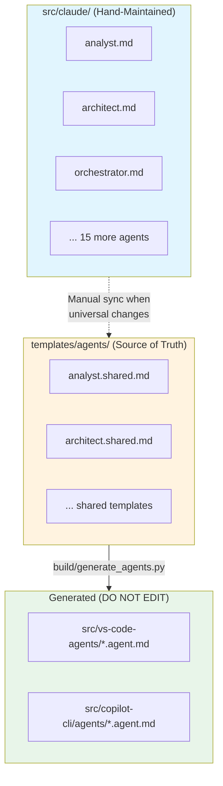

# Claude Code Agents

This document describes the 19 AI agents defined for Claude Code CLI and the critical workflow rules for maintaining them.

## Overview

The `src/claude/` directory contains **hand-maintained** agent definitions for Claude Code CLI. Unlike VS Code and Copilot CLI agents (which are generated from templates), Claude agents are the primary source for Claude-specific features.

Before changing an agent for cross-harness behavior, read
`agent-harness-reference`. If the change affects event handling, hook-driven
routing, generated Copilot agents, or runtime contracts, execute it through
`ai-agents-portability-campaign`. Do not repeat vendor research already pinned
in the reference sidecar.

> **Governing procedure** (in the `rjmurillo/ai-agents` repository; ADR-036 and ADR-052 are not shipped with this installed plugin, so they are named here without links): ADR-036 (Two-Source Agent Template Architecture) is superseded in governance by ADR-052 (Template Strategy), but ADR-036's synchronization procedure below is still what runs; ADR-052 is accepted target state, not yet implemented.

## Source vs Installation Relationship

```text
src/claude/*.md  ───────────────────────────────────────┐
   (SOURCE - hand-maintained)                           │
                                                        ▼
                                   Claude marketplace install
                                                        │
                                                        ▼
                                           .claude/agents/*.md
                                           (INSTALLED - runtime)
```

**Key distinction**:

| Directory | Role | Editing |
|-----------|------|---------|
| `src/claude/` | SOURCE for Claude Code agents | Edit here |
| `.claude/agents/` | INSTALLED copy (runtime) | DO NOT edit directly |
| `templates/agents/` | SOURCE for VS Code/Copilot agents | Edit here for cross-platform |

**Backporting improvements**: If `.claude/agents/` contains improvements made during runtime that should persist:

1. Copy improvements from `.claude/agents/{agent}.md` to `src/claude/{agent}.md`
2. Verify ADR enforcement, security gates, and blocking sections are PRESERVED
3. Commit to `src/claude/` only
4. Reinstall through Claude Code's native marketplace flow (see [docs/installation.md](../../docs/installation.md))

**Common mistake**: Copying `.claude/agents/` wholesale to `src/claude/` may overwrite blocking gates (like ADR Review Enforcement) if the installed version was modified without including those sections.

## Critical Workflow Rules

### Rule 1: Bidirectional Synchronization (CRITICAL - ADR-036)

**The pre-commit hook handles generation but NOT content synchronization between sources.**

Per ADR-036 §Synchronization Requirement, when adding content that applies to ALL platforms, you MUST update BOTH sources:

| Scenario | Action Required |
|----------|-----------------|
| Universal content added HERE | Also add to `templates/agents/{agent}.shared.md` |
| Universal content added in Templates | Also add to `src/claude/{agent}.md` (MANUAL!) |
| Claude-specific content (MCP tools, Serena) | Do NOT add to templates |
| Template-specific content | Do NOT add to Claude |

**Procedure (from Claude to template):**

```text
1. Edit src/claude/{agent}.md
2. Duplicate universal changes to templates/agents/{agent}.shared.md
3. Run: uv run python build/generate_agents.py
4. Commit all changed files together
```

**Procedure (from template to Claude):**

```text
1. Edit templates/agents/{agent}.shared.md
2. Edit src/claude/{agent}.md (MANUAL - not auto-synced!)
3. Run: uv run python build/generate_agents.py
4. Commit all files atomically
```

**Anti-pattern (ADR-036 §Common Mistake):**

> Editing only `templates/agents/*.shared.md` and forgetting `src/claude/*.md` causes Claude agents to miss the new content while Copilot platforms have it.

### Rule 2: Drift Detection

Weekly CI checks (`drift-detection.yml`) compare Claude agents with VS Code agents:

- **Threshold**: 80% similarity required
- **Action**: GitHub issue created if drift detected
- **Resolution**: Sync content or document intentional differences

### Rule 3: File Naming

| Environment | Pattern | Example |
|-------------|---------|---------|
| Claude Code | `{agent-name}.md` | `analyst.md` |
| Templates | `{agent-name}.shared.md` | `analyst.shared.md` |
| VS Code | `{agent-name}.agent.md` | `analyst.agent.md` |
| Copilot CLI | `{agent-name}.agent.md` | `analyst.agent.md` |

---

## Architecture


```mermaid
flowchart TD
    subgraph Claude["src/claude/ (Hand-Maintained)"]
        CL1[analyst.md]
        CL2[architect.md]
        CL3[orchestrator.md]
        CLN[... 15 more agents]
    end

    subgraph Templates["templates/agents/ (Source of Truth)"]
        TM1[analyst.shared.md]
        TM2[architect.shared.md]
        TMN[... shared templates]
    end

    subgraph Generated["Generated (DO NOT EDIT)"]
        VS[src/vs-code-agents/*.agent.md]
        CP[src/copilot-cli/agents/*.agent.md]
    end

    Claude -.->|Manual sync when<br>universal changes| Templates
    Templates -->|build/generate_agents.py| Generated

    style Claude fill:#e1f5fe
    style Templates fill:#fff3e0
    style Generated fill:#e8f5e9
```

---

## Agent Catalog

### Coordination Agents

| Agent | File | Role |
|-------|------|------|
| orchestrator | `orchestrator.md` | Task routing and coordination |
| milestone-planner | `milestone-planner.md` | Milestone and work package creation |
| task-decomposer | `task-decomposer.md` | Atomic task generation |
| backlog-generator | `backlog-generator.md` | Proactive task discovery |

### Analysis Agents

| Agent | File | Role |
|-------|------|------|
| analyst | `analyst.md` | Research and investigation |
| architect | `architect.md` | Design governance and ADRs |
| critic | `critic.md` | Plan validation |

### Implementation Agents

| Agent | File | Role |
|-------|------|------|
| implementer | `implementer.md` | Code execution |
| qa | `qa.md` | Test strategy and verification |
| devops | `devops.md` | CI/CD pipelines |
| security | `security.md` | Vulnerability assessment |
| merge-resolver | `merge-resolver.md` | Git conflict resolution |

### Strategic Agents

| Agent | File | Role |
|-------|------|------|
| roadmap | `roadmap.md` | Epic definition and prioritization |
| high-level-advisor | `high-level-advisor.md` | Strategic decisions |
| independent-thinker | `independent-thinker.md` | Challenge assumptions |

### Support Agents

| Agent | File | Role |
|-------|------|------|
| skillbook | `skillbook.md` | Skill management |
| retrospective | `retrospective.md` | Learning extraction |
| explainer | `explainer.md` | PRDs and documentation |
| pr-comment-responder | `pr-comment-responder.md` | PR review handling |

---

## Agent File Structure

Each Claude agent file follows this structure:

### Frontmatter

```yaml
---
name: agent-name
description: Brief description for Task tool selection
model: sonnet|opus|haiku
argument-hint: Guidance for users
---
```

### Required Sections

| Section | Purpose |
|---------|---------|
| `## Core Identity` | Role and expertise definition |
| `## Activation Profile` | Keywords and summon prompt |
| `## Claude Code Tools` | Available tools (Claude-specific) |
| `## Core Mission` | Primary objective |
| `## Key Responsibilities` | Numbered responsibilities |
| `## Constraints` | What agent must NOT do |
| `## Memory Protocol` | Memory Router + Serena usage |
| `## Handoff Options` | When to delegate |
| `## Output Format` | Expected deliverables |

---

## Invocation

### Via Task Tool

```python
Task(subagent_type="analyst", prompt="Investigate the performance regression")
Task(subagent_type="implementer", prompt="Implement the feature per approved plan")
Task(subagent_type="orchestrator", prompt="Coordinate implementation of EPIC-001")
```

### Standard Workflows

```text
Feature Development:
  orchestrator → analyst → architect → milestone-planner → critic → implementer → qa → retrospective

Quick Fix:
  implementer → qa

Strategic Decision:
  independent-thinker → high-level-advisor → task-decomposer

PR Review:
  pr-comment-responder → (implementer | architect | security)
```

---

## Claude-Specific Features

### Tool Syntax

Claude agents use MCP tool prefix syntax:

```text
uv run python .claude/skills/memory/scripts/search_memory.py --query "topic"  # Memory Router (ADR-037)
mcp__serena__write_memory  # Serena write tools
mcp__deepwiki__ask_question
mcp__serena__find_symbol
```

VS Code/Copilot use path notation:

```text
search_memory.py  # Memory Router (ADR-037)
serena/write_memory
cognitionai/deepwiki/ask_question
serena/find_symbol
```

### GitHub Skill Integration

Claude agents reference `.claude/skills/github/`:

```bash
SCRIPTS_DIR="${CLAUDE_PLUGIN_ROOT:-.claude}/skills/github/scripts"

# CORRECT - Use skill scripts
python3 "$SCRIPTS_DIR/pr/get_pr_context.py" --pull-request 50

# WRONG - Raw gh commands (see usage-mandatory memory)
gh pr view 50 --json ...
```

---

## Maintenance Procedures

### Adding a New Agent

1. Create `src/claude/{agent-name}.md` with required sections
2. Create `templates/agents/{agent-name}.shared.md` with platform-agnostic content
3. Update `templates/platforms/*.yaml` if new tools needed
4. Run `uv run python build/generate_agents.py`
5. Update documentation (root AGENTS.md, AGENT-SYSTEM.md)
6. Commit all files together

### Modifying an Existing Agent

```text
1. Determine scope:
   - Claude-only change? → Edit src/claude/{agent}.md only
   - Universal change? → Continue to step 2

2. Edit src/claude/{agent}.md

3. Edit templates/agents/{agent}.shared.md with equivalent changes

4. Run: uv run python build/generate_agents.py

5. Review generated files in src/vs-code-agents/ and src/copilot-cli/

6. Commit all changes atomically
```

### Validating Changes

```bash
# Validate generated files match templates
uv run python build/generate_agents.py --validate

# Check for drift between Claude and VS Code
python3 build/scripts/detect_agent_drift.py

# Run tests if scripts modified
uv run pytest
```

---

## Error Handling

| Scenario | Behavior |
|----------|----------|
| Drift detected | GitHub issue created by CI |
| Generation mismatch | CI fails, requires regeneration |
| Missing template | Agent not generated for other platforms |

## Security Considerations

| Control | Description |
|---------|-------------|
| No credentials | Agent files contain no secrets |
| Model constraints | Each agent declares allowed model |
| Tool restrictions | Each agent declares allowed tools |
| PR review required | All changes require review |

## Monitoring

| Check | Workflow | Frequency |
|-------|----------|-----------|
| Generation validation | `validate-generated-agents.yml` | On PR |
| Drift detection | `drift-detection.yml` | Monday 9 AM UTC |
| Lint validation | `pytest.yml` | On PR |

---

## Related Documentation

Paths below are in the `rjmurillo/ai-agents` repository, not shipped with this
installed plugin, so they are named without links:

- ADR-036 (Two-Source Agent Template Architecture): operative procedure (superseded in governance by ADR-052, not yet implemented)
- `templates/AGENTS.md`: template system synchronization rules
- `build/AGENTS.md`: build automation
- Root `AGENTS.md`: agent usage instructions
- `.agents/AGENT-SYSTEM.md`: full system documentation
- usage-mandatory (read via `Read .serena/memories/usage-mandatory.md`) - GitHub skill rules
