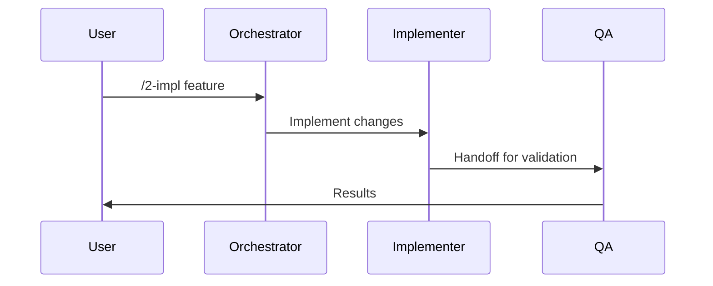

# /9-sync — Auto-Documentation & Memory Sync

Generate comprehensive session documentation automatically.

## Overview

This command closes the workflow loop by documenting what happened during a session. It:

1. Collects session history (agents invoked, tools used, files changed)
2. Generates a workflow sequence diagram (Mermaid)
3. Extracts key decisions and artifacts
4. Appends documentation to the session log
5. Syncs context to Serena memory for cross-session persistence
6. Suggests retrospective learnings

## Execution Steps

### Step 1: Gather Session Context

Collect the current session state:

```bash
# Get current branch and recent commits
git log --oneline -20 --since="$(date -d '8 hours ago' --iso-8601)" 2>/dev/null || git log --oneline -20

# Get files changed in this session
git diff --stat HEAD~10..HEAD 2>/dev/null || git diff --stat main..HEAD

# Get current session log if it exists
ls -t .agents/sessions/*.json 2>/dev/null | head -1
```

### Step 2: Generate Session Documentation

Run the sync script to produce the session documentation:

```bash
pwsh .claude/skills/workflow/scripts/Sync-SessionDocumentation.ps1
```

This script will:
- Scan git history for session commits
- Identify agents referenced in commit messages
- Generate a Mermaid sequence diagram
- Produce a structured session summary

### Step 3: Extract Decisions and Artifacts

From the session context, identify:

- **Decisions made**: ADRs created/modified, design choices documented
- **Artifacts created**: New files, modified scripts, PRs opened
- **Issues referenced**: GitHub issues addressed or discovered
- **Risks identified**: Any blockers or concerns raised

### Step 4: Update Session Log

Append the sync output to the current session log in `.agents/sessions/`. The entry MUST include:

| Field | Description |
|-------|-------------|
| `agents_invoked` | Ordered list of agents used (with duration estimates) |
| `decisions_made` | Key decisions with rationale |
| `artifacts_created` | Files, commits, issues, PRs |
| `workflow_diagram` | Mermaid sequence diagram |
| `retrospective_learnings` | Suggested improvements |

### Step 5: Sync to Memory Systems

Update persistent memory for cross-session context:

1. **Serena**: Store key decisions and outcomes via `mcp__serena__save_memory`
2. **Forgetful**: Record learnings via `mcp__forgetful__save_memory`

### Step 6: Suggest Retrospective Learnings

Based on the session, suggest:

- What went well (patterns to repeat)
- What could improve (process gaps)
- What to watch for (emerging risks)

## Arguments

| Argument | Description |
|----------|-------------|
| `--verbose` | Include full file diffs and extended commit history |
| `--dry-run` | Preview documentation without writing to session log |

## Output

The command produces a session sync report in this format:

```markdown
## Session Sync Report — YYYY-MM-DD Session N

### Workflow Diagram


### Agents Invoked
1. orchestrator (routing)
2. implementer (code changes)
3. qa (validation)

### Decisions Made
- Decision 1: rationale

### Artifacts Created
- file1.ps1 (new)
- file2.md (modified)

### Retrospective Learnings
- Learning 1
- Learning 2
```

## Dependencies

- Session State MCP (`agents://history` resource) — graceful fallback to git history when unavailable
- Serena MCP — for memory persistence
- Forgetful MCP — for learning extraction

## Related

- [SESSION-PROTOCOL.md](../../../.agents/SESSION-PROTOCOL.md) — Session requirements
- [ADR-007: Memory-First Architecture](../../../.agents/architecture/ADR-007-memory-first-architecture.md)
- [PRD: Workflow Orchestration Enhancement](../../../.agents/planning/prd-workflow-orchestration-enhancement.md)
