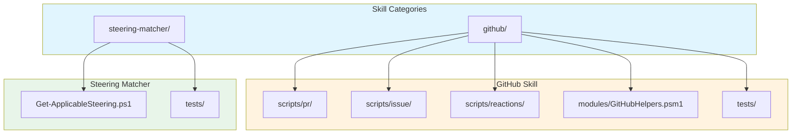
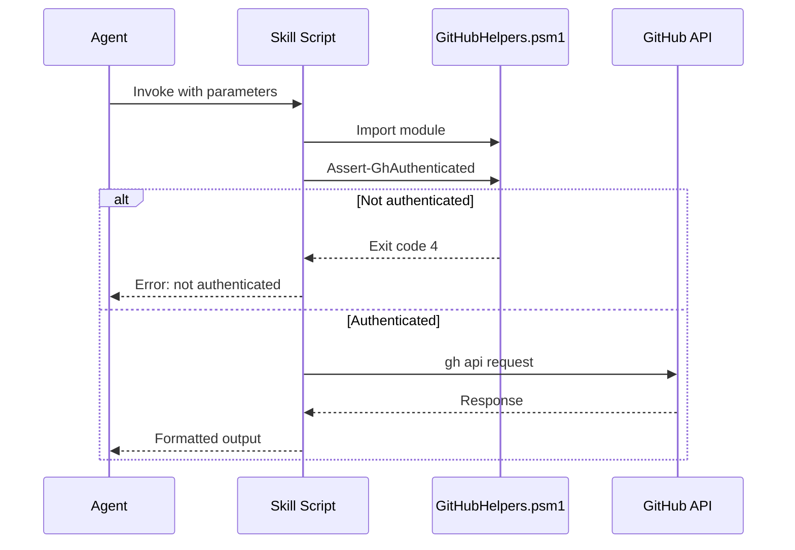

# Claude Skills System

This document describes the automated skill scripts available in the `.claude/skills/` directory for Claude Code agents.

## Overview

The skills system provides tested, validated PowerShell scripts that agents MUST use instead of raw CLI commands. Skills are centrally maintained, handle errors consistently, and prevent duplication of functionality.

**CRITICAL RULE**: Never use raw `gh` commands when a skill exists. See `skill-usage-mandatory` memory.

## Architecture



---

## GitHub Skill

**Location**: `.claude/skills/github/`
**Documentation**: `SKILL.md`
**Source Memory**: `skill-usage-mandatory`

### Skill Scripts

#### PR Operations (`scripts/pr/`)

| Script | Purpose | Key Parameters |
|--------|---------|----------------|
| `Get-PRContext.ps1` | PR metadata and diff | `-PullRequest`, `-IncludeChangedFiles` |
| `Get-PRReviewComments.ps1` | Paginated review comments | `-PullRequest` |
| `Get-PRReviewers.ps1` | Enumerate unique reviewers | `-PullRequest`, `-ExcludeBots` |
| `Post-PRCommentReply.ps1` | Thread-preserving replies | `-PullRequest`, `-CommentId`, `-Body` |

#### Issue Operations (`scripts/issue/`)

| Script | Purpose | Key Parameters |
|--------|---------|----------------|
| `Get-IssueContext.ps1` | Issue metadata | `-Issue` |
| `Set-IssueLabels.ps1` | Apply labels (auto-create) | `-Issue`, `-Labels`, `-Priority` |
| `Set-IssueMilestone.ps1` | Assign milestone | `-Issue`, `-Milestone` |
| `Post-IssueComment.ps1` | Comments with idempotency | `-Issue`, `-Body`, `-Marker` |

#### Reactions (`scripts/reactions/`)

| Script | Purpose | Key Parameters |
|--------|---------|----------------|
| `Add-CommentReaction.ps1` | Add emoji reactions | `-CommentId`, `-Reaction`, `-CommentType` |

### Shared Module

**File**: `modules/GitHubHelpers.psm1`

| Function | Purpose |
|----------|---------|
| `Get-RepoInfo` | Infer owner/repo from git remote |
| `Resolve-RepoParams` | Resolve or error on owner/repo |
| `Test-GhAuthenticated` | Check gh CLI auth status |
| `Assert-GhAuthenticated` | Exit if not authenticated |
| `Write-ErrorAndExit` | Consistent error handling |
| `Invoke-GhApiPaginated` | Fetch all pages from API |
| `Get-PriorityEmoji` | P0-P3 to emoji mapping |
| `Get-ReactionEmoji` | Reaction type to emoji |

### Exit Codes

| Code | Meaning |
|------|---------|
| 0 | Success |
| 1 | Invalid parameters |
| 2 | Resource not found (PR, issue, milestone, label) |
| 3 | GitHub API error |
| 4 | gh CLI not found or not authenticated |
| 5 | Idempotency skip (marker exists) |

### Usage Examples

```powershell
# Get PR context with changed files
pwsh .claude/skills/github/scripts/pr/Get-PRContext.ps1 -PullRequest 50 -IncludeChangedFiles

# Reply to review comment (thread-preserving)
pwsh .claude/skills/github/scripts/pr/Post-PRCommentReply.ps1 -PullRequest 50 -CommentId 123456 -Body "Fixed."

# Apply labels with priority emoji
pwsh .claude/skills/github/scripts/issue/Set-IssueLabels.ps1 -Issue 123 -Labels @("bug") -Priority "P1"

# Post comment with idempotency marker
pwsh .claude/skills/github/scripts/issue/Post-IssueComment.ps1 -Issue 123 -Body "Analysis..." -Marker "AI-TRIAGE"

# Add reaction to acknowledge
pwsh .claude/skills/github/scripts/reactions/Add-CommentReaction.ps1 -CommentId 12345678 -Reaction "eyes"
```

---

## Steering Matcher Skill

**Location**: `.claude/skills/steering-matcher/`
**Documentation**: `SKILL.md`

### Purpose

Match file paths against steering file glob patterns to determine which context-aware guidance applies to a task.

### Script

| Script | Purpose | Key Parameters |
|--------|---------|----------------|
| `Get-ApplicableSteering.ps1` | Pattern matching | `-Files`, `-SteeringPath` |

### Output

Returns array of hashtables with:

- `Name` - Steering file name
- `Path` - Full path to file
- `ApplyTo` - Glob patterns matched
- `Priority` - Sort priority (higher = more specific)

### Usage

```powershell
$files = @("src/claude/analyst.md", ".agents/security/TM-001-auth.md")
$steering = pwsh .claude/skills/steering-matcher/Get-ApplicableSteering.ps1 -Files $files

foreach ($s in $steering) {
    Write-Host "Matched: $($s.Name) (Priority: $($s.Priority))"
}
```

### Integration with Orchestrator

1. Orchestrator identifies files affected by task
2. Calls steering-matcher to find applicable guidance
3. Injects matched steering into agent context
4. Achieves 30%+ token reduction through scoping

---

## Data Flow



## Error Handling

| Error Type | Script Behavior |
|------------|-----------------|
| Missing parameters | Exit 1, display usage |
| Resource not found | Exit 2, descriptive error |
| API error | Exit 3, raw error message |
| Auth failure | Exit 4, suggest `gh auth login` |
| Idempotency | Exit 5, skip silently |

## Security Considerations

| Control | Description |
|---------|-------------|
| No hardcoded credentials | Uses `gh auth` status |
| Input validation | All parameters validated |
| Path safety | No arbitrary file execution |
| API rate limiting | Handled by `gh` CLI |

## Testing

### GitHub Skill Tests

```powershell
Invoke-Pester .claude/skills/github/tests/GitHubHelpers.Tests.ps1
```

### Steering Matcher Tests

```powershell
Invoke-Pester .claude/skills/steering-matcher/tests/Get-ApplicableSteering.Tests.ps1
```

## Monitoring

| Check | Mechanism |
|-------|-----------|
| Script execution | Exit codes |
| API errors | Logged to stderr |
| Rate limits | GitHub API headers |

## Common Patterns

### Owner/Repo Inference

All GitHub scripts support optional `-Owner` and `-Repo`. If omitted, inferred from `git remote get-url origin`.

### Idempotency with Markers

Use `-Marker` to prevent duplicate comments:

```powershell
# First call - posts comment
pwsh scripts/issue/Post-IssueComment.ps1 -Issue 123 -Body "..." -Marker "AI-TRIAGE"

# Second call - exits with code 5 (already exists)
pwsh scripts/issue/Post-IssueComment.ps1 -Issue 123 -Body "..." -Marker "AI-TRIAGE"
```

### Body from File

For multi-line content, use `-BodyFile`:

```powershell
pwsh scripts/pr/Post-PRCommentReply.ps1 -PullRequest 50 -CommentId 123 -BodyFile reply.md
```

## Related Documentation

- [Root AGENTS.md](../../AGENTS.md) - Agent usage instructions
- skill-usage-mandatory memory (use `mcp__serena__read_memory` with `memory_file_name="skill-usage-mandatory"`) - Enforcement rules
- [pr-comment-responder agent](../../src/claude/pr-comment-responder.md) - Primary consumer
