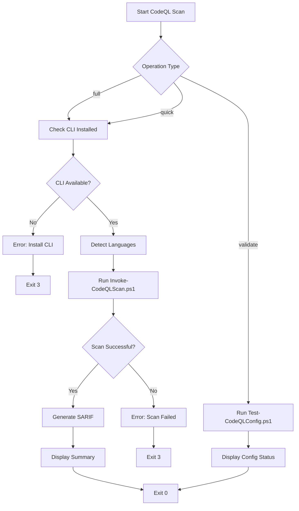

# CodeQL Scan Skill

Execute CodeQL security scans with automated language detection, database caching, and SARIF output generation.

## Quick Start

### Manual Invocation

```bash
# Via Claude Code skill system
/codeql-scan

# Direct script invocation
pwsh .claude/skills/codeql-scan/scripts/Invoke-CodeQLScanSkill.ps1 -Operation full

# Quick scan with cached databases
pwsh .claude/skills/codeql-scan/scripts/Invoke-CodeQLScanSkill.ps1 -Operation quick

# Validate configuration only
pwsh .claude/skills/codeql-scan/scripts/Invoke-CodeQLScanSkill.ps1 -Operation validate
```

## Triggers

- "Run CodeQL scan"
- "Check for vulnerabilities"
- "Validate CodeQL configuration"
- "Quick security scan"

## Decision Tree

```text
Need CodeQL analysis?
├─ First time setup → Install-CodeQL.ps1
├─ Validate config → Test-CodeQLConfig.ps1
├─ Full repository scan → Invoke-CodeQLScan.ps1
├─ Quick scan (cached) → Invoke-CodeQLScan.ps1 -UseCache
├─ Specific language → Invoke-CodeQLScan.ps1 -Languages "python"
└─ CI mode → Invoke-CodeQLScan.ps1 -CI -Format json
```

### When to Use Each Operation

| Operation | Use When | Performance | Output |
|-----------|----------|-------------|--------|
| `full` | First scan, major changes, pre-PR validation | 30-60s | SARIF + Console |
| `quick` | Iterative development, minor changes | 10-20s | SARIF + Console |
| `validate` | Config changes, troubleshooting | <5s | Console only |

## Process Overview



## Workflow

### 1. Full Repository Scan

**Use Case:** Comprehensive security analysis of entire codebase

**Steps:**

1. **Check Prerequisites:**

   ```powershell
   # Verify CodeQL CLI is installed
   if (-not (Test-Path .codeql/cli/codeql)) {
       Write-Error "CodeQL CLI not found. Run: pwsh .codeql/scripts/Install-CodeQL.ps1"
       exit 3
   }
   ```

2. **Run Scan:**

   ```powershell
   pwsh .claude/skills/codeql-scan/scripts/Invoke-CodeQLScanSkill.ps1 -Operation full
   ```

3. **Review Results:**
   - SARIF files: `.codeql/results/*.sarif`
   - Console output: Summary of findings by severity
   - Exit code: 0 (success), 1 (findings in CI mode), 3 (scan failed)

**Expected Output:**

```text
=== CodeQL Security Scan ===

[✓] CodeQL CLI found at .codeql/cli/codeql
[✓] Languages detected: python, actions
[✓] Running full scan (no cache)...

Scanning python...
  Database created: .codeql/db/python
  Queries executed: 89
  Findings: 1 (0 high, 0 medium, 1 low)

Scanning actions...
  Database created: .codeql/db/actions
  Queries executed: 45
  Findings: 0

[✓] SARIF results saved to .codeql/results/
[✓] Scan completed successfully

Total findings: 1 (0 high, 0 medium, 1 low)
```

### 2. Quick Scan (Cached)

**Use Case:** Rapid iteration during development

**Steps:**

1. **Run Quick Scan:**

   ```powershell
   pwsh .claude/skills/codeql-scan/scripts/Invoke-CodeQLScanSkill.ps1 -Operation quick
   ```

2. **Review Changes:**
   - Only re-scans if source files changed
   - Uses cached databases from previous full scan
   - 3-5x faster than full scan

**Performance:**

- Full scan: 30-60 seconds (creates databases + runs all queries)
- Quick scan (CLI): 10-20 seconds (cached database + all queries)
- Quick scan (PostToolUse hook): 5-15 seconds (cached database + targeted queries only)
- Cache invalidation: Automatic on source file, config, or script changes

### 2a. Quick Scan (PostToolUse Hook)

**Use Case:** Automatic security feedback during file editing

**How It Works:**

The PostToolUse hook automatically triggers targeted CodeQL scans after you write Python files (*.py) or GitHub Actions workflows (*.yml in .github/workflows/). Uses a focused query set (5-10 critical CWEs) to complete within 30 seconds.

**Automatic Triggers:**

- Write a Python file → Quick scan for CWE-078, CWE-089, CWE-079, etc.
- Write a workflow file → Quick scan for command injection, credential leaks

**Configuration:**

- Hook location: `.claude/hooks/PostToolUse/Invoke-CodeQLQuickScan.ps1`
- Quick config: `.github/codeql/codeql-config-quick.yml`
- Targeted queries only: CWE-078 (command injection), CWE-089 (SQL injection), CWE-079 (XSS), CWE-022 (path traversal), CWE-798 (hardcoded credentials)

**Performance:**

- Quick scan (cached DB): 5-15 seconds
- Quick scan (first run): 20-30 seconds
- Timeout budget: 30 seconds (graceful timeout if exceeded)

**Output:**

```text
**CodeQL Quick Scan**: Analyzed `script.py` - No findings

# Or if findings detected:
**CodeQL Quick Scan**: Analyzed `script.py` - **2 finding(s) detected**
```

**Graceful Degradation:**

- If CodeQL CLI not installed → Hook exits silently (non-blocking)
- If scan times out → Warning message displayed, full scan recommended

### 3. Configuration Validation

**Use Case:** Verify CodeQL configuration YAML syntax and query packs

**Steps:**

1. **Validate Config:**

   ```powershell
   pwsh .claude/skills/codeql-scan/scripts/Invoke-CodeQLScanSkill.ps1 -Operation validate
   ```

2. **Review Output:**
   - YAML syntax validation
   - Query pack resolution
   - Language configuration checks

**Expected Output:**

```text
=== CodeQL Configuration Validation ===

[✓] Configuration file found: .github/codeql/codeql-config.yml
[✓] YAML syntax valid
[✓] Query packs resolved:
    - codeql/python-queries
    - codeql/actions-queries
[✓] Language configurations valid

Configuration is valid
```

### 4. Language-Specific Scan

**Use Case:** Scan only specific languages (faster iteration)

**Steps:**

1. **Specify Languages:**

   ```powershell
   pwsh .claude/skills/codeql-scan/scripts/Invoke-CodeQLScanSkill.ps1 `
       -Operation full `
       -Languages "python"
   ```

2. **Use Cases:**
   - Testing Python scripts only
   - Validating GitHub Actions workflows only
   - Focused analysis during refactoring

### 5. CI Mode (Non-Interactive)

**Use Case:** Integration with continuous integration pipelines

**Steps:**

1. **Run in CI Mode:**

   ```powershell
   pwsh .claude/skills/codeql-scan/scripts/Invoke-CodeQLScanSkill.ps1 `
       -Operation full `
       -CI
   ```

2. **Exit Behavior:**
   - Exit 0: No findings
   - Exit 1: Findings detected (fails CI)
   - Exit 3: Scan execution failed

## Script Reference

### Invoke-CodeQLScanSkill.ps1

Wrapper script providing skill-specific functionality.

**Parameters:**

| Parameter | Type | Default | Description |
|-----------|------|---------|-------------|
| `-Operation` | ValidateSet | `"full"` | Operation type: `full`, `quick`, `validate` |
| `-Languages` | String[] | (auto-detect) | Languages to scan: `python`, `actions` |
| `-CI` | Switch | `$false` | Enable CI mode (exit 1 on findings) |

**Exit Codes (ADR-035):**

| Code | Meaning | CI Behavior |
|------|---------|-------------|
| 0 | Success (no findings or findings ignored) | Pass |
| 1 | Findings detected (CI mode only) | Fail |
| 2 | Configuration invalid | Fail |
| 3 | Scan execution failed | Fail |

**Examples:**

```powershell
# Full scan with auto-detected languages
.\Invoke-CodeQLScanSkill.ps1 -Operation full

# Quick scan (cached databases)
.\Invoke-CodeQLScanSkill.ps1 -Operation quick

# Validate configuration only
.\Invoke-CodeQLScanSkill.ps1 -Operation validate

# CI mode (exit 1 on findings)
.\Invoke-CodeQLScanSkill.ps1 -Operation full -CI

# Scan specific language
.\Invoke-CodeQLScanSkill.ps1 -Operation full -Languages "python"

# Scan multiple languages
.\Invoke-CodeQLScanSkill.ps1 -Operation full -Languages "python", "actions"
```

### Underlying Scripts

This skill wraps these core CodeQL scripts:

| Script | Purpose | Location |
|--------|---------|----------|
| `Install-CodeQL.ps1` | Download and install CodeQL CLI | `.codeql/scripts/` |
| `Invoke-CodeQLScan.ps1` | Execute security scans | `.codeql/scripts/` |
| `Test-CodeQLConfig.ps1` | Validate configuration | `.codeql/scripts/` |
| `Get-CodeQLDiagnostics.ps1` | Comprehensive health check | `.codeql/scripts/` |

## Diagnostics

**Use Case:** Troubleshoot CodeQL setup and configuration

**Run Diagnostics:**

```powershell
# Console output (default)
pwsh .codeql/scripts/Get-CodeQLDiagnostics.ps1

# JSON output (programmatic parsing)
pwsh .codeql/scripts/Get-CodeQLDiagnostics.ps1 -OutputFormat json

# Markdown report
pwsh .codeql/scripts/Get-CodeQLDiagnostics.ps1 -OutputFormat markdown > diagnostics.md
```

**Checks Performed:**

| Check | What It Validates |
|-------|-------------------|
| **CLI** | Installation, version, executable permissions |
| **Config** | YAML syntax, query pack availability, language support |
| **Database** | Existence, cache validity, size, creation timestamp |
| **Results** | SARIF files, findings count, last scan timestamp |

**Example Output:**

```text
========================================
CodeQL Diagnostics Report
========================================

[CodeQL CLI]
  ✓ Status: INSTALLED
  ✓ Path: /path/to/.codeql/cli/codeql
  ✓ Version: 2.15.3

[Configuration]
  ✓ Status: VALID
  ✓ Query Packs: 2

[Database]
  ✓ Status: EXISTS
  ✓ Languages: python, actions
  ✓ Size: 45.3 MB
  ✓ Created: 2026-01-15 20:00:00
  ✓ Cache: VALID

[Last Scan Results]
  ✓ Status: AVAILABLE
  ✓ Last Scan: 2026-01-15 20:05:00
  ✓ Total Findings: 0

========================================
Overall Status: PASS
========================================
```

**Exit Codes:**

| Code | Meaning |
|------|---------|
| 0 | All checks passed |
| 1 | Some checks failed (warnings) |
| 3 | Unable to run diagnostics |

**Recommendations:**

Diagnostics provides actionable recommendations when issues detected:

- CLI not found → `Run: pwsh .codeql/scripts/Install-CodeQL.ps1 -AddToPath`
- Config invalid YAML → `Check YAML formatting`
- Cache metadata missing → `Database will be rebuilt on next scan`
- No SARIF files found → `Run scan to generate results`

## Output Format

### SARIF Files

Results are saved in SARIF format for IDE integration:

**Location:** `.codeql/results/<language>.sarif`

**Structure:**

```json
{
  "version": "2.1.0",
  "runs": [{
    "tool": {
      "driver": {
        "name": "CodeQL",
        "version": "2.15.0"
      }
    },
    "results": [{
      "ruleId": "py/sql-injection",
      "level": "error",
      "message": {
        "text": "Potential SQL injection vulnerability"
      },
      "locations": [{
        "physicalLocation": {
          "artifactLocation": {
            "uri": "scripts/example.py"
          },
          "region": {
            "startLine": 42
          }
        }
      }]
    }]
  }]
}
```

### Console Output

Human-readable summary with severity counts:

```text
=== CodeQL Scan Results ===

python:
  ❌ High:   0
  ⚠️  Medium: 0
  ℹ️  Low:    1

actions:
  ✓ No findings

Total: 1 finding (0 high, 0 medium, 1 low)

SARIF files: .codeql/results/
```

### JSON Output (CI Mode)

Machine-readable format for CI integration:

```json
{
  "status": "findings_detected",
  "languages": ["python", "actions"],
  "findings": {
    "total": 1,
    "high": 0,
    "medium": 0,
    "low": 1
  },
  "sarif_files": [
    ".codeql/results/python.sarif",
    ".codeql/results/actions.sarif"
  ]
}
```

## Anti-Patterns

### ❌ Don't: Skip Configuration Validation

**Wrong:**

```powershell
# Running scan without verifying config
pwsh .codeql/scripts/Invoke-CodeQLScan.ps1
```

**Correct:**

```powershell
# Always validate config first
pwsh .claude/skills/codeql-scan/scripts/Invoke-CodeQLScanSkill.ps1 -Operation validate

# Then run scan
pwsh .claude/skills/codeql-scan/scripts/Invoke-CodeQLScanSkill.ps1 -Operation full
```

### ❌ Don't: Ignore Exit Codes

**Wrong:**

```powershell
# Ignoring exit code
pwsh .claude/skills/codeql-scan/scripts/Invoke-CodeQLScanSkill.ps1 -Operation full
# Continue even if scan failed
```

**Correct:**

```powershell
# Check exit code
pwsh .claude/skills/codeql-scan/scripts/Invoke-CodeQLScanSkill.ps1 -Operation full
if ($LASTEXITCODE -ne 0) {
    throw "CodeQL scan failed with exit code $LASTEXITCODE"
}
```

### ❌ Don't: Suppress Errors Before Checking Exit Code

**Wrong:**

```powershell
# Redirecting stderr BEFORE exit code check hides errors
$output = & codeql database create ... 2>&1 | Write-Verbose
if ($LASTEXITCODE -ne 0) {
    Write-Error "Command failed"  # Error message already lost!
}
```

**Correct:**

```powershell
# Check exit code FIRST, then redirect stderr conditionally
$output = & codeql database create ... 2>&1
if ($LASTEXITCODE -ne 0) {
    # IMPORTANT: Sanitize $output for secrets before logging in production.
    Write-Error "Command failed: $($output | Out-String)"
} else {
    $output | Write-Verbose
}
```

### ❌ Don't: Run Full Scans Unnecessarily

**Wrong:**

```powershell
# Full scan on every minor change
pwsh .claude/skills/codeql-scan/scripts/Invoke-CodeQLScanSkill.ps1 -Operation full
```

**Correct:**

```powershell
# Use quick scan for iterative development
pwsh .claude/skills/codeql-scan/scripts/Invoke-CodeQLScanSkill.ps1 -Operation quick

# Reserve full scans for:
# - First run
# - Major refactoring
# - Pre-PR validation
```

### ❌ Don't: Mix Skill Wrapper with Direct Script Calls

**Wrong:**

```powershell
# Mixing interfaces
pwsh .claude/skills/codeql-scan/scripts/Invoke-CodeQLScanSkill.ps1 -Operation full
pwsh .codeql/scripts/Invoke-CodeQLScan.ps1 -Languages "python"
```

**Correct:**

```powershell
# Consistent interface via skill wrapper
pwsh .claude/skills/codeql-scan/scripts/Invoke-CodeQLScanSkill.ps1 -Operation full
pwsh .claude/skills/codeql-scan/scripts/Invoke-CodeQLScanSkill.ps1 -Operation full -Languages "python"
```

## Verification Checklist

Before completing a security scan task:

- [ ] CodeQL CLI installed and accessible
- [ ] Configuration validated (`-Operation validate`)
- [ ] Scan completed successfully (exit code 0)
- [ ] SARIF files generated in `.codeql/results/`
- [ ] Findings reviewed (if any)
- [ ] High/medium severity findings addressed
- [ ] Low severity findings documented or suppressed
- [ ] Cache refreshed if source files changed significantly
- [ ] PostToolUse hook enabled and functioning (automatic scans on file writes)
- [ ] Diagnostics run and all checks passing

## Related Skills

| Skill | Purpose | When to Use |
|-------|---------|-------------|
| `security-detection` | Detect security-critical file changes | Before CodeQL scan to identify high-risk changes |
| `github` | GitHub operations (PR comments, issues) | Report CodeQL findings to PR reviews |
| `session-init` | Initialize session with protocol | Before starting security analysis workflow |

## Troubleshooting

### CodeQL CLI Not Found

**Error:**

```text
Error: CodeQL CLI not found at .codeql/cli/codeql
```

**Solution:**

```powershell
# Install CodeQL CLI
pwsh .codeql/scripts/Install-CodeQL.ps1 -AddToPath

# Verify installation
codeql version
```

### Configuration Validation Failed

**Error:**

```text
Error: Invalid query pack: codeql/unknown-queries
```

**Solution:**

```powershell
# Check configuration syntax
pwsh .codeql/scripts/Test-CodeQLConfig.ps1

# Verify query packs exist
codeql resolve qlpacks
```

### Scan Timeout

**Error:**

```text
Error: Query execution timed out after 300s
```

**Solution:**

```powershell
# Increase timeout in VSCode settings
# .vscode/settings.json:
# "codeQL.runningQueries.timeout": 600

# Or scan specific language to reduce scope
pwsh .claude/skills/codeql-scan/scripts/Invoke-CodeQLScanSkill.ps1 `
    -Operation full `
    -Languages "python"
```

### Cache Invalidation Issues

**Error:**

```text
Warning: Using cached database, but source files changed
```

**Solution:**

```powershell
# Force database rebuild
pwsh .codeql/scripts/Invoke-CodeQLScan.ps1 -UseCache:$false

# Or use full operation (always rebuilds)
pwsh .claude/skills/codeql-scan/scripts/Invoke-CodeQLScanSkill.ps1 -Operation full
```

### Hook Not Triggering

**Symptom:**

PostToolUse hook not running after file writes

**Troubleshooting:**

```powershell
# 1. Verify file type matches filter (*.py, *.yml in .github/workflows/)
#    Hook only triggers for Python files and workflow files

# 2. Check if CodeQL CLI is installed
pwsh .codeql/scripts/Get-CodeQLDiagnostics.ps1

# 3. Verify hook file exists and is executable
Test-Path .claude/hooks/PostToolUse/Invoke-CodeQLQuickScan.ps1

# 4. Check Claude Code hooks configuration
#    Hooks should be enabled in Claude Code settings
```

**Common Causes:**

- File type not supported (hook only scans `.py` and `.yml` in workflows)
- CodeQL CLI not installed (graceful degradation, no error shown)
- Hook disabled in Claude Code settings

## References

- **CodeQL Documentation:** <https://codeql.github.com/docs/>
- **SARIF Specification:** <https://sarifweb.azurewebsites.net/>
- **ADR-035:** Exit code standardization
- **ADR-005:** PowerShell-only scripting standard
- **Session Protocol:** `.agents/SESSION-PROTOCOL.md`
