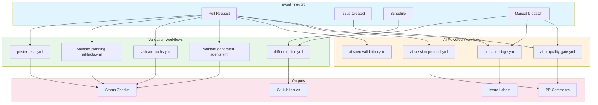
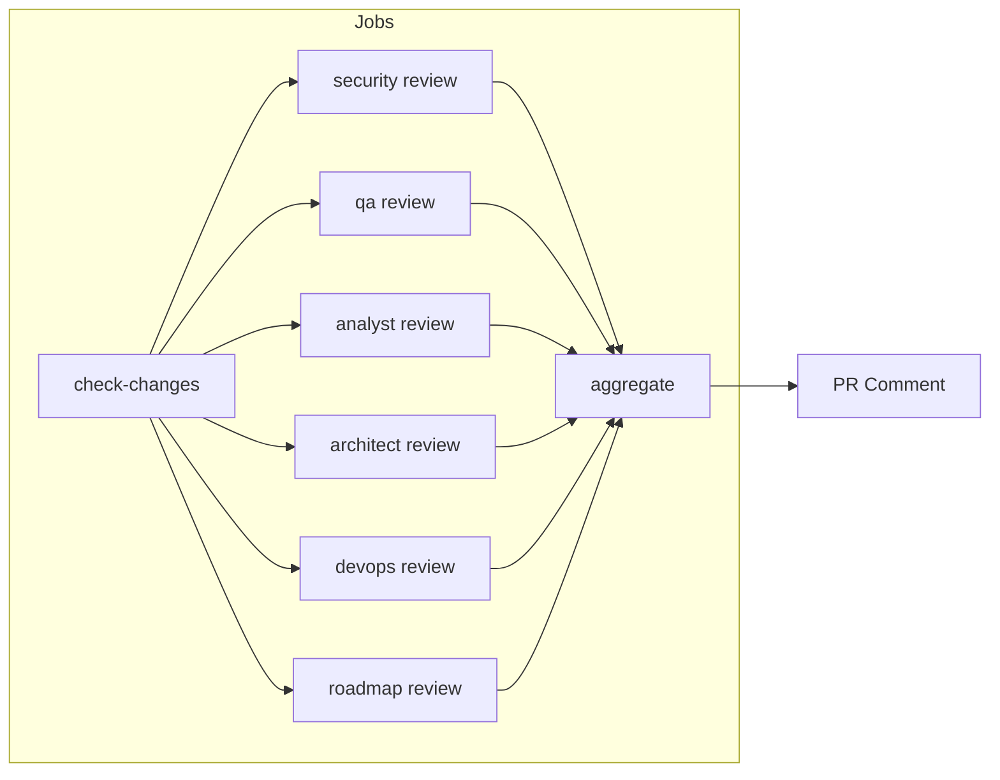
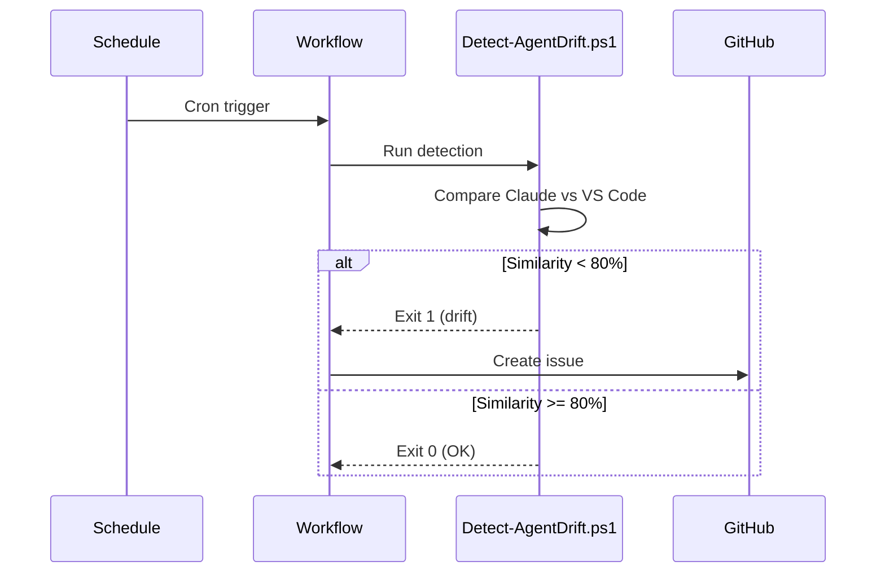
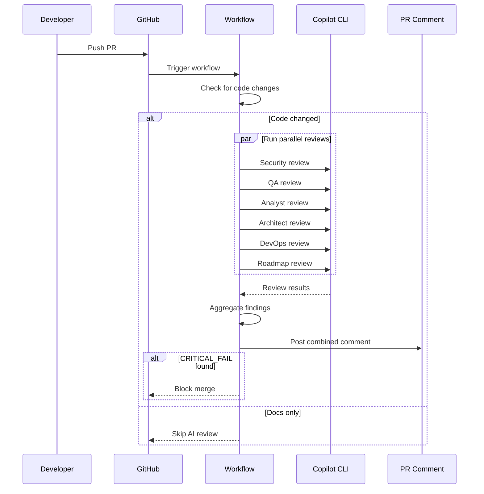
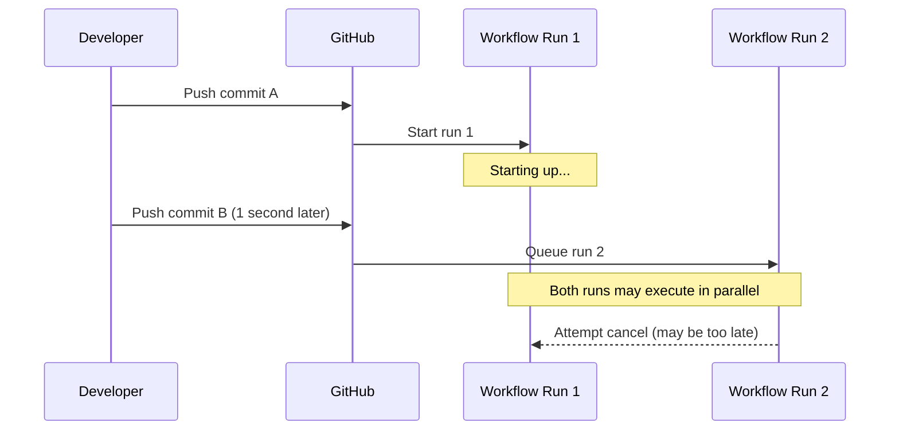
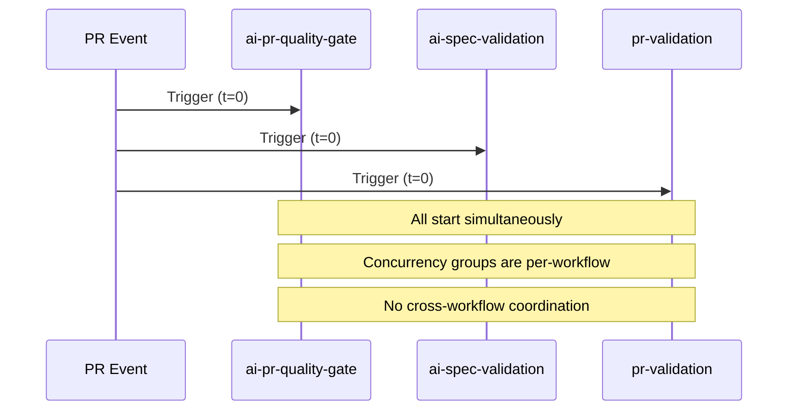

# GitHub Actions Agents

This document describes the automated CI/CD agents in GitHub Actions that enforce quality gates, run AI-powered reviews, and maintain repository health.

## Overview

The `.github/` directory contains GitHub Actions workflows, composite actions, and prompt templates that automate code review, validation, and quality assurance using both traditional CI and AI-powered analysis.

## Architecture



## AI-Powered Workflow Agents

> **IMPORTANT**: When creating a new AI-powered workflow with concurrency control, you MUST:
>
> 1. Add the workflow name to `.github/scripts/Measure-WorkflowCoalescing.ps1` (line 47, `$Workflows` parameter)
> 2. Follow concurrency group naming pattern: `{prefix}-${{ github.event.pull_request.number }}`
> 3. Document the workflow in this file
>
> This ensures the workflow is included in coalescing effectiveness monitoring.

### ai-pr-quality-gate.yml

**Role**: AI-powered parallel PR review using 6 specialist agents

| Attribute | Value |
|-----------|-------|
| **Trigger** | PR to `main`, manual dispatch |
| **Agents** | security, qa, analyst, architect, devops, roadmap |
| **Exit Behavior** | Blocks merge on `CRITICAL_FAIL` |
| **Dependencies** | Copilot CLI, `ai-review` composite action |

**Agent Responsibilities**:

| Agent | Focus | Emoji |
|-------|-------|-------|
| Security | OWASP vulnerabilities, secrets, CWE patterns | 🔒 |
| QA | Test coverage, error handling, regression risks | 🧪 |
| Analyst | Code quality, impact analysis, maintainability | 📊 |
| Architect | Design patterns, system boundaries, breaking changes | 📐 |
| DevOps | CI/CD, GitHub Actions, shell scripts, pipelines | ⚙️ |
| Roadmap | Strategic alignment, feature scope, user value | 🗺️ |

**Architecture**:



**Verdict Tokens**:

| Token | Meaning | Action |
|-------|---------|--------|
| `PASS` | No issues found | Continue |
| `WARN` | Minor issues | Log warning |
| `CRITICAL_FAIL` | Security/critical issue | Block merge |

---

### ai-issue-triage.yml

**Role**: AI-powered issue categorization and labeling

| Attribute | Value |
|-----------|-------|
| **Trigger** | Issue opened |
| **Agents** | analyst, roadmap |
| **Output** | Labels, priority, milestone assignment |
| **Dependencies** | Copilot CLI, `ai-review` composite action |

**Triage Process**:

1. Analyst categorizes issue type (bug, feature, documentation, etc.)
2. Roadmap agent assesses priority and strategic alignment
3. Labels applied automatically
4. Milestone assigned based on roadmap fit

---

### ai-session-protocol.yml

**Role**: Session protocol compliance validator

| Attribute | Value |
|-----------|-------|
| **Trigger** | PR modifying `.agents/**` |
| **Agent** | qa |
| **Output** | Protocol compliance report |
| **Exit Behavior** | Fails on MUST violations |

**Validations**:

| Check | RFC Level | Description |
|-------|-----------|-------------|
| Serena initialization | MUST | Evidence in session log |
| HANDOFF.md read | MUST | Content referenced |
| Session log created | MUST | File exists with correct naming |
| HANDOFF.md updated | MUST | Modified before PR |
| Markdown lint clean | MUST | No linting errors |

---

### ai-spec-validation.yml

**Role**: Specification completeness and traceability checker

| Attribute | Value |
|-----------|-------|
| **Trigger** | PR modifying `.agents/specs/**` |
| **Agents** | analyst, critic |
| **Output** | Spec validation report |
| **Exit Behavior** | Fails on gaps in requirement chain |

**Validations**:

- Requirements have EARS format (WHEN/SHALL/SO THAT)
- Design traces back to requirements
- Tasks trace back to design
- No orphaned requirements

---

## Validation Workflow Agents

### drift-detection.yml

**Role**: Weekly semantic drift detection between Claude and generated agents

| Attribute | Value |
|-----------|-------|
| **Trigger** | Weekly (Monday 9 AM UTC), manual |
| **Script** | `build/scripts/Detect-AgentDrift.ps1` |
| **Output** | GitHub issue if drift detected |
| **Threshold** | 80% similarity |

**Process**:



---

### validate-generated-agents.yml

**Role**: Ensures generated agent files match templates

| Attribute | Value |
|-----------|-------|
| **Trigger** | PR modifying `templates/**` or `src/**` |
| **Script** | `build/Generate-Agents.ps1 -Validate` |
| **Output** | Pass/fail status |
| **Exit Behavior** | Fails if generated files don't match |

---

### validate-paths.yml

**Role**: Path normalization validator for documentation

| Attribute | Value |
|-----------|-------|
| **Trigger** | PR modifying `**/*.md` |
| **Script** | `build/scripts/Validate-PathNormalization.ps1` |
| **Output** | Pass/fail status |
| **Forbidden** | Absolute paths (`C:\`, `/Users/`, `/home/`) |

---

### validate-planning-artifacts.yml

**Role**: Planning document consistency checker

| Attribute | Value |
|-----------|-------|
| **Trigger** | PR modifying `.agents/planning/**` |
| **Script** | `build/scripts/Validate-PlanningArtifacts.ps1` |
| **Output** | Consistency report |
| **Checks** | Effort estimates, orphan conditions, coverage |

---

### pester-tests.yml

**Role**: PowerShell unit test runner

| Attribute | Value |
|-----------|-------|
| **Trigger** | PR modifying `scripts/**` or `build/**` |
| **Script** | `build/scripts/Invoke-PesterTests.ps1 -CI` |
| **Output** | Test results XML, pass/fail status |
| **Coverage** | Installation, sync, validation scripts |

---

## Composite Actions

### ai-review/action.yml

**Role**: Reusable action for AI-powered code review

| Attribute | Value |
|-----------|-------|
| **Location** | `.github/actions/ai-review/` |
| **Purpose** | Encapsulates Copilot CLI invocation |
| **Consumers** | All `ai-*.yml` workflows |

**Inputs**:

| Input | Required | Description |
|-------|----------|-------------|
| `agent` | Yes | Agent name (security, qa, analyst, etc.) |
| `prompt-template` | Yes | Path to prompt template |
| `context` | No | Additional context to include |
| `bot-pat` | Yes | GitHub token for Copilot CLI |
| `copilot-token` | No | Dedicated Copilot auth token |

**Features**:

- 6-point diagnostic health check
- Separate stdout/stderr capture
- Detailed failure analysis
- Multiple output formats

---

## Prompt Templates

Located in `.github/prompts/`:

| Template | Used By | Purpose |
|----------|---------|---------|
| `pr-quality-gate-security.md` | ai-pr-quality-gate | Security review prompt |
| `pr-quality-gate-qa.md` | ai-pr-quality-gate | QA review prompt |
| `pr-quality-gate-analyst.md` | ai-pr-quality-gate | Code quality prompt |
| `pr-quality-gate-architect.md` | ai-pr-quality-gate | Design review prompt |
| `pr-quality-gate-devops.md` | ai-pr-quality-gate | DevOps review prompt |
| `pr-quality-gate-roadmap.md` | ai-pr-quality-gate | Strategic alignment prompt |
| `issue-triage-categorize.md` | ai-issue-triage | Issue categorization |
| `issue-triage-roadmap.md` | ai-issue-triage | Roadmap alignment |
| `session-protocol-check.md` | ai-session-protocol | Protocol compliance |
| `spec-check-completeness.md` | ai-spec-validation | Spec completeness |
| `spec-trace-requirements.md` | ai-spec-validation | Requirement tracing |

---

## Data Flow



## Error Handling

| Workflow | Error Scenario | Behavior |
|----------|---------------|----------|
| ai-pr-quality-gate | Copilot CLI failure | Log error, continue with available results |
| ai-pr-quality-gate | All agents fail | Post error summary, don't block |
| drift-detection | Detection error | Exit 2, no issue created |
| validate-* | Script failure | Fail workflow, block merge |
| pester-tests | Test failure | Report details, fail workflow |

## Security Considerations

| Workflow | Security Control |
|----------|-----------------|
| All workflows | Minimal permissions (contents: read) |
| AI workflows | `pull-requests: write` only for comments |
| drift-detection | `issues: write` only for issue creation |
| All workflows | Bot actor exclusion (dependabot, actions) |
| All workflows | Concurrency groups prevent duplicate runs |
| All workflows | **Actions pinned to SHA** (supply chain security) - See [security-practices.md](../.agents/steering/security-practices.md#github-actions-security) |

## Workflow Concurrency and Coalescing Behavior

All AI-powered and validation workflows use GitHub Actions `concurrency` groups with `cancel-in-progress: true` to prevent duplicate runs when multiple events trigger rapidly (e.g., rapid commits to a PR).

### How Concurrency Control Works

| Workflow | Concurrency Group | Behavior |
|----------|------------------|----------|
| ai-pr-quality-gate | `ai-quality-${{ github.event.pull_request.number }}` | Cancels in-progress runs for same PR |
| ai-session-protocol | `session-protocol-${{ github.event.pull_request.number }}` | Cancels in-progress runs for same PR |
| ai-spec-validation | `spec-validation-${{ github.event.pull_request.number }}` | Cancels in-progress runs for same PR |
| pr-validation | `pr-validation-${{ github.event.pull_request.number }}` | Cancels in-progress runs for same PR |
| label-pr | `pr-labeler-${{ github.event.pull_request.number }}` | Cancels in-progress runs for same PR |
| memory-validation | `memory-validation-${{ github.ref }}` | Cancels in-progress runs for same branch |
| auto-assign-reviewer | `auto-reviewer-${{ github.event.pull_request.number }}` | Cancels in-progress runs for same PR |

### The "No Guarantee" Limitation

**Important**: GitHub Actions does **not guarantee** that runs will be coalesced. Race conditions can occur where multiple runs start before cancellation takes effect.

#### Race Condition Scenarios

##### Scenario 1: Rapid Commits



##### Scenario 2: Upstream Workflow Triggers



### Mitigation Strategies

The repository implements several strategies to reduce the impact of race conditions:

| Strategy | Implementation | Effectiveness |
|----------|---------------|---------------|
| **Path filtering** | `dorny/paths-filter` action skips runs when irrelevant files change | High - Reduces unnecessary runs by 60-80% |
| **Timeouts** | All jobs have `timeout-minutes` (2-15 min) | Medium - Prevents runaway costs |
| **PR-specific temp files** | `/tmp/ai-review-context-pr${PR_NUMBER}.txt` | High - Prevents context collision |
| **Explicit repo context** | `--repo "$GITHUB_REPOSITORY"` on all `gh` CLI commands | High - Prevents wrong-PR analysis |
| **Artifact-based passing** | Matrix jobs use artifacts instead of outputs | High - Avoids matrix output limitations |

### Cost Impact

**Acceptable duplicate run rate**: 5-10% of workflow runs may execute in parallel despite `cancel-in-progress: true`

**Cost mitigation**:

- ARM runners (ADR-025): 37.5% cost savings vs x64
- Path filtering: Skips 60-80% of potential runs
- Timeouts: Caps maximum cost per run

**Example**: ai-pr-quality-gate workflow

- 6 parallel agents × 10 minutes = 60 agent-minutes per run
- 10% duplicate rate = 6 extra agent-minutes per PR
- ARM runners reduce cost by 37.5%
- **Net impact**: Acceptable given merge velocity benefits

### When to Worry

**Normal behavior** (no action needed):

- Occasional duplicate runs (5-10%)
- Runs cancelled within 30 seconds
- No wrong-PR analysis (validated by PR number checks)

**Investigate if**:

- Duplicate run rate exceeds 20%
- Runs not cancelled within 2 minutes
- Wrong-PR analysis detected (check logs for "PR number mismatch")
- Multiple PRs consistently analyze each other's contexts

### Further Reading

- [ADR-026](../.agents/architecture/ADR-026-pr-automation-concurrency-and-safety.md) - Architectural decision on concurrency control
- [Issue #803](https://github.com/rjmurillo/ai-agents/issues/803) - Real-world example of race condition impact
- [PR #806](https://github.com/rjmurillo/ai-agents/pull/806) - Fix for PR context confusion

### Monitoring Coalescing Effectiveness

The repository includes automated monitoring of workflow run coalescing effectiveness:

**Script**: `.github/scripts/Measure-WorkflowCoalescing.ps1`

**Usage**:

```bash
# Analyze last 30 days
pwsh .github/scripts/Measure-WorkflowCoalescing.ps1

# Analyze last 90 days with JSON output
pwsh .github/scripts/Measure-WorkflowCoalescing.ps1 -Since 90 -Output Json

# Analyze specific workflows
pwsh .github/scripts/Measure-WorkflowCoalescing.ps1 -Workflows @('ai-pr-quality-gate', 'ai-spec-validation')
```

**Metrics Collected**:

- Coalescing effectiveness rate (target: 90%+)
- Race condition rate (target: <10%)
- Average time to cancellation (target: <5 seconds)
- Per-workflow and per-PR breakdown

**Report Location**: `.agents/metrics/workflow-coalescing.md`

**Automated Collection**: Weekly via `.github/workflows/workflow-coalescing-metrics.yml`

## Monitoring

| Workflow | Success Indicator | Failure Indicator |
|----------|-------------------|-------------------|
| ai-pr-quality-gate | PR comment with verdicts | Missing comment or CRITICAL_FAIL |
| ai-issue-triage | Labels applied | No labels or error |
| drift-detection | No issue created | New drift alert issue |
| validate-* | Green check | Red X on PR |
| pester-tests | All tests pass | Test failures reported |

## Related Documentation

- [templates/AGENTS.md](../templates/AGENTS.md) - Template system agents
- [build/AGENTS.md](../build/AGENTS.md) - Build automation agents
- [scripts/AGENTS.md](../scripts/AGENTS.md) - Installation agents
- [docs/copilot-cli-setup.md](../docs/copilot-cli-setup.md) - Copilot CLI authentication
