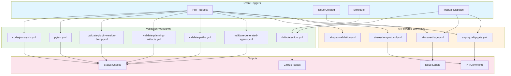
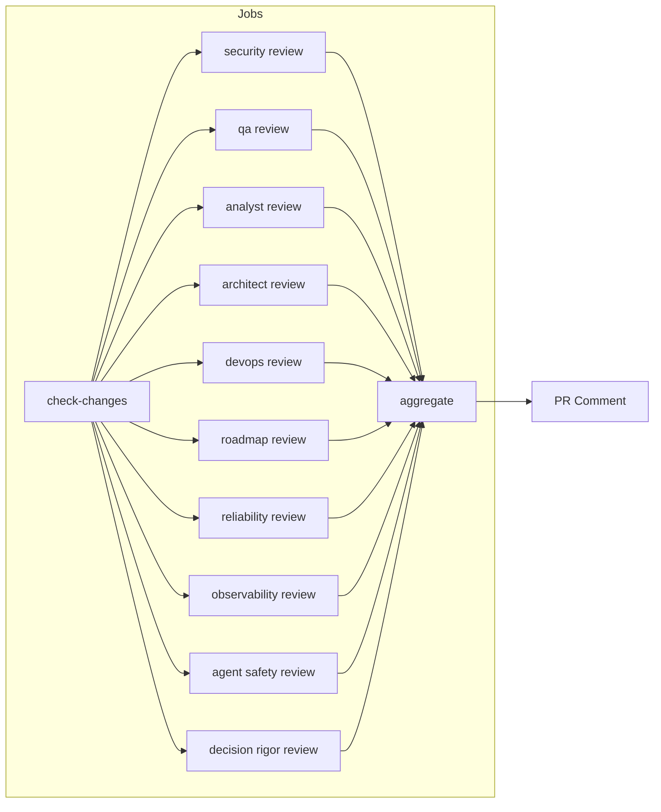
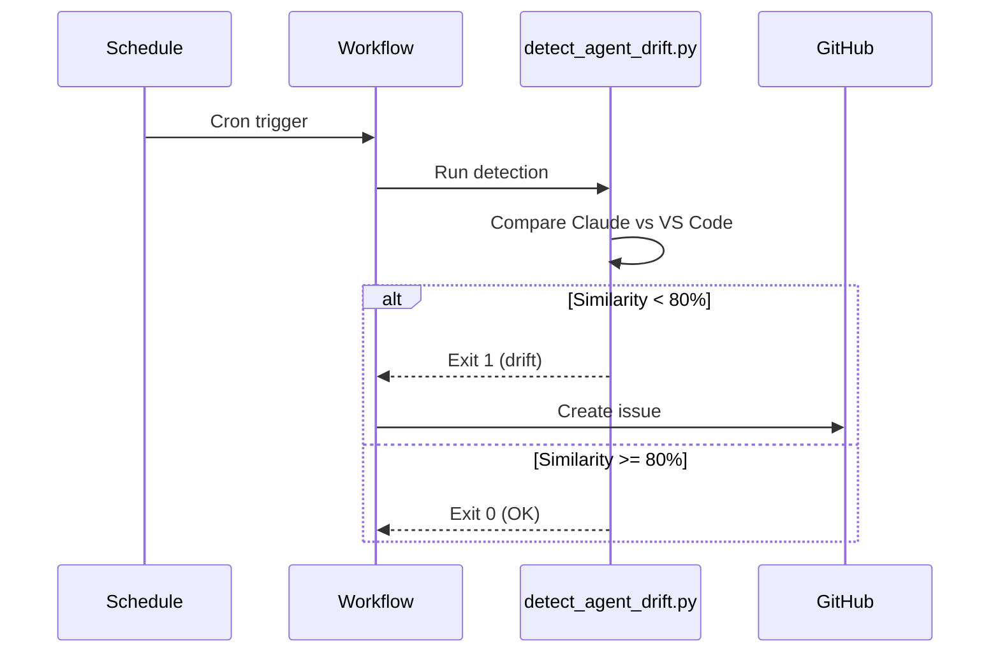
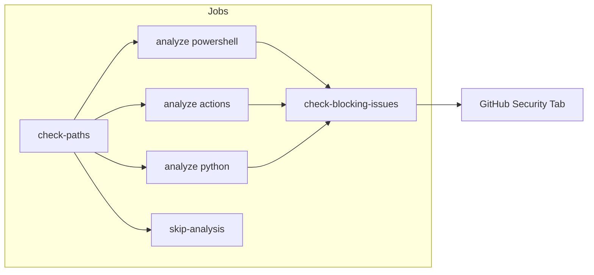
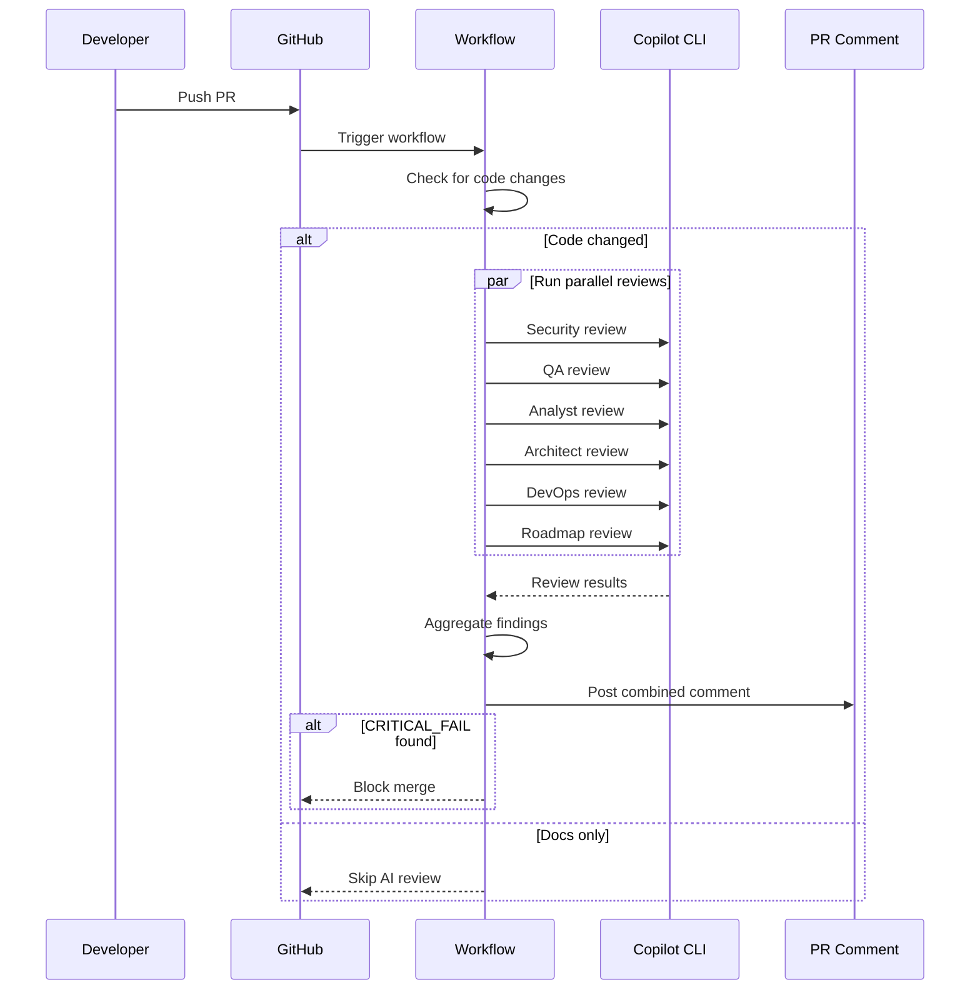
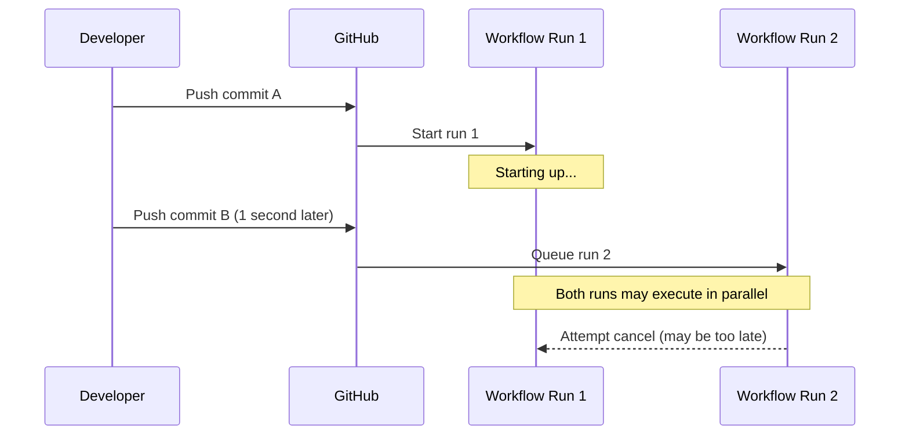
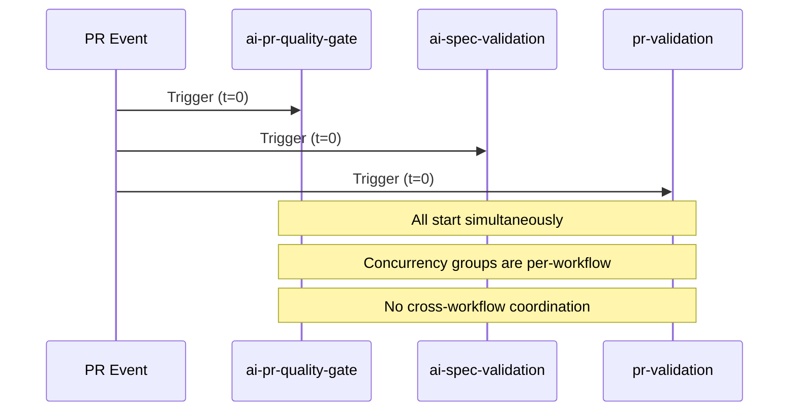

# GitHub Actions Agents

This document describes the automated CI/CD agents in GitHub Actions that enforce quality gates, run AI-powered reviews, and maintain repository health.

## Overview

The `.github/` directory contains GitHub Actions workflows, composite actions, and prompt templates that automate code review, validation, and quality assurance using both traditional CI and AI-powered analysis.

Before changing agents, prompts, instructions, hooks, or generated runtime
surfaces shared by Claude Code and Copilot CLI, load
`agent-harness-reference`. Execute contract changes through
`ai-agents-portability-campaign`. Do not infer one harness from another.

## Architecture


```mermaid
flowchart TD
    subgraph Triggers["Event Triggers"]
        PR[Pull Request]
        ISS[Issue Created]
        SCH[Schedule]
        MAN[Manual Dispatch]
    end

    subgraph AIWorkflows["AI-Powered Workflows"]
        QG[ai-pr-quality-gate.yml]
        IT[ai-issue-triage.yml]
        SP[ai-session-protocol.yml]
        SV[ai-spec-validation.yml]
    end

    subgraph ValidationWorkflows["Validation Workflows"]
        DD[drift-detection.yml]
        VG[validate-generated-agents.yml]
        VP[validate-paths.yml]
        VPA[validate-planning-artifacts.yml]
        VPV[validate-plugin-version-bump.yml]
        PT[pytest.yml]
        CQ[codeql-analysis.yml]
    end

    subgraph Outputs["Outputs"]
        CMT[PR Comments]
        LBL[Issue Labels]
        ISS2[GitHub Issues]
        CHK[Status Checks]
    end

    PR --> QG
    PR --> SP
    PR --> SV
    PR --> VG
    PR --> VP
    PR --> VPA
    PR --> VPV
    PR --> PT
    PR --> CQ

    ISS --> IT

    SCH --> DD

    MAN --> QG
    MAN --> IT
    MAN --> DD

    QG --> CMT
    IT --> LBL
    SP --> CMT
    DD --> ISS2
    VG --> CHK
    VP --> CHK
    VPA --> CHK
    VPV --> CHK
    PT --> CHK
    CQ --> CHK

    style Triggers fill:#e1f5fe
    style AIWorkflows fill:#fff3e0
    style ValidationWorkflows fill:#e8f5e9
    style Outputs fill:#fce4ec
```

## AI-Powered Workflow Agents

> **IMPORTANT**: When creating a new AI-powered workflow with concurrency control, you MUST:
>
> 1. Add the workflow name to `.github/scripts/measure_workflow_coalescing.py` (the `DEFAULT_WORKFLOWS` list)
> 2. Follow concurrency group naming pattern: `{prefix}-${{ github.event.pull_request.number || inputs.pr_number }}` (include `inputs.pr_number` for `workflow_dispatch` runs)
> 3. Document the workflow in this file
>
> This ensures the workflow is included in coalescing effectiveness monitoring.

### ai-pr-quality-gate.yml

**Role**: AI-powered parallel PR review using 10 specialist agents

| Attribute | Value |
|-----------|-------|
| **Trigger** | PR to `main`, manual dispatch |
| **Agents** | security, qa, analyst, architect, devops, roadmap, reliability, observability, agent-safety, decision-rigor |
| **Exit Behavior** | Blocks on code failures and missing security review |
| **Dependencies** | Copilot CLI, `ai-review` composite action |

**Agent Responsibilities**:

| Agent | Focus | Emoji |
|-------|-------|-------|
| Security | OWASP vulnerabilities, secrets, CWE patterns | 🔒 |
| QA | Test coverage, error handling, regression risks | 🧪 |
| Analyst | Code quality, impact analysis, maintainability | 📊 |
| Architect | Design patterns, system boundaries, breaking changes | 📐 |
| DevOps | CI/CD, GitHub Actions, shell scripts, pipelines | ⚙️ |
| Roadmap | Strategic alignment, feature scope, user value | 🗺️ |
| Reliability | Failure handling, recovery, operational risk | 🛡️ |
| Observability | Logging, metrics, and diagnostics | 🔭 |
| Agent Safety | Agent boundaries and guardrails | 🤖 |
| Decision Rigor | Trade-offs, evidence, and decision quality | ⚖️ |

**Architecture**:


```mermaid
flowchart LR
    subgraph Jobs
        CC[check-changes]
        R1[security review]
        R2[qa review]
        R3[analyst review]
        R4[architect review]
        R5[devops review]
        R6[roadmap review]
        R7[reliability review]
        R8[observability review]
        R9[agent safety review]
        R10[decision rigor review]
        AG[aggregate]
    end

    CC --> R1 & R2 & R3 & R4 & R5 & R6 & R7 & R8 & R9 & R10
    R1 & R2 & R3 & R4 & R5 & R6 & R7 & R8 & R9 & R10 --> AG
    AG --> CMT[PR Comment]
```

**Verdict Tokens**:

| Token | Meaning | Action |
|-------|---------|--------|
| `PASS` | No issues found | Continue |
| `WARN` | Minor issues | Log warning |
| `CRITICAL_FAIL` | Security/critical issue | Block merge |

---

### ai-issue-triage.yml

**Role**: AI-powered issue categorization and labeling

| Attribute | Value |
|-----------|-------|
| **Trigger** | Issue opened |
| **Agents** | analyst, roadmap |
| **Output** | Labels, priority, milestone assignment |
| **Dependencies** | Copilot CLI, `ai-review` composite action |

**Triage Process**:

1. Analyst categorizes issue type (bug, feature, documentation, etc.)
2. Roadmap agent assesses priority and strategic alignment
3. Labels applied automatically
4. Milestone assigned based on roadmap fit

---

### ai-session-protocol.yml

**Role**: Session protocol compliance validator

| Attribute | Value |
|-----------|-------|
| **Trigger** | PR modifying `.agents/**` |
| **Agent** | qa |
| **Output** | Protocol compliance report |
| **Exit Behavior** | Fails on MUST violations |

**Validations**:

| Check | RFC Level | Description |
|-------|-----------|-------------|
| Serena initialization | MUST | Evidence in session log |
| HANDOFF.md read | MUST | Content referenced |
| Session log created | MUST | File exists with correct naming |
| HANDOFF.md unchanged | MUST | Read-only per ADR-014 |
| Markdown lint clean | MUST | No linting errors |

---

### ai-spec-validation.yml

**Role**: Specification completeness and traceability checker

| Attribute | Value |
|-----------|-------|
| **Trigger** | PR modifying `.agents/specs/**` |
| **Agents** | analyst, critic |
| **Output** | Spec validation report |
| **Exit Behavior** | Fails on gaps in requirement chain |

**Validations**:

- Requirements have EARS format (WHEN/SHALL/SO THAT)
- Design traces back to requirements
- Tasks trace back to design
- No orphaned requirements

### Optional Debouncing

**Feature**: Workflows support optional debouncing to reduce race condition probability.

**How to Enable**:

```bash
# Manual workflow dispatch with debouncing
gh workflow run ai-pr-quality-gate.yml \
  --ref main \
  -f pr_number=123 \
  -f enable_debouncing=true
```

**Tradeoffs**:

| Aspect | Impact |
|--------|--------|
| Latency | +10 seconds per run |
| Race conditions | Reduced by ~50% (estimated) |
| Coalescing effectiveness | Improved by 5-8% (estimated) |
| Cost | +10s runner time per run |

**When to Use**:

- Race condition rate consistently >10%
- Coalescing effectiveness <90%
- Specific PRs with rapid commit patterns
- High-value PRs where duplicate runs are costly

**Monitoring**: Use `measure_workflow_coalescing.py` to track effectiveness before/after enabling debouncing.

---

## Validation Workflow Agents

### drift-detection.yml

**Role**: Weekly semantic drift detection between Claude and generated agents

| Attribute | Value |
|-----------|-------|
| **Trigger** | Weekly (Monday 9 AM UTC), manual |
| **Script** | `build/scripts/detect_agent_drift.py` |
| **Output** | GitHub issue if drift detected |
| **Threshold** | 80% similarity |

**Process**:


```mermaid
sequenceDiagram
    participant Schedule
    participant Workflow
    participant Script as detect_agent_drift.py
    participant GitHub

    Schedule->>Workflow: Cron trigger
    Workflow->>Script: Run detection
    Script->>Script: Compare Claude vs VS Code
    alt Similarity < 80%
        Script-->>Workflow: Exit 1 (drift)
        Workflow->>GitHub: Create issue
    else Similarity >= 80%
        Script-->>Workflow: Exit 0 (OK)
    end
```

---

### validate-generated-agents.yml

**Role**: Ensures generated agent files match templates

| Attribute | Value |
|-----------|-------|
| **Trigger** | PR modifying `templates/**` or `src/**` |
| **Script** | `uv run python build/generate_agents.py --validate` |
| **Output** | Pass/fail status |
| **Exit Behavior** | Fails if generated files don't match |

---

### validate-paths.yml

**Role**: Path normalization validator for documentation

| Attribute | Value |
|-----------|-------|
| **Trigger** | PR modifying `**/*.md` |
| **Script** | `build/scripts/validate_path_normalization.py` |
| **Output** | Pass/fail status |
| **Forbidden** | Absolute paths (`C:\`, `/Users/`, `/home/`) |

---

### validate-planning-artifacts.yml

**Role**: Planning document consistency checker

| Attribute | Value |
|-----------|-------|
| **Trigger** | PR modifying `.agents/planning/**` |
| **Script** | `build/scripts/validate_planning_artifacts.py` |
| **Output** | Consistency report |
| **Checks** | Effort estimates, orphan conditions, coverage |

---

### validate-plugin-version-bump.yml

**Role**: Plugin version-field gate (ADR-092, Issue #4080)

| Attribute | Value |
|-----------|-------|
| **Trigger** | PR/push touching `.claude/**`, `src/claude/**`, or `src/copilot-cli/**` |
| **Script** | `scripts/validation/run_plugin_version_bump_ci.py` (delegates to `build/scripts/validate_plugin_version_bump.py`) |
| **Output** | Pass/fail status |
| **Checks** | No `.claude-plugin/plugin.json` carries a `version` field; Claude Code resolves freshness from the commit SHA instead |

---

### pytest.yml

**Role**: Python unit test runner (pytest)

| Attribute | Value |
|-----------|-------|
| **Trigger** | PR modifying `scripts/**` or `build/**` |
| **Script** | `uv run pytest` |
| **Output** | Test results XML, pass/fail status |
| **Coverage** | Installation, sync, validation scripts |

---

### codeql-analysis.yml

**Role**: Static security analysis using CodeQL

| Attribute | Value |
|-----------|-------|
| **Trigger** | PR to main, push to main, weekly schedule |
| **Languages** | PowerShell, GitHub Actions, Python |
| **Output** | SARIF files uploaded to GitHub Security tab |
| **Exit Behavior** | Blocks merge on critical/high severity findings |

**Matrix Strategy**: Analyzes each language independently in parallel

**Configuration**: Uses shared config at `.github/codeql/codeql-config.yml`

**Query Packs**:

- `codeql/powershell-queries:codeql-suites/powershell-security-extended.qls`
- `codeql/actions-queries:codeql-suites/actions-security-extended.qls`
- `codeql/python-queries:codeql-suites/python-security-extended.qls`

**Severity Filtering**: Medium+ severity (excludes low severity and recommendations)

**Architecture**:


```mermaid
flowchart LR
    subgraph Jobs
        CP[check-paths]
        PS[analyze powershell]
        AC[analyze actions]
        PY[analyze python]
        SK[skip-analysis]
        BL[check-blocking-issues]
    end

    CP --> PS & AC & PY
    CP --> SK
    PS & AC & PY --> BL
    BL --> GH[GitHub Security Tab]
```

---

### test-codeql-integration.yml

**Role**: CodeQL integration test runner

| Attribute | Value |
|-----------|-------|
| **Trigger** | PR modifying `.codeql/**`, `.github/codeql/**`, or CodeQL workflows |
| **Tests** | CLI installation, config validation, scan execution, language matrix |
| **Output** | Test results summary in job summary |
| **Exit Behavior** | Fails if any integration test fails |

**Test Coverage**:

- CodeQL CLI installation and PATH configuration
- Configuration YAML syntax and query pack availability
- Scan execution and SARIF output generation
- Per-language database creation and analysis

---

## Composite Actions

### ai-review/action.yml

**Role**: Reusable action for AI-powered code review

| Attribute | Value |
|-----------|-------|
| **Location** | `.github/actions/ai-review/` |
| **Purpose** | Encapsulates Copilot CLI invocation |
| **Consumers** | All `ai-*.yml` workflows |

**Inputs**:

| Input | Required | Description |
|-------|----------|-------------|
| `agent` | Yes | Agent name (security, qa, analyst, etc.) |
| `prompt-template` | Yes | Path to prompt template |
| `context` | No | Additional context to include |
| `bot-pat` | Yes | GitHub token for Copilot CLI |
| `copilot-token` | No | Dedicated Copilot auth token |

**Features**:

- 6-point diagnostic health check
- Separate stdout/stderr capture
- Detailed failure analysis
- Multiple output formats

---

## Prompt Templates

Located in `.github/prompts/`:

| Template | Used By | Purpose |
|----------|---------|---------|
| `pr-quality-gate-security.md` | ai-pr-quality-gate | Security review prompt |
| `pr-quality-gate-qa.md` | ai-pr-quality-gate | QA review prompt |
| `pr-quality-gate-analyst.md` | ai-pr-quality-gate | Code quality prompt |
| `pr-quality-gate-architect.md` | ai-pr-quality-gate | Design review prompt |
| `pr-quality-gate-devops.md` | ai-pr-quality-gate | DevOps review prompt |
| `pr-quality-gate-roadmap.md` | ai-pr-quality-gate | Strategic alignment prompt |
| `issue-triage-categorize.md` | ai-issue-triage | Issue categorization |
| `issue-triage-roadmap.md` | ai-issue-triage | Roadmap alignment |
| `session-protocol-check.md` | ai-session-protocol | Protocol compliance |
| `spec-check-completeness.md` | ai-spec-validation | Spec completeness |
| `spec-trace-requirements.md` | ai-spec-validation | Requirement tracing |

---

## Data Flow


```mermaid
sequenceDiagram
    participant Dev as Developer
    participant GH as GitHub
    participant WF as Workflow
    participant CLI as Copilot CLI
    participant PR as PR Comment

    Dev->>GH: Push PR
    GH->>WF: Trigger workflow
    WF->>WF: Check for code changes
    alt Code changed
        par Run parallel reviews
            WF->>CLI: Security review
            WF->>CLI: QA review
            WF->>CLI: Analyst review
            WF->>CLI: Architect review
            WF->>CLI: DevOps review
            WF->>CLI: Roadmap review
        end
        CLI-->>WF: Review results
        WF->>WF: Aggregate findings
        WF->>PR: Post combined comment
        alt CRITICAL_FAIL found
            WF-->>GH: Block merge
        end
    else Docs only
        WF-->>GH: Skip AI review
    end
```

## Error Handling

| Workflow | Error Scenario | Behavior |
|----------|---------------|----------|
| ai-pr-quality-gate | Non-security infrastructure failure | Log error, continue with available results |
| ai-pr-quality-gate | Security review does not run | Post infrastructure summary and block |
| drift-detection | Detection error | Exit 2, no issue created |
| validate-* | Script failure | Fail workflow, block merge |
| pytest | Test failure | Report details, fail workflow |

## Security Considerations

| Workflow | Security Control |
|----------|-----------------|
| All workflows | Minimal permissions (contents: read) |
| AI workflows | `pull-requests: write` only for comments |
| drift-detection | `issues: write` only for issue creation |
| All workflows | Bot actor exclusion (dependabot, actions) |
| All workflows | Concurrency groups prevent duplicate runs |
| All workflows | **Actions pinned to SHA** (supply chain security) - See [security-practices.md](../.agents/steering/security-practices.md#github-actions-security) |

## Workflow Concurrency and Coalescing Behavior

All AI-powered and validation workflows use GitHub Actions `concurrency` groups with `cancel-in-progress: true` to prevent duplicate runs when multiple events trigger rapidly (e.g., rapid commits to a PR).

### How Concurrency Control Works

| Workflow | Concurrency Group | Behavior |
|----------|------------------|----------|
| ai-pr-quality-gate | `ai-quality-${{ github.event.pull_request.number &#124;&#124; inputs.pr_number }}` | Cancels in-progress runs for same PR |
| ai-session-protocol | `session-protocol-${{ github.event.pull_request.number }}` | Cancels in-progress runs for same PR |
| ai-spec-validation | `spec-validation-${{ github.event.pull_request.number &#124;&#124; inputs.pr_number }}` | Cancels in-progress runs for same PR |
| pr-validation | `pr-validation-${{ github.event.pull_request.number }}` | Cancels in-progress runs for same PR |
| label-pr | `pr-labeler-${{ github.event.pull_request.number }}` | Cancels in-progress runs for same PR |
| memory-validation | `memory-validation-${{ github.ref }}` | Cancels in-progress runs for same branch |
| auto-assign-reviewer | `auto-reviewer-${{ github.event.pull_request.number }}` | Cancels in-progress runs for same PR |
| codeql-analysis | `codeql-analysis-${{ github.event.pull_request.number &#124;&#124; github.ref }}` | Cancels in-progress runs for same PR/ref |

### The "No Guarantee" Limitation

**Important**: GitHub Actions does **not guarantee** that runs will be coalesced. Race conditions can occur where multiple runs start before cancellation takes effect.

#### Race Condition Scenarios

##### Scenario 1: Rapid Commits


```mermaid
sequenceDiagram
    participant Dev as Developer
    participant GH as GitHub
    participant W1 as Workflow Run 1
    participant W2 as Workflow Run 2

    Dev->>GH: Push commit A
    GH->>W1: Start run 1
    Note over W1: Starting up...
    Dev->>GH: Push commit B (1 second later)
    GH->>W2: Queue run 2
    Note over W1,W2: Both runs may execute in parallel
    W2-->>W1: Attempt cancel (may be too late)
```

##### Scenario 2: Upstream Workflow Triggers


```mermaid
sequenceDiagram
    participant PR as PR Event
    participant QG as ai-pr-quality-gate
    participant SV as ai-spec-validation
    participant PV as pr-validation

    PR->>QG: Trigger (t=0)
    PR->>SV: Trigger (t=0)
    PR->>PV: Trigger (t=0)
    Note over QG,PV: All start simultaneously
    Note over QG,PV: Concurrency groups are per-workflow
    Note over QG,PV: No cross-workflow coordination
```

### Mitigation Strategies

The repository implements several strategies to reduce the impact of race conditions:

| Strategy | Implementation | Effectiveness |
|----------|---------------|---------------|
| **Path filtering** | `dorny/paths-filter` action skips runs when irrelevant files change | High - Reduces unnecessary runs by 60-80% |
| **Timeouts** | All jobs have `timeout-minutes` (2-15 min) | Medium - Prevents runaway costs |
| **PR-specific temp files** | `/tmp/ai-review-context-pr${PR_NUMBER}.txt` | High - Prevents context collision |
| **Explicit repo context** | `--repo "$GITHUB_REPOSITORY"` on all `gh` CLI commands | High - Prevents wrong-PR analysis |
| **Artifact-based passing** | Matrix jobs use artifacts instead of outputs | High - Avoids matrix output limitations |

### Cost Impact

**Acceptable duplicate run rate**: 5-10% of workflow runs may execute in parallel despite `cancel-in-progress: true`

**Cost mitigation**:

- ARM runners (ADR-025): 37.5% cost savings vs x64
- Path filtering: Skips 60-80% of potential runs
- Timeouts: Caps maximum cost per run

**Example**: ai-pr-quality-gate workflow

- 6 parallel agents × 10 minutes = 60 agent-minutes per run
- 10% duplicate rate = 6 extra agent-minutes per PR
- ARM runners reduce cost by 37.5%
- **Net impact**: Acceptable given merge velocity benefits

### When to Worry

**Normal behavior** (no action needed):

- Occasional duplicate runs (5-10%)
- Runs cancelled within 30 seconds
- No wrong-PR analysis (validated by PR number checks)

**Investigate if**:

- Duplicate run rate exceeds 20%
- Runs not cancelled within 2 minutes
- Wrong-PR analysis detected (check logs for "PR number mismatch")
- Multiple PRs consistently analyze each other's contexts

### Further Reading

- [ADR-026](../.agents/architecture/ADR-026-pr-automation-concurrency-and-safety.md) - Architectural decision on concurrency control
- [Issue #803](https://github.com/rjmurillo/ai-agents/issues/803) - Real-world example of race condition impact
- [PR #806](https://github.com/rjmurillo/ai-agents/pull/806) - Fix for PR context confusion

### Ratchet Baselines and the Concurrent Merge Race

Concurrency groups coalesce runs on one branch. They do nothing about two
branches whose results are each correct alone and wrong together. The count
ratchets (`scripts/ci/ruff_count_ratchet.py`, `scripts/ci/taste_count_ratchet.py`)
hit that case, and issue #4057 is where it was reported.

**The race.** Each ratchet freezes a repo-wide violation total in a one-line
file. Two PRs can each remove one violation and lower the same file from 331 to
330. Both pass their own leg. Both write byte-identical content, so git merges
them without a conflict. The merged tree has improved twice while the file fell
once, so `main` measures 329 against a baseline of 330.

**Resolution: the ratchet does not block that state.** PR #4214 made a count
below the baseline pass (`scripts/ci/count_ratchet.py`, `count < baseline`
returns exit 0), so the merged tree above is green and concurrent cleanup PRs
never conflict on the shared line. Arming
`strict_required_status_checks_policy` on ruleset `11104075` so the second PR
had to be current before merging is not needed for this race: with the ratchet
tolerating the drift there is no red `main` to prevent. Note that strict was
nonetheless armed on 2026-08-04 (ruleset version `45433643`) for a different
reason, as remediation for the red-`main` incident of that date. As of
2026-08-15 it has been returned to `false`; the count ratchets enforce
effective freshness independently. See `docs/landing-workflow.md` and
`.serena/memories/decision-every-merge-invalidates-every-open-pr.md`.

**Status note, measured 2026-08-15.** That policy reads `false` on ruleset
`11104075`. The paragraph above stays accurate on its own terms: strict checks
are not what resolves this particular race, and the ratchet tolerance is. The
count ratchets enforce effective branch freshness regardless of the strict
setting, so a branch behind main still fails CI. There is still no merge queue
(user-owned repo ineligible). See `docs/landing-workflow.md` for the full
serial one-front landing protocol.

**Residual cost.** The baseline sits above the true count until someone records
it, and that gap absorbs one later regression without firing. `--update` closes
it. `tests/ci/test_count_ratchet_concurrent_merge.py` pins both the tolerance
and the cost, including the case where a reintroduced violation lands inside the
slack unnoticed.

**Rejected alternatives.**

| Option | Why not |
|--------|---------|
| Block on a count below the baseline | What this replaced. It turns every concurrent cleanup pair into a red `main` or a stuck queue, which is the harm rather than the fix. |
| Merge queue (`merge_group` trigger) | Not available to this repository. GitHub gates merge queues to organization-owned repositories, and `rjmurillo/ai-agents` is public but owned by a user account (`owner.type` is `User`, and `GET /orgs/rjmurillo` returns 404). Source: `data/reusables/gated-features/merge-queue.md` in `github/docs`. Were it available, every required workflow would still have to answer the `merge_group` event or the queue stalls with no way to merge, which is a change to 17 contexts for a race the ratchet no longer treats as a failure. |
| Self-healing baseline commit on push to `main` | A workflow that commits a corrected baseline to the default branch needs write access, bot-actor exclusion, and loop prevention, to repair a state that is no longer an error. |
| Make the baseline conflict on concurrent edits | Two branches would have to write different bytes for git to refuse the merge, which means the file stops being a count. That redesigns what both ratchets measure and every consumer that reads them. |

**Scope.** This covers the two single-integer baselines only. The JSON allowlist
(`rule_activation_coverage_baseline.json`) and the inline `--max` in
`pr-validation.yml` do not share the race: removing an entry from either
produces a real merge conflict rather than an identical edit.

### Monitoring Coalescing Effectiveness

The repository includes automated monitoring of workflow run coalescing effectiveness:

**Script**: `.github/scripts/measure_workflow_coalescing.py`

**Usage**:

```bash
# Analyze last 30 days
python3 .github/scripts/measure_workflow_coalescing.py

# Analyze last 90 days with JSON output
python3 .github/scripts/measure_workflow_coalescing.py --since 90 --output json

# Analyze specific workflows
python3 .github/scripts/measure_workflow_coalescing.py --workflows ai-pr-quality-gate --workflows ai-spec-validation
```

**Metrics Collected**:

- Coalescing effectiveness rate (target: 90%+)
- Race condition rate (target: <10%)
- Average time to cancellation (target: <5 seconds)
- Per-workflow and per-PR breakdown

**Report Location**: `.agents/metrics/workflow-coalescing.md`

**Automated Collection**: Weekly via `.github/workflows/workflow-coalescing-metrics.yml`

## Monitoring

| Workflow | Success Indicator | Failure Indicator |
|----------|-------------------|-------------------|
| ai-pr-quality-gate | PR comment with verdicts | Missing comment or CRITICAL_FAIL |
| ai-issue-triage | Labels applied | No labels or error |
| drift-detection | No issue created | New drift alert issue |
| validate-* | Green check | Red X on PR |
| pytest | All tests pass | Test failures reported |

## Related Documentation

- [templates/AGENTS.md](../templates/AGENTS.md) - Template system agents
- [build/AGENTS.md](../build/AGENTS.md) - Build automation agents
- [scripts/AGENTS.md](../scripts/AGENTS.md) - Installation agents
- [docs/copilot-cli-setup.md](../docs/copilot-cli-setup.md) - Copilot CLI authentication
