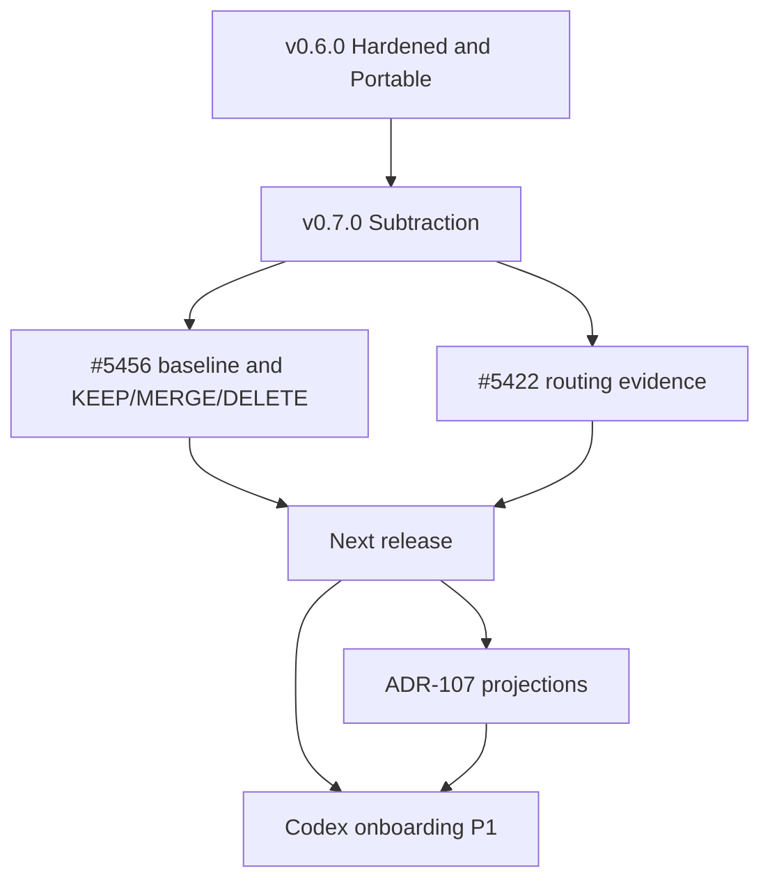

# Product Roadmap

## Master Product Objective

Enable development teams to adopt coordinated multi-agent AI workflows across Claude Code, GitHub Copilot CLI, Codex, and VS Code with minimal friction and maximum consistency.

## Vision Statement

A single-source agent system where developers contribute once and deploy everywhere. Platform-specific output is generated from canonical templates, not hand-maintained per platform.

## Operating Principle for v0.7.0

Subtraction outranks feature expansion (epic #5456). ADR-069 (proposed) frames the same idea: the curated context corpus is the product, and orchestration is plumbing. A change that adds machinery must retire something or show a measured benefit.

---

## Platform Priority Hierarchy

| Priority | Platform | Investment Level | Current State |
|----------|----------|------------------|---------------|
| **P0** | Claude Code | Full investment | Rendered to `src/claude/`, bin-placed to `.claude/`, shipped as the `project-toolkit` plugin |
| **P0** | GitHub Copilot CLI | Full investment | Rendered to `src/copilot-cli/` every build (ADR-109). Ship and internal surfaces split by tag (ADR-083). Version pins governed by ADR-094 |
| **P1** | Codex | Active development | Eval harness support only (#5819, #5423). Codex reads `AGENTS.md`. No platform template or rendered tree exists yet |
| **P2** | VS Code | Maintenance | `src/vs-code-agents/` renders from `templates/agents/<stem>.shared.md`. ADR-109 leaves this seam unmigrated |

### What each level means

- **P0**: New capabilities ship to the platform in the same change. Parity gaps are defects.
- **P1**: New capabilities should reach the platform. Gaps are tracked, not blocking.
- **P2**: Keep existing output building and correct. No new features unless they come free from shared templates.

### Evidence for the 2026-09-24 change

The 2025-12-17 decision put Copilot CLI at P2, maintenance only. The work since then went the other way:

- ADR-083 (accepted) made Copilot a shipped plugin target with a dogfooded internal overlay.
- ADR-094 (accepted) governs Copilot CLI version pins and upgrades.
- ADR-109 (accepted) renders the Copilot tree in the same build as Claude.
- In the 90 days before 2026-09-24, 590 commits touched `src/copilot-cli/`, 94 touched `src/claude/`, and 63 touched `src/vs-code-agents/`.

The owner set the new hierarchy on 2026-09-24.

### Codex onboarding (P1)

Codex support today is limited to the eval harness. Adding a rendered Codex tree is new capability that adds machinery, which the v0.7.0 milestone lists as out of scope. Plan it for the release after v0.7.0, as follows:

1. Record the Codex output contract in an ADR, extending ADR-109's per-platform templates.
2. Add `templates/platforms/codex.yaml` and render through `build_all.py`, with no hand-maintained Codex tree.
3. Reuse the ADR-107 projection invariants so Codex output is checked the same way as Claude and Copilot output.

---

## Release History

Issue and PR counts below are milestone totals, which include pull requests.

| Release | Tag date | Theme | Milestone items closed |
|---------|----------|-------|------------------------|
| v0.0.1 | 2025-12-18 | The Beginning: first agent set for three platforms | No milestone |
| v0.2.0 | 2026-01-19 | Foundation hardening, Codex MCP support (#804), Codex effectiveness epic (#858) | 344 |
| v0.3.0 | 2026-02-09 | Agents that remember: MCP infrastructure, memory citations, new skills | 139 |
| v0.3.1 | Closed 2026-07-30 | PowerShell to Python migration (ADR-042) | 54 |
| v0.4.0 | 2026-05-30 | Python-Complete, Gate-Guarded: pre-push guards, eval harness, `ai-agents init`, first Copilot CLI target | 295 |
| v0.5.0 | 2026-06-01 | LSP-First, Leak-Proof: LSP-first navigation, four review axes, secret redaction | 66 |
| v0.6.0 | 2026-07-04 | Hardened and Portable: fail-closed gates, subprocess timeouts, vendor portability | 349 |

### Goals that changed along the way

- **Framework extraction (v0.4.0 milestone goal)**: The plan was to extract the framework into `rjmurillo/awesome-ai` as a plugin marketplace. That repository does not exist, and the v0.4.0 release notes do not mention it. The marketplace ships from this repository instead (`.claude-plugin/marketplace.json`).
- **Full templating (deferred in 2025-12 as "v1.2+")**: This shipped in a different form. ADR-108 templated skills with a restricted mustache grammar, and ADR-109 extended templates to agents, rules, hooks, and settings. LiquidJS was never adopted.
- **VS Code consolidation (former "v1.1" epic #972)**: Closed.
- **JTBD plugin slicing (ADR-072, accepted)**: ADR-072 names five plugins. The marketplace ships one, `project-toolkit`. The slicing is not implemented.
- **Version labels**: The 2025-12 roadmap used "v1.0" and "v1.1". Releases actually ship as v0.x. The v1.x labels are retired.

---

## Current Release: v0.7.0 (Subtraction and Engineering Taste)

**Status**: Open. 430 items closed, 119 open as of 2026-09-24.

**Goal**: Ship a smaller system, with matched evidence that accepted-task quality did not regress.

### In scope

1. Delete and consolidate machinery: unreferenced scripts, duplicate parsers and policy owners, obsolete subsystems, retired agents and commands.
2. Cut always-loaded instruction bytes, path-local instruction layers, and catalog budgets.
3. Reduce generated governance and the sync obligations it creates.
4. Lower local pre-commit and pre-push gate cost.
5. Route in ways that remove surface rather than add it.
6. Fix gate-correctness defects that waste agent cycles: laundering ratchets, false-green checks, permanently red gates, flaky fixtures, and guards that block valid work.
7. Measure token and agent-cycle cost, and ratchet it.
8. Prove accepted-task quality held.

### Out of scope

1. Net-new governance with no retirement and no measured benefit.
2. New capability that adds machinery.
3. One-off bugs, doc and ADR housekeeping, and platform-specific fixes with no recurring agent cost.

### Epics and trackers

| Issue | Outcome |
|-------|---------|
| #5456 | Subtract the control plane and prove the smaller system (release epic) |
| #5698 | Stop agent-manufactured backlog growth with provenance at the issue door |
| #5704 | Triage the open backlog from one sheet; owner keeps, agent closes the rest |
| #5422 | Falsify orchestration routing hypotheses across models and harnesses (#5423 to #5426) |
| #5390 | Make autoplan composition discoverable, safe, and measurable |

### Open work by area (119 open issues)

| Label | Open |
|-------|------|
| area-infrastructure | 48 |
| area-skills | 38 |
| area-workflows | 19 |
| area-prompts | 16 |
| area-validation | 7 |

34 open issues carry `priority:P1` and 20 carry `priority:P2`.

### Exit criteria

- [ ] #5456 baseline committed from one pinned `main` SHA, with measurement commands and targets.
- [ ] Each candidate mechanism classified as KEEP, MERGE, or DELETE per the #5456 contract.
- [ ] Always-loaded instruction bytes and local gate p50/p95 below the committed baseline.
- [ ] Accepted-task outcomes from #5422 to #5426 show no regression.

---

## Next Release (after v0.7.0)

Not yet a milestone. Candidates, in priority order:

1. **Codex onboarding (P1)**: see Codex onboarding above.
2. **Canonical skill contracts and harness projections (ADR-107, proposed)**: #5686 to #5689 and #5691 define equivalence predicates and projection invariants across Claude and Copilot. #5690, in v0.7.0, retires the orphaned TypeScript emission pipeline. This also gives Codex a checkable target.
3. **Template-first completion (ADR-109)**: move the remaining hand-maintained agent bodies into templates.

---

## Backlog (Future milestone)

The Future milestone holds 109 open issues with no date. Main themes:

| Theme | Examples |
|-------|----------|
| ADR accuracy and lifecycle | #5555, #5675, #5696, `bug(adr)` and `docs(adr)` items |
| Harness projection (ADR-107) | #5686, #5687, #5688, #5689, #5691 |
| Test and gate coverage gaps | #5538, #5568, #5619, #5637 |
| Build and generator safety | #5522, #5657 |
| Cross-platform launch | #5521 (POSIX shell and `python3` assumptions) |

Each theme should either get pulled into a release or get closed. It should not sit in Future indefinitely. #5704 owns that sweep.

### Explicitly not on the roadmap

- **Service-operations registers** (service standards, incident and MTTR inventory, deployment migration tracking; #5864 to #5867). These serve teams that run production services. This repository ships agent tooling and runs no services.
- **Internationalization**: no demand recorded.

---

## Dependencies

---

## Success Metrics

| Metric | Target | Current | Source |
|--------|--------|---------|--------|
| Always-loaded instruction bytes | Below #5456 baseline | Baseline not yet committed | #5456 |
| Local pre-push gate p95 | Below #5456 baseline | Baseline not yet committed | #5456, #5318 |
| Accepted-task quality | No regression vs baseline | Pending #5426 | #5422 |
| Claude and Copilot projection parity | Zero invariant violations | ADR-107 proposed, not enforced | #5687 |
| Codex rendered output | Exists and passes projection checks | Not started | This roadmap |
| Open backlog | Every open issue has an owner decision | 241 open on 2026-09-24 | #5704 |

---

## Decision Log

| Date | Decision | Rationale |
|------|----------|-----------|
| 2025-12-15 | Created roadmap with v1.0, v1.1, and deferred v1.2+ | Initial strategic planning |
| 2025-12-17 | Put Copilot CLI at P2, maintenance only; declined Copilot CLI sync in `Sync-McpConfig.ps1` | Limits at the time: user-level MCP config, no plan mode, small context, no semantic analysis |
| 2026-09-24 | **Platform hierarchy reset**: Claude Code P0, Copilot CLI P0, Codex P1, VS Code P2 | Owner decision. Accepted ADR-083, ADR-094, and ADR-109 already treat Copilot CLI as a shipped target, and the 90-day commit volume matches |
| 2026-09-24 | Retired the v1.x labels and replaced them with the actual v0.x release history | Releases ship as v0.x. The v1.0 and v1.1 epics closed or shipped in another form |
| 2026-09-24 | Recorded v0.7.0 subtraction as the current release | Milestone v0.7.0 and epic #5456 |
| 2026-09-24 | Declined service-operations registers (#5864 to #5867) | Outside the master objective, and they conflict with #5456 |
