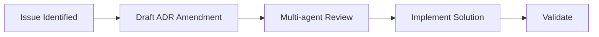
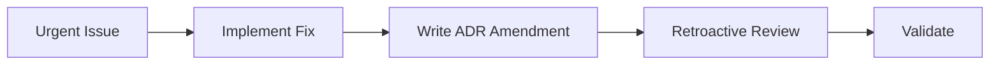

# ADR Retroactive Amendment Criteria

## Pattern

Allow concurrent ADR documentation (written during implementation) for urgent bug fixes when users are blocked, rather than requiring sequential ADR-then-implementation workflow.

## Standard Workflow

**Normal case** (non-urgent): ADR amendment written BEFORE implementation

## Exception Workflow

**Urgent bug fix** (users blocked): ADR amendment written DURING implementation

## Criteria for Retroactive Amendment

**ONLY use retroactive amendment when ALL criteria met**:

1. **Bug fix** (not feature)
2. **Users actively blocked** (documented in issue)
3. **Urgency justified** (business impact > documentation delay)
4. **Clear solution known** (not exploratory work)
5. **Rationale documented** (debate log explains why retroactive)

## Evidence

**Session 826** (2026-01-13): Issue #893

- **Problem**: Windows users blocked by YAML parsing errors
- **Impact**: Copilot CLI agents fail to load (Windows users cannot use product)
- **Solution**: Clear (convert to block-style arrays)
- **Timeline**: Implementation started immediately, ADR amendment written during work
- **Justification**: User blocking issue took priority over documentation sequence
- **Validation**: Multi-agent review (6 agents) approved retroactively

**Debate outcome**: Consensus achieved (5 ACCEPT, 1 DISAGREE AND COMMIT). Retroactive approach justified by urgency.

## Risk Assessment

| Risk | Mitigation |
|------|-----------|
| **Insufficient analysis** | Require clear solution before starting |
| **Scope creep** | Document scope boundaries in ADR |
| **Skipped review** | Retroactive multi-agent review REQUIRED |
| **Poor documentation** | Rationale for retroactive approach MUST be in debate log |
| **Precedent abuse** | Strict criteria (all 5 must be met) |

## Documentation Requirements

**When using retroactive amendment**:

1. **Issue must document** user impact and blocking state
2. **ADR amendment must include** "Retroactive Amendment" section explaining urgency
3. **Debate log must record** why retroactive approach was necessary
4. **Session log must evidence** concurrent documentation was justified

## Impact

- **Atomicity**: 85%
- **Domain**: adr-documentation
- **Use Frequency**: RARE (emergency only)
- **Precedent Risk**: MEDIUM (could be abused)

## Anti-Patterns

❌ **Feature work as "urgent bug"**: Features are never urgent enough for retroactive ADR
❌ **"We'll document later"**: Retroactive means during implementation, not after
❌ **Skipping review**: Retroactive review is REQUIRED, not optional
❌ **Bypassing constraints**: This is an exception, not a new standard

## Related

- [[protocol-013-verification-based-enforcement]] - Enforcement patterns
- [[protocol-014-trust-antipattern]] - Trust vs. verification
- [[adr-037-sync-evidence-gaps]] - Evidence requirements

## Source

- Session: 826 (2026-01-13)
- Retrospective: `.agents/retrospective/2026-01-13-fix-tools-frontmatter-retrospective.md`
- Learning: L5 (Phase 4, Lines 557-565)
- Issue: #893 (Windows users blocked)
- ADR: ADR-040 Amendment (2026-01-13)
