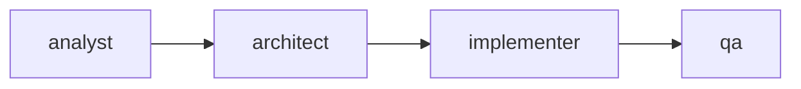

# Skill-Design-009: Mermaid for AI-Parseable Diagrams

**Statement**: Use Mermaid for diagrams under 20 nodes; bullet lists for complex architectures

**Context**: Agent specification files, AGENTS.md, documentation requiring AI parsing

**Evidence**: Mermaid is 50% smaller than ASCII, self-healing on edits, dual-use for human/AI

**Atomicity**: 88%

**Impact**: 7/10

## Comparison

| Aspect | Mermaid | ASCII Art |
|--------|---------|-----------|
| Size | 67 chars | 140+ chars |
| Self-healing | Yes | No (breaks on edit) |
| AI parsing | Semantic | Visual guess |

## Detection

- ASCII art diagrams in agent specs
- Diagrams with 20+ nodes as Mermaid

## Fix

- Convert ASCII to Mermaid for <20 nodes
- Use structured bullet lists for complex architectures

## Example

