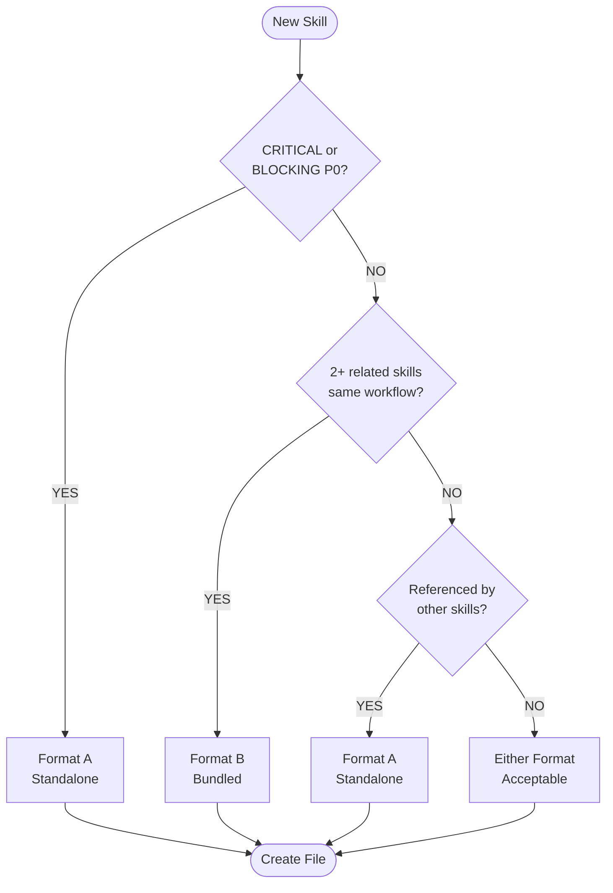

# Skill Format Selection Decision Tree

**Statement**: Use decision tree to select Format A (standalone) or Format B (bundled) for new skills.

**Context**: When creating new skill files in `.serena/memories/`

**Atomicity**: 95%

**Impact**: 8/10

## Decision Tree (Mermaid)

## Decision Rules

| Question | YES | NO |
|----------|-----|-----|
| CRITICAL/BLOCKING (P0)? | Format A | Continue |
| 2+ related skills same workflow? | Format B | Continue |
| Referenced by other skills? | Format A | Either |

## Format Definitions

**Format A (Standalone)**: Full skill structure with Statement, Context, Evidence, Pattern, Anti-Pattern, Related sections. One skill per file.

**Format B (Bundled)**: Multiple related skills in one file. Each skill has Statement, Atomicity, code example. Grouped by workflow.

## Examples

| Skill Type | Format | Example File |
|------------|--------|--------------|
| Session initialization (P0) | A | `session-init-serena.md` |
| PR acknowledgment workflow (4 skills) | B | `pr-review-acknowledgment.md` |
| GitHub CLI API patterns (4 skills) | B | `github-cli-api-patterns.md` |
| Pester test isolation (standalone) | A | `pester-test-isolation.md` |

## Evidence

Derived from migration of 194 skill files during ADR-017 implementation (Session 57).
