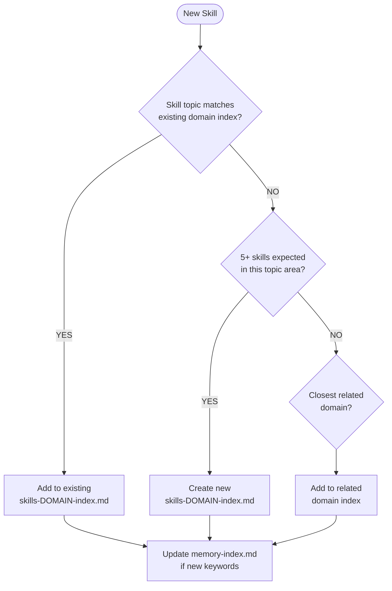

# Skill Index Selection Decision Tree

**Statement**: Use decision tree to select which `skills-*-index.md` to add a new skill to.

**Context**: When creating new skill files and need to update domain indexes.

**Atomicity**: 95%

**Impact**: 9/10

## Decision Tree (Mermaid)



## Index Selection Rules

1. **Match existing domain**: Check `memory-index.md` keywords. If skill keywords overlap >50% with existing domain, add there.
2. **Create new domain**: Only if 5+ skills expected AND no existing domain covers topic.
3. **Fallback to related**: If <5 skills expected, add to closest related domain.

## How to Check Existing Domains

```text
mcp__serena__read_memory
memory_file_name: "memory-index"
```

Match skill keywords against the Task Keywords column. The Essential Memories column shows which index to use.

## Example Decisions

| Skill Topic | Keywords | Target Index | Reasoning |
|-------------|----------|--------------|-----------|
| PR security patterns | security, PR, review | skills-pr-review-index | PR workflow context |
| Skill file formatting | format, skill, document | skills-documentation-index | Documentation context |
| Pester mock patterns | pester, mock, isolation | skills-pester-testing-index | Testing context |
| GraphQL error handling | graphql, error, mutation | skills-graphql-index | GraphQL domain exists |

## Creating New Domain Index

Only create `skills-{domain}-index.md` when ALL conditions met:
1. 5+ skills exist or are planned for the topic
2. No existing domain covers the topic adequately
3. Keywords are distinct from all existing domains

After creating new index:
1. Add entry to `memory-index.md` Task Keywords table
2. Run `pwsh scripts/Validate-MemoryIndex.ps1`

## Activation Vocabulary Rules

When adding a skill to a domain index, select 4-8 keywords:

| Keyword Type | Required | Example |
|--------------|----------|---------|
| Primary noun | YES | `security`, `isolation`, `mutation` |
| Action verb | YES | `validate`, `resolve`, `triage` |
| Tool/context | If applicable | `gh`, `pester`, `graphql` |
| Synonyms | Recommended | `check`/`verify`, `error`/`failure` |

**Uniqueness requirement**: Minimum 40% unique keywords vs other skills in same domain.

## Skill ID Numbering (NNN)

To determine the next skill number for a category:

```bash
# Find highest existing number for category (e.g., PR)
grep -r "Skill-PR-" .serena/memories/ | grep -oE "Skill-PR-[0-9]+" | sort -t'-' -k3 -n | tail -1
# Output: Skill-PR-004
# Next skill: Skill-PR-005
```

**Rules:**
- Numbers are sequential within category (001, 002, 003...)
- Do NOT reuse numbers from deleted skills
- Gaps are acceptable (001, 002, 005 if 003-004 were deleted)

## Index Update Procedure

After creating a skill file, update the domain index:

**Step 1**: Read current index to find insertion point

```text
mcp__serena__read_memory
memory_file_name: "skills-[domain]-index"
```

**Step 2**: Insert new row in Activation Vocabulary table

```text
mcp__serena__edit_memory
memory_file_name: "skills-[domain]-index"
needle: "| [last-existing-keywords] | [last-existing-file] |"
repl: "| [last-existing-keywords] | [last-existing-file] |\n| [new-keywords] | [new-file-name] |"
mode: "literal"
```

**Step 3**: Validate

```bash
pwsh scripts/Validate-MemoryIndex.ps1
```

**CRITICAL**: This validation detects orphaned files (files not in any domain index). If validation fails with orphan warnings, you MUST add the orphaned file to a domain index before committing.

## Common Validation Failures

| Failure Type | Cause | Fix |
|--------------|-------|-----|
| Orphaned file | Memory file exists but not in any index | Add entry to appropriate `skills-*-index.md` |
| Low uniqueness | <40% unique keywords in domain | Replace generic keywords with specific terms |
| Missing file | Index references non-existent file | Remove stale entry from index OR create missing file |

## Evidence

Derived from migration of 196 skill files across 30 domains during ADR-017 implementation.
