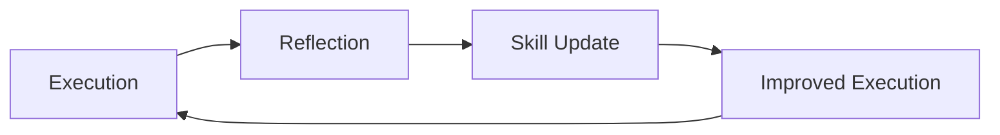

# Using the Agents

## ⚠️ MANDATORY: Initialize Serena FIRST (when available)

**BEFORE doing ANY work**, if Serena tools are available, you MUST call them in order:

```text
Option A (MCP-prefixed):
1. mcp__serena__activate_project (with project path)
2. mcp__serena__initial_instructions

Option B (serena/*):
1. serena/activate_project (with project path)
2. serena/initial_instructions
```

If Serena tools are not available in your environment, proceed without Serena and document the unavailability in your session log.

For memory fallbacks, read the backing file at `.serena/memories/<memory-name>.md`. The memory name is the filename without the `.md` extension. For example: `pr-comment-responder-skills` → `.serena/memories/pr-comment-responder-skills.md`.

**Why this matters**: Without Serena initialization, you lack access to:

- Project memories containing past decisions and user preferences
- Semantic code navigation tools
- Historical context that prevents repeated mistakes

**For VS Code/Copilot**: If Serena MCP tools are available, initialize them first. Check for tools prefixed with `mcp__serena__` or `serena/`.

---

## BLOCKING GATE: Session Protocol

> **Canonical Source**: [.agents/SESSION-PROTOCOL.md](.agents/SESSION-PROTOCOL.md)
>
> This section uses RFC 2119 key words. MUST = required, SHOULD = recommended, MAY = optional.

**Agents are experts, but amnesiacs.** Each agent session starts with zero context from previous work. The session protocol ensures continuity between sessions through **verification-based enforcement** - technical controls that make violations impossible, not just discouraged.

### Why This Matters

Without following the session protocol:

- You will repeat work already completed
- You will make decisions that contradict earlier agreements
- You will lose learnings that should inform future work
- The user will have to re-explain context every session

### Session Start Requirements (BLOCKING)

These requirements MUST be completed before ANY other work. Work is blocked until verification succeeds.

| Req Level | Step | Verification |
|-----------|------|--------------|
| **MUST** | Initialize Serena (`mcp__serena__activate_project` + `mcp__serena__initial_instructions` OR `serena/activate_project` + `serena/initial_instructions`) | Tool output in transcript |
| **MUST** | Read `.agents/HANDOFF.md` | Content in context |
| **MUST** | Create session log at `.agents/sessions/YYYY-MM-DD-session-NN.json` | File exists |
| **SHOULD** | Search relevant Serena memories | Memory results present |
| **SHOULD** | Verify git status and note starting commit | Output documented |

### Session End Requirements (BLOCKING)

You CANNOT claim session completion until validation PASSES. These requirements MUST be completed before session closes.

| Req Level | Step | Verification |
|-----------|------|--------------|
| **MUST** | Complete Session End checklist in session log | All `[x]` checked |
| **MUST NOT** | Update `.agents/HANDOFF.md` (read-only reference) | File unchanged |
| **MUST** | Update Serena memory (cross-session context) | Memory write confirmed |
| **MUST** | Run `npx markdownlint-cli2 --fix "**/*.md"` | Lint passes |
| **MUST** | Commit all changes including `.agents/` | Commit SHA in Evidence column |
| **MUST** | Run `Validate-SessionProtocol.ps1` | Exit code 0 (PASS) |
| **SHOULD** | Update PROJECT-PLAN.md task checkboxes | Tasks marked complete |
| **SHOULD** | Invoke retrospective (significant sessions) | Doc created |

**Validation Command**:

```bash
pwsh scripts/Validate-SessionJson.ps1 -SessionPath ".agents/sessions/[session-log].json"
```

**If validation fails**: Fix violations and re-run. Do NOT claim completion until PASS.

### Full Protocol Documentation

For complete protocol with:

- RFC 2119 requirement levels
- Verification mechanisms
- Session log template
- Violation handling

See: **[.agents/SESSION-PROTOCOL.md](.agents/SESSION-PROTOCOL.md)**

### The Memory Bridge

The combination of:

1. **Serena memories** (`.serena/memories/`) - Technical patterns and skills
2. **Session handoffs** (`.agents/HANDOFF.md`) - Workflow state and context
3. **Session logs** (`.agents/sessions/`) - Decision history

...creates continuity that compensates for agent amnesia. Use ALL of them.

---

## Commands (Essential Tools)

Common commands you'll reference throughout development. Commands are listed with exact flags and options.

### Session Management

#### Built-in Commands

```bash
# /init - Start new session with fresh context
# Use at the beginning of a session to load CLAUDE.md and reset context.
# Useful when switching between different tasks or projects.
/init

# /clear - Clear conversation history between distinct tasks
# Use between unrelated tasks to prevent context pollution.
# Anthropic recommends using this to maintain token efficiency.
/clear
```

#### Session Initialization

Use the session-init skill to create protocol-compliant session logs:

```bash
# Automated (recommended)
pwsh .claude/skills/session-init/scripts/New-SessionLog.ps1

# With parameters
pwsh .claude/skills/session-init/scripts/New-SessionLog.ps1 -SessionNumber 375 -Objective "Implement feature X"

# Manual trigger via slash command
/session-init
```

**Benefits**:

- Reads canonical template from SESSION-PROTOCOL.md
- Auto-detects git state (branch, commit, status)
- Validates immediately with Validate-SessionProtocol.ps1
- Prevents CI validation failures at source
- Deterministic invocation via `/session-init` slash command

See: [.claude/skills/session-init/SKILL.md](.claude/skills/session-init/SKILL.md) and [.claude/commands/session-init.md](.claude/commands/session-init.md)

#### Session Start

```bash
mcp__serena__activate_project
mcp__serena__initial_instructions
serena/activate_project
serena/initial_instructions
git branch --show-current
```

#### Session End

```bash
npx markdownlint-cli2 --fix "**/*.md"
pwsh .claude/skills/memory/scripts/Extract-SessionEpisode.ps1 -SessionLogPath ".agents/sessions/[log].json"
pwsh scripts/Validate-SessionJson.ps1 -SessionPath ".agents/sessions/[log].json"
```

### Development Tools

```bash
# Testing
pwsh ./build/scripts/Invoke-PesterTests.ps1
pwsh ./build/scripts/Invoke-PesterTests.ps1 -CI
pytest -v

# Linting
npx markdownlint-cli2 --fix "**/*.md"
pwsh scripts/Validate-Consistency.ps1

# Build
pwsh build/Generate-Agents.ps1
```

### Git & GitHub Operations

```bash
# Issue assignment
gh issue edit <number> --add-assignee @me

# PR operations
gh pr create --base main --head [branch]
gh pr merge --auto
gh pr view [number] --json title,body,state

# Workflow
gh workflow run [workflow] --ref [branch]
```

### Installation Commands

```bash
# VS Code (global)
.\scripts\install-vscode-global.ps1

# VS Code (per-repo)
.\scripts\install-vscode-repo.ps1 -RepoPath "C:\Path\To\Repo"

# Copilot CLI (per-repo)
.\scripts\install-copilot-cli-repo.ps1 -RepoPath "C:\Path\To\Repo"

# Claude Code (global)
.\scripts\install-claude-global.ps1
```

### Worktrunk Setup

Worktrunk simplifies git worktree management for parallel agent workflows.

**Installation:**

```bash
# Homebrew (macOS & Linux)
brew install max-sixty/worktrunk/wt && wt config shell install

# Cargo
cargo install worktrunk && wt config shell install
```

**Claude Code Plugin:**

```bash
claude plugin marketplace add max-sixty/worktrunk
claude plugin install worktrunk@worktrunk
```

**Configuration:**

The project includes `.config/wt.toml` with lifecycle hooks (automated commands that execute during worktree creation, merging, and removal):

- Post-create: Configures git hooks automatically
- Post-create: Copies dependencies (node_modules, .cache) from main worktree
- Pre-merge: Runs markdown linting before merging

**Workflow:**

```bash
# Create feature worktree
wt switch --create feat/feature-name

# Work on feature (hooks configure environment automatically)
# ...

# Merge when done (pre-merge hooks validate)
wt merge

# Cleanup is automatic
```

**Benefits:**

- Parallel agent isolation (each agent gets own worktree)
- Automated setup (hooks configure git hooks, copy dependencies)
- Local CI gates (pre-merge validation catches issues early)
- Visual tracking (see Claude activity across worktrees with `wt list`)

**See also**: [Worktrunk Documentation](https://worktrunk.dev/), `.agents/analysis/worktrunk-integration.md`

---

## Boundaries & Constraints

### ✅ Always Do

- **Use PowerShell (.ps1/.psm1)** for all scripts (ADR-005)
- **Verify branch** before ANY git/gh operation: `git branch --show-current`
- **Update Serena memory** at session end with cross-session context
- **Check for existing skills** before writing inline GitHub operations
- **Assign issues** before starting work: `gh issue edit <number> --add-assignee @me`
- **Use PR template** with ALL sections from `.github/PULL_REQUEST_TEMPLATE.md`
- **Commit atomically** (max 5 files OR single logical change)
- **Run linting** before commits: `npx markdownlint-cli2 --fix "**/*.md"`
- **Pin GitHub Actions to SHA** with version comment (security-practices)

### ⚠️ Ask First

- **Architecture changes** affecting multiple agents or core patterns
- **New ADRs** or additions to PROJECT-CONSTRAINTS.md
- **Breaking changes** to workflows, APIs, or agent handoff protocols
- **Security-sensitive changes** touching auth, credentials, or data handling
- **Agent routing changes** that modify orchestration patterns
- **Large refactorings** across multiple domains or subsystems

### 🚫 Never Do

- **Commit secrets or credentials** (use git-secret, environment variables, or secure vaults)
- **Update HANDOFF.md** (read-only reference, write to session logs instead)
- **Use bash/python for scripts** (PowerShell-only per ADR-005)
- **Skip session protocol validation** (`Validate-SessionProtocol.ps1` must pass)
- **Put logic in workflow YAML** (ADR-006: logic goes in .psm1 modules)
- **Use raw gh commands** when skills exist (check `.claude/skills/` first)
- **Create PRs without template** (all sections required)
- **Force push to main/master** (extremely destructive, warn user if requested)
- **Skip hooks** (no `--no-verify`, `--no-gpg-sign`)
- **Reference internal PR/issue numbers** in user-facing files (src/, templates/)

**Source**: [.agents/governance/PROJECT-CONSTRAINTS.md](.agents/governance/PROJECT-CONSTRAINTS.md)

---

## Code Style & Examples

> **Before writing code**: Read [.gemini/styleguide.md](.gemini/styleguide.md) for blocking security patterns and canonical source index.

### PowerShell Style

✅ **Good: Atomic, testable functions**

```powershell
function Get-PRContext {
    [CmdletBinding()]
    param(
        [Parameter(Mandatory)]
        [int]$Number
    )

    gh pr view $Number --json title,body,state,comments | ConvertFrom-Json
}
```

🚫 **Bad: Logic in workflow YAML (violates ADR-006)**

```yaml
- run: |
    if [ "${{ matrix.os }}" == "windows" ]; then
      # Complex branching logic
      pwsh -Command "..."
    fi
```

**Fix**: Move logic to .psm1 module, call from workflow.

### Git Commit Messages

✅ **Good: Conventional commits with context**

```text
feat: add OAuth 2.0 authentication flow

Implements RFC 6749 authorization code grant with PKCE.
Includes token refresh and secure storage.

Closes #42

🤖 Generated with [Claude Code](https://claude.com/claude-code)
```

🚫 **Bad: Vague, no context**

```text
fix stuff
```

### File Organization

✅ **Good: Follows conventions**

```text
.agents/
├── architecture/ADR-001-database-selection.md
├── planning/001-oauth-plan.md
├── sessions/2026-01-04-session-308.md
```

🚫 **Bad: Non-standard naming**

```text
.agents/
├── architecture/database_decision.md
├── planning/oauth.md
├── sessions/session308.md
```

### Memory References

✅ **Good: Tool call with fallback**

```markdown
Read the `usage-mandatory` memory using `mcp__serena__read_memory`
with `memory_file_name="usage-mandatory"`

- If Serena MCP is unavailable, read `.serena/memories/usage-mandatory.md`
```

🚫 **Bad: Direct file path (no tool abstraction)**

```markdown
Read `.serena/memories/usage-mandatory.md`
```

---

## Tech Stack & Versions

Specific versions matter for accurate tooling suggestions.

| Component | Version | Notes |
|-----------|---------|-------|
| **.NET** | .NET 9, C# 13 | Target for new work |
| **PowerShell** | 7.4+ | Cross-platform, required |
| **Node.js** | LTS (20+) | For markdownlint-cli2 |
| **Pester** | 5.6+ | Testing framework |
| **GitHub CLI** | 2.60+ | For gh operations |
| **Mermaid** | Latest | Diagram generation |

**Platform Support**: Windows, Linux, macOS (PowerShell cross-platform, use -Path parameters for OS-agnostic file handling)

---

## Coding Standards

> **Canonical Sources**: This section consolidates standards from multiple sources.
> For security patterns, see `.gemini/styleguide.md`. For exit codes, see ADR-035.

### PowerShell Standards (ADR-005)

#### Script Structure

All PowerShell scripts MUST follow this structure:

```powershell
<#
.SYNOPSIS
    Brief description of the script's purpose.

.DESCRIPTION
    Detailed explanation of functionality.

.PARAMETER ParamName
    Description of each parameter.

.EXAMPLE
    Example-Usage -ParamName "value"
    Description of what this example does.

.NOTES
    EXIT CODES:
    0  - Success: Operation completed
    1  - Error: Logic/validation failure
    2  - Error: Configuration/usage error
    3  - Error: External service failure
    4  - Error: Authentication failure

    See ADR-035 for complete exit code reference.
#>
[CmdletBinding()]
param(
    [Parameter(Mandatory)]
    [string]$RequiredParam,

    [string]$OptionalParam = "default"
)

$ErrorActionPreference = 'Stop'

function Verb-Noun {
    [CmdletBinding()]
    param()

    # Implementation
}

# Main logic
try {
    Verb-Noun
    exit 0
} catch {
    Write-Error "An error occurred: $_"
    exit 1
}
```

#### Naming Conventions

| Element | Convention | Example |
|---------|------------|---------|
| Script files | `Verb-Noun.ps1` (PascalCase, approved verbs) | `Get-PRContext.ps1` |
| Functions | `Verb-Noun` (PascalCase) | `Get-VerdictFromOutput` |
| Parameters | `$PascalCase` | `$PullRequest`, `$IncludeFiles` |
| Local variables | `$camelCase` or `$PascalCase` | `$result`, `$CommentBody` |
| Module files | `ModuleName.psm1` | `GitHubCore.psm1` |
| Test files | `ScriptName.Tests.ps1` | `Get-PRContext.Tests.ps1` |

#### Error Handling Pattern

```powershell
$ErrorActionPreference = 'Stop'  # Fail fast on errors

try {
    # Risky operations here
    $result = Invoke-Operation
    exit 0  # Success
} catch {
    Write-Error $_.Exception.Message
    exit 1  # General error (or appropriate code per ADR-035)
}
```

#### Exit Code Reference (ADR-035)

| Code | Category | When to Use |
|------|----------|-------------|
| 0 | Success | Operation completed, including idempotent no-ops |
| 1 | Logic Error | Validation failed, assertion violated |
| 2 | Config Error | Missing required parameter, invalid argument |
| 3 | External Error | GitHub API failure, network error |
| 4 | Auth Error | Token expired, permission denied |
| 5-99 | Reserved | Do not use until standardized |
| 100+ | Script-Specific | Must be documented in script header |

#### Cross-Platform Patterns

```powershell
# Path separators - ALWAYS use Join-Path
$path = Join-Path $dir $file  # Correct
$path = "$dir/$file"          # Wrong - Unix-only

# Case-sensitive comparisons
$a.Equals($b, [StringComparison]::OrdinalIgnoreCase)

# Line endings
$content = Get-Content -Raw $file  # Preserves line endings
```

### Security Patterns (BLOCKING)

These patterns cause immediate rejection. All agents MUST apply them.

#### Path Traversal Prevention (CWE-22)

```powershell
# WRONG - vulnerable to path traversal
$Path.StartsWith($Base)

# CORRECT - resolves symlinks and normalizes paths
$resolvedPath = [IO.Path]::GetFullPath($Path)
$resolvedBase = [IO.Path]::GetFullPath($Base) + [IO.Path]::DirectorySeparatorChar
$resolvedPath.StartsWith($resolvedBase, [StringComparison]::OrdinalIgnoreCase)
```

#### Command Injection Prevention (CWE-78)

```powershell
# WRONG - unquoted arguments allow injection
npx tsx $Script $Arg

# CORRECT - always quote arguments
npx tsx "$Script" "$Arg"
```

#### Variable Interpolation (PowerShell-Specific)

```powershell
# WRONG - colon is scope operator, breaks interpolation
"Processing line $LineNum:"

# CORRECT - use subexpression operator
"Processing line $($LineNum):"
```

#### Secure String Handling

```powershell
# Never log secrets
Write-Host "Token: $($env:GITHUB_TOKEN)"  # WRONG

# Use secure parameters
[SecureString]$Password  # For sensitive data

# Clear secrets when done
Remove-Variable -Name 'SecretValue' -ErrorAction SilentlyContinue
```

### Git Commit Standards

#### Conventional Commit Format

```text
<type>(<scope>): <description>

<optional body>

<optional footer>
```

**Types**: `feat`, `fix`, `docs`, `refactor`, `test`, `chore`, `style`, `perf`, `ci`, `build`

**Scopes**: Component or area affected (e.g., `memory`, `pr-review`, `session`)

#### AI-Generated Commit Attribution

All AI-generated commits MUST include a `Co-Authored-By` trailer:

```text
feat(memory): add semantic search capability

Implements vector-based memory search with configurable similarity threshold.
Includes Pester tests with 95% coverage.

Co-Authored-By: Orchestrator agent in Claude Opus 4.5 <noreply@anthropic.com>
```

**Attribution Format**: `Co-Authored-By: [Agent Name] agent in [Tool/Model] <email>`

| Tool | Email | Status |
|------|-------|--------|
| Claude (Anthropic) | `noreply@anthropic.com` | Verified |
| GitHub Copilot | `copilot@github.com` | Verified |
| Cursor | `cursor@cursor.sh` | Verified |
| Factory Droid | See tool documentation | UNVERIFIED |
| Latta | See tool documentation | UNVERIFIED |

#### Atomic Commit Rules

- **Single logical change** per commit
- **Maximum 5 files** OR single topic (whichever is smaller)
- **No mixing** unrelated changes
- **Tests included** with implementation (same commit or immediately following)

### Branch Naming Conventions

| Prefix | Purpose | Example |
|--------|---------|---------|
| `feat/` | New feature | `feat/oauth-integration` |
| `fix/` | Bug fix | `fix/cache-invalidation` |
| `docs/` | Documentation only | `docs/api-reference` |
| `refactor/` | Code restructuring | `refactor/memory-module` |
| `test/` | Test additions | `test/integration-coverage` |
| `chore/` | Maintenance tasks | `chore/dependency-updates` |
| `ci/` | CI/CD changes | `ci/parallel-testing` |
| `perf/` | Performance improvements | `perf/query-optimization` |

**Format**: `<prefix>/<kebab-case-description>`

### Pull Request Requirements

All PRs MUST use the template at `.github/PULL_REQUEST_TEMPLATE.md` with ALL sections completed:

| Section | Required For | Description |
|---------|--------------|-------------|
| Summary | All PRs | Brief description of changes |
| Specification References | Feature PRs | Links to issues, specs, or planning docs |
| Changes | All PRs | Bulleted list of modifications |
| Type of Change | All PRs | Checkbox for PR category |
| Testing | All PRs | Testing approach and coverage |
| Agent Review | Security/Architecture changes | Agent validation checkboxes |
| Checklist | All PRs | Style, review, documentation verification |

**PR Title Format**: Follows conventional commit format (e.g., `feat(auth): add PKCE flow`)

### Markdown Standards

#### Heading Style

- Use ATX style (`#` prefix) for all headings
- Maintain consistent hierarchy (no skipping levels)
- Add blank lines around headings

#### Code Blocks

- Use backticks (```) not tildes
- ALWAYS include language identifier
- Supported identifiers: `powershell`, `csharp`, `bash`, `json`, `yaml`, `markdown`, `text`, `python`

````markdown
```powershell
# Correct - has language identifier
Get-Process
```
````

#### Lists

- Use dashes (`-`) for unordered lists
- Consistent indentation (2 or 4 spaces)
- Blank lines around lists

#### Generic Type Escaping

Always wrap .NET generic types in backticks to prevent HTML parsing issues:

- Correct: `ArrayPool<T>`
- Incorrect: `ArrayPool<T>` without backticks renders incorrectly

#### Line Length

- MD013 (line length) is disabled for agent templates with long descriptions
- Prefer lines under 120 characters for readability
- No hard limit enforced

### GitHub Actions Standards (ADR-006)

#### SHA-Pinned Actions (MANDATORY)

All third-party actions MUST be pinned to commit SHA with version comment:

```yaml
# CORRECT - SHA with version comment
uses: actions/checkout@11bd71901bbe5b1630ceea73d27597364c9af683 # v4.2.2

# WRONG - version tag only (supply chain risk)
uses: actions/checkout@v4
```

#### No Expression Interpolation in run: Blocks

```yaml
# WRONG - vulnerable to injection
- run: |
    echo "Processing ${{ github.event.issue.title }}"

# CORRECT - use environment variables
- run: |
    echo "Processing $ISSUE_TITLE"
  env:
    ISSUE_TITLE: ${{ github.event.issue.title }}
```

#### Multi-Line Outputs with $GITHUB_OUTPUT

```yaml
- name: Set multi-line output
  id: my-step
  run: |
    {
      echo "report<<EOF"
      echo "Line 1"
      echo "Line 2"
      echo "EOF"
    } >> $GITHUB_OUTPUT

- name: Use the output
  run: echo "${{ steps.my-step.outputs.report }}"
```

#### Workflow Architecture (ADR-006)

- **Workflows**: Orchestration only (calls, parameters, artifacts)
- **Modules (.psm1)**: All business logic
- **Tests (.Tests.ps1)**: Pester tests for modules
- **Maximum workflow size**: 100 lines
- **Test coverage**: 80%+ for exported functions

### Testing Standards

#### Coverage Requirements

| Code Type | Required Coverage |
|-----------|-------------------|
| Security-critical paths | 100% |
| Business logic | 80% |
| Documentation/Read-only | 60% |

#### Pester Test Structure

```powershell
Describe 'Function-Name' {
    BeforeAll {
        # Setup - runs once before all tests
        $script:testPath = Join-Path $TestDrive 'test-file.txt'
    }

    AfterAll {
        # Cleanup - runs once after all tests
    }

    Context 'Success Scenarios' {
        It 'Should return expected result for valid input' {
            $result = Function-Name -Param 'value'
            $result | Should -Be 'expected'
        }
    }

    Context 'Error Scenarios' {
        It 'Should exit 2 on missing parameter' {
            & $scriptPath 2>&1 | Out-Null
            $LASTEXITCODE | Should -Be 2
        }

        It 'Should exit 3 on API error' {
            Mock gh { throw "API error" }
            & $scriptPath -ValidParams 2>&1 | Out-Null
            $LASTEXITCODE | Should -Be 3
        }
    }
}
```

#### Test Isolation Rules

- No global state modifications
- Use `$TestDrive` for temporary files
- Clean up in `AfterAll` or `AfterEach`
- Parameterized tests use `@()` arrays with `-TestCases`

### Code Review Priorities

When reviewing code, focus on these areas in order:

1. **Security**: Injection, traversal, secrets, authentication
2. **Correctness**: Logic errors, edge cases, null handling
3. **Exit Codes**: ADR-035 compliance
4. **Test Coverage**: Meets required thresholds
5. **Style**: Naming conventions, documentation

---

## Overview

This repository provides a coordinated multi-agent system for software development, available for **VS Code (GitHub Copilot)**, **GitHub Copilot CLI**, and **Claude Code CLI**. Each agent focuses on a specific phase or concern with clear responsibilities, constraints, and handoffs.

### Typical Workflow

```text
Orchestrator (ROOT agent) coordinates all delegation:

Orchestrator → Analyst → returns to Orchestrator
Orchestrator → Architect → returns to Orchestrator
Orchestrator → Planner → returns to Orchestrator
Orchestrator → Critic → returns to Orchestrator
Orchestrator → Implementer → returns to Orchestrator
Orchestrator → QA → returns to Orchestrator
Orchestrator → Retrospective → complete
```

**Architecture**: Subagents CANNOT delegate to other subagents. They return results to orchestrator, who handles all routing decisions.

The Memory agent provides long-running context across sessions using Serena (project-specific memory) and Forgetful (semantic search with knowledge graph) for persistent memory.

---

## Quick Start

### VS Code Installation

**Global (all workspaces):**

```powershell
.\scripts\install-vscode-global.ps1
```

**Per-repository:**

```powershell
.\scripts\install-vscode-repo.ps1 -RepoPath "C:\Path\To\Your\Repo"
```

### GitHub Copilot CLI Installation

**Per-repository (recommended):**

```powershell
.\scripts\install-copilot-cli-repo.ps1 -RepoPath "C:\Path\To\Your\Repo"
```

**Global (known issues - see [Issue #2](https://github.com/rjmurillo/vs-code-agents/issues/2)):**

```powershell
.\scripts\install-copilot-cli-global.ps1
```

> **Note:** User-level agents in `~/.copilot/agents/` are not currently loaded due to [GitHub Issue #452](https://github.com/github/copilot-cli/issues/452). Use per-repository installation.

### Claude Code Installation

**Global (all sessions):**

```powershell
.\scripts\install-claude-global.ps1
```

**Per-repository:**

```powershell
.\scripts\install-claude-repo.ps1 -RepoPath "C:\Path\To\Your\Repo"
```

---

## Directory Structure

```text
.
├── src/                      # Agent source files
│   ├── STYLE-GUIDE.md        # Global communication standards (all agents)
│   ├── vs-code-agents/       # VS Code / GitHub Copilot agents
│   │   └── *.agent.md
│   ├── copilot-cli/          # GitHub Copilot CLI agents
│   │   └── *.agent.md
│   └── claude/               # Claude Code CLI agents
│       └── *.md
├── scripts/                  # Installation scripts
│   ├── install-vscode-global.ps1
│   ├── install-vscode-repo.ps1
│   ├── install-copilot-cli-global.ps1
│   ├── install-copilot-cli-repo.ps1
│   ├── install-claude-global.ps1
│   └── install-claude-repo.ps1
├── AGENTS.md                 # Canonical agent instructions (this file)
├── CLAUDE.md                 # Claude Code shim → AGENTS.md
└── .github/copilot-instructions.md  # Copilot shim → AGENTS.md
```

---

## User-Facing Content Restrictions (MUST)

> **Memory Reference**: `user-facing-content-restrictions` - Read this memory for full details.

Files distributed to end-users (`src/claude/`, `src/copilot-cli/`, `src/vs-code-agents/`, `templates/agents/`) MUST NOT contain internal repository references:

| PROHIBITED | Example | Reason |
|------------|---------|--------|
| Internal PR numbers | `PR #60`, `PR #211` | Users don't know/care about our PRs |
| Internal issue numbers | `Issue #16`, `Issue #183` | Internal tracking is meaningless to users |
| Session identifiers | `Session 44`, `Session 15` | Internal implementation details |
| Internal file paths | `.agents/`, `.serena/` | Users may not have same structure |

**PERMITTED**: CWE identifiers (CWE-20, CWE-78), generic pattern descriptions, best practice recommendations.

---

## Agent Catalog

> **Persona-Based Definitions**: Each agent has a specific expertise and persona for focused task execution.

### Primary Workflow Agents

| Agent | Persona | Best For |
|-------|---------|----------|
| **orchestrator** | Workflow coordinator who routes tasks to specialized agents based on complexity and domain analysis | Complex multi-step tasks requiring multiple specialists |
| **analyst** | Technical investigator who researches unknowns, benchmarks solutions, and evaluates trade-offs with evidence | Root cause analysis, API research, performance investigation |
| **architect** | System designer who maintains architectural coherence, enforces patterns, and documents decisions via ADRs | Design governance, technical decisions, pattern enforcement |
| **planner** | Implementation strategist who breaks epics into milestones with clear acceptance criteria and dependencies | Epic breakdown, work packages, impact analysis coordination |
| **implementer** | Senior .NET engineer who writes production-ready C# 13 code following SOLID principles with 100% test coverage using Pester | Production code, tests, implementation per approved plans |
| **critic** | Plan validator who stress-tests proposals, identifies gaps, and blocks approval when risks aren't mitigated | Pre-implementation review, impact analysis validation, quality gate |
| **qa** | Test engineer who designs test strategies, ensures coverage, and validates implementations against acceptance criteria | Test strategy, verification, coverage analysis |
| **roadmap** | Product strategist who defines outcomes over outputs, prioritizes by business value using RICE/KANO, and guards against drift | Epic definition, strategic prioritization, product vision |

### Support Agents

| Agent | Persona | Best For |
|-------|---------|----------|
| **memory** | Context manager who retrieves and stores cross-session knowledge using Serena (project) and Forgetful (semantic) memory | Cross-session persistence, context continuity, knowledge retrieval |
| **skillbook** | Knowledge curator who transforms reflections into atomic, reusable strategies with deduplication and quality scoring | Learned strategy management, skill updates, pattern documentation |
| **devops** | Infrastructure specialist fluent in CI/CD pipelines, GitHub Actions, and deployment workflows | Build automation, deployment, infrastructure as code |
| **security** | Security engineer who performs threat modeling, OWASP Top 10 assessment, and vulnerability analysis before approving implementations | Threat modeling, secure coding, penetration testing, compliance |
| **independent-thinker** | Contrarian analyst who challenges assumptions with evidence, presents alternative viewpoints, and declares uncertainty | Alternative perspectives, assumption validation, devil's advocate |
| **high-level-advisor** | Strategic advisor who cuts through complexity, prioritizes ruthlessly, and resolves decision paralysis with clear verdicts | Strategic decisions, prioritization, unblocking, P0 identification |
| **retrospective** | Learning facilitator who extracts actionable insights from completed work using structured frameworks (Five Whys, timeline analysis) | Post-project learning, outcome analysis, skill extraction |
| **explainer** | Technical writer who creates PRDs, specifications, and documentation that junior developers understand without questions | PRDs, feature docs, technical specifications, user guides |
| **task-generator** | Task decomposition specialist who breaks PRDs into atomic, estimable work items with clear done criteria | Epic-to-task breakdown, backlog grooming, sprint planning |
| **pr-comment-responder** | PR review coordinator who gathers comment context, acknowledges every piece of feedback, and ensures systematic resolution | PR review responses, comment triage, feedback tracking |

---

## PR Comment Responder: Copilot Follow-Up PR Handling (Phase 4)

The pr-comment-responder agent includes a Phase 4 workflow for detecting and managing Copilot's follow-up PR creation pattern.

### Pattern Recognition

When Copilot receives replies to its PR review comments, it often creates a follow-up PR:

- **Branch**: `copilot/sub-pr-{original_pr_number}`
- **Target**: Original PR's branch (not main)
- **Announcement**: Issue comment from `app/copilot-swe-agent` containing "I've opened a new pull request"

### Phase 4 Workflow

**Trigger**: After Phase 3 (replies posted), before Phase 5 (immediate replies)

**Steps**:

1. **Query** for follow-up PRs matching branch pattern `copilot/sub-pr-{original_pr}`
2. **Verify** Copilot announcement comment exists on original PR
3. **Analyze** follow-up PR content (diff, file count, changes)
4. **Categorize** follow-up intent:
   - **DUPLICATE**: Follow-up contains same/redundant changes → Close with commit reference
   - **SUPPLEMENTAL**: Follow-up addresses different issues → Evaluate for merge
   - **INDEPENDENT**: Follow-up unrelated to original review → Close with note
5. **Execute** appropriate action (close or merge)
6. **Document** results in session log

### Detection Scripts

Two detection implementations (PowerShell + bash fallback):

- `.claude/skills/github/scripts/pr/Detect-CopilotFollowUpPR.ps1` (PowerShell)
- `.claude/skills/github/scripts/pr/detect-copilot-followup.sh` (Bash)

Both return structured JSON with:

- `found`: boolean indicating follow-up PRs detected
- `analysis`: array of follow-up categorizations with recommendations
- `recommendation`: overall action (CLOSE_AS_DUPLICATE, EVALUATE_FOR_MERGE, etc.)

### Related Memory

Skill-PR-Copilot-001 in `.serena/memories/pr-comment-responder-skills.md` documents:

- Detection logic and branch pattern matching
- Category indicators and decision matrix
- Integration verification checkpoints

### Examples

**PR #32 → PR #33**: Duplicate (closed successfully)

- Original: 5 Copilot review comments
- Follow-up: copilot/sub-pr-32 with identical changes
- Decision: Closed as duplicate, fix already applied

**PR #156 → PR #162**: Supplemental (closed, syntax fix verified)

- Original: Session retrospective PR
- Follow-up: copilot/sub-pr-156 targeting PR #156's branch
- Decision: Syntax fix applied, no code changes in follow-up

## Copilot Directive Best Practices

When using @copilot directives in pull requests, use **issue comments** instead of review comments to keep review threads focused on code feedback.

### Anti-Pattern (Pollutes Review Threads)

```text
PR Review Comment on line 42:
@copilot please refactor this function
```

**Problem**: Review comments should focus on actual code feedback. Directive comments create noise in review threads.

### Recommended Pattern (Clean Threads)

```text
Issue Comment (not on a specific line):
@copilot please refactor the function in src/foo.ps1
```

**Benefits**:

- Review comments remain focused on code feedback
- @copilot directives do not require line-specific context
- Significantly reduces comment noise in review threads

### Impact Evidence

PR #249 analysis:

- Total rjmurillo comments: 42
- @copilot directives: 41
- Actual code feedback: 1
- Signal-to-noise ratio: 2.4%

Using issue comments for directives would reduce review comment volume by 98% in this case.

### When to Use Each Comment Type

| Comment Type | Use For | Example |
|--------------|---------|---------|
| **Review Comment** | Code-specific feedback requiring context | "This function should validate input before processing" |
| **Issue Comment** | @copilot directives and general discussion | "@copilot please add tests for the validation logic" |

---

## Orchestrator: Task Classification & Domain Identification

The orchestrator uses a formal classification process to properly route tasks to the right agent sequences.

### Task Classification (Step 1)

Every incoming task is classified by type:

| Task Type | Definition | Signal Words |
|-----------|------------|--------------|
| **Feature** | New functionality | "add", "implement", "create" |
| **Bug Fix** | Correcting broken behavior | "fix", "broken", "error" |
| **Refactoring** | Restructuring without behavior change | "refactor", "clean up" |
| **Infrastructure** | Build, CI/CD, deployment | "pipeline", "workflow", "deploy" |
| **Security** | Vulnerability remediation | "vulnerability", "auth", "CVE" |
| **Documentation** | Docs, guides | "document", "explain" |
| **Research** | Investigation, analysis | "investigate", "why does" |
| **Strategic** | Architecture decisions | "architecture", "ADR" |
| **Ideation** | Vague ideas needing validation | URLs, "we should", "what if" |

### Domain Identification (Step 2)

Tasks are analyzed for which domains they affect:

| Domain | Scope |
|--------|-------|
| **Code** | Application source, business logic |
| **Architecture** | System design, patterns, structure |
| **Security** | Auth, data protection, vulnerabilities |
| **Operations** | CI/CD, deployment, infrastructure |
| **Quality** | Testing, coverage, verification |
| **Data** | Schema, migrations, storage |
| **API** | External interfaces, contracts |
| **UX** | User experience, frontend |

### Complexity Determination (Step 3)

| Domain Count | Complexity | Strategy |
|--------------|------------|----------|
| 1 domain | Simple | Single specialist agent |
| 2 domains | Standard | Sequential 2-3 agents |
| 3+ domains | Complex | Full orchestration with impact analysis |

Security, Strategic, and Ideation tasks are always treated as Complex.

---

## Impact Analysis Framework

For complex, multi-domain changes, orchestrator manages impact analysis consultations with specialist agents.

**Architecture Note**: Since subagents cannot delegate, planner creates the analysis plan and orchestrator executes each specialist consultation.

### When to Use Impact Analysis

- **Multi-domain changes**: Affects 3+ areas (code, architecture, CI/CD, security, quality)
- **Architecture changes**: Modifies core patterns or introduces new dependencies
- **Security-sensitive changes**: Touches authentication, authorization, data handling
- **Infrastructure changes**: Affects build, deployment, or CI/CD pipelines
- **Breaking changes**: Modifies public APIs or contracts

### Consultation Process

```text
1. Orchestrator routes to planner with impact analysis flag
2. Planner identifies change scope and affected domains, creates analysis plan
3. Planner returns plan to orchestrator
4. Orchestrator invokes specialist agents (sequentially or in parallel):
   - Orchestrator → implementer: Code impact → returns to Orchestrator
   - Orchestrator → architect: Design impact → returns to Orchestrator
   - Orchestrator → security: Security impact → returns to Orchestrator
   - Orchestrator → devops: Operations impact → returns to Orchestrator
   - Orchestrator → qa: Quality impact → returns to Orchestrator
5. Orchestrator aggregates findings
6. Orchestrator routes to critic for validation
```

### Impact Analysis Outputs

Each specialist creates: `.agents/planning/impact-analysis-[domain]-[feature].md`

---

## Disagree and Commit Protocol

When specialists have conflicting recommendations, the system applies the "Disagree and Commit" principle to avoid endless consensus-seeking.

### Protocol Phases

*Phase 1 - Decision (Dissent Encouraged)*:

- All specialists present their positions with data and rationale
- Disagreements are surfaced explicitly and documented
- Critic synthesizes positions and identifies core conflicts

*Phase 2 - Resolution*:

- If consensus emerges → proceed with agreed approach
- If conflict persists → escalate to high-level-advisor for decision
- High-level-advisor makes the call with documented rationale

*Phase 3 - Commitment (Alignment Required)*:

- Once decision is made, ALL specialists commit to execution
- No passive-aggressive execution or "I told you so" behavior
- Earlier disagreement cannot be used as excuse for poor execution

### Commitment Language

```text
"I disagree with [approach] because [reasons], but I commit to executing
[decided approach] fully. My concerns are documented for retrospective."
```

---

## VS Code Usage

### Invoking Agents

In GitHub Copilot Chat:

```text
@orchestrator Help me implement a new feature
@implementer Fix the bug in UserService.cs
@analyst Investigate why tests are failing
```

### Installation Locations

| Type | Location |
|------|----------|
| Global | `%APPDATA%\Code\User\prompts\` (Windows) |
| Global | `~/.config/Code/User/prompts/` (Linux/Mac) |
| Per-repo | `.github/agents/` |

### VS Code File Types

The installer copies both agent files and prompt files:

| File Type | Pattern | Purpose |
|-----------|---------|---------|
| Agent files | `*.agent.md` | Full agent definitions with tools and instructions |
| Prompt files | `*.prompt.md` | Reusable prompts (auto-generated from selected agents) |

### More Information

See the official documentation: <https://code.visualstudio.com/docs/copilot/copilot-agents>

---

## GitHub Copilot CLI Usage

### Invocation Methods

**Command-line invocation:**

```bash
copilot --agent analyst --prompt "investigate why tests are failing"
copilot --agent implementer --prompt "fix the bug in UserService.cs"
copilot --agent orchestrator --prompt "help me implement a new feature"
```

**Interactive mode:**

```bash
copilot
/agent analyst
```

### CLI Installation Locations

| Type | Location | Status |
|------|----------|--------|
| Per-repo | `.github/agents/` | **Works** |
| Global | `~/.copilot/agents/` | Known bug (#452) |

### Copilot CLI File Types

The installer copies both agent files and prompt files:

| File Type | Pattern | Purpose |
|-----------|---------|---------|
| Agent files | `*.agent.md` | Full agent definitions with tools and instructions |
| Prompt files | `*.prompt.md` | Reusable prompts (auto-generated from selected agents) |

### CLI Notes

- Use per-repository installation until global agent loading is fixed
- Agents are defined with YAML frontmatter including `name`, `description`, and `tools`
- MCP servers (like `cloudmcp-manager`) need separate configuration in `~/.copilot/mcp-config.json`

See the official documentation: <https://docs.github.com/en/copilot/how-tos/use-copilot-agents/use-copilot-cli>

---

## Claude Code Usage

### Task Tool Invocation

Using the Task tool:

```python
Task(subagent_type="analyst", prompt="Investigate why X fails")
Task(subagent_type="implementer", prompt="Implement feature X")
Task(subagent_type="critic", prompt="Validate plan at .agents/planning/...")
```

### Claude Installation Locations

| Type | Agents | Commands |
|------|--------|----------|
| Global | `~/.claude/agents/` | `~/.claude/commands/` |
| Per-repo | `.claude/agents/` | `.claude/commands/` |

### Claude File Types

The installer copies both agent files and slash command files:

| File Type | Pattern | Location | Purpose |
|-----------|---------|----------|---------|
| Agent files | `*.md` | `agents/` | Full agent definitions for Task tool |
| Command files | `*.md` | `commands/` | Slash commands (e.g., `/pr-comment-responder`) |

### Claude Notes

- Restart Claude Code after installing new agents
- Use `/agents` command to view available agents
- Use `/` to see available slash commands
- Project-level agents and commands override global ones

---

## Memory System

Agents have access to multiple memory systems depending on the platform and available tools.

### Memory Tool Priority

**Use memory tools in this order of preference:**

1. **Serena Memory** (preferred) - Project-specific file-based memory, cross-platform
2. **Forgetful MCP** - Semantic search with knowledge graph, cross-project memory
3. **VS Code `memory` tool** (last resort) - VS Code proprietary, not shared with other AI agents

**Important**: If the VS Code `memory` tool is available alongside Serena or Forgetful, query it for any existing context that should be synchronized to the shared memory systems. This ensures knowledge is accessible across all AI agent platforms (VS Code, Claude Code, Claude Desktop).

### Serena Memory (Preferred)

Serena provides file-based memory at `.serena/memories/` that is shared across platforms:

| Tool | Purpose |
|------|---------|
| `write_memory` | Create or overwrite a memory file |
| `read_memory` | Read content from a memory file |
| `list_memories` | List all available memory files |
| `delete_memory` | Remove a memory file |
| `edit_memory` | Update content using literal or regex replacement |

**Example Usage:**

```text
write_memory(memory_file_name="session-notes.md", content="# Session Notes\n...")
read_memory(memory_file_name="session-notes.md")
list_memories()
edit_memory(memory_file_name="session-notes.md", needle="IN PROGRESS", repl="COMPLETED", mode="literal")
```

### Forgetful MCP (Semantic Search + Knowledge Graph)

Forgetful provides semantic search and automatic knowledge graph construction for cross-session memory using `execute_forgetful_tool(tool_name, arguments)` pattern:

| Operation | Tool | Purpose |
|-----------|------|---------|
| Search | `memory-search_nodes` | Find relevant context |
| Retrieve | `memory-open_nodes` | Get specific entities |
| Create | `memory-create_entities` | Store new knowledge |
| Update | `memory-add_observations` | Add to existing entities |
| Link | `memory-create_relations` | Connect related concepts |

### File-Based Memory (VS Code Only)

The VS Code `memory` tool provides proprietary file-based storage at `/memories/`. **Use only when Serena and cloudmcp-manager are unavailable.**

| Command | Arguments | Purpose |
|---------|-----------|---------|
| `view` | `path` | Read memory file or list directory |
| `str_replace` | `path`, `old_str`, `new_str` | Update content in memory file |
| `create` | `path`, `content` | Create new memory file |

**Synchronization Note**: If VS Code `memory` tool has existing content and Serena/cloudmcp-manager are also available, read from VS Code `memory` and write to the shared memory systems to ensure cross-platform availability.

### Entity Naming Conventions

| Type | Pattern | Example |
|------|---------|---------|
| Feature | `Feature-[Name]` | `Feature-Authentication` |
| Decision | `ADR-[Number]` | `ADR-001` |
| Pattern | `Pattern-[Name]` | `Pattern-StrategyTax` |
| Skill | `Skill-[Category]-[Number]` | `Skill-Build-001` |

### Memory Usage Best Practices

**Memory-First Principle**: Retrieve relevant context BEFORE multi-step reasoning. Don't operate in a vacuum.

#### When to Use Memory (MUST)

| Phase | Action | Serena (preferred) | cloudmcp-manager | VS Code `memory` (last resort) |
|-------|--------|-------------------|------------------|-------------------------------|
| **Session Start** | Retrieve context | `list_memories`, `read_memory` | `memory-search_nodes` | `view` path `/memories/` |
| **Before Planning** | Check prior decisions | `read_memory` relevant files | `memory-search_nodes` | `view` relevant memory files |
| **At Milestones** | Store progress | `edit_memory` to update | `memory-add_observations` | `str_replace` to update |
| **After Decisions** | Record ADRs | `write_memory` | `memory-create_entities` | `create` or `str_replace` |
| **After Learning** | Store patterns/skills | `write_memory` new file | `memory-create_entities` | `create` new memory file |
| **Session End** | Persist handoff | `edit_memory` to update | `memory-add_observations` | `str_replace` to update |

#### Memory Query Patterns

**Context Retrieval (session start):**

```text
Query: "[task type] [project name] [key concepts]"
Example: "authentication feature user-service OAuth"
```

**Prior Decision Search:**

```text
Query: "ADR [topic]" or "decision [area]"
Example: "ADR authentication" or "decision caching strategy"
```

**Skill/Pattern Lookup:**

```text
Query: "Skill-[Category]" or "Pattern-[Name]"
Example: "Skill-Build" or "Pattern-retry"
```

#### What to Store

| Store When | Entity Type | Example Content |
|------------|-------------|-----------------|
| New feature started | `Feature-[Name]` | Requirements, scope, stakeholders |
| Design decision made | `ADR-[Number]` | Decision, rationale, alternatives considered |
| Bug pattern discovered | `Pattern-[Name]` | Problem signature, root cause, fix approach |
| Successful strategy found | `Skill-[Category]-[Number]` | Atomic strategy, context, evidence |
| Session handoff needed | Update existing entity | Progress, blockers, next steps |

#### Memory Anti-Patterns (Avoid These)

| Anti-Pattern | Problem | Correct Approach |
|--------------|---------|------------------|
| Starting without search | Lost context, repeated work | Always `memory-search_nodes` first |
| Storing vague observations | Unusable later | Be specific: include file paths, decisions, evidence |
| Forgetting to link entities | Isolated knowledge | Use `memory-create_relations` for connected concepts |
| Storing mid-task only | Lost final learnings | Always store at milestones AND completion |
| Duplicate entities | Fragmented knowledge | Search before create; update existing entities |

#### Memory Reference Requirements (RFC 2119)

When documenting or instructing agents to access Serena memories, the following requirements apply:

| Req Level | Requirement |
|-----------|-------------|
| **MUST** | Use `mcp__serena__read_memory` with `memory_file_name` parameter (not file paths) in instructive documentation |
| **MUST** | Include fallback clause for when Serena MCP is unavailable |
| **MUST NOT** | Reference memories by file path (e.g., `.serena/memories/foo.md`) in agent instructions |
| **SHOULD** | Use consistent syntax: `read [name] memory using mcp__serena__read_memory with memory_file_name="[name]"` |
| **MAY** | Reference file paths in informational contexts (tables showing storage locations, git commands) |

**Reference Type Taxonomy:**

| Type | Definition | Action |
|------|------------|--------|
| **Instructive** | Tells agent what to read/do | MUST use tool call syntax |
| **Informational** | Describes where files are stored | MAY use file paths |
| **Operational** | Used in git/shell commands | MUST use file paths |

**Correct Pattern:**

```markdown
Read the `usage-mandatory` memory using `mcp__serena__read_memory` with `memory_file_name="usage-mandatory"`
- If Serena MCP is unavailable, read `.serena/memories/usage-mandatory.md`
```

**Incorrect Pattern:**

```markdown
Read `.serena/memories/usage-mandatory.md`
```

**Rationale:** Tool calls abstract the file system, enabling future storage changes without documentation updates. Fallback clauses ensure graceful degradation when Serena MCP is unavailable.

#### Memory Protocol by Agent Type

| Agent | Primary Memory Actions |
|-------|----------------------|
| **orchestrator** | Search at start; store routing decisions and outcomes |
| **analyst** | Search for prior research; store findings and recommendations |
| **architect** | Search for ADRs; store new decisions with full rationale |
| **planner** | Search for related plans; store milestones and dependencies |
| **implementer** | Search for patterns/skills; store implementation notes |
| **qa** | Search for test strategies; store coverage gaps and findings |
| **retrospective** | Search all related entities; create skill entities from learnings |
| **skillbook** | Search for duplicates; create/update skill entities |

---

## Workflow Patterns

### Standard Feature Development

```text
orchestrator → analyst → architect → planner → critic → implementer → qa → retrospective
```

### Feature Development with Impact Analysis

```text
orchestrator → analyst → architect → planner → [impact analysis] → critic → implementer → qa
```

Where impact analysis involves planner coordinating: implementer, architect, security, devops, qa

### Quick Fix Path

```text
implementer → qa
```

### Strategic Decision Path

```text
independent-thinker → high-level-advisor → task-generator
```

### Ideation Pipeline

```text
analyst → high-level-advisor → independent-thinker → critic → roadmap → explainer → task-generator
```

---

## Agent-by-Agent Guide

### Orchestrator – Task Coordination

**Role**: Routes work to specialized agents based on task classification and domain identification.

**Use when**:

- Starting complex multi-step tasks
- Unclear which agent should handle a request

**Key Capabilities**:

- Task classification (9 types)
- Domain identification (8 domains)
- Complexity assessment
- Agent sequence selection
- Impact analysis orchestration

**Handoffs to**: analyst, architect, planner, implementer (based on classification)

---

### Analyst – Deep Technical Research

**Role**: Investigates unknowns, APIs, performance questions, and tricky tradeoffs.

**Use when**:

- Technical uncertainty exists
- Need API experiments, benchmarks, or comparative analysis

**Example prompts**:

- "Investigate why the cache is causing memory issues"
- "Research options for implementing OAuth 2.0"

**Handoffs to**: architect (design decisions), planner (scope changes)

---

### Architect – System & Design Decisions

**Role**: Maintains architecture, patterns, boundaries, and high-level design decisions.

**Use when**:

- Feature affects system structure or boundaries
- Need ADRs or architectural guidance

**Outputs**: ADRs in `.agents/architecture/ADR-NNN-*.md`

**Handoffs to**: planner (approved designs), analyst (more research needed)

---

### ADR Review Requirement (MANDATORY)

**Rule**: ALL ADRs created or updated MUST trigger the adr-review skill before workflow continues.

**Scope**: Applies to ADR files matching `.agents/architecture/ADR-*.md` and `docs/architecture/ADR-*.md`

**Enforcement**:

| Agent | Responsibility |
|-------|----------------|
| **architect** | Signal MANDATORY routing to orchestrator when ADR created/updated |
| **orchestrator** | Detect signal and invoke adr-review skill before routing to next agent |
| **implementer** | If creating ADR, signal MANDATORY routing to orchestrator |
| **All agents** | Do NOT bypass adr-review by directly routing to next agent |

**Blocking Gate**:

```text
IF ADR created/updated:
  1. Agent returns to orchestrator with MANDATORY routing signal
  2. Orchestrator invokes adr-review skill
  3. adr-review completes (may take multiple rounds)
  4. Orchestrator routes to next agent only after adr-review PASS

VIOLATION: Routing to next agent without adr-review is a protocol violation.
```

**Skill Invocation**:

```bash
# Orchestrator invokes adr-review skill
Skill(skill="adr-review", args="[path to ADR file]")
```

**Rationale**: All ADRs benefit from multi-agent validation (architect, critic, independent-thinker, security, analyst, high-level-advisor) coordinated by adr-review skill.

**Related**: See `.claude/skills/adr-review/SKILL.md` for debate protocol details.

---

### Planner – Implementation Planning

**Role**: Turns epics into concrete, implementation-ready plans. Orchestrates impact analysis consultations for multi-domain changes.

**Use when**:

- Have a feature/epic and need a structured plan
- Requirements need to be clarified and broken into milestones

**Outputs**: Plans in `.agents/planning/NNN-*-plan.md`

**Handoffs to**: critic (REQUIRED before implementation)

---

### Critic – Plan Reviewer

**Role**: Critically reviews plans before implementation. Validates impact analyses and detects specialist disagreements.

**Use when**:

- Plan is "done" and needs quality gate
- Before any implementation begins
- Impact analysis needs validation

**Outputs**: Critiques in `.agents/critique/NNN-*-critique.md`

**Handoffs to**: planner (revision needed), implementer (approved), high-level-advisor (disagreement escalation)

---

### Implementer – Coding & Tests

**Role**: Writes and modifies code, implements approved plans, ensures tests exist and pass.

**Use when**:

- Plan has been approved
- Need to fix implementation issues

**Example prompts**:

- "Implement the UserService per the approved plan"
- "Add unit tests for the PaymentProcessor"

**Handoffs to**: qa (implementation complete), analyst (unknowns found)

---

### QA – Testing Strategy & Execution

**Role**: Designs test strategy, ensures coverage, runs tests.

**Use when**:

- Need a test plan before implementation
- Implementation done and needs test pass

**Outputs**: Test reports in `.agents/qa/NNN-*-test-report.md`

**Handoffs to**: implementer (tests fail), retrospective (all pass)

---

### Retrospective – Lessons Learned

**Role**: Runs post-implementation retrospectives focusing on process improvement.

**Use when**:

- Feature completed through QA
- Want to understand what went well/poorly

**Outputs**: Retrospectives in `.agents/retrospective/YYYY-MM-DD-*.md`

**Handoffs to**: skillbook (learnings to store), planner (process improvements)

---

### Memory – Context Management

**Role**: Retrieves/stores long-term context for coherence across sessions.

**Use when**:

- Resuming long-running effort
- Need explicit memory retrievals

---

### Skillbook – Skill Management

**Role**: Manages learned strategies with atomicity scoring and deduplication.

**Use when**:

- New strategy discovered that should be reused
- Need to update or tag existing skills

**Outputs**: Skills in `.agents/skills/`

---

## Self-Improvement System

The agent system includes a continuous improvement loop:



### Skill Citation Protocol

When applying learned strategies, cite skills:

```markdown
**Applying**: Skill-Build-001
**Strategy**: Use /m:1 /nodeReuse:false for CI builds
**Expected**: Avoid file locking errors

[Execute...]

**Result**: Build succeeded
**Skill Validated**: Yes
```

### Atomicity Scoring

Learnings are scored 0-100% for quality:

| Score | Quality | Action |
|-------|---------|--------|
| 95-100% | Excellent | Add immediately |
| 70-94% | Good | Accept with refinement |
| 40-69% | Needs Work | Refine before adding |
| <40% | Rejected | Too vague |

---

## Customizing Agents

Each agent file defines:

- **description**: Purpose of the agent
- **tools**: Allowed tools (file editing, tests, GitHub, etc.)
- **model**: AI model to use (opus, sonnet, haiku)
- **Handoffs**: Which agents can be called next
- **Responsibilities**: What the agent should do
- **Constraints**: What the agent must NOT do

To customize, edit the relevant agent file while keeping the handoff protocol intact.

---

## Testing

### Running Pester Tests

PowerShell unit tests for installation scripts are located in `scripts/tests/`. Run them using the reusable test runner:

```powershell
# Local development (detailed output, continues on failure)
pwsh ./build/scripts/Invoke-PesterTests.ps1

# CI mode (exits with error code on failure)
pwsh ./build/scripts/Invoke-PesterTests.ps1 -CI

# Run specific test file
pwsh ./build/scripts/Invoke-PesterTests.ps1 -TestPath "./scripts/tests/Install-Common.Tests.ps1"

# Maximum verbosity for debugging
pwsh ./build/scripts/Invoke-PesterTests.ps1 -Verbosity Diagnostic
```

**Test Coverage:**

- `Install-Common.Tests.ps1` - Tests for all 11 shared module functions
- `Config.Tests.ps1` - Configuration validation tests
- `install.Tests.ps1` - Entry point parameter validation

**Output:**

Test results are saved to `artifacts/pester-results.xml` (gitignored).

**When to Run Tests:**

- Before committing changes to `scripts/`
- After modifying `scripts/lib/Install-Common.psm1` or `scripts/lib/Config.psd1`
- When the `qa` agent validates implementation

---

## Utilities

### Fix Markdown Fences

When generating or fixing markdown with code blocks, use the fix-markdown-fences utility to repair malformed closing fences automatically.

**Location**: `.claude/skills/fix-markdown-fences/SKILL.md`

**Problem**: Closing fences should never have language identifiers (e.g., ` ` `text). This utility detects and fixes them.

**Usage**:

```bash
# PowerShell
pwsh .claude/skills/fix-markdown-fences/fix_fences.ps1

# Python
python .claude/skills/fix-markdown-fences/fix_fences.py
```

**Benefits**:

- Prevents token waste from repeated fence fixing cycles
- Validates markdown before committing
- Handles edge cases (nested indentation, multiple blocks, unclosed blocks)
- Supports batch processing of multiple files

### Memory Fallback

When `cloudmcp-manager` memory functions fail, use Serena memory tools as fallback:

- **Primary functions**: `memory-add_observations`, `memory-create_entities`, `memory-create_relations`, `memory-delete_entities`, `memory-delete_observations`, `memory-delete_relations`, `memory-open_nodes`, `memory-read_graph`, `memory-search_nodes`
- **Fallback functions**: `write_memory`, `read_memory`, `list_memories`, `delete_memory`, `edit_memory`

### Serena Toolbox

When the Serena MCP is available, agents should call the `mcp_serena_initial_instructions` tool immediately after being given their task by the user.

**Tool**: `mcp_serena_initial_instructions`

**Purpose**: Provides the "Serena Instructions Manual" which contains essential information on how to use the Serena toolbox.

**When to call**:

- At the start of any task when Serena MCP is available
- Before using other Serena tools (symbol management, file search, code insertion)
- When working with semantic coding tools

**Why it matters**: The manual provides critical context about efficient code reading strategies, symbolic navigation, and resource-efficient operations that optimize agent performance when working with large codebases.

**Note**: If the Serena MCP is not available, memories can be read directly from `.serena/memories/`. However, when Serena is available, always use `mcp__serena__read_memory` with just the memory name (e.g., `memory_file_name="usage-mandatory"`) rather than file paths.

---

## Communication Standards

All agents MUST follow the global style guide for consistent, high-quality output.

**Location**: [src/STYLE-GUIDE.md](src/STYLE-GUIDE.md)

**Key Requirements**:

| Category | Rule |
|----------|------|
| Tone | No sycophancy, no AI filler phrases, no hedging |
| Voice | Active voice, direct address (you/your) |
| Evidence | Replace adjectives with data |
| Formatting | No em dashes, no emojis, text status indicators |
| Structure | Short sentences (15-20 words), Grade 9 reading level |
| Documents | Follow standard analysis structure (objective through conclusion) |
| Diagrams | Mermaid format, max 15 nodes |

**Status Indicators**:

```text
[PASS] [FAIL] [WARNING] [COMPLETE] [IN PROGRESS] [BLOCKED] [PENDING]
```

Agents violating these standards produce inconsistent, unprofessional output. Read the full guide before generating any artifacts.

---

## Key Learnings from Practice

### Documentation Standards (Phase 1 Remediation, Dec 2024)

**Path Normalization**: Always use relative paths in documentation to prevent environment contamination.

- Forbidden patterns: `[A-Z]:\` (Windows), `/Users/` (macOS), `/home/` (Linux)
- Use relative paths: `docs/guide.md`, `../architecture/design.md`
- Validation automated via CI

**Two-Phase Security Review**: Security-sensitive changes require both pre-implementation and post-implementation verification.

- Phase 1 (Planning): Threat model, control design
- Phase 2 (Post-Implementation): PIV (Post-Implementation Verification)
- Implementer must flag security-relevant changes during coding

### Artifact Naming Conventions

**Artifact Naming**: All planning artifacts follow strict naming conventions documented in `.agents/governance/naming-conventions.md`.

| Artifact Type | Pattern | Example |
|---------------|---------|---------|
| Epic | `EPIC-NNN-kebab-case-name` | `EPIC-001-user-authentication` |
| PRD | `PRD-feature-name.md` | `PRD-oauth-integration.md` |
| ADR | `ADR-NNN-kebab-case-title.md` | `ADR-001-database-selection.md` |
| Task | `TASK-EPIC-NNN-MM` | `TASK-001-03` |
| Plan | `NNN-feature-plan.md` | `001-oauth-plan.md` |

**Memory Entity Naming**: See Memory System section for entity naming (Feature-*, ADR-*, Pattern-*, Skill-*).

**Consistency Validation**: Run `scripts/Validate-Consistency.ps1` to automatically validate naming conventions, cross-references, and requirement coverage.

### Agent Generation System

**Three-Platform Architecture**: The agent system generates files for three platforms with different maintenance models.

| Platform | Directory | Maintenance | Generation |
|----------|-----------|-------------|------------|
| Claude Code | `src/claude/` | Manual | N/A |
| VS Code | `src/vs-code-agents/` | Auto | `build/Generate-Agents.ps1` |
| Copilot CLI | `src/copilot-cli/` | Auto | `build/Generate-Agents.ps1` |

**Key Differences** (Claude vs Templates):

- Frontmatter: Claude uses `name`/`model`, templates use `description`/`tools_*`
- Handoff syntax: Claude uses `Task(subagent_type=...)`, templates use `runSubagent(...)`
- Memory prefix: Claude uses `mcp__cloudmcp-manager__*`, templates use `cloudmcp-manager/`

**Related Memories**:

- Serena: Use `mcp__serena__read_memory` with `memory_file_name="pattern-agent-generation-three-platforms"`
- Analysis: `.agents/analysis/claude-vs-template-differences.md`

### Process Improvements

**Validation-Driven Standards**: When establishing new standards:

1. Document the standard with anti-patterns
2. Create validation script with pedagogical error messages
3. Integrate into CI
4. Baseline existing violations separately

**Template-Based Contracts**: Provide both empty templates AND filled examples to reduce ambiguity in agent outputs.

**CI Runner Performance**: Prefer `ubuntu-latest` over `windows-latest` for GitHub Actions (much faster). Use Windows runners only when PowerShell Desktop or Windows-specific features required.

### Repository Merge Policies

**Branch Protection Requirements**: The `rjmurillo/ai-agents` repository has branch protection rules that MUST be satisfied before merge:

| Requirement | Description |
|-------------|-------------|
| **Conversations Resolved** | ALL PR review conversations MUST be resolved before merge. Unresolved threads block the merge. |
| **Required Checks** | CI checks must pass (CodeQL, Path Normalization, CodeRabbit) |
| **Auto-Merge** | Use `gh pr merge --auto` when checks are pending; merge will complete when requirements are met |

**PR Review Workflow**:

1. Review all comments (bot and human)
2. Address each comment with code changes or replies
3. Mark conversations as resolved when addressed
4. Verify all conversations show "Resolved" status
5. Enable auto-merge or merge directly once all requirements met

**Common Blockers**:

- Unresolved review threads (most common)
- Failing CI checks
- Missing required approvals

---

## Putting It All Together

### Every Session (BLOCKING - RFC 2119)

> **Full Protocol**: [.agents/SESSION-PROTOCOL.md](.agents/SESSION-PROTOCOL.md)

```text
SESSION START (BLOCKING - MUST complete before work):
1. MUST: Initialize Serena (mcp__serena__activate_project + mcp__serena__initial_instructions OR serena/activate_project + serena/initial_instructions)
2. MUST: Read .agents/HANDOFF.md for previous session context
3. MUST: Create session log at .agents/sessions/YYYY-MM-DD-session-NN.json
4. SHOULD: Search relevant Serena memories
5. SHOULD: Verify git status and note starting commit

[... do your work ...]

SESSION END (BLOCKING - MUST complete before closing):
6. MUST: Complete Session End checklist in session log (all [x] checked)
7. MUST NOT: Update .agents/HANDOFF.md (read-only reference)
8. MUST: Update Serena memory (cross-session context)
9. MUST: Run npx markdownlint-cli2 --fix "**/*.md"
9. MUST: Commit all changes (record SHA in Evidence column)
10. MUST: Run Validate-SessionProtocol.ps1 - PASS required before claiming completion
11. SHOULD: Check off completed tasks in PROJECT-PLAN.md
12. SHOULD: Invoke retrospective agent (for significant sessions)
```

### Agent Workflow

1. Start with **Orchestrator** for task classification and routing
2. Use **Analyst** for research and unknowns
3. Use **Planner** for concrete plans (with impact analysis for complex changes)
4. **Critic** validates plans and handles disagreement escalation
5. **Implementer** for code and tests
6. **QA** for technical quality
7. **Retrospective** and **Skillbook** for continuous improvement
8. **Memory** throughout to keep context across sessions

### The Expert Amnesiac Problem

Agents have deep expertise but zero memory between sessions. The session protocol solves this:

| Problem | Solution |
|---------|----------|
| "What was decided before?" | Read `HANDOFF.md` |
| "What's the current task?" | Read `PROJECT-PLAN.md` |
| "How should I format commits?" | Read `AGENT-INSTRUCTIONS.md` |
| "What patterns work here?" | Query Serena memories |
| "What happened last session?" | Read session logs |

**If you skip these reads, you WILL waste tokens rediscovering context that already exists.**
