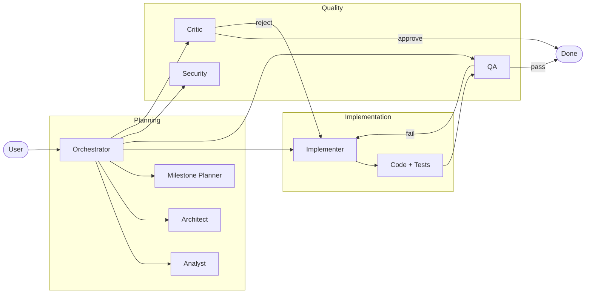

# AI Agent System

> A coordinated multi-agent framework for AI-powered software development workflows.

[](https://deepwiki.com/rjmurillo/ai-agents)


---

## TL;DR

1. **Install:** `/install-plugin rjmurillo/ai-agents` (Claude Code or GitHub Copilot CLI)
2. **Use:** Ask the orchestrator to coordinate tasks, or call agents directly by name
3. **Result:** 21 specialized agents handle research → planning → implementation → QA → deployment

```text
# Example: End-to-end feature development
> orchestrator: implement user authentication with OAuth2, including tests and security review
```

---

## Where to Start

| I want to... | Go to |
|--------------|-------|
| **Use the agents right now** | [Quick Install](#quick-install-recommended) → [Quick Start](#quick-start) |
| **Understand how it works** | [Key Concepts](#key-concepts) → [How Agents Work Together](#how-agents-work-together) |
| **Contribute or modify agents** | [Developer Setup](#developer-setup) → [CONTRIBUTING.md](CONTRIBUTING.md) |
| **See all available agents** | [Agent Catalog](#agent-catalog) |
| **Troubleshoot issues** | [Troubleshooting](#troubleshooting) |

---

## Is This For You?

✅ **Good fit if:**

- You use Claude Code, GitHub Copilot CLI, or VS Code with Copilot
- You want structured, multi-step AI workflows with clear accountability
- You need audit trails and consistent output formats
- You prefer specialized agents over generic prompting

❌ **Not ideal if:**

- You prefer single-prompt interactions without agent orchestration
- You're not using one of the supported platforms (Claude Code, Copilot CLI, VS Code)
- You need real-time streaming responses for all interactions

---

## Table of Contents

- [AI Agent System](#ai-agent-system)
  - [TL;DR](#tldr)
  - [Where to Start](#where-to-start)
  - [Is This For You?](#is-this-for-you)
  - [Table of Contents](#table-of-contents)
  - [Purpose and Scope](#purpose-and-scope)
    - [What is AI Agents?](#what-is-ai-agents)
    - [Core Capabilities](#core-capabilities)
    - [Key Concepts](#key-concepts)
  - [Installation](#installation)
    - [Quick Install (Recommended)](#quick-install-recommended)
    - [Verify Installation](#verify-installation)
    - [Supported Platforms](#supported-platforms)
    - [Alternative: Install via skill-installer](#alternative-install-via-skill-installer)
  - [Quick Start](#quick-start)
    - [Examples](#examples)
      - [Simple Scenarios](#simple-scenarios)
      - [Advanced Scenarios](#advanced-scenarios)
  - [System Architecture](#system-architecture)
    - [How Agents Work Together](#how-agents-work-together)
    - [Agent Catalog](#agent-catalog)
    - [Directory Structure](#directory-structure)
  - [Troubleshooting](#troubleshooting)
  - [Contributing](#contributing)
    - [Developer Setup](#developer-setup)
    - [Agent Development](#agent-development)
  - [Documentation](#documentation)
  - [License](#license)

---

## Purpose and Scope

### What is AI Agents?

AI Agents is a coordinated multi-agent system for software development. It provides specialized AI agents that handle different phases of the development lifecycle, from research and planning through implementation and quality assurance.

The orchestrator is the hub of operations. Within it has logic from taking everything from a "vibe" or a "shower thought" and building out a fully functional spec with acceptance criteria and user stories, to taking a well defined idea as input and executing on it. There are 21 agents that cover the roles of software development, from vision and strategy, to architecture, implementation, and verification. Each role looks at something specific, like the critic that just looks to poke holes in other agents' (or your own) work, or DevOps that's concerned about how you deploy and operate the thing you just built.

The agents themselves use the platform specific handoffs to invoke subagents, keeping the orchestrator context clean. A great example of this is orchestrator facilitating creating and debating an [Architectural Decision Record](https://adr.github.io/) from research and drafting, to discussion, iterating on the issues, tie breaking when agents don't agree. And then  extracting persistent knowledge to steer future agents to adhere. Artifacts are stored in your memory system if you have one enabled, and Markdown files for easy reference to both agents and humans.

### Core Capabilities

- **21 specialized agents** for different development phases (analysis, architecture, implementation, QA, etc.)
- **Explicit handoff protocols** between agents with clear accountability
- **Multi-Agent Impact Analysis Framework** for comprehensive planning
- **Cross-session memory** with citation verification, graph traversal, and health reporting via Serena + Forgetful
- **Self-improvement system** with skill tracking and retrospectives
- **Quality gates** with pre-PR validation, session protocol enforcement, and automated CI checks
- **50+ reusable skills** for common development workflows (git, PR management, testing, linting)
- **TUI-based installation** via [skill-installer](https://github.com/rjmurillo/skill-installer)
- **AI-powered CI/CD** with issue triage, PR quality gates, and spec validation

### Key Concepts

| Term | Definition |
|------|------------|
| **Agent** | A specialized AI persona with a defined role (analyst, implementer, security, etc.) |
| **Orchestrator** | The coordinating agent that routes tasks to specialists and synthesizes results |
| **Handoff** | Explicit transfer of context and control between agents with clear accountability |
| **Skill** | A reusable workflow component for common tasks (50+ included: git, PR, testing, linting) |
| **Memory** | Cross-session context persistence via Serena + Forgetful for knowledge retention |
| **ADR** | Architectural Decision Record—structured documents capturing design decisions |
| **Quality Gate** | Validation checkpoint (critic review, QA pass, security scan) before proceeding |

---

## Installation

> **Requirements:** Python 3.10+ and [UV](https://docs.astral.sh/uv/) package manager (for skill-installer method only). The `/install-plugin` method has no prerequisites.
>
> See [CONTRIBUTING.md](CONTRIBUTING.md#prerequisites) for full development setup including Python 3.12.x, pre-commit hooks, and test dependencies.

### Quick Install (Recommended)

The fastest way to get started is the CLI marketplace. Run the install command from within your AI coding tool.

**Claude Code** (in Claude Code CLI):

```text
/install-plugin rjmurillo/ai-agents
```

**GitHub Copilot CLI** (in Copilot CLI):

```text
/install-plugin rjmurillo/ai-agents
```

This installs the full agent set for your platform. You can also install individual components:

| Component | Install Command | What You Get |
|-----------|----------------|--------------|
| Claude agents only | `/plugin install claude-agents@ai-agents` | 26 specialized agents for Claude Code |
| Copilot CLI agents only | `/plugin install copilot-cli-agents@ai-agents` | Agent definitions for Copilot CLI |
| Full project toolkit | `/plugin install project-toolkit@ai-agents` | Agents, skills, hooks, and commands |

### Verify Installation

After installing, confirm the agents are loaded.

**Claude Code:**

```text
Task(subagent_type="analyst", prompt="Hello, are you available?")
```

**GitHub Copilot CLI:**

```bash
copilot --list-agents
```

**VS Code (Copilot Chat):**

```text
@orchestrator Hello, are you available?
```

### Supported Platforms

| Platform | Agent Location | Usage |
|----------|---------------|-------|
| **Claude Code CLI** | `src/claude/` | Use `Task(subagent_type="...")` |
| **GitHub Copilot CLI** | `src/copilot-cli/` | Use `--agent` flag, `/agent` to select, or call out agent by name |
| **VS Code / GitHub Copilot** | `src/vs-code-agents/` | Use `@agent` syntax in Copilot Chat |

### Alternative: Install via skill-installer

For a TUI-based interactive installation experience, use [skill-installer](https://github.com/rjmurillo/skill-installer).

**Prerequisites:** Python 3.10+ and [UV](https://docs.astral.sh/uv/) package manager.

```bash
# Run without installing (one-liner)
uvx --from git+https://github.com/rjmurillo/skill-installer skill-installer interactive

# Or install globally for repeated use
uv tool install git+https://github.com/rjmurillo/skill-installer
skill-installer interactive
```

Navigate the TUI to browse and install agents for your platform.

See [docs/installation.md](docs/installation.md) for complete installation documentation, including UV setup, platform-specific paths, troubleshooting, and post-installation steps.

---

## Quick Start

After installing the agents with the method of your choice, you can either select one of them explicitly, ask your LLM to use the agent by name, or even prefix your input with the name of the agent.

### Examples

Here are prompts you can copy and paste. Prefix with the agent name to route directly, or use the orchestrator for multi-step workflows.

#### Simple Scenarios

Review code quality:

> critic: review @src/auth/login-handler.ts for coupling, error handling gaps, and test coverage. Deliver an APPROVE or REJECT verdict with specific line references.

Shows the critic agent doing a focused code review.

Investigate a bug:

> analyst: the /api/users endpoint returns 500 when the email contains a plus sign. Trace the request through the handler, identify the root cause, and propose a fix.

Shows the analyst doing root cause analysis on a specific bug.

Scan for vulnerabilities:

> security: scan @src/api/ for OWASP Top 10 vulnerabilities. Focus on injection, broken auth, and data exposure. Output a threat matrix with CWE identifiers and severity ratings.

Shows the security agent doing a targeted scan.

Write tests for existing code:

> qa: write pytest tests for @scripts/validate_session_json.py. Cover happy path, malformed input, missing required fields, and boundary conditions. Target 95% line coverage.

Shows the QA agent generating tests with specific coverage targets.

Document a module:

> explainer: document @scripts/memory_enhancement/ as a user guide. Include purpose, installation, CLI usage with examples, and architecture overview. Write for developers who have never seen this codebase.

Shows the explainer creating developer documentation.

Plan a feature:

> milestone-planner: break down "add webhook retry with exponential backoff" into milestones. Include acceptance criteria, estimated complexity, dependencies, and a suggested implementation order.

Shows the planner creating structured work packages.

#### Advanced Scenarios

End-to-end feature pipeline:

> orchestrator: build the webhook retry system described in @.agents/specs/webhook-retry.md. Start with analyst to verify requirements. Then milestone-planner to create work packages. Run critic to stress-test the plan. Then implementer to write code and tests. Run qa to verify coverage meets acceptance criteria. Run security to scan for injection and replay risks. Fix all critical findings recursively until critic, qa, and security pass. Open a PR.

The orchestrator chains seven agents into a full development pipeline with quality gates at each stage.

Architecture review:

> orchestrator: conduct a full review of @docs/architecture/service-mesh.md. Route through analyst for data accuracy, architect for structural decisions, security for threat modeling with CWE/CVSS ratings, critic to stress-test for gaps, and independent-thinker to challenge assumptions. Synthesize all findings into a single summary highlighting consensus and disagreements.

Five agents examine the same artifact through different lenses. The orchestrator synthesizes their independent assessments.

Debug, fix, and ship:

> orchestrator: the payment webhook handler drops events when Redis is unavailable. Have analyst investigate the failure pattern in the logs. Then architect propose a resilient design with fallback queuing. Then implementer build the fix with tests. Run qa and security to validate. Open a PR when all checks pass.

Turns an incident report into a shipped fix through structured agent collaboration.

Technology migration evaluation:

> orchestrator: we are considering migrating from REST to gRPC for internal services. Route through analyst to research benchmarks and ecosystem maturity. Then architect to map impact on existing contracts. Then security to threat-model the new transport layer. Then devops to estimate CI/CD changes. Then independent-thinker to argue the strongest case for staying with REST. Then high-level-advisor to deliver a GO or NO-GO verdict with conditions.

Six agents build a decision package. Each contributes a different dimension of analysis. The advisor synthesizes everything into an actionable verdict.

Strategic prioritization:

> orchestrator: we have three candidate features for next quarter: plugin marketplace, offline mode, and admin audit logging. For each, run analyst for effort and risk, roadmap to score with RICE and KANO, security for compliance implications, and devops for operational burden. Then independent-thinker to argue which one we will most regret skipping. Then high-level-advisor to rank all three with a clear recommendation.

The orchestrator runs the same evaluation pipeline across all candidates, producing comparable data for a defensible quarterly plan.

---

## System Architecture

### How Agents Work Together

The orchestrator coordinates specialized agents through explicit handoffs. Each agent focuses on its domain, and the orchestrator synthesizes results.



**Typical flow:**

1. **User** describes a task to the **Orchestrator**
2. **Orchestrator** routes to **Analyst** for research and feasibility
3. **Architect** designs the solution; **Milestone Planner** breaks it into work packages
4. **Implementer** writes code and tests
5. **QA** and **Security** validate; **Critic** stress-tests the approach
6. On approval, work is complete; on failure, it loops back for fixes

### Agent Catalog

| Agent | Purpose | Output |
|-------|---------|--------|
| **orchestrator** | Task coordination and routing | Delegated results from specialists |
| **analyst** | Research, feasibility analysis, trade-off evaluation | Quantitative findings with evidence |
| **architect** | System design evaluation, ADRs, pattern enforcement | Rated assessments (Strong/Adequate/Needs-Work) |
| **milestone-planner** | Milestones and work packages | Implementation plans with acceptance criteria |
| **implementer** | Production code and tests | Code, tests, commits |
| **critic** | Plan stress-testing, gap identification | Verdicts: APPROVE / APPROVE WITH CONDITIONS / REJECT |
| **qa** | Test strategy and verification | Test reports, coverage analysis |
| **security** | Threat modeling, vulnerability assessment | Threat matrices with CWE/CVSS ratings |
| **devops** | CI/CD pipelines, operational planning | Infrastructure configs, maintenance estimates |
| **roadmap** | Strategic prioritization, RICE/KANO analysis | Priority stacks, cost-benefit analysis |
| **retrospective** | Learning extraction | Actionable insights, skill updates |
| **memory** | Cross-session context | Retrieved knowledge, stored observations |
| **skillbook** | Skill management | Atomic strategy updates |
| **explainer** | PRDs and documentation | Specs, user guides |
| **task-decomposer** | Atomic task breakdown | Estimable work items with done criteria |
| **backlog-generator** | Proactive task discovery | Sized tasks from project state analysis |
| **high-level-advisor** | Strategic decisions, unblocking | Verdicts: GO / CONDITIONAL GO / NO-GO |
| **independent-thinker** | Challenge assumptions, devil's advocate | Counter-arguments with alternatives |
| **pr-comment-responder** | PR review handling | Triaged responses, resolution tracking |
| **spec-generator** | Requirement specifications, EARS format | Structured specs with acceptance criteria |
| **debug** | Debugging assistance, root cause analysis | Diagnostic findings with resolution steps |
| **backlog-generator** | Proactive task discovery when idle | Discovered tasks for backlog |
| **janitor** | Code and documentation cleanup | Refactoring and cleanup suggestions |

See [AGENTS.md](AGENTS.md) for detailed agent documentation.

### Directory Structure

```text
ai-agents/
├── src/
│   ├── vs-code-agents/      # VS Code / GitHub Copilot agents
│   ├── copilot-cli/         # GitHub Copilot CLI agents
│   └── claude/              # Claude Code CLI agents
├── templates/               # Agent template system
├── scripts/                 # Validation and utility scripts
├── docs/                    # Documentation
├── .agents/                 # Agent artifacts (ADRs, plans, etc.)
├── .claude-plugin/          # skill-installer manifest
├── .github/copilot-instructions.md  # GitHub Copilot instructions
├── CLAUDE.md                        # Claude Code instructions
└── AGENTS.md                        # Detailed usage guide
```

---

## Troubleshooting

<details>
<summary><strong>Agent not responding or not found</strong></summary>

- **Restart your editor** after installation to reload agent definitions
- Verify installation with the [Verify Installation](#verify-installation) commands
- Check that you're using the correct syntax for your platform (`Task()` for Claude, `@agent` for VS Code)

</details>

<details>
<summary><strong><code>/install-plugin</code> command not recognized</strong></summary>

- Ensure you're running inside **Claude Code CLI** or **GitHub Copilot CLI**, not a regular terminal
- The command is built into the AI tool, not your shell
- Alternative: Use the [skill-installer method](#alternative-install-via-skill-installer)

</details>

<details>
<summary><strong>Python version errors when running tests</strong></summary>

- This project requires **Python 3.12.x** for development (not 3.13+)
- Use `pyenv` to manage Python versions: `pyenv install 3.12.8 && pyenv local 3.12.8`
- See [CONTRIBUTING.md](CONTRIBUTING.md#prerequisites) for detailed setup

</details>

<details>
<summary><strong>skill-installer TUI not launching</strong></summary>

- Ensure [UV](https://docs.astral.sh/uv/) is installed: `curl -LsSf https://astral.sh/uv/install.sh | sh`
- Try the direct uvx command: `uvx --from git+https://github.com/rjmurillo/skill-installer skill-installer interactive`
- Check Python version: requires 3.10+

</details>

<details>
<summary><strong>Orchestrator not routing to agents correctly</strong></summary>

- Be explicit: prefix prompts with the agent name (e.g., `analyst: ...`)
- Check that agents were installed for your specific platform
- Review [Quick Start examples](#examples) for correct syntax

</details>

---

## Contributing

See [CONTRIBUTING.md](CONTRIBUTING.md) for detailed contribution guidelines.

### Developer Setup

If you're contributing code or running tests locally:

1. Fork and clone the repository
2. Install Python dependencies:

   ```bash
   # Create virtual environment (optional but recommended)
   uv venv
   source .venv/bin/activate  # On Windows: .venv\Scripts\activate

   # Install project with dev dependencies
   uv pip install -e ".[dev]"
   ```

3. Set up environment variables (copy `.env.example` to `.env` and fill in your API keys)
4. Enable pre-commit hooks: `git config core.hooksPath .githooks`
5. Run tests to verify setup:

   ```bash
   python -m pytest tests/ -v
   ```

6. Make changes following the guidelines
7. Submit a pull request

### Agent Development

This project uses a **template-based generation system**. To modify agents:

1. Edit templates in `templates/agents/*.shared.md`
2. Run `python build/generate_agents.py` to regenerate
3. Commit both template and generated files

**Do not edit files in `src/vs-code-agents/` or `src/copilot-cli/` directly.** See [CONTRIBUTING.md](CONTRIBUTING.md) for details.

---

## Documentation

| Document | Description |
|----------|-------------|
| [docs/getting-started.md](docs/getting-started.md) | Step-by-step setup guide |
| [docs/agent-catalog.md](docs/agent-catalog.md) | All 21 agents with capabilities and examples |
| [docs/skill-reference.md](docs/skill-reference.md) | All 49 skills with usage descriptions |
| [docs/architecture.md](docs/architecture.md) | Plugin structure, template system, design decisions |
| [docs/customization.md](docs/customization.md) | How to extend and customize agents, skills, and hooks |
| [docs/installation.md](docs/installation.md) | Complete installation guide |
| [docs/project-structure.md](docs/project-structure.md) | Annotated repo layout (what to edit vs generated) |
| [AGENTS.md](AGENTS.md) | Comprehensive usage guide |
| [CONTRIBUTING.md](CONTRIBUTING.md) | Contribution guidelines and agent development |
| [CLAUDE.md](CLAUDE.md) | Claude Code integration |
| [copilot-instructions.md](.github/copilot-instructions.md) | GitHub Copilot integration |
| [docs/ideation-workflow.md](docs/ideation-workflow.md) | Ideation workflow documentation |
| [docs/markdown-linting.md](docs/markdown-linting.md) | Markdown standards |

---

## License

MIT
