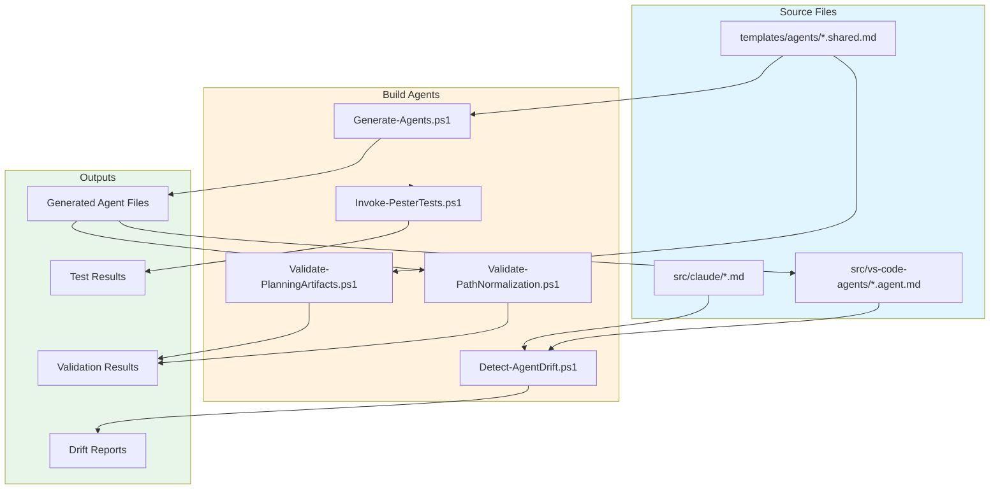
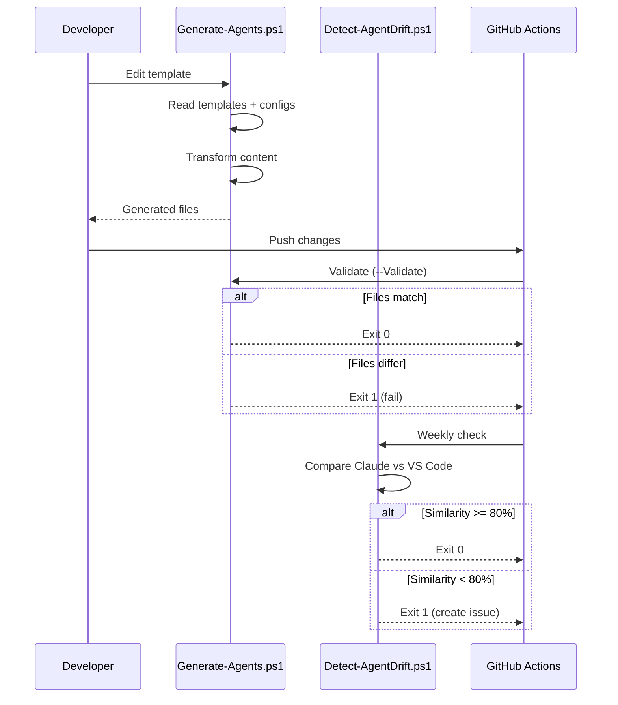

# Build System Agents

This document describes the automated actors in the build system that generate, validate, and monitor AI agent definitions.

## Overview

The `build/` directory contains scripts that automate agent generation, drift detection, and quality validation. These scripts ensure consistency across platforms and prevent regression.

## Architecture



## Critical Workflow Rules

### Rule 1: Always Regenerate After Template Changes

After modifying ANY file in `templates/`:

```powershell
# Regenerate platform-specific files
pwsh build/Generate-Agents.ps1

# Verify generation succeeded
pwsh build/Generate-Agents.ps1 -Validate

# Commit ALL affected files together
git add templates/ src/vs-code-agents/ src/copilot-cli/
git commit -m "feat(agents): update template and regenerate"
```

### Rule 2: Claude-to-Template Synchronization

When `src/claude/` agents receive **universal changes**:

```text
1. Edit src/claude/{agent}.md (Claude-specific source)
2. Duplicate changes to templates/agents/{agent}.shared.md
3. Run: pwsh build/Generate-Agents.ps1
4. Commit all files atomically
```

See: [src/claude/AGENTS.md](../src/claude/AGENTS.md) for full rules.

### Rule 3: Never Edit Generated Files

Files in `src/vs-code-agents/` and `src/copilot-cli/` are **generated**:

```text
WRONG: Edit src/vs-code-agents/analyst.agent.md
RIGHT: Edit templates/agents/analyst.shared.md, then regenerate
```

### Rule 4: CI Validation

Two automated checks enforce these rules:

| Workflow | Purpose | Failure Action |
|----------|---------|----------------|
| `validate-generated-agents.yml` | Verify generated files match templates | Must regenerate |
| `drift-detection.yml` | Check Claude/VS Code consistency | Review and sync |

---

## Agent Catalog

### Generate-Agents.ps1

**Role**: Platform-specific agent file generator

| Attribute | Value |
|-----------|-------|
| **Input** | `templates/agents/*.shared.md`, `templates/platforms/*.yaml` |
| **Output** | `src/vs-code-agents/*.agent.md`, `src/copilot-cli/*.agent.md` |
| **Trigger** | Manual, CI validation |
| **Dependencies** | `Generate-Agents.Common.psm1`, PowerShell 7.5.4+ |

**Transformations Applied**:

- YAML frontmatter generation (model, name, tools)
- Handoff syntax transformation (`#runSubagent` vs `/agent`)
- Platform-specific tool array selection

**Invocation**:

```powershell
# Generate all agents
pwsh build/Generate-Agents.ps1

# Preview changes (dry run)
pwsh build/Generate-Agents.ps1 -WhatIf

# CI validation mode
pwsh build/Generate-Agents.ps1 -Validate
```

**Exit Codes**:

| Code | Meaning |
|------|---------|
| 0 | Success |
| 1 | Generation failed or validation mismatch |

---

### Detect-AgentDrift.ps1

**Role**: Semantic drift detector between Claude and generated agents

| Attribute | Value |
|-----------|-------|
| **Input** | `src/claude/*.md`, `src/vs-code-agents/*.agent.md` |
| **Output** | Drift report (Text, JSON, or Markdown) |
| **Trigger** | Weekly CI, manual |
| **Dependencies** | PowerShell 7.5.4+ |

**What It Compares** (ignoring platform-specific differences):

- Core Identity / Core Mission sections
- Key Responsibilities
- Constraints
- Review criteria / checklists
- Templates and output formats

**What It Ignores**:

- YAML frontmatter format differences
- Tool invocation syntax (`mcp__*` vs path notation)
- Claude Code Tools section
- Platform-specific tool references

**Invocation**:

```powershell
# Default check (80% similarity threshold)
pwsh build/scripts/Detect-AgentDrift.ps1

# Strict threshold
pwsh build/scripts/Detect-AgentDrift.ps1 -SimilarityThreshold 90

# JSON output for tooling
pwsh build/scripts/Detect-AgentDrift.ps1 -OutputFormat JSON

# Markdown report
pwsh build/scripts/Detect-AgentDrift.ps1 -OutputFormat Markdown
```

**Exit Codes**:

| Code | Meaning |
|------|---------|
| 0 | No significant drift |
| 1 | Drift detected (below threshold) |
| 2 | Execution error |

---

### Validate-PlanningArtifacts.ps1

**Role**: Planning document consistency validator

| Attribute | Value |
|-----------|-------|
| **Input** | `.agents/planning/*.md` |
| **Output** | Validation report |
| **Trigger** | CI on planning changes, manual |
| **Dependencies** | PowerShell 7.5.4+ |

**Validations Performed**:

| Check | Description |
|-------|-------------|
| Effort estimate divergence | Compares epic/PRD estimates with task breakdown totals |
| Orphan conditions | Specialist conditions without task assignments |
| Missing task coverage | PRD requirements without corresponding tasks |

**Invocation**:

```powershell
# Validate specific feature
pwsh build/scripts/Validate-PlanningArtifacts.ps1 -FeatureName "agent-consolidation"

# CI mode (exit on error)
pwsh build/scripts/Validate-PlanningArtifacts.ps1 -FailOnError

# Strict mode (warnings as errors)
pwsh build/scripts/Validate-PlanningArtifacts.ps1 -FailOnWarning
```

---

### Validate-PathNormalization.ps1

**Role**: Path format validator for documentation

| Attribute | Value |
|-----------|-------|
| **Input** | `**/*.md` (documentation files) |
| **Output** | Path validation report |
| **Trigger** | CI on PR, manual |
| **Dependencies** | PowerShell 7.5.4+ |

**Forbidden Patterns**:

| Pattern | Reason |
|---------|--------|
| `[A-Z]:\` | Windows absolute paths |
| `/Users/` | macOS home paths |
| `/home/` | Linux home paths |

**Invocation**:

```powershell
pwsh build/scripts/Validate-PathNormalization.ps1
```

---

### Invoke-PesterTests.ps1

**Role**: Reusable Pester test runner

| Attribute | Value |
|-----------|-------|
| **Input** | Test files (`**/*.Tests.ps1`) |
| **Output** | Test results (XML, console) |
| **Trigger** | CI, pre-commit, manual |
| **Dependencies** | Pester 5.7.1+, PowerShell 7.5.4+ |

**Invocation**:

```powershell
# Local development (detailed output)
pwsh build/scripts/Invoke-PesterTests.ps1

# CI mode (exit on failure)
pwsh build/scripts/Invoke-PesterTests.ps1 -CI

# Specific test file
pwsh build/scripts/Invoke-PesterTests.ps1 -TestPath "./scripts/tests/Install-Common.Tests.ps1"

# Maximum verbosity
pwsh build/scripts/Invoke-PesterTests.ps1 -Verbosity Diagnostic
```

---

## Data Flow



## Error Handling

| Agent | Error Scenario | Behavior |
|-------|---------------|----------|
| Generate-Agents.ps1 | Missing template | Exit 1 with path info |
| Generate-Agents.ps1 | Invalid YAML | Parse error with line number |
| Detect-AgentDrift.ps1 | Missing agent | Report as "NO COUNTERPART" |
| Validate-PlanningArtifacts.ps1 | Missing artifacts | Warning (not error) |
| Invoke-PesterTests.ps1 | Test failure | Report details, exit 1 in CI |

## Security Considerations

| Agent | Security Control |
|-------|-----------------|
| Generate-Agents.ps1 | Output path validation (no traversal) |
| All scripts | No external input (static file sources) |
| All scripts | No network access required |
| All scripts | Code review required for changes |

## Monitoring

| Agent | CI Workflow | Schedule |
|-------|------------|----------|
| Generate-Agents.ps1 | `validate-generated-agents.yml` | On PR |
| Detect-AgentDrift.ps1 | `drift-detection.yml` | Monday 9 AM UTC |
| Validate-PlanningArtifacts.ps1 | `validate-planning-artifacts.yml` | On PR |
| Validate-PathNormalization.ps1 | `validate-paths.yml` | On PR |
| Invoke-PesterTests.ps1 | `pester-tests.yml` | On PR |

## Related Documentation

- [templates/AGENTS.md](../templates/AGENTS.md) - Template system agents
- [templates/README.md](../templates/README.md) - Template usage guide
- [.github/AGENTS.md](../.github/AGENTS.md) - GitHub Actions agents
