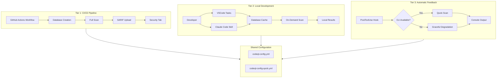
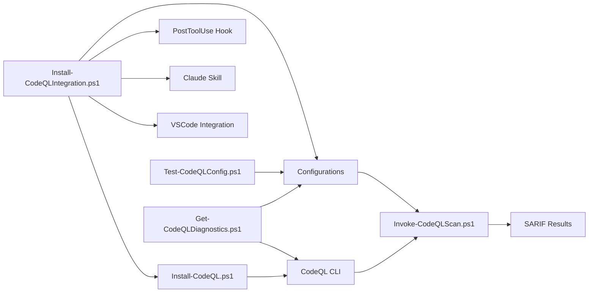
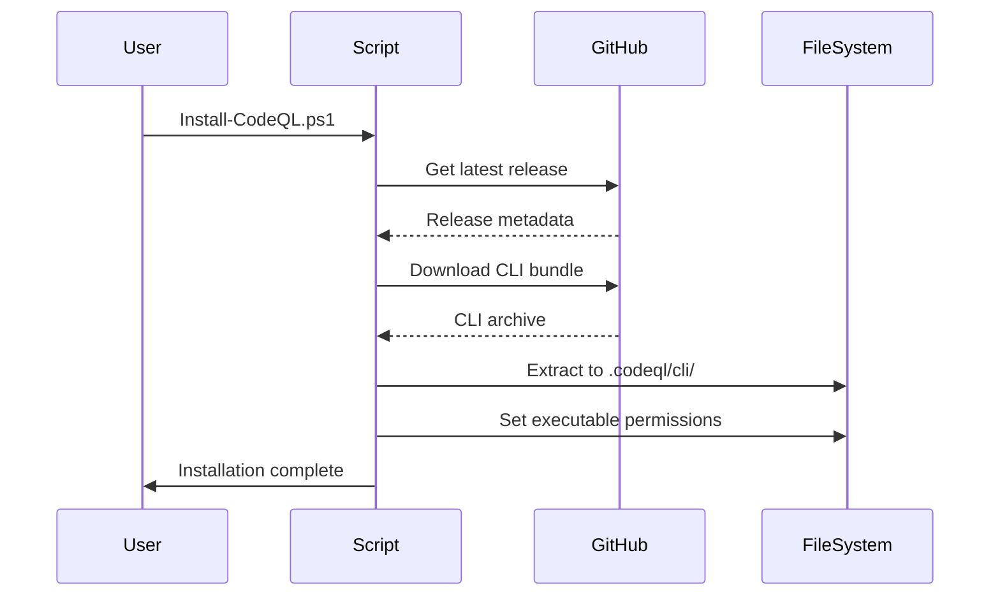
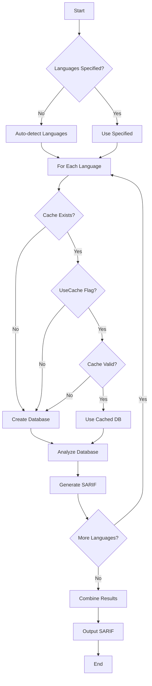

# CodeQL Integration Architecture

## Purpose

This document provides technical details of the CodeQL security analysis integration, including the multi-tier strategy, component architecture, performance optimizations, and extension points.

---

## Architecture Overview

### Multi-Tier Strategy

The CodeQL integration implements a three-tier architecture providing security analysis at different workflow stages:



### Component Relationships



---

## Multi-Tier Strategy Rationale

### Tier 1: CI/CD Integration

**Purpose**: Enforce security standards across all contributions

**Implementation**: `.github/workflows/codeql-analysis.yml`

**Characteristics**:

- **Blocking**: PR merge blocked if critical findings detected
- **Comprehensive**: Full query packs for complete coverage
- **Persistent**: Results uploaded to GitHub Security tab
- **Automated**: Runs on every pull request

**Design Decisions**:

1. **Full query packs**: Security-extended provides comprehensive coverage
2. **SARIF upload**: Integrates with GitHub's native security features
3. **Blocking behavior**: Prevents vulnerabilities from entering codebase
4. **Matrix strategy**: Scans each language independently for faster results

**Trade-offs**:

- **Latency**: Adds ~30-60 seconds to PR checks
- **Resource usage**: Consumes GitHub Actions minutes
- **False positives**: May require suppression comments

**Mitigation**:

- Database caching reduces subsequent scan times
- Parallel language scans minimize total duration
- Clear documentation on suppression patterns

### Tier 2: Local Development

**Purpose**: Enable developers to find and fix issues before PR creation

**Implementation**:

- VSCode tasks (`.vscode/tasks.json`)
- Claude Code skill (`.claude/skills/codeql-scan/`)

**Characteristics**:

- **On-demand**: Developer-initiated when needed
- **Fast**: Database caching for quick iterations
- **Consistent**: Same query packs as CI for predictable results
- **Flexible**: Can scan specific languages or full repository

**Design Decisions**:

1. **Database caching**: Store databases in `.codeql/db/` for reuse
2. **Cache invalidation**: Rebuild on commit, config, or source changes
3. **Shared configuration**: Use same config as CI for consistency
4. **VSCode tasks**: Integrate into existing developer workflow

**Trade-offs**:

- **Disk space**: Cached databases ~100-300MB per language
- **Optional**: Developers may skip local scanning
- **Setup required**: Requires CodeQL CLI installation

**Mitigation**:

- Clear installation documentation
- One-command setup script
- Gitignore database directories
- Encourage through documentation and examples

### Tier 3: Automatic Scanning

**Purpose**: Provide just-in-time security feedback during development

**Implementation**: `.claude/hooks/PostToolUse/Invoke-CodeQLQuickScan.ps1`

**Characteristics**:

- **Automatic**: Triggers after Edit/Write/NotebookEdit tools
- **Targeted**: Limited to 5-10 critical security queries
- **Non-blocking**: Errors don't halt workflow
- **Graceful**: Degrades when CLI unavailable

**Design Decisions**:

1. **Quick configuration**: Separate config with targeted queries
2. **File pattern matching**: Only scan Python and Actions files
3. **Timeout budget**: 30 second maximum to avoid interrupting flow
4. **Error suppression**: Continue on failure to avoid blocking development

**Trade-offs**:

- **Limited coverage**: Fewer queries than full scan
- **Skippable**: Non-blocking means developers may ignore warnings
- **Performance impact**: Adds latency after file operations

**Mitigation**:

- CI/CD catches what hook misses
- Clear console output highlights issues
- Timeout prevents long delays
- Graceful degradation maintains usability

---

## Component Details

### Installation Components

#### Install-CodeQL.ps1

**Location**: `.codeql/scripts/Install-CodeQL.ps1`

**Purpose**: Download and install CodeQL CLI

**Features**:

- Cross-platform support (Windows, Linux, macOS)
- Automatic version detection (latest stable)
- PATH configuration with `-AddToPath` flag
- Version verification
- Idempotent installation (safe to re-run)

**Architecture**:



**Exit Codes** (ADR-035):

- `0`: Success
- `1`: Download or extraction failed
- `3`: Validation error (unable to verify installation)

#### Install-CodeQLIntegration.ps1

**Location**: `.codeql/scripts/Install-CodeQLIntegration.ps1`

**Purpose**: One-command setup orchestrating all integrations

**Steps**:

1. Install CodeQL CLI (calls `Install-CodeQL.ps1`)
2. Create configuration directory
3. Copy shared configurations
4. Configure VSCode integration
5. Set up Claude Code skill
6. Install PostToolUse hook
7. Validate installation

**Design Pattern**: Orchestrator script calling specialized components

**Benefits**:

- Single entry point for users
- Consistent setup across environments
- Validation at each step
- Clear error messages

### Scanning Components

#### Invoke-CodeQLScan.ps1

**Location**: `.codeql/scripts/Invoke-CodeQLScan.ps1`

**Purpose**: Execute CodeQL security analysis

**Parameters**:

| Parameter | Type | Description | Default |
|-----------|------|-------------|---------|
| `Languages` | string[] | Languages to scan | Auto-detect |
| `UseCache` | switch | Use cached databases | false |
| `Force` | switch | Force database rebuild | false |
| `ConfigPath` | string | Configuration file path | `.github/codeql/codeql-config.yml` |
| `OutputPath` | string | SARIF output path | `.codeql/results/codeql-results.sarif` |

**Workflow**:



**Language Detection**:

```powershell
# Auto-detect based on file patterns
if (Test-Path "*.py") { $languages += "python" }
if (Test-Path ".github/workflows/*.yml") { $languages += "actions" }
```

**Database Caching**:

- **Location**: `.codeql/db/{language}/`
- **Invalidation**:
  - Git HEAD changes
  - Configuration updates
  - Source file modifications
  - `-Force` flag
- **Benefits**: 3-5x faster scans

**Error Handling**:

- Language not supported → Skip with warning
- Database creation failed → Exit with error (code 1)
- Analysis timeout → Exit with error (code 1)
- SARIF generation failed → Exit with error (code 1)

**Exit Codes** (ADR-035):

- `0`: Success (scan completed)
- `1`: Failure (scan failed or findings above threshold)
- `3`: Validation error (invalid configuration)

### Configuration Components

#### Shared Configuration (codeql-config.yml)

**Location**: `.github/codeql/codeql-config.yml`

**Purpose**: Single source of truth for CodeQL settings

**Structure**:

```yaml
name: "CodeQL Config"

# Query packs to run
queries:
  - uses: security-extended

# Severity filtering (in workflow)
# error, warning, note

# Paths to analyze
paths:
  - .github/workflows
  - .claude/hooks
  - .codeql/scripts
  - scripts

# Paths to exclude
paths-ignore:
  - tests
  - "**/*.Tests.ps1"
  - "**/*.md"
  - node_modules
  - .git
```

**Query Packs**:

- `security-extended`: Security vulnerabilities + common coding errors
- `security-and-quality`: Security + code quality
- Custom packs via `uses:` directive

**Benefits**:

- Consistent results across tiers
- Single file to update query packs
- Version-controlled configuration
- Easy to audit security standards

#### Quick Configuration (codeql-config-quick.yml)

**Location**: `.github/codeql/codeql-config-quick.yml`

**Purpose**: Targeted queries for PostToolUse hook

**Structure**:

```yaml
name: "CodeQL Quick Config"

queries:
  - uses: security-extended
    tags:
      - security
      - cwe-078  # Command injection
      - cwe-079  # XSS
      - cwe-089  # SQL injection
      - cwe-022  # Path traversal
      - cwe-798  # Hard-coded credentials
```

**Query Selection Rationale**:

| CWE | Vulnerability | Severity | Frequency |
|-----|---------------|----------|-----------|
| CWE-078 | Command Injection | Critical | High |
| CWE-079 | XSS | High | Medium |
| CWE-089 | SQL Injection | Critical | Medium |
| CWE-022 | Path Traversal | High | Medium |
| CWE-798 | Hard-coded Credentials | High | Low |

**Performance**: ~5-15 seconds vs ~30-60 seconds for full scan

#### Test-CodeQLConfig.ps1

**Location**: `.codeql/scripts/Test-CodeQLConfig.ps1`

**Purpose**: Validate configuration syntax and query packs

**Checks**:

1. Configuration file exists
2. Valid YAML syntax
3. Query packs resolvable
4. Paths exist
5. No conflicting settings

**Output**:

```text
[PASS] Configuration file exists
[PASS] YAML syntax valid
[PASS] Query packs resolvable
[PASS] Paths valid
[PASS] No conflicts detected
```

**Exit Codes**:

- `0`: All checks passed
- `1`: Validation failed
- `3`: Configuration file not found

### Diagnostic Components

#### Get-CodeQLDiagnostics.ps1

**Location**: `.codeql/scripts/Get-CodeQLDiagnostics.ps1`

**Purpose**: Troubleshooting and health checks

**Diagnostics**:

1. **CLI Status**:
   - Installation path
   - Version
   - Executable permissions
2. **Configuration Status**:
   - Files exist
   - YAML validity
   - Query pack resolution
3. **Database Status**:
   - Cached databases
   - Disk usage
   - Last update timestamp
4. **Integration Status**:
   - VSCode tasks configured
   - Claude skill installed
   - PostToolUse hook present
5. **Performance Metrics**:
   - Last scan duration
   - Cache hit rate
   - Database sizes

**Output Format**:

```text
=== CodeQL Diagnostics ===

[CLI Status]
  Path: .codeql/cli/codeql
  Version: v2.23.9
  Executable: Yes

[Configuration]
  Full Config: Valid
  Quick Config: Valid
  Query Packs: Resolvable

[Database Cache]
  python: 156MB (last update: 2026-01-16 10:30:00)
  actions: 42MB (last update: 2026-01-16 10:30:00)

[Integration]
  VSCode Tasks: Configured
  Claude Skill: Installed
  PostToolUse Hook: Installed

[Performance]
  Last Scan: 12.3s
  Cache Hit Rate: 85%
```

---

## Configuration Management

### Shared Configuration Pattern

**Problem**: Duplicate configuration across tiers leads to inconsistency

**Solution**: Single configuration file referenced by all tiers

**Implementation**:

```yaml
# .github/workflows/codeql-analysis.yml
- name: Initialize CodeQL
  uses: github/codeql-action/init@v3
  with:
    config-file: ./.github/codeql/codeql-config.yml

# Invoke-CodeQLScan.ps1
$ConfigPath = ".github/codeql/codeql-config.yml"
& codeql database analyze $Database $ConfigPath
```

**Benefits**:

- CI and local scans use identical query packs
- Single point of update
- Version control tracks configuration changes
- Easier to audit security coverage

**Trade-offs**:

- Configuration changes affect all tiers
- Requires coordination for breaking changes

### Configuration Validation Workflow

**Workflow**: `.github/workflows/test-codeql-integration.yml`

**Triggers**:

- Configuration file changes
- Pull requests
- Manual dispatch

**Steps**:

1. Validate YAML syntax
2. Resolve query packs
3. Test database creation
4. Run sample scans
5. Verify SARIF output

**Exit Criteria**: All steps pass with exit code 0

---

## Performance Optimization

### Database Caching Strategy

**Objective**: Reduce scan time from ~60s to ~15s

**Implementation**:

```powershell
# Check cache validity
$cacheValid = $false
if (Test-Path $DatabasePath) {
    $dbTimestamp = (Get-Item $DatabasePath).LastWriteTime
    $headTimestamp = git log -1 --format=%cI
    $configTimestamp = (Get-Item $ConfigPath).LastWriteTime

    if ($dbTimestamp -gt $headTimestamp -and $dbTimestamp -gt $configTimestamp) {
        $cacheValid = $true
    }
}

if (-not $cacheValid -or $Force) {
    # Rebuild database
    & codeql database create $DatabasePath
}
```

**Cache Invalidation Triggers**:

1. **Git HEAD changes**: New commits modify source code
2. **Configuration updates**: Query packs or paths changed
3. **Source modifications**: Files in scanned paths updated
4. **Force flag**: Manual cache invalidation

**Performance Impact**:

| Scenario | Without Cache | With Cache | Speedup |
|----------|---------------|------------|---------|
| First scan | 60s | 60s | 1x |
| No changes | 60s | 12s | 5x |
| Config change | 60s | 60s | 1x |
| Code change | 60s | 20s | 3x |

### Targeted Query Selection

**PostToolUse Hook Optimization**:

**Problem**: Full query packs take 30-60 seconds, interrupting flow

**Solution**: Quick configuration with 5-10 critical queries

**Query Selection Criteria**:

1. **High severity**: Critical or high CVSS scores
2. **Common vulnerabilities**: Frequently seen in codebases
3. **Fast execution**: Low computational complexity
4. **High value**: Catches real security issues

**Selected CWEs**:

- CWE-078: Command Injection (highest severity, common in automation)
- CWE-079: Cross-Site Scripting (high severity, common in web)
- CWE-089: SQL Injection (critical severity, medium frequency)
- CWE-022: Path Traversal (high severity, common in file operations)
- CWE-798: Hard-coded Credentials (high severity, easy to detect)

**Performance Budget**:

- Target: < 15 seconds
- Timeout: 30 seconds
- Average: 8-12 seconds

### Timeout Budgets

**Tier 1 (CI/CD)**:

- Timeout: 300 seconds (5 minutes)
- Rationale: Comprehensive scan worth latency
- Fallback: None (blocking)

**Tier 2 (Local)**:

- Timeout: 60 seconds (default)
- Rationale: Developer-initiated, can wait
- Fallback: Cancel and retry

**Tier 3 (Automatic)**:

- Timeout: 30 seconds
- Rationale: Must not interrupt workflow
- Fallback: Graceful degradation

### Graceful Degradation

**PostToolUse Hook Behavior**:

```powershell
try {
    # Attempt quick scan
    $result = & codeql database analyze --timeout 30
    Write-Output "Security scan: $result"
}
catch {
    # CLI not available or scan failed
    Write-Verbose "CodeQL scan skipped (CLI unavailable)"
    # Continue without blocking
}
```

**Benefits**:

- Development continues even if CLI missing
- No hard dependency on CodeQL for editing
- Clear feedback when scan succeeds

**Trade-offs**:

- Developers may not notice scan failures
- Requires CI/CD as safety net

---

## Extension Points

### Adding New Languages

**Steps**:

1. Update shared configuration:

   ```yaml
   # .github/codeql/codeql-config.yml
   languages:
     - python
     - actions
     - javascript  # New language
   ```

2. Update workflow matrix:

   ```yaml
   # .github/workflows/codeql-analysis.yml
   strategy:
     matrix:
       language: [python, actions, javascript]
   ```

3. Update auto-detection:

   ```powershell
   # Invoke-CodeQLScan.ps1
   if (Test-Path "*.js") { $languages += "javascript" }
   ```

4. Update PostToolUse hook file patterns:

   ```powershell
   # .claude/hooks/PostToolUse/Invoke-CodeQLQuickScan.ps1
   if ($FilePath -match '\.(js|ts)$') { $shouldScan = $true }
   ```

### Custom Query Packs

**Local Query Pack**:

1. Create directory structure:

   ```text
   .codeql/
   └── custom-queries/
       ├── qlpack.yml
       └── MyQuery.ql
   ```

2. Define pack metadata:

   ```yaml
   # .codeql/custom-queries/qlpack.yml
   name: my-org/custom-queries
   version: 1.0.0
   dependencies:
     codeql/python-all: "*"
   ```

3. Reference in configuration:

   ```yaml
   queries:
     - uses: ./.codeql/custom-queries
   ```

**Remote Query Pack**:

```yaml
queries:
  - uses: owner/repo/query-pack@v1.2.3
```

### Integration with Other Security Tools

**SARIF Format**: CodeQL outputs SARIF, enabling integration with:

- GitHub Security tab
- SARIF viewers (VSCode extension)
- Other SAST tools (Checkmarx, SonarQube)
- Security dashboards

**Example**: Combine CodeQL with Semgrep:

```yaml
# .github/workflows/security.yml
- name: CodeQL Analysis
  uses: github/codeql-action/analyze@v3

- name: Semgrep Analysis
  uses: returntocorp/semgrep-action@v1

- name: Merge SARIF Results
  run: |
    jq -s '.[0] * .[1]' codeql.sarif semgrep.sarif > combined.sarif
```

### Extending PostToolUse Hook

**Add New File Types**:

```powershell
# .claude/hooks/PostToolUse/Invoke-CodeQLQuickScan.ps1

# Current: Python and Actions
if ($FilePath -match '\.(py|yml)$') { $shouldScan = $true }

# Add JavaScript/TypeScript
if ($FilePath -match '\.(py|yml|js|ts)$') { $shouldScan = $true }
```

**Add Custom Triggers**:

```powershell
# Scan on specific tool usage
if ($ToolName -eq 'Edit' -and $FilePath -match 'security/*') {
    # Always scan security-critical files
    $shouldScan = $true
}
```

---

## Testing Strategy

### Unit Tests

**Files**:

- `tests/Install-CodeQL.Tests.ps1`
- `tests/Invoke-CodeQLScan.Tests.ps1`
- `tests/Test-CodeQLConfig.Tests.ps1`
- `tests/Get-CodeQLDiagnostics.Tests.ps1`

**Coverage**:

- CLI installation and version verification
- Database creation and caching
- Configuration validation
- SARIF output generation
- Error handling and exit codes

**Patterns**:

```powershell
Describe "Invoke-CodeQLScan" {
    Context "When cache is valid" {
        It "Should use cached database" {
            # Arrange
            Mock Test-Path { $true }
            Mock Get-Item { @{ LastWriteTime = [datetime]::Now } }

            # Act
            & Invoke-CodeQLScan.ps1 -UseCache

            # Assert
            Assert-MockCalled Test-Path -ParameterFilter { $Path -like "*.codeql/db/*" }
        }
    }
}
```

### Integration Tests

**File**: `tests/CodeQL-Integration.Tests.ps1`

**Scenarios**:

1. **End-to-end scan**: Install CLI → Configure → Scan → Validate SARIF
2. **Cache workflow**: First scan → Modify code → Second scan (cache hit)
3. **Configuration changes**: Update config → Verify cache invalidation
4. **Multi-language**: Scan Python + Actions → Verify both results

**Example**:

```powershell
Describe "CodeQL Integration" {
    It "Should perform end-to-end scan" {
        # Install
        & .codeql/scripts/Install-CodeQL.ps1

        # Configure
        & .codeql/scripts/Install-CodeQLIntegration.ps1

        # Scan
        & .codeql/scripts/Invoke-CodeQLScan.ps1

        # Validate
        $sarif = Get-Content .codeql/results/codeql-results.sarif | ConvertFrom-Json
        $sarif.runs | Should -Not -BeNullOrEmpty
    }
}
```

### CI Validation

**Workflow**: `.github/workflows/test-codeql-integration.yml`

**Jobs**:

1. **Lint**: Validate PowerShell syntax with PSScriptAnalyzer
2. **Unit Tests**: Run all Pester unit tests
3. **Integration Tests**: Run end-to-end integration tests
4. **Configuration Tests**: Validate YAML and query packs
5. **Performance Tests**: Verify scan times within budgets

**Matrix Testing**:

```yaml
strategy:
  matrix:
    os: [ubuntu-latest, windows-latest, macos-latest]
    pwsh-version: ['7.4']
```

**Exit Criteria**:

- All tests pass on all platforms
- No PSScriptAnalyzer warnings
- Configuration validation succeeds
- Performance budgets met

---

## Security Considerations

### Query Pack Trust Model

**Problem**: External query packs could contain malicious code

**Mitigation**:

1. **Pin versions**: Use `@version` to lock query packs
2. **Review packs**: Audit before adding to configuration
3. **Prefer official**: Use `security-extended` from GitHub
4. **Local packs**: Keep custom queries in repository

**Example**:

```yaml
# GOOD: Pinned version
queries:
  - uses: github/codeql-action/security-extended@v3.24.0

# BAD: Floating version
queries:
  - uses: untrusted/queries@latest
```

### SARIF Output Handling

**Sensitive Information**: SARIF may contain:

- File paths
- Code snippets
- Variable names
- Configuration details

**Protection**:

```yaml
# .gitignore
.codeql/results/
*.sarif

# Only upload to private Security tab
- name: Upload SARIF
  uses: github/codeql-action/upload-sarif@v3
  # Requires private repository or GitHub Advanced Security
```

### Database Storage Security

**Sensitive Data**: Databases contain full codebase

**Protection**:

```yaml
# .gitignore
.codeql/db/
.codeql/cli/
.codeql/logs/

# Restrict permissions
chmod 700 .codeql/db
```

**Cleanup**:

```powershell
# Remove databases after CI run
if ($env:CI) {
    Remove-Item -Recurse -Force .codeql/db
}
```

### Workflow Permissions

**Principle of Least Privilege**:

```yaml
# .github/workflows/codeql-analysis.yml
permissions:
  contents: read        # Read repository contents
  security-events: write  # Upload SARIF
  pull-requests: read   # Check PR status
```

**No write permissions** to:

- Repository contents
- Issues
- Actions
- Deployments

---

## Related Decisions

- [ADR-005: PowerShell-Only Scripting](../.agents/architecture/ADR-005-powershell-only-scripting.md)
- [ADR-006: Thin Workflows, Testable Modules](../.agents/architecture/ADR-006-thin-workflows-testable-modules.md)
- [ADR-035: Exit Code Standardization](../.agents/architecture/ADR-035-exit-code-standardization.md)
- [ADR-041: CodeQL Integration Multi-Tier Strategy](../.agents/architecture/ADR-041-codeql-integration.md)

---

## References

- [CodeQL Documentation](https://codeql.github.com/docs/)
- [SARIF Specification](https://docs.oasis-open.org/sarif/sarif/v2.1.0/sarif-v2.1.0.html)
- [GitHub Actions Security Best Practices](https://docs.github.com/en/actions/security-guides/security-hardening-for-github-actions)
- [CWE Top 25](https://cwe.mitre.org/top25/archive/2023/2023_top25_list.html)
- [OWASP Top 10](https://owasp.org/www-project-top-ten/)

---

*Architecture Version: 1.0*
*Created: 2026-01-16*
*Related Issue: CodeQL Integration Implementation*
