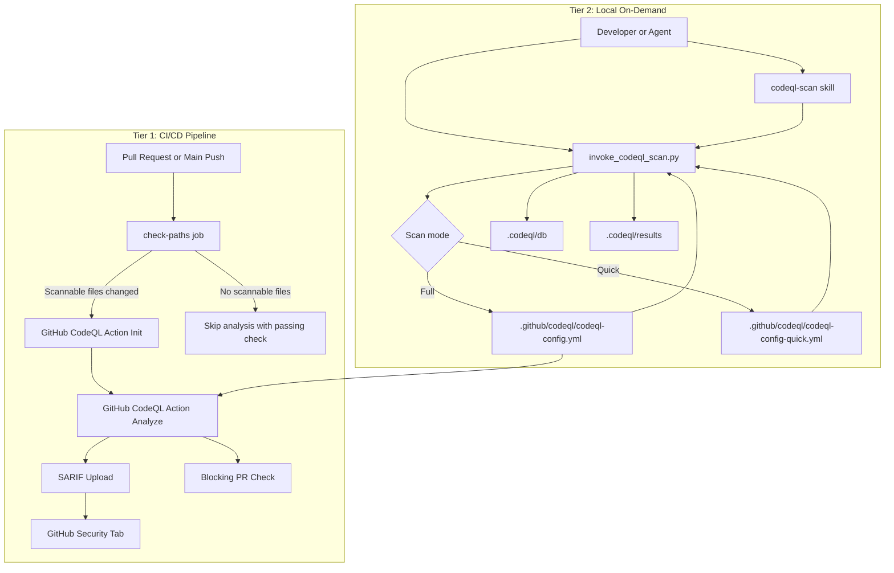
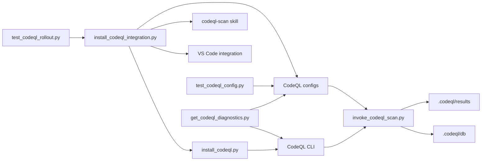
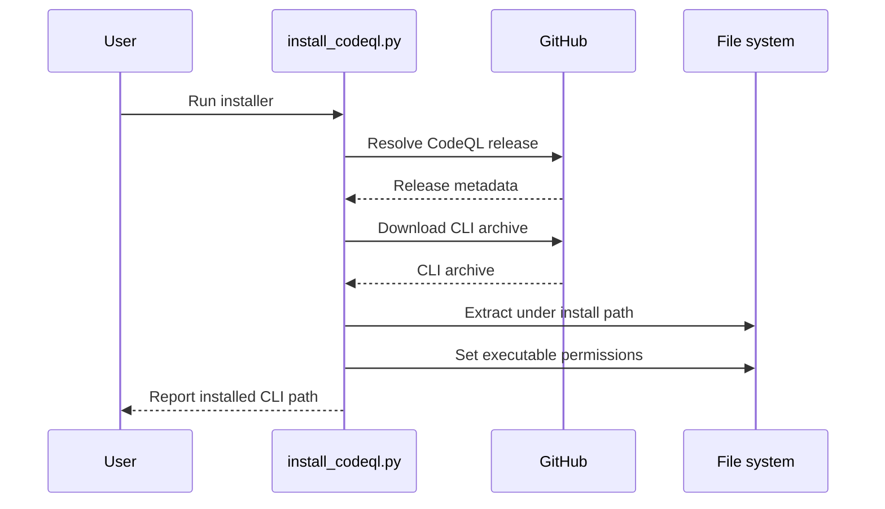
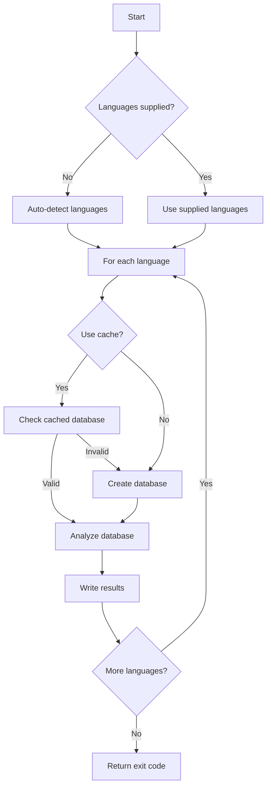
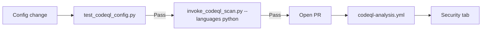
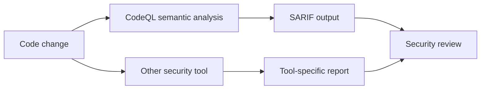

# CodeQL Integration Architecture

## Purpose

This document explains the current CodeQL security analysis architecture. The implementation is Python-first per ADR-042, and the operational strategy is two-tier per ADR-041 as amended on 2026-07-21.

The former automatic edit-time hook was retired on 2026-07-21. A portable rebuild for automatic edit-time scanning is deferred to issue #3219. Quick scans remain available on demand through `invoke_codeql_scan.py --quick-scan` and the `codeql-scan` skill.

---

## Architecture Overview

### Two-Tier Strategy

The CodeQL integration has two live tiers:


```mermaid
flowchart TB
    subgraph T1["Tier 1: CI/CD Pipeline"]
        PR[Pull Request or Main Push] --> Paths[check-paths job]
        Paths -->|Scannable files changed| Init[GitHub CodeQL Action Init]
        Paths -->|No scannable files| Skip[Skip analysis with passing check]
        Init --> Analyze[GitHub CodeQL Action Analyze]
        Analyze --> Sarif[SARIF Upload]
        Sarif --> Security[GitHub Security Tab]
        Analyze --> Gate[Blocking PR Check]
    end

    subgraph T2["Tier 2: Local On-Demand"]
        Dev[Developer or Agent] --> Skill[codeql-scan skill]
        Dev --> Script[invoke_codeql_scan.py]
        Skill --> Script
        Script --> ConfigChoice{Scan mode}
        ConfigChoice -->|Full| FullConfig[.github/codeql/codeql-config.yml]
        ConfigChoice -->|Quick| QuickConfig[.github/codeql/codeql-config-quick.yml]
        Script --> DB[.codeql/db]
        Script --> Results[.codeql/results]
    end

    FullConfig --> Analyze
    FullConfig --> Script
    QuickConfig --> Script
```

### Component Relationships


```mermaid
graph LR
    Installer[install_codeql.py] --> CLI[CodeQL CLI]
    Integration[install_codeql_integration.py] --> Installer
    Integration --> VSCode[VS Code integration]
    Integration --> Skill[codeql-scan skill]
    Integration --> Configs[CodeQL configs]

    CLI --> Scan[invoke_codeql_scan.py]
    Configs --> Scan
    Scan --> DB[.codeql/db]
    Scan --> SARIF[.codeql/results]

    ConfigTest[test_codeql_config.py] --> Configs
    Diagnostics[get_codeql_diagnostics.py] --> CLI
    Diagnostics --> Configs
    Rollout[test_codeql_rollout.py] --> Integration
```

---

## Two-Tier Strategy Rationale

### Tier 1: CI/CD Integration

**Purpose**: enforce repository security checks before code merges.

**Implementation**: `.github/workflows/codeql-analysis.yml`

**Characteristics**:

- Runs on every pull request to `main`, every push to `main`, a weekly Monday 09:00 UTC schedule, and manual dispatch.
- Uses GitHub's native CodeQL action.
- Uploads SARIF to the GitHub Security tab.
- Keeps a required check green on docs-only or non-scannable changes by running a skip path.
- Blocks PRs when the blocking issue check fails.

**Scannable paths** come from the workflow's `check-paths` job. That job is the source of truth for paths that trigger analysis.

**Language matrix in the checked-in workflow**:

- `actions`
- `python`

The workflow comments mention security coverage for repository automation. The actual matrix in `.github/workflows/codeql-analysis.yml` is the authority for what GitHub's CodeQL action runs today.

**Timeout budget**: 300 seconds for analysis work, based on the ADR-041 operating budget. The workflow job has a higher GitHub Actions guardrail because setup, artifact upload, and reporting also run in that job.

**Design decisions**:

1. Use GitHub's native CodeQL action for SARIF upload and Security tab integration.
2. Run the workflow on all PRs so required status checks are satisfied.
3. Use path filtering to skip analysis work when no scannable files changed.
4. Use security-extended query coverage with medium-or-higher filtering.

**Trade-offs**:

| Factor | Choice | Builder impact |
|--------|--------|----------------|
| Feedback timing | PR-time | Findings arrive later than local scans, but enforcement is reliable. |
| Runtime cost | GitHub Actions minutes | Path filtering cuts work on unrelated changes. |
| Source of truth | Native workflow | GitHub Security tab becomes the shared review surface. |

### Tier 2: Local On-Demand Scanning

**Purpose**: let developers and agents find security issues before opening a PR.

**Implementation**:

- `.claude/skills/codeql-scan/`
- `.codeql/scripts/invoke_codeql_scan.py`
- Optional VS Code integration installed by `.codeql/scripts/install_codeql_integration.py`

**Characteristics**:

- Developer-initiated.
- Uses the same full config as CI by default.
- Supports quick targeted scans through `--quick-scan`.
- Supports cached databases through `--use-cache`.
- Writes local databases to `.codeql/db` by default.
- Writes local results to `.codeql/results` by default.

**Timeout budget**: 60 seconds by default for on-demand local scans.

**Quick scan replacement for the retired hook**:

Quick feedback is now explicit, not automatic. Use this command when you want targeted queries during active development:

```bash
python3 .codeql/scripts/invoke_codeql_scan.py --quick-scan --use-cache
```

With the default config path, `--quick-scan` auto-switches to `.github/codeql/codeql-config-quick.yml`.

**Design decisions**:

1. Keep local scanning optional so developers are not blocked by missing local setup.
2. Use the Python script as the stable local entry point.
3. Keep quick scan demand-driven until issue #3219 rebuilds portable edit-time scanning.
4. Share config files under `.github/codeql/` so CI and local scans do not drift.

**Trade-offs**:

| Factor | Choice | Builder impact |
|--------|--------|----------------|
| Local setup | Required for local scans | CI still protects the repo if a developer skips setup. |
| Scan mode | Full or quick | Builders pick coverage or speed per task. |
| Cache | Optional with `--use-cache` | Faster iteration, with explicit cache use. |

### Retired Automatic Edit-Time Scanning

The automatic edit-time hook was retired on 2026-07-21 by the ADR-041 amendment. It was dead code because it was not registered in the active hook surfaces and only its own test imported it.

Do not add documentation, setup steps, troubleshooting, or extension guidance for that retired hook. If automatic edit-time scanning is needed, use issue #3219 as the design target. Until then, use Tier 2 quick scans explicitly.

---

## Component Details

### Installation Components

#### install_codeql.py

**Location**: `.codeql/scripts/install_codeql.py`

**Purpose**: download and install the CodeQL CLI.

**Command line**:

```bash
python3 .codeql/scripts/install_codeql.py --version VERSION --install-path INSTALL_PATH --force --add-to-path --ci
```

**Flags**:

| Flag | Purpose |
|------|---------|
| `--version VERSION` | Install a specific CodeQL CLI version. |
| `--install-path INSTALL_PATH` | Install under a specific directory. |
| `--force` | Overwrite an existing installation. |
| `--add-to-path` | Add the CodeQL CLI to PATH. |
| `--ci` | Use non-interactive CI behavior. |

**Architecture**:


```mermaid
sequenceDiagram
    participant User
    participant Script as install_codeql.py
    participant GitHub
    participant FS as File system

    User->>Script: Run installer
    Script->>GitHub: Resolve CodeQL release
    GitHub-->>Script: Release metadata
    Script->>GitHub: Download CLI archive
    GitHub-->>Script: CLI archive
    Script->>FS: Extract under install path
    Script->>FS: Set executable permissions
    Script-->>User: Report installed CLI path
```

#### install_codeql_integration.py

**Location**: `.codeql/scripts/install_codeql_integration.py`

**Purpose**: install CodeQL integration components.

**Command line**:

```bash
python3 .codeql/scripts/install_codeql_integration.py --skip-cli --skip-vscode --skip-claude-skill --skip-pre-commit --ci
```

**Flags**:

| Flag | Purpose |
|------|---------|
| `--skip-cli` | Do not install the CodeQL CLI. |
| `--skip-vscode` | Do not create VS Code configuration files. |
| `--skip-claude-skill` | Do not install the Claude Code skill. |
| `--skip-pre-commit` | Do not verify pre-commit integration. |
| `--ci` | Use non-interactive CI behavior. |

**Design pattern**: orchestrator script. It calls focused setup steps and validates the result.

### Scanning Component

#### invoke_codeql_scan.py

**Location**: `.codeql/scripts/invoke_codeql_scan.py`

**Purpose**: run CodeQL security scans on the repository.

**Command line**:

```bash
python3 .codeql/scripts/invoke_codeql_scan.py \
  --repo-path REPO_PATH \
  --config-path CONFIG_PATH \
  --database-path DATABASE_PATH \
  --results-path RESULTS_PATH \
  --languages python actions \
  --use-cache \
  --ci \
  --format console \
  --quick-scan
```

**Flags and defaults**:

| Flag | Default | Purpose |
|------|---------|---------|
| `--repo-path REPO_PATH` | `.` or `CODEQL_REPO_PATH` | Repository root. |
| `--config-path CONFIG_PATH` | `.github/codeql/codeql-config.yml` or `CODEQL_CONFIG_PATH` | CodeQL config file. |
| `--database-path DATABASE_PATH` | `.codeql/db` or `CODEQL_DATABASE_PATH` | Database cache directory. |
| `--results-path RESULTS_PATH` | `.codeql/results` or `CODEQL_RESULTS_PATH` | SARIF and result output directory. |
| `--languages [LANGUAGES ...]` | Auto-detected | Languages to scan. |
| `--use-cache` | Off | Reuse cached databases when valid. |
| `--ci` | Off | Exit 1 when findings are detected. |
| `--format {console,sarif,json}` | `console` | Output format. |
| `--quick-scan` | Off | Use targeted quick scan mode. |

When `--quick-scan` is used with the default config path, the script switches to `.github/codeql/codeql-config-quick.yml`.

**Workflow**:


```mermaid
flowchart TD
    Start[Start] --> Langs{Languages supplied?}
    Langs -->|No| Detect[Auto-detect languages]
    Langs -->|Yes| UseLangs[Use supplied languages]
    Detect --> Each[For each language]
    UseLangs --> Each
    Each --> Cache{Use cache?}
    Cache -->|Yes| CheckCache[Check cached database]
    Cache -->|No| BuildDB[Create database]
    CheckCache -->|Valid| Analyze[Analyze database]
    CheckCache -->|Invalid| BuildDB
    BuildDB --> Analyze
    Analyze --> Write[Write results]
    Write --> More{More languages?}
    More -->|Yes| Each
    More -->|No| Done[Return exit code]
```

**Common commands**:

```bash
# Full local scan
python3 .codeql/scripts/invoke_codeql_scan.py

# Fast targeted local scan
python3 .codeql/scripts/invoke_codeql_scan.py --quick-scan --use-cache

# Python only, JSON output
python3 .codeql/scripts/invoke_codeql_scan.py --languages python --format json

# CI behavior, exits 1 if findings are detected
python3 .codeql/scripts/invoke_codeql_scan.py --ci
```

### Configuration Components

#### Shared Configuration

**Location**: `.github/codeql/codeql-config.yml`

**Purpose**: full CodeQL configuration used by CI and default local scans.

Current config facts:

- Uses `security-extended`.
- Includes explicit packs for `actions` and `python`.
- Filters out low severity findings and recommendations.
- Scans repository automation and script paths.
- Ignores tests, `.agents/`, docs, and Markdown files.

```yaml
name: "CodeQL Configuration"

disable-default-queries: false

packs:
  - codeql/actions-queries:codeql-suites/actions-security-extended.qls
  - codeql/python-queries:codeql-suites/python-security-extended.qls

queries:
  - uses: security-extended

query-filters:
  - exclude:
      problem.severity: low
  - exclude:
      tags contain: recommendation
```

#### Quick Configuration

**Location**: `.github/codeql/codeql-config-quick.yml`

**Purpose**: targeted query selection for explicit quick scans.

Current config facts:

- Disables default query packs.
- Runs selected command injection, SQL injection, cross-site scripting, path traversal, and hardcoded credential queries.
- Filters out low severity findings and recommendations.
- Scans the full config's path set minus `.claude/hooks/`, which the quick config does not include.

Use it through the scan script rather than calling it directly:

```bash
python3 .codeql/scripts/invoke_codeql_scan.py --quick-scan
```

### Validation Component

#### test_codeql_config.py

**Location**: `.codeql/scripts/test_codeql_config.py`

**Purpose**: validate a CodeQL configuration file.

**Command line**:

```bash
python3 .codeql/scripts/test_codeql_config.py --config-path CONFIG_PATH --ci --format console
```

**Flags**:

| Flag | Purpose |
|------|---------|
| `--config-path CONFIG_PATH` | Validate a specific config file. |
| `--ci` | Use CI behavior. |
| `--format {console,json}` | Select output format. |

### Diagnostic Component

#### get_codeql_diagnostics.py

**Location**: `.codeql/scripts/get_codeql_diagnostics.py`

**Purpose**: run CodeQL health checks and diagnostics.

**Command line**:

```bash
python3 .codeql/scripts/get_codeql_diagnostics.py \
  --repo-path REPO_PATH \
  --config-path CONFIG_PATH \
  --database-path DATABASE_PATH \
  --results-path RESULTS_PATH \
  --output-format console
```

**Flags**:

| Flag | Purpose |
|------|---------|
| `--repo-path REPO_PATH` | Repository root. |
| `--config-path CONFIG_PATH` | Config file to inspect. |
| `--database-path DATABASE_PATH` | Database cache directory. |
| `--results-path RESULTS_PATH` | Results directory. |
| `--output-format {console,json,markdown}` | Select output format. |

### Rollout Validation Component

#### test_codeql_rollout.py

**Location**: `.codeql/scripts/test_codeql_rollout.py`

**Purpose**: validate the deployed CodeQL integration.

**Command line**:

```bash
python3 .codeql/scripts/test_codeql_rollout.py --format console --ci
```

**Flags**:

| Flag | Purpose |
|------|---------|
| `--format {console,json}` | Select output format. |
| `--ci` | Return a non-zero exit code on validation failures. |

---

## Configuration Management

### Shared Configuration Pattern

**Problem**: duplicated CodeQL settings drift across CI and local tools.

**Solution**: keep the full and quick configs under `.github/codeql/`, and point all live tiers at those files.

```yaml
# .github/workflows/codeql-analysis.yml
- name: Initialize CodeQL
  uses: github/codeql-action/init@7188fc363630916deb702c7fdcf4e481b751f97a
  with:
    config-file: .github/codeql/codeql-config.yml
```

```bash
# Local scan, default full config
python3 .codeql/scripts/invoke_codeql_scan.py

# Local scan, explicit quick config through scan mode
python3 .codeql/scripts/invoke_codeql_scan.py --quick-scan
```

### Validation Workflow


```mermaid
flowchart LR
    Change[Config change] --> Local[test_codeql_config.py]
    Local -->|Pass| Scan[invoke_codeql_scan.py --languages python]
    Scan -->|Pass| PR[Open PR]
    PR --> CI[codeql-analysis.yml]
    CI --> Security[Security tab]
```

Run local config validation before a PR when editing `.github/codeql/`:

```bash
python3 .codeql/scripts/test_codeql_config.py --ci
```

---

## Performance Optimization

### Database Caching Strategy

Local scans can reuse databases when the caller passes `--use-cache`.

```bash
python3 .codeql/scripts/invoke_codeql_scan.py --use-cache
```

Default locations:

| Data | Location |
|------|----------|
| Databases | `.codeql/db` |
| Results | `.codeql/results` |
| Full config | `.github/codeql/codeql-config.yml` |
| Quick config | `.github/codeql/codeql-config-quick.yml` |

### Targeted Query Selection

Use quick scan mode when the task needs fast local feedback instead of full CI-equivalent coverage:

```bash
python3 .codeql/scripts/invoke_codeql_scan.py --quick-scan --use-cache
```

Quick scan mode is useful during active development. Full scan mode is still the better pre-PR local check.

### Timeout Budgets

| Path | Budget | Behavior |
|------|--------|----------|
| Tier 1 CI/CD | 300 seconds | Blocking PR gate through GitHub's CodeQL action. |
| Tier 2 local full scan | 60 seconds default | Developer-initiated local scan. |
| Tier 2 local quick scan | 60 seconds default | Same local entry point, targeted query config. |
| Automatic edit-time scan | Retired | Portable rebuild deferred to issue #3219. |

### Graceful Degradation

CI is authoritative. Local scans are optional and can fail because the CLI is not installed, databases are missing, or the machine lacks required disk space.

Expected local response:

1. Run diagnostics.
2. Fix the local setup issue.
3. Use CI as the final gate.

```bash
python3 .codeql/scripts/get_codeql_diagnostics.py --output-format markdown
```

---

## Extension Points

### Adding New Languages

Use the workflow matrix and config files as the source of truth. Do not document a language as scanned until `.github/workflows/codeql-analysis.yml` and `.github/codeql/codeql-config.yml` both support it.

1. Update the matrix in `.github/workflows/codeql-analysis.yml`.
2. Update packs and paths in `.github/codeql/codeql-config.yml`.
3. Add quick scan queries to `.github/codeql/codeql-config-quick.yml` only if fast targeted coverage exists.
4. Validate config.
5. Run the integration workflow or the local scan for that language.

```bash
python3 .codeql/scripts/test_codeql_config.py --ci
python3 .codeql/scripts/invoke_codeql_scan.py --languages python --ci
```

### Adding Custom Query Packs

Add query packs to `.github/codeql/codeql-config.yml` after verifying the pack is trusted and versioned.

```yaml
packs:
  - codeql/actions-queries:codeql-suites/actions-security-extended.qls
  - codeql/python-queries:codeql-suites/python-security-extended.qls
```

Security rule: do not add unpinned or untrusted query sources. Query packs execute during CI and local scans.

### Integrating Other Security Tools

Keep CodeQL focused on semantic static analysis. If another tool is added, use a separate workflow or script unless it shares CodeQL databases or SARIF output.


```mermaid
flowchart LR
    Change[Code change] --> CodeQL[CodeQL semantic analysis]
    Change --> Other[Other security tool]
    CodeQL --> SARIF[SARIF output]
    Other --> Report[Tool-specific report]
    SARIF --> Review[Security review]
    Report --> Review
```

### Automatic Edit-Time Rebuild

Do not extend the retired automatic hook. The replacement must be designed under issue #3219 with these constraints:

- Demand-driven and visible to the user.
- Cross-harness portable.
- No hidden latency after every edit.
- Uses the existing quick scan mode or a documented replacement.
- Keeps CI as the blocking gate.

---

## Testing Strategy

### Unit Tests

The CodeQL Python scripts are tested with pytest.

Current test files include:

- `tests/test_install_codeql.py`
- `tests/test_install_codeql_integration.py`
- `tests/test_invoke_codeql_scan_py.py`
- `tests/test_test_codeql_config.py`
- `tests/test_get_codeql_diagnostics.py`
- `tests/test_test_codeql_rollout.py`
- `tests/skills/codeql-scan/test_invoke_codeql_scan_skill.py`

Run the targeted test set with:

```bash
uv run pytest tests/test_install_codeql.py tests/test_install_codeql_integration.py tests/test_invoke_codeql_scan_py.py tests/test_test_codeql_config.py tests/test_get_codeql_diagnostics.py tests/test_test_codeql_rollout.py tests/skills/codeql-scan/test_invoke_codeql_scan_skill.py
```

### Integration Tests

The workflow `.github/workflows/test-codeql-integration.yml` validates real usage patterns:

1. Install the CodeQL CLI with `python3 .codeql/scripts/install_codeql.py --ci --force`.
2. Validate config with `python3 .codeql/scripts/test_codeql_config.py --ci`.
3. Scan the language matrix `[actions, python]` with `invoke_codeql_scan.py`.
4. Verify SARIF output under `.codeql/results`.

### CI Validation

CI validation uses two workflows:

| Workflow | Purpose | Key commands |
|----------|---------|--------------|
| `.github/workflows/codeql-analysis.yml` | Blocking security gate with GitHub CodeQL action | Native CodeQL action init and analyze. |
| `.github/workflows/test-codeql-integration.yml` | Proves local Python scripts work | `install_codeql.py`, `test_codeql_config.py`, `invoke_codeql_scan.py`. |

---

## Security Considerations

### Query Pack Trust Model

CodeQL query packs execute code analysis logic in CI and on developer machines. Treat query pack changes as security-sensitive.

Allowed pattern:

```yaml
packs:
  - codeql/python-queries:codeql-suites/python-security-extended.qls
```

Review requirements:

- Source is trusted.
- Versioning or suite name is explicit.
- Query intent matches repository risk.
- Local validation passes.

### SARIF Output Handling

SARIF can include file paths, code snippets, and finding details. Keep local results out of commits.

```gitignore
.codeql/db/
.codeql/results/
.codeql/logs/
.codeql/cli/
```

CI uploads SARIF to GitHub's Security tab through the CodeQL action. Do not publish SARIF to public artifacts unless the repository owner approves it.

### Database Storage Security

CodeQL databases can include indexed source content. Store them only in ignored local directories or ephemeral CI workspaces.

```bash
# Local cleanup review, lists generated CodeQL paths only
python3 - <<'PY'
from pathlib import Path
for path in (Path('.codeql/db'), Path('.codeql/results')):
    if path.exists():
        print(path)
PY
```

The cleanup example lists paths only. Delete with a safe file manager or a reviewed repository cleanup command.

### Workflow Permissions

The CodeQL workflow uses narrow permissions:

```yaml
permissions:
  security-events: write
  actions: read
  contents: read
```

Keep new permissions scoped to the job that needs them.

---

## Related Decisions

- [ADR-041: CodeQL Integration Multi-Tier Strategy](../.agents/architecture/ADR-041-codeql-integration.md), amended 2026-07-21 to the current two-tier strategy.
- [ADR-042: Python Migration Strategy](../.agents/architecture/ADR-042-python-migration-strategy.md), supersedes the older scripting-language decision for new internal automation.
- [ADR-006: Thin Workflows, Testable Modules](../.agents/architecture/ADR-006-thin-workflows-testable-modules.md), keeps workflow logic thin and scripts testable.

## References

- [CodeQL documentation](https://codeql.github.com/docs/)
- [GitHub CodeQL action](https://github.com/github/codeql-action)
- [SARIF specification](https://sarifweb.azurewebsites.net/)
- [CodeQL integration guide](./codeql-integration.md)
- [CodeQL rollout checklist](./codeql-rollout-checklist.md)
