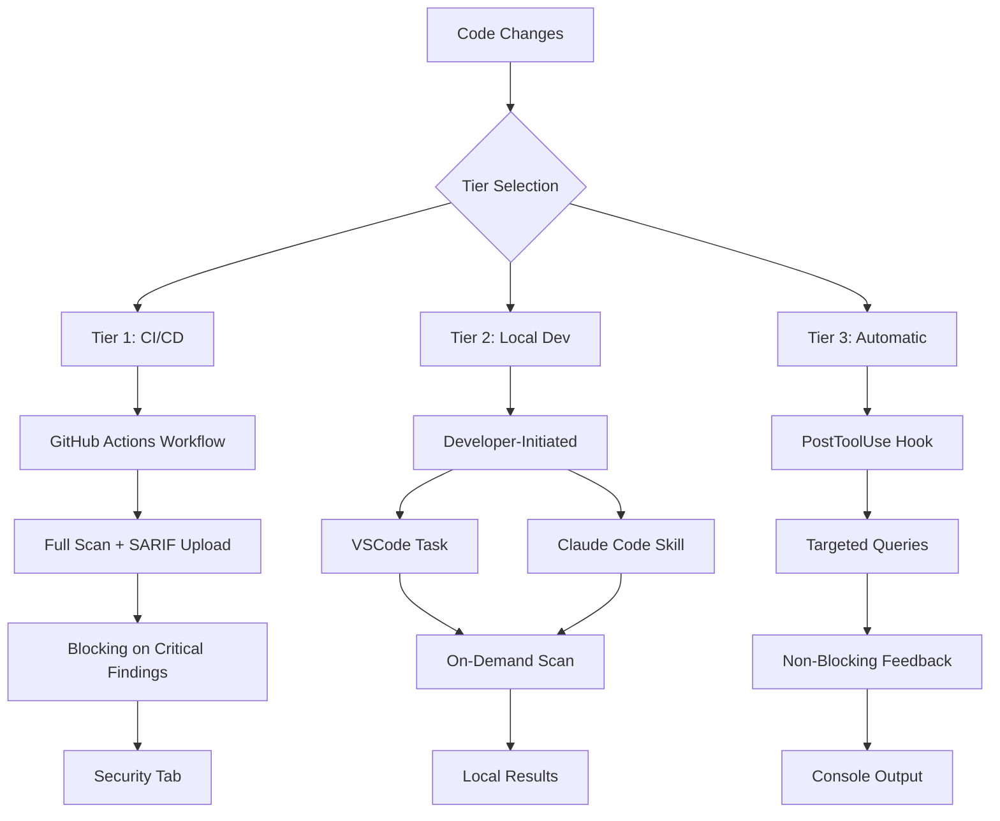

# CodeQL Integration Guide

This guide covers the complete CodeQL security analysis integration across CI/CD, local development, and automatic scanning workflows.

## Overview

CodeQL is a semantic code analysis engine that helps identify security vulnerabilities and coding errors. This repository implements a multi-tier CodeQL integration strategy providing:

- **Tier 1 (CI/CD)**: Automated security scanning on all pull requests with SARIF upload to GitHub Security tab
- **Tier 2 (Local Development)**: Developer-initiated scans via VSCode tasks and Claude Code skills
- **Tier 3 (Automatic)**: Non-blocking PostToolUse hook for targeted security feedback during development

**Supported Languages**:

- Python
- GitHub Actions workflows

**Benefits**:

- Early vulnerability detection before code review
- Consistent security standards across all contributions
- Fast feedback during development with database caching
- Graceful degradation when CLI unavailable

---

## Quick Start

### One-Command Setup

```powershell
# Install CodeQL CLI and configure all integrations
pwsh .codeql/scripts/Install-CodeQLIntegration.ps1
```

This installs:

- CodeQL CLI (latest version)
- Shared configuration
- VSCode integration
- Claude Code skill
- PostToolUse hook

### Quick Scan

```powershell
# Full repository scan
pwsh .codeql/scripts/Invoke-CodeQLScan.ps1

# Quick scan with caching
pwsh .codeql/scripts/Invoke-CodeQLScan.ps1 -UseCache
```

---

## Installation Guide

### Prerequisites

- **PowerShell 7.5.4+**: Cross-platform PowerShell (`pwsh`)
- **Internet connection**: For downloading CodeQL CLI
- **Disk space**: ~500MB for CodeQL CLI and databases

### Installation Steps

#### 1. Install CodeQL CLI

```powershell
# Download and install CodeQL CLI
pwsh .codeql/scripts/Install-CodeQL.ps1

# Add to PATH (optional, for command-line access)
pwsh .codeql/scripts/Install-CodeQL.ps1 -AddToPath
```

**Verification**:

```powershell
# Check CLI version
.codeql/cli/codeql version
```

Expected output:

```text
CodeQL command-line toolchain release 2.23.9.
```

#### 2. Configure Integration

```powershell
# Install all integration components
pwsh .codeql/scripts/Install-CodeQLIntegration.ps1
```

This configures:

- Shared configuration at `.github/codeql/codeql-config.yml`
- Quick scan configuration at `.github/codeql/codeql-config-quick.yml`
- VSCode tasks and settings
- Claude Code skill
- PostToolUse hook

#### 3. Verify Configuration

```powershell
# Validate configuration files
pwsh .codeql/scripts/Test-CodeQLConfig.ps1
```

**Expected output**:

```text
[PASS] Configuration file exists
[PASS] YAML syntax valid
[PASS] Query packs resolvable
[PASS] Configuration ready
```

---

## Usage Examples

### Full Repository Scan

Scans all supported languages with complete query packs:

```powershell
pwsh .codeql/scripts/Invoke-CodeQLScan.ps1
```

**Output**: SARIF results at `.codeql/results/codeql-results.sarif`

**Duration**: ~30-60 seconds (first run), ~10-20 seconds (with cache)

### Quick Scan with Cache

Uses cached databases for faster feedback:

```powershell
pwsh .codeql/scripts/Invoke-CodeQLScan.ps1 -UseCache
```

**Cache invalidation triggers**:

- Git HEAD changes (new commits)
- Configuration file updates
- Forced rebuild with `-Force` flag

### Language-Specific Scan

Scan only specific language:

```powershell
# Python only
pwsh .codeql/scripts/Invoke-CodeQLScan.ps1 -Languages "python"

# GitHub Actions only
pwsh .codeql/scripts/Invoke-CodeQLScan.ps1 -Languages "actions"
```

### Configuration Validation

Verify configuration before scanning:

```powershell
# Validate configuration
pwsh .codeql/scripts/Test-CodeQLConfig.ps1

# Verbose diagnostics
pwsh .codeql/scripts/Get-CodeQLDiagnostics.ps1
```

### Claude Code Skill

```bash
# Via skill system
/codeql-scan

# Direct invocation
pwsh .claude/skills/codeql-scan/scripts/Invoke-CodeQLScanSkill.ps1 -Operation full
pwsh .claude/skills/codeql-scan/scripts/Invoke-CodeQLScanSkill.ps1 -Operation quick
```

---

## Multi-Tier Integration



### Tier 1: CI/CD Integration

**Workflow**: `.github/workflows/codeql-analysis.yml`

**Triggers**:

- All pull requests
- Pushes to main branch
- Manual workflow dispatch

**Behavior**:

- Scans all supported languages
- Uploads SARIF to GitHub Security tab
- Blocks merge if critical findings detected
- Results visible in PR checks

**Configuration**: Shared config at `.github/codeql/codeql-config.yml`

**Timeout**: 300 seconds (5 minutes)

### Tier 2: Local Development

**VSCode Tasks** (`.vscode/tasks.json`):

- `CodeQL: Full Scan` - Complete repository analysis
- `CodeQL: Quick Scan` - Fast scan with caching
- `CodeQL: Validate Config` - Configuration check

**Claude Code Skill** (`.claude/skills/codeql-scan/`):

```bash
/codeql-scan  # Interactive skill
```

**Features**:

- Database caching for fast iterations
- Immediate feedback without waiting for CI
- Same query packs as CI for consistency

### Tier 3: Automatic Scanning

**PostToolUse Hook** (`.claude/hooks/PostToolUse/Invoke-CodeQLQuickScan.ps1`):

**Triggers**:

- After Edit, Write, or NotebookEdit tool use
- When files match Python or Actions patterns

**Behavior**:

- Runs targeted security queries (CWE-078, CWE-079, CWE-089, CWE-022, CWE-798)
- Non-blocking (errors don't halt workflow)
- Quick scan configuration (5-10 critical queries)
- Graceful degradation when CLI unavailable

**Timeout**: 30 seconds

**Configuration**: Quick config at `.github/codeql/codeql-config-quick.yml`

---

## Configuration

### Shared Configuration

**File**: `.github/codeql/codeql-config.yml`

```yaml
name: "CodeQL Config"

queries:
  - uses: security-extended

paths:
  - .github/workflows
  - .claude/hooks
  - .codeql/scripts
  - scripts

paths-ignore:
  - tests
  - "**/*.Tests.ps1"
  - "**/*.md"
```

**Query Packs**:

- `security-extended`: Security vulnerabilities + common coding errors
- Custom packs can be added via `uses:` directive

**Severity Filtering**: Configured in workflow (error, warning, note)

### Quick Scan Configuration

**File**: `.github/codeql/codeql-config-quick.yml`

```yaml
name: "CodeQL Quick Config"

queries:
  - uses: security-extended
    tags:
      - security
      - cwe-078  # Command injection
      - cwe-079  # XSS
      - cwe-089  # SQL injection
      - cwe-022  # Path traversal
      - cwe-798  # Hard-coded credentials
```

**Purpose**: Fast targeted scans for PostToolUse hook

**Queries**: 5-10 critical security patterns

**Performance**: ~5-15 seconds vs ~30-60 seconds for full scan

### Customization

#### Adding New Languages

1. Update `.github/codeql/codeql-config.yml`:

   ```yaml
   languages:
     - python
     - actions
     - javascript  # Add new language
   ```

2. Update workflow `.github/workflows/codeql-analysis.yml`:

   ```yaml
   strategy:
     matrix:
       language: [python, actions, javascript]
   ```

#### Adding Custom Queries

```yaml
queries:
  - uses: security-extended
  - uses: ./custom-queries  # Local query pack
  - uses: owner/repo/query-pack@version  # Remote pack
```

#### Excluding Paths

```yaml
paths-ignore:
  - vendor/**
  - third-party/**
  - "**/*.generated.*"
```

---

## Troubleshooting

### CLI Not Found

**Error**:

```text
CodeQL CLI not found at .codeql/cli/codeql
```

**Solution**:

```powershell
# Install CodeQL CLI
pwsh .codeql/scripts/Install-CodeQL.ps1

# Verify installation
.codeql/cli/codeql version
```

### Configuration Validation Failed

**Error**:

```text
[FAIL] YAML syntax invalid
```

**Solution**:

```powershell
# Validate YAML syntax
pwsh .codeql/scripts/Test-CodeQLConfig.ps1

# Check for common issues:
# - Incorrect indentation
# - Missing quotes around paths with special characters
# - Invalid query pack references
```

### Scan Timeout

**Error**:

```text
Scan exceeded timeout of 300 seconds
```

**Solutions**:

```powershell
# Option 1: Scan specific language
pwsh .codeql/scripts/Invoke-CodeQLScan.ps1 -Languages "python"

# Option 2: Increase timeout (in workflow YAML)
timeout-minutes: 10

# Option 3: Use quick scan for faster feedback
pwsh .codeql/scripts/Invoke-CodeQLScan.ps1 -UseCache
```

### Cache Invalidation Issues

**Symptom**: Old results despite code changes

**Solutions**:

```powershell
# Force database rebuild
pwsh .codeql/scripts/Invoke-CodeQLScan.ps1 -Force

# Clear cache manually
Remove-Item -Recurse -Force .codeql/db
```

### Hook Not Triggering

**Symptom**: PostToolUse hook not running

**Verification**:

```powershell
# Check hook exists
Test-Path .claude/hooks/PostToolUse/Invoke-CodeQLQuickScan.ps1

# Check hook permissions
Get-Item .claude/hooks/PostToolUse/Invoke-CodeQLQuickScan.ps1 | Select-Object -ExpandProperty Mode

# Manual test
pwsh .claude/hooks/PostToolUse/Invoke-CodeQLQuickScan.ps1 -FilePath "example.py" -ToolName "Edit"
```

**Common Issues**:

- Hook not executable: Set executable permissions
- CLI not installed: Run `Install-CodeQL.ps1`
- Configuration invalid: Run `Test-CodeQLConfig.ps1`

### Database Creation Failed

**Error**:

```text
Failed to create CodeQL database
```

**Solutions**:

```powershell
# Run diagnostics
pwsh .codeql/scripts/Get-CodeQLDiagnostics.ps1

# Check for:
# - Unsupported language
# - Syntax errors in source files
# - Insufficient disk space
# - Permission issues
```

---

## FAQ

### When should I use full scan vs quick scan?

**Full Scan** (`Invoke-CodeQLScan.ps1`):

- Before creating PR
- After major refactoring
- When investigating security concerns
- Weekly security audit

**Quick Scan** (`Invoke-CodeQLScan.ps1 -UseCache`):

- During active development
- After small changes
- For fast feedback loops
- Via PostToolUse hook

### How does database caching work?

**Cache Location**: `.codeql/db/`

**Invalidation Triggers**:

- Git HEAD changes (new commits)
- Configuration file modifications
- Source file changes in scanned paths
- Manual force rebuild with `-Force`

**Benefits**:

- 3-5x faster scans
- Reduces CI/CD time
- Enables frequent local scanning

### What languages are supported?

**Current**:

- Python (`.py` files)
- GitHub Actions (`.github/workflows/*.yml`)

**Potential**:

- JavaScript/TypeScript
- C#
- Java
- Go
- Ruby

See [CodeQL language support](https://codeql.github.com/docs/codeql-overview/supported-languages-and-frameworks/) for complete list.

### How do I add custom queries?

**Local Query Pack**:

1. Create `.codeql/custom-queries/` directory
2. Add `qlpack.yml` defining pack
3. Add `.ql` query files
4. Reference in configuration:

   ```yaml
   queries:
     - uses: ./custom-queries
   ```

**Remote Query Pack**:

```yaml
queries:
  - uses: owner/repo/pack@version
```

### What happens if scan finds vulnerabilities?

**CI/CD (Tier 1)**:

- SARIF uploaded to Security tab
- PR check fails for critical findings
- Results shown in PR diff view
- Merge blocked until fixed

**Local Development (Tier 2)**:

- Results in `.codeql/results/codeql-results.sarif`
- Summary shown in console
- Developer reviews and fixes

**Automatic (Tier 3)**:

- Console warning with CWE reference
- Non-blocking (development continues)
- Suggestion to run full scan

### How do I exclude false positives?

**Option 1**: Suppress in code (language-specific)

```python
# Python example
result = subprocess.run(command, shell=True)  # codeql[py/command-injection]
```

**Option 2**: Exclude path in configuration

```yaml
paths-ignore:
  - path/to/false-positive.py
```

**Option 3**: Custom query pack filtering specific patterns

### Why is the hook non-blocking?

**Design Decision**: PostToolUse hook provides feedback without interrupting workflow

**Benefits**:

- Developer remains in flow state
- Graceful degradation when CLI unavailable
- Fast feedback without blocking progress

**Trade-off**: Developer may miss warnings if not paying attention

**Mitigation**: CI/CD blocks merge for critical findings

---

## Related Documentation

- **Claude Code Skill**: [.claude/skills/codeql-scan/SKILL.md](../.claude/skills/codeql-scan/SKILL.md)
- **CI/CD Workflow**: [.github/workflows/codeql-analysis.yml](../.github/workflows/codeql-analysis.yml)
- **Test Workflow**: [.github/workflows/test-codeql-integration.yml](../.github/workflows/test-codeql-integration.yml)
- **Architecture Details**: [codeql-architecture.md](./codeql-architecture.md)
- **Installation Scripts**:
  - [Install-CodeQL.ps1](../.codeql/scripts/Install-CodeQL.ps1)
  - [Install-CodeQLIntegration.ps1](../.codeql/scripts/Install-CodeQLIntegration.ps1)
- **Scanning Scripts**:
  - [Invoke-CodeQLScan.ps1](../.codeql/scripts/Invoke-CodeQLScan.ps1)
  - [Test-CodeQLConfig.ps1](../.codeql/scripts/Test-CodeQLConfig.ps1)
  - [Get-CodeQLDiagnostics.ps1](../.codeql/scripts/Get-CodeQLDiagnostics.ps1)

---

## Support

For issues or questions:

1. **Diagnostics**: Run `pwsh .codeql/scripts/Get-CodeQLDiagnostics.ps1`
2. **Validation**: Run `pwsh .codeql/scripts/Test-CodeQLConfig.ps1`
3. **Documentation**: See [CodeQL documentation](https://codeql.github.com/docs/)
4. **Repository Issues**: [GitHub Issues](https://github.com/rjmurillo/ai-agents/issues)
