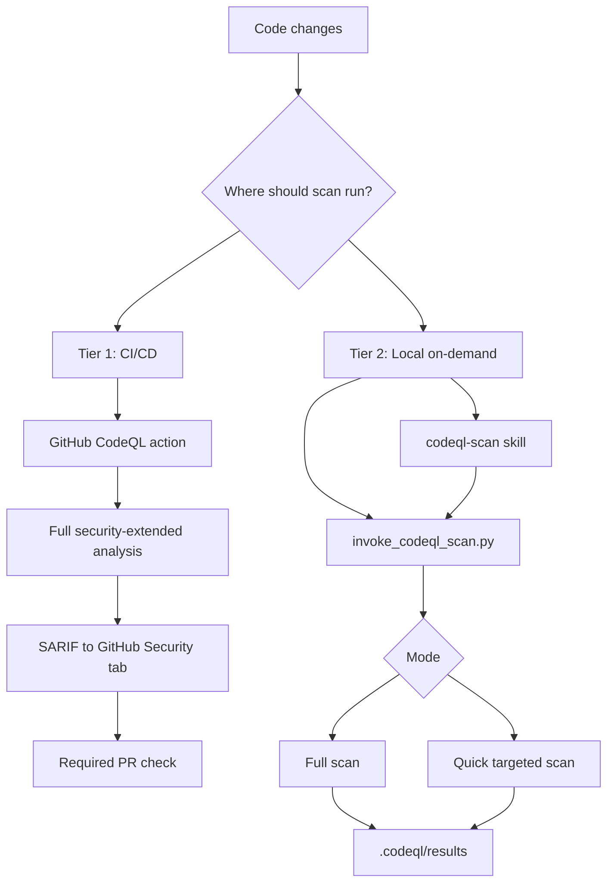

# CodeQL Integration Guide

This guide explains how to install, run, and troubleshoot the current CodeQL integration. The implementation uses Python scripts in `.codeql/scripts/`, shared configs in `.github/codeql/`, and a two-tier strategy from ADR-041 as amended on 2026-07-21.

The automatic edit-time hook was retired on 2026-07-21. Quick scans are still available on demand through `--quick-scan`. A portable automatic rebuild is deferred to issue #3219.

---

## Overview

CodeQL is a semantic code analysis engine for security findings and code-quality defects. This repository uses it in two live tiers:

- **Tier 1 (CI/CD)**: GitHub's native CodeQL action runs as a blocking PR gate and uploads SARIF to the GitHub Security tab.
- **Tier 2 (Local, on-demand)**: Developers and agents run the `codeql-scan` skill or `.codeql/scripts/invoke_codeql_scan.py` directly.

**Supported local script languages today**:

- Python
- GitHub Actions workflows

The checked-in CI workflow matrix currently runs CodeQL for `actions` and `python`.

**Benefits**:

- Security findings appear before merge.
- Local scans let builders fix issues before opening a PR.
- CI and local scans share `.github/codeql/codeql-config.yml` by default.
- Quick local scans use `.github/codeql/codeql-config-quick.yml` through `--quick-scan`.

---

## Quick Start

### One-Command Setup

```bash
python3 .codeql/scripts/install_codeql_integration.py
```

This integration installer can install or configure:

- CodeQL CLI.
- VS Code integration.
- Claude Code `codeql-scan` skill.
- Pre-commit verification.

Use skip flags when you only want part of the setup:

```bash
python3 .codeql/scripts/install_codeql_integration.py --skip-vscode --skip-pre-commit
```

### Full Scan

```bash
python3 .codeql/scripts/invoke_codeql_scan.py
```

Defaults:

- Repository path: `.` or `CODEQL_REPO_PATH`.
- Config path: `.github/codeql/codeql-config.yml` or `CODEQL_CONFIG_PATH`.
- Database path: `.codeql/db` or `CODEQL_DATABASE_PATH`.
- Results path: `.codeql/results` or `CODEQL_RESULTS_PATH`.
- Output format: `console`.

### Quick Scan

```bash
python3 .codeql/scripts/invoke_codeql_scan.py --quick-scan --use-cache
```

With the default config path, `--quick-scan` switches to `.github/codeql/codeql-config-quick.yml`.

---

## Installation Guide

### Prerequisites

- Python 3.
- Internet access for downloading the CodeQL CLI.
- Disk space for the CLI, databases, and SARIF results.
- Standard `tar` with gzip support. The installer downloads a `.tar.gz` bundle and extracts it with `tar -xzf`, so it does not need `zstd`.

### 1. Install CodeQL CLI

```bash
python3 .codeql/scripts/install_codeql.py --ci --force
```

Optional flags:

```bash
python3 .codeql/scripts/install_codeql.py --version VERSION
python3 .codeql/scripts/install_codeql.py --install-path .codeql/cli
python3 .codeql/scripts/install_codeql.py --add-to-path
```

Verify the CLI:

```bash
.codeql/cli/codeql version
```

### 2. Configure Integration

```bash
python3 .codeql/scripts/install_codeql_integration.py
```

Available flags:

| Flag | Use when |
|------|----------|
| `--skip-cli` | The CLI is already installed. |
| `--skip-vscode` | You do not want editor configuration. |
| `--skip-claude-skill` | You do not want the Claude Code skill installed. |
| `--skip-pre-commit` | You do not want pre-commit verification. |
| `--ci` | The command runs in automation. |

### 3. Verify Configuration

```bash
python3 .codeql/scripts/test_codeql_config.py --ci
```

JSON output is available for automation:

```bash
python3 .codeql/scripts/test_codeql_config.py --format json --ci
```

---

## Usage Examples

### Full Repository Scan

```bash
python3 .codeql/scripts/invoke_codeql_scan.py
```

Use this before opening a PR or after larger changes.

Expected local outputs:

- CodeQL databases under `.codeql/db`.
- SARIF files under `.codeql/results`.
- Console summary by default.

### Quick Targeted Scan

```bash
python3 .codeql/scripts/invoke_codeql_scan.py --quick-scan --use-cache
```

Use this during active development when you want faster feedback from targeted queries.

### Language-Specific Scan

```bash
python3 .codeql/scripts/invoke_codeql_scan.py --languages python
python3 .codeql/scripts/invoke_codeql_scan.py --languages actions
python3 .codeql/scripts/invoke_codeql_scan.py --languages python actions
```

### Output Formats

```bash
python3 .codeql/scripts/invoke_codeql_scan.py --format console
python3 .codeql/scripts/invoke_codeql_scan.py --format sarif
python3 .codeql/scripts/invoke_codeql_scan.py --format json
```

### CI Behavior

```bash
python3 .codeql/scripts/invoke_codeql_scan.py --ci
```

In CI mode, the scan exits 1 when findings are detected.

### Diagnostics

```bash
python3 .codeql/scripts/get_codeql_diagnostics.py --output-format console
python3 .codeql/scripts/get_codeql_diagnostics.py --output-format json
python3 .codeql/scripts/get_codeql_diagnostics.py --output-format markdown
```

### Claude Code Skill

```bash
/codeql-scan
```

The skill wraps the same local scanning path. Its documented direct wrapper supports full, quick, and validate operations:

```bash
python3 .claude/skills/codeql-scan/scripts/invoke_codeql_scan.py --operation full
python3 .claude/skills/codeql-scan/scripts/invoke_codeql_scan.py --operation quick
python3 .claude/skills/codeql-scan/scripts/invoke_codeql_scan.py --operation validate
```

---

## Two-Tier Integration


```mermaid
flowchart TD
    Change[Code changes] --> Choice{Where should scan run?}
    Choice --> CI[Tier 1: CI/CD]
    Choice --> Local[Tier 2: Local on-demand]

    CI --> Native[GitHub CodeQL action]
    Native --> Full[Full security-extended analysis]
    Full --> Upload[SARIF to GitHub Security tab]
    Upload --> Gate[Required PR check]

    Local --> Skill[codeql-scan skill]
    Local --> Script[invoke_codeql_scan.py]
    Skill --> Script
    Script --> Mode{Mode}
    Mode --> FullLocal[Full scan]
    Mode --> Quick[Quick targeted scan]
    FullLocal --> Results[.codeql/results]
    Quick --> Results
```

### Tier 1: CI/CD Integration

**Workflow**: `.github/workflows/codeql-analysis.yml`

**Triggers**:

- Push to `main`.
- Pull request to `main`.
- Weekly schedule, Monday 09:00 UTC, cron `0 9 * * 1`.
- Manual dispatch.

**Behavior**:

- Runs on all PRs to satisfy required status checks.
- Uses `check-paths` to skip analysis when no scannable files changed.
- Uses GitHub's native CodeQL action.
- Uploads SARIF to the GitHub Security tab.
- Uses `.github/codeql/codeql-config.yml`.
- Filters out low severity findings and recommendations.

**Timeout budget**: 300 seconds for the CodeQL analysis path.

### Tier 2: Local On-Demand Scanning

**Entry points**:

- `/codeql-scan` skill.
- `.codeql/scripts/invoke_codeql_scan.py`.
- Optional editor tasks installed by the integration installer.

**Common commands**:

```bash
python3 .codeql/scripts/invoke_codeql_scan.py
python3 .codeql/scripts/invoke_codeql_scan.py --quick-scan --use-cache
python3 .codeql/scripts/invoke_codeql_scan.py --languages python --format json
```

**Timeout budget**: 60 seconds by default.

### Retired Automatic Edit-Time Scanning

The automatic edit-time hook was retired on 2026-07-21. Do not troubleshoot, reinstall, or extend it. Use explicit quick scans for fast feedback:

```bash
python3 .codeql/scripts/invoke_codeql_scan.py --quick-scan --use-cache
```

The portable rebuild is tracked by issue #3219.

---

## Configuration

### Shared Configuration

**File**: `.github/codeql/codeql-config.yml`

This config is used by the CI workflow and local scans by default.

Key settings:

- `disable-default-queries: false`.
- Packs for `actions` and `python` security-extended suites.
- `queries: security-extended`.
- Query filters exclude low severity and recommendation-tagged findings.
- Paths include scripts, GitHub automation, Claude skills, hooks, and build code.
- Paths ignore tests, `.agents/`, docs, and Markdown.

### Quick Scan Configuration

**File**: `.github/codeql/codeql-config-quick.yml`

This config is selected by `invoke_codeql_scan.py --quick-scan` when using the default config path.

It targets:

- Command injection.
- SQL injection.
- Cross-site scripting.
- Path traversal.
- Hardcoded credentials.

### Customization

#### Adding New Languages

Only document a language as supported after the workflow and config both support it.

1. Update `.github/workflows/codeql-analysis.yml`.
2. Update `.github/codeql/codeql-config.yml`.
3. Add targeted queries to `.github/codeql/codeql-config-quick.yml` if quick coverage is available.
4. Validate config.
5. Run a local scan for that language.

```bash
python3 .codeql/scripts/test_codeql_config.py --ci
python3 .codeql/scripts/invoke_codeql_scan.py --languages python --ci
```

#### Adding Custom Queries

Add trusted query packs to `.github/codeql/codeql-config.yml`:

```yaml
packs:
  - codeql/actions-queries:codeql-suites/actions-security-extended.qls
  - codeql/python-queries:codeql-suites/python-security-extended.qls
```

Then validate:

```bash
python3 .codeql/scripts/test_codeql_config.py --ci
```

#### Excluding Paths

Add ignores under `paths-ignore` in `.github/codeql/codeql-config.yml`:

```yaml
paths-ignore:
  - tests/
  - .agents/
  - docs/
  - '**/*.md'
```

Keep exclusions narrow. Each exclusion removes security coverage.

---

## Troubleshooting

### CLI Not Found

**Symptom**:

```text
CodeQL CLI not found
```

**Fix**:

```bash
python3 .codeql/scripts/install_codeql.py --ci --force
.codeql/cli/codeql version
```

### Configuration Validation Failed

**Fix**:

```bash
python3 .codeql/scripts/test_codeql_config.py --ci --format console
```

Check:

- YAML syntax.
- Query pack names.
- Paths under `.github/codeql/`.

### Scan Timeout

**Fix options**:

```bash
# Scan one language
python3 .codeql/scripts/invoke_codeql_scan.py --languages python

# Use cached databases
python3 .codeql/scripts/invoke_codeql_scan.py --use-cache

# Use targeted quick scan
python3 .codeql/scripts/invoke_codeql_scan.py --quick-scan --use-cache
```

### Cache Problems

**Symptom**: results do not reflect recent code changes.

**Fix options**:

```bash
# Run without cache
python3 .codeql/scripts/invoke_codeql_scan.py

# Write databases to a fresh project-local path
python3 .codeql/scripts/invoke_codeql_scan.py --database-path .codeql/db-fresh
```

Do not commit local database directories.

### Retired Hook Questions

The automatic edit-time hook no longer ships. If a guide or comment tells you to test it, that source is stale. Use the explicit quick scan command instead:

```bash
python3 .codeql/scripts/invoke_codeql_scan.py --quick-scan --use-cache
```

### Database Creation Failed

Run diagnostics:

```bash
python3 .codeql/scripts/get_codeql_diagnostics.py --output-format markdown
```

Check:

- CLI installation.
- Config file path.
- Disk space.
- File permissions.
- Supported language value.

---

## FAQ

### When should I use full scan vs quick scan?

Use full scan before opening a PR, after broad changes, or when investigating a security-sensitive path:

```bash
python3 .codeql/scripts/invoke_codeql_scan.py
```

Use quick scan during active development:

```bash
python3 .codeql/scripts/invoke_codeql_scan.py --quick-scan --use-cache
```

### How does database caching work?

Local databases live under `.codeql/db` by default. Pass `--use-cache` when you want the script to reuse valid cached databases:

```bash
python3 .codeql/scripts/invoke_codeql_scan.py --use-cache
```

### What languages are supported?

The checked-in CI workflow currently scans the `actions` and `python` matrix entries. Local scans accept languages through:

```bash
python3 .codeql/scripts/invoke_codeql_scan.py --languages python actions
```

### What happens if scan finds vulnerabilities?

- Local default mode reports findings to the selected output format.
- Local `--ci` mode exits 1 when findings are detected.
- CI uploads SARIF and uses the workflow gate to block merge when configured blocking findings are present.

### How do I exclude false positives?

Prefer fixing the code. If a finding is a true false positive, document the reason in the code or CodeQL configuration and keep the suppression narrow.

### Why is automatic edit-time scanning retired?

The retired hook was not registered in active hook surfaces and did not run. The ADR-041 amendment removed that dead path and kept the useful parts: CI enforcement and explicit local scans. Issue #3219 tracks a portable rebuild.

---

## Related Documentation

- [CodeQL architecture](./codeql-architecture.md)
- [CodeQL rollout checklist](./codeql-rollout-checklist.md)
- [ADR-041: CodeQL Integration Multi-Tier Strategy](../.agents/architecture/ADR-041-codeql-integration.md), amended 2026-07-21 to two tiers.
- [ADR-042: Python Migration Strategy](../.agents/architecture/ADR-042-python-migration-strategy.md)
- [CodeQL documentation](https://codeql.github.com/docs/)
- [GitHub CodeQL action](https://github.com/github/codeql-action)

## Support

For local setup failures, run diagnostics first:

```bash
python3 .codeql/scripts/get_codeql_diagnostics.py --output-format markdown
```

For CI failures, inspect `.github/workflows/codeql-analysis.yml`, the uploaded SARIF artifact, and the GitHub Security tab.
